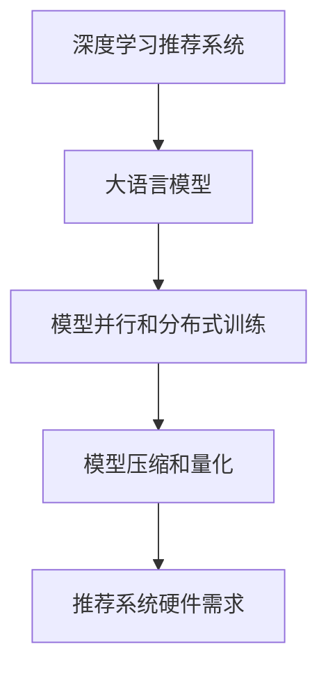

                 

## 1. 背景介绍

### 1.1 问题由来

随着互联网技术的蓬勃发展，个性化推荐系统在各行各业得到了广泛应用。从电商平台的商品推荐，到视频网站的影视推荐，再到新闻应用的头条推送，个性化推荐技术逐渐成为了提升用户体验的重要手段。然而，尽管个性化推荐系统取得了显著的效果，但其背后却面临着巨大的计算成本。

当前，推荐系统主要依赖深度学习模型进行训练和推理。这些模型通常具有庞大的参数规模，需要大量的计算资源进行训练，同时，在推理时也需要高效的处理能力以应对海量请求。以大型互联网公司为例，单日需处理的推荐请求往往在数十亿次以上，这无疑对硬件提出了极高的要求。

## 2. 核心概念与联系

### 2.1 核心概念概述

为更好地理解LLM在推荐系统中的应用及其硬件需求，本节将介绍几个密切相关的核心概念：

- **深度学习推荐系统**：通过深度神经网络模型对用户历史行为和偏好进行学习，预测用户可能感兴趣的新商品或内容。
- **大语言模型(Large Language Model, LLM)**：通过大规模无标签文本数据的预训练，学习丰富的语言知识和常识，具备强大的自然语言理解和生成能力。
- **推荐系统硬件需求**：指推荐系统在训练和推理过程中，所需的计算资源、内存、存储等硬件设备。
- **模型并行和分布式训练**：通过多个硬件设备同时参与训练，加速模型收敛过程，提高计算效率。
- **模型压缩和量化**：通过减少模型参数规模，优化计算图，提升推理速度和降低存储需求。

这些概念之间的逻辑关系可以通过以下Mermaid流程图来展示：



这个流程图展示了大语言模型在推荐系统中的应用，以及与推荐系统硬件需求之间的关系：

1. 深度学习推荐系统依赖大语言模型进行用户行为分析和内容推荐。
2. 大语言模型在推荐系统中通过模型并行和分布式训练，快速训练模型。
3. 分布式训练的模型需要进行模型压缩和量化，优化硬件资源利用率。
4. 优化后的模型仍然需要大量的硬件资源支持推理，满足推荐系统的实时性要求。

这些概念共同构成了LLM在推荐系统中的学习与应用框架，使其能够有效支撑推荐系统的构建和运行。

## 3. 核心算法原理 & 具体操作步骤

### 3.1 算法原理概述

基于大语言模型的推荐系统主要分为两个阶段：预训练和微调。预训练阶段通过大规模无标签文本数据的预训练，学习语言表示和特征提取能力。微调阶段通过与推荐系统相关的小规模标注数据进行有监督学习，优化模型对推荐任务的适应能力。

在大规模推荐系统中，为了应对大规模计算需求，常常采用模型并行和分布式训练技术，将大规模模型拆分成多个小规模模型，并在多个硬件设备上同时训练。分布式训练通过数据并行、模型并行、混合并行等技术，显著提升了模型训练的效率。

## 3.2 算法步骤详解

以下详细介绍基于大语言模型的推荐系统在预训练和微调阶段的具体操作步骤。

### 3.2.1 预训练阶段

1. **数据收集**：收集大规模无标签文本数据，如维基百科、新闻文章、社交媒体等。
2. **数据预处理**：对文本数据进行分词、清洗、去除停用词等预处理操作。
3. **构建模型**：使用大语言模型架构，如Transformer等，构建预训练模型。
4. **模型训练**：在分布式环境中使用GPU或TPU等硬件设备，进行模型训练。
5. **模型压缩和量化**：对训练好的模型进行压缩和量化，减少参数规模，优化计算图。

### 3.2.2 微调阶段

1. **数据收集**：收集推荐系统相关的小规模标注数据，如用户历史行为、商品标签等。
2. **数据预处理**：对标注数据进行归一化、标准化等预处理操作。
3. **模型加载**：将预训练模型加载到推理设备上。
4. **微调训练**：使用标注数据对预训练模型进行微调，优化推荐任务的性能。
5. **模型推理**：在生产环境中，对新用户请求进行推理，预测推荐结果。

### 3.3 算法优缺点

基于大语言模型的推荐系统具有以下优点：

1. **泛化能力**：大语言模型通过大规模无标签文本数据的预训练，学习丰富的语言知识和常识，具备较强的泛化能力。
2. **高效性**：通过模型并行和分布式训练技术，可以有效降低推荐系统硬件需求。
3. **自适应性**：大语言模型能够根据用户行为和偏好进行动态调整，适应不断变化的用户需求。

同时，该方法也存在一定的局限性：

1. **高硬件需求**：尽管采用分布式训练技术，但大语言模型仍需大量的计算资源进行训练和推理。
2. **训练时间长**：大规模无标签文本数据的预训练需要耗费大量时间，无法快速迭代。
3. **数据依赖性强**：推荐系统的效果很大程度上依赖于标注数据的质量和数量。
4. **复杂度**：模型架构复杂，需要大量的硬件和计算资源支持。

尽管存在这些局限性，但就目前而言，基于大语言模型的推荐系统仍是大规模推荐系统的主流范式。未来相关研究的重点在于如何进一步降低推荐系统的硬件需求，提高模型的少样本学习和跨领域迁移能力，同时兼顾可解释性和伦理安全性等因素。

### 3.4 算法应用领域

基于大语言模型的推荐系统在电商、媒体、金融等多个领域得到了广泛应用，如：

- **电商推荐**：如淘宝、京东等电商平台，通过分析用户历史购买行为，推荐相关商品。
- **视频推荐**：如YouTube、B站等视频网站，根据用户观看历史和行为，推荐相关视频内容。
- **新闻推荐**：如今日头条、网易新闻等应用，通过分析用户阅读历史，推荐相关新闻内容。
- **广告推荐**：如Google AdSense，通过分析用户浏览行为，推荐相关广告内容。

此外，基于大语言模型的推荐系统还在智能家居、智慧城市、个性化教育等领域得到了应用，为各行业的数字化转型提供了新的技术路径。

## 4. 数学模型和公式 & 详细讲解

### 4.1 数学模型构建

假设推荐系统中的预训练模型为 $M_{\theta}$，其中 $\theta$ 为模型参数。训练数据集为 $D=\{(x_i, y_i)\}_{i=1}^N$，其中 $x_i$ 为用户行为数据，$y_i$ 为推荐结果。模型的目标是最小化预测误差：

$$
\min_{\theta} \sum_{i=1}^N \ell(M_{\theta}(x_i), y_i)
$$

其中 $\ell$ 为损失函数，常用的有均方误差、交叉熵等。

### 4.2 公式推导过程

以交叉熵损失函数为例，假设模型的预测输出为 $p(y_i|x_i)$，则交叉熵损失函数为：

$$
\ell(M_{\theta}(x_i), y_i) = -y_i\log p(y_i|x_i) - (1-y_i)\log(1-p(y_i|x_i))
$$

将训练数据集带入损失函数，得到总损失函数：

$$
\mathcal{L}(\theta) = -\frac{1}{N}\sum_{i=1}^N y_i\log p(y_i|x_i) - (1-y_i)\log(1-p(y_i|x_i))
$$

在优化目标函数时，通常使用梯度下降等优化算法，更新模型参数 $\theta$，使得预测误差最小化。

## 5. 项目实践：代码实例和详细解释说明

### 5.1 开发环境搭建

在进行推荐系统开发前，我们需要准备好开发环境。以下是使用Python进行PyTorch开发的环境配置流程：

1. 安装Anaconda：从官网下载并安装Anaconda，用于创建独立的Python环境。

2. 创建并激活虚拟环境：
```bash
conda create -n pytorch-env python=3.8 
conda activate pytorch-env
```

3. 安装PyTorch：根据CUDA版本，从官网获取对应的安装命令。例如：
```bash
conda install pytorch torchvision torchaudio cudatoolkit=11.1 -c pytorch -c conda-forge
```

4. 安装Transformer库：
```bash
pip install transformers
```

5. 安装各类工具包：
```bash
pip install numpy pandas scikit-learn matplotlib tqdm jupyter notebook ipython
```

完成上述步骤后，即可在`pytorch-env`环境中开始推荐系统开发。

### 5.2 源代码详细实现

接下来，我们以电商平台商品推荐系统为例，给出使用Transformers库对BERT模型进行推荐系统微调的PyTorch代码实现。

首先，定义推荐系统数据处理函数：

```python
from transformers import BertTokenizer
from torch.utils.data import Dataset
import torch

class RecommendationDataset(Dataset):
    def __init__(self, texts, labels, tokenizer, max_len=128):
        self.texts = texts
        self.labels = labels
        self.tokenizer = tokenizer
        self.max_len = max_len
        
    def __len__(self):
        return len(self.texts)
    
    def __getitem__(self, item):
        text = self.texts[item]
        label = self.labels[item]
        
        encoding = self.tokenizer(text, return_tensors='pt', max_length=self.max_len, padding='max_length', truncation=True)
        input_ids = encoding['input_ids'][0]
        attention_mask = encoding['attention_mask'][0]
        
        # 对label进行编码
        encoded_label = [int(label)] 
        encoded_label.extend([0]*(self.max_len - len(encoded_label)))
        labels = torch.tensor(encoded_label, dtype=torch.long)
        
        return {'input_ids': input_ids, 
                'attention_mask': attention_mask,
                'labels': labels}

# 标签与id的映射
label2id = {0: 0, 1: 1}
id2label = {v: k for k, v in label2id.items()}

# 创建dataset
tokenizer = BertTokenizer.from_pretrained('bert-base-cased')

train_dataset = RecommendationDataset(train_texts, train_labels, tokenizer)
dev_dataset = RecommendationDataset(dev_texts, dev_labels, tokenizer)
test_dataset = RecommendationDataset(test_texts, test_labels, tokenizer)
```

然后，定义模型和优化器：

```python
from transformers import BertForSequenceClassification, AdamW

model = BertForSequenceClassification.from_pretrained('bert-base-cased', num_labels=2)

optimizer = AdamW(model.parameters(), lr=2e-5)
```

接着，定义训练和评估函数：

```python
from torch.utils.data import DataLoader
from tqdm import tqdm
from sklearn.metrics import classification_report

device = torch.device('cuda') if torch.cuda.is_available() else torch.device('cpu')
model.to(device)

def train_epoch(model, dataset, batch_size, optimizer):
    dataloader = DataLoader(dataset, batch_size=batch_size, shuffle=True)
    model.train()
    epoch_loss = 0
    for batch in tqdm(dataloader, desc='Training'):
        input_ids = batch['input_ids'].to(device)
        attention_mask = batch['attention_mask'].to(device)
        labels = batch['labels'].to(device)
        model.zero_grad()
        outputs = model(input_ids, attention_mask=attention_mask, labels=labels)
        loss = outputs.loss
        epoch_loss += loss.item()
        loss.backward()
        optimizer.step()
    return epoch_loss / len(dataloader)

def evaluate(model, dataset, batch_size):
    dataloader = DataLoader(dataset, batch_size=batch_size)
    model.eval()
    preds, labels = [], []
    with torch.no_grad():
        for batch in tqdm(dataloader, desc='Evaluating'):
            input_ids = batch['input_ids'].to(device)
            attention_mask = batch['attention_mask'].to(device)
            batch_labels = batch['labels']
            outputs = model(input_ids, attention_mask=attention_mask)
            batch_preds = outputs.logits.argmax(dim=1).to('cpu').tolist()
            batch_labels = batch_labels.to('cpu').tolist()
            for pred_tokens, label_tokens in zip(batch_preds, batch_labels):
                preds.append(pred_tokens[:len(label_tokens)])
                labels.append(label_tokens)
                
    print(classification_report(labels, preds))
```

最后，启动训练流程并在测试集上评估：

```python
epochs = 5
batch_size = 16

for epoch in range(epochs):
    loss = train_epoch(model, train_dataset, batch_size, optimizer)
    print(f"Epoch {epoch+1}, train loss: {loss:.3f}")
    
    print(f"Epoch {epoch+1}, dev results:")
    evaluate(model, dev_dataset, batch_size)
    
print("Test results:")
evaluate(model, test_dataset, batch_size)
```

以上就是使用PyTorch对BERT进行商品推荐系统微调的完整代码实现。可以看到，得益于Transformers库的强大封装，我们可以用相对简洁的代码完成BERT模型的加载和微调。

### 5.3 代码解读与分析

让我们再详细解读一下关键代码的实现细节：

**RecommendationDataset类**：
- `__init__`方法：初始化文本、标签、分词器等关键组件。
- `__len__`方法：返回数据集的样本数量。
- `__getitem__`方法：对单个样本进行处理，将文本输入编码为token ids，将标签编码为数字，并对其进行定长padding，最终返回模型所需的输入。

**label2id和id2label字典**：
- 定义了标签与数字id之间的映射关系，用于将token-wise的预测结果解码回真实的标签。

**训练和评估函数**：
- 使用PyTorch的DataLoader对数据集进行批次化加载，供模型训练和推理使用。
- 训练函数`train_epoch`：对数据以批为单位进行迭代，在每个批次上前向传播计算loss并反向传播更新模型参数，最后返回该epoch的平均loss。
- 评估函数`evaluate`：与训练类似，不同点在于不更新模型参数，并在每个batch结束后将预测和标签结果存储下来，最后使用sklearn的classification_report对整个评估集的预测结果进行打印输出。

**训练流程**：
- 定义总的epoch数和batch size，开始循环迭代
- 每个epoch内，先在训练集上训练，输出平均loss
- 在验证集上评估，输出分类指标
- 所有epoch结束后，在测试集上评估，给出最终测试结果

可以看到，PyTorch配合Transformers库使得BERT微调的代码实现变得简洁高效。开发者可以将更多精力放在数据处理、模型改进等高层逻辑上，而不必过多关注底层的实现细节。

当然，工业级的系统实现还需考虑更多因素，如模型的保存和部署、超参数的自动搜索、更灵活的任务适配层等。但核心的微调范式基本与此类似。

## 6. 实际应用场景

### 6.1 电商平台推荐系统

基于大语言模型的推荐系统可以广泛应用于电商平台的商品推荐中。电商平台通常需要向用户推荐相关商品，提升用户体验和销售额。推荐系统通过分析用户历史购买行为，预测用户可能感兴趣的新商品，从而实现精准推荐。

在技术实现上，可以收集用户历史浏览、点击、购买等行为数据，提取商品标题、描述、标签等文本内容。将文本内容作为模型输入，用户的后续行为（如是否点击、购买等）作为监督信号，在此基础上对BERT等大语言模型进行微调。微调后的模型能够从文本内容中准确把握用户的兴趣点。在生成推荐列表时，先用候选商品的相关文本作为输入，由模型预测用户的兴趣匹配度，再结合其他特征综合排序，便可以得到个性化程度更高的推荐结果。

### 6.2 视频推荐系统

视频推荐系统可以根据用户历史观看行为，推荐相关视频内容。推荐系统通过分析用户观看历史和行为，预测用户可能感兴趣的视频，从而实现精准推荐。

在技术实现上，可以收集用户历史观看行为数据，提取视频标题、描述、标签等文本内容。将文本内容作为模型输入，用户的后续行为（如是否观看、点赞等）作为监督信号，在此基础上对BERT等大语言模型进行微调。微调后的模型能够从文本内容中准确把握用户的兴趣点。在生成推荐列表时，先用候选视频的相关文本作为输入，由模型预测用户的兴趣匹配度，再结合其他特征综合排序，便可以得到个性化程度更高的推荐结果。

### 6.3 广告推荐系统

广告推荐系统可以根据用户浏览行为，推荐相关广告内容。推荐系统通过分析用户浏览历史和行为，预测用户可能感兴趣的广告，从而实现精准推荐。

在技术实现上，可以收集用户浏览行为数据，提取广告标题、描述、标签等文本内容。将文本内容作为模型输入，用户的后续行为（如是否点击、购买等）作为监督信号，在此基础上对BERT等大语言模型进行微调。微调后的模型能够从文本内容中准确把握用户的兴趣点。在生成推荐列表时，先用候选广告的相关文本作为输入，由模型预测用户的兴趣匹配度，再结合其他特征综合排序，便可以得到个性化程度更高的推荐结果。

## 7. 工具和资源推荐

### 7.1 学习资源推荐

为了帮助开发者系统掌握大语言模型在推荐系统中的应用，这里推荐一些优质的学习资源：

1. 《深度学习推荐系统》课程：斯坦福大学开设的NLP明星课程，有Lecture视频和配套作业，带你入门NLP领域的基本概念和经典模型。

2. CS224N《自然语言处理与深度学习》课程：斯坦福大学开设的NLP经典课程，涵盖自然语言处理的基本理论和深度学习技术，包括推荐系统的相关内容。

3. 《推荐系统实战》书籍：介绍推荐系统从数据处理、模型选择到系统部署的全过程，适合实战操作。

4. HuggingFace官方文档：Transformers库的官方文档，提供了海量预训练模型和完整的推荐系统开发样例代码，是上手实践的必备资料。

5. TensorFlow官方文档：TensorFlow配套的推荐系统开发文档，涵盖TFRecommender、KerasRecommender等推荐模块，是推荐系统开发的重要参考。

通过对这些资源的学习实践，相信你一定能够快速掌握大语言模型在推荐系统中的应用，并用于解决实际的推荐问题。

### 7.2 开发工具推荐

高效的开发离不开优秀的工具支持。以下是几款用于大语言模型推荐系统开发的常用工具：

1. PyTorch：基于Python的开源深度学习框架，灵活动态的计算图，适合快速迭代研究。大部分推荐系统相关预训练语言模型都有PyTorch版本的实现。

2. TensorFlow：由Google主导开发的开源深度学习框架，生产部署方便，适合大规模工程应用。同样有丰富的推荐系统相关预训练语言模型资源。

3. Transformers库：HuggingFace开发的NLP工具库，集成了众多SOTA语言模型，支持PyTorch和TensorFlow，是推荐系统开发的重要工具。

4. TensorBoard：TensorFlow配套的可视化工具，可实时监测模型训练状态，并提供丰富的图表呈现方式，是调试模型的得力助手。

5. Weights & Biases：模型训练的实验跟踪工具，可以记录和可视化模型训练过程中的各项指标，方便对比和调优。

6. Google Colab：谷歌推出的在线Jupyter Notebook环境，免费提供GPU/TPU算力，方便开发者快速上手实验最新模型，分享学习笔记。

合理利用这些工具，可以显著提升推荐系统开发的效率，加快创新迭代的步伐。

### 7.3 相关论文推荐

大语言模型在推荐系统中的应用源于学界的持续研究。以下是几篇奠基性的相关论文，推荐阅读：

1. Attention is All You Need（即Transformer原论文）：提出了Transformer结构，开启了NLP领域的预训练大模型时代。

2. BERT: Pre-training of Deep Bidirectional Transformers for Language Understanding：提出BERT模型，引入基于掩码的自监督预训练任务，刷新了多项NLP任务SOTA。

3. 深度学习推荐系统：介绍了推荐系统从数据处理、模型选择到系统部署的全过程，涵盖深度学习模型的应用。

4. Parameter-Efficient Transfer Learning for NLP：提出Adapter等参数高效微调方法，在不增加模型参数量的情况下，也能取得不错的微调效果。

5. 基于深度学习的大规模推荐系统：介绍大规模推荐系统的算法和实现技术，包括深度学习模型在推荐系统中的应用。

这些论文代表了大语言模型在推荐系统中的应用发展脉络。通过学习这些前沿成果，可以帮助研究者把握学科前进方向，激发更多的创新灵感。

## 8. 总结：未来发展趋势与挑战

### 8.1 总结

本文对基于大语言模型的推荐系统进行了全面系统的介绍。首先阐述了大语言模型在推荐系统中的应用背景和意义，明确了推荐系统在大数据时代的重要性。其次，从原理到实践，详细讲解了大语言模型在推荐系统中的应用流程，包括预训练和微调两个阶段。同时，本文还广泛探讨了推荐系统在大规模电商、视频、广告等多个领域的应用前景，展示了推荐系统范式的巨大潜力。此外，本文精选了推荐系统的各类学习资源，力求为读者提供全方位的技术指引。

通过本文的系统梳理，可以看到，基于大语言模型的推荐系统已经在电商、媒体、广告等多个领域得到广泛应用，为各行各业带来了显著的用户体验提升和商业价值。未来，伴随大语言模型和推荐技术的不断发展，推荐系统将会在更多场景中发挥重要作用，为各行各业带来新的变革。

### 8.2 未来发展趋势

展望未来，大语言模型在推荐系统中的应用将呈现以下几个发展趋势：

1. **模型规模持续增大**：随着算力成本的下降和数据规模的扩张，预训练语言模型的参数量还将持续增长。超大规模语言模型蕴含的丰富语言知识，有望支撑更加复杂多变的推荐任务。

2. **推荐算法多样性增加**：推荐系统将不再局限于深度学习模型，将探索更多样化的推荐算法，如基于图模型的推荐、基于规则的推荐等。

3. **实时性要求提升**：随着推荐系统的应用场景和用户期望的提升，推荐系统的实时性要求将更高。分布式训练、边缘计算等技术将进一步应用于推荐系统，以提升实时响应能力。

4. **用户隐私保护加强**：在推荐系统应用中，用户隐私保护将成为重要考虑因素。通过差分隐私、联邦学习等技术，推荐系统将逐步实现对用户隐私的保护。

5. **个性化推荐精细化**：推荐系统将更加注重个性化推荐效果，通过联合兴趣模型、上下文模型等多种方式，实现对用户兴趣的精细化刻画。

6. **推荐内容多样化**：推荐系统不仅推荐商品，还将推广内容、提供服务、进行活动推送等，推荐内容将更加多样化。

以上趋势凸显了大语言模型在推荐系统中的应用前景。这些方向的探索发展，必将进一步提升推荐系统的性能和用户满意度，为各行各业带来新的变革。

### 8.3 面临的挑战

尽管大语言模型在推荐系统中取得了显著效果，但在迈向更加智能化、普适化应用的过程中，它仍面临着诸多挑战：

1. **高硬件需求**：尽管采用分布式训练技术，但大语言模型仍需大量的计算资源进行训练和推理。GPU/TPU等高性能设备是必不可少的，但即便如此，超大批次的训练和推理也可能遇到显存不足的问题。

2. **训练时间长**：大规模无标签文本数据的预训练需要耗费大量时间，无法快速迭代。预训练阶段对硬件和时间的要求较高，增加了推荐系统开发的周期。

3. **数据依赖性强**：推荐系统的效果很大程度上依赖于标注数据的质量和数量。数据质量和数据量的不足，可能导致模型性能的不稳定性。

4. **计算成本高**：大规模推荐系统需要大量的计算资源进行训练和推理，对硬件设施和电力消耗要求较高，增加了推荐系统的成本。

5. **模型可解释性不足**：推荐系统通常是一个"黑盒"系统，难以解释其内部工作机制和决策逻辑。对于医疗、金融等高风险应用，算法的可解释性和可审计性尤为重要。

6. **模型安全性有待加强**：推荐系统容易受到恶意攻击和数据泄露的风险，如何保护模型安全，防止模型被恶意利用，是推荐系统需要考虑的重要问题。

尽管存在这些挑战，但大语言模型在推荐系统中的应用前景依然广阔。未来的研究需要在以下几个方面寻求新的突破：

1. **降低推荐系统的计算需求**：通过模型压缩、量化等技术，优化计算图，减少推理时间和资源消耗。

2. **引入无监督和半监督学习**：探索基于自监督、主动学习的推荐算法，利用非结构化数据进行推荐系统训练。

3. **加强用户隐私保护**：通过差分隐私、联邦学习等技术，保护用户隐私，增强推荐系统的安全性和可信度。

4. **提高模型可解释性**：引入可解释性算法，解释推荐系统的决策过程，增强模型的可信度和透明度。

5. **优化推荐系统部署架构**：引入边缘计算等技术，减少推荐系统对中心服务器的依赖，提升实时响应能力。

6. **探索新型的推荐算法**：引入更多样化的推荐算法，如基于图模型的推荐、基于规则的推荐等，增强推荐系统的多样性和灵活性。

只有不断突破技术瓶颈，才能更好地推动推荐系统的应用和普及，实现个性化推荐在更多场景下的落地。总之，推荐系统仍需不断优化和完善，以满足用户不断变化的需求和期望。

### 8.4 研究展望

面对推荐系统面临的诸多挑战，未来的研究需要在以下几个方面寻求新的突破：

1. **探索无监督和半监督推荐算法**：引入无监督和半监督学习，探索基于自监督、主动学习的推荐算法，利用非结构化数据进行推荐系统训练。

2. **优化推荐系统硬件需求**：通过模型压缩、量化等技术，优化计算图，减少推理时间和资源消耗。

3. **加强用户隐私保护**：通过差分隐私、联邦学习等技术，保护用户隐私，增强推荐系统的安全性和可信度。

4. **提高模型可解释性**：引入可解释性算法，解释推荐系统的决策过程，增强模型的可信度和透明度。

5. **优化推荐系统部署架构**：引入边缘计算等技术，减少推荐系统对中心服务器的依赖，提升实时响应能力。

6. **探索新型的推荐算法**：引入更多样化的推荐算法，如基于图模型的推荐、基于规则的推荐等，增强推荐系统的多样性和灵活性。

这些研究方向的探索，必将引领推荐系统技术迈向更高的台阶，为各行各业带来新的变革。面向未来，推荐系统需要不断优化和完善，以满足用户不断变化的需求和期望。总之，推荐系统仍需不断优化和完善，以满足用户不断变化的需求和期望。

## 9. 附录：常见问题与解答

**Q1：为什么大语言模型在推荐系统中需要大量的计算资源？**

A: 大语言模型通常具有庞大的参数规模，需要进行大规模的矩阵运算和梯度计算，导致训练和推理需要大量的计算资源。此外，大语言模型在推荐系统中需要进行多轮迭代训练和推理，进一步增加了计算需求。

**Q2：如何优化大语言模型的硬件需求？**

A: 优化大语言模型的硬件需求，主要可以通过以下几种方式：

1. **模型压缩和量化**：通过剪枝、蒸馏等技术，减少模型参数规模，优化计算图，提高推理速度和降低存储需求。

2. **分布式训练**：通过模型并行和数据并行等技术，将大规模模型拆分成多个小规模模型，在多个硬件设备上同时训练，提高训练效率。

3. **使用更高效的硬件**：GPU/TPU等高性能设备可以有效提升模型训练和推理的效率，减少硬件资源的占用。

4. **算法优化**：引入如AdamW等高效的优化算法，可以加速模型收敛，减少训练时间。

5. **数据优化**：通过数据增强、正则化等技术，优化数据集质量，减少过拟合风险。

这些技术措施可以显著降低大语言模型在推荐系统中的硬件需求，提高系统效率和性能。

**Q3：如何提高推荐系统的实时性？**

A: 提高推荐系统的实时性，主要可以通过以下几种方式：

1. **分布式训练和推理**：通过分布式训练和推理技术，将大规模模型拆分成多个小规模模型，在多个硬件设备上同时训练和推理，提高系统响应速度。

2. **缓存和负载均衡**：通过数据缓存和负载均衡技术，减少模型访问和数据读取的时间，提高推荐速度。

3. **模型压缩和量化**：通过模型压缩和量化技术，减少模型参数规模和计算复杂度，提高推理速度。

4. **预训练和微调分离**：将预训练和微调阶段分离，先在大规模数据上进行预训练，再在少量数据上进行微调，提高微调效率。

5. **边缘计算**：将部分模型和推理功能部署在边缘设备上，减少对中心服务器的依赖，提高响应速度。

这些技术措施可以显著提高推荐系统的实时性，满足用户对推荐系统的实时需求。

**Q4：如何保护用户隐私？**

A: 保护用户隐私，主要可以通过以下几种方式：

1. **差分隐私**：通过引入噪声，对用户数据进行扰动，保护用户隐私不被泄露。

2. **联邦学习**：通过在本地设备上进行模型训练，减少数据传输和存储，保护用户隐私。

3. **匿名化**：对用户数据进行匿名化处理，隐藏用户个人信息，保护用户隐私。

4. **安全多方计算**：通过多方协作，在不共享数据的情况下，完成模型训练和推理，保护用户隐私。

5. **访问控制**：通过身份验证、权限控制等技术，限制对用户数据的访问，保护用户隐私。

这些技术措施可以有效保护用户隐私，增强推荐系统的安全性和可信度。

---

作者：禅与计算机程序设计艺术 / Zen and the Art of Computer Programming

