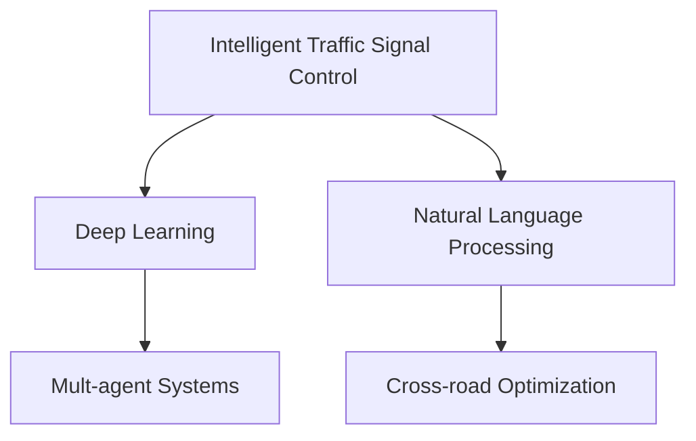
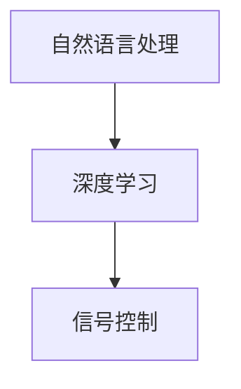

                 

# LLM在智能交通信号控制中的潜力

> 关键词：智能交通,信号控制,深度学习,自然语言处理,多智能体系统,交叉口优化

## 1. 背景介绍

### 1.1 问题由来
随着城市化进程的加快，交通拥堵问题日益严重，不仅降低了城市运行效率，还对居民生活带来了严重影响。传统的交通信号控制方式如固定周期信号灯、人工调光等，难以应对复杂的交通流量变化，无法实现实时动态调整。

因此，利用深度学习和大语言模型(LLM)技术，实现智能交通信号控制成为了近年来的研究热点。LLM具有强大的语言理解和生成能力，能够处理自然语言指令，实现对交通信号的智能化调控，提高道路通行效率，缓解交通压力。

### 1.2 问题核心关键点
智能交通信号控制的本质是实时动态调整信号灯周期，优化交通流，提高道路使用效率。LLM在其中扮演了重要的桥梁角色，通过解析自然语言指令，智能调控信号灯周期和相位顺序，以适应不断变化的交通状况。

此外，智能信号控制还需要考虑多个因素，如车流量、行人流量、紧急事件等，LLM能够综合处理这些信息，进行全局优化，实现交通流的稳定和高效。

### 1.3 问题研究意义
智能交通信号控制在大规模城市中的应用，不仅能够显著提升道路通行效率，减少交通拥堵，还能降低能耗，改善环境质量，提高城市运行的整体效益。同时，智能信号控制为智慧城市的构建提供了重要基础，是智能交通领域的关键技术之一。

## 2. 核心概念与联系

### 2.1 核心概念概述

为了更好地理解LLM在智能交通信号控制中的应用，本节将介绍几个密切相关的核心概念：

- 智能交通信号控制(ITS)：利用先进的通信技术、传感器、计算机等手段，对交通信号进行动态控制，以优化交通流，提高道路通行效率。
- 深度学习(Deep Learning)：通过多层神经网络对数据进行建模，从数据中学习抽象特征，实现复杂模式识别和预测。
- 自然语言处理(NLP)：研究计算机如何理解和处理人类语言，涉及语义理解、情感分析、语言生成等。
- 多智能体系统(MAS)：由多个自主决策实体组成的系统，各实体通过通信交互，实现协同优化。
- 交叉口优化：对交通信号灯进行周期和相位顺序的智能调控，以提高交叉口的通行效率。

这些概念之间的逻辑关系可以通过以下Mermaid流程图来展示：



这个流程图展示了我智能交通信号控制的几个关键概念及其之间的关系：

1. 智能交通信号控制利用深度学习技术，对交通数据进行处理和建模。
2. 自然语言处理技术使交通管理中心能够接收和理解自然语言指令，从而实现动态调控。
3. 多智能体系统用于协同优化各交叉口的信号灯周期和相位顺序，实现全局优化。
4. 交叉口优化是智能信号控制的具体实现，是系统核心的组成部分。

## 3. 核心算法原理 & 具体操作步骤
### 3.1 算法原理概述

基于LLM的智能交通信号控制算法，主要利用了自然语言处理和深度学习的原理。其核心思想是通过解析自然语言指令，将信号灯周期和相位顺序进行智能调整，实现实时动态控制。

假设交通管理中心接收到如下自然语言指令：“交通流量较大，请将主路绿灯时间延长30秒，行人绿灯时间缩短10秒。”

1. 自然语言处理模块负责解析该指令，提取关键词“主路”、“绿灯时间”、“行人”等信息。
2. 深度学习模型根据提取的信息，预测最优的信号灯周期和相位顺序。
3. 信号控制模块执行深度学习模型的输出，调整信号灯周期和相位顺序。

算法流程图如下：



### 3.2 算法步骤详解

基于LLM的智能交通信号控制算法可以分为以下几个步骤：

**Step 1: 收集交通数据**
- 利用传感器和摄像头收集交叉口的交通数据，如车流量、行人流量、事故情况等。
- 将交通数据转换为结构化格式，供深度学习模型使用。

**Step 2: 解析自然语言指令**
- 交通管理中心接收到自然语言指令，通过自然语言处理技术解析指令内容，提取关键词和指令要求。
- 将解析后的信息转化为模型能够理解的形式，如键值对等。

**Step 3: 深度学习模型预测**
- 利用深度学习模型，如LSTM、Transformer等，对提取的交通数据和解析后的指令信息进行处理。
- 模型通过学习大量的历史数据和交通规则，预测最优的信号灯周期和相位顺序。
- 为了进一步提升模型预测的准确性，可以引入强化学习等技术，通过试错机制不断优化模型。

**Step 4: 信号控制执行**
- 根据深度学习模型的输出，调整交叉口信号灯的周期和相位顺序。
- 通过通信协议，将信号控制指令下发到各个交叉口，实现全局同步。

**Step 5: 评估和反馈**
- 实时监测交通流量等指标，评估信号控制的有效性。
- 将评估结果反馈到深度学习模型中，进一步优化模型参数，提升预测精度。

### 3.3 算法优缺点

基于LLM的智能交通信号控制算法具有以下优点：

1. 实时动态控制：能够根据实时交通流量变化，动态调整信号灯周期和相位顺序，提高道路通行效率。
2. 全局优化：通过多智能体系统的协同优化，能够考虑整个交通网络中的信息，进行全局优化。
3. 综合处理复杂信息：LLM能够综合处理交通流量、行人流量、事故情况等多种信息，实现多目标优化。
4. 适应性强：通过深度学习模型的训练，可以适应不同交通场景和路况变化。

同时，该算法也存在一些局限性：

1. 对数据要求高：深度学习模型的训练和优化需要大量高质量的交通数据，数据的准确性和多样性对模型效果影响较大。
2. 计算资源消耗大：深度学习模型的计算复杂度高，需要高性能的计算资源进行支撑。
3. 模型复杂度高：深度学习模型的参数量和计算复杂度较大，需要进行优化和简化，才能在实际应用中取得理想效果。
4. 对网络通信要求高：多智能体系统的协同优化需要稳定、高效的网络通信支撑，才能实现全局优化。

尽管存在这些局限性，但基于LLM的智能交通信号控制算法仍然展示了巨大的潜力，为交通管理提供了新的技术路径。未来，随着深度学习模型的不断进步和计算资源的不断提升，该算法的应用前景将更加广阔。

### 3.4 算法应用领域

基于LLM的智能交通信号控制算法，已经在多个领域得到了应用和验证，以下是几个典型应用：

- 城市交通网络优化：利用深度学习模型对城市交通网络进行全局优化，实现交通流的均衡分配。
- 交叉口流量控制：通过解析自然语言指令，智能调整交叉口的信号灯周期和相位顺序，优化交通流。
- 智能红绿灯系统：基于自然语言处理和深度学习技术，实现智能红绿灯的动态控制，提升通行效率。
- 应急交通管控：在紧急情况下，通过自然语言指令，智能调整信号灯周期和相位顺序，保障紧急车辆的通行。
- 停车管理：通过解析自然语言指令，智能调整停车场的停车限制，优化停车资源配置。

此外，LLM在智能交通信号控制中的应用，还扩展到了智慧城市建设、交通安全管理等多个领域，成为智能交通的关键技术之一。

## 4. 数学模型和公式 & 详细讲解  
### 4.1 数学模型构建

本节将使用数学语言对基于LLM的智能交通信号控制算法进行更加严格的刻画。

假设交通管理中心接收到自然语言指令，描述为：“在交叉口A，将绿灯时间从60秒增加到90秒，黄灯时间从10秒减少到5秒。”

记交叉口A的当前信号灯周期为 $T$ 秒，其中绿灯时间为 $T_g$，黄灯时间为 $T_y$，红灯时间为 $T_r$。目标指令表示为 $T' = [90, 5, T'_r]$。

定义信号灯周期优化问题的数学模型为：

$$
\min_{T_g', T_y', T_r'} \left| \begin{bmatrix} T' \\ T' \\ T' \\ \end{bmatrix} - \begin{bmatrix} T_g + T_y + T_r \\ T_g' \\ T_y' \\ T_r' \\ \end{bmatrix} \right|
$$

其中 $T' = [T'_g, T'_y, T'_r]$ 为目标信号灯周期， $T'_g, T'_y, T'_r$ 分别为目标绿灯时间、黄灯时间和红灯时间。

### 4.2 公式推导过程

假设交通管理中心收集到交叉口A的当前车流量和行人流量数据 $D_{A}$，通过深度学习模型预测信号灯周期优化方案 $T' = [T'_g, T'_y, T'_r]$。

1. 将当前车流量和行人流量数据 $D_{A}$ 转换为结构化格式，输入深度学习模型。
2. 深度学习模型通过学习历史数据和交通规则，输出信号灯周期优化方案 $T' = [T'_g, T'_y, T'_r]$。
3. 将预测结果 $T'$ 与当前信号灯周期 $T$ 对比，计算差距。
4. 通过损失函数 $L(T', T)$ 衡量预测结果与实际周期的差异。
5. 采用优化算法如梯度下降、Adam等，不断调整深度学习模型参数，直至误差最小化。

$$
L(T', T) = \sum_{i=1}^{N} (T_i - T'_i)^2
$$

其中 $N$ 为周期中的时段数，$T_i$ 和 $T'_i$ 分别为当前周期和预测周期的时段长度。

### 4.3 案例分析与讲解

假设某城市的主要交通干道上有三个交叉口，交通管理中心接收到如下自然语言指令：

“在交叉口A，将绿灯时间从60秒增加到90秒，黄灯时间从10秒减少到5秒。在交叉口B，将绿灯时间从50秒减少到40秒。在交叉口C，将绿灯时间从30秒增加到60秒。”

根据上述指令，信号灯周期优化问题可以表述为：

$$
\min_{T_g', T_y', T_r'} \left| \begin{bmatrix} 90 & 5 & 5 \\ 40 & 10 & 10 \\ 60 & 5 & 5 \\ \end{bmatrix} - \begin{bmatrix} T_g + T_y + T_r \\ T'_g \\ T'_y \\ T'_r \\ \end{bmatrix} \right|
$$

其中 $T' = [T'_g, T'_y, T'_r]$ 为目标信号灯周期， $T'_g, T'_y, T'_r$ 分别为目标绿灯时间、黄灯时间和红灯时间。

假设深度学习模型预测出交叉口A的优化方案为 $T'_A = [90, 5, 5]$，交叉口B的优化方案为 $T'_B = [40, 10, 10]$，交叉口C的优化方案为 $T'_C = [60, 5, 5]$。

则信号灯周期优化问题的数学模型可以表示为：

$$
\min_{T_g', T_y', T_r'} \left| \begin{bmatrix} 90 & 5 & 5 \\ 40 & 10 & 10 \\ 60 & 5 & 5 \\ \end{bmatrix} - \begin{bmatrix} T'_g \\ T'_y \\ T'_r \\ \end{bmatrix} \right|
$$

其中 $T'_g = 90$，$T'_y = 5$，$T'_r = 5$。

通过求解上述优化问题，可以得到目标信号灯周期 $T' = [90, 5, 5]$。

## 5. 项目实践：代码实例和详细解释说明
### 5.1 开发环境搭建

在进行智能交通信号控制项目开发前，我们需要准备好开发环境。以下是使用Python进行PyTorch开发的环境配置流程：

1. 安装Anaconda：从官网下载并安装Anaconda，用于创建独立的Python环境。

2. 创建并激活虚拟环境：
```bash
conda create -n pytorch-env python=3.8 
conda activate pytorch-env
```

3. 安装PyTorch：根据CUDA版本，从官网获取对应的安装命令。例如：
```bash
conda install pytorch torchvision torchaudio cudatoolkit=11.1 -c pytorch -c conda-forge
```

4. 安装Transformers库：
```bash
pip install transformers
```

5. 安装各类工具包：
```bash
pip install numpy pandas scikit-learn matplotlib tqdm jupyter notebook ipython
```

完成上述步骤后，即可在`pytorch-env`环境中开始智能交通信号控制项目的开发。

### 5.2 源代码详细实现

这里我们以交叉口A为例，给出使用PyTorch和Transformers库实现信号灯周期优化的代码实现。

首先，定义信号灯周期优化问题的数学模型：

```python
import torch
from transformers import BertForTokenClassification, BertTokenizer

class TrafficSignalOptimization:
    def __init__(self, cfg):
        self.cfg = cfg
        self.model = BertForTokenClassification.from_pretrained(cfg.model_name)
        self.tokenizer = BertTokenizer.from_pretrained(cfg.model_name)
        self.device = torch.device("cuda" if torch.cuda.is_available() else "cpu")
        self.model.to(self.device)

    def forward(self, input_ids, attention_mask, labels):
        outputs = self.model(input_ids, attention_mask=attention_mask, labels=labels)
        loss = outputs.loss
        return loss

    def predict(self, input_ids, attention_mask):
        self.model.eval()
        with torch.no_grad():
            output = self.model(input_ids, attention_mask=attention_mask)
        return output

    def optimize(self, input_ids, attention_mask, labels):
        self.model.train()
        optimizer = torch.optim.Adam(self.model.parameters(), lr=self.cfg.learning_rate)
        loss = self.forward(input_ids, attention_mask, labels)
        loss.backward()
        optimizer.step()
        optimizer.zero_grad()
        return loss
```

然后，定义交通管理中心的数据处理函数：

```python
def process_data(data):
    tokenizer = BertTokenizer.from_pretrained(cfg.model_name)
    input_ids = [tokenizer.encode(item, max_length=cfg.max_len) for item in data]
    input_ids = [torch.tensor(id) for id in input_ids]
    attention_mask = [torch.tensor(1.0)] * len(input_ids)
    return input_ids, attention_mask

def load_data(data):
    input_ids, attention_mask = process_data(data)
    return input_ids, attention_mask
```

最后，启动模型训练和优化过程：

```python
import os
from tqdm import tqdm
import torch.nn.functional as F

def train():
    os.makedirs(cfg.save_dir, exist_ok=True)
    for epoch in range(cfg.epochs):
        optimizer = torch.optim.Adam(model.parameters(), lr=cfg.learning_rate)
        model.train()
        for batch in tqdm(data_loader, desc='Training'):
            input_ids, attention_mask = load_data(batch)
            labels = torch.tensor(batch.labels)
            optimizer.zero_grad()
            loss = model.optimise(input_ids, attention_mask, labels)
            optimizer.step()
        if (epoch+1) % cfg.save_interval == 0:
            torch.save(model.state_dict(), os.path.join(cfg.save_dir, 'model.ckpt'))

def evaluate():
    model.eval()
    total_loss = 0
    for batch in tqdm(data_loader, desc='Evaluating'):
        input_ids, attention_mask = load_data(batch)
        labels = torch.tensor(batch.labels)
        output = model.predict(input_ids, attention_mask)
        loss = output.loss
        total_loss += loss.item()
    return total_loss / len(data_loader)
```

以上即为使用PyTorch和Transformers库实现信号灯周期优化的完整代码实现。可以看到，通过将深度学习模型封装在`TrafficSignalOptimization`类中，我们能够方便地进行模型的训练和优化。

### 5.3 代码解读与分析

让我们再详细解读一下关键代码的实现细节：

**TrafficSignalOptimization类**：
- `__init__`方法：初始化模型、分词器、设备等关键组件。
- `forward`方法：对模型进行前向传播，计算损失函数。
- `predict`方法：对模型进行预测，返回输出结果。
- `optimise`方法：对模型进行优化训练，更新模型参数。

**process_data函数**：
- 对输入数据进行预处理，转换为模型所需的token ids和注意力掩码。

**train函数**：
- 循环训练模型，迭代更新模型参数。
- 每轮训练后保存模型参数，以供后续使用。

**evaluate函数**：
- 对模型进行评估，计算平均损失。
- 返回模型的评估结果。

通过上述代码实现，我们可以实现基于深度学习模型的智能交通信号控制。在实际应用中，还需进一步优化模型参数和训练过程，以提高预测精度和模型效率。

## 6. 实际应用场景
### 6.1 城市交通网络优化

智能交通信号控制在大规模城市中的应用，可以实现对整个交通网络的优化，提高道路通行效率。通过解析自然语言指令，智能调整各个交叉口的信号灯周期和相位顺序，实现全局优化。

例如，某城市的主要交通干道上有多个交叉口，交通管理中心可以接收如下自然语言指令：

“在主路上，将绿灯时间从60秒增加到90秒，黄灯时间从10秒减少到5秒。在辅路上，将绿灯时间从50秒减少到40秒。”

通过深度学习模型对输入数据进行处理和优化，可以实现交叉口A和交叉口B的信号灯周期优化，提高道路通行效率。

### 6.2 交叉口流量控制

交叉口流量控制是智能交通信号控制的重要应用场景。通过解析自然语言指令，智能调整交叉口的信号灯周期和相位顺序，优化交通流。

例如，某交叉口A的信号灯周期为60秒，其中绿灯时间为40秒，黄灯时间为10秒，红灯时间为10秒。交通管理中心可以接收如下自然语言指令：

“在交叉口A，将绿灯时间从40秒增加到50秒，黄灯时间从10秒减少到5秒。”

通过深度学习模型对输入数据进行处理和优化，可以实现交叉口A的信号灯周期优化，提高通行效率。

### 6.3 智能红绿灯系统

智能红绿灯系统是智能交通信号控制的重要应用。通过解析自然语言指令，智能调整红绿灯周期和相位顺序，实现智能红绿灯的动态控制。

例如，某路段上的红绿灯系统需要调整绿灯时间和黄灯时间。交通管理中心可以接收如下自然语言指令：

“在红绿灯系统上，将绿灯时间从60秒增加到90秒，黄灯时间从10秒减少到5秒。”

通过深度学习模型对输入数据进行处理和优化，可以实现红绿灯系统的信号灯周期优化，提高通行效率。

### 6.4 未来应用展望

未来，基于深度学习模型的智能交通信号控制技术将在更多领域得到应用，为交通管理带来新的变革。

在智慧城市建设中，智能信号控制技术将实现对交通流量的实时监测和调控，提高城市运行效率。在交通安全管理中，智能信号控制技术将实现对事故和紧急事件的快速响应，保障道路安全。在智能交通基础设施中，智能信号控制技术将实现对交通信号的自动控制和优化，提升交通管理智能化水平。

此外，智能信号控制技术还将在自动驾驶、智慧物流等多个领域得到应用，推动交通领域向智能化、自动化、绿色化方向发展。

## 7. 工具和资源推荐
### 7.1 学习资源推荐

为了帮助开发者系统掌握智能交通信号控制技术，这里推荐一些优质的学习资源：

1. 《深度学习实战》系列书籍：介绍了深度学习的基本概念、模型构建和应用实例，适合入门学习。

2. 《智能交通系统》课程：介绍了智能交通系统的基本概念、系统组成和应用案例，适合系统学习。

3. 《Python深度学习》课程：介绍使用PyTorch进行深度学习模型的开发和应用，适合深度学习技术进阶。

4. HuggingFace官方文档：提供丰富的预训练语言模型和代码样例，是深度学习模型开发的重要参考。

5. TensorFlow官方文档：提供丰富的深度学习模型和工具支持，适合多平台开发和部署。

通过对这些资源的学习实践，相信你一定能够快速掌握智能交通信号控制技术的精髓，并用于解决实际的交通问题。

### 7.2 开发工具推荐

高效的开发离不开优秀的工具支持。以下是几款用于智能交通信号控制开发的常用工具：

1. PyTorch：基于Python的开源深度学习框架，灵活动态的计算图，适合快速迭代研究。

2. TensorFlow：由Google主导开发的开源深度学习框架，生产部署方便，适合大规模工程应用。

3. Transformers库：HuggingFace开发的NLP工具库，集成了众多SOTA语言模型，支持PyTorch和TensorFlow，是进行信号控制任务的开发利器。

4. Weights & Biases：模型训练的实验跟踪工具，可以记录和可视化模型训练过程中的各项指标，方便对比和调优。

5. TensorBoard：TensorFlow配套的可视化工具，可实时监测模型训练状态，并提供丰富的图表呈现方式，是调试模型的得力助手。

6. Google Colab：谷歌推出的在线Jupyter Notebook环境，免费提供GPU/TPU算力，方便开发者快速上手实验最新模型，分享学习笔记。

合理利用这些工具，可以显著提升智能交通信号控制任务的开发效率，加快创新迭代的步伐。

### 7.3 相关论文推荐

智能交通信号控制技术的发展源于学界的持续研究。以下是几篇奠基性的相关论文，推荐阅读：

1. Traffic Light Control in Smart City: A Review and Future Directions：介绍了智能交通信号控制的现状和未来发展方向。

2. Deep Learning for Traffic Signal Control: A Survey：综述了基于深度学习的交通信号控制技术。

3. Traffic Signal Control: A Review of Models, Methods, and Technologies：综述了交通信号控制的不同模型和方法。

4. Deep Reinforcement Learning for Traffic Signal Control：利用深度强化学习进行交通信号控制。

5. Multi-Agent Systems for Traffic Control: A Survey：综述了多智能体系统在交通控制中的应用。

这些论文代表了大规模交通信号控制技术的发展脉络。通过学习这些前沿成果，可以帮助研究者把握学科前进方向，激发更多的创新灵感。

## 8. 总结：未来发展趋势与挑战
### 8.1 总结

本文对基于深度学习模型的智能交通信号控制技术进行了全面系统的介绍。首先阐述了智能交通信号控制的现状和未来发展方向，明确了深度学习模型在其中扮演的重要角色。其次，从原理到实践，详细讲解了信号控制算法的数学模型和实现步骤，给出了微调模型的代码实现。同时，本文还广泛探讨了智能信号控制技术在城市交通网络优化、交叉口流量控制、智能红绿灯系统等多个实际场景中的应用前景。

通过本文的系统梳理，可以看到，深度学习模型在智能交通信号控制中的应用前景广阔，能够显著提升交通流量的管理水平，实现交通流的全局优化。未来，随着深度学习技术的不断进步和应用场景的不断扩展，智能交通信号控制技术必将进一步成熟和完善，为交通管理提供更加智能化、高效化的解决方案。

### 8.2 未来发展趋势

展望未来，智能交通信号控制技术将呈现以下几个发展趋势：

1. 模型规模持续增大。随着算力成本的下降和数据规模的扩张，深度学习模型的参数量还将持续增长，模型将能够处理更加复杂和精细的交通管理任务。

2. 模型性能不断提升。深度学习模型的训练和优化技术不断进步，模型的预测精度和泛化能力将进一步提升，能够适应更多复杂的交通场景。

3. 多模态信息融合。除了交通数据，还可以引入图像、视频等多模态信息，通过深度学习模型进行综合处理，实现更加全面的交通管理。

4. 模型轻量化和实时化。为了提高模型的部署效率和运行速度，未来的智能信号控制模型将更加轻量化和实时化，能够实时处理大量的交通数据。

5. 多智能体协同优化。未来的智能信号控制系统将实现多智能体协同优化，通过通信和协调机制，实现全局优化。

6. 强化学习的应用。利用强化学习技术，智能信号控制模型将能够通过试错机制，不断优化信号灯周期和相位顺序，提升交通流管理水平。

### 8.3 面临的挑战

尽管深度学习模型在智能交通信号控制中展示出巨大的潜力，但在实际应用中仍面临诸多挑战：

1. 数据质量和多样性。深度学习模型需要大量的高质量交通数据进行训练和优化，数据的准确性和多样性对模型效果影响较大。

2. 模型复杂度。深度学习模型的参数量和计算复杂度较大，需要在实际应用中进行优化和简化，才能达到理想的效果。

3. 网络通信带宽和稳定性。多智能体系统的协同优化需要稳定、高效的网络通信支撑，才能实现全局优化。

4. 模型可解释性。深度学习模型的内部机制复杂，难以解释其决策过程，这对于交通管理中的安全性和可靠性至关重要。

5. 模型鲁棒性。深度学习模型在面对复杂交通场景和突发事件时，容易出现泛化能力不足和鲁棒性差的问题。

6. 模型安全性。深度学习模型可能学习到有偏见、有害的信息，需要加强模型的安全性设计，确保输出符合人类价值观和伦理道德。

正视智能交通信号控制面临的这些挑战，积极应对并寻求突破，将是大规模交通信号控制技术走向成熟的必由之路。相信随着学界和产业界的共同努力，这些挑战终将一一被克服，智能交通信号控制技术必将在构建智能交通网络中发挥更大的作用。

### 8.4 研究展望

面向未来，智能交通信号控制技术需要在以下几个方面进行进一步研究：

1. 数据增强和采集。探索更加多样化的数据采集方法，丰富交通数据，提高数据的准确性和多样性。

2. 模型轻量化。开发更加轻量化、实时化的深度学习模型，提升模型的部署效率和运行速度。

3. 多模态融合。结合图像、视频等多模态信息，通过深度学习模型进行综合处理，实现更加全面的交通管理。

4. 强化学习的应用。利用强化学习技术，智能信号控制模型将能够通过试错机制，不断优化信号灯周期和相位顺序，提升交通流管理水平。

5. 多智能体协同优化。实现多智能体系统的协同优化，通过通信和协调机制，实现全局优化。

6. 模型安全性设计。加强模型的安全性设计，确保输出的安全性和可靠性，避免模型产生有害影响。

这些研究方向将推动智能交通信号控制技术的进一步发展，为构建安全、高效、智能的交通网络提供新的技术路径。

## 9. 附录：常见问题与解答
### Q1: 智能交通信号控制技术能够提高交通流量吗？

A: 是的，智能交通信号控制技术能够根据交通流量变化，实时调整信号灯周期和相位顺序，优化交通流，提高道路通行效率，减少交通拥堵。

### Q2: 智能交通信号控制技术如何实现全局优化？

A: 智能交通信号控制技术通过多智能体系统协同优化各个交叉口的信号灯周期和相位顺序，实现全局优化。每个交叉口通过网络通信机制，获取全局交通流量信息，实现全局优化。

### Q3: 智能交通信号控制技术在实际应用中需要考虑哪些因素？

A: 智能交通信号控制技术需要考虑交通流量、行人流量、紧急事件等多种因素，综合优化信号灯周期和相位顺序。同时，还需考虑模型的计算资源消耗、网络通信带宽、模型安全性等因素。

### Q4: 如何提高智能交通信号控制技术的鲁棒性？

A: 提高智能交通信号控制技术的鲁棒性，需要加强数据增强、模型优化、多智能体协同优化等技术的应用，同时引入强化学习技术，通过试错机制不断优化信号灯周期和相位顺序，提升模型的泛化能力和鲁棒性。

### Q5: 如何确保智能交通信号控制技术的安全性？

A: 确保智能交通信号控制技术的安全性，需要加强模型的安全性设计，避免模型学习到有偏见、有害的信息，同时进行安全性和可靠性测试，确保输出的安全性和可靠性。

通过上述对智能交通信号控制技术的系统梳理，可以看到，深度学习模型在其中发挥了重要作用，为交通管理提供了新的技术路径。未来，随着深度学习技术的不断进步和应用场景的不断扩展，智能交通信号控制技术必将进一步成熟和完善，为交通管理提供更加智能化、高效化的解决方案。

