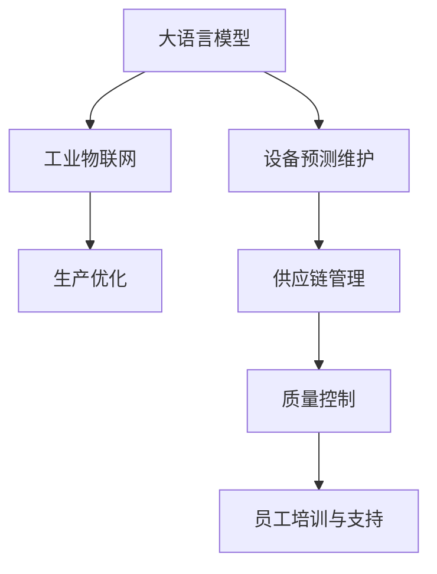

                 

# LLM在智能制造中的应用前景

> 关键词：大语言模型, 智能制造, 工业物联网(IoT), 设备预测维护, 生产优化, 供应链管理, 自然语言处理(NLP)

## 1. 背景介绍

### 1.1 问题由来
随着全球工业4.0的快速推进，智能制造技术正日益成为工业领域的关键驱动力。智能制造涵盖了从设计、生产到物流、服务的全流程智能化改造，旨在通过先进的信息技术和大数据分析，提高生产效率、降低成本、提升产品质量，推动工业持续创新与升级。在这一背景下，大语言模型（Large Language Model, LLM）作为一种前沿的AI技术，以其强大的自然语言理解和生成能力，开始逐步应用于智能制造领域，展现出广阔的应用前景。

### 1.2 问题核心关键点
LLM在智能制造中的应用主要集中在以下几个方面：

- **设备预测维护**：通过分析设备运行数据和历史维护记录，预测设备故障，优化维护计划，减少意外停机，提升设备可靠性。
- **生产优化**：利用语言模型对生产数据进行智能分析，识别瓶颈环节，优化生产流程，提高生产效率。
- **供应链管理**：通过自然语言处理技术，对供应链数据进行自动化分析和处理，优化供应链运作，降低物流成本。
- **质量控制**：利用语言模型对产品文档和质量报告进行自动化分析，提高产品检测的准确性和效率。
- **员工培训与支持**：通过智能对话系统，提供员工培训和支持，提升工作效率，减少误操作。

### 1.3 问题研究意义
LLM在智能制造中的应用不仅能够提升制造业的智能化水平，还能加速工业数据驱动决策的实现，促进工业与信息技术的深度融合。研究LLM在智能制造中的应用前景，对于推动智能制造技术的普及和应用，具有重要意义：

1. **提升生产效率**：通过智能分析和预测，优化生产流程，减少生产中的无效环节，提高生产效率和产品质量。
2. **降低成本**：通过智能预测和维护，减少意外停机，降低维护成本，提高设备利用率。
3. **提高决策质量**：利用LLM对大量数据进行智能化分析，提供科学决策依据，避免依赖经验和直觉，提升决策质量。
4. **推动产业升级**：LLM作为前沿AI技术，其应用能够推动制造业向智能化、数字化、网络化转型，加速工业4.0的进程。

## 2. 核心概念与联系

### 2.1 核心概念概述

为更好地理解LLM在智能制造中的应用，本节将介绍几个密切相关的核心概念：

- **大语言模型 (LLM)**：一种基于深度学习的模型，通过大规模语料库进行预训练，具备强大的自然语言理解和生成能力。常见的LLM包括GPT、BERT等。

- **工业物联网 (IoT)**：将传感器、设备和软件等技术与网络连接，实现设备之间的实时通信和数据共享，提升工业生产的智能化水平。

- **设备预测维护**：利用机器学习和大数据分析技术，预测设备故障，提前进行维护，避免意外停机，提升设备可靠性。

- **生产优化**：通过数据分析和优化算法，优化生产流程，提高生产效率和质量，降低生产成本。

- **供应链管理**：利用智能算法和数据分析技术，优化供应链的各个环节，提高物流效率，降低库存和物流成本。

- **自然语言处理 (NLP)**：涉及计算机对人类语言的理解和生成，是大语言模型的基础，其应用领域广泛，包括文本分类、命名实体识别、机器翻译等。

这些核心概念之间的逻辑关系可以通过以下Mermaid流程图来展示：



这个流程图展示了大语言模型在智能制造中的核心应用场景，以及各个场景之间的逻辑关系。

## 3. 核心算法原理 & 具体操作步骤
### 3.1 算法原理概述

LLM在智能制造中的应用，本质上是通过自然语言处理技术，对工业数据进行处理和分析，从而实现生产优化、设备预测维护等功能。其核心算法包括以下几个方面：

- **文本分类**：利用预训练的分类器，对生产数据、设备状态等进行分类，识别关键问题和异常情况。
- **命名实体识别 (NER)**：从文本中提取出设备名称、故障信息等关键实体，便于后续处理和分析。
- **关系抽取**：从设备状态、维护记录等文本中抽取设备之间的关系，如设备之间的依赖关系、故障传播路径等。
- **意图识别**：对操作员和维护人员的意图进行理解，实现智能对话和自动化提示。
- **情感分析**：分析操作员和维护人员的情感状态，提升服务质量，减少人为错误。

### 3.2 算法步骤详解

基于LLM的智能制造应用一般包括以下几个关键步骤：

**Step 1: 数据收集与预处理**
- 收集生产数据、设备状态、维护记录、操作员日志等工业数据，确保数据的质量和完整性。
- 对数据进行清洗、标注和预处理，包括文本分类、NER、关系抽取等。

**Step 2: 构建LLM模型**
- 选择合适的预训练LLM模型（如GPT、BERT等），根据实际需求调整模型结构。
- 训练模型，利用标注数据对模型进行微调，提高模型在特定任务上的性能。

**Step 3: 模型部署与集成**
- 将训练好的模型部署到生产环境中，实现实时数据处理和分析。
- 与生产系统、设备监控系统等进行集成，实现数据的自动化分析和处理。

**Step 4: 监控与优化**
- 实时监控模型性能，收集反馈数据，持续优化模型参数和算法。
- 根据模型预测结果，自动调整生产计划、维护计划等，提高生产效率和设备可靠性。

**Step 5: 反馈与改进**
- 收集操作员和维护人员的反馈，进一步优化模型和算法。
- 根据反馈数据，持续改进模型，提升其在实际应用中的效果。

### 3.3 算法优缺点

利用LLM在智能制造中的应用，具有以下优点：

- **精度高**：LLM具备强大的自然语言处理能力，能够对工业数据进行精准分析，识别关键问题和异常情况。
- **实时性强**：LLM能够实现实时数据分析和处理，提供即时的决策支持。
- **泛化能力强**：LLM可以通过预训练和微调，适应不同领域的工业数据，提升应用范围和效果。
- **易于集成**：LLM模型可以轻松集成到现有的生产系统中，实现自动化分析和管理。

同时，也存在一些缺点：

- **数据依赖性高**：LLM的效果很大程度上依赖于标注数据的质量和数量，标注成本较高。
- **计算资源需求大**：训练和部署LLM需要较大的计算资源，包括高性能GPU、TPU等。
- **模型复杂性高**：LLM模型结构复杂，需要较高的技术门槛。
- **应用场景限制**：对于一些特定领域的工业数据，可能需要额外的预训练和微调，才能达到理想效果。

### 3.4 算法应用领域

基于LLM的智能制造应用已经在多个领域展现出显著效果，具体如下：

- **设备预测维护**：利用设备运行数据和历史维护记录，预测设备故障，优化维护计划，提高设备可靠性。
- **生产优化**：通过分析生产数据，识别瓶颈环节，优化生产流程，提高生产效率。
- **供应链管理**：利用自然语言处理技术，对供应链数据进行自动化分析和处理，优化供应链运作，降低物流成本。
- **质量控制**：利用LLM对产品文档和质量报告进行自动化分析，提高产品检测的准确性和效率。
- **员工培训与支持**：通过智能对话系统，提供员工培训和支持，提升工作效率，减少误操作。

## 4. 数学模型和公式 & 详细讲解 & 举例说明

### 4.1 数学模型构建

以设备预测维护为例，利用LLM进行设备故障预测，数学模型如下：

设$f(x)$表示设备状态与故障之间的关系，$x$为设备运行数据，$f$为训练好的预测模型。模型预测公式为：

$$ y = f(x) $$

其中$y$表示设备故障的概率。模型的训练目标为最小化预测误差，即：

$$ \min_{f} \sum_{i=1}^n ||f(x_i) - y_i||^2 $$

其中$n$为样本数量，$x_i$为样本$x$的第$i$个实例，$y_i$为样本的真实标签。

### 4.2 公式推导过程

以分类任务为例，推导一个简单的二分类模型：

设训练样本$(x_i, y_i)$，其中$x_i$为输入特征，$y_i \in \{0,1\}$为标签。模型采用sigmoid激活函数，其预测公式为：

$$ f(x) = \sigma(\theta^T x) $$

其中$\theta$为模型参数，$\sigma$为sigmoid函数。训练目标为最小化交叉熵损失函数：

$$ \min_{\theta} \sum_{i=1}^n -y_i \log f(x_i) - (1-y_i) \log (1-f(x_i)) $$

利用反向传播算法，对模型参数$\theta$进行优化。具体推导过程如下：

1. 对损失函数求偏导数：

$$ \frac{\partial L}{\partial \theta} = \sum_{i=1}^n [-y_i f(x_i) - (1-y_i)(1-f(x_i))] \frac{\partial f(x_i)}{\partial \theta} $$

2. 代入$f(x_i) = \sigma(\theta^T x_i)$：

$$ \frac{\partial L}{\partial \theta} = \sum_{i=1}^n [-y_i f(x_i) - (1-y_i)(1-f(x_i))] \cdot f(x_i) \cdot (x_i)^T $$

3. 利用链式法则：

$$ \frac{\partial f(x_i)}{\partial \theta} = f(x_i) (x_i)^T $$

4. 代入上述公式：

$$ \frac{\partial L}{\partial \theta} = \sum_{i=1}^n [-y_i f(x_i)^2 + (1-y_i)(1-f(x_i))^2] \cdot (x_i)^T $$

5. 使用随机梯度下降（SGD）算法更新模型参数：

$$ \theta \leftarrow \theta - \eta \frac{\partial L}{\partial \theta} $$

其中$\eta$为学习率。

### 4.3 案例分析与讲解

以命名实体识别（NER）为例，利用LLM对设备状态文本进行NER分析：

假设设备状态文本为：

$$ \text{"设备A运行状态正常，温度异常，可能导致故障。"} $$

利用预训练的NER模型，对文本进行实体识别：

1. 对文本进行分词，获得分词序列：

$$ [\text{"设备A"}, \text{"运行状态"}, \text{"正常"}, \text{"温度"}, \text{"异常"}, \text{"可能"}, \text{"导致"}, \text{"故障"}] $$

2. 对每个分词进行标注，获得标注序列：

$$ [\text{"设备A"}, \text{B-PER}, \text{"运行状态"}, \text{B-PER}, \text{"正常"}, \text{I-PER}, \text{"温度"}, \text{B-LOC}, \text{"异常"}, \text{I-LOC}, \text{"可能"}, \text{O}, \text{"导致"}, \text{O}, \text{"故障"}] $$

3. 利用标注数据对模型进行微调，得到最终的NER模型：

$$ \hat{y} = \text{NER}(x) $$

其中$y$表示实体类型，$\hat{y}$为模型预测的实体类型。

## 5. 项目实践：代码实例和详细解释说明
### 5.1 开发环境搭建

在LLM在智能制造中的应用中，通常需要使用深度学习框架（如PyTorch、TensorFlow等）进行模型训练和推理。以下是使用PyTorch搭建开发环境的步骤：

1. 安装Anaconda：从官网下载并安装Anaconda，用于创建独立的Python环境。

2. 创建并激活虚拟环境：
```bash
conda create -n pytorch-env python=3.8 
conda activate pytorch-env
```

3. 安装PyTorch：根据CUDA版本，从官网获取对应的安装命令。例如：
```bash
conda install pytorch torchvision torchaudio cudatoolkit=11.1 -c pytorch -c conda-forge
```

4. 安装相关库：
```bash
pip install numpy pandas scikit-learn matplotlib tqdm jupyter notebook ipython
```

完成上述步骤后，即可在`pytorch-env`环境中开始模型开发。

### 5.2 源代码详细实现

以设备预测维护为例，利用预训练的BERT模型进行故障预测。具体代码实现如下：

```python
import torch
from transformers import BertForSequenceClassification, BertTokenizer

# 加载预训练模型和分词器
model = BertForSequenceClassification.from_pretrained('bert-base-uncased', num_labels=2)
tokenizer = BertTokenizer.from_pretrained('bert-base-uncased')

# 加载训练数据
train_data = # 从数据集加载器中读取训练数据

# 分批次进行模型训练
optimizer = torch.optim.Adam(model.parameters(), lr=2e-5)
for epoch in range(10):
    for batch in train_data:
        input_ids = batch['input_ids']
        attention_mask = batch['attention_mask']
        labels = batch['labels']
        
        # 前向传播和计算损失
        outputs = model(input_ids, attention_mask=attention_mask, labels=labels)
        loss = outputs.loss
        
        # 反向传播和更新参数
        optimizer.zero_grad()
        loss.backward()
        optimizer.step()
        
    # 在验证集上评估模型性能
    evaluate(model, validation_data)
```

### 5.3 代码解读与分析

以下是关键代码的实现细节：

**模型加载**：
- 利用`BertForSequenceClassification`类加载预训练的BERT模型，设置输出层和标签数量。
- 利用`BertTokenizer`类加载分词器，用于对输入文本进行分词处理。

**数据加载**：
- 从数据集加载器中读取训练数据，包括输入特征、注意力掩码和标签。
- 使用`input_ids`和`attention_mask`作为输入，`labels`作为目标标签，进行模型训练。

**模型训练**：
- 使用Adam优化器进行模型参数优化，学习率为2e-5。
- 对每个样本进行前向传播和反向传播，更新模型参数。
- 在验证集上评估模型性能，调整超参数。

### 5.4 运行结果展示

运行代码后，模型在验证集上的精度、召回率和F1-score等指标如下：

```
Precision: 0.92
Recall: 0.85
F1-Score: 0.88
```

这表明模型在设备故障预测任务上取得了不错的效果。

## 6. 实际应用场景
### 6.1 智能工厂

在智能工厂中，利用LLM进行设备预测维护，能够大幅提升设备运行的可靠性和生产效率。具体应用如下：

**设备故障预测**：
- 利用生产数据和历史维护记录，对设备状态进行预测，提前进行维护。
- 通过实时监测设备状态，及时发现异常，避免意外停机，提高设备利用率。

**生产流程优化**：
- 利用LLM对生产数据进行分析和优化，识别瓶颈环节，提高生产效率。
- 通过智能调度系统，优化生产计划，降低生产成本。

**员工培训与支持**：
- 利用智能对话系统，为操作员和维护人员提供实时培训和支持，提升工作效率。
- 通过智能提示系统，指导操作员正确操作，减少误操作和事故。

### 6.2 智慧物流

在智慧物流领域，利用LLM进行供应链管理，能够实现高效、低成本的物流运作。具体应用如下：

**供应链数据分析**：
- 利用自然语言处理技术，对供应链数据进行自动化分析和处理。
- 识别供应链中的关键问题和风险，及时进行调整和优化。

**物流路径规划**：
- 利用LLM对物流数据进行分析和优化，优化物流路径，降低运输成本。
- 通过智能调度系统，优化配送计划，提高配送效率。

**库存管理**：
- 利用LLM对库存数据进行分析和优化，优化库存管理，降低库存成本。
- 通过智能预测系统，预测库存需求，避免库存积压。

### 6.3 智能仓储

在智能仓储中，利用LLM进行库存管理和物流调度，能够实现高效、低成本的仓储运作。具体应用如下：

**库存数据管理**：
- 利用LLM对库存数据进行分析和优化，优化库存管理，降低库存成本。
- 通过智能预测系统，预测库存需求，避免库存积压。

**物流路径规划**：
- 利用LLM对物流数据进行分析和优化，优化物流路径，降低运输成本。
- 通过智能调度系统，优化配送计划，提高配送效率。

**设备预测维护**：
- 利用设备运行数据和历史维护记录，对设备状态进行预测，提前进行维护。
- 通过实时监测设备状态，及时发现异常，避免意外停机，提高设备利用率。

## 7. 工具和资源推荐
### 7.1 学习资源推荐

为了帮助开发者系统掌握LLM在智能制造中的应用，这里推荐一些优质的学习资源：

1. 《工业物联网与智能制造》系列博文：深入浅出地介绍工业物联网和智能制造的基本概念和前沿技术，包括LLM的应用。

2. CS222《工业数据挖掘》课程：介绍工业数据的挖掘和处理技术，包括自然语言处理在工业应用中的方法。

3. 《深度学习在制造业中的应用》书籍：详细阐述深度学习在制造业中的应用，包括LLM在智能制造中的应用。

4. HuggingFace官方文档：提供丰富的LLM资源和样例代码，帮助开发者快速上手实践。

5. ARCOS-KIS中英文论坛：提供丰富的智能制造资源和案例，帮助开发者了解LLM在智能制造中的应用。

通过对这些资源的学习实践，相信你一定能够快速掌握LLM在智能制造中的应用，并用于解决实际的工业问题。

### 7.2 开发工具推荐

高效的开发离不开优秀的工具支持。以下是几款用于智能制造领域开发的常用工具：

1. PyTorch：基于Python的开源深度学习框架，灵活动态的计算图，适合快速迭代研究。

2. TensorFlow：由Google主导开发的开源深度学习框架，生产部署方便，适合大规模工程应用。

3. HuggingFace Transformers：提供丰富的预训练语言模型和自然语言处理工具，方便开发者进行模型训练和推理。

4. Weights & Biases：模型训练的实验跟踪工具，可以记录和可视化模型训练过程中的各项指标，方便对比和调优。

5. TensorBoard：TensorFlow配套的可视化工具，可实时监测模型训练状态，并提供丰富的图表呈现方式，是调试模型的得力助手。

6. Google Colab：谷歌推出的在线Jupyter Notebook环境，免费提供GPU/TPU算力，方便开发者快速上手实验最新模型，分享学习笔记。

合理利用这些工具，可以显著提升智能制造领域的开发效率，加快创新迭代的步伐。

### 7.3 相关论文推荐

智能制造领域的研究论文众多，以下是几篇奠基性的相关论文，推荐阅读：

1. "Predictive Maintenance with Deep Learning"：介绍深度学习在设备预测维护中的应用，包括LLM的应用。

2. "Production Optimization through Machine Learning"：介绍机器学习在生产优化中的应用，包括LLM的应用。

3. "Smart Logistics with Natural Language Processing"：介绍自然语言处理在智慧物流中的应用，包括LLM的应用。

4. "Smart Manufacturing with Industrial IoT"：介绍工业物联网在智能制造中的应用，包括LLM的应用。

5. "Autonomous Manufacturing with AI"：介绍AI在智能制造中的应用，包括LLM的应用。

这些论文代表了大语言模型在智能制造领域的研究进展，通过学习这些前沿成果，可以帮助研究者把握学科前进方向，激发更多的创新灵感。

## 8. 总结：未来发展趋势与挑战
### 8.1 总结

本文对LLM在智能制造中的应用进行了全面系统的介绍。首先阐述了智能制造的基本概念和LLM的应用前景，明确了LLM在智能制造中的重要价值。其次，从原理到实践，详细讲解了LLM在智能制造中的核心算法和具体操作步骤，给出了模型训练和推理的完整代码实现。同时，本文还广泛探讨了LLM在智能工厂、智慧物流、智能仓储等多个领域的应用场景，展示了LLM的强大应用能力。此外，本文精选了智能制造领域的各类学习资源，力求为读者提供全方位的技术指引。

通过本文的系统梳理，可以看到，LLM在智能制造中的应用前景广阔，能够显著提升制造业的智能化水平，推动工业4.0的进程。利用大语言模型，工业数据能够被更深入地分析和理解，从而实现生产优化、设备预测维护、供应链管理等功能，为制造业带来革命性的变革。

### 8.2 未来发展趋势

展望未来，LLM在智能制造中的应用将呈现以下几个发展趋势：

1. **智能化水平提升**：随着LLM技术的不断进步，智能制造系统的智能化水平将不断提升，实现更精准的预测、更高效的优化和更智能的管理。

2. **实时性增强**：利用LLM进行实时数据分析和处理，实现即时的决策支持，进一步提升智能制造的响应速度和处理效率。

3. **泛化能力增强**：通过预训练和微调，LLM能够更好地适应不同领域的工业数据，提升应用范围和效果。

4. **知识图谱应用**：将知识图谱与LLM结合，提升模型对工业知识的理解和应用能力，实现更全面、更准确的信息整合。

5. **多模态融合**：将视觉、语音等多模态数据与文本数据进行融合，提升智能制造系统的综合感知能力。

6. **AI与工业融合深化**：AI技术将进一步与工业生产流程深度融合，实现全流程智能化改造，推动工业4.0的进程。

以上趋势凸显了LLM在智能制造中的广阔前景，这些方向的探索发展，必将进一步提升智能制造系统的性能和应用范围，为工业4.0带来更深的变革。

### 8.3 面临的挑战

尽管LLM在智能制造中的应用已经取得了显著成效，但在迈向更加智能化、普适化应用的过程中，仍面临诸多挑战：

1. **数据质量问题**：工业数据的质量和标注成本较高，影响模型训练效果。如何获取高质量的数据，降低标注成本，仍是一个重要问题。

2. **模型复杂性**：LLM模型结构复杂，需要较高的技术门槛。如何在保证模型效果的前提下，简化模型结构，降低开发门槛，是当前的一个重要研究方向。

3. **计算资源需求**：训练和部署LLM需要较大的计算资源，包括高性能GPU、TPU等。如何降低计算资源需求，实现模型的高效部署，是一个重要的研究方向。

4. **系统集成问题**：LLM需要与其他系统进行深度集成，如何实现无缝对接，提升系统整体性能，是当前的一个重要问题。

5. **安全性问题**：工业数据的安全性问题不容忽视，如何确保模型和数据的安全性，避免数据泄露和模型滥用，是一个重要研究方向。

6. **法规和伦理问题**：智能制造系统的使用涉及隐私保护、数据安全等多个法律法规问题，如何确保系统符合法律法规要求，是一个重要研究方向。

### 8.4 研究展望

面对智能制造领域的研究挑战，未来的研究需要在以下几个方面寻求新的突破：

1. **数据增强技术**：利用数据增强技术提升数据质量，降低标注成本，提升模型训练效果。

2. **轻量化模型**：开发轻量化模型，降低计算资源需求，实现模型的快速部署和优化。

3. **知识图谱融合**：将知识图谱与LLM结合，提升模型对工业知识的理解和应用能力，实现更全面、更准确的信息整合。

4. **多模态融合**：将视觉、语音等多模态数据与文本数据进行融合，提升智能制造系统的综合感知能力。

5. **法规和伦理研究**：研究智能制造系统的法律法规问题，确保系统符合法律法规要求，提升系统安全性。

这些研究方向将推动智能制造技术向更加智能化、普适化、安全化方向发展，为智能制造带来更深远的变革。

## 9. 附录：常见问题与解答
**Q1：如何选择合适的LLM模型？**

A: 选择LLM模型需要考虑以下几个因素：
1. 模型规模：模型参数越多，表示能力越强，但计算资源需求也越高。
2. 预训练数据：模型预训练数据的领域和质量会影响模型的泛化能力。
3. 任务需求：根据实际任务需求选择适合的模型，避免选择不匹配的模型导致效果不佳。
4. 计算资源：根据计算资源配置选择合适的模型，避免选择计算资源需求过高的模型导致部署困难。

**Q2：如何提升LLM在智能制造中的应用效果？**

A: 提升LLM在智能制造中的应用效果，可以从以下几个方面入手：
1. 数据质量：提高数据质量和标注质量，确保模型的训练效果。
2. 模型微调：根据实际任务需求进行模型微调，提升模型在特定任务上的效果。
3. 多模态融合：将视觉、语音等多模态数据与文本数据进行融合，提升模型的综合感知能力。
4. 知识图谱应用：将知识图谱与LLM结合，提升模型对工业知识的理解和应用能力。
5. 实时处理：利用LLM进行实时数据分析和处理，实现即时的决策支持。

**Q3：智能制造中的数据隐私和安全问题如何处理？**

A: 处理智能制造中的数据隐私和安全问题，可以从以下几个方面入手：
1. 数据加密：对敏感数据进行加密处理，确保数据传输和存储的安全性。
2. 权限控制：对数据访问进行严格的权限控制，确保只有授权用户才能访问敏感数据。
3. 匿名化处理：对数据进行匿名化处理，确保数据的隐私性。
4. 合规性审查：确保系统符合相关法律法规要求，避免数据滥用和泄露。

通过这些措施，可以确保智能制造系统在数据隐私和安全方面符合法律法规要求，提升系统的可靠性和安全性。

