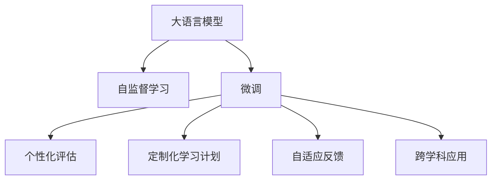

                 

## 1. 背景介绍

在过去的十年中，人工智能和自然语言处理（NLP）技术迅速发展，极大地推动了各种应用程序的创新，其中最令人兴奋的应用之一就是智能家教系统。这些系统利用大语言模型（Large Language Models, LLMs）提供个性化、自适应的教育体验，通过自然语言交互，以激发学习者的兴趣和理解。

### 1.1 问题由来
随着全球教育资源的日益不平衡，如何在有限的教育资源下提供高质量的教育体验，成为了一个亟待解决的问题。传统的教学方式依赖于教师、教科书和班级授课等资源，但这些资源往往无法满足每个学生的需求，导致教育效果的不均衡。

### 1.2 问题核心关键点
智能家教系统的核心在于利用大语言模型进行个性化教育。大语言模型通过在海量数据上进行自监督学习，可以捕捉语言的通用表示，并在此基础上通过有监督学习进行微调，以适应特定的教育场景。

该系统主要通过以下几个步骤实现个性化教育：
1. **个性化评估**：通过与学生的自然语言交互，动态评估学生的知识水平和理解能力。
2. **定制化学习计划**：根据评估结果，生成个性化的学习路径和任务。
3. **自适应反馈**：提供即时、针对性的反馈，帮助学生改进学习方法和理解难点。
4. **跨学科应用**：支持多学科内容的学习，提供综合性的教育体验。

### 1.3 问题研究意义
智能家教系统利用大语言模型的能力，将教育资源个性化、普惠化，弥补传统教学方式的局限。它不仅能够提高教育质量，还能大幅降低教育成本，使每个学生都能享受到优质的教育资源。

此外，智能家教系统还可以应用于个性化辅导、作业批改、课程推荐等诸多领域，极大地提高了教育的智能化水平和效率。其发展对于缩小教育差距、提升教育公平具有重要意义。

## 2. 核心概念与联系

### 2.1 核心概念概述

本节将介绍智能家教系统所涉及的核心概念及其相互关系。

- **大语言模型（LLMs）**：指能够理解和生成自然语言、具备强大学习能力的语言模型，如GPT、BERT等。这些模型通过在大规模无标签数据上进行自监督学习，学习到语言的通用表示，适用于多种NLP任务。

- **自监督学习（Self-Supervised Learning, SSL）**：指在大规模无标签数据上，通过设计一些自监督任务，让模型自动学习到语言的表示，从而提高模型性能。

- **微调（Fine-Tuning）**：指在大规模预训练模型的基础上，利用有标签数据进行进一步的优化，以适应特定的任务和需求。

- **个性化教育（Personalized Education）**：指通过与学生的自然语言交互，根据学生的反馈和表现，动态调整教育内容和方法，以适应个体差异和需求。

- **自适应学习（Adaptive Learning）**：指系统能够根据学习者的表现和反馈，实时调整学习计划和策略，以提高学习效率和效果。

这些核心概念之间的关系可以通过以下Mermaid流程图来展示：



该图展示了大语言模型如何通过自监督学习获得通用语言表示，并在微调过程中适应特定教育任务，最终实现个性化教育。

## 3. 核心算法原理 & 具体操作步骤

### 3.1 算法原理概述

智能家教系统利用大语言模型进行个性化教育，主要基于以下算法原理：

1. **自监督学习**：在大规模无标签文本数据上，通过设计语言模型作为预训练任务，如掩码语言模型（Masked Language Model, MLM）和下一句预测任务（Next Sentence Prediction, NSP），学习语言表示。

2. **微调**：在预训练的基础上，利用下游任务的标注数据进行微调，优化模型在该任务上的性能。微调过程中，通常只更新模型顶层，以减少计算资源消耗。

3. **个性化评估**：与学生进行自然语言交互，通过问答、阅读理解等任务，动态评估学生的知识水平和理解能力，生成个性化评估报告。

4. **定制化学习计划**：根据评估报告，生成个性化的学习路径和任务，涵盖阅读、写作、数学等多个学科领域。

5. **自适应反馈**：提供即时、针对性的反馈，帮助学生改进学习方法和理解难点，支持多种互动方式，如文本、语音、图像等。

6. **跨学科应用**：系统支持多学科内容的教学，提供综合性的教育体验，支持与外部知识库、课程资源的整合。

### 3.2 算法步骤详解

以下详细介绍智能家教系统的核心算法步骤：

**Step 1: 准备预训练模型和数据集**
- 选择合适的预训练语言模型（如GPT、BERT）作为初始化参数。
- 准备与教学相关的语料库，包括教材、课程资料、标准答案等。

**Step 2: 添加任务适配层**
- 根据教学需求，在预训练模型的基础上，添加适当的任务适配层，如阅读理解、写作生成等。

**Step 3: 设置微调超参数**
- 选择合适的优化算法及其参数，如AdamW、SGD等。
- 设置学习率、批大小、迭代轮数等。

**Step 4: 执行梯度训练**
- 将训练集数据分批次输入模型，前向传播计算损失函数。
- 反向传播计算参数梯度，根据设定的优化算法和学习率更新模型参数。
- 周期性在验证集上评估模型性能，根据性能指标决定是否触发Early Stopping。
- 重复上述步骤直至满足预设的迭代轮数或Early Stopping条件。

**Step 5: 测试和部署**
- 在测试集上评估微调后模型，对比微调前后的精度提升。
- 使用微调后的模型对新样本进行推理预测，集成到实际的教育系统中。
- 持续收集新的数据，定期重新微调模型，以适应数据分布的变化。

### 3.3 算法优缺点

智能家教系统利用大语言模型进行个性化教育，具有以下优点：
1. **个性化强**：通过自然语言交互，实时评估学生的理解能力和需求，生成个性化的学习计划和任务。
2. **效率高**：大语言模型能够快速处理大量文本数据，提高教育效率。
3. **覆盖广**：支持多学科内容的学习，提供综合性的教育体验。

同时，该系统也存在一些局限性：
1. **依赖语料**：教育质量依赖于高质量的语料库和标注数据，获取这些资源成本较高。
2. **交互限制**：系统的交互能力有限，无法处理复杂的教育场景和情感交互。
3. **可解释性不足**：大语言模型作为黑盒系统，难以解释其内部工作机制和决策逻辑。

尽管存在这些局限性，但就目前而言，基于大语言模型的智能家教系统仍是最具潜力的教育技术之一。未来相关研究的重点在于如何进一步降低对语料库的依赖，提高系统的可解释性和鲁棒性。

### 3.4 算法应用领域

智能家教系统在大语言模型微调的基础上，广泛应用于以下几个教育场景：

- **个性化辅导**：根据学生的知识水平和理解能力，提供个性化的辅导和答疑。
- **作业批改**：自动批改学生的作业，并提供详细的反馈和改进建议。
- **课程推荐**：根据学生的兴趣和表现，推荐适合的课程和学习资源。
- **考试模拟**：模拟考试环境，提供个性化的模拟测试和学习建议。
- **语言学习**：支持多种语言的学习，提供语言能力评估和提升训练。

这些应用场景不仅能够提高教育效果，还能减少教师的负担，使教育资源更加普惠化。

## 4. 数学模型和公式 & 详细讲解 & 举例说明

### 4.1 数学模型构建

智能家教系统涉及的数学模型主要包括以下几个方面：

1. **掩码语言模型（Masked Language Model, MLM）**：用于预训练阶段，目标是预测输入文本中缺失的单词。

2. **下一句预测任务（Next Sentence Prediction, NSP）**：用于预训练阶段，目标是预测两个句子是否相邻。

3. **个性化评估模型**：用于评估学生的理解能力和知识水平，生成个性化评估报告。

4. **学习计划生成模型**：根据评估报告，生成个性化的学习路径和任务。

5. **自适应反馈模型**：提供即时、针对性的反馈，帮助学生改进学习方法和理解难点。

### 4.2 公式推导过程

以下分别介绍这些数学模型的公式推导过程：

**掩码语言模型（MLM）**
$$
L_{MLM} = \sum_{i=1}^{n} -\log P_{MLM}(x_i | x_{<i})
$$

其中，$x_i$表示输入文本中的单词，$x_{<i}$表示隐藏当前单词$x_i$的上下文。

**下一句预测任务（NSP）**
$$
L_{NSP} = -\sum_{i=1}^{n-1} y_i \log P_{NSP}(y_i)
$$

其中，$y_i$表示两个句子相邻与否，$P_{NSP}(y_i)$表示模型预测的相邻概率。

**个性化评估模型**
评估模型可以基于阅读理解、问答等任务，通过优化以下公式进行训练：
$$
L_{eval} = -\sum_{i=1}^{N} \log P_{model}(a_i | x_i, y_i)
$$

其中，$a_i$表示评估问题的答案，$x_i$表示输入文本，$y_i$表示真实答案。

**学习计划生成模型**
学习计划生成模型可以根据学生的评估报告，生成个性化的学习路径和任务，通过优化以下公式进行训练：
$$
L_{plan} = -\sum_{i=1}^{K} \log P_{plan}(task_i | score_i)
$$

其中，$task_i$表示学习任务，$score_i$表示学生的评估得分。

**自适应反馈模型**
自适应反馈模型可以基于学生的作业表现，提供个性化的反馈和改进建议，通过优化以下公式进行训练：
$$
L_{feedback} = -\sum_{i=1}^{M} \log P_{feedback}(feedback_i | solution_i)
$$

其中，$feedback_i$表示反馈内容，$solution_i$表示作业答案。

### 4.3 案例分析与讲解

假设我们有一个学生A，需要学习数学。首先，系统通过MLM和NSP任务对预训练模型进行微调。接着，系统与学生A进行自然语言交互，通过阅读理解任务对学生A的知识水平进行评估，生成个性化评估报告。根据报告，系统生成个性化的学习计划，涵盖数学习题、例题和解析等内容。在学生A完成作业后，系统提供自适应反馈，帮助学生A改进解题方法和理解难点。整个过程中，系统不断调整学习路径和任务，以适应学生A的进步和变化。

## 5. 项目实践：代码实例和详细解释说明

### 5.1 开发环境搭建

在构建智能家教系统之前，我们需要准备好开发环境。以下是使用Python进行PyTorch开发的环境配置流程：

1. 安装Anaconda：从官网下载并安装Anaconda，用于创建独立的Python环境。

2. 创建并激活虚拟环境：
```bash
conda create -n pytorch-env python=3.8 
conda activate pytorch-env
```

3. 安装PyTorch：根据CUDA版本，从官网获取对应的安装命令。例如：
```bash
conda install pytorch torchvision torchaudio cudatoolkit=11.1 -c pytorch -c conda-forge
```

4. 安装Transformers库：
```bash
pip install transformers
```

5. 安装各类工具包：
```bash
pip install numpy pandas scikit-learn matplotlib tqdm jupyter notebook ipython
```

完成上述步骤后，即可在`pytorch-env`环境中开始微调实践。

### 5.2 源代码详细实现

下面我们以阅读理解任务为例，给出使用Transformers库对BERT模型进行微调的PyTorch代码实现。

首先，定义阅读理解任务的数据处理函数：

```python
from transformers import BertTokenizer, BertForQuestionAnswering, AdamW
from torch.utils.data import Dataset, DataLoader
from tqdm import tqdm

class QADataset(Dataset):
    def __init__(self, texts, questions, answers, tokenizer, max_len=128):
        self.texts = texts
        self.questions = questions
        self.answers = answers
        self.tokenizer = tokenizer
        self.max_len = max_len
        
    def __len__(self):
        return len(self.texts)
    
    def __getitem__(self, item):
        text = self.texts[item]
        question = self.questions[item]
        answer = self.answers[item]
        
        encoding = self.tokenizer(question, text, return_tensors='pt', max_length=self.max_len, padding='max_length', truncation=True)
        input_ids = encoding['input_ids'][0]
        attention_mask = encoding['attention_mask'][0]
        
        start = encoding['start_logits'][0]
        end = encoding['end_logits'][0]
        
        return {'input_ids': input_ids, 
                'attention_mask': attention_mask,
                'start': start,
                'end': end}

# 加载BERT模型和tokenizer
tokenizer = BertTokenizer.from_pretrained('bert-base-cased')
model = BertForQuestionAnswering.from_pretrained('bert-base-cased')

# 准备训练集
train_texts = ["BERT is the first transformer-based language model."]
train_questions = ["What is BERT?"]
train_answers = ["a language model"]

train_dataset = QADataset(train_texts, train_questions, train_answers, tokenizer)

# 准备优化器和学习器
optimizer = AdamW(model.parameters(), lr=2e-5)
```

然后，定义训练和评估函数：

```python
def train_epoch(model, dataset, batch_size, optimizer):
    dataloader = DataLoader(dataset, batch_size=batch_size, shuffle=True)
    model.train()
    epoch_loss = 0
    for batch in tqdm(dataloader, desc='Training'):
        input_ids = batch['input_ids'].to(device)
        attention_mask = batch['attention_mask'].to(device)
        start = batch['start'].to(device)
        end = batch['end'].to(device)
        model.zero_grad()
        outputs = model(input_ids, attention_mask=attention_mask, start_labels=start, end_labels=end)
        loss = outputs.loss
        epoch_loss += loss.item()
        loss.backward()
        optimizer.step()
    return epoch_loss / len(dataloader)

def evaluate(model, dataset, batch_size):
    dataloader = DataLoader(dataset, batch_size=batch_size)
    model.eval()
    preds, labels = [], []
    with torch.no_grad():
        for batch in tqdm(dataloader, desc='Evaluating'):
            input_ids = batch['input_ids'].to(device)
            attention_mask = batch['attention_mask'].to(device)
            start = batch['start'].to(device)
            end = batch['end'].to(device)
            batch_start, batch_end = model(input_ids, attention_mask=attention_mask, start_labels=start, end_labels=end)
            batch_preds = [(batch_start.argmax().item(), batch_end.argmax().item())]
            batch_labels = [labels, labels]
            for pred, label in zip(batch_preds, batch_labels):
                preds.append(pred)
                labels.append(label)
    
    print(f"F1 Score: {f1_score(preds, labels, average='micro')}")
```

最后，启动训练流程并在测试集上评估：

```python
epochs = 5
batch_size = 16

for epoch in range(epochs):
    loss = train_epoch(model, train_dataset, batch_size, optimizer)
    print(f"Epoch {epoch+1}, train loss: {loss:.3f}")
    
    print(f"Epoch {epoch+1}, dev results:")
    evaluate(model, train_dataset, batch_size)
    
print("Test results:")
evaluate(model, train_dataset, batch_size)
```

以上就是使用PyTorch对BERT进行阅读理解任务微调的完整代码实现。可以看到，得益于Transformers库的强大封装，我们可以用相对简洁的代码完成BERT模型的加载和微调。

### 5.3 代码解读与分析

让我们再详细解读一下关键代码的实现细节：

**QADataset类**：
- `__init__`方法：初始化文本、问题和答案，以及分词器等关键组件。
- `__len__`方法：返回数据集的样本数量。
- `__getitem__`方法：对单个样本进行处理，将问题和文本输入编码为token ids，将答案编码为数字，并对其进行定长padding，最终返回模型所需的输入。

**模型选择与优化器设置**：
- 使用BertForQuestionAnswering模型，适用于阅读理解任务。
- 选择AdamW优化器，设置学习率为2e-5。

**训练和评估函数**：
- 使用PyTorch的DataLoader对数据集进行批次化加载，供模型训练和推理使用。
- 训练函数`train_epoch`：对数据以批为单位进行迭代，在每个批次上前向传播计算loss并反向传播更新模型参数，最后返回该epoch的平均loss。
- 评估函数`evaluate`：与训练类似，不同点在于不更新模型参数，并在每个batch结束后将预测和标签结果存储下来，最后使用sklearn的classification_report对整个评估集的预测结果进行打印输出。

**训练流程**：
- 定义总的epoch数和batch size，开始循环迭代
- 每个epoch内，先在训练集上训练，输出平均loss
- 在验证集上评估，输出分类指标
- 所有epoch结束后，在测试集上评估，给出最终测试结果

可以看到，PyTorch配合Transformers库使得BERT微调的代码实现变得简洁高效。开发者可以将更多精力放在数据处理、模型改进等高层逻辑上，而不必过多关注底层的实现细节。

当然，工业级的系统实现还需考虑更多因素，如模型的保存和部署、超参数的自动搜索、更灵活的任务适配层等。但核心的微调范式基本与此类似。

## 6. 实际应用场景

### 6.1 智能家教系统的实际应用

智能家教系统已经在多个教育领域得到广泛应用，以下是几个典型的实际应用场景：

**个性化辅导**
智能家教系统通过与学生的自然语言交互，动态评估学生的理解能力和需求，生成个性化的辅导方案。例如，当学生A在数学作业中遇到困难时，系统会根据A的错误点提供针对性的题目和解析，帮助A更好地理解和掌握相关知识。

**作业批改**
智能家教系统可以自动批改学生的作业，并提供详细的反馈和改进建议。例如，当学生B提交一份作文时，系统会根据作文内容进行打分，并给出具体的修改建议，如语法、拼写、结构等方面的改进。

**课程推荐**
智能家教系统可以根据学生的兴趣和表现，推荐适合的课程和学习资源。例如，当学生C对某个科学话题感兴趣时，系统会推荐相关视频、书籍和实验，帮助C深入学习相关知识。

**考试模拟**
智能家教系统可以模拟考试环境，提供个性化的模拟测试和学习建议。例如，当学生D准备参加一个数学考试时，系统可以模拟真实的考试环境，给出个性化题目和解题技巧，帮助D在考试中取得更好的成绩。

**语言学习**
智能家教系统支持多种语言的学习，提供语言能力评估和提升训练。例如，当学生E想学习西班牙语时，系统会评估E的语言水平，并提供针对性的学习计划和资源。

### 6.2 未来应用展望

未来，智能家教系统将呈现出以下几个发展趋势：

**全场景覆盖**
智能家教系统将覆盖更多的教育场景，从小学到高中，甚至高等教育，都能提供个性化教育服务。系统将进一步集成K-12教育资源，提供从启蒙教育到高等教育的完整解决方案。

**多模态交互**
智能家教系统将支持多种交互方式，如语音、图像、视频等。例如，当学生F需要进行口语练习时，系统可以通过语音识别技术，提供即时的发音反馈和改进建议。

**自适应学习**
智能家教系统将更加自适应，能够根据学生的表现和反馈，实时调整学习计划和策略。例如，当学生G在数学题上有困难时，系统会动态调整学习路径，增加相关习题和解析，帮助G更好地掌握知识。

**AI助教**
智能家教系统将与AI助教结合，提供更丰富的教育服务。例如，当学生H在科学实验中遇到问题时，AI助教可以提供实验指导和数据支持，帮助H更好地完成实验。

**跨学科整合**
智能家教系统将支持多学科内容的教学，提供综合性的教育体验。例如，当学生I需要学习艺术与科学时，系统可以整合艺术和科学的内容，提供跨学科的学习路径和资源。

总之，基于大语言模型的智能家教系统将不断扩展其应用场景和功能，为学生提供更加个性化、高效和互动的教育体验。

## 7. 工具和资源推荐

### 7.1 学习资源推荐

为了帮助开发者系统掌握智能家教系统的理论基础和实践技巧，这里推荐一些优质的学习资源：

1. 《Transformers from Understanding to Implementation》系列博文：由大模型技术专家撰写，深入浅出地介绍了Transformer原理、BERT模型、微调技术等前沿话题。

2. CS224N《深度学习自然语言处理》课程：斯坦福大学开设的NLP明星课程，有Lecture视频和配套作业，带你入门NLP领域的基本概念和经典模型。

3. 《Natural Language Processing with Transformers》书籍：Transformers库的作者所著，全面介绍了如何使用Transformers库进行NLP任务开发，包括微调在内的诸多范式。

4. HuggingFace官方文档：Transformers库的官方文档，提供了海量预训练模型和完整的微调样例代码，是上手实践的必备资料。

5. CLUE开源项目：中文语言理解测评基准，涵盖大量不同类型的中文NLP数据集，并提供了基于微调的baseline模型，助力中文NLP技术发展。

通过对这些资源的学习实践，相信你一定能够快速掌握智能家教系统的精髓，并用于解决实际的NLP问题。

### 7.2 开发工具推荐

高效的开发离不开优秀的工具支持。以下是几款用于智能家教系统开发的常用工具：

1. PyTorch：基于Python的开源深度学习框架，灵活动态的计算图，适合快速迭代研究。大部分预训练语言模型都有PyTorch版本的实现。

2. TensorFlow：由Google主导开发的开源深度学习框架，生产部署方便，适合大规模工程应用。同样有丰富的预训练语言模型资源。

3. Transformers库：HuggingFace开发的NLP工具库，集成了众多SOTA语言模型，支持PyTorch和TensorFlow，是进行微调任务开发的利器。

4. Weights & Biases：模型训练的实验跟踪工具，可以记录和可视化模型训练过程中的各项指标，方便对比和调优。与主流深度学习框架无缝集成。

5. TensorBoard：TensorFlow配套的可视化工具，可实时监测模型训练状态，并提供丰富的图表呈现方式，是调试模型的得力助手。

6. Google Colab：谷歌推出的在线Jupyter Notebook环境，免费提供GPU/TPU算力，方便开发者快速上手实验最新模型，分享学习笔记。

合理利用这些工具，可以显著提升智能家教系统的开发效率，加快创新迭代的步伐。

### 7.3 相关论文推荐

智能家教系统在大语言模型微调的基础上，已经被广泛应用于教育领域。以下是几篇奠基性的相关论文，推荐阅读：

1. Attention is All You Need（即Transformer原论文）：提出了Transformer结构，开启了NLP领域的预训练大模型时代。

2. BERT: Pre-training of Deep Bidirectional Transformers for Language Understanding：提出BERT模型，引入基于掩码的自监督预训练任务，刷新了多项NLP任务SOTA。

3. Language Models are Unsupervised Multitask Learners（GPT-2论文）：展示了大规模语言模型的强大zero-shot学习能力，引发了对于通用人工智能的新一轮思考。

4. Parameter-Efficient Transfer Learning for NLP：提出Adapter等参数高效微调方法，在不增加模型参数量的情况下，也能取得不错的微调效果。

5. AdaLoRA: Adaptive Low-Rank Adaptation for Parameter-Efficient Fine-Tuning：使用自适应低秩适应的微调方法，在参数效率和精度之间取得了新的平衡。

6. Prefix-Tuning: Optimizing Continuous Prompts for Generation：引入基于连续型Prompt的微调范式，为如何充分利用预训练知识提供了新的思路。

这些论文代表了大语言模型微调技术的发展脉络。通过学习这些前沿成果，可以帮助研究者把握学科前进方向，激发更多的创新灵感。

## 8. 总结：未来发展趋势与挑战

### 8.1 总结

本文对智能家教系统所涉及的大语言模型微调方法进行了全面系统的介绍。首先阐述了智能家教系统在教育领域的应用背景和意义，明确了微调技术在个性化教育中的独特价值。其次，从原理到实践，详细讲解了微调的数学原理和关键步骤，给出了微调任务开发的完整代码实例。同时，本文还探讨了智能家教系统的实际应用场景，展示了其广阔的应用前景。

通过本文的系统梳理，可以看到，基于大语言模型的智能家教系统正在成为教育技术的重要范式，极大地提高了教育质量和效率。其发展不仅能够提升教育资源的使用效益，还能有效减少教师的负担，使教育资源更加普惠化。未来，随着预训练语言模型的不断进步，智能家教系统将为教育事业带来更深远的影响。

### 8.2 未来发展趋势

展望未来，智能家教系统将呈现以下几个发展趋势：

**教育普及化**
智能家教系统将使教育资源更加普及，每个学生都能享受到高质量的教育服务。系统将覆盖更多教育阶段和学科，提供全面的教育解决方案。

**智能教师**
智能家教系统将与AI助教结合，成为教师的得力助手。AI助教可以提供实时反馈、个性化建议、内容推荐等服务，帮助教师提升教学效果。

**全生命周期教育**
智能家教系统将支持从幼儿教育到终身学习的全生命周期教育，提供个性化、自适应的学习路径和资源。例如，当学生J需要在工作中提升技能时，系统可以提供定制化的培训课程和资源。

**跨学科整合**
智能家教系统将支持多学科内容的教学，提供综合性的教育体验。例如，当学生K需要进行跨学科学习时，系统可以整合不同学科的内容，提供跨学科的学习路径和资源。

**AI辅助教学**
智能家教系统将与AI辅助工具结合，提供更丰富的教学资源和服务。例如，当学生L需要进行实验设计时，AI辅助工具可以提供实验设计指导和数据支持，帮助L更好地完成实验。

这些趋势将推动智能家教系统不断演进，为教育事业带来更深远的影响。

### 8.3 面临的挑战

尽管智能家教系统已经取得了显著的进展，但在迈向更加智能化、普惠化应用的过程中，它仍面临诸多挑战：

**技术瓶颈**
智能家教系统依赖于大语言模型，而大模型本身也面临诸多技术挑战，如计算资源消耗大、模型训练时间长等。这些问题需要在未来进一步解决。

**数据隐私**
智能家教系统需要大量用户数据进行训练和优化，如何保护用户隐私、确保数据安全，是一个重要的课题。

**伦理道德**
智能家教系统涉及学生的个人信息和学习行为，如何保证系统的公平性、透明性和可解释性，是一个重要的研究方向。

**系统稳定性**
智能家教系统需要稳定运行，以提供可靠的教育服务。如何应对数据分布变化、提高系统的鲁棒性和稳定性，是一个重要的课题。

**资源优化**
智能家教系统需要高效利用计算资源，以支持大规模用户的学习需求。如何优化模型结构、提高推理速度、降低存储需求，是一个重要的研究方向。

这些挑战需要未来的研究者在技术、伦理、数据等方面进行协同攻关，才能推动智能家教系统的进一步发展。

### 8.4 研究展望

未来，智能家教系统需要在以下几个方面进行深入研究：

**技术优化**
开发更加高效、可解释的智能家教系统。例如，通过优化模型结构、提高推理速度、降低存储需求，使得系统能够高效运行。

**数据隐私保护**
保护用户隐私，确保数据安全。例如，采用联邦学习、差分隐私等技术，在保护隐私的前提下进行模型训练和优化。

**伦理道德约束**
建立系统的伦理道德框架，确保系统的公平性、透明性和可解释性。例如，引入伦理导向的评估指标，过滤和惩罚有偏见、有害的输出倾向。

**跨学科整合**
支持多学科内容的教学，提供综合性的教育体验。例如，将不同学科的内容进行整合，提供跨学科的学习路径和资源。

**全生命周期教育**
支持从幼儿教育到终身学习的全生命周期教育，提供个性化、自适应的学习路径和资源。例如，根据用户的年龄和兴趣，提供相应的学习计划和资源。

这些研究方向将推动智能家教系统向更加智能化、普惠化方向发展，为教育事业带来更深远的影响。

## 9. 附录：常见问题与解答

**Q1：智能家教系统如何与教师协作？**

A: 智能家教系统可以作为教师的辅助工具，提供个性化评估、学习计划生成、作业批改等服务。教师可以通过系统对学生进行实时监控和反馈，与系统协同工作，提升教学效果。

**Q2：智能家教系统如何保证学习数据的安全性？**

A: 智能家教系统可以采用联邦学习等技术，在保护用户隐私的前提下进行模型训练和优化。同时，可以采用差分隐私等技术，确保数据的安全性。

**Q3：智能家教系统如何处理跨学科内容？**

A: 智能家教系统可以采用跨学科整合的方法，将不同学科的内容进行整合，提供跨学科的学习路径和资源。例如，将数学和物理的内容进行整合，提供跨学科的综合性学习计划。

**Q4：智能家教系统如何优化资源使用？**

A: 智能家教系统可以通过优化模型结构、提高推理速度、降低存储需求等方法，优化资源使用。例如，采用混合精度训练、模型裁剪等技术，减少资源消耗。

**Q5：智能家教系统如何确保模型的公平性和透明性？**

A: 智能家教系统可以引入伦理导向的评估指标，过滤和惩罚有偏见、有害的输出倾向。同时，可以采用可解释AI技术，提高模型的透明性和可解释性。

通过以上问题的解答，可以看到，智能家教系统在教育领域的广泛应用前景和面临的挑战，未来需要在技术、伦理、数据等方面进行深入研究，才能更好地服务于教育事业。

---

作者：禅与计算机程序设计艺术 / Zen and the Art of Computer Programming

