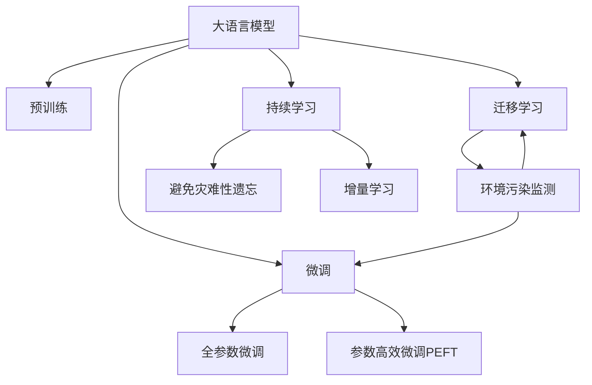

                 

# LLM在智能环境污染监测中的潜在作用

## 1. 背景介绍

近年来，全球环境污染问题愈发严重，水污染、空气污染、土壤污染等诸多领域都急需有效的监测与治理手段。传统的监测方式往往需要大量人力物力，监测效率低，精度难以保证。而基于大语言模型（Large Language Models, LLMs）的智能环境污染监测系统，有望通过高效、智能化的方式，实时获取环境污染数据，为环保决策提供科学依据。

### 1.1 问题由来

智能环境污染监测系统利用大语言模型进行数据处理和智能分析，通过自然语言处理（Natural Language Processing, NLP）技术，从海量文本数据中提取有用信息，辅助环保工作者进行环境监测和治理。大语言模型如BERT、GPT等，通过自监督预训练学习通用的语言表示，再在特定任务上进行微调，具备强大的语言理解和生成能力。将此能力应用于环境监测，可以显著提升数据处理和分析的效率与精度。

### 1.2 问题核心关键点

智能环境污染监测的核心在于：
1. **数据获取**：如何高效、全面地获取环境监测数据。
2. **数据处理**：如何从大量文本数据中提取有用信息。
3. **智能分析**：如何将提取的信息转化为科学决策。
4. **系统部署**：如何将大语言模型应用于实时监测与决策。

### 1.3 问题研究意义

大语言模型在环境监测中的应用，有望带来以下几个方面的改进：
1. **监测效率提升**：自动化的数据处理和分析，大幅减少人工干预，提高监测效率。
2. **数据精度提高**：通过智能分析，准确识别和分类环境污染情况，提高监测精度。
3. **决策科学化**：基于大数据分析，辅助环保决策，优化治理方案。
4. **资源节约**：减少人力物力投入，提高环保资源的利用效率。

本文将详细探讨如何利用大语言模型进行智能环境污染监测，并分析其潜在的优势与挑战。

## 2. 核心概念与联系

### 2.1 核心概念概述

为更好地理解大语言模型在智能环境污染监测中的应用，本节将介绍几个密切相关的核心概念：

- **大语言模型（LLM）**：以自回归（如GPT）或自编码（如BERT）模型为代表的大规模预训练语言模型。通过在大规模无标签文本语料上进行预训练，学习通用的语言表示，具备强大的语言理解和生成能力。

- **预训练（Pre-training）**：指在大规模无标签文本语料上，通过自监督学习任务训练通用语言模型的过程。常见的预训练任务包括言语建模、遮挡语言模型等。预训练使得模型学习到语言的通用表示。

- **微调（Fine-tuning）**：指在预训练模型的基础上，使用下游任务的少量标注数据，通过有监督学习优化模型在该任务上的性能。通常只需要调整顶层分类器或解码器，并以较小的学习率更新全部或部分的模型参数。

- **迁移学习（Transfer Learning）**：指将一个领域学习到的知识，迁移应用到另一个不同但相关的领域的学习范式。大模型的预训练-微调过程即是一种典型的迁移学习方式。

- **环境污染监测**：通过对环境质量数据的监测，及时发现和应对污染问题，保障人类健康和生态安全。主要涉及水、气、土等不同领域的数据监测。

这些核心概念之间的逻辑关系可以通过以下Mermaid流程图来展示：



这个流程图展示了大语言模型的核心概念及其之间的关系：

1. 大语言模型通过预训练获得基础能力。
2. 微调是对预训练模型进行任务特定的优化，可以分为全参数微调和参数高效微调（PEFT）。
3. 迁移学习是连接预训练模型与环境污染监测任务的桥梁，可以通过微调或迁移学习来实现。
4. 持续学习旨在使模型能够不断学习新知识，同时避免遗忘旧知识。

这些概念共同构成了大语言模型的学习和应用框架，使其能够在环境监测领域发挥强大的作用。

## 3. 核心算法原理 & 具体操作步骤
### 3.1 算法原理概述

基于大语言模型进行智能环境污染监测，本质上是将大语言模型作为一种强大的"数据处理器"，通过预训练和微调，使其能够高效、准确地从文本数据中提取有用信息，辅助环境监测。

形式化地，假设环境监测数据集为 $D=\{(x_i, y_i)\}_{i=1}^N, x_i \in \mathcal{X}, y_i \in \mathcal{Y}$，其中 $x_i$ 为监测数据（文本形式），$y_i$ 为环境污染状态（分类或数值标签）。目标是从大量文本数据中，自动提取并分析环境污染情况，辅助决策。

大语言模型 $M_{\theta}$ 通过预训练学习通用语言表示，并在下游任务上进行微调，得到适应特定环境监测任务的模型 $M_{\hat{\theta}}$。微调的目标是最小化经验风险，即：

$$
\hat{\theta}=\mathop{\arg\min}_{\theta} \mathcal{L}(M_{\theta},D)
$$

其中 $\mathcal{L}$ 为针对环境监测任务设计的损失函数，用于衡量模型预测输出与真实标签之间的差异。常见的损失函数包括交叉熵损失、均方误差损失等。

通过梯度下降等优化算法，微调过程不断更新模型参数 $\theta$，最小化损失函数 $\mathcal{L}$，使得模型输出逼近真实标签。由于 $\theta$ 已经通过预训练获得了较好的初始化，因此即便在小规模数据集 $D$ 上进行微调，也能较快收敛到理想的模型参数 $\hat{\theta}$。

### 3.2 算法步骤详解

基于大语言模型进行智能环境污染监测，一般包括以下几个关键步骤：

**Step 1: 准备预训练模型和数据集**
- 选择合适的预训练语言模型 $M_{\theta}$ 作为初始化参数，如 BERT、GPT等。
- 准备环境监测数据集 $D$，划分为训练集、验证集和测试集。一般要求标注数据与预训练数据的分布不要差异过大。

**Step 2: 添加任务适配层**
- 根据环境监测任务类型，在预训练模型顶层设计合适的输出层和损失函数。
- 对于分类任务，通常在顶层添加线性分类器和交叉熵损失函数。
- 对于数值预测任务，通常使用均方误差或绝对误差作为损失函数。

**Step 3: 设置微调超参数**
- 选择合适的优化算法及其参数，如 AdamW、SGD 等，设置学习率、批大小、迭代轮数等。
- 设置正则化技术及强度，包括权重衰减、Dropout、Early Stopping 等。
- 确定冻结预训练参数的策略，如仅微调顶层，或全部参数都参与微调。

**Step 4: 执行梯度训练**
- 将训练集数据分批次输入模型，前向传播计算损失函数。
- 反向传播计算参数梯度，根据设定的优化算法和学习率更新模型参数。
- 周期性在验证集上评估模型性能，根据性能指标决定是否触发 Early Stopping。
- 重复上述步骤直到满足预设的迭代轮数或 Early Stopping 条件。

**Step 5: 测试和部署**
- 在测试集上评估微调后模型 $M_{\hat{\theta}}$ 的性能，对比微调前后的精度提升。
- 使用微调后的模型对新样本进行推理预测，集成到实际的环境监测系统中。
- 持续收集新的环境监测数据，定期重新微调模型，以适应数据分布的变化。

以上是基于大语言模型进行智能环境污染监测的一般流程。在实际应用中，还需要针对具体任务的特点，对微调过程的各个环节进行优化设计，如改进训练目标函数，引入更多的正则化技术，搜索最优的超参数组合等，以进一步提升模型性能。

### 3.3 算法优缺点

基于大语言模型进行智能环境污染监测的方法具有以下优点：
1. **高效性**：利用预训练模型强大的语言理解能力，自动处理大量文本数据，大大提高监测效率。
2. **精确性**：通过微调优化模型，在特定任务上能够取得更高的精度，准确识别环境污染情况。
3. **普适性**：大语言模型具备通用的语言处理能力，可以应用于不同领域和规模的环境监测任务。
4. **可扩展性**：新数据和新任务可以方便地进行微调，系统具有良好的可扩展性。

同时，该方法也存在一定的局限性：
1. **数据依赖**：微调效果高度依赖于标注数据的质量和数量，获取高质量数据成本较高。
2. **环境噪声**：环境监测数据往往包含噪声和不准确的信息，需要额外的数据清洗和预处理步骤。
3. **泛化能力**：当监测数据与预训练数据的分布差异较大时，微调模型的泛化能力可能受限。
4. **推理效率**：大模型推理时资源消耗较大，需要优化模型结构和推理算法，提高计算效率。

尽管存在这些局限性，但就目前而言，基于大语言模型的微调方法在环境监测领域仍具有较高的应用价值。

### 3.4 算法应用领域

大语言模型在智能环境污染监测中的应用场景非常广泛，主要包括以下几个方面：

- **水质监测**：通过收集水体检测报告，自动分析水质状况，预警水质异常。
- **空气质量监测**：利用空气监测传感器数据，自动生成空气质量报告，实时发布空气质量预警。
- **土壤污染监测**：从土壤检测数据中自动识别污染物种类和浓度，提供治理建议。
- **城市环境监测**：综合分析城市垃圾处理、污水处理、噪音监测等数据，提供环境管理建议。
- **工业污染监测**：对工业企业排放数据进行分析，评估环境影响，指导污染减排。

除了上述这些具体应用外，大语言模型还能够在更宏观的领域进行环境分析，如气候变化、生物多样性等，为环境决策提供更全面的科学依据。

## 4. 数学模型和公式 & 详细讲解
### 4.1 数学模型构建

本节将使用数学语言对基于大语言模型进行智能环境污染监测的过程进行更加严格的刻画。

记环境监测数据集为 $D=\{(x_i,y_i)\}_{i=1}^N, x_i \in \mathcal{X}, y_i \in \mathcal{Y}$，其中 $x_i$ 为监测数据（文本形式），$y_i$ 为环境污染状态（分类或数值标签）。

定义模型 $M_{\theta}$ 在输入 $x$ 上的输出为 $\hat{y}=M_{\theta}(x) \in [0,1]$，表示模型预测的环境污染状态。真实标签 $y \in \{0,1\}$ 或 $y \in \mathbb{R}$。则环境监测任务的损失函数可以定义为：

- **分类任务**：
$$
\ell(M_{\theta}(x),y) = -[y\log \hat{y} + (1-y)\log (1-\hat{y})]
$$

- **数值预测任务**：
$$
\ell(M_{\theta}(x),y) = \frac{1}{2}(y - \hat{y})^2
$$

最小化损失函数得到最优参数：

$$
\theta^* = \mathop{\arg\min}_{\theta} \mathcal{L}(\theta)
$$

其中 $\mathcal{L}$ 为针对任务设计的损失函数。

### 4.2 公式推导过程

以下我们以空气质量监测为例，推导交叉熵损失函数及其梯度的计算公式。

假设模型 $M_{\theta}$ 在输入 $x$ 上的输出为 $\hat{y}=M_{\theta}(x) \in [0,1]$，真实标签 $y \in \{0,1\}$。则二分类交叉熵损失函数定义为：

$$
\ell(M_{\theta}(x),y) = -[y\log \hat{y} + (1-y)\log (1-\hat{y})]
$$

将其代入经验风险公式，得：

$$
\mathcal{L}(\theta) = -\frac{1}{N}\sum_{i=1}^N [y_i\log M_{\theta}(x_i)+(1-y_i)\log(1-M_{\theta}(x_i))]
$$

根据链式法则，损失函数对参数 $\theta_k$ 的梯度为：

$$
\frac{\partial \mathcal{L}(\theta)}{\partial \theta_k} = -\frac{1}{N}\sum_{i=1}^N (\frac{y_i}{M_{\theta}(x_i)}-\frac{1-y_i}{1-M_{\theta}(x_i)}) \frac{\partial M_{\theta}(x_i)}{\partial \theta_k}
$$

其中 $\frac{\partial M_{\theta}(x_i)}{\partial \theta_k}$ 可进一步递归展开，利用自动微分技术完成计算。

在得到损失函数的梯度后，即可带入参数更新公式，完成模型的迭代优化。重复上述过程直至收敛，最终得到适应下游任务的最优模型参数 $\theta^*$。

## 5. 项目实践：代码实例和详细解释说明
### 5.1 开发环境搭建

在进行环境监测微调实践前，我们需要准备好开发环境。以下是使用Python进行PyTorch开发的环境配置流程：

1. 安装Anaconda：从官网下载并安装Anaconda，用于创建独立的Python环境。

2. 创建并激活虚拟环境：
```bash
conda create -n pytorch-env python=3.8 
conda activate pytorch-env
```

3. 安装PyTorch：根据CUDA版本，从官网获取对应的安装命令。例如：
```bash
conda install pytorch torchvision torchaudio cudatoolkit=11.1 -c pytorch -c conda-forge
```

4. 安装Transformers库：
```bash
pip install transformers
```

5. 安装各类工具包：
```bash
pip install numpy pandas scikit-learn matplotlib tqdm jupyter notebook ipython
```

完成上述步骤后，即可在`pytorch-env`环境中开始微调实践。

### 5.2 源代码详细实现

下面我们以空气质量监测任务为例，给出使用Transformers库对BERT模型进行微调的PyTorch代码实现。

首先，定义任务数据处理函数：

```python
from transformers import BertTokenizer
from torch.utils.data import Dataset
import torch

class AirQualityDataset(Dataset):
    def __init__(self, texts, labels, tokenizer, max_len=128):
        self.texts = texts
        self.labels = labels
        self.tokenizer = tokenizer
        self.max_len = max_len
        
    def __len__(self):
        return len(self.texts)
    
    def __getitem__(self, item):
        text = self.texts[item]
        label = self.labels[item]
        
        encoding = self.tokenizer(text, return_tensors='pt', max_length=self.max_len, padding='max_length', truncation=True)
        input_ids = encoding['input_ids'][0]
        attention_mask = encoding['attention_mask'][0]
        
        # 对label进行编码
        label = label2id[label]
        
        return {'input_ids': input_ids, 
                'attention_mask': attention_mask,
                'labels': label}

# 标签与id的映射
label2id = {'0': 0, '1': 1}
id2label = {v: k for k, v in label2id.items()}
```

然后，定义模型和优化器：

```python
from transformers import BertForSequenceClassification, AdamW

model = BertForSequenceClassification.from_pretrained('bert-base-cased', num_labels=2)

optimizer = AdamW(model.parameters(), lr=2e-5)
```

接着，定义训练和评估函数：

```python
from torch.utils.data import DataLoader
from tqdm import tqdm
from sklearn.metrics import classification_report

device = torch.device('cuda') if torch.cuda.is_available() else torch.device('cpu')
model.to(device)

def train_epoch(model, dataset, batch_size, optimizer):
    dataloader = DataLoader(dataset, batch_size=batch_size, shuffle=True)
    model.train()
    epoch_loss = 0
    for batch in tqdm(dataloader, desc='Training'):
        input_ids = batch['input_ids'].to(device)
        attention_mask = batch['attention_mask'].to(device)
        labels = batch['labels'].to(device)
        model.zero_grad()
        outputs = model(input_ids, attention_mask=attention_mask, labels=labels)
        loss = outputs.loss
        epoch_loss += loss.item()
        loss.backward()
        optimizer.step()
    return epoch_loss / len(dataloader)

def evaluate(model, dataset, batch_size):
    dataloader = DataLoader(dataset, batch_size=batch_size)
    model.eval()
    preds, labels = [], []
    with torch.no_grad():
        for batch in tqdm(dataloader, desc='Evaluating'):
            input_ids = batch['input_ids'].to(device)
            attention_mask = batch['attention_mask'].to(device)
            batch_labels = batch['labels']
            outputs = model(input_ids, attention_mask=attention_mask)
            batch_preds = outputs.logits.argmax(dim=2).to('cpu').tolist()
            batch_labels = batch_labels.to('cpu').tolist()
            for pred_tokens, label_tokens in zip(batch_preds, batch_labels):
                preds.append(pred_tokens)
                labels.append(label_tokens)
                
    print(classification_report(labels, preds))
```

最后，启动训练流程并在验证集上评估：

```python
epochs = 5
batch_size = 16

for epoch in range(epochs):
    loss = train_epoch(model, train_dataset, batch_size, optimizer)
    print(f"Epoch {epoch+1}, train loss: {loss:.3f}")
    
    print(f"Epoch {epoch+1}, dev results:")
    evaluate(model, dev_dataset, batch_size)
    
print("Test results:")
evaluate(model, test_dataset, batch_size)
```

以上就是使用PyTorch对BERT进行空气质量监测任务微调的完整代码实现。可以看到，得益于Transformers库的强大封装，我们可以用相对简洁的代码完成BERT模型的加载和微调。

### 5.3 代码解读与分析

让我们再详细解读一下关键代码的实现细节：

**AirQualityDataset类**：
- `__init__`方法：初始化文本、标签、分词器等关键组件。
- `__len__`方法：返回数据集的样本数量。
- `__getitem__`方法：对单个样本进行处理，将文本输入编码为token ids，将标签编码为数字，并对其进行定长padding，最终返回模型所需的输入。

**label2id和id2label字典**：
- 定义了标签与数字id之间的映射关系，用于将标签转换为模型可处理的数字形式。

**训练和评估函数**：
- 使用PyTorch的DataLoader对数据集进行批次化加载，供模型训练和推理使用。
- 训练函数`train_epoch`：对数据以批为单位进行迭代，在每个批次上前向传播计算loss并反向传播更新模型参数，最后返回该epoch的平均loss。
- 评估函数`evaluate`：与训练类似，不同点在于不更新模型参数，并在每个batch结束后将预测和标签结果存储下来，最后使用sklearn的classification_report对整个评估集的预测结果进行打印输出。

**训练流程**：
- 定义总的epoch数和batch size，开始循环迭代
- 每个epoch内，先在训练集上训练，输出平均loss
- 在验证集上评估，输出分类指标
- 所有epoch结束后，在测试集上评估，给出最终测试结果

可以看到，PyTorch配合Transformers库使得BERT微调的代码实现变得简洁高效。开发者可以将更多精力放在数据处理、模型改进等高层逻辑上，而不必过多关注底层的实现细节。

当然，工业级的系统实现还需考虑更多因素，如模型的保存和部署、超参数的自动搜索、更灵活的任务适配层等。但核心的微调范式基本与此类似。

## 6. 实际应用场景
### 6.1 智能水质监测

基于大语言模型的智能水质监测系统，可以通过对水质监测报告的自动处理，实现水质的实时预警和治理建议。例如，收集水质检测报告，自动分析水体中的化学成分和指标，判断是否存在污染情况，并根据污染程度提供相应的治理方案。

在技术实现上，可以收集水体检测报告文本数据，通过微调大语言模型学习水质监测中的关键信息，自动生成水质报告，辅助环保工作者进行水体治理。

### 6.2 智能土壤污染监测

智能土壤污染监测系统利用大语言模型，对土壤检测数据进行自动分析和标注。例如，通过微调大语言模型，自动从土壤检测报告中提取污染物种类、浓度等关键信息，生成土壤污染报告，提供治理建议。

具体实现时，可以收集土壤检测数据，提取报告文本，通过微调大语言模型学习土壤污染的关键特征，自动生成污染报告。这将大大提高土壤污染监测的效率和精度。

### 6.3 智能城市环境监测

大语言模型在智能城市环境监测中的应用非常广泛，可以通过对城市环境数据进行实时分析和预测，为城市管理提供决策支持。例如，利用大语言模型对城市垃圾处理、污水处理、噪音监测等数据进行分析，生成城市环境报告，提供环境管理建议。

在技术实现上，可以收集城市环境监测数据，通过微调大语言模型学习环境监测的关键信息，自动生成城市环境报告，辅助城市管理者进行决策。这将提高城市环境管理的智能化水平，提升城市居民的生活质量。

### 6.4 未来应用展望

随着大语言模型和微调方法的不断发展，基于微调范式将在环境监测领域得到更广泛的应用，为环境管理和治理提供更强大的技术支持。

在智慧环保领域，基于微调的大语言模型将带来诸多创新应用，如智慧预警系统、智慧治理方案生成、智慧生态监测等，提升环保工作的智能化水平。

在智慧城市治理中，大语言模型将发挥更大的作用，通过智能分析和预测，优化城市管理决策，提升城市运行效率和居民满意度。

未来，大语言模型微调技术将在更多领域得到应用，为环境监测和治理提供更全面、高效、智能的解决方案，推动智慧环保和智慧城市的发展。

## 7. 工具和资源推荐
### 7.1 学习资源推荐

为了帮助开发者系统掌握大语言模型微调的理论基础和实践技巧，这里推荐一些优质的学习资源：

1. 《Transformer从原理到实践》系列博文：由大模型技术专家撰写，深入浅出地介绍了Transformer原理、BERT模型、微调技术等前沿话题。

2. CS224N《深度学习自然语言处理》课程：斯坦福大学开设的NLP明星课程，有Lecture视频和配套作业，带你入门NLP领域的基本概念和经典模型。

3. 《Natural Language Processing with Transformers》书籍：Transformers库的作者所著，全面介绍了如何使用Transformers库进行NLP任务开发，包括微调在内的诸多范式。

4. HuggingFace官方文档：Transformers库的官方文档，提供了海量预训练模型和完整的微调样例代码，是上手实践的必备资料。

5. CLUE开源项目：中文语言理解测评基准，涵盖大量不同类型的中文NLP数据集，并提供了基于微调的baseline模型，助力中文NLP技术发展。

通过对这些资源的学习实践，相信你一定能够快速掌握大语言模型微调的精髓，并用于解决实际的NLP问题。
###  7.2 开发工具推荐

高效的开发离不开优秀的工具支持。以下是几款用于大语言模型微调开发的常用工具：

1. PyTorch：基于Python的开源深度学习框架，灵活动态的计算图，适合快速迭代研究。大部分预训练语言模型都有PyTorch版本的实现。

2. TensorFlow：由Google主导开发的开源深度学习框架，生产部署方便，适合大规模工程应用。同样有丰富的预训练语言模型资源。

3. Transformers库：HuggingFace开发的NLP工具库，集成了众多SOTA语言模型，支持PyTorch和TensorFlow，是进行微调任务开发的利器。

4. Weights & Biases：模型训练的实验跟踪工具，可以记录和可视化模型训练过程中的各项指标，方便对比和调优。与主流深度学习框架无缝集成。

5. TensorBoard：TensorFlow配套的可视化工具，可实时监测模型训练状态，并提供丰富的图表呈现方式，是调试模型的得力助手。

6. Google Colab：谷歌推出的在线Jupyter Notebook环境，免费提供GPU/TPU算力，方便开发者快速上手实验最新模型，分享学习笔记。

合理利用这些工具，可以显著提升大语言模型微调任务的开发效率，加快创新迭代的步伐。

### 7.3 相关论文推荐

大语言模型和微调技术的发展源于学界的持续研究。以下是几篇奠基性的相关论文，推荐阅读：

1. Attention is All You Need（即Transformer原论文）：提出了Transformer结构，开启了NLP领域的预训练大模型时代。

2. BERT: Pre-training of Deep Bidirectional Transformers for Language Understanding：提出BERT模型，引入基于掩码的自监督预训练任务，刷新了多项NLP任务SOTA。

3. Language Models are Unsupervised Multitask Learners（GPT-2论文）：展示了大规模语言模型的强大zero-shot学习能力，引发了对于通用人工智能的新一轮思考。

4. Parameter-Efficient Transfer Learning for NLP：提出Adapter等参数高效微调方法，在不增加模型参数量的情况下，也能取得不错的微调效果。

5. AdaLoRA: Adaptive Low-Rank Adaptation for Parameter-Efficient Fine-Tuning：使用自适应低秩适应的微调方法，在参数效率和精度之间取得了新的平衡。

这些论文代表了大语言模型微调技术的发展脉络。通过学习这些前沿成果，可以帮助研究者把握学科前进方向，激发更多的创新灵感。

## 8. 总结：未来发展趋势与挑战
### 8.1 总结

本文对基于大语言模型的智能环境污染监测进行了全面系统的介绍。首先阐述了智能环境污染监测系统的背景和意义，明确了利用大语言模型进行数据处理和智能分析的潜力。其次，从原理到实践，详细讲解了基于大语言模型的微调方法，给出了微调任务开发的完整代码实例。同时，本文还探讨了基于大语言模型进行智能环境污染监测的优势与挑战，展望了未来发展的方向。

通过本文的系统梳理，可以看到，大语言模型在环境监测领域的应用前景广阔，利用其强大的语言处理能力，可以大大提升环境监测的效率和精度，为环境治理提供科学依据。未来，伴随预训练语言模型和微调方法的不断演进，基于大语言模型的环境监测系统必将带来更多的创新应用，推动智慧环保和智慧城市的发展。

### 8.2 未来发展趋势

展望未来，大语言模型在智能环境污染监测领域将呈现以下几个发展趋势：

1. **数据处理自动化**：大语言模型将实现对环境监测数据的自动处理和分析，减少人工干预，提升监测效率。
2. **模型泛化能力增强**：通过微调优化模型，使其能够更好地适应不同领域、不同规模的环境监测任务。
3. **多模态融合**：大语言模型将能够整合多模态数据，如文本、图像、视频等，提升环境监测的全面性和准确性。
4. **实时监测与预警**：基于大语言模型的环境监测系统将实现实时监测和预警，及时发现并应对环境污染问题。
5. **智能决策支持**：利用大语言模型的智能分析能力，为环境管理提供决策支持，优化治理方案。

以上趋势凸显了大语言模型在环境监测领域的巨大潜力。这些方向的探索发展，必将进一步提升环境监测的智能化水平，为环保决策提供更全面的科学依据。

### 8.3 面临的挑战

尽管大语言模型在环境监测领域的应用前景广阔，但在迈向更加智能化、普适化应用的过程中，仍面临诸多挑战：

1. **数据质量与标注成本**：获取高质量的环境监测数据和标注样本成本较高，数据依赖性强。
2. **模型泛化能力**：当监测数据与预训练数据的分布差异较大时，微调模型的泛化能力可能受限。
3. **资源消耗**：大模型推理时资源消耗较大，需要优化模型结构和推理算法，提高计算效率。
4. **可解释性不足**：大语言模型的决策过程缺乏可解释性，难以对其推理逻辑进行分析和调试。

尽管存在这些挑战，但大语言模型微调技术在环境监测领域的应用前景仍然广阔。随着技术的不断进步，相信这些挑战终将得到克服，大语言模型微调将为环境监测带来更高效、智能的解决方案。

### 8.4 研究展望

未来的研究需要在以下几个方面寻求新的突破：

1. **无监督与半监督学习**：探索无监督和半监督微调方法，摆脱对大规模标注数据的依赖，利用非结构化数据提升环境监测效果。
2. **多模态融合**：整合文本、图像、视频等多模态数据，提升环境监测的全面性和准确性。
3. **知识图谱与规则库融合**：将符号化的先验知识与神经网络模型融合，增强模型的知识整合能力。
4. **高效推理算法**：开发高效的推理算法，优化模型结构和推理方式，提升环境监测的实时性。
5. **可解释性与透明性**：增强模型的可解释性和透明性，提高其决策的可理解性和可信度。

这些研究方向的探索，将推动大语言模型在环境监测领域的进一步应用，为环保决策提供更全面、智能的科学依据。

## 9. 附录：常见问题与解答

**Q1：大语言模型在智能环境污染监测中如何避免过拟合？**

A: 过拟合是大语言模型微调过程中常见的问题。为避免过拟合，可以采取以下措施：
1. 数据增强：通过回译、近义替换等方式扩充训练集。
2. 正则化：使用L2正则、Dropout、Early Stopping等方法，防止模型过度适应小规模训练集。
3. 对抗训练：引入对抗样本，提高模型鲁棒性。
4. 参数高效微调：只调整少量参数(如Adapter、Prefix等)，减小过拟合风险。

这些策略需要根据具体任务和数据特点进行灵活组合。只有在数据、模型、训练、推理等各环节进行全面优化，才能最大限度地发挥大语言模型的潜力。

**Q2：大语言模型在智能环境污染监测中如何进行数据预处理？**

A: 数据预处理是大语言模型微调的重要环节。为确保模型训练效果，需要做好以下预处理工作：
1. 数据清洗：去除噪声和不准确的信息，保证数据的纯净度。
2. 分词处理：对监测数据进行分词，使其能够被模型处理。
3. 标准化：对监测数据进行标准化处理，如统一格式、单位等。
4. 特征工程：提取环境监测中的关键特征，如污染物种类、浓度等，供模型学习。

通过有效的数据预处理，可以提高模型训练的效率和精度，提升智能环境污染监测的效果。

**Q3：大语言模型在智能环境污染监测中如何提高鲁棒性？**

A: 提高鲁棒性是大语言模型在智能环境污染监测中的重要目标。为增强模型的鲁棒性，可以采取以下措施：
1. 数据增强：引入对抗样本，提高模型对抗噪声和干扰的能力。
2. 多模型集成：训练多个微调模型，取平均输出，抑制过拟合和泛化能力不足的问题。
3. 知识图谱与规则库融合：将先验知识与神经网络模型结合，增强模型的泛化能力。
4. 动态调整：根据环境监测数据的实时变化，动态调整模型参数，保持模型的适应性。

通过这些方法，可以显著提升大语言模型在智能环境污染监测中的鲁棒性和泛化能力，确保监测结果的可靠性。

**Q4：大语言模型在智能环境污染监测中如何进行实时监测与预警？**

A: 实时监测与预警是大语言模型在智能环境污染监测中的关键应用。为实现实时监测与预警，可以采取以下措施：
1. 流数据处理：对实时监测数据进行流数据处理，实时分析环境污染情况。
2. 模型优化：优化模型结构和推理算法，提升计算效率，实现实时推理。
3. 预警机制：根据监测结果，建立预警机制，及时发现并应对环境污染问题。
4. 人机协同：结合人工智能与人工监控，实现智能与人工的协同工作，提升监测效果。

通过这些措施，可以实现大语言模型在智能环境污染监测中的实时监测与预警，为环境治理提供及时、准确的决策支持。

**Q5：大语言模型在智能环境污染监测中如何进行跨领域应用？**

A: 大语言模型在智能环境污染监测中的跨领域应用，可以通过迁移学习来实现。具体步骤如下：
1. 数据收集：收集不同领域的环境监测数据，如水质、空气、土壤等。
2. 数据预处理：对不同领域的数据进行标准化处理，保证数据的统一性。
3. 微调模型：利用预训练模型在不同领域的数据上进行微调，学习通用的语言表示。
4. 任务适配：针对不同领域的具体任务，添加任务适配层和损失函数，进行微调。

通过迁移学习，大语言模型可以在多个领域中灵活应用，提升环境监测的普适性和效率。

**Q6：大语言模型在智能环境污染监测中如何进行知识整合？**

A: 知识整合是大语言模型在智能环境污染监测中的重要应用。为实现知识整合，可以采取以下措施：
1. 知识图谱：将符号化的先验知识转化为知识图谱，与神经网络模型结合，增强模型的知识整合能力。
2. 规则库：利用规则库中的逻辑规则，指导模型的决策过程，提升模型的解释性和透明性。
3. 自适应学习：模型能够根据实时环境监测数据，自适应地学习新的知识和规则，保持知识的更新和适应性。

通过知识整合，大语言模型可以更好地理解和分析环境监测数据，提供更全面、准确的决策支持。

---

作者：禅与计算机程序设计艺术 / Zen and the Art of Computer Programming

