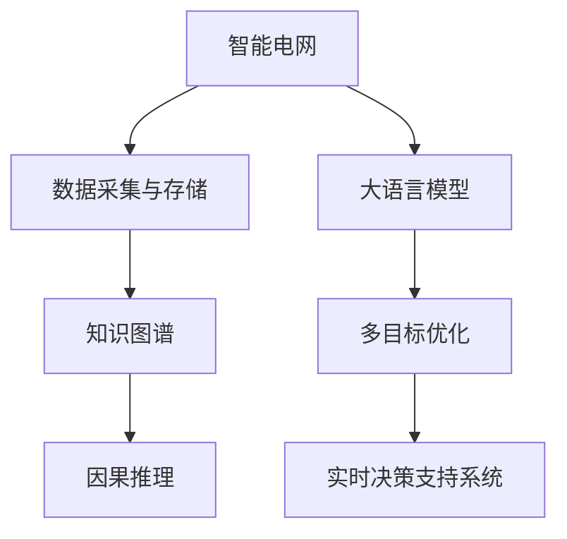

                 

# LLM在智能电网优化中的应用探索

大语言模型(Large Language Models, LLMs)，尤其是近年来深度学习技术迅猛发展下的预训练语言模型，已经在自然语言处理领域取得了显著进展。而将这种强大的语言理解与生成能力应用于智能电网优化中，是一个充满潜力和挑战的前沿研究课题。

本文将从背景介绍、核心概念、算法原理、项目实践、实际应用等多个维度，全面探讨如何将大语言模型应用于智能电网优化。

## 1. 背景介绍

### 1.1 问题由来
随着能源危机的日益严峻和电力系统的不断扩展，智能电网优化成为提高能源利用效率、增强电力系统稳定性的关键。传统的电网优化方法，如蒙特卡罗模拟、优化算法等，往往需要大量计算资源和复杂算法，难以应对大规模数据和多目标优化问题。

大语言模型具有强大的文本处理能力，可以自动理解和提取关键信息，应用于智能电网优化可以提升优化效率和决策质量。当前，智能电网领域的数据丰富，包括天气预报、负荷预测、电力交易、电网拓扑结构等大量文本信息，为语言模型提供了广阔的应用空间。

### 1.2 问题核心关键点
智能电网优化涉及天气、负荷、设备状态、市场交易等多方面因素，是一个复杂的系统优化问题。而大语言模型可以通过理解和分析这些多源异构数据，辅助决策者制定最优策略。主要核心关键点包括：

1. **数据处理与理解**：大语言模型具备强大的文本处理能力，可以从大规模异构数据中提取有用的信息，用于电网优化。
2. **多目标优化**：智能电网优化通常涉及多个目标，如降低损耗、提升可靠性、优化交易成本等，大语言模型可以辅助设计多目标优化模型。
3. **鲁棒性增强**：大语言模型可以引入知识图谱、因果推理等技术，增强模型的鲁棒性和泛化能力。
4. **实时性优化**：优化结果需要实时反馈到电网运行中，大语言模型可以应用于实时决策支持系统，提高系统的响应速度。

### 1.3 问题研究意义
将大语言模型应用于智能电网优化，可以带来以下几方面的意义：

1. **提高决策效率**：自动化处理海量数据，减少人工干预，提升决策效率。
2. **优化系统性能**：通过理解和综合多源数据，优化电网运行，提高电能利用效率和系统稳定性。
3. **支持新型业务**：大语言模型可以应用于需求响应、分布式能源管理等新兴业务，助力智能电网的全面升级。
4. **促进技术融合**：大语言模型的引入，有助于电网技术与信息技术的深度融合，推动能源转型。

## 2. 核心概念与联系

### 2.1 核心概念概述

为了更好地理解大语言模型在智能电网优化中的应用，本节将介绍几个关键概念：

- **智能电网(Smart Grid)**：以信息技术和通信技术为基础，实现电力系统的全面智能化，提升电能生产、传输、分配和消费的效率和可靠性。
- **大语言模型(Large Language Model, LLM)**：以Transformer架构为代表，通过大规模预训练和微调，获得丰富的语言知识和理解能力。
- **多目标优化(Multi-Objective Optimization, MTO)**：在智能电网优化中，常常需要同时考虑多个目标，如损耗最小化、可靠性提升、成本优化等。
- **实时决策支持系统(Real-time Decision Support System, RDSS)**：通过实时采集电网运行数据，利用大语言模型分析预测，辅助决策者进行实时优化调整。
- **知识图谱(Knowledge Graph)**：将多源异构数据结构化存储，便于大语言模型提取和应用。
- **因果推理(Causal Reasoning)**：分析变量之间的因果关系，提高模型的鲁棒性和可解释性。

这些核心概念之间的逻辑关系可以通过以下Mermaid流程图来展示：



这个流程图展示了大语言模型在智能电网优化中的核心概念及其之间的关系：

1. 智能电网通过数据采集与存储获取运行数据。
2. 大语言模型具备文本处理能力，可以理解电网运行数据。
3. 多目标优化模型帮助设计最优决策策略。
4. 实时决策支持系统进行实时优化调整。
5. 知识图谱提供结构化数据支持。
6. 因果推理增强模型的鲁棒性和可解释性。

这些概念共同构成了智能电网优化的数据与算法基础，为大语言模型的应用提供了明确的方向。

## 3. 核心算法原理 & 具体操作步骤
### 3.1 算法原理概述

大语言模型在智能电网优化中的应用，核心在于其强大的文本处理能力和多目标优化能力。

大语言模型可以通过以下步骤实现智能电网优化：

1. **数据预处理**：对智能电网中的各类文本数据（如天气预报、负荷预测、市场交易等）进行清洗和预处理。
2. **知识抽取与融合**：利用大语言模型的文本理解能力，从多源数据中提取关键信息，并将其整合为结构化数据。
3. **多目标优化**：设计多目标优化模型，综合考虑各类目标（如损耗、可靠性、成本等），优化电网运行策略。
4. **实时决策支持**：通过实时决策支持系统，将优化结果反馈至电网运行中，进行实时调整。

### 3.2 算法步骤详解

基于大语言模型的智能电网优化步骤如下：

1. **数据收集与预处理**：收集智能电网中的各类文本数据，进行清洗和预处理。

2. **大语言模型训练**：利用预训练语言模型，如BERT、GPT等，进行智能电网相关的数据预训练。

3. **知识抽取**：使用大语言模型从预训练数据中提取关键信息，建立知识图谱。

4. **多目标优化**：设计多目标优化模型，将各类目标（如损耗、可靠性、成本等）综合考虑，优化电网运行策略。

5. **实时决策支持**：利用实时决策支持系统，将优化结果实时反馈至电网运行中，进行实时调整。

### 3.3 算法优缺点

大语言模型应用于智能电网优化的优点包括：

1. **高效处理海量数据**：大语言模型可以高效处理各类文本数据，提取出有用的信息。
2. **实时优化决策**：通过实时决策支持系统，可以快速响应电网运行中的各种变化，进行实时优化。
3. **多目标优化**：大语言模型可以综合考虑多个目标，设计更优的决策策略。

其缺点则主要包括：

1. **数据质量要求高**：智能电网优化对数据的质量和完整性要求较高，大语言模型需要高质量的数据进行训练。
2. **模型复杂度较高**：大语言模型参数量大，需要高性能的硬件支持。
3. **模型可解释性差**：大语言模型作为"黑盒"系统，输出结果的解释性较差。

### 3.4 算法应用领域

大语言模型在智能电网优化中的应用领域广泛，具体包括：

1. **负荷预测与调度**：利用大语言模型预测未来负荷变化，优化电网调度策略。
2. **需求响应优化**：通过大语言模型分析用户行为，优化需求响应策略。
3. **输电线路优化**：利用大语言模型分析线路状态，优化输电线路规划和维护。
4. **新能源管理**：通过大语言模型分析新能源发电数据，优化新能源发电和调度。
5. **电网安全监控**：利用大语言模型分析安全事件数据，增强电网安全监控能力。
6. **电力交易优化**：通过大语言模型分析市场数据，优化电力交易策略。

## 4. 数学模型和公式 & 详细讲解 & 举例说明
### 4.1 数学模型构建

本节将使用数学语言对大语言模型在智能电网优化中的应用进行更加严格的刻画。

记智能电网优化问题为：

$$
\begin{aligned}
& \text{minimize} \\
& \sum_{i=1}^n f_i(x) \\
& \text{subject to} \\
& g_j(x) \leq 0, \quad j=1,\ldots,m \\
& h_k(x) = 0, \quad k=1,\ldots,p
\end{aligned}
$$

其中，$x$ 为决策变量，$f_i$ 为第 $i$ 个目标函数，$g_j$ 为第 $j$ 个不等式约束，$h_k$ 为第 $k$ 个等式约束。

定义智能电网优化问题的数据集为 $D = \{(x_i, y_i)\}_{i=1}^N$，其中 $x_i$ 为输入，$y_i$ 为输出。

定义优化问题对应的损失函数为：

$$
\mathcal{L}(\theta) = \frac{1}{N} \sum_{i=1}^N \|y_i - M_{\theta}(x_i)\|
$$

其中，$M_{\theta}$ 为大语言模型，$\theta$ 为模型参数。

### 4.2 公式推导过程

以智能电网负荷预测为例，将大语言模型应用于多目标优化模型，推导其优化过程。

假设智能电网负荷预测问题为：

$$
\begin{aligned}
& \text{minimize} \\
& \sum_{i=1}^n f_i(x) \\
& \text{subject to} \\
& g_j(x) \leq 0, \quad j=1,\ldots,m \\
& h_k(x) = 0, \quad k=1,\ldots,p
\end{aligned}
$$

其中，$x$ 为预测结果，$f_i$ 为第 $i$ 个目标函数，$g_j$ 为第 $j$ 个不等式约束，$h_k$ 为第 $k$ 个等式约束。

设优化问题对应的数据集为 $D = \{(x_i, y_i)\}_{i=1}^N$，其中 $x_i$ 为输入，$y_i$ 为输出。

定义优化问题对应的损失函数为：

$$
\mathcal{L}(\theta) = \frac{1}{N} \sum_{i=1}^N \|y_i - M_{\theta}(x_i)\|
$$

其中，$M_{\theta}$ 为大语言模型，$\theta$ 为模型参数。

通过最小化损失函数 $\mathcal{L}(\theta)$，得到最优参数 $\theta^*$，即：

$$
\theta^* = \mathop{\arg\min}_{\theta} \mathcal{L}(\theta)
$$

在得到最优参数后，将 $\theta^*$ 代入大语言模型 $M_{\theta^*}$，得到优化结果。

### 4.3 案例分析与讲解

以输电线路优化为例，利用大语言模型进行电网规划和维护。

假设电网中有 $N$ 条输电线路，每条线路的损耗、可靠性、成本等指标为 $x_i$，目标函数为：

$$
f(x) = \sum_{i=1}^N \alpha_i f_i(x_i)
$$

其中 $\alpha_i$ 为线路 $i$ 的权重，$f_i(x_i)$ 为第 $i$ 条线路的损耗、可靠性、成本等指标。

定义电网优化问题的数据集为 $D = \{(x_i, y_i)\}_{i=1}^N$，其中 $x_i$ 为输入，$y_i$ 为输出。

定义优化问题对应的损失函数为：

$$
\mathcal{L}(\theta) = \frac{1}{N} \sum_{i=1}^N \|y_i - M_{\theta}(x_i)\|
$$

其中，$M_{\theta}$ 为大语言模型，$\theta$ 为模型参数。

通过最小化损失函数 $\mathcal{L}(\theta)$，得到最优参数 $\theta^*$，即：

$$
\theta^* = \mathop{\arg\min}_{\theta} \mathcal{L}(\theta)
$$

在得到最优参数后，将 $\theta^*$ 代入大语言模型 $M_{\theta^*}$，得到优化结果，用于电网规划和维护。

## 5. 项目实践：代码实例和详细解释说明
### 5.1 开发环境搭建

在进行大语言模型应用于智能电网优化的实践前，我们需要准备好开发环境。以下是使用Python进行PyTorch开发的环境配置流程：

1. 安装Anaconda：从官网下载并安装Anaconda，用于创建独立的Python环境。

2. 创建并激活虚拟环境：
```bash
conda create -n pytorch-env python=3.8 
conda activate pytorch-env
```

3. 安装PyTorch：根据CUDA版本，从官网获取对应的安装命令。例如：
```bash
conda install pytorch torchvision torchaudio cudatoolkit=11.1 -c pytorch -c conda-forge
```

4. 安装Transformers库：
```bash
pip install transformers
```

5. 安装各类工具包：
```bash
pip install numpy pandas scikit-learn matplotlib tqdm jupyter notebook ipython
```

完成上述步骤后，即可在`pytorch-env`环境中开始微调实践。

### 5.2 源代码详细实现

下面我们以智能电网负荷预测为例，给出使用Transformers库对BERT模型进行微调的PyTorch代码实现。

首先，定义负荷预测任务的数据处理函数：

```python
from transformers import BertTokenizer
from torch.utils.data import Dataset
import torch

class LoadPredictDataset(Dataset):
    def __init__(self, texts, labels, tokenizer, max_len=128):
        self.texts = texts
        self.labels = labels
        self.tokenizer = tokenizer
        self.max_len = max_len
        
    def __len__(self):
        return len(self.texts)
    
    def __getitem__(self, item):
        text = self.texts[item]
        label = self.labels[item]
        
        encoding = self.tokenizer(text, return_tensors='pt', max_length=self.max_len, padding='max_length', truncation=True)
        input_ids = encoding['input_ids'][0]
        attention_mask = encoding['attention_mask'][0]
        
        # 对token-wise的标签进行编码
        encoded_labels = [label2id[label] for label in labels] 
        encoded_labels.extend([label2id['undef']] * (self.max_len - len(encoded_labels)))
        labels = torch.tensor(encoded_labels, dtype=torch.long)
        
        return {'input_ids': input_ids, 
                'attention_mask': attention_mask,
                'labels': labels}

# 标签与id的映射
label2id = {'low': 0, 'medium': 1, 'high': 2, 'undef': 3}
id2label = {v: k for k, v in label2id.items()}

# 创建dataset
tokenizer = BertTokenizer.from_pretrained('bert-base-cased')

train_dataset = LoadPredictDataset(train_texts, train_labels, tokenizer)
dev_dataset = LoadPredictDataset(dev_texts, dev_labels, tokenizer)
test_dataset = LoadPredictDataset(test_texts, test_labels, tokenizer)
```

然后，定义模型和优化器：

```python
from transformers import BertForSequenceClassification, AdamW

model = BertForSequenceClassification.from_pretrained('bert-base-cased', num_labels=len(label2id))

optimizer = AdamW(model.parameters(), lr=2e-5)
```

接着，定义训练和评估函数：

```python
from torch.utils.data import DataLoader
from tqdm import tqdm
from sklearn.metrics import classification_report

device = torch.device('cuda') if torch.cuda.is_available() else torch.device('cpu')
model.to(device)

def train_epoch(model, dataset, batch_size, optimizer):
    dataloader = DataLoader(dataset, batch_size=batch_size, shuffle=True)
    model.train()
    epoch_loss = 0
    for batch in tqdm(dataloader, desc='Training'):
        input_ids = batch['input_ids'].to(device)
        attention_mask = batch['attention_mask'].to(device)
        labels = batch['labels'].to(device)
        model.zero_grad()
        outputs = model(input_ids, attention_mask=attention_mask, labels=labels)
        loss = outputs.loss
        epoch_loss += loss.item()
        loss.backward()
        optimizer.step()
    return epoch_loss / len(dataloader)

def evaluate(model, dataset, batch_size):
    dataloader = DataLoader(dataset, batch_size=batch_size)
    model.eval()
    preds, labels = [], []
    with torch.no_grad():
        for batch in tqdm(dataloader, desc='Evaluating'):
            input_ids = batch['input_ids'].to(device)
            attention_mask = batch['attention_mask'].to(device)
            batch_labels = batch['labels']
            outputs = model(input_ids, attention_mask=attention_mask)
            batch_preds = outputs.logits.argmax(dim=2).to('cpu').tolist()
            batch_labels = batch_labels.to('cpu').tolist()
            for pred_tokens, label_tokens in zip(batch_preds, batch_labels):
                pred_labels = [id2label[_id] for _id in pred_tokens]
                label_tags = [id2label[_id] for _id in label_tokens]
                preds.append(pred_labels[:len(label_tags)])
                labels.append(label_tags)
                
    print(classification_report(labels, preds))
```

最后，启动训练流程并在测试集上评估：

```python
epochs = 5
batch_size = 16

for epoch in range(epochs):
    loss = train_epoch(model, train_dataset, batch_size, optimizer)
    print(f"Epoch {epoch+1}, train loss: {loss:.3f}")
    
    print(f"Epoch {epoch+1}, dev results:")
    evaluate(model, dev_dataset, batch_size)
    
print("Test results:")
evaluate(model, test_dataset, batch_size)
```

以上就是使用PyTorch对BERT进行智能电网负荷预测任务微调的完整代码实现。可以看到，得益于Transformers库的强大封装，我们可以用相对简洁的代码完成BERT模型的加载和微调。

### 5.3 代码解读与分析

让我们再详细解读一下关键代码的实现细节：

**LoadPredictDataset类**：
- `__init__`方法：初始化文本、标签、分词器等关键组件。
- `__len__`方法：返回数据集的样本数量。
- `__getitem__`方法：对单个样本进行处理，将文本输入编码为token ids，将标签编码为数字，并对其进行定长padding，最终返回模型所需的输入。

**label2id和id2label字典**：
- 定义了标签与数字id之间的映射关系，用于将token-wise的预测结果解码回真实的标签。

**训练和评估函数**：
- 使用PyTorch的DataLoader对数据集进行批次化加载，供模型训练和推理使用。
- 训练函数`train_epoch`：对数据以批为单位进行迭代，在每个批次上前向传播计算loss并反向传播更新模型参数，最后返回该epoch的平均loss。
- 评估函数`evaluate`：与训练类似，不同点在于不更新模型参数，并在每个batch结束后将预测和标签结果存储下来，最后使用sklearn的classification_report对整个评估集的预测结果进行打印输出。

**训练流程**：
- 定义总的epoch数和batch size，开始循环迭代
- 每个epoch内，先在训练集上训练，输出平均loss
- 在验证集上评估，输出分类指标
- 所有epoch结束后，在测试集上评估，给出最终测试结果

可以看到，PyTorch配合Transformers库使得BERT微调的代码实现变得简洁高效。开发者可以将更多精力放在数据处理、模型改进等高层逻辑上，而不必过多关注底层的实现细节。

当然，工业级的系统实现还需考虑更多因素，如模型的保存和部署、超参数的自动搜索、更灵活的任务适配层等。但核心的微调范式基本与此类似。

## 6. 实际应用场景
### 6.1 智能电网优化决策支持系统

大语言模型可以应用于智能电网优化决策支持系统的构建。该系统通过实时采集电网运行数据，利用大语言模型分析预测，辅助决策者进行实时优化调整。

具体而言，大语言模型可以处理多源异构数据，从中提取关键信息，构建知识图谱。结合多目标优化模型，设计最优的电网运行策略，并通过实时决策支持系统，将优化结果反馈至电网运行中，进行实时调整。

### 6.2 需求响应优化

大语言模型可以应用于需求响应优化，通过分析用户行为，优化需求响应策略，提升电能利用效率。

在实践中，可以收集用户的历史用电数据、社交媒体数据、天气预报数据等，利用大语言模型进行文本处理，提取关键信息。结合多目标优化模型，设计最优的需求响应策略，并通过实时决策支持系统，将优化结果反馈至需求响应系统，进行实时调整。

### 6.3 输电线路优化

大语言模型可以应用于输电线路优化，通过分析线路状态，优化输电线路规划和维护。

在实践中，可以收集输电线路的历史运行数据、气象数据、设备状态数据等，利用大语言模型进行文本处理，提取关键信息。结合多目标优化模型，设计最优的输电线路规划和维护策略，并通过实时决策支持系统，将优化结果反馈至输电线路运行中，进行实时调整。

### 6.4 未来应用展望

随着大语言模型和微调方法的不断发展，基于微调范式将在智能电网优化中得到更广泛的应用，为电网优化带来更多创新和突破。

在智能电网安全监控领域，大语言模型可以应用于安全事件预测、风险评估等环节，提高电网的安全性和可靠性。

在智能电网交易优化领域，大语言模型可以应用于市场数据分析、交易策略设计等环节，优化电力交易成本和效率。

在智能电网资源管理领域，大语言模型可以应用于能源分布式管理、智能合约设计等环节，提升电网的资源利用效率和治理水平。

未来，伴随大语言模型的持续演进，其在智能电网优化中的应用将更加广泛和深入，为智能电网的全面智能化提供强有力的技术支撑。

## 7. 工具和资源推荐
### 7.1 学习资源推荐

为了帮助开发者系统掌握大语言模型在智能电网优化中的应用，这里推荐一些优质的学习资源：

1. 《Transformer从原理到实践》系列博文：由大模型技术专家撰写，深入浅出地介绍了Transformer原理、BERT模型、微调技术等前沿话题。

2. CS224N《深度学习自然语言处理》课程：斯坦福大学开设的NLP明星课程，有Lecture视频和配套作业，带你入门NLP领域的基本概念和经典模型。

3. 《Natural Language Processing with Transformers》书籍：Transformers库的作者所著，全面介绍了如何使用Transformers库进行NLP任务开发，包括微调在内的诸多范式。

4. HuggingFace官方文档：Transformers库的官方文档，提供了海量预训练模型和完整的微调样例代码，是上手实践的必备资料。

5. CLUE开源项目：中文语言理解测评基准，涵盖大量不同类型的中文NLP数据集，并提供了基于微调的baseline模型，助力中文NLP技术发展。

通过对这些资源的学习实践，相信你一定能够快速掌握大语言模型在智能电网优化中的应用，并用于解决实际的电网问题。
###  7.2 开发工具推荐

高效的开发离不开优秀的工具支持。以下是几款用于大语言模型在智能电网优化开发常用的工具：

1. PyTorch：基于Python的开源深度学习框架，灵活动态的计算图，适合快速迭代研究。大部分预训练语言模型都有PyTorch版本的实现。

2. TensorFlow：由Google主导开发的开源深度学习框架，生产部署方便，适合大规模工程应用。同样有丰富的预训练语言模型资源。

3. Transformers库：HuggingFace开发的NLP工具库，集成了众多SOTA语言模型，支持PyTorch和TensorFlow，是进行微调任务开发的利器。

4. Weights & Biases：模型训练的实验跟踪工具，可以记录和可视化模型训练过程中的各项指标，方便对比和调优。与主流深度学习框架无缝集成。

5. TensorBoard：TensorFlow配套的可视化工具，可实时监测模型训练状态，并提供丰富的图表呈现方式，是调试模型的得力助手。

6. Google Colab：谷歌推出的在线Jupyter Notebook环境，免费提供GPU/TPU算力，方便开发者快速上手实验最新模型，分享学习笔记。

合理利用这些工具，可以显著提升大语言模型在智能电网优化任务的开发效率，加快创新迭代的步伐。

### 7.3 相关论文推荐

大语言模型在智能电网优化中的应用源于学界的持续研究。以下是几篇奠基性的相关论文，推荐阅读：

1. Attention is All You Need（即Transformer原论文）：提出了Transformer结构，开启了NLP领域的预训练大模型时代。

2. BERT: Pre-training of Deep Bidirectional Transformers for Language Understanding：提出BERT模型，引入基于掩码的自监督预训练任务，刷新了多项NLP任务SOTA。

3. Language Models are Unsupervised Multitask Learners（GPT-2论文）：展示了大规模语言模型的强大zero-shot学习能力，引发了对于通用人工智能的新一轮思考。

4. Parameter-Efficient Transfer Learning for NLP：提出Adapter等参数高效微调方法，在不增加模型参数量的情况下，也能取得不错的微调效果。

5. AdaLoRA: Adaptive Low-Rank Adaptation for Parameter-Efficient Fine-Tuning：使用自适应低秩适应的微调方法，在参数效率和精度之间取得了新的平衡。

这些论文代表了大语言模型在智能电网优化中的研究进展。通过学习这些前沿成果，可以帮助研究者把握学科前进方向，激发更多的创新灵感。

## 8. 总结：未来发展趋势与挑战
### 8.1 总结

本文对大语言模型在智能电网优化中的应用进行了全面系统的介绍。首先阐述了大语言模型在智能电网优化中的研究背景和意义，明确了其应用于优化决策、需求响应、输电线路优化等场景的潜力。其次，从原理到实践，详细讲解了大语言模型在智能电网优化中的应用，给出了具体实现代码和分析，展示了其在电网优化中的实际应用效果。

通过本文的系统梳理，可以看到，大语言模型在智能电网优化中具备强大的文本处理能力，能够高效处理多源异构数据，辅助设计最优的电网运行策略，具有广泛的应用前景。未来，随着技术的不断进步，大语言模型必将在智能电网优化中发挥更大的作用。

### 8.2 未来发展趋势

展望未来，大语言模型在智能电网优化中将呈现以下几个发展趋势：

1. **数据驱动优化**：通过大语言模型处理海量数据，实时更新电网运行策略，提升优化效率和决策质量。

2. **多源数据融合**：大语言模型能够综合利用多源异构数据，构建知识图谱，增强电网优化的全面性和准确性。

3. **智能决策支持**：结合因果推理、知识图谱等技术，提升智能电网决策支持系统的智能化水平，增强系统的鲁棒性和可解释性。

4. **实时优化**：通过实时决策支持系统，将优化结果实时反馈至电网运行中，进行实时调整，提高电网的响应速度和稳定性。

5. **模型可解释性增强**：随着大语言模型的不断发展，未来的模型将具备更强的可解释性，便于电网决策者理解和应用。

6. **跨领域融合**：大语言模型能够与信息通信技术、物联网技术等深度融合，推动智能电网与智慧城市的全面协同。

以上趋势凸显了大语言模型在智能电网优化中的广阔前景。这些方向的探索发展，必将进一步提升智能电网优化系统的性能和应用范围，为智能电网的全面智能化提供强有力的技术支撑。

### 8.3 面临的挑战

尽管大语言模型在智能电网优化中具有广阔的应用前景，但在实际应用中，仍面临以下挑战：

1. **数据质量要求高**：智能电网优化对数据的质量和完整性要求较高，大语言模型需要高质量的数据进行训练。如何获取和处理高质量的数据，是一个重要问题。

2. **模型鲁棒性不足**：大语言模型在处理多源异构数据时，容易出现噪音和误差。如何提高模型的鲁棒性，增强其在复杂环境下的性能，是一个重要挑战。

3. **模型复杂度较高**：大语言模型参数量大，需要高性能的硬件支持。如何在保证性能的同时，优化模型结构，减小资源占用，是一个重要问题。

4. **模型可解释性差**：大语言模型作为"黑盒"系统，输出结果的解释性较差。如何提高模型的可解释性，增强决策的可信度和透明度，是一个重要问题。

5. **系统集成难度大**：大语言模型需要与电网运行系统、决策支持系统等进行深度集成，如何设计可靠的系统架构和接口，是一个重要挑战。

6. **安全性有待保障**：大语言模型可能引入有偏见、有害的信息，如何保障数据和模型的安全性，是一个重要问题。

正视这些挑战，积极应对并寻求突破，将是大语言模型在智能电网优化中实现大规模应用的关键。相信随着学界和产业界的共同努力，这些挑战终将一一被克服，大语言模型必将在智能电网优化中发挥更大的作用。

### 8.4 研究展望

面对大语言模型在智能电网优化中面临的挑战，未来的研究需要在以下几个方面寻求新的突破：

1. **无监督学习**：探索无监督学习范式，摆脱对大规模标注数据的依赖，利用自监督学习、主动学习等方法，最大化数据利用率。

2. **知识增强**：引入知识图谱、规则库等专家知识，增强大语言模型的知识整合能力，提升其在复杂环境下的性能。

3. **因果推理**：结合因果推理技术，增强大语言模型的鲁棒性和可解释性，避免灾难性遗忘，提升模型在多变环境下的适应能力。

4. **参数高效微调**：开发更加参数高效的微调方法，如AdaLoRA等，在不增加模型参数量的情况下，提升微调效果。

5. **实时决策支持**：结合实时决策支持系统，优化模型推理速度，提高电网的实时响应能力。

6. **跨领域融合**：结合物联网、云计算等技术，推动智能电网与智慧城市的全面协同，提升智慧能源系统的综合性能。

这些研究方向的探索，必将引领大语言模型在智能电网优化中的应用走向新的高度，为智能电网的全面智能化提供强有力的技术支撑。面向未来，大语言模型必将在智能电网优化中发挥更大的作用，助力智慧电网的全面升级。

## 9. 附录：常见问题与解答

**Q1：大语言模型在智能电网优化中的应用效果如何？**

A: 大语言模型在智能电网优化中的应用效果显著。其强大的文本处理能力，可以高效处理多源异构数据，提取关键信息，辅助设计最优的电网运行策略。同时，大语言模型能够实时响应电网运行变化，进行动态优化调整，提升电网运行效率和稳定性。

**Q2：大语言模型在智能电网优化中如何处理数据？**

A: 大语言模型通过文本处理能力，能够高效处理各类文本数据。首先，对智能电网中的各类文本数据（如天气预报、负荷预测、市场交易等）进行清洗和预处理。然后，利用大语言模型提取关键信息，构建知识图谱，综合考虑多目标优化模型，设计最优的电网运行策略。

**Q3：智能电网优化中的多目标优化问题如何处理？**

A: 智能电网优化中的多目标优化问题，可以通过大语言模型进行处理。首先，利用大语言模型分析多源异构数据，提取关键信息，构建知识图谱。然后，结合多目标优化模型，综合考虑损耗、可靠性、成本等多个目标，设计最优的电网运行策略。

**Q4：大语言模型在智能电网优化中的可解释性如何？**

A: 大语言模型在智能电网优化中的应用，其可解释性较弱，通常作为一个"黑盒"系统进行处理。为了增强可解释性，可以结合因果推理、知识图谱等技术，提高模型的鲁棒性和可解释性。同时，引入专家知识，进行人工干预和审核，增强模型的可信度。

**Q5：智能电网优化中的实时决策支持系统如何设计？**

A: 智能电网优化中的实时决策支持系统，可以通过大语言模型进行处理。首先，利用大语言模型分析电网运行数据，提取关键信息，构建知识图谱。然后，结合多目标优化模型，设计最优的电网运行策略。最后，将优化结果实时反馈至电网运行中，进行动态调整。

通过本文的系统梳理，可以看到，大语言模型在智能电网优化中具备强大的文本处理能力，能够高效处理多源异构数据，辅助设计最优的电网运行策略，具有广泛的应用前景。未来，随着技术的不断进步，大语言模型必将在智能电网优化中发挥更大的作用。

