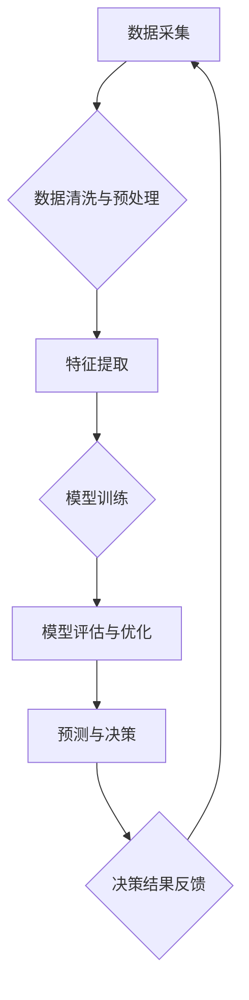

                 

## 数字化直觉：AI增强的决策能力

> 关键词：人工智能、决策支持系统、机器学习、深度学习、数据分析、直觉推理、预测模型、商业智能

### 1. 背景介绍

在当今数据爆炸的时代，人类面临着前所未有的决策压力。从商业策略到个人生活，我们每天都需要做出无数次选择，而这些选择的影响力也越来越大。传统的决策方法往往依赖于经验和直觉，但随着数据量的激增，单纯依靠人类的判断力已难以胜任。

人工智能（AI）的兴起为我们提供了新的希望。AI算法能够从海量数据中提取有价值的信息，并根据这些信息做出更准确、更有效的决策。然而，AI并非万能，它也需要人类的指导和解释。

本文将探讨如何利用AI技术增强人类的决策能力，帮助我们培养“数字化直觉”。我们将深入分析AI驱动的决策支持系统的工作原理，并通过具体的案例和代码实例，展示AI如何帮助我们做出更明智的选择。

### 2. 核心概念与联系

**2.1 决策支持系统 (DSS)**

决策支持系统 (DSS) 是利用计算机技术帮助人们进行决策的系统。它通常包含以下几个核心组件：

* **数据仓库:** 存储来自各种来源的数据，包括历史数据、实时数据和外部数据。
* **数据分析工具:** 用于分析数据，发现模式和趋势。
* **模型引擎:** 用于构建预测模型，帮助人们预测未来的结果。
* **用户界面:** 用于用户与系统交互，输入数据、查看结果和做出决策。

**2.2 人工智能 (AI)**

人工智能 (AI) 是指模拟人类智能的计算机系统。AI算法能够学习、推理和解决问题，并不断改进其性能。常见的AI算法包括：

* **机器学习 (ML):** 算法从数据中学习，并根据学习到的知识做出预测。
* **深度学习 (DL):** 一种更高级的机器学习算法，使用多层神经网络模拟人类大脑的结构和功能。
* **自然语言处理 (NLP):** 算法能够理解和处理人类语言。

**2.3 数字化直觉**

数字化直觉是指通过AI技术分析数据，并根据分析结果形成的决策判断。它是一种基于数据驱动的直觉，能够帮助人们做出更明智、更有效的决策。

**2.4 流程图**



### 3. 核心算法原理 & 具体操作步骤

**3.1 算法原理概述**

本文将重点介绍机器学习算法在决策支持系统中的应用。机器学习算法能够从数据中学习，并根据学习到的知识做出预测。常见的机器学习算法包括：

* **线性回归:** 用于预测连续变量。
* **逻辑回归:** 用于预测分类变量。
* **决策树:** 用于分类和回归问题。
* **支持向量机 (SVM):** 用于分类问题。
* **随机森林:** 结合多个决策树，提高预测精度。

**3.2 算法步骤详解**

1. **数据采集:** 从各种来源收集相关数据，例如历史销售数据、客户行为数据、市场趋势数据等。
2. **数据清洗与预处理:** 处理收集到的数据，例如删除缺失值、处理异常值、转换数据类型等。
3. **特征提取:** 从原始数据中提取有价值的特征，例如客户年龄、购买频率、产品类别等。
4. **模型训练:** 使用机器学习算法对训练数据进行训练，学习数据中的模式和关系。
5. **模型评估与优化:** 使用测试数据评估模型的性能，并根据评估结果调整模型参数，提高模型精度。
6. **预测与决策:** 将训练好的模型应用于新的数据，进行预测，并根据预测结果做出决策。

**3.3 算法优缺点**

不同的机器学习算法具有不同的优缺点，选择合适的算法取决于具体应用场景。

* **线性回归:** 优点: 简单易懂，计算速度快。缺点: 只能处理线性关系，对异常值敏感。
* **逻辑回归:** 优点: 用于分类问题，易于解释。缺点: 只能处理线性可分的数据。
* **决策树:** 优点: 易于理解和解释，可以处理非线性关系。缺点: 容易过拟合，对数据特征的顺序敏感。
* **支持向量机 (SVM):** 优点: 能够处理高维数据，对噪声数据鲁棒性强。缺点: 计算复杂度高，参数选择困难。
* **随机森林:** 优点: 预测精度高，对过拟合问题鲁棒性强。缺点: 难以解释模型决策过程。

**3.4 算法应用领域**

机器学习算法在各个领域都有广泛的应用，例如：

* **商业智能:** 预测销售趋势、客户行为、市场风险等。
* **金融科技:** 欺诈检测、信用评分、投资决策等。
* **医疗保健:** 疾病诊断、药物研发、患者风险评估等。
* **制造业:** 预测设备故障、优化生产流程、质量控制等。

### 4. 数学模型和公式 & 详细讲解 & 举例说明

**4.1 数学模型构建**

线性回归模型试图找到一条直线，将输入特征与输出变量进行拟合。其数学模型可以表示为：

$$y = w_0 + w_1x_1 + w_2x_2 + ... + w_nx_n + \epsilon$$

其中：

* $y$ 是输出变量
* $x_1, x_2, ..., x_n$ 是输入特征
* $w_0, w_1, w_2, ..., w_n$ 是模型参数
* $\epsilon$ 是误差项

**4.2 公式推导过程**

线性回归模型的参数可以通过最小二乘法进行估计。最小二乘法试图找到一组参数，使得模型预测值与实际值之间的误差平方和最小。

**4.3 案例分析与讲解**

假设我们想要预测房屋价格，输入特征包括房屋面积、房间数量、地理位置等。我们可以使用线性回归模型来建立房屋价格预测模型。

通过训练数据，我们可以估计出模型参数，例如：

* $w_0 = 100000$
* $w_1 = 500$ (房屋面积每增加1平方米，价格增加500元)
* $w_2 = 10000$ (每增加一间房间，价格增加10000元)

根据这些参数，我们可以预测新房子的价格。例如，如果新房子的面积为100平方米，房间数量为3间，地理位置为市中心，那么我们可以预测其价格为：

$$y = 100000 + 500 * 100 + 10000 * 3 = 200000$$

### 5. 项目实践：代码实例和详细解释说明

**5.1 开发环境搭建**

本项目使用Python语言进行开发，需要安装以下软件：

* Python 3.x
* Jupyter Notebook
* scikit-learn

**5.2 源代码详细实现**

```python
from sklearn.linear_model import LinearRegression
from sklearn.model_selection import train_test_split
import pandas as pd

# 加载数据
data = pd.read_csv('house_price.csv')

# 划分训练集和测试集
X = data[['area', 'rooms']]
y = data['price']
X_train, X_test, y_train, y_test = train_test_split(X, y, test_size=0.2, random_state=42)

# 创建线性回归模型
model = LinearRegression()

# 训练模型
model.fit(X_train, y_train)

# 预测测试集数据
y_pred = model.predict(X_test)

# 评估模型性能
from sklearn.metrics import mean_squared_error
mse = mean_squared_error(y_test, y_pred)
print('Mean Squared Error:', mse)
```

**5.3 代码解读与分析**

1. 首先，我们加载数据并划分训练集和测试集。
2. 然后，我们创建线性回归模型并训练模型。
3. 训练完成后，我们可以使用模型预测测试集数据。
4. 最后，我们评估模型性能，例如使用均方误差 (MSE) 来衡量模型预测的准确性。

**5.4 运行结果展示**

运行代码后，会输出模型的均方误差值。较低的均方误差值表示模型的预测精度较高。

### 6. 实际应用场景

**6.1 商业智能**

* **市场预测:** 利用历史销售数据和市场趋势数据，预测未来产品的销量和市场需求。
* **客户行为分析:** 分析客户的购买行为、浏览记录和反馈信息，预测客户的购买意愿和潜在需求。
* **风险管理:** 利用金融数据和市场数据，预测潜在的金融风险，帮助企业制定风险管理策略。

**6.2 金融科技**

* **欺诈检测:** 利用交易数据和用户行为数据，识别异常交易行为，防止金融欺诈。
* **信用评分:** 利用客户的信用历史和财务数据，评估客户的信用风险，为贷款和保险提供参考。
* **投资决策:** 利用市场数据和公司财务数据，预测股票价格和投资回报率，帮助投资者做出更明智的投资决策。

**6.3 医疗保健**

* **疾病诊断:** 利用患者的症状、病史和检查结果，预测患者患病的可能性，辅助医生进行诊断。
* **药物研发:** 利用生物数据和临床试验数据，预测药物的疗效和安全性，加速药物研发过程。
* **患者风险评估:** 利用患者的健康状况和生活方式数据，预测患者患病的风险，帮助医生制定个性化的治疗方案。

**6.4 未来应用展望**

随着人工智能技术的不断发展，AI驱动的决策支持系统将应用于更多领域，例如：

* **教育:** 个性化学习推荐、学生成绩预测、教学质量评估等。
* **交通:** 智能交通管理、自动驾驶、交通事故预测等。
* **环境保护:** 环境污染预测、资源管理、气候变化模拟等。

### 7. 工具和资源推荐

**7.1 学习资源推荐**

* **在线课程:** Coursera, edX, Udacity 等平台提供丰富的机器学习和人工智能课程。
* **书籍:** 《机器学习》 (周志华), 《深度学习》 (Ian Goodfellow) 等书籍是机器学习和深度学习的经典教材。
* **博客和论坛:** Kaggle, Towards Data Science 等网站提供大量的机器学习和人工智能相关的博客文章和论坛讨论。

**7.2 开发工具推荐**

* **Python:** 机器学习和人工智能开发的常用语言。
* **scikit-learn:** Python机器学习库，提供各种机器学习算法和工具。
* **TensorFlow:** Google开发的深度学习框架。
* **PyTorch:** Facebook开发的深度学习框架。

**7.3 相关论文推荐**

* **《机器学习》 (周志华)**
* **《深度学习》 (Ian Goodfellow)**
* **《支持向量机》 (Vapnik)**

### 8. 总结：未来发展趋势与挑战

**8.1 研究成果总结**

近年来，人工智能技术取得了长足的进步，特别是深度学习算法在图像识别、自然语言处理等领域取得了突破性进展。AI驱动的决策支持系统也得到了广泛应用，帮助人们做出更明智的决策。

**8.2 未来发展趋势**

* **模型解释性:** 如何更好地解释AI模型的决策过程，提高模型的可信度和可解释性。
* **数据隐私保护:** 如何在利用数据进行决策的同时，保护用户隐私和数据安全。
* **边缘计算:** 如何将AI模型部署到边缘设备，实现实时决策和离线推理。
* **多模态学习:** 如何融合不同类型的数据，例如文本、图像、音频等，进行更全面的决策分析。

**8.3 面临的挑战**

* **算法偏差:** AI模型可能存在算法偏差，导致决策结果不公平或不准确。
* **数据质量:** AI模型的性能依赖于数据质量，数据不完整、不准确或存在噪声会影响模型的预测精度。
* **伦理问题:** AI驱动的决策可能引发伦理问题，例如算法透明度、责任归属等。

**8.4 研究展望**

未来，人工智能技术将继续发展，AI驱动的决策支持系统将更加智能、高效和安全。我们需要不断探索新的算法、新的应用场景，并解决AI技术带来的伦理和社会问题，才能真正实现AI技术对人类社会的有益影响。


### 9. 附录：常见问题与解答

**9.1 如何选择合适的机器学习算法？**

选择合适的机器学习算法取决于具体应用场景和数据特点。例如，对于预测连续变量，可以使用线性回归或随机森林；对于分类问题，可以使用逻辑回归或支持向量机。

**9.2 如何处理数据中的缺失值？**

常用的处理数据中缺失值的方法包括：删除缺失值、用平均值或中位数填充缺失值、使用插值方法填充缺失值等。

**9.3 如何评估机器学习模型的性能？**

常用的评估机器学习模型的性能指标包括：准确率、召回率、F1-score、AUC等。

**9.4 如何防止机器学习模型的过拟合？**

常用的防止机器学习模型过拟合的方法包括：使用正则化技术、交叉验证、早停等。


作者：禅与计算机程序设计艺术 / Zen and the Art of Computer Programming<end_of_turn>

