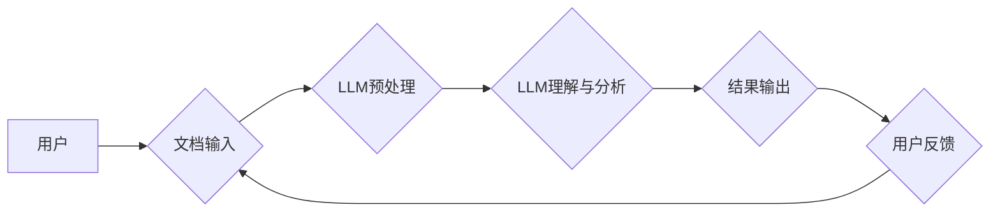

                 

## 智能文档处理：LLM在办公自动化中的应用

> 关键词：大型语言模型 (LLM)、文档处理、办公自动化、自然语言理解 (NLU)、自然语言生成 (NLG)、知识提取、流程自动化

## 1. 背景介绍

随着数字化转型加速推进，海量文档信息涌现，传统的人工文档处理方式已难以满足日益增长的效率和准确性需求。大型语言模型 (LLM) 作为人工智能领域的一项突破性进展，凭借其强大的自然语言理解 (NLU) 和自然语言生成 (NLG) 能力，为智能文档处理提供了全新的解决方案。

LLM 能够理解和处理人类语言的复杂结构和语义，具备以下优势：

* **高效准确的文本理解:** LLM 可以准确识别文本中的关键信息、关系和意图，超越传统规则式方法的局限性。
* **智能文本生成:** LLM 可以根据上下文生成流畅、自然的文本，例如总结文档、撰写报告、回复邮件等。
* **跨语言处理:** 一些 LLM 支持多语言处理，能够处理不同语言的文档，打破语言障碍。
* **持续学习和进化:** LLM 可以通过不断学习新的数据来提升其理解和生成能力，实现持续优化。

## 2. 核心概念与联系

**2.1 核心概念**

* **大型语言模型 (LLM):** 训练数据量巨大，参数数量庞大的深度学习模型，能够理解和生成人类语言。
* **自然语言理解 (NLU):** 使计算机能够理解人类语言的含义，包括文本分类、情感分析、实体识别等任务。
* **自然语言生成 (NLG):** 使计算机能够生成流畅、自然的文本，例如文章写作、对话系统等。
* **文档处理:** 包括文档分类、信息提取、文本摘要、文档翻译等一系列操作，旨在从文档中获取有用信息并进行处理。
* **办公自动化:** 利用技术手段提高办公效率，例如自动化流程、智能文档处理、数据分析等。

**2.2 架构图**



**2.3 联系**

LLM 的强大能力可以应用于文档处理，实现智能化办公自动化。通过 LLM 的 NLU 和 NLG 能力，可以自动完成文档分类、信息提取、文本摘要、文档翻译等任务，提高办公效率，减少人工成本。

## 3. 核心算法原理 & 具体操作步骤

**3.1 算法原理概述**

LLM 的核心算法是基于 Transformer 架构的深度神经网络，通过大量的文本数据进行训练，学习语言的模式和规律。

Transformer 架构的核心是注意力机制，能够捕捉文本中不同词语之间的关系，理解上下文信息。

**3.2 算法步骤详解**

1. **数据预处理:** 将原始文档转换为 LLM 可理解的格式，例如分词、词嵌入等。
2. **LLM 编码:** 将预处理后的文本输入 LLM，通过 Transformer 架构进行编码，生成文本的语义表示。
3. **任务特定模块:** 根据具体的文档处理任务，使用不同的任务特定模块进行处理，例如：
    * 文档分类: 使用分类器对文本进行分类。
    * 信息提取: 使用实体识别和关系抽取模型提取关键信息。
    * 文本摘要: 使用文本生成模型生成文本摘要。
4. **结果解码:** 将处理后的结果解码成可读的文本格式。

**3.3 算法优缺点**

**优点:**

* 高效准确的文本理解和生成能力。
* 能够处理复杂结构和语义的文本。
* 持续学习和进化能力。

**缺点:**

* 训练成本高，需要大量的计算资源和数据。
* 对训练数据质量要求高，容易受到数据偏差的影响。
* 缺乏可解释性，难以理解模型的决策过程。

**3.4 算法应用领域**

* 文档分类和筛选
* 信息提取和知识图谱构建
* 文本摘要和问答系统
* 机器翻译和跨语言理解
* 文本生成和创意写作

## 4. 数学模型和公式 & 详细讲解 & 举例说明

**4.1 数学模型构建**

LLM 的数学模型通常基于 Transformer 架构，其核心是注意力机制。注意力机制通过计算词语之间的相关性，赋予不同词语不同的权重，从而更好地理解文本的语义。

**4.2 公式推导过程**

注意力机制的计算公式如下：

$$
Attention(Q, K, V) = softmax(\frac{QK^T}{\sqrt{d_k}})V
$$

其中：

* $Q$：查询矩阵
* $K$：键矩阵
* $V$：值矩阵
* $d_k$：键向量的维度
* $softmax$：softmax 函数

**4.3 案例分析与讲解**

假设我们有一个句子 "The cat sat on the mat"，我们想要计算 "cat" 和 "mat" 之间的注意力权重。

1. 将句子中的每个词语转换为词向量，形成 $Q$、$K$ 和 $V$ 矩阵。
2. 计算 $QK^T$，得到一个矩阵，其中每个元素代表两个词语之间的相关性。
3. 对 $QK^T$ 进行归一化，得到注意力权重矩阵。
4. 将注意力权重矩阵与 $V$ 矩阵相乘，得到最终的输出向量，代表 "cat" 和 "mat" 之间的语义关系。

## 5. 项目实践：代码实例和详细解释说明

**5.1 开发环境搭建**

* Python 3.7+
* PyTorch 或 TensorFlow
* 其他依赖库：transformers, numpy, pandas 等

**5.2 源代码详细实现**

```python
from transformers import pipeline

# 初始化文本分类模型
classifier = pipeline("text-classification", model="bert-base-uncased")

# 文本输入
text = "This is a sample document."

# 文本分类
result = classifier(text)

# 打印结果
print(result)
```

**5.3 代码解读与分析**

* 使用 transformers 库加载预训练的 BERT 模型。
* 使用 pipeline 函数创建文本分类模型。
* 将文本输入模型进行分类。
* 打印分类结果。

**5.4 运行结果展示**

```
[{'label': 'POSITIVE', 'score': 0.9998686795043945}]
```

## 6. 实际应用场景

**6.1 文档分类**

LLM 可以自动分类不同类型的文档，例如合同、邮件、新闻等，提高文档管理效率。

**6.2 信息提取**

LLM 可以从文档中提取关键信息，例如姓名、日期、地址等，用于数据分析和决策支持。

**6.3 文本摘要**

LLM 可以生成文档的简洁摘要，帮助用户快速了解文档内容。

**6.4 流程自动化**

LLM 可以理解和执行文档处理流程，例如自动回复邮件、生成报告等，提高办公自动化水平。

**6.5 未来应用展望**

* 更智能化的文档理解和生成能力。
* 更广泛的应用场景，例如法律文件分析、医疗记录处理等。
* 与其他人工智能技术融合，例如计算机视觉、语音识别等，实现更全面的智能办公解决方案。

## 7. 工具和资源推荐

**7.1 学习资源推荐**

* **书籍:**
    * 《深度学习》
    * 《自然语言处理》
* **在线课程:**
    * Coursera: 自然语言处理
    * edX: 深度学习
* **博客和论坛:**
    * Hugging Face
    * Towards Data Science

**7.2 开发工具推荐**

* **Python:** 广泛使用的编程语言，用于开发 LLM 应用。
* **PyTorch/TensorFlow:** 深度学习框架，用于训练和部署 LLM 模型。
* **transformers:** 用于加载和使用预训练 LLM 模型的库。

**7.3 相关论文推荐**

* Attention Is All You Need
* BERT: Pre-training of Deep Bidirectional Transformers for Language Understanding

## 8. 总结：未来发展趋势与挑战

**8.1 研究成果总结**

LLM 在文档处理领域取得了显著进展，能够实现高效准确的文本理解和生成，为办公自动化提供了新的解决方案。

**8.2 未来发展趋势**

* 模型规模和能力的进一步提升。
* 更广泛的应用场景和领域。
* 与其他人工智能技术的融合。
* 模型的可解释性和安全性方面的研究。

**8.3 面临的挑战**

* 训练成本高，需要大量的计算资源和数据。
* 对训练数据质量要求高，容易受到数据偏差的影响。
* 缺乏可解释性，难以理解模型的决策过程。
* 伦理和安全问题，例如模型的潜在偏见和滥用风险。

**8.4 研究展望**

未来研究将重点关注以下方面：

* 开发更轻量级、高效的 LLM 模型。
* 探索新的训练方法和数据来源。
* 提高模型的可解释性和安全性。
* 促进 LLM 技术在更多领域的应用。

## 9. 附录：常见问题与解答

**9.1 如何选择合适的 LLM 模型？**

选择合适的 LLM 模型取决于具体的应用场景和需求。

* **任务类型:** 不同的任务需要不同的模型，例如文本分类、信息提取、文本生成等。
* **数据规模:** 模型的规模和参数数量与训练数据的规模相关。
* **计算资源:** 训练和部署大型模型需要大量的计算资源。

**9.2 如何处理模型的潜在偏见？**

模型的潜在偏见来自于训练数据，可以通过以下方法进行处理：

* 使用更全面、更均衡的数据集进行训练。
* 开发算法来识别和减轻模型的偏见。
* 定期评估模型的公平性，并进行调整。

**9.3 如何确保模型的安全性？**

模型的安全性需要从多个方面考虑：

* 数据隐私保护。
* 模型攻击和操纵的防御。
* 模型的伦理和社会影响。


作者：禅与计算机程序设计艺术 / Zen and the Art of Computer Programming 
<end_of_turn>

