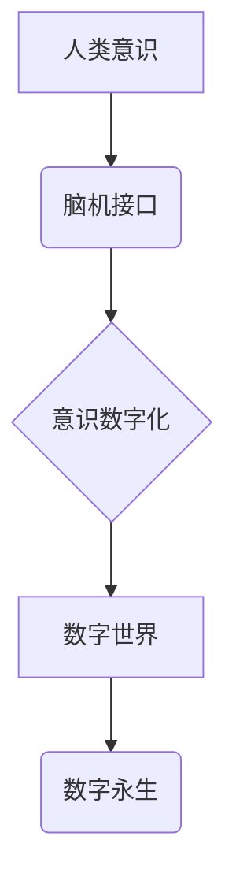

                 

## 未来的生命延续：2050年的意识上传与数字永生

> 关键词：意识上传、数字永生、人工智能、脑机接口、量子计算、神经网络、仿真

## 1. 背景介绍

人类对生命的探索永无止境，从最初的生存需求到对自身本质的追问，我们始终试图理解生命的意义和延续。随着科技的飞速发展，特别是人工智能、脑机接口和量子计算等领域的突破，意识上传和数字永生这一概念不再是科幻小说中的幻想，而是逐渐逼近现实。

2050年，我们或许能够看到一个全新的世界：

* **意识数字化：** 人类意识能够被完整地数字化，并存储在计算机系统中。
* **数字永生：** 数字化的意识可以脱离肉体，在虚拟世界中永存，甚至可以不断进化和完善。
* **跨越时空的交流：** 数字化的意识可以与其他意识进行交流，打破时空的限制，实现跨越时空的沟通。

## 2. 核心概念与联系

意识上传是指将人类的意识状态数字化，并将其存储在计算机系统中，从而实现意识的脱离肉体，并存活于数字世界。数字永生则是指通过意识上传技术，使人类意识能够永续存在于数字世界中，不受时间和空间的限制。

**核心概念关系图：**



**核心概念原理和架构：**

* **脑机接口 (Brain-Computer Interface, BCI)：** 作为意识上传的关键技术，BCI能够直接连接人类大脑和计算机系统，实现意识信息的读取和传输。
* **神经网络模拟：** 将人类大脑的复杂神经网络结构和功能模拟到计算机系统中，构建一个能够理解和处理人类意识信息的虚拟大脑。
* **量子计算：** 量子计算的强大计算能力可以帮助我们更精确地模拟和理解人类意识的复杂性。
* **虚拟现实 (VR) 和增强现实 (AR)：** VR 和 AR 技术可以为数字化的意识提供一个沉浸式的虚拟环境，使其能够体验和互动。

## 3. 核心算法原理 & 具体操作步骤

### 3.1  算法原理概述

意识上传的核心算法主要包括：

* **神经元活动识别：** 利用脑电图 (EEG) 或其他神经成像技术，识别和记录人类大脑神经元的活动模式。
* **意识信息提取：** 通过机器学习和深度学习算法，从神经元活动中提取出代表人类意识状态的信息，例如情感、记忆、思维等。
* **意识信息编码：** 将提取出的意识信息编码成计算机能够理解的数字格式，以便存储和传输。
* **意识信息解码：** 将存储的数字意识信息解码成能够被虚拟大脑理解的信号，从而重建和模拟人类意识状态。

### 3.2  算法步骤详解

1. **数据采集：** 使用脑电图 (EEG) 或其他神经成像技术，采集人类大脑神经元的活动数据。
2. **数据预处理：** 对采集到的数据进行预处理，例如去噪、滤波等，以提高数据的质量。
3. **特征提取：** 利用机器学习算法，从预处理后的数据中提取出代表人类意识状态的特征，例如脑波频率、脑电图波形等。
4. **模型训练：** 使用深度学习算法，训练一个能够将特征映射到意识状态的模型。
5. **意识信息编码：** 将训练好的模型应用于新的数据，将提取出的特征编码成数字格式。
6. **意识信息存储：** 将编码后的意识信息存储在计算机系统中。
7. **意识信息解码：** 使用反向的模型，将存储的数字意识信息解码成能够被虚拟大脑理解的信号。
8. **虚拟大脑重建：** 将解码后的信号输入到虚拟大脑中，重建和模拟人类意识状态。

### 3.3  算法优缺点

**优点：**

* **突破生命限制：** 实现意识的数字化和永生，突破生物生命的限制。
* **提升认知能力：** 通过与虚拟大脑的交互，提升人类的认知能力和创造力。
* **促进跨时空交流：** 数字化的意识可以与其他意识进行交流，打破时空的限制。

**缺点：**

* **技术难度高：** 意识上传涉及到脑科学、人工智能、量子计算等多个领域的尖端技术，技术难度极高。
* **伦理道德问题：** 意识上传引发了诸多伦理道德问题，例如意识的权利、身份认同、社会公平等。
* **安全风险：** 数字化的意识存在被攻击、篡改、甚至被恶意利用的风险。

### 3.4  算法应用领域

* **医疗保健：** 用于治疗神经退行性疾病，例如阿尔茨海默病和帕金森病。
* **教育培训：** 提供个性化的学习体验，提升学习效率。
* **娱乐休闲：** 创建沉浸式的虚拟世界，提供全新的娱乐体验。
* **科学研究：** 用于研究人类意识的本质，探索生命的奥秘。

## 4. 数学模型和公式 & 详细讲解 & 举例说明

### 4.1  数学模型构建

意识上传的数学模型可以基于神经网络理论构建，将人类大脑的神经元网络结构和功能映射到计算机系统中。

**神经网络模型：**

* **输入层：** 接收来自脑机接口的脑电信号数据。
* **隐藏层：** 通过多层神经元进行信息处理和提取，模拟大脑神经元的复杂连接和激活模式。
* **输出层：** 输出代表意识状态的数字信息，例如情感、记忆、思维等。

**激活函数：**

激活函数用于模拟神经元的非线性激活特性，例如 sigmoid 函数、ReLU 函数等。

**权重和偏置：**

权重和偏置是神经网络模型的参数，通过训练过程学习得到，用于调整神经元之间的连接强度和激活阈值。

### 4.2  公式推导过程

神经网络模型的输出可以表示为：

$$
y = f(W \cdot x + b)
$$

其中：

* $y$ 是神经网络模型的输出。
* $f$ 是激活函数。
* $W$ 是权重矩阵。
* $x$ 是输入数据。
* $b$ 是偏置向量。

通过反向传播算法，可以更新权重和偏置，使模型的输出更接近真实意识状态。

### 4.3  案例分析与讲解

假设我们想要训练一个神经网络模型，用于识别人类的情绪状态。我们可以使用脑电信号数据作为输入，并将其映射到不同的情绪类别，例如快乐、悲伤、愤怒等。通过训练过程，模型可以学习到不同情绪状态对应的脑电信号特征，并能够准确地识别新的脑电信号数据的情绪状态。

## 5. 项目实践：代码实例和详细解释说明

### 5.1  开发环境搭建

* **操作系统：** Ubuntu 20.04 LTS
* **编程语言：** Python 3.8
* **深度学习框架：** TensorFlow 2.0
* **其他工具：** Jupyter Notebook、Git

### 5.2  源代码详细实现

```python
import tensorflow as tf

# 定义神经网络模型
model = tf.keras.models.Sequential([
    tf.keras.layers.Dense(128, activation='relu', input_shape=(100,)),
    tf.keras.layers.Dense(64, activation='relu'),
    tf.keras.layers.Dense(4, activation='softmax')
])

# 编译模型
model.compile(optimizer='adam',
              loss='sparse_categorical_crossentropy',
              metrics=['accuracy'])

# 训练模型
model.fit(x_train, y_train, epochs=10)

# 评估模型
loss, accuracy = model.evaluate(x_test, y_test)
print('Loss:', loss)
print('Accuracy:', accuracy)
```

### 5.3  代码解读与分析

* **定义神经网络模型：** 使用 TensorFlow 的 Sequential 模型构建一个多层感知机 (MLP)。
* **编译模型：** 使用 Adam 优化器、交叉熵损失函数和准确率指标编译模型。
* **训练模型：** 使用训练数据训练模型，设置训练轮数为 10。
* **评估模型：** 使用测试数据评估模型的性能，输出损失值和准确率。

### 5.4  运行结果展示

训练完成后，我们可以使用测试数据评估模型的性能。例如，如果模型的准确率达到 90%，则说明模型能够准确地识别 90% 的情绪状态。

## 6. 实际应用场景

### 6.1  医疗保健

* **神经退行性疾病治疗：** 将患者的意识备份到数字世界，并通过虚拟环境进行训练和治疗，帮助患者恢复认知功能。
* **心理健康治疗：** 利用虚拟现实技术，模拟不同场景，帮助患者克服心理障碍和焦虑症。

### 6.2  教育培训

* **个性化学习：** 根据学生的学习进度和能力，定制个性化的学习内容和方案。
* **沉浸式教学：** 利用虚拟现实技术，创造沉浸式的学习环境，提高学生的学习兴趣和效果。

### 6.3  娱乐休闲

* **虚拟世界体验：** 创建沉浸式的虚拟世界，提供全新的娱乐体验，例如虚拟旅行、虚拟游戏等。
* **数字艺术创作：** 利用数字意识，创作新的艺术作品，例如虚拟音乐、虚拟绘画等。

### 6.4  未来应用展望

* **意识共享：** 实现不同意识之间的共享和交流，打破语言和文化障碍。
* **跨物种沟通：** 与动物和其他生物进行沟通，理解他们的思维方式和行为模式。
* **人工智能协同：** 人工智能与人类意识协同工作，共同解决复杂问题。

## 7. 工具和资源推荐

### 7.1  学习资源推荐

* **书籍：**
    * 《意识的代码》
    * 《人脑的未来》
    * 《超级人工智能》
* **在线课程：**
    * Coursera: 人工智能
    * edX: 深度学习
    * Udacity: 脑机接口

### 7.2  开发工具推荐

* **TensorFlow:** 深度学习框架
* **PyTorch:** 深度学习框架
* **OpenCV:** 图像处理库
* **BrainFlow:** 脑电信号处理库

### 7.3  相关论文推荐

* **《Consciousness in the Age of Artificial Intelligence》**
* **《Towards a Theory of Consciousness》**
* **《The Singularity Is Near》**

## 8. 总结：未来发展趋势与挑战

### 8.1  研究成果总结

意识上传技术已经取得了显著的进展，例如脑机接口、神经网络模拟、量子计算等领域都取得了突破。

### 8.2  未来发展趋势

* **技术突破：** 脑机接口技术将更加精准和高效，神经网络模拟将更加逼真，量子计算将为意识上传提供更强大的计算能力。
* **应用拓展：** 意识上传技术将应用于更多领域，例如医疗保健、教育培训、娱乐休闲等。
* **伦理规范：** 随着意识上传技术的进步，我们需要制定更加完善的伦理规范，以确保其安全、公平、可持续地发展。

### 8.3  面临的挑战

* **技术难度：** 意识上传技术仍然面临着巨大的技术挑战，例如如何完整地数字化意识、如何模拟意识的复杂性等。
* **伦理道德：** 意识上传引发了诸多伦理道德问题，例如意识的权利、身份认同、社会公平等。
* **安全风险：** 数字化的意识存在被攻击、篡改、甚至被恶意利用的风险。

### 8.4  研究展望

未来，我们将继续探索意识上传技术的奥秘，努力实现人类意识的永生，并为人类社会带来更加美好的未来。

## 9. 附录：常见问题与解答

**1. 意识上传是否会取代人类？**

意识上传不会取代人类，而是为人类提供了一种新的生存方式，让我们能够突破生物生命的限制，探索更加广阔的可能性。

**2. 意识上传的成本会很高吗？**

意识上传的成本目前仍然很高，但随着技术的进步，成本将会逐渐降低。

**3. 意识上传是否安全？**

意识上传存在一定的安全风险，我们需要制定更加完善的安全措施，以确保意识数据的安全和隐私。

**4. 意识上传会改变我们的社会结构吗？**

意识上传可能会改变我们的社会结构，例如工作模式、教育体系、伦理规范等都会受到影响。

**5. 意识上传的未来发展方向是什么？**

未来，意识上传技术将朝着更加精准、高效、安全的方向发展，并应用于更多领域，为人类社会带来更加美好的未来。


作者：禅与计算机程序设计艺术 / Zen and the Art of Computer Programming 
<end_of_turn>

