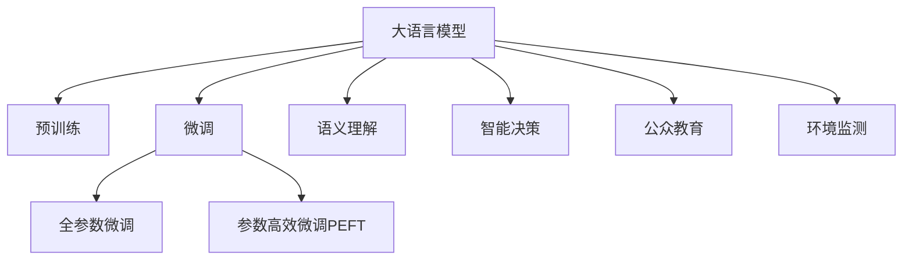

                 

## 1. 背景介绍

### 1.1 问题由来
近年来，环境保护与可持续发展成为全球关注的重点问题。作为面向环境监测、智能决策、公众教育等方面的重要应用，人工智能技术在环境保护领域展现出广阔的应用前景。然而，传统的环境监测和数据处理方式往往依赖于人力和设备，效率低下且成本较高。基于语言模型（LLM）的自动化环境分析、智能监测和智能决策技术，能够极大提升环境保护工作效率，辅助决策者快速响应环境变化，实现精准管理。

### 1.2 问题核心关键点
大语言模型（LLM）在环境保护中的应用，主要集中在以下几个方面：

1. **自动化数据收集与分析**：利用LLM进行自动文本数据挖掘，提取关键信息。
2. **环境监测与预警**：通过LLM进行实时环境监测，并预测可能的环境风险。
3. **智能决策支持**：辅助决策者进行环境治理规划，提出有效措施。
4. **公众教育与参与**：利用LLM生成环保教育内容，提升公众环保意识。

这些应用将LLM的强大语言处理能力与环境保护领域的需求相结合，以实现高效、精准的环境治理。

## 2. 核心概念与联系

### 2.1 核心概念概述

为更好地理解LLM在环境保护中的应用，本节将介绍几个密切相关的核心概念：

- 大语言模型（Large Language Model, LLM）：以自回归(如GPT)或自编码(如BERT)模型为代表的大规模预训练语言模型。通过在大规模无标签文本语料上进行预训练，学习通用的语言表示，具备强大的语言理解和生成能力。

- 预训练(Pre-training)：指在大规模无标签文本语料上，通过自监督学习任务训练通用语言模型的过程。常见的预训练任务包括言语建模、遮挡语言模型等。

- 微调(Fine-tuning)：指在预训练模型的基础上，使用特定任务的数据集，通过有监督学习优化模型在该任务上的性能。

- 迁移学习(Transfer Learning)：指将一个领域学习到的知识，迁移应用到另一个不同但相关的领域的学习范式。

- 语义理解(Semantic Understanding)：利用LLM进行文本分析和语义理解，提取环境相关关键信息。

- 智能决策(Intelligent Decision-making)：结合环境数据和政策导向，通过LLM进行环境治理的策略优化和方案生成。

- 公众教育(Public Education)：利用LLM生成易于理解的环境教育内容，提升公众环保意识和参与度。

- 环境监测(Environmental Monitoring)：利用LLM进行实时环境数据监测和风险预测，辅助环境管理和应急响应。

这些核心概念之间的逻辑关系可以通过以下Mermaid流程图来展示：



这个流程图展示了大语言模型在环境保护领域的应用框架：

1. 大语言模型通过预训练获得基础能力。
2. 微调是对预训练模型进行特定任务的优化，可以大幅提升模型在该任务上的性能。
3. 语义理解、智能决策、公众教育和环境监测等关键功能，均建立在微调的基础上。

## 3. 核心算法原理 & 具体操作步骤

### 3.1 算法原理概述

基于LLM的环境保护应用，主要涉及语义理解、智能决策、环境监测等多个方面。其核心算法原理可以概括为：

- **语义理解**：利用预训练的LLM，进行文本数据的自动化分析和语义提取。
- **智能决策**：结合环境数据和政策导向，通过LLM生成环境治理策略和方案。
- **环境监测**：实时收集环境数据，利用LLM进行分析和预测，辅助环境管理和应急响应。

### 3.2 算法步骤详解

#### 3.2.1 环境数据收集与预处理
1. **数据收集**：通过传感器、遥感、气象站等多种方式，收集环境数据。
2. **数据预处理**：对原始数据进行清洗、标准化处理，包括去噪、校正、格式转换等。

#### 3.2.2 数据特征提取
1. **文本数据抽取**：从环境监测设备、新闻报道、公众留言等多源文本中抽取关键信息。
2. **特征向量构建**：将提取的信息转化为数值特征向量，用于后续的模型训练。

#### 3.2.3 环境分析与预测
1. **环境事件识别**：利用LLM进行事件分类和语义理解，提取环境相关事件。
2. **环境趋势预测**：基于历史数据和当前环境状态，使用LLM进行趋势预测和风险评估。

#### 3.2.4 智能决策支持
1. **方案生成**：结合环境数据和政策导向，使用LLM生成治理方案。
2. **方案评估与优化**：利用LLM对生成方案进行评估，选择最优方案。

#### 3.2.5 公众教育与参与
1. **内容生成**：利用LLM生成易于理解的环境教育内容，包括文字、图像、视频等。
2. **公众互动**：通过社交媒体、移动应用等渠道，发布教育内容，收集公众反馈，促进公众参与。

### 3.3 算法优缺点

基于LLM的环境保护应用，具有以下优点：

1. **高效性**：自动化处理大量文本数据，降低人力成本，提升效率。
2. **准确性**：利用预训练的LLM，进行语义理解和事件分类，提高分析准确性。
3. **灵活性**：适用于多种环境监测和治理任务，可以快速适配不同场景。
4. **可扩展性**：能够根据环境变化，持续更新模型，保持时效性。

同时，该方法也存在一定的局限性：

1. **数据依赖**：依赖高质量的数据，数据采集和预处理成本较高。
2. **模型复杂度**：大规模预训练和微调需要较高的计算资源，模型复杂度高。
3. **解释性不足**：LLM作为"黑盒"模型，缺乏可解释性，难以理解决策过程。
4. **安全风险**：生成的数据和内容可能存在误导或误用风险，需要严格监管。

尽管存在这些局限性，但就目前而言，基于LLM的环境保护应用已显示出巨大的潜力。未来相关研究的重点在于如何进一步降低数据依赖，提高模型可解释性，并确保数据和内容的安全性。

### 3.4 算法应用领域

基于大语言模型（LLM）的环境保护应用，已广泛应用于多个领域：

- **智慧城市治理**：通过智能决策支持系统，提升城市环境管理效率。
- **生态保护监测**：利用环境监测系统，实时监控生态状况，预警环境风险。
- **气候变化研究**：通过分析气候数据和预测，支持气候变化研究。
- **公众环境教育**：生成易于理解的教育内容，提升公众环保意识。
- **农业环境保护**：结合智能农业技术，优化环境治理方案。

## 4. 数学模型和公式 & 详细讲解 & 举例说明

### 4.1 数学模型构建

本节将使用数学语言对基于LLM的环境保护应用进行更加严格的刻画。

记环境监测数据集为 $D=\{(x_i,y_i)\}_{i=1}^N, x_i \in \mathcal{X}, y_i \in \mathcal{Y}$，其中 $\mathcal{X}$ 为环境数据空间，$\mathcal{Y}$ 为事件分类或决策方案空间。假设预训练语言模型为 $M_{\theta}:\mathcal{X} \rightarrow \mathcal{Y}$，其中 $\theta$ 为预训练得到的模型参数。

定义模型 $M_{\theta}$ 在数据样本 $(x,y)$ 上的损失函数为 $\ell(M_{\theta}(x),y)$，则在数据集 $D$ 上的经验风险为：

$$
\mathcal{L}(\theta) = \frac{1}{N} \sum_{i=1}^N \ell(M_{\theta}(x_i),y_i)
$$

其中 $\ell$ 为针对特定任务设计的损失函数，用于衡量模型预测输出与真实标签之间的差异。常见的损失函数包括交叉熵损失、均方误差损失等。

### 4.2 公式推导过程

以下我们以事件分类为例，推导交叉熵损失函数及其梯度的计算公式。

假设模型 $M_{\theta}$ 在输入 $x$ 上的输出为 $\hat{y}=M_{\theta}(x) \in [0,1]$，表示样本属于正类的概率。真实标签 $y \in \{0,1\}$。则二分类交叉熵损失函数定义为：

$$
\ell(M_{\theta}(x),y) = -[y\log \hat{y} + (1-y)\log (1-\hat{y})]
$$

将其代入经验风险公式，得：

$$
\mathcal{L}(\theta) = -\frac{1}{N}\sum_{i=1}^N [y_i\log M_{\theta}(x_i)+(1-y_i)\log(1-M_{\theta}(x_i))]
$$

根据链式法则，损失函数对参数 $\theta_k$ 的梯度为：

$$
\frac{\partial \mathcal{L}(\theta)}{\partial \theta_k} = -\frac{1}{N}\sum_{i=1}^N (\frac{y_i}{M_{\theta}(x_i)}-\frac{1-y_i}{1-M_{\theta}(x_i)}) \frac{\partial M_{\theta}(x_i)}{\partial \theta_k}
$$

其中 $\frac{\partial M_{\theta}(x_i)}{\partial \theta_k}$ 可进一步递归展开，利用自动微分技术完成计算。

在得到损失函数的梯度后，即可带入参数更新公式，完成模型的迭代优化。重复上述过程直至收敛，最终得到适应特定任务的环境监测模型。

### 4.3 案例分析与讲解

以智慧城市环境治理为例，分析基于LLM的环境应用。

**Step 1: 数据收集与预处理**

假设收集到城市环境监测数据 $D=\{(x_i,y_i)\}_{i=1}^N, x_i$ 为环境监测传感器数据，$y_i$ 为事件分类（如污染事件、火灾事件等）。对原始数据进行清洗、标准化处理，包括去噪、校正、格式转换等。

**Step 2: 数据特征提取**

利用自然语言处理技术，从新闻报道、公众留言等文本中抽取环境事件信息。通过分词、实体识别等技术，将文本数据转化为数值特征向量，用于后续的模型训练。

**Step 3: 事件分类**

使用BERT模型进行事件分类，将文本特征向量作为模型输入，输出事件分类的概率分布。使用交叉熵损失函数对模型进行训练，最小化预测误差。

**Step 4: 智能决策支持**

结合历史数据和当前环境状态，使用LLM生成治理方案。通过自然语言推理技术，对不同方案进行评估，选择最优方案。

**Step 5: 公众教育与参与**

利用生成的教育内容，发布到社交媒体、移动应用等平台，提升公众环保意识。收集公众反馈，优化教育内容。

通过上述步骤，利用LLM实现环境事件分类、智能决策支持、公众教育与参与等功能，辅助智慧城市环境治理。

## 5. 项目实践：代码实例和详细解释说明

### 5.1 开发环境搭建

在进行环境应用开发前，我们需要准备好开发环境。以下是使用Python进行PyTorch开发的环境配置流程：

1. 安装Anaconda：从官网下载并安装Anaconda，用于创建独立的Python环境。

2. 创建并激活虚拟环境：
```bash
conda create -n pytorch-env python=3.8 
conda activate pytorch-env
```

3. 安装PyTorch：根据CUDA版本，从官网获取对应的安装命令。例如：
```bash
conda install pytorch torchvision torchaudio cudatoolkit=11.1 -c pytorch -c conda-forge
```

4. 安装Transformers库：
```bash
pip install transformers
```

5. 安装各类工具包：
```bash
pip install numpy pandas scikit-learn matplotlib tqdm jupyter notebook ipython
```

完成上述步骤后，即可在`pytorch-env`环境中开始环境应用实践。

### 5.2 源代码详细实现

下面以事件分类为例，给出使用Transformers库对BERT模型进行事件分类的PyTorch代码实现。

首先，定义事件分类的数据处理函数：

```python
from transformers import BertTokenizer
from torch.utils.data import Dataset
import torch

class EventDataset(Dataset):
    def __init__(self, texts, tags, tokenizer, max_len=128):
        self.texts = texts
        self.tags = tags
        self.tokenizer = tokenizer
        self.max_len = max_len
        
    def __len__(self):
        return len(self.texts)
    
    def __getitem__(self, item):
        text = self.texts[item]
        tags = self.tags[item]
        
        encoding = self.tokenizer(text, return_tensors='pt', max_length=self.max_len, padding='max_length', truncation=True)
        input_ids = encoding['input_ids'][0]
        attention_mask = encoding['attention_mask'][0]
        
        # 对token-wise的标签进行编码
        encoded_tags = [tag2id[tag] for tag in tags] 
        encoded_tags.extend([tag2id['O']] * (self.max_len - len(encoded_tags)))
        labels = torch.tensor(encoded_tags, dtype=torch.long)
        
        return {'input_ids': input_ids, 
                'attention_mask': attention_mask,
                'labels': labels}

# 标签与id的映射
tag2id = {'O': 0, 'POLLUTION': 1, 'FIRE': 2, 'FLOOD': 3, 'DROUGHT': 4}
id2tag = {v: k for k, v in tag2id.items()}

# 创建dataset
tokenizer = BertTokenizer.from_pretrained('bert-base-cased')

train_dataset = EventDataset(train_texts, train_tags, tokenizer)
dev_dataset = EventDataset(dev_texts, dev_tags, tokenizer)
test_dataset = EventDataset(test_texts, test_tags, tokenizer)
```

然后，定义模型和优化器：

```python
from transformers import BertForTokenClassification, AdamW

model = BertForTokenClassification.from_pretrained('bert-base-cased', num_labels=len(tag2id))

optimizer = AdamW(model.parameters(), lr=2e-5)
```

接着，定义训练和评估函数：

```python
from torch.utils.data import DataLoader
from tqdm import tqdm
from sklearn.metrics import classification_report

device = torch.device('cuda') if torch.cuda.is_available() else torch.device('cpu')
model.to(device)

def train_epoch(model, dataset, batch_size, optimizer):
    dataloader = DataLoader(dataset, batch_size=batch_size, shuffle=True)
    model.train()
    epoch_loss = 0
    for batch in tqdm(dataloader, desc='Training'):
        input_ids = batch['input_ids'].to(device)
        attention_mask = batch['attention_mask'].to(device)
        labels = batch['labels'].to(device)
        model.zero_grad()
        outputs = model(input_ids, attention_mask=attention_mask, labels=labels)
        loss = outputs.loss
        epoch_loss += loss.item()
        loss.backward()
        optimizer.step()
    return epoch_loss / len(dataloader)

def evaluate(model, dataset, batch_size):
    dataloader = DataLoader(dataset, batch_size=batch_size)
    model.eval()
    preds, labels = [], []
    with torch.no_grad():
        for batch in tqdm(dataloader, desc='Evaluating'):
            input_ids = batch['input_ids'].to(device)
            attention_mask = batch['attention_mask'].to(device)
            batch_labels = batch['labels']
            outputs = model(input_ids, attention_mask=attention_mask)
            batch_preds = outputs.logits.argmax(dim=2).to('cpu').tolist()
            batch_labels = batch_labels.to('cpu').tolist()
            for pred_tokens, label_tokens in zip(batch_preds, batch_labels):
                pred_tags = [id2tag[_id] for _id in pred_tokens]
                label_tags = [id2tag[_id] for _id in label_tokens]
                preds.append(pred_tags[:len(label_tags)])
                labels.append(label_tags)
                
    print(classification_report(labels, preds))
```

最后，启动训练流程并在测试集上评估：

```python
epochs = 5
batch_size = 16

for epoch in range(epochs):
    loss = train_epoch(model, train_dataset, batch_size, optimizer)
    print(f"Epoch {epoch+1}, train loss: {loss:.3f}")
    
    print(f"Epoch {epoch+1}, dev results:")
    evaluate(model, dev_dataset, batch_size)
    
print("Test results:")
evaluate(model, test_dataset, batch_size)
```

以上就是使用PyTorch对BERT进行事件分类的完整代码实现。可以看到，得益于Transformers库的强大封装，我们可以用相对简洁的代码完成BERT模型的加载和微调。

### 5.3 代码解读与分析

让我们再详细解读一下关键代码的实现细节：

**EventDataset类**：
- `__init__`方法：初始化文本、标签、分词器等关键组件。
- `__len__`方法：返回数据集的样本数量。
- `__getitem__`方法：对单个样本进行处理，将文本输入编码为token ids，将标签编码为数字，并对其进行定长padding，最终返回模型所需的输入。

**tag2id和id2tag字典**：
- 定义了标签与数字id之间的映射关系，用于将token-wise的预测结果解码回真实的标签。

**训练和评估函数**：
- 使用PyTorch的DataLoader对数据集进行批次化加载，供模型训练和推理使用。
- 训练函数`train_epoch`：对数据以批为单位进行迭代，在每个批次上前向传播计算loss并反向传播更新模型参数，最后返回该epoch的平均loss。
- 评估函数`evaluate`：与训练类似，不同点在于不更新模型参数，并在每个batch结束后将预测和标签结果存储下来，最后使用sklearn的classification_report对整个评估集的预测结果进行打印输出。

**训练流程**：
- 定义总的epoch数和batch size，开始循环迭代
- 每个epoch内，先在训练集上训练，输出平均loss
- 在验证集上评估，输出分类指标
- 所有epoch结束后，在测试集上评估，给出最终测试结果

可以看到，PyTorch配合Transformers库使得BERT事件分类的代码实现变得简洁高效。开发者可以将更多精力放在数据处理、模型改进等高层逻辑上，而不必过多关注底层的实现细节。

当然，工业级的系统实现还需考虑更多因素，如模型的保存和部署、超参数的自动搜索、更灵活的任务适配层等。但核心的微调范式基本与此类似。

## 6. 实际应用场景

### 6.1 智能城市治理

基于大语言模型的事件分类技术，可以广泛应用于智能城市治理系统。传统城市管理往往依赖人工监测和手工记录，效率低下且成本高昂。智能城市治理系统利用大语言模型，能够实时收集和处理城市环境数据，快速识别环境事件，提供高效智能的决策支持。

在技术实现上，可以收集城市监控摄像头、传感器、卫星等环境数据，利用大语言模型进行自动化事件分类和分析。智能决策系统根据分类结果，实时调整管理策略，优化资源配置。同时，系统还可以生成可视化报告，辅助决策者快速理解和决策。

### 6.2 生态保护监测

大语言模型在生态保护监测中也有广泛应用。生态保护数据通常涉及大量的文本和图像信息，难以进行自动化处理。通过大语言模型，可以高效处理这些复杂数据，实时监测生态环境变化，预警可能的环境风险。

具体而言，可以采集森林、海洋、湿地等生态环境的多模态数据，利用大语言模型进行数据整合和事件分类。系统自动生成环境报告，及时向相关机构报告生态环境变化，辅助生态保护决策。

### 6.3 气候变化研究

大语言模型在气候变化研究中也发挥着重要作用。气候变化数据通常涉及大量的气象数据和历史文献，难以进行手动分析。通过大语言模型，可以高效处理这些数据，进行趋势分析和预测。

具体而言，可以收集全球气候数据和历史文献，利用大语言模型进行数据分析和趋势预测。研究者可以基于预测结果，制定应对气候变化的策略，优化能源使用，减少碳排放。

### 6.4 公众环境教育

大语言模型在公众环境教育中也具有重要价值。通过生成易于理解的环境教育内容，可以提升公众环保意识，促进公众参与环境保护。

具体而言，可以收集环境事件和环保知识，利用大语言模型生成文字、图像、视频等多种形式的教育内容。教育内容通过社交媒体、移动应用等渠道发布，提升公众环保意识，促进公众参与环境保护。

### 6.5 农业环境保护

大语言模型在农业环境保护中也有广泛应用。农业环境保护数据通常涉及大量的文本和图像信息，难以进行自动化处理。通过大语言模型，可以高效处理这些复杂数据，实时监测农业环境变化，预警可能的环境风险。

具体而言，可以采集农业生产环境的多模态数据，利用大语言模型进行数据整合和事件分类。农业决策系统根据分类结果，实时调整管理策略，优化农业生产，减少环境污染。

## 7. 工具和资源推荐

### 7.1 学习资源推荐

为了帮助开发者系统掌握大语言模型在环境保护中的应用理论基础和实践技巧，这里推荐一些优质的学习资源：

1. 《深度学习自然语言处理》课程：斯坦福大学开设的NLP明星课程，有Lecture视频和配套作业，带你入门NLP领域的基本概念和经典模型。

2. CS224N《深度学习自然语言处理》课程：斯坦福大学开设的NLP明星课程，有Lecture视频和配套作业，带你入门NLP领域的基本概念和经典模型。

3. 《Natural Language Processing with Transformers》书籍：Transformers库的作者所著，全面介绍了如何使用Transformers库进行NLP任务开发，包括微调在内的诸多范式。

4. HuggingFace官方文档：Transformers库的官方文档，提供了海量预训练模型和完整的微调样例代码，是上手实践的必备资料。

5. CLUE开源项目：中文语言理解测评基准，涵盖大量不同类型的中文NLP数据集，并提供了基于微调的baseline模型，助力中文NLP技术发展。

通过对这些资源的学习实践，相信你一定能够快速掌握大语言模型在环境保护中的应用精髓，并用于解决实际的环境保护问题。

### 7.2 开发工具推荐

高效的开发离不开优秀的工具支持。以下是几款用于大语言模型在环境保护领域应用开发的常用工具：

1. PyTorch：基于Python的开源深度学习框架，灵活动态的计算图，适合快速迭代研究。大部分预训练语言模型都有PyTorch版本的实现。

2. TensorFlow：由Google主导开发的开源深度学习框架，生产部署方便，适合大规模工程应用。同样有丰富的预训练语言模型资源。

3. Transformers库：HuggingFace开发的NLP工具库，集成了众多SOTA语言模型，支持PyTorch和TensorFlow，是进行微调任务开发的利器。

4. Weights & Biases：模型训练的实验跟踪工具，可以记录和可视化模型训练过程中的各项指标，方便对比和调优。与主流深度学习框架无缝集成。

5. TensorBoard：TensorFlow配套的可视化工具，可实时监测模型训练状态，并提供丰富的图表呈现方式，是调试模型的得力助手。

6. Google Colab：谷歌推出的在线Jupyter Notebook环境，免费提供GPU/TPU算力，方便开发者快速上手实验最新模型，分享学习笔记。

合理利用这些工具，可以显著提升大语言模型在环境保护领域应用开发的效率，加快创新迭代的步伐。

### 7.3 相关论文推荐

大语言模型在环境保护领域的研究源于学界的持续研究。以下是几篇奠基性的相关论文，推荐阅读：

1. Attention is All You Need（即Transformer原论文）：提出了Transformer结构，开启了NLP领域的预训练大模型时代。

2. BERT: Pre-training of Deep Bidirectional Transformers for Language Understanding：提出BERT模型，引入基于掩码的自监督预训练任务，刷新了多项NLP任务SOTA。

3. Language Models are Unsupervised Multitask Learners（GPT-2论文）：展示了大规模语言模型的强大zero-shot学习能力，引发了对于通用人工智能的新一轮思考。

4. Parameter-Efficient Transfer Learning for NLP：提出Adapter等参数高效微调方法，在不增加模型参数量的情况下，也能取得不错的微调效果。

5. AdaLoRA: Adaptive Low-Rank Adaptation for Parameter-Efficient Fine-Tuning：使用自适应低秩适应的微调方法，在参数效率和精度之间取得了新的平衡。

6. Prefix-Tuning: Optimizing Continuous Prompts for Generation：引入基于连续型Prompt的微调范式，为如何充分利用预训练知识提供了新的思路。

这些论文代表了大语言模型在环境保护领域的发展脉络。通过学习这些前沿成果，可以帮助研究者把握学科前进方向，激发更多的创新灵感。

## 8. 总结：未来发展趋势与挑战

### 8.1 总结

本文对基于大语言模型（LLM）的环境保护应用进行了全面系统的介绍。首先阐述了LLM在环境保护中的研究背景和应用价值，明确了LLM在事件分类、智能决策支持、公众教育与参与等多个方面的独特价值。其次，从原理到实践，详细讲解了LLM在事件分类等关键任务上的数学模型和算法实现，给出了LLM事件分类的完整代码实例。同时，本文还广泛探讨了LLM在智能城市治理、生态保护监测、气候变化研究、公众环境教育等多个领域的应用前景，展示了LLM在环境保护领域的巨大潜力。

通过本文的系统梳理，可以看到，基于大语言模型的环境保护应用正逐步成为智能化治理的重要手段，为环境保护领域带来了革命性的变化。

### 8.2 未来发展趋势

展望未来，大语言模型在环境保护领域的应用将呈现以下几个发展趋势：

1. **模型规模持续增大**：随着算力成本的下降和数据规模的扩张，预训练语言模型的参数量还将持续增长。超大模型的强大语言理解能力，有望支撑更加复杂多变的环境保护任务。

2. **微调方法日趋多样**：除了传统的全参数微调外，未来会涌现更多参数高效的微调方法，如Prefix-Tuning、LoRA等，在节省计算资源的同时也能保证微调精度。

3. **持续学习成为常态**：随着数据分布的不断变化，微调模型也需要持续学习新知识以保持性能。如何在不遗忘原有知识的同时，高效吸收新样本信息，将成为重要的研究课题。

4. **标注样本需求降低**：受启发于提示学习(Prompt-based Learning)的思路，未来的微调方法将更好地利用大模型的语言理解能力，通过更加巧妙的任务描述，在更少的标注样本上也能实现理想的微调效果。

5. **多模态微调崛起**：当前的微调主要聚焦于纯文本数据，未来会进一步拓展到图像、视频、语音等多模态数据微调。多模态信息的融合，将显著提升语言模型对现实世界的理解和建模能力。

6. **模型的伦理安全性**：在模型训练目标中引入伦理导向的评估指标，过滤和惩罚有偏见、有害的输出倾向。同时加强人工干预和审核，建立模型行为的监管机制，确保输出符合人类价值观和伦理道德。

以上趋势凸显了大语言模型在环境保护领域的应用前景。这些方向的探索发展，必将进一步提升环境保护系统的性能和应用范围，为环境保护事业带来深远影响。

### 8.3 面临的挑战

尽管大语言模型在环境保护领域的应用已展现出巨大的潜力，但在迈向更加智能化、普适化应用的过程中，仍面临诸多挑战：

1. **数据依赖**：依赖高质量的数据，数据采集和预处理成本较高。

2. **模型鲁棒性不足**：面对域外数据时，泛化性能往往大打折扣。

3. **模型复杂度**：大规模预训练和微调需要较高的计算资源，模型复杂度高。

4. **解释性不足**：LLM作为"黑盒"模型，缺乏可解释性，难以理解决策过程。

5. **安全风险**：生成的数据和内容可能存在误导或误用风险，需要严格监管。

6. **知识整合能力不足**：现有的微调模型往往局限于任务内数据，难以灵活吸收和运用更广泛的先验知识。

正视这些挑战，积极应对并寻求突破，将是大语言模型在环境保护领域走向成熟的必由之路。

### 8.4 研究展望

面对大语言模型在环境保护领域面临的挑战，未来的研究需要在以下几个方面寻求新的突破：

1. **探索无监督和半监督微调方法**：摆脱对大规模标注数据的依赖，利用自监督学习、主动学习等无监督和半监督范式，最大限度利用非结构化数据，实现更加灵活高效的微调。

2. **研究参数高效和计算高效的微调范式**：开发更加参数高效的微调方法，在固定大部分预训练参数的同时，只更新极少量的任务相关参数。同时优化微调模型的计算图，减少前向传播和反向传播的资源消耗，实现更加轻量级、实时性的部署。

3. **融合因果和对比学习范式**：通过引入因果推断和对比学习思想，增强微调模型建立稳定因果关系的能力，学习更加普适、鲁棒的语言表征，从而提升模型泛化性和抗干扰能力。

4. **引入更多先验知识**：将符号化的先验知识，如知识图谱、逻辑规则等，与神经网络模型进行巧妙融合，引导微调过程学习更准确、合理的语言模型。同时加强不同模态数据的整合，实现视觉、语音等多模态信息与文本信息的协同建模。

5. **结合因果分析和博弈论工具**：将因果分析方法引入微调模型，识别出模型决策的关键特征，增强输出解释的因果性和逻辑性。借助博弈论工具刻画人机交互过程，主动探索并规避模型的脆弱点，提高系统稳定性。

6. **纳入伦理道德约束**：在模型训练目标中引入伦理导向的评估指标，过滤和惩罚有偏见、有害的输出倾向。同时加强人工干预和审核，建立模型行为的监管机制，确保输出符合人类价值观和伦理道德。

这些研究方向的探索，必将引领大语言模型在环境保护领域的应用向更高的台阶，为环境保护事业带来深远影响。

## 9. 附录：常见问题与解答

**Q1：大语言模型在环境保护中的应用是否适用于所有环境监测任务？**

A: 大语言模型在大多数环境监测任务上都能取得不错的效果，特别是对于数据量较小的任务。但对于一些特定领域的任务，如深海探索、极端气候监测等，仅仅依靠通用语料预训练的模型可能难以很好地适应。此时需要在特定领域语料上进一步预训练，再进行微调，才能获得理想效果。

**Q2：数据预处理中常见的错误有哪些？**

A: 数据预处理是微调效果的重要因素，常见的错误包括：

1. 数据清洗不彻底：未去除噪声和异常值，导致模型学习到错误的特征。
2. 数据标准化不统一：数据格式不一致，导致模型无法正常训练。
3. 数据格式转换错误：未正确处理文本和图像等不同格式的数据，导致模型无法读取。

**Q3：如何优化模型在特定任务上的微调效果？**

A: 优化模型在特定任务上的微调效果，可以采取以下策略：

1. 数据增强：通过回译、近义替换等方式扩充训练集。
2. 正则化：使用L2正则、Dropout、Early Stopping等避免过拟合。
3. 参数高效微调：只调整少量参数，减小需优化的参数量。
4. 数据增强：对训练样本改写、回译等方式丰富训练集多样性。
5. 对抗训练：加入对抗样本，提高模型鲁棒性。
6. 提示学习：通过在输入文本中添加提示模板，引导模型按期望方式输出，减少微调参数。

这些策略往往需要根据具体任务和数据特点进行灵活组合。只有在数据、模型、训练、推理等各环节进行全面优化，才能最大限度地发挥大语言模型的潜力。

**Q4：基于大语言模型的环境保护应用在实际落地时需要注意哪些问题？**

A: 将基于大语言模型的环境保护应用转化为实际系统，还需要考虑以下问题：

1. 模型裁剪：去除不必要的层和参数，减小模型尺寸，加快推理速度。
2. 量化加速：将浮点模型转为定点模型，压缩存储空间，提高计算效率。
3. 服务化封装：将模型封装为标准化服务接口，便于集成调用。
4. 弹性伸缩：根据请求流量动态调整资源配置，平衡服务质量和成本。
5. 监控告警：实时采集系统指标，设置异常告警阈值，确保服务稳定性。
6. 安全防护：采用访问鉴权、数据脱敏等措施，保障数据和模型安全。

合理利用这些工具，可以显著提升基于大语言模型的环境保护应用系统开发效率，加快创新迭代的步伐。

**Q5：大语言模型在环境保护中的应用前景如何？**

A: 大语言模型在环境保护领域的应用前景广阔。未来，随着算力成本的下降和数据规模的扩张，预训练语言模型的参数量还将持续增长，其强大的语言理解能力将进一步提升环境保护系统的智能化水平。同时，微调方法的不断优化也将使得模型更加高效、灵活、鲁棒，能够应对更复杂的环境监测和治理任务。因此，基于大语言模型的环境保护应用具有广阔的发展前景。

---

作者：禅与计算机程序设计艺术 / Zen and the Art of Computer Programming

