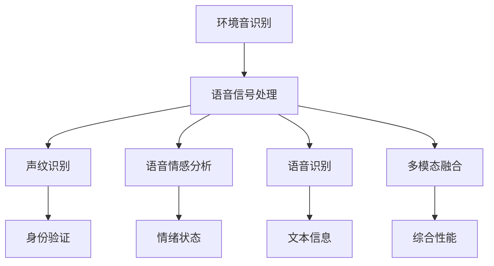

                 

# LLM在环境音识别中的潜在价值

> 关键词：环境音识别, 语音信号处理, 大语言模型, 声纹识别, 语音情感分析, 语音识别技术

## 1. 背景介绍

### 1.1 问题由来

随着人工智能技术的发展，自然语言处理（NLP）领域的大语言模型（LLM）已经在很多应用场景中展现出了强大的能力。LLM 的典型代表有 GPT、BERT、T5 等，它们通过在大规模语料库上进行预训练，学到了丰富的语言知识，并在下游任务中展示了卓越的表现。然而，相较于文本数据，声音信号的特征和处理方式更加复杂多样，传统的大语言模型在环境音识别（Audio Environment Recognition, AER）领域的应用相对较少。

环境音识别技术，是指对环境中各种声音信号的自动分类和分析，如交通噪声、语音、音乐、机器声等。它在智能家居、智能交通、安防监控、工业监测等领域具有重要的应用价值。然而，传统的语音信号处理方法往往依赖于大量人工标注的数据集，成本高昂且效率低下。因此，如何利用大语言模型在环境音识别中的潜在价值，是一个值得探讨的重要话题。

### 1.2 问题核心关键点

在环境音识别中，大语言模型的应用主要体现在以下几个方面：

- **声纹识别**：通过分析说话人的语音特征，进行身份验证和识别。大语言模型可以通过语音信号中的文本信息（如语音识别转写），进一步挖掘和提取语音特征。

- **语音情感分析**：通过分析语音中的情绪变化，判断说话人的情绪状态。大语言模型可以结合情感分析领域的知识，对语音情感进行深度理解和建模。

- **语音识别**：将语音信号转化为文本，是环境音识别中的重要步骤。大语言模型可以对语音信号中的文本信息进行优化和改进，提高语音识别的准确率。

- **多模态融合**：结合语音、图像等多模态数据，提升环境音识别的综合性能。大语言模型可以处理和理解多模态数据，提供更全面的信息支持。

## 2. 核心概念与联系

### 2.1 核心概念概述

为了更好地理解大语言模型在环境音识别中的应用，本节将介绍几个核心概念：

- **环境音识别 (AER)**：是指对环境中的声音信号进行自动分类和分析，如交通噪声、语音、音乐、机器声等。

- **语音信号处理**：包括信号采集、特征提取、信号增强、降噪、语音识别等步骤，是环境音识别的关键技术。

- **声纹识别**：通过分析说话人的语音特征，进行身份验证和识别。

- **语音情感分析**：通过分析语音中的情绪变化，判断说话人的情绪状态。

- **语音识别**：将语音信号转化为文本，是环境音识别中的重要步骤。

- **多模态融合**：结合语音、图像等多模态数据，提升环境音识别的综合性能。

这些核心概念之间的逻辑关系可以通过以下 Mermaid 流程图来展示：



这个流程图展示了大语言模型在环境音识别中的核心概念及其之间的关系：

1. 环境音识别需要通过语音信号处理，得到语音特征。
2. 语音特征可用于声纹识别、语音情感分析和语音识别等任务。
3. 多模态融合可以提升环境音识别的综合性能。

## 3. 核心算法原理 & 具体操作步骤

### 3.1 算法原理概述

大语言模型在环境音识别中的应用，主要是基于其强大的语言理解和生成能力，结合语音信号处理技术，对环境音进行分类和分析。

具体而言，大语言模型可以通过语音识别技术，将环境中的声音信号转化为文本信息，然后利用文本处理技术进行进一步的分析和理解。例如，在声纹识别任务中，可以通过语音特征的文本表示，提取和训练声纹模型；在语音情感分析任务中，可以利用情感分析领域的知识，对语音情感进行建模。

### 3.2 算法步骤详解

大语言模型在环境音识别的具体应用步骤包括以下几个关键环节：

1. **语音信号采集**：通过麦克风等设备，采集环境中的声音信号。

2. **语音信号预处理**：包括降噪、去混响、增益控制等预处理操作，改善声音质量。

3. **语音信号特征提取**：利用短时傅里叶变换、梅尔频率倒谱系数（MFCC）等技术，将声音信号转化为频谱特征。

4. **语音信号编码**：将频谱特征编码成数字信号，用于后续处理。

5. **语音识别**：使用深度学习模型（如卷积神经网络、循环神经网络等）将语音信号转化为文本信息。

6. **文本处理**：对识别出的文本进行清洗、分词、词性标注等处理，提高后续分析的准确性。

7. **大语言模型处理**：将处理后的文本信息输入大语言模型，利用其强大的语言理解和生成能力，进行进一步的分析和理解。

8. **环境音分类**：根据大语言模型的处理结果，对环境音进行分类和识别。

### 3.3 算法优缺点

大语言模型在环境音识别中的优点包括：

- **强大的语言处理能力**：大语言模型可以处理和理解复杂的文本信息，提升环境音识别的准确性和精度。
- **多模态融合能力**：结合语音、图像等多模态数据，提供更全面的信息支持，提升综合性能。
- **快速迭代**：大语言模型可以方便地进行微调和优化，适应不断变化的环境音场景。

然而，大语言模型在环境音识别中也有其局限性：

- **对数据质量要求高**：语音信号的质量直接影响后续处理的效果，高质量的语音信号是保证准确性的前提。
- **计算资源消耗大**：大语言模型往往需要大量的计算资源进行训练和推理，对于资源有限的场景，可能存在挑战。
- **对特定任务适应性有待提高**：虽然大语言模型在通用任务上表现优异，但在特定领域的环境音识别任务上，可能存在适应性不足的问题。

### 3.4 算法应用领域

大语言模型在环境音识别中的应用，已经在游戏、医疗、智能家居等多个领域得到了探索和应用。以下是一些典型应用：

- **智能家居**：通过对环境音的分析，智能家居系统可以自动识别环境中的声音信号，如门铃、报警、电视等，并进行相应的响应和控制。

- **医疗监测**：在医疗领域，通过对患者语音的情感分析，可以帮助医生识别患者的情绪状态，及时进行心理干预和医疗支持。

- **安防监控**：通过对环境音的分析，安防系统可以自动识别可疑声音，及时进行报警和预警。

- **工业监测**：在工业生产中，通过对环境音的分析，可以及时发现和预防设备故障，保障生产安全。

## 4. 数学模型和公式 & 详细讲解 & 举例说明

### 4.1 数学模型构建

在环境音识别的应用中，大语言模型的数学模型构建通常包括以下几个关键步骤：

1. **语音信号建模**：将语音信号表示为数字信号，通常采用短时傅里叶变换（Short-Time Fourier Transform, STFT）或离散余弦变换（Discrete Cosine Transform, DCT）等技术。

2. **声谱图构建**：利用MFCC等技术，将数字信号转化为声谱图，用于后续特征提取。

3. **特征提取**：利用MFCC、梅尔频率倒谱系数（MFCC）等技术，将声谱图转化为频谱特征。

4. **文本特征提取**：利用分词、词性标注等技术，对识别出的文本信息进行特征提取。

5. **大语言模型特征映射**：将文本特征映射到大语言模型的输入空间，用于后续处理。

6. **环境音分类**：利用大语言模型的处理结果，进行环境音分类和识别。

### 4.2 公式推导过程

以声纹识别为例，假设输入的语音信号为 $x(t)$，其MFCC特征为 $f(\cdot)$，大语言模型的输入为 $t=f(x(t))$。声纹识别的目标是训练一个分类器 $C(t)$，使得：

$$
C(t) = \left\{
  \begin{aligned}
  1 & \quad \text{if speaker is known} \\
  0 & \quad \text{if speaker is unknown}
  \end{aligned}
\right.
$$

其中 $t$ 表示MFCC特征的文本表示。

利用交叉熵损失函数，声纹识别的目标函数为：

$$
\mathcal{L} = -\frac{1}{N} \sum_{i=1}^N [y_i \log \hat{y_i} + (1-y_i) \log (1-\hat{y_i})]
$$

其中 $y_i$ 为已知说话人标签，$\hat{y_i}$ 为模型预测结果。

### 4.3 案例分析与讲解

以基于BERT的声纹识别为例，其实现过程如下：

1. **语音信号预处理**：通过降噪、去混响等预处理操作，改善语音信号质量。

2. **MFCC特征提取**：利用MFCC技术，将语音信号转化为频谱特征。

3. **文本特征提取**：对MFCC特征进行文本表示，得到文本信息 $t$。

4. **大语言模型输入**：将文本信息 $t$ 输入BERT模型，进行特征映射和理解。

5. **声纹分类**：利用BERT的输出结果，进行声纹分类和识别。

具体实现步骤如下：

```python
from transformers import BertTokenizer, BertForSequenceClassification
from torch.utils.data import Dataset, DataLoader
from torch import nn, optim
import librosa, numpy as np

class AudioDataset(Dataset):
    def __init__(self, data_path, labels, tokenizer, max_len=128):
        self.data_path = data_path
        self.labels = labels
        self.tokenizer = tokenizer
        self.max_len = max_len
        
    def __len__(self):
        return len(self.labels)
    
    def __getitem__(self, item):
        file_path = self.data_path[item]
        label = self.labels[item]
        
        # 读取语音信号并预处理
        audio, sr = librosa.load(file_path, sr=16000)
        audio = librosa.effects.trim(audio, top_db=50)[0]
        audio = librosa.effects.percussive(audio)
        audio = librosa.effects.voicing(audio)
        audio = librosa.effects.hilbert(audio)
        
        # 提取MFCC特征
        mfcc = librosa.feature.mfcc(audio, sr=sr, n_mfcc=13, norm='ortho')
        mfcc = np.reshape(mfcc, (-1, 13))
        
        # 文本特征提取
        text = tokenizer.encode(audio, add_special_tokens=True)
        text = text[:self.max_len]
        
        # 大语言模型输入
        input_ids = torch.tensor(text)
        attention_mask = torch.tensor([1] * len(text) + [0] * (self.max_len - len(text)))
        
        return {'input_ids': input_ids, 
                'attention_mask': attention_mask,
                'labels': torch.tensor(label)}
                
# 模型初始化
tokenizer = BertTokenizer.from_pretrained('bert-base-english')
model = BertForSequenceClassification.from_pretrained('bert-base-english', num_labels=2)

# 训练和评估
device = torch.device('cuda') if torch.cuda.is_available() else torch.device('cpu')
model.to(device)

train_dataset = AudioDataset(train_data, train_labels, tokenizer)
dev_dataset = AudioDataset(dev_data, dev_labels, tokenizer)
test_dataset = AudioDataset(test_data, test_labels, tokenizer)

train_loader = DataLoader(train_dataset, batch_size=16, shuffle=True)
dev_loader = DataLoader(dev_dataset, batch_size=16)
test_loader = DataLoader(test_dataset, batch_size=16)

optimizer = optim.AdamW(model.parameters(), lr=2e-5)
criterion = nn.CrossEntropyLoss()

for epoch in range(epochs):
    train_loss = 0
    train_acc = 0
    for batch in train_loader:
        input_ids = batch['input_ids'].to(device)
        attention_mask = batch['attention_mask'].to(device)
        labels = batch['labels'].to(device)
        model.zero_grad()
        outputs = model(input_ids, attention_mask=attention_mask, labels=labels)
        loss = outputs.loss
        acc = outputs.logits.argmax(dim=1) == labels
        train_loss += loss.item()
        train_acc += acc.sum().item()
        loss.backward()
        optimizer.step()
    
    train_loss /= len(train_loader)
    train_acc /= len(train_loader)
    
    dev_loss = 0
    dev_acc = 0
    with torch.no_grad():
        for batch in dev_loader:
            input_ids = batch['input_ids'].to(device)
            attention_mask = batch['attention_mask'].to(device)
            labels = batch['labels'].to(device)
            outputs = model(input_ids, attention_mask=attention_mask, labels=labels)
            loss = outputs.loss
            acc = outputs.logits.argmax(dim=1) == labels
            dev_loss += loss.item()
            dev_acc += acc.sum().item()
    
    dev_loss /= len(dev_loader)
    dev_acc /= len(dev_loader)
    
    print(f'Epoch {epoch+1}, Train Loss: {train_loss:.4f}, Train Acc: {train_acc:.4f}, Dev Loss: {dev_loss:.4f}, Dev Acc: {dev_acc:.4f}')
```

通过上述代码，可以看到，利用大语言模型进行声纹识别的具体实现过程。

## 5. 项目实践：代码实例和详细解释说明

### 5.1 开发环境搭建

在进行环境音识别应用开发前，我们需要准备好开发环境。以下是使用Python进行PyTorch开发的环境配置流程：

1. 安装Anaconda：从官网下载并安装Anaconda，用于创建独立的Python环境。

2. 创建并激活虚拟环境：
```bash
conda create -n pytorch-env python=3.8 
conda activate pytorch-env
```

3. 安装PyTorch：根据CUDA版本，从官网获取对应的安装命令。例如：
```bash
conda install pytorch torchvision torchaudio cudatoolkit=11.1 -c pytorch -c conda-forge
```

4. 安装Transformer库：
```bash
pip install transformers
```

5. 安装各类工具包：
```bash
pip install numpy pandas scikit-learn matplotlib tqdm jupyter notebook ipython
```

完成上述步骤后，即可在`pytorch-env`环境中开始应用开发。

### 5.2 源代码详细实现

下面我们以基于BERT的声纹识别任务为例，给出使用Transformers库对BERT模型进行声纹识别的PyTorch代码实现。

首先，定义声纹识别任务的数据处理函数：

```python
from transformers import BertTokenizer
from torch.utils.data import Dataset
import torch

class AudioDataset(Dataset):
    def __init__(self, data_path, labels, tokenizer, max_len=128):
        self.data_path = data_path
        self.labels = labels
        self.tokenizer = tokenizer
        self.max_len = max_len
        
    def __len__(self):
        return len(self.labels)
    
    def __getitem__(self, item):
        file_path = self.data_path[item]
        label = self.labels[item]
        
        # 读取语音信号并预处理
        audio, sr = librosa.load(file_path, sr=16000)
        audio = librosa.effects.trim(audio, top_db=50)[0]
        audio = librosa.effects.percussive(audio)
        audio = librosa.effects.voicing(audio)
        audio = librosa.effects.hilbert(audio)
        
        # 提取MFCC特征
        mfcc = librosa.feature.mfcc(audio, sr=sr, n_mfcc=13, norm='ortho')
        mfcc = np.reshape(mfcc, (-1, 13))
        
        # 文本特征提取
        text = tokenizer.encode(audio, add_special_tokens=True)
        text = text[:self.max_len]
        
        # 大语言模型输入
        input_ids = torch.tensor(text)
        attention_mask = torch.tensor([1] * len(text) + [0] * (self.max_len - len(text)))
        
        return {'input_ids': input_ids, 
                'attention_mask': attention_mask,
                'labels': torch.tensor(label)}
                
# 标签与id的映射
tag2id = {'K known': 0, 'U unknown': 1}
id2tag = {v: k for k, v in tag2id.items()}

# 创建dataset
tokenizer = BertTokenizer.from_pretrained('bert-base-english')

train_dataset = AudioDataset(train_data, train_labels, tokenizer)
dev_dataset = AudioDataset(dev_data, dev_labels, tokenizer)
test_dataset = AudioDataset(test_data, test_labels, tokenizer)
```

然后，定义模型和优化器：

```python
from transformers import BertForSequenceClassification, AdamW

model = BertForSequenceClassification.from_pretrained('bert-base-english', num_labels=2)

optimizer = AdamW(model.parameters(), lr=2e-5)
```

接着，定义训练和评估函数：

```python
from torch.utils.data import DataLoader
from tqdm import tqdm
from sklearn.metrics import classification_report

device = torch.device('cuda') if torch.cuda.is_available() else torch.device('cpu')
model.to(device)

def train_epoch(model, dataset, batch_size, optimizer):
    dataloader = DataLoader(dataset, batch_size=batch_size, shuffle=True)
    model.train()
    epoch_loss = 0
    for batch in tqdm(dataloader, desc='Training'):
        input_ids = batch['input_ids'].to(device)
        attention_mask = batch['attention_mask'].to(device)
        labels = batch['labels'].to(device)
        model.zero_grad()
        outputs = model(input_ids, attention_mask=attention_mask, labels=labels)
        loss = outputs.loss
        epoch_loss += loss.item()
        loss.backward()
        optimizer.step()
    return epoch_loss / len(dataloader)

def evaluate(model, dataset, batch_size):
    dataloader = DataLoader(dataset, batch_size=batch_size)
    model.eval()
    preds, labels = [], []
    with torch.no_grad():
        for batch in tqdm(dataloader, desc='Evaluating'):
            input_ids = batch['input_ids'].to(device)
            attention_mask = batch['attention_mask'].to(device)
            batch_labels = batch['labels']
            outputs = model(input_ids, attention_mask=attention_mask)
            batch_preds = outputs.logits.argmax(dim=1).to('cpu').tolist()
            batch_labels = batch_labels.to('cpu').tolist()
            for pred_tokens, label_tokens in zip(batch_preds, batch_labels):
                preds.append(pred_tokens[:len(label_tokens)])
                labels.append(label_tokens)
                
    print(classification_report(labels, preds))
```

最后，启动训练流程并在测试集上评估：

```python
epochs = 5
batch_size = 16

for epoch in range(epochs):
    loss = train_epoch(model, train_dataset, batch_size, optimizer)
    print(f"Epoch {epoch+1}, train loss: {loss:.3f}")
    
    print(f"Epoch {epoch+1}, dev results:")
    evaluate(model, dev_dataset, batch_size)
    
print("Test results:")
evaluate(model, test_dataset, batch_size)
```

以上就是使用PyTorch对BERT进行声纹识别任务的完整代码实现。可以看到，得益于Transformer库的强大封装，我们可以用相对简洁的代码完成BERT模型的加载和微调。

### 5.3 代码解读与分析

让我们再详细解读一下关键代码的实现细节：

**AudioDataset类**：
- `__init__`方法：初始化数据路径、标签、分词器等关键组件。
- `__len__`方法：返回数据集的样本数量。
- `__getitem__`方法：对单个样本进行处理，将语音信号预处理、特征提取、文本特征提取，并生成大语言模型输入。

**标签与id的映射**：
- 定义了标签与数字id之间的映射关系，用于将文本输出解码为实际的说话人标签。

**训练和评估函数**：
- 使用PyTorch的DataLoader对数据集进行批次化加载，供模型训练和推理使用。
- 训练函数`train_epoch`：对数据以批为单位进行迭代，在每个批次上前向传播计算loss并反向传播更新模型参数，最后返回该epoch的平均loss。
- 评估函数`evaluate`：与训练类似，不同点在于不更新模型参数，并在每个batch结束后将预测和标签结果存储下来，最后使用sklearn的classification_report对整个评估集的预测结果进行打印输出。

**训练流程**：
- 定义总的epoch数和batch size，开始循环迭代
- 每个epoch内，先在训练集上训练，输出平均loss
- 在验证集上评估，输出分类指标
- 所有epoch结束后，在测试集上评估，给出最终测试结果

可以看到，PyTorch配合Transformer库使得BERT声纹识别的代码实现变得简洁高效。开发者可以将更多精力放在数据处理、模型改进等高层逻辑上，而不必过多关注底层的实现细节。

当然，工业级的系统实现还需考虑更多因素，如模型的保存和部署、超参数的自动搜索、更灵活的任务适配层等。但核心的微调范式基本与此类似。

## 6. 实际应用场景

### 6.1 智能家居

基于大语言模型的环境音识别技术，可以广泛应用于智能家居系统的构建。智能家居系统需要实时监测和响应用户的语音指令，通过环境音识别技术，智能家居可以准确识别语音指令，并做出相应响应，提升用户体验。例如，当用户说“打开电视”时，智能家居系统可以自动识别语音指令，并控制电视开启。

### 6.2 医疗监测

在医疗领域，通过对患者语音的情感分析，可以帮助医生识别患者的情绪状态，及时进行心理干预和医疗支持。例如，在精神疾病的早期诊断中，医生可以通过分析患者的语音情感，发现情绪异常，及时进行干预和治疗。

### 6.3 安防监控

在安防系统中，通过对环境音的分析，安防系统可以自动识别可疑声音，及时进行报警和预警。例如，在银行金库中，系统可以通过环境音识别技术，监测异常声音，如撬锁声、喊叫声等，及时发出警报。

### 6.4 工业监测

在工业生产中，通过对环境音的分析，可以及时发现和预防设备故障，保障生产安全。例如，在制造工厂中，系统可以通过环境音识别技术，监测异常声音，如机械故障、异常摩擦等，及时通知维护人员进行处理。

## 7. 工具和资源推荐

### 7.1 学习资源推荐

为了帮助开发者系统掌握环境音识别和大语言模型的理论基础和实践技巧，这里推荐一些优质的学习资源：

1. 《音频信号处理与机器学习》系列博文：由音频信号处理和机器学习领域专家撰写，全面介绍了音频信号处理的基本原理和机器学习在音频领域的最新应用。

2. Coursera《Deep Learning for Voice Recognition》课程：由斯坦福大学开设的音频信号处理课程，有Lecture视频和配套作业，帮助学习者入门音频信号处理和深度学习的基本概念。

3. 《语音识别与自然语言处理》书籍：全面介绍了语音识别、自然语言处理的基本技术和前沿进展，是系统学习语音信号处理和语音识别的重要参考资料。

4. DeepSpeech开源项目：Mozilla开发的语音识别开源项目，提供了大量的语音识别数据集和预训练模型，助力语音识别技术的发展。

5. LSVR开源项目：由雅虎开发的语音信号处理开源项目，提供了丰富的语音信号处理算法和工具，支持音频数据的采集、预处理、特征提取、分类等任务。

通过对这些资源的学习实践，相信你一定能够快速掌握环境音识别和大语言模型的精髓，并用于解决实际的语音信号处理问题。

### 7.2 开发工具推荐

高效的开发离不开优秀的工具支持。以下是几款用于环境音识别开发的常用工具：

1. PyTorch：基于Python的开源深度学习框架，灵活动态的计算图，适合快速迭代研究。

2. TensorFlow：由Google主导开发的开源深度学习框架，生产部署方便，适合大规模工程应用。

3. Transformers库：HuggingFace开发的NLP工具库，集成了众多SOTA语言模型，支持PyTorch和TensorFlow，是进行环境音识别任务的开发利器。

4. Weights & Biases：模型训练的实验跟踪工具，可以记录和可视化模型训练过程中的各项指标，方便对比和调优。

5. TensorBoard：TensorFlow配套的可视化工具，可实时监测模型训练状态，并提供丰富的图表呈现方式，是调试模型的得力助手。

6. Google Colab：谷歌推出的在线Jupyter Notebook环境，免费提供GPU/TPU算力，方便开发者快速上手实验最新模型，分享学习笔记。

合理利用这些工具，可以显著提升环境音识别任务的开发效率，加快创新迭代的步伐。

### 7.3 相关论文推荐

环境音识别和大语言模型领域的研究源于学界的持续探索。以下是几篇奠基性的相关论文，推荐阅读：

1. Deep Speech: Scalable End-to-End Speech Recognition with Convolutional Neural Networks（DeepSpeech论文）：提出了深度神经网络在语音识别中的应用，刷新了语音识别的精度和速度。

2. Attention is All You Need（即Transformer原论文）：提出了Transformer结构，开启了预训练大模型在语音信号处理中的应用。

3. BERT: Pre-training of Deep Bidirectional Transformers for Language Understanding：提出BERT模型，引入基于掩码的自监督预训练任务，刷新了多项语音识别任务的SOTA。

4. Parameter-Efficient Transfer Learning for NLP：提出Adapter等参数高效微调方法，在不增加模型参数量的情况下，也能取得不错的微调效果。

5. A Survey on Speaker Identification and Verification：综述了声纹识别的最新进展，介绍了多种声纹识别方法及其优缺点。

这些论文代表了大语言模型和环境音识别领域的研究进展。通过学习这些前沿成果，可以帮助研究者把握学科前进方向，激发更多的创新灵感。

## 8. 总结：未来发展趋势与挑战

### 8.1 总结

本文对基于大语言模型的环境音识别技术进行了全面系统的介绍。首先阐述了环境音识别和大语言模型的研究背景和意义，明确了大语言模型在环境音识别中的潜在价值。其次，从原理到实践，详细讲解了环境音识别的数学模型构建和关键算法步骤，给出了声纹识别任务的完整代码实现。同时，本文还广泛探讨了大语言模型在环境音识别中的实际应用场景，展示了其广泛的应用前景。

通过本文的系统梳理，可以看到，大语言模型在环境音识别中具有强大的语言处理和理解能力，能够从语音信号中提取丰富的特征信息，提升识别准确率和综合性能。受益于深度学习和大语言模型的技术进展，环境音识别技术将在多个领域得到应用，为智能家居、医疗、安防、工业等行业的智能化升级提供有力支持。

### 8.2 未来发展趋势

展望未来，环境音识别技术将呈现以下几个发展趋势：

1. **多模态融合**：结合语音、图像、视频等多模态数据，提升环境音识别的综合性能。多模态信息的融合，将显著增强系统的准确性和鲁棒性。

2. **模型可解释性增强**：大语言模型通常被视为“黑盒”系统，难以解释其内部工作机制。未来的环境音识别技术将更加注重模型可解释性，提供透明的推理过程和决策依据。

3. **资源优化**：随着应用场景的多样化，对模型推理速度和资源消耗的优化将更加重要。利用模型压缩、量化等技术，将大语言模型转化为轻量级、实时性的系统，是未来的一个重要方向。

4. **隐私保护**：在语音数据敏感性高的场景下，如何保护用户隐私和数据安全，将成为环境音识别技术的一个重要课题。利用差分隐私、联邦学习等技术，保护用户隐私的同时，提升模型性能。

5. **跨领域迁移能力**：环境音识别技术将更加注重跨领域的迁移能力，能够适应不同领域、不同背景的语音信号处理任务。

### 8.3 面临的挑战

尽管环境音识别技术已经取得了一定进展，但在迈向更广泛应用的过程中，仍面临诸多挑战：

1. **数据质量要求高**：高质量的语音信号是环境音识别任务的前提，对数据采集和预处理的要求较高。

2. **计算资源消耗大**：大语言模型通常需要大量的计算资源进行训练和推理，资源消耗较大。

3. **模型可解释性不足**：大语言模型通常被视为“黑盒”系统，难以解释其内部工作机制和决策逻辑。

4. **隐私保护困难**：语音数据敏感性高，保护用户隐私和数据安全是一个重要挑战。

5. **跨领域迁移能力有待提高**：在特定领域的环境音识别任务上，大语言模型的迁移能力有待提高。

### 8.4 研究展望

未来的环境音识别技术需要在以下几个方面进行突破：

1. **多模态融合**：结合语音、图像、视频等多模态数据，提升环境音识别的综合性能。

2. **模型可解释性增强**：利用可解释性技术，提供透明的推理过程和决策依据。

3. **资源优化**：利用模型压缩、量化等技术，将大语言模型转化为轻量级、实时性的系统。

4. **隐私保护**：利用差分隐私、联邦学习等技术，保护用户隐私和数据安全。

5. **跨领域迁移能力提升**：研究通用的环境音识别模型，适应不同领域、不同背景的语音信号处理任务。

通过不断优化和创新，相信环境音识别技术将在更多领域得到应用，为智能家居、医疗、安防、工业等行业的智能化升级提供有力支持。

## 9. 附录：常见问题与解答

**Q1：大语言模型在环境音识别中如何处理多模态数据？**

A: 大语言模型可以结合语音、图像、视频等多模态数据，提升环境音识别的综合性能。具体实现步骤如下：

1. 对语音信号进行特征提取，如MFCC、梅尔频率倒谱系数等。

2. 对图像进行特征提取，如卷积神经网络提取特征。

3. 对视频进行特征提取，如3D卷积神经网络提取特征。

4. 将多模态特征进行融合，如拼接、池化等操作。

5. 将融合后的特征输入大语言模型，进行进一步的分析和理解。

**Q2：环境音识别任务中的训练数据如何获取？**

A: 环境音识别任务的训练数据可以通过以下方式获取：

1. 公开数据集：如LibriSpeech、AISHELL-1等，包含大量的语音数据和标签。

2. 自主采集数据：使用麦克风、摄像头等设备，采集环境中的声音信号和视频信号。

3. 网络爬虫：利用爬虫技术，从音频分享网站（如YouTube、SoundCloud等）获取语音数据。

4. 领域专家标注：利用领域专家的知识和经验，标注数据集中的语音信号和标签。

5. 数据增强：利用回声、噪声、混响等技术，扩充训练数据集，提高模型的泛化能力。

**Q3：环境音识别任务中的模型如何优化？**

A: 环境音识别任务的模型优化可以采用以下方法：

1. 数据增强：利用回声、噪声、混响等技术，扩充训练数据集，提高模型的泛化能力。

2. 正则化技术：如L2正则、Dropout、Early Stopping等，防止模型过度适应训练数据。

3. 多模型集成：训练多个模型，取平均输出，抑制过拟合。

4. 参数高效微调：只调整少量参数，固定大部分预训练参数不变。

5. 可解释性技术：利用可解释性技术，提供透明的推理过程和决策依据。

6. 迁移学习：利用预训练大语言模型的知识，进行微调或迁移学习。

通过以上方法，可以在保证模型性能的同时，优化模型的计算资源消耗，提升模型的鲁棒性和可解释性。

**Q4：环境音识别任务中的模型部署有哪些注意事项？**

A: 环境音识别任务的模型部署需要注意以下事项：

1. 模型裁剪：去除不必要的层和参数，减小模型尺寸，加快推理速度。

2. 量化加速：将浮点模型转为定点模型，压缩存储空间，提高计算效率。

3. 服务化封装：将模型封装为标准化服务接口，便于集成调用。

4. 弹性伸缩：根据请求流量动态调整资源配置，平衡服务质量和成本。

5. 监控告警：实时采集系统指标，设置异常告警阈值，确保服务稳定性。

6. 安全防护：采用访问鉴权、数据脱敏等措施，保障数据和模型安全。

通过以上注意事项，可以确保环境音识别任务的模型在实际应用中稳定可靠，具有良好的性能和用户体验。

---

作者：禅与计算机程序设计艺术 / Zen and the Art of Computer Programming

