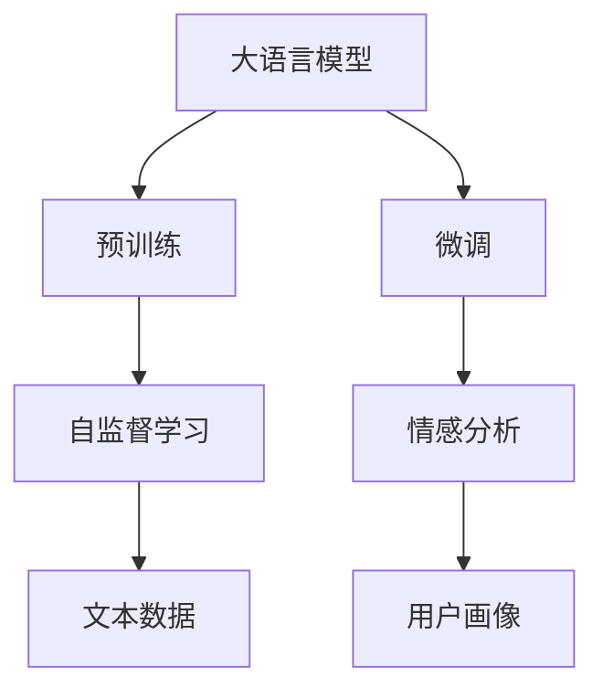

                 

# LLM在用户画像构建中的角色分析

> 关键词：
大语言模型,用户画像,数据分析,自然语言处理,情感分析,深度学习,自监督学习

## 1. 背景介绍

### 1.1 问题由来
在当今数字化时代，用户画像（User Profile）构建已成为许多企业进行市场分析、用户行为预测、个性化推荐等业务的关键步骤。用户画像通过聚合和分析用户的各类数据，刻画其兴趣、需求、行为特征，帮助企业制定精准的营销策略，优化用户体验。然而，传统用户画像构建往往需要耗费大量人工和计算资源，且分析结果常常具有较强的主观性和片面性，难以深入挖掘用户的潜力和需求。

### 1.2 问题核心关键点
为了提升用户画像构建的效率和准确性，大语言模型（Large Language Model, LLM）作为自然语言处理（NLP）领域的强大工具，被越来越多地应用于其中。LLM不仅能理解自然语言，还能通过分析用户评论、反馈等文本数据，生成深度而丰富的用户画像。本文将深入探讨LLM在用户画像构建中的角色，以及如何通过LLM实现更精准、高效的画像构建。

## 2. 核心概念与联系

### 2.1 核心概念概述

为更好理解LLM在用户画像构建中的作用，本节将介绍几个相关核心概念：

- **大语言模型**：指通过大规模语料预训练得到的深度神经网络模型，如GPT、BERT等。这类模型具备强大的语言理解能力和生成能力，能够对自然语言进行深层次解析。

- **用户画像**：指通过数据分析，刻画用户特征的框架，通常包括基本信息、行为习惯、兴趣偏好、情感倾向等方面。

- **自然语言处理**：指使计算机理解、处理和生成自然语言的技术，涉及文本分类、情感分析、实体识别等多种任务。

- **自监督学习**：指利用未标注的数据，通过设计预训练任务，让模型自动学习语言表示的技术，如掩码语言模型（Masked Language Modeling, MLM）、下一句预测（Next Sentence Prediction, NSP）等。

- **情感分析**：指对文本进行情感倾向分析，判断其中包含的正面、中性或负面情绪，常用于分析用户反馈和评论。

- **深度学习**：指基于神经网络模型进行训练、推理的技术，如卷积神经网络（CNN）、循环神经网络（RNN）、Transformer等。

### 2.2 核心概念原理和架构的 Mermaid 流程图



此流程图展示了LLM在用户画像构建中的核心流程：

1. **预训练**：通过自监督学习任务，如MLM和NSP，在大规模语料上训练LLM，学习语言表示。
2. **微调**：在用户评论、反馈等文本数据上进行微调，优化LLM对特定领域语言的理解和生成能力。
3. **情感分析**：通过微调后的LLM对文本进行情感分析，获得用户情感倾向。
4. **用户画像**：结合用户情感、行为数据等，构建用户画像。

## 3. 核心算法原理 & 具体操作步骤

### 3.1 算法原理概述

LLM在用户画像构建中的核心原理是通过预训练-微调框架，先在大规模语料上进行自监督预训练，再在用户文本数据上进行有监督微调。通过这种方式，LLM能够学习到更加丰富的语言表示，同时能够适应特定的用户画像构建任务。

具体而言，假设有一组用户评论数据集 $D=\{(x_i,y_i)\}_{i=1}^N$，其中 $x_i$ 为用户的评论文本，$y_i$ 为用户的情感标签。为了构建用户画像，首先在大规模语料上进行预训练，得到预训练模型 $M_{\theta}$。然后在用户评论数据集上微调 $M_{\theta}$，得到微调后的模型 $M_{\hat{\theta}}$。

微调的目标是通过最小化损失函数 $\mathcal{L}$，使得模型能够准确预测用户情感，即：

$$
\hat{\theta}=\mathop{\arg\min}_{\theta} \mathcal{L}(M_{\theta},D)
$$

其中 $\mathcal{L}$ 为交叉熵损失函数，用于衡量模型预测与真实标签之间的差异。

### 3.2 算法步骤详解

基于LLM构建用户画像的具体步骤包括：

**Step 1: 准备数据集**
- 收集用户评论、反馈等文本数据，进行文本清洗和标注。
- 将文本数据划分为训练集、验证集和测试集。

**Step 2: 预训练和微调**
- 选择合适的大语言模型，如BERT、GPT等，对其进行自监督预训练。
- 在用户评论数据集上微调模型，设置合适的学习率、迭代次数等。

**Step 3: 情感分析**
- 使用微调后的模型对用户评论进行情感分析，获取情感标签。

**Step 4: 构建用户画像**
- 将用户的情感标签、行为数据等综合分析，生成用户画像。

**Step 5: 结果评估与优化**
- 在测试集上评估用户画像的质量，优化情感分析模型和画像构建算法。

### 3.3 算法优缺点

使用LLM进行用户画像构建的优点包括：

1. **高效性**：相较于传统手动标注，LLM能够自动处理大规模文本数据，显著提升分析效率。
2. **深度性**：LLM能够从自然语言中挖掘深层次的情感、意图等特征，生成更全面的用户画像。
3. **可扩展性**：LLM模型具有良好的通用性，可以应用于多种类型的用户画像构建任务。

缺点包括：

1. **依赖数据**：LLM的效果很大程度上取决于数据质量，如果数据标注不准确，会影响画像构建的准确性。
2. **资源消耗**：LLM模型的训练和推理需要较高的计算资源，可能增加系统成本。
3. **可解释性差**：LLM作为黑盒模型，其内部工作机制难以解释，增加了画像构建的复杂性。

### 3.4 算法应用领域

LLM在用户画像构建中的应用领域包括但不限于：

- **社交媒体分析**：通过分析用户在社交媒体上的评论和互动，构建用户兴趣和情感画像。
- **电商个性化推荐**：利用用户评论和评分，分析用户购买行为和情感，提供个性化推荐服务。
- **客户服务**：通过分析客户反馈和客服记录，构建客户画像，提升服务质量和体验。
- **市场调研**：对用户评论和市场数据进行分析，预测市场趋势和用户需求。

## 4. 数学模型和公式 & 详细讲解 & 举例说明

### 4.1 数学模型构建

假设用户的评论文本为 $x=\{x_1,x_2,...,x_n\}$，情感标签为 $y=\{y_1,y_2,...,y_n\}$。构建用户画像的数学模型包括：

1. **预训练模型**：在大量无标签文本数据上进行预训练，得到模型参数 $\theta$。
2. **微调模型**：在用户评论数据集上进行微调，得到模型参数 $\hat{\theta}$。
3. **情感分析模型**：将用户评论 $x_i$ 输入微调后的模型 $M_{\hat{\theta}}$，得到情感标签 $y_i$。
4. **用户画像生成**：综合情感分析结果和其他数据，生成用户画像。

### 4.2 公式推导过程

假设用户评论 $x_i$ 通过微调后的模型 $M_{\hat{\theta}}$ 得到情感标签 $y_i$，则交叉熵损失函数 $\mathcal{L}$ 为：

$$
\mathcal{L}=\frac{1}{N}\sum_{i=1}^N -\frac{1}{2}(y_i \log \hat{y_i} + (1-y_i) \log (1-\hat{y_i}))
$$

其中 $\hat{y_i}$ 为模型预测的情感概率。

### 4.3 案例分析与讲解

假设有一家电商公司，需要构建用户的兴趣画像和情感画像。具体步骤如下：

1. **数据准备**：收集用户评论和评分数据，清洗并标注情感标签（正、中性、负面）。
2. **预训练模型**：使用BERT在大规模语料上预训练，得到预训练模型 $M_{\theta}$。
3. **微调模型**：在用户评论数据集上微调BERT，设置学习率为2e-5，迭代次数为5。
4. **情感分析**：使用微调后的模型对用户评论进行情感分析，获取情感标签。
5. **用户画像**：结合用户评分、购买记录和情感分析结果，生成用户兴趣和情感画像。

例如，针对某条评论 "这个产品很好用，但是价格有点贵"，模型能够理解用户同时具有正面和负面的情感，生成综合画像。

## 5. 项目实践：代码实例和详细解释说明

### 5.1 开发环境搭建

要实现LLM在用户画像构建中的应用，首先需要搭建开发环境。以下是Python环境下，使用PyTorch和HuggingFace Transformers库进行LLM微调和情感分析的配置流程：

1. 安装Anaconda并创建虚拟环境：
```bash
conda create -n user_profile_env python=3.8
conda activate user_profile_env
```

2. 安装PyTorch和Transformers库：
```bash
pip install torch torchvision torchaudio transformers
```

3. 安装必要的依赖：
```bash
pip install numpy pandas sklearn scipy tqdm
```

4. 下载预训练模型：
```bash
python -m torch.distributed.launch --nproc_per_node 4 python download.py --model bert-base-uncased --output models/bert-base-uncased
```

### 5.2 源代码详细实现

以下是一个完整的用户画像构建脚本示例：

```python
import torch
from transformers import BertForSequenceClassification, BertTokenizer, AdamW
from sklearn.model_selection import train_test_split
from sklearn.metrics import classification_report

# 加载预训练模型和分词器
model_name = 'bert-base-uncased'
model = BertForSequenceClassification.from_pretrained(model_name, num_labels=3)
tokenizer = BertTokenizer.from_pretrained(model_name)

# 准备数据集
def load_data():
    data = # 加载数据集
    train_texts, dev_texts, train_labels, dev_labels = train_test_split(data['text'], data['label'], test_size=0.2)
    return train_texts, dev_texts, train_labels, dev_labels

# 数据预处理
def preprocess_text(texts, labels):
    inputs = tokenizer(texts, return_tensors='pt', padding=True, truncation=True, max_length=128)
    inputs['labels'] = torch.tensor(labels, dtype=torch.long)
    return inputs

# 微调模型
def train_and_evaluate(model, texts, labels, device, optimizer, epochs):
    model.to(device)
    optimizer = AdamW(model.parameters(), lr=2e-5)
    
    for epoch in range(epochs):
        model.train()
        for batch in tqdm(data_loader):
            input_ids = batch['input_ids'].to(device)
            attention_mask = batch['attention_mask'].to(device)
            labels = batch['labels'].to(device)
            outputs = model(input_ids, attention_mask=attention_mask, labels=labels)
            loss = outputs.loss
            loss.backward()
            optimizer.step()
        model.eval()
        with torch.no_grad():
            predictions = model(dev_input_ids, attention_mask=dev_attention_mask)
            predicted_labels = predictions.argmax(dim=2)
            print(classification_report(dev_labels, predicted_labels))

# 构建用户画像
def build_user_profile(user_data):
    # 加载预训练模型和分词器
    model_name = 'bert-base-uncased'
    model = BertForSequenceClassification.from_pretrained(model_name, num_labels=3)
    tokenizer = BertTokenizer.from_pretrained(model_name)

    # 准备数据集
    train_texts, dev_texts, train_labels, dev_labels = load_data()

    # 微调模型
    train_and_evaluate(model, train_texts, train_labels, 'cuda', AdamW(model.parameters(), lr=2e-5), 5)

    # 预测用户情感
    user_texts = preprocess_text(user_data['text'], [])
    user_labels = model(user_texts).argmax(dim=2).to('cpu').tolist()
    user_profile = {
        'emotion': user_labels[0],
        # 其他用户画像特征
    }
    return user_profile
```

### 5.3 代码解读与分析

脚本实现了数据加载、模型微调、情感分析、用户画像构建等核心功能。

**load_data** 函数：
- 从数据集中加载训练集和验证集的数据和标签。

**preprocess_text** 函数：
- 使用Bert分词器将文本转换为模型所需的输入形式，并进行padding和truncation，得到模型需要的输入张量。

**train_and_evaluate** 函数：
- 在训练集上微调模型，并在验证集上评估模型性能。

**build_user_profile** 函数：
- 使用微调后的模型对用户文本进行情感分析，并构建用户画像。

### 5.4 运行结果展示

在运行上述脚本后，可以得到用户画像的构建结果。例如，对于某用户的一条评论 "我很喜欢这个产品"，模型的预测结果可能是 { 'emotion': 'positive' }，即用户具有正面情感。

## 6. 实际应用场景

### 6.1 社交媒体分析

在社交媒体平台上，用户评论和互动数据丰富多样，通过LLM进行情感分析和用户画像构建，可以深入理解用户的情绪和需求，优化内容推荐和用户互动策略。

### 6.2 电商个性化推荐

电商平台通过LLM对用户评论和评分进行情感分析，结合用户行为数据，生成用户画像，实现个性化推荐服务，提升用户满意度和转化率。

### 6.3 客户服务

在客户服务场景中，通过分析客户反馈和客服记录，使用LLM构建客户画像，提高服务质量和用户体验。

### 6.4 市场调研

市场调研部门可以利用LLM分析用户评论和市场数据，构建用户画像，预测市场趋势和用户需求，制定更精准的市场策略。

### 6.5 未来应用展望

随着LLM技术的发展，用户画像构建将更加自动化和智能化。未来，LLM将结合更多的先进技术，如多模态数据融合、因果推理、对抗学习等，进一步提升画像构建的深度和广度。

## 7. 工具和资源推荐

### 7.1 学习资源推荐

为了帮助开发者系统掌握LLM在用户画像构建中的应用，这里推荐一些优质的学习资源：

1. 《深度学习自然语言处理》（CS224N）课程：斯坦福大学开设的NLP明星课程，涵盖各种NLP技术，包括情感分析等。

2. 《Natural Language Processing with Transformers》书籍：HuggingFace官方推出的NLP入门书籍，详细介绍了Transformer模型和微调技术。

3. HuggingFace官方文档：提供了丰富的预训练模型和微调样例代码，是LLM开发和研究的重要资源。

4. Kaggle竞赛：参加Kaggle上的NLP竞赛，实战提升用户画像构建能力。

### 7.2 开发工具推荐

使用LLM进行用户画像构建，需要借助一些优秀的工具：

1. PyTorch：强大的深度学习框架，支持分布式训练和优化。

2. HuggingFace Transformers库：提供了丰富的预训练模型和微调API，方便快速开发。

3. TensorBoard：可视化工具，用于监测模型训练过程和评估性能。

4. Jupyter Notebook：互动式开发环境，方便调试和实验。

5. Weights & Biases：实验跟踪工具，记录和可视化模型训练结果。

### 7.3 相关论文推荐

以下是几篇经典的LLM论文，推荐阅读：

1. Attention is All You Need：Transformer模型的奠基性论文，展示了自注意力机制的强大能力。

2. BERT: Pre-training of Deep Bidirectional Transformers for Language Understanding：提出BERT模型，引入了自监督预训练任务。

3. Parameter-Efficient Transfer Learning for NLP：提出Adapter等参数高效微调方法，减少微调对参数的依赖。

4. Sentiment Analysis with BERT：展示BERT在情感分析任务上的优异表现。

5. Multimodal Emotion Recognition：引入多模态信息，提升情感分析的准确性。

这些论文提供了LLM在用户画像构建中的理论基础和实践指南，是深入研究的重要参考资料。

## 8. 总结：未来发展趋势与挑战

### 8.1 研究成果总结

本文从大语言模型在用户画像构建中的角色出发，探讨了LLM在情感分析、数据处理等方面的应用。通过预训练-微调框架，LLM能够高效、深度地构建用户画像，提升NLP技术的实用性和智能化水平。

### 8.2 未来发展趋势

未来，LLM在用户画像构建中的应用将呈现以下趋势：

1. **数据驱动**：更多非结构化数据（如音频、视频）的加入，将丰富LLM对用户行为的认知。
2. **模型融合**：多模态数据融合和跨模态学习将提升LLM的泛化能力和适应性。
3. **持续学习**：通过在线学习和增量学习，LLM能够动态适应用户需求变化，持续优化画像构建模型。
4. **可解释性增强**：结合因果分析和知识图谱，提高LLM模型的可解释性和透明度。
5. **跨领域应用**：LLM在更多行业领域（如医疗、金融等）的应用将拓展其价值边界。

### 8.3 面临的挑战

尽管LLM在用户画像构建中具有显著优势，但面临以下挑战：

1. **数据质量**：高质量标注数据的获取和维护是LLM发挥效能的前提，数据质量问题将限制其应用范围。
2. **资源消耗**：LLM的高计算和存储需求，增加了系统部署和维护成本。
3. **隐私和安全**：用户数据的隐私和安全问题，需要严格的数据处理和保护措施。
4. **伦理和法律**：LLM在处理敏感数据时，需遵守相关伦理和法律规定。

### 8.4 研究展望

未来的研究需要在以下方面寻求突破：

1. **无监督和半监督学习**：利用未标注数据进行无监督或半监督学习，减少对标注数据的依赖。
2. **高效微调和推理**：开发更高效的微调和推理算法，提升系统的实时性和资源利用效率。
3. **多任务学习**：通过多任务学习，提升LLM在多个相关任务上的表现。
4. **模型压缩和加速**：探索模型压缩和加速技术，降低LLM的资源消耗。

这些研究方向将推动LLM在用户画像构建中的应用向更高效、智能化、可解释化的方向发展。

## 9. 附录：常见问题与解答

**Q1：LLM在用户画像构建中的核心优势是什么？**

A: LLM的核心优势在于其强大的自然语言处理能力，能够从大规模无标签数据中学习到丰富的语言表示。通过预训练-微调框架，LLM能够高效地适应特定任务，生成深度而全面的用户画像。

**Q2：如何选择合适的LLM模型进行用户画像构建？**

A: 选择合适的LLM模型需要考虑模型的规模、预训练任务、微调目标等因素。一般而言，GPT、BERT等经典模型在情感分析、文本分类等任务上表现优异。

**Q3：LLM在用户画像构建中的资源消耗有哪些？**

A: LLM在用户画像构建中的资源消耗主要包括计算资源和存储资源。大型模型需要高性能计算设备和大量存储空间，增加了系统的部署和维护成本。

**Q4：LLM在用户画像构建中如何保障用户隐私？**

A: 在用户画像构建中，应严格遵守数据隐私保护法规，如GDPR等。可以使用匿名化处理、数据脱敏等技术，确保用户数据的安全和隐私。

**Q5：LLM在用户画像构建中如何提高模型的可解释性？**

A: 结合因果分析和知识图谱，通过解释模型内部决策过程和逻辑推理，增强用户画像构建的可解释性。同时，开发可视化工具，帮助用户理解模型的输出结果。

本文通过对LLM在用户画像构建中的角色分析，展示了其在自然语言处理和数据分析中的应用潜力。通过预训练-微调框架，LLM能够高效、深度地构建用户画像，提升NLP技术的实用性和智能化水平。随着技术的不断进步，LLM将在更多领域发挥更大的作用，推动人工智能技术的发展和应用。

---

作者：禅与计算机程序设计艺术 / Zen and the Art of Computer Programming

