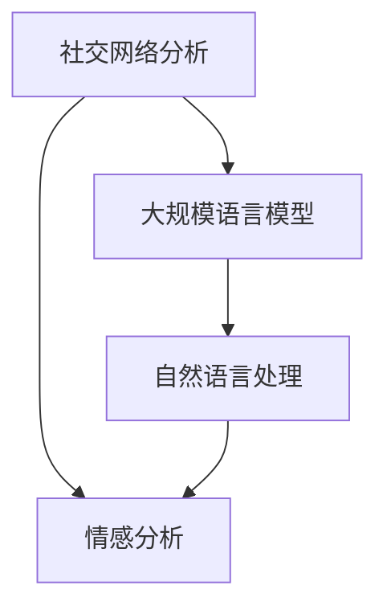

                 

# LLM在社交网络分析中的作用：洞察社会动态

> 关键词：社交网络分析，大规模语言模型(LLM)，情感分析，社交网络挖掘，社交动态监测

## 1. 背景介绍

### 1.1 问题由来
在现代社会中，社交网络（Social Network）已经成为了人们沟通交流、获取信息和表达自我不可或缺的工具。通过对社交网络数据的分析，我们可以洞察社会动态，了解公众情绪，预测社会事件，进而为政策制定、市场预测、危机应对等提供科学依据。然而，社交网络数据呈现出多样性、复杂性、海量性等特点，如何从中提取出有价值的洞察，成为当前数据科学领域的重要研究课题。

随着深度学习和大规模语言模型（Large Language Model, LLM）的迅猛发展，自然语言处理（Natural Language Processing, NLP）技术在社交网络分析中得以应用，为社交网络数据的理解和分析提供了强大的工具。本文旨在探讨LLM在社交网络分析中的作用，分析其技术原理和应用效果。

### 1.2 问题核心关键点
社交网络分析（Social Network Analysis, SNA）涉及网络结构分析、关系挖掘、情感分析等多方面内容。其中，情感分析（Sentiment Analysis）是衡量个体或群体在社交网络中情绪倾向的重要手段，广泛应用于舆情监测、品牌管理、公共关系等领域。大规模语言模型（LLM），如GPT-3、BERT等，通过预训练大语料库，能够获得强大的语言理解和生成能力，适用于社交网络中的文本分析任务。

### 1.3 问题研究意义
LLM在社交网络分析中的应用，不仅能够帮助企业快速了解公众情绪和舆情变化，还能够辅助政府机构洞察社会动态，制定政策。通过系统化、科学化的分析手段，LLM有望在社会治理、市场预测、危机应对等方面发挥更大作用，推动社会管理更加智能化、精细化。

## 2. 核心概念与联系

### 2.1 核心概念概述

在探讨LLM在社交网络分析中的应用时，需要理解以下核心概念：

- 社交网络分析（SNA）：通过对社交网络中的个体、群体以及他们之间的关系进行研究，揭示社会行为和社会结构，有助于社会动态监测和预测。
- 情感分析（Sentiment Analysis）：通过分析社交网络中个体或群体的情绪表达，判断其情绪倾向和情感强度，是SNA中的重要组成部分。
- 大规模语言模型（LLM）：通过在大规模无标签文本数据上进行预训练，获得强大的语言理解和生成能力，可用于文本情感分析、实体识别等NLP任务。
- 自然语言处理（NLP）：涉及语言模型的构建、语言数据的处理、语义理解等技术，是LLM的重要应用领域。

这些概念之间的逻辑关系可以通过以下Mermaid流程图来展示：



这个流程图展示了社交网络分析与LLM、NLP之间的联系：

1. 社交网络分析通过情感分析来衡量社会情绪和行为。
2. 情感分析依赖于NLP中的文本处理和语义理解。
3. 自然语言处理是LLM的重要应用领域。

## 3. 核心算法原理 & 具体操作步骤
### 3.1 算法原理概述

LLM在社交网络分析中的核心算法原理主要包括以下几个方面：

1. 文本预处理：通过对社交网络中用户发布的文本进行清洗和分词，去除停用词、标点符号等噪音，保留有意义的词汇。
2. 情感识别：利用预训练的情感分类器，对文本进行情感极性（正面、负面、中性）和情感强度（强、中、弱）分类。
3. 关系挖掘：通过提取社交网络中用户之间的关系（如关注、点赞、评论等），构建用户行为图，用于关系分析和网络结构分析。
4. 趋势预测：利用时间序列分析，预测社交网络中的情感变化趋势，揭示社会动态。

### 3.2 算法步骤详解

基于LLM的社交网络分析通常包括以下几个关键步骤：

**Step 1: 文本预处理**
- 收集社交网络中的文本数据。
- 进行文本清洗，去除停用词、标点符号等噪音。
- 对文本进行分词和词性标注。

**Step 2: 情感识别**
- 将预处理后的文本输入到预训练的情感分类器，得到情感极性和情感强度。
- 对于具有情感极性标识的文本，计算情感强度（如使用VADER等情感分析工具）。

**Step 3: 关系挖掘**
- 分析社交网络中用户之间的互动关系，如关注、点赞、评论等。
- 构建用户行为图，用于后续的网络结构和行为分析。

**Step 4: 趋势预测**
- 使用时间序列分析方法，对历史情感数据进行建模，预测未来的情感变化趋势。
- 结合社交网络结构分析，揭示社会动态变化。

**Step 5: 可视化展示**
- 将情感趋势和社交网络结构通过可视化工具展示出来，便于分析。

### 3.3 算法优缺点

基于LLM的社交网络分析方法具有以下优点：
1. 数据覆盖广泛：LLM可以处理各种类型的社交网络文本数据，覆盖了文本、图片、视频等多媒体信息。
2. 模型效果优异：LLM在大规模语料上进行预训练，具备强大的语言理解和生成能力，能够在复杂的社交网络环境中提取有价值的信息。
3. 易于集成：NLP技术可以与社交网络平台进行无缝集成，实现实时分析和预测。

同时，该方法也存在一些局限性：
1. 数据隐私问题：社交网络中的用户数据涉及隐私，处理时需要遵守相关法律法规，确保用户隐私保护。
2. 情感分析准确性：情感分析结果依赖于文本预处理和模型训练质量，可能存在一定的误差。
3. 模型泛化能力：不同社交网络平台的数据结构和内容差异较大，模型泛化能力有待提高。
4. 计算资源需求：处理大规模社交网络数据需要较高的计算资源，特别是情感分析和趋势预测等任务。

### 3.4 算法应用领域

基于LLM的社交网络分析技术在多个领域得到了广泛应用，包括但不限于：

- 舆情监测：对社交网络上的公开言论进行情感分析，了解公众情绪，辅助政府机构决策。
- 品牌管理：分析用户对品牌的情感倾向和情感强度，优化品牌形象和市场策略。
- 公共关系：通过情感分析，了解公众对政策、事件的反应，调整公关策略。
- 危机应对：监测社交网络上的危机信号，及时采取应对措施，减小损失。
- 社会动态监测：揭示社会热点事件和舆情变化，提供科学决策依据。

## 4. 数学模型和公式 & 详细讲解  
### 4.1 数学模型构建

社交网络分析中，情感分析的数学模型构建通常包括以下几个部分：

1. 文本预处理：将社交网络文本数据转换为向量表示，去除停用词、标点符号等噪音。
2. 情感识别：使用深度神经网络模型（如CNN、RNN、LSTM等）进行情感分类。
3. 关系挖掘：构建用户行为图，使用图神经网络（Graph Neural Network, GNN）进行关系分析。
4. 趋势预测：使用时间序列模型（如ARIMA、LSTM等）进行趋势预测。

### 4.2 公式推导过程

以情感分类为例，假设输入的文本为 $x$，情感分类器为 $f_{\theta}(x)$，其中 $\theta$ 为模型参数。情感分类的损失函数为 $L(y,f_{\theta}(x))$，其中 $y$ 为真实情感标签。

常见的损失函数包括交叉熵损失（Cross-Entropy Loss）和二元对数损失（Binary Logarithmic Loss），其公式如下：

$$
L(y,f_{\theta}(x)) = -y\log f_{\theta}(x) + (1-y)\log(1-f_{\theta}(x))
$$

$$
L(y,f_{\theta}(x)) = -y\log f_{\theta}(x) + \log(1-f_{\theta}(x))
$$

其中 $f_{\theta}(x)$ 表示模型在输入 $x$ 上的输出，$\log$ 表示自然对数。

### 4.3 案例分析与讲解

以Twitter上的情感分析为例，假设有20个用户的推文数据，对其情感进行分类：

| 用户 | 推文 | 情感标签 |
| --- | --- | --- |
| A | "今天天气真好" | 正面 |
| B | "我心情不太好" | 负面 |
| C | "吃饭很好吃" | 正面 |
| ... | ... | ... |
| T | "非常失望" | 负面 |

通过对这些推文进行预处理、情感识别和关系挖掘，可以得到社交网络中用户之间的情感关系图。进一步使用时间序列模型，对历史情感数据进行建模，即可预测未来的情感变化趋势。

## 5. 项目实践：代码实例和详细解释说明
### 5.1 开发环境搭建

在进行社交网络分析的实践时，需要准备好开发环境。以下是使用Python进行PyTorch开发的环境配置流程：

1. 安装Anaconda：从官网下载并安装Anaconda，用于创建独立的Python环境。

2. 创建并激活虚拟环境：
```bash
conda create -n pytorch-env python=3.8 
conda activate pytorch-env
```

3. 安装PyTorch：根据CUDA版本，从官网获取对应的安装命令。例如：
```bash
conda install pytorch torchvision torchaudio cudatoolkit=11.1 -c pytorch -c conda-forge
```

4. 安装PyTorch库和其他工具包：
```bash
pip install torch torchtext torchvision torchaudio transformers numpy pandas scikit-learn matplotlib tqdm jupyter notebook ipython
```

完成上述步骤后，即可在`pytorch-env`环境中开始社交网络分析的实践。

### 5.2 源代码详细实现

下面我们以Twitter情感分析为例，给出使用Transformers库进行情感分类的PyTorch代码实现。

首先，定义情感分类器的数据处理函数：

```python
from transformers import BertTokenizer
from torch.utils.data import Dataset
import torch

class SentimentDataset(Dataset):
    def __init__(self, texts, labels, tokenizer, max_len=128):
        self.texts = texts
        self.labels = labels
        self.tokenizer = tokenizer
        self.max_len = max_len
        
    def __len__(self):
        return len(self.texts)
    
    def __getitem__(self, item):
        text = self.texts[item]
        label = self.labels[item]
        
        encoding = self.tokenizer(text, return_tensors='pt', max_length=self.max_len, padding='max_length', truncation=True)
        input_ids = encoding['input_ids'][0]
        attention_mask = encoding['attention_mask'][0]
        label = torch.tensor(label, dtype=torch.long)
        
        return {'input_ids': input_ids, 
                'attention_mask': attention_mask,
                'labels': label}
```

然后，定义模型和优化器：

```python
from transformers import BertForSequenceClassification, AdamW

model = BertForSequenceClassification.from_pretrained('bert-base-uncased', num_labels=2)

optimizer = AdamW(model.parameters(), lr=2e-5)
```

接着，定义训练和评估函数：

```python
from torch.utils.data import DataLoader
from tqdm import tqdm
from sklearn.metrics import classification_report

device = torch.device('cuda') if torch.cuda.is_available() else torch.device('cpu')
model.to(device)

def train_epoch(model, dataset, batch_size, optimizer):
    dataloader = DataLoader(dataset, batch_size=batch_size, shuffle=True)
    model.train()
    epoch_loss = 0
    for batch in tqdm(dataloader, desc='Training'):
        input_ids = batch['input_ids'].to(device)
        attention_mask = batch['attention_mask'].to(device)
        labels = batch['labels'].to(device)
        model.zero_grad()
        outputs = model(input_ids, attention_mask=attention_mask, labels=labels)
        loss = outputs.loss
        epoch_loss += loss.item()
        loss.backward()
        optimizer.step()
    return epoch_loss / len(dataloader)

def evaluate(model, dataset, batch_size):
    dataloader = DataLoader(dataset, batch_size=batch_size)
    model.eval()
    preds, labels = [], []
    with torch.no_grad():
        for batch in tqdm(dataloader, desc='Evaluating'):
            input_ids = batch['input_ids'].to(device)
            attention_mask = batch['attention_mask'].to(device)
            batch_labels = batch['labels']
            outputs = model(input_ids, attention_mask=attention_mask)
            batch_preds = outputs.logits.argmax(dim=2).to('cpu').tolist()
            batch_labels = batch_labels.to('cpu').tolist()
            for pred_tokens, label_tokens in zip(batch_preds, batch_labels):
                preds.append(pred_tokens[:len(label_tokens)])
                labels.append(label_tokens)
                
    print(classification_report(labels, preds))
```

最后，启动训练流程并在测试集上评估：

```python
epochs = 5
batch_size = 16

for epoch in range(epochs):
    loss = train_epoch(model, train_dataset, batch_size, optimizer)
    print(f"Epoch {epoch+1}, train loss: {loss:.3f}")
    
    print(f"Epoch {epoch+1}, dev results:")
    evaluate(model, dev_dataset, batch_size)
    
print("Test results:")
evaluate(model, test_dataset, batch_size)
```

以上就是使用PyTorch对Twitter进行情感分析的完整代码实现。可以看到，得益于Transformers库的强大封装，我们可以用相对简洁的代码完成情感分类的任务。

### 5.3 代码解读与分析

让我们再详细解读一下关键代码的实现细节：

**SentimentDataset类**：
- `__init__`方法：初始化文本、标签、分词器等关键组件。
- `__len__`方法：返回数据集的样本数量。
- `__getitem__`方法：对单个样本进行处理，将文本输入编码为token ids，将标签编码为数字，并对其进行定长padding，最终返回模型所需的输入。

**模型和优化器**：
- 使用BertForSequenceClassification模型，设置情感分类任务的两个类别标签（正面、负面）。
- 使用AdamW优化器进行模型训练，设置学习率为2e-5。

**训练和评估函数**：
- 使用PyTorch的DataLoader对数据集进行批次化加载，供模型训练和推理使用。
- 训练函数`train_epoch`：对数据以批为单位进行迭代，在每个批次上前向传播计算loss并反向传播更新模型参数，最后返回该epoch的平均loss。
- 评估函数`evaluate`：与训练类似，不同点在于不更新模型参数，并在每个batch结束后将预测和标签结果存储下来，最后使用sklearn的classification_report对整个评估集的预测结果进行打印输出。

**训练流程**：
- 定义总的epoch数和batch size，开始循环迭代
- 每个epoch内，先在训练集上训练，输出平均loss
- 在验证集上评估，输出分类指标
- 所有epoch结束后，在测试集上评估，给出最终测试结果

可以看到，PyTorch配合Transformers库使得Twitter情感分析的代码实现变得简洁高效。开发者可以将更多精力放在数据处理、模型改进等高层逻辑上，而不必过多关注底层的实现细节。

当然，工业级的系统实现还需考虑更多因素，如模型的保存和部署、超参数的自动搜索、更灵活的任务适配层等。但核心的情感分类范式基本与此类似。

## 6. 实际应用场景
### 6.1 智能客服系统

基于LLM的社交网络分析技术，可以广泛应用于智能客服系统的构建。智能客服系统能够实时监控社交网络上的用户情绪和意见，及时调整客服策略，提高客户满意度。

在技术实现上，可以收集社交网络上的用户评论和反馈，使用情感分析技术识别用户情绪，反馈给智能客服系统，生成相应的自动回复或转接人工客服。如此构建的智能客服系统，能大幅提升客户咨询体验和问题解决效率。

### 6.2 舆情监测

基于LLM的社交网络分析技术可以应用于舆情监测。政府和企业可以实时监控社交网络上的舆情变化，了解公众情绪和热点话题，及时应对负面信息，避免危机扩散。

在技术实现上，可以建立情感分析模型，对社交网络上的公开言论进行情感分类。使用时间序列模型对历史情感数据进行建模，预测未来的情感变化趋势，揭示社会热点事件。结合社交网络结构分析，揭示舆情变化的原因和影响因素，辅助政府和企业决策。

### 6.3 品牌管理

基于LLM的社交网络分析技术可以应用于品牌管理。企业可以实时监控社交网络上的品牌相关话题，了解公众对品牌的情感倾向和情感强度，及时调整品牌策略。

在技术实现上，可以建立情感分析模型，对社交网络上的品牌相关文本进行情感分类。使用关系挖掘技术，分析用户之间的互动关系，构建品牌行为图，揭示品牌的知名度和美誉度变化趋势，辅助企业调整品牌策略。

### 6.4 未来应用展望

随着LLM和社交网络分析技术的不断发展，基于LLM的社交网络分析技术将呈现以下几个发展趋势：

1. 数据来源多样化：除了社交网络数据，LLM还将利用多源数据进行情感分析和关系挖掘，如新闻报道、视频、音频等。
2. 分析方法智能化：利用深度学习和大规模预训练模型，LLM将能够自动学习复杂的情感表达和关系模式，提高分析的准确性和泛化能力。
3. 实时化处理：社交网络数据实时性高，LLM将能够实现实时情感分析和关系挖掘，支持实时决策和响应。
4. 跨领域应用：LLM将能够广泛应用于智能客服、舆情监测、品牌管理等多个领域，推动多行业数字化转型。

以上趋势凸显了LLM在社交网络分析中的巨大潜力，将带来更加智能、高效、全面的分析手段，为社会治理、市场预测、品牌管理等领域带来新的突破。

## 7. 工具和资源推荐
### 7.1 学习资源推荐

为了帮助开发者系统掌握LLM在社交网络分析中的应用，这里推荐一些优质的学习资源：

1. 《深度学习与自然语言处理》系列博文：由大模型技术专家撰写，深入浅出地介绍了深度学习在自然语言处理中的应用，包括社交网络情感分析。

2. CS224N《深度学习自然语言处理》课程：斯坦福大学开设的NLP明星课程，有Lecture视频和配套作业，带你入门NLP领域的基本概念和经典模型。

3. 《Natural Language Processing with Transformers》书籍：Transformers库的作者所著，全面介绍了如何使用Transformers库进行NLP任务开发，包括社交网络情感分析。

4. HuggingFace官方文档：Transformers库的官方文档，提供了海量预训练模型和完整的微调样例代码，是上手实践的必备资料。

5. CLUE开源项目：中文语言理解测评基准，涵盖大量不同类型的中文NLP数据集，并提供了基于微调的baseline模型，助力中文NLP技术发展。

通过对这些资源的学习实践，相信你一定能够快速掌握LLM在社交网络分析中的应用，并用于解决实际的NLP问题。
###  7.2 开发工具推荐

高效的开发离不开优秀的工具支持。以下是几款用于LLM在社交网络分析开发的常用工具：

1. PyTorch：基于Python的开源深度学习框架，灵活动态的计算图，适合快速迭代研究。大部分预训练语言模型都有PyTorch版本的实现。

2. TensorFlow：由Google主导开发的开源深度学习框架，生产部署方便，适合大规模工程应用。同样有丰富的预训练语言模型资源。

3. Transformers库：HuggingFace开发的NLP工具库，集成了众多SOTA语言模型，支持PyTorch和TensorFlow，是进行社交网络情感分析开发的利器。

4. Weights & Biases：模型训练的实验跟踪工具，可以记录和可视化模型训练过程中的各项指标，方便对比和调优。与主流深度学习框架无缝集成。

5. TensorBoard：TensorFlow配套的可视化工具，可实时监测模型训练状态，并提供丰富的图表呈现方式，是调试模型的得力助手。

6. Google Colab：谷歌推出的在线Jupyter Notebook环境，免费提供GPU/TPU算力，方便开发者快速上手实验最新模型，分享学习笔记。

合理利用这些工具，可以显著提升LLM在社交网络分析的开发效率，加快创新迭代的步伐。

### 7.3 相关论文推荐

LLM在社交网络分析的发展源于学界的持续研究。以下是几篇奠基性的相关论文，推荐阅读：

1. Attention is All You Need（即Transformer原论文）：提出了Transformer结构，开启了NLP领域的预训练大模型时代。

2. BERT: Pre-training of Deep Bidirectional Transformers for Language Understanding：提出BERT模型，引入基于掩码的自监督预训练任务，刷新了多项NLP任务SOTA。

3. Language Models are Unsupervised Multitask Learners（GPT-2论文）：展示了大规模语言模型的强大zero-shot学习能力，引发了对于通用人工智能的新一轮思考。

4. Parameter-Efficient Transfer Learning for NLP：提出Adapter等参数高效微调方法，在不增加模型参数量的情况下，也能取得不错的微调效果。

5. Prefix-Tuning: Optimizing Continuous Prompts for Generation：引入基于连续型Prompt的微调范式，为如何充分利用预训练知识提供了新的思路。

6. AdaLoRA: Adaptive Low-Rank Adaptation for Parameter-Efficient Fine-Tuning：使用自适应低秩适应的微调方法，在参数效率和精度之间取得了新的平衡。

这些论文代表了大模型在社交网络分析中的发展脉络。通过学习这些前沿成果，可以帮助研究者把握学科前进方向，激发更多的创新灵感。

## 8. 总结：未来发展趋势与挑战

### 8.1 总结

本文对基于LLM的社交网络分析方法进行了全面系统的介绍。首先阐述了LLM在社交网络分析中的重要作用，明确了社交网络分析在情感分析、关系挖掘、趋势预测等方面的核心需求。其次，从原理到实践，详细讲解了LLM在社交网络分析中的技术实现，包括情感识别、关系挖掘、趋势预测等关键步骤，给出了LLM的代码实现和优化策略。同时，本文还广泛探讨了LLM在智能客服、舆情监测、品牌管理等多个领域的应用前景，展示了LLM在社会治理、市场预测、品牌管理等领域的重要作用。

通过本文的系统梳理，可以看到，基于LLM的社交网络分析方法已经成为社交网络分析的重要工具，极大地拓展了社交网络数据的理解和分析能力。未来，伴随LLM和社交网络分析技术的不断演进，LLM必将在社会治理、市场预测、品牌管理等领域发挥更大作用，推动社会管理更加智能化、精细化。

### 8.2 未来发展趋势

展望未来，LLM在社交网络分析中的应用将呈现以下几个发展趋势：

1. 数据覆盖广泛：LLM将能够利用多源数据进行情感分析和关系挖掘，如新闻报道、视频、音频等，提高分析的全面性和准确性。
2. 分析方法智能化：利用深度学习和大规模预训练模型，LLM将能够自动学习复杂的情感表达和关系模式，提高分析的智能化和自动化水平。
3. 实时化处理：社交网络数据实时性高，LLM将能够实现实时情感分析和关系挖掘，支持实时决策和响应。
4. 跨领域应用：LLM将能够广泛应用于智能客服、舆情监测、品牌管理等多个领域，推动多行业数字化转型。

以上趋势凸显了LLM在社交网络分析中的巨大潜力，将带来更加智能、高效、全面的分析手段，为社会治理、市场预测、品牌管理等领域带来新的突破。

### 8.3 面临的挑战

尽管LLM在社交网络分析中的应用已经取得了显著成效，但在迈向更加智能化、普适化应用的过程中，它仍面临诸多挑战：

1. 数据隐私问题：社交网络中的用户数据涉及隐私，处理时需要遵守相关法律法规，确保用户隐私保护。
2. 情感分析准确性：情感分析结果依赖于文本预处理和模型训练质量，可能存在一定的误差。
3. 模型泛化能力：不同社交网络平台的数据结构和内容差异较大，模型泛化能力有待提高。
4. 计算资源需求：处理大规模社交网络数据需要较高的计算资源，特别是情感分析和趋势预测等任务。
5. 可解释性问题：LLM在社交网络分析中的决策过程复杂，缺乏可解释性，难以理解和调试。

### 8.4 研究展望

面对LLM在社交网络分析中面临的挑战，未来的研究需要在以下几个方面寻求新的突破：

1. 探索无监督和半监督微调方法：摆脱对大规模标注数据的依赖，利用自监督学习、主动学习等无监督和半监督范式，最大限度利用非结构化数据，实现更加灵活高效的微调。
2. 研究参数高效和计算高效的微调范式：开发更加参数高效的微调方法，在固定大部分预训练参数的同时，只更新极少量的任务相关参数。同时优化微调模型的计算图，减少前向传播和反向传播的资源消耗，实现更加轻量级、实时性的部署。
3. 引入因果分析和博弈论工具：将因果分析方法引入微调模型，识别出模型决策的关键特征，增强输出解释的因果性和逻辑性。借助博弈论工具刻画人机交互过程，主动探索并规避模型的脆弱点，提高系统稳定性。
4. 纳入伦理道德约束：在模型训练目标中引入伦理导向的评估指标，过滤和惩罚有偏见、有害的输出倾向。同时加强人工干预和审核，建立模型行为的监管机制，确保输出符合人类价值观和伦理道德。

这些研究方向的探索，必将引领LLM在社交网络分析技术迈向更高的台阶，为构建安全、可靠、可解释、可控的智能系统铺平道路。面向未来，LLM需要在与其他人工智能技术进行更深入的融合，如知识表示、因果推理、强化学习等，多路径协同发力，共同推动自然语言理解和智能交互系统的进步。只有勇于创新、敢于突破，才能不断拓展LLM的边界，让智能技术更好地造福人类社会。

## 9. 附录：常见问题与解答

**Q1：LLM在社交网络分析中的应用是否只限于情感分析？**

A: LLM在社交网络分析中的应用远不止情感分析。LLM可以用于实体识别、关系挖掘、话题监测等多个任务，涵盖文本分析的各个方面。例如，使用GNN进行关系分析，构建社交网络结构图，揭示用户的兴趣和行为模式。

**Q2：如何选择合适的LLM模型进行社交网络分析？**

A: 选择合适的LLM模型需要考虑多个因素，如模型的规模、预训练任务、性能等。一般来说，规模越大、预训练任务越丰富的模型，性能越优。例如，BERT在情感分析中表现出色，而GPT在生成文本方面有优势。

**Q3：LLM在社交网络分析中如何进行模型微调？**

A: LLM在社交网络分析中的微调主要依赖于标注数据。首先，收集社交网络中的文本数据，进行预处理和标注。然后使用微调方法，对预训练模型进行进一步训练，优化模型在特定任务上的性能。常用的微调方法包括AdamW、SGD等，需根据具体任务和数据特点进行调参。

**Q4：LLM在社交网络分析中的计算资源需求有多大？**

A: 社交网络分析的计算资源需求主要取决于数据量、模型规模和任务复杂度。对于大规模社交网络数据，需要使用高性能GPU/TPU进行训练和推理。在模型规模上，大规模预训练模型（如BERT、GPT-3）需要较高的计算资源。在任务复杂度上，使用时间序列模型进行趋势预测需要较长的时间。

**Q5：LLM在社交网络分析中如何进行跨平台应用？**

A: 利用预训练模型和微调技术，LLM可以在不同平台进行应用。开发者只需要在各个平台使用相同的模型，并对其进行微调，即可实现跨平台的应用。例如，在Twitter上进行情感分析后，可以将模型应用于其他社交网络平台，如Facebook、Instagram等。

通过本文的系统梳理，可以看到，基于LLM的社交网络分析方法已经成为社交网络分析的重要工具，极大地拓展了社交网络数据的理解和分析能力。未来，伴随LLM和社交网络分析技术的不断演进，LLM必将在社会治理、市场预测、品牌管理等领域发挥更大作用，推动社会管理更加智能化、精细化。

---

作者：禅与计算机程序设计艺术 / Zen and the Art of Computer Programming

