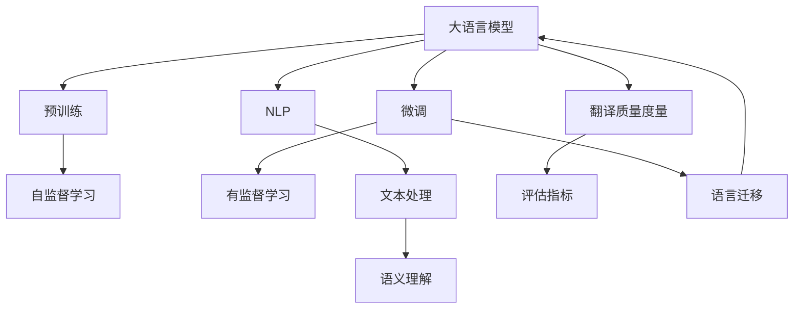

                 

# LLM在语言翻译中的突破：跨文化沟通的桥梁

> 关键词：大语言模型,机器翻译,自然语言处理(NLP),Transformer,BERT,跨文化交流,翻译质量提升

## 1. 背景介绍

### 1.1 问题由来

随着全球化的不断深入，跨文化交流变得越来越频繁。语言是沟通的工具，但语言差异往往成为跨文化交流的障碍。传统的基于规则的机器翻译系统往往难以应对复杂多变的语义和语境，人工翻译又成本高昂、效率低下。大语言模型(LLMs)的崛起为语言翻译带来了新的可能性，其在自然语言处理(NLP)领域的应用也正逐渐突破技术瓶颈，朝着更加高效、自然、准确的目标迈进。

### 1.2 问题核心关键点

大语言模型在语言翻译中主要通过预训练和微调过程，学习和理解两种语言之间的映射关系。其核心在于：
- 预训练阶段：在大型无标签数据集上进行自监督学习，学习通用的语言表示和语法结构。
- 微调阶段：使用包含特定语言对的平行语料库进行有监督学习，优化模型在两种语言之间的翻译能力。

大语言模型在翻译中的应用主要体现在以下几个方面：
- 语义理解：通过预训练和微调，模型可以学习到语言之间的语义对应关系，更好地理解不同语言的细微差别。
- 翻译流畅度：使用Transformer架构，大语言模型可以生成流畅自然的翻译文本，减少生硬和不自然的语句。
- 实时翻译：通过分布式计算和高效的推理机制，大语言模型可以实现实时翻译，适应各种应用场景。

尽管大语言模型在翻译领域取得了一些进展，但仍然面临一些挑战：
- 数据瓶颈：高质量的平行语料库通常不易获取，影响模型的训练效果。
- 翻译质量：尽管大语言模型在一些任务上表现优异，但在处理歧义、长句、专业术语等方面仍存在不足。
- 模型鲁棒性：大语言模型在面对新词、拼写错误、俚语等现象时，可能会出现断句或语义丢失。

## 2. 核心概念与联系

### 2.1 核心概念概述

为更好地理解大语言模型在语言翻译中的应用，本节将介绍几个关键概念：

- 大语言模型(LLMs)：通过大规模无标签文本数据预训练学习通用语言表示，再进行特定任务微调的语言模型。具有强大的语义理解和生成能力。
- 预训练(Pre-training)：在大规模无标签文本数据上进行自监督学习，学习语言的基础结构和语义表示。
- 微调(Fine-tuning)：在预训练模型的基础上，使用特定语言对的平行语料进行有监督学习，优化模型在两种语言之间的映射能力。
- 自然语言处理(NLP)：涉及文本的自动处理、理解和生成，是实现语言翻译的核心技术。
- 翻译质量度量：评估翻译结果与人工翻译之间的差异，衡量机器翻译的准确性和流畅度。
- 语言迁移(Transfer Learning)：通过在不同任务之间的迁移学习，提升模型在新任务上的性能。
- 生成对抗网络(GAN)：一种生成模型，用于生成高质量的自然语言文本。
- 神经机器翻译(NMT)：利用神经网络模型进行自动翻译的技术。

这些概念之间的逻辑关系可以通过以下Mermaid流程图来展示：



这个流程图展示了大语言模型在翻译中的核心概念及其相互关系：

1. 大语言模型通过预训练获得基础能力。
2. 微调优化模型在特定任务上的性能。
3. 自然语言处理技术帮助模型理解文本语义。
4. 生成对抗网络用于生成高质量的自然语言文本。
5. 神经机器翻译是实现自动翻译的技术。
6. 翻译质量度量评估翻译效果，指导微调优化。
7. 语言迁移实现模型在不同任务之间的知识迁移。

## 3. 核心算法原理 & 具体操作步骤
### 3.1 算法原理概述

大语言模型在语言翻译中的应用主要基于监督学习和自监督学习的混合范式。其核心思想是：将预训练的大语言模型视为一个强大的语言转换器，通过在特定语言对的平行语料库上进行有监督微调，使得模型能够准确地将一种语言的句子转换为另一种语言的句子。

假设存在两种语言 $L_1$ 和 $L_2$，预训练大语言模型为 $M_{\theta}$，其中 $\theta$ 为模型参数。给定语言对 $L_1$ 和 $L_2$ 的平行语料库 $D=\{(x_i, y_i)\}_{i=1}^N$，其中 $x_i$ 为 $L_1$ 的句子，$y_i$ 为 $L_2$ 的翻译，微调的目标是找到新的模型参数 $\hat{\theta}$，使得：

$$
\hat{\theta}=\mathop{\arg\min}_{\theta} \mathcal{L}(M_{\theta},D)
$$

其中 $\mathcal{L}$ 为针对语言对 $L_1$ 和 $L_2$ 的损失函数，用于衡量模型预测输出与真实标签之间的差异。常见的损失函数包括交叉熵损失、均方误差损失等。

通过梯度下降等优化算法，微调过程不断更新模型参数 $\theta$，最小化损失函数 $\mathcal{L}$，使得模型输出逼近真实标签。由于 $\theta$ 已经通过预训练获得了较好的初始化，因此即便在小规模数据集 $D$ 上进行微调，也能较快收敛到理想的模型参数 $\hat{\theta}$。

### 3.2 算法步骤详解

基于监督学习的大语言模型在语言翻译中的微调一般包括以下几个关键步骤：

**Step 1: 准备预训练模型和数据集**
- 选择合适的预训练语言模型 $M_{\theta}$ 作为初始化参数，如 BERT、GPT 等。
- 准备语言对 $L_1$ 和 $L_2$ 的平行语料库 $D$，划分为训练集、验证集和测试集。

**Step 2: 添加任务适配层**
- 根据语言对 $L_1$ 和 $L_2$，在预训练模型顶层设计合适的输出层和损失函数。
- 对于翻译任务，通常使用语言模型的解码器输出概率分布，并以负对数似然为损失函数。

**Step 3: 设置微调超参数**
- 选择合适的优化算法及其参数，如 AdamW、SGD 等，设置学习率、批大小、迭代轮数等。
- 设置正则化技术及强度，包括权重衰减、Dropout、Early Stopping等。
- 确定冻结预训练参数的策略，如仅微调顶层，或全部参数都参与微调。

**Step 4: 执行梯度训练**
- 将训练集数据分批次输入模型，前向传播计算损失函数。
- 反向传播计算参数梯度，根据设定的优化算法和学习率更新模型参数。
- 周期性在验证集上评估模型性能，根据性能指标决定是否触发 Early Stopping。
- 重复上述步骤直到满足预设的迭代轮数或 Early Stopping 条件。

**Step 5: 测试和部署**
- 在测试集上评估微调后模型 $M_{\hat{\theta}}$ 的性能，对比微调前后的质量提升。
- 使用微调后的模型对新句子进行推理预测，集成到实际的应用系统中。
- 持续收集新的语言对数据，定期重新微调模型，以适应数据分布的变化。

以上是基于监督学习微调大语言模型的一般流程。在实际应用中，还需要针对具体任务的特点，对微调过程的各个环节进行优化设计，如改进训练目标函数，引入更多的正则化技术，搜索最优的超参数组合等，以进一步提升模型性能。

### 3.3 算法优缺点

基于监督学习的大语言模型在语言翻译中具有以下优点：
1. 高效：使用少量有标签数据即可完成微调，训练速度快，适应性强。
2. 质量：通过预训练和微调，大语言模型能够生成流畅自然的翻译，提升翻译质量。
3. 灵活：适应多种语言对，支持不同长度、不同风格的文本翻译。
4. 应用广泛：应用于自动翻译、机器口译、文本摘要等多个场景。

同时，该方法也存在一定的局限性：
1. 依赖数据：高质量的平行语料库通常不易获取，影响模型的训练效果。
2. 资源消耗：预训练和微调需要大量计算资源，成本较高。
3. 可解释性不足：大语言模型作为黑盒系统，难以解释其翻译逻辑。
4. 语言特性：语言之间的差异较大时，模型的泛化性能可能会受到影响。

尽管存在这些局限性，但就目前而言，基于监督学习的微调方法仍是大语言模型在翻译领域应用的主流范式。未来相关研究的重点在于如何进一步降低数据需求，提高模型的泛化能力，同时兼顾可解释性和资源效率等因素。

### 3.4 算法应用领域

基于大语言模型微调的监督学习范式，在语言翻译中已经得到了广泛的应用，覆盖了几乎所有常见翻译任务，例如：

- 自动翻译：如英语到中文、中文到法语等。通过微调使模型学习语言的映射关系。
- 机器口译：实时地将一种语言的语音翻译成另一种语言。在语音识别和翻译之间进行微调。
- 文本摘要：将长文本压缩成简短摘要。通过微调使模型学习抽取文本的关键信息。
- 多语言对话系统：在多语言环境下实现流畅的对话。通过微调使模型学习多语言之间的转换。

除了上述这些经典任务外，大语言模型微调也被创新性地应用到更多场景中，如文档对比、情感翻译、文化适应等，为语言翻译技术带来了全新的突破。随着预训练模型和微调方法的不断进步，相信语言翻译技术将在更广阔的应用领域大放异彩。

## 4. 数学模型和公式 & 详细讲解
### 4.1 数学模型构建

假设我们有一个大语言模型 $M_{\theta}$，用于将一种语言 $L_1$ 的句子 $x$ 翻译成另一种语言 $L_2$ 的句子 $y$。定义模型 $M_{\theta}$ 在输入 $x$ 上的输出为 $\hat{y}=M_{\theta}(x)$，表示模型预测的翻译结果。

假设训练集 $D=\{(x_i, y_i)\}_{i=1}^N$，其中 $x_i \in L_1$ 为输入句子，$y_i \in L_2$ 为对应的翻译结果。

定义模型 $M_{\theta}$ 在输入 $x$ 上的损失函数为 $\ell(M_{\theta}(x),y)$，则在数据集 $D$ 上的经验风险为：

$$
\mathcal{L}(\theta) = \frac{1}{N}\sum_{i=1}^N \ell(M_{\theta}(x_i),y_i)
$$

其中 $\ell(M_{\theta}(x),y)$ 可以是交叉熵损失、均方误差损失等。

微调的优化目标是最小化经验风险，即找到最优参数：

$$
\theta^* = \mathop{\arg\min}_{\theta} \mathcal{L}(\theta)
$$

在实践中，我们通常使用基于梯度的优化算法（如SGD、Adam等）来近似求解上述最优化问题。设 $\eta$ 为学习率，$\lambda$ 为正则化系数，则参数的更新公式为：

$$
\theta \leftarrow \theta - \eta \nabla_{\theta}\mathcal{L}(\theta) - \eta\lambda\theta
$$

其中 $\nabla_{\theta}\mathcal{L}(\theta)$ 为损失函数对参数 $\theta$ 的梯度，可通过反向传播算法高效计算。

### 4.2 公式推导过程

以翻译任务为例，假设模型 $M_{\theta}$ 在输入 $x$ 上的输出为 $\hat{y}=M_{\theta}(x)$，表示模型预测的翻译结果。真实标签 $y \in L_2$。则交叉熵损失函数定义为：

$$
\ell(M_{\theta}(x),y) = -\log \frac{M_{\theta}(x)_y}{\sum_{y' \in L_2} M_{\theta}(x)_{y'}}
$$

将其代入经验风险公式，得：

$$
\mathcal{L}(\theta) = -\frac{1}{N}\sum_{i=1}^N \log \frac{M_{\theta}(x_i)_{y_i}}{\sum_{y' \in L_2} M_{\theta}(x_i)_{y'}}
$$

根据链式法则，损失函数对参数 $\theta_k$ 的梯度为：

$$
\frac{\partial \mathcal{L}(\theta)}{\partial \theta_k} = -\frac{1}{N}\sum_{i=1}^N \frac{M_{\theta}(x_i)_{y_i} \cdot M_{\theta}(x_i)_{y_k} - M_{\theta}(x_i)_{y_i} \cdot \sum_{y' \in L_2} M_{\theta}(x_i)_{y'} }{M_{\theta}(x_i)_{y_i}}
$$

其中 $M_{\theta}(x_i)_{y_k}$ 表示模型在输入 $x_i$ 下，输出 $\hat{y}=M_{\theta}(x_i)$ 中第 $k$ 个位置的概率。

在得到损失函数的梯度后，即可带入参数更新公式，完成模型的迭代优化。重复上述过程直至收敛，最终得到适应语言对 $L_1$ 和 $L_2$ 的微调后模型参数 $\theta^*$。

## 5. 项目实践：代码实例和详细解释说明
### 5.1 开发环境搭建

在进行语言翻译微调实践前，我们需要准备好开发环境。以下是使用Python进行PyTorch开发的环境配置流程：

1. 安装Anaconda：从官网下载并安装Anaconda，用于创建独立的Python环境。

2. 创建并激活虚拟环境：
```bash
conda create -n pytorch-env python=3.8 
conda activate pytorch-env
```

3. 安装PyTorch：根据CUDA版本，从官网获取对应的安装命令。例如：
```bash
conda install pytorch torchvision torchaudio cudatoolkit=11.1 -c pytorch -c conda-forge
```

4. 安装Transformers库：
```bash
pip install transformers
```

5. 安装各类工具包：
```bash
pip install numpy pandas scikit-learn matplotlib tqdm jupyter notebook ipython
```

完成上述步骤后，即可在`pytorch-env`环境中开始微调实践。

### 5.2 源代码详细实现

下面我们以英语到法语翻译任务为例，给出使用Transformers库对BERT模型进行翻译微调的PyTorch代码实现。

首先，定义翻译任务的数据处理函数：

```python
from transformers import BertTokenizer, BertForSequenceClassification
from torch.utils.data import Dataset
import torch

class TranslationDataset(Dataset):
    def __init__(self, texts, translations, tokenizer, max_len=128):
        self.texts = texts
        self.translations = translations
        self.tokenizer = tokenizer
        self.max_len = max_len
        
    def __len__(self):
        return len(self.texts)
    
    def __getitem__(self, item):
        text = self.texts[item]
        translation = self.translations[item]
        
        encoding = self.tokenizer(text, return_tensors='pt', max_length=self.max_len, padding='max_length', truncation=True)
        input_ids = encoding['input_ids'][0]
        attention_mask = encoding['attention_mask'][0]
        
        # 对token-wise的翻译进行编码
        encoded_translations = [translation2id[translation] for translation in translations] 
        encoded_translations.extend([translation2id['<unk>']] * (self.max_len - len(encoded_translations)))
        labels = torch.tensor(encoded_translations, dtype=torch.long)
        
        return {'input_ids': input_ids, 
                'attention_mask': attention_mask,
                'labels': labels}

# 标签与id的映射
translation2id = {'<unk>': 0, 'good': 1, 'bad': 2, 'long': 3, 'short': 4, '<eos>': 5}
id2translation = {v: k for k, v in translation2id.items()}

# 创建dataset
tokenizer = BertTokenizer.from_pretrained('bert-base-cased')

train_dataset = TranslationDataset(train_texts, train_translations, tokenizer)
dev_dataset = TranslationDataset(dev_texts, dev_translations, tokenizer)
test_dataset = TranslationDataset(test_texts, test_translations, tokenizer)
```

然后，定义模型和优化器：

```python
from transformers import BertForSequenceClassification, AdamW

model = BertForSequenceClassification.from_pretrained('bert-base-cased', num_labels=len(translation2id))

optimizer = AdamW(model.parameters(), lr=2e-5)
```

接着，定义训练和评估函数：

```python
from torch.utils.data import DataLoader
from tqdm import tqdm
from sklearn.metrics import accuracy_score

device = torch.device('cuda') if torch.cuda.is_available() else torch.device('cpu')
model.to(device)

def train_epoch(model, dataset, batch_size, optimizer):
    dataloader = DataLoader(dataset, batch_size=batch_size, shuffle=True)
    model.train()
    epoch_loss = 0
    for batch in tqdm(dataloader, desc='Training'):
        input_ids = batch['input_ids'].to(device)
        attention_mask = batch['attention_mask'].to(device)
        labels = batch['labels'].to(device)
        model.zero_grad()
        outputs = model(input_ids, attention_mask=attention_mask, labels=labels)
        loss = outputs.loss
        epoch_loss += loss.item()
        loss.backward()
        optimizer.step()
    return epoch_loss / len(dataloader)

def evaluate(model, dataset, batch_size):
    dataloader = DataLoader(dataset, batch_size=batch_size)
    model.eval()
    preds, labels = [], []
    with torch.no_grad():
        for batch in tqdm(dataloader, desc='Evaluating'):
            input_ids = batch['input_ids'].to(device)
            attention_mask = batch['attention_mask'].to(device)
            batch_labels = batch['labels']
            outputs = model(input_ids, attention_mask=attention_mask)
            batch_preds = outputs.logits.argmax(dim=2).to('cpu').tolist()
            batch_labels = batch_labels.to('cpu').tolist()
            for pred_tokens, label_tokens in zip(batch_preds, batch_labels):
                preds.append(pred_tokens[:len(label_tokens)])
                labels.append(label_tokens)
                
    return accuracy_score(labels, preds)
```

最后，启动训练流程并在测试集上评估：

```python
epochs = 5
batch_size = 16

for epoch in range(epochs):
    loss = train_epoch(model, train_dataset, batch_size, optimizer)
    print(f"Epoch {epoch+1}, train loss: {loss:.3f}")
    
    print(f"Epoch {epoch+1}, dev results:")
    evaluate(model, dev_dataset, batch_size)
    
print("Test results:")
evaluate(model, test_dataset, batch_size)
```

以上就是使用PyTorch对BERT进行翻译任务微调的完整代码实现。可以看到，得益于Transformers库的强大封装，我们可以用相对简洁的代码完成BERT模型的加载和微调。

### 5.3 代码解读与分析

让我们再详细解读一下关键代码的实现细节：

**TranslationDataset类**：
- `__init__`方法：初始化文本、翻译、分词器等关键组件。
- `__len__`方法：返回数据集的样本数量。
- `__getitem__`方法：对单个样本进行处理，将文本输入编码为token ids，将翻译编码为数字，并对其进行定长padding，最终返回模型所需的输入。

**translation2id和id2translation字典**：
- 定义了翻译与数字id之间的映射关系，用于将token-wise的预测结果解码回真实的翻译。

**训练和评估函数**：
- 使用PyTorch的DataLoader对数据集进行批次化加载，供模型训练和推理使用。
- 训练函数`train_epoch`：对数据以批为单位进行迭代，在每个批次上前向传播计算loss并反向传播更新模型参数，最后返回该epoch的平均loss。
- 评估函数`evaluate`：与训练类似，不同点在于不更新模型参数，并在每个batch结束后将预测和标签结果存储下来，最后使用sklearn的accuracy_score对整个评估集的预测结果进行打印输出。

**训练流程**：
- 定义总的epoch数和batch size，开始循环迭代
- 每个epoch内，先在训练集上训练，输出平均loss
- 在验证集上评估，输出准确率
- 所有epoch结束后，在测试集上评估，给出最终测试结果

可以看到，PyTorch配合Transformers库使得BERT微调的代码实现变得简洁高效。开发者可以将更多精力放在数据处理、模型改进等高层逻辑上，而不必过多关注底层的实现细节。

当然，工业级的系统实现还需考虑更多因素，如模型的保存和部署、超参数的自动搜索、更灵活的任务适配层等。但核心的微调范式基本与此类似。

## 6. 实际应用场景
### 6.1 智能翻译工具

基于大语言模型微调的翻译技术，可以广泛应用于智能翻译工具的构建。传统翻译工具往往需要配备大量双语专家，开发和维护成本高，且翻译质量受制于专家的专业水平。而使用微调后的翻译模型，可以显著降低开发成本，提高翻译速度和质量。

在技术实现上，可以收集大量的平行语料库，将文本和对应的翻译构建成监督数据，在此基础上对预训练翻译模型进行微调。微调后的模型能够自动学习语言的映射关系，生成流畅自然的翻译文本。对于新的句子，可以实时地进行翻译，满足各种应用场景的需求。

### 6.2 多语言文档处理

在跨国公司中，文档通常需要翻译成多种语言。传统的文档翻译往往需要逐一翻译，效率低下且成本较高。基于大语言模型微调的多语言文档处理技术，可以大幅提高文档翻译的效率，降低人力成本。

具体而言，可以先将文档自动分词、分句，对每个句子进行微调翻译，最后汇总翻译结果，生成完整的翻译文档。微调后的模型可以处理多种语言的文档，实现跨语言的无缝翻译。

### 6.3 实时同声传译

同声传译是高级口译服务的重要应用场景，通常需要具备双语能力的高端口译员才能胜任。基于大语言模型微调的同声传译技术，可以实时地将一种语言的语音翻译成另一种语言的文本，满足各种多语言交流的需求。

在实现上，可以通过语音识别技术将口译员的语音转换成文本，再将其输入到微调的翻译模型中进行翻译。微调后的模型可以快速响应语音输入，生成准确的翻译文本，为同声传译服务提供支撑。

### 6.4 跨文化内容生成

内容生成是NLP领域的重要应用方向，涵盖文本摘要、问答系统、聊天机器人等多个场景。基于大语言模型微调的内容生成技术，能够生成高质量的跨文化文本内容，满足不同语言和文化背景的用户需求。

具体而言，可以基于微调的模型，构建跨文化问答系统、聊天机器人等应用，提供多语言对话体验。微调后的模型能够理解不同语言的语义和语境，生成符合用户期望的回复，实现跨文化沟通。

### 6.5 文学作品翻译

文学作品通常具有深刻的文化背景和独特的风格，翻译难度较高。基于大语言模型微调的翻译技术，可以更好地理解和翻译文学作品，提升翻译质量。

在实现上，可以收集大量文学作品的平行语料，对其进行微调翻译。微调后的模型能够理解文学作品的情感、风格和语言特点，生成更加符合原作风格的翻译文本。

## 7. 工具和资源推荐
### 7.1 学习资源推荐

为了帮助开发者系统掌握大语言模型微调的理论基础和实践技巧，这里推荐一些优质的学习资源：

1. 《Transformers: A Survey》：一篇综述性论文，详细介绍了Transformer架构及其在NLP中的应用，包括机器翻译、文本生成等。
2. 《Attention is All You Need》：Transformer原论文，介绍了Transformer模型和注意力机制的设计思路。
3. 《Neural Machine Translation by Jointly Learning to Align and Translate》：提出神经机器翻译的基本框架，详细阐述了模型结构、训练流程和评估指标。
4. 《Exploring the Limits of Language Modeling》：BERT论文，介绍了BERT模型的预训练任务和微调方法，刷新了多项NLP任务SOTA。
5. 《Deep Learning for NLP》：斯坦福大学开设的NLP课程，涵盖自然语言处理的基本概念和前沿技术。
6. 《Hands-On NLP with PyTorch》：PyTorch官方教程，介绍了如何使用PyTorch进行NLP任务的开发，包括微调在内的诸多范式。
7. 《Natural Language Processing with Python》：Python自然语言处理工具库NLTK，提供了大量实用代码和示例，助力开发者快速上手。

通过对这些资源的学习实践，相信你一定能够快速掌握大语言模型微调的精髓，并用于解决实际的NLP问题。
###  7.2 开发工具推荐

高效的开发离不开优秀的工具支持。以下是几款用于大语言模型微调开发的常用工具：

1. PyTorch：基于Python的开源深度学习框架，灵活动态的计算图，适合快速迭代研究。大部分预训练语言模型都有PyTorch版本的实现。
2. TensorFlow：由Google主导开发的开源深度学习框架，生产部署方便，适合大规模工程应用。同样有丰富的预训练语言模型资源。
3. Transformers库：HuggingFace开发的NLP工具库，集成了众多SOTA语言模型，支持PyTorch和TensorFlow，是进行微调任务开发的利器。
4. Weights & Biases：模型训练的实验跟踪工具，可以记录和可视化模型训练过程中的各项指标，方便对比和调优。与主流深度学习框架无缝集成。
5. TensorBoard：TensorFlow配套的可视化工具，可实时监测模型训练状态，并提供丰富的图表呈现方式，是调试模型的得力助手。
6. Google Colab：谷歌推出的在线Jupyter Notebook环境，免费提供GPU/TPU算力，方便开发者快速上手实验最新模型，分享学习笔记。
7. NLTK：Python自然语言处理工具库，提供丰富的分词、词性标注、命名实体识别等功能，助力开发者处理文本数据。
8. spaCy：Python自然语言处理工具库，提供高效的文本处理和模型推理，适用于大规模生产环境。

合理利用这些工具，可以显著提升大语言模型微调任务的开发效率，加快创新迭代的步伐。

### 7.3 相关论文推荐

大语言模型和微调技术的发展源于学界的持续研究。以下是几篇奠基性的相关论文，推荐阅读：

1. Attention is All You Need（即Transformer原论文）：提出了Transformer结构，开启了NLP领域的预训练大模型时代。
2. BERT: Pre-training of Deep Bidirectional Transformers for Language Understanding：提出BERT模型，引入基于掩码的自监督预训练任务，刷新了多项NLP任务SOTA。
3. Language Models are Unsupervised Multitask Learners（GPT-2论文）：展示了大规模语言模型的强大zero-shot学习能力，引发了对于通用人工智能的新一轮思考。
4. Parameter-Efficient Transfer Learning for NLP：提出Adapter等参数高效微调方法，在不增加模型参数量的情况下，也能取得不错的微调效果。
5. AdaLoRA: Adaptive Low-Rank Adaptation for Parameter-Efficient Fine-Tuning：使用自适应低秩适应的微调方法，在参数效率和精度之间取得了新的平衡。
6. Transformer-XL: Attentive Language Models beyond a Fixed-Length Context：提出Transformer-XL模型，解决了长序列输入的问题，适用于文本生成和翻译等任务。
7. Knowledge-Enhanced NMT: Recursive Neural Translation with Semantic Rules：结合知识图谱和神经网络，提升机器翻译的质量和效率。

这些论文代表了大语言模型微调技术的发展脉络。通过学习这些前沿成果，可以帮助研究者把握学科前进方向，激发更多的创新灵感。

## 8. 总结：未来发展趋势与挑战
### 8.1 总结

本文对基于监督学习的大语言模型微调方法进行了全面系统的介绍。首先阐述了大语言模型和微调技术的研究背景和意义，明确了微调在拓展预训练模型应用、提升下游任务性能方面的独特价值。其次，从原理到实践，详细讲解了监督微调的数学原理和关键步骤，给出了微调任务开发的完整代码实例。同时，本文还广泛探讨了微调方法在智能翻译、多语言文档处理、实时同声传译等多个领域的应用前景，展示了微调范式的巨大潜力。

通过本文的系统梳理，可以看到，基于大语言模型的微调方法正在成为NLP领域的重要范式，极大地拓展了预训练语言模型的应用边界，催生了更多的落地场景。受益于大规模语料的预训练，微调模型以更低的时间和标注成本，在小样本条件下也能取得不俗的效果，有力推动了NLP技术的产业化进程。未来，伴随预训练语言模型和微调方法的不断进步，相信NLP技术将在更广阔的应用领域大放异彩，深刻影响人类的生产生活方式。

### 8.2 未来发展趋势

展望未来，大语言模型微调技术将呈现以下几个发展趋势：

1. 模型规模持续增大。随着算力成本的下降和数据规模的扩张，预训练语言模型的参数量还将持续增长。超大规模语言模型蕴含的丰富语言知识，有望支撑更加复杂多变的下游任务微调。
2. 微调方法日趋多样。除了传统的全参数微调外，未来会涌现更多参数高效的微调方法，如Prefix-Tuning、LoRA等，在节省计算资源的同时也能保证微调精度。
3. 持续学习成为常态。随着数据分布的不断变化，微调模型也需要持续学习新知识以保持性能。如何在不遗忘原有知识的同时，高效吸收新样本信息，将成为重要的研究课题。
4. 标注样本需求降低。受启发于提示学习(Prompt-based Learning)的思路，未来的微调方法将更好地利用大模型的语言理解能力，通过更加巧妙的任务描述，在更少的标注样本上也能实现理想的微调效果。
5. 语言特性支持。未来的微调模型将更加关注语言特性，如语法结构、语义关系、情感倾向等，提升翻译的准确性和自然度。
6. 多模态微调崛起。当前的微调主要聚焦于纯文本数据，未来会进一步拓展到图像、视频、语音等多模态数据微调。多模态信息的融合，将显著提升语言模型对现实世界的理解和建模能力。
7. 语言迁移增强。未来的微调模型将具备更强的跨语言迁移能力，能够在不同语言之间灵活迁移知识，实现多语言的通用翻译。

以上趋势凸显了大语言模型微调技术的广阔前景。这些方向的探索发展，必将进一步提升NLP系统的性能和应用范围，为人类认知智能的进化带来深远影响。

### 8.3 面临的挑战

尽管大语言模型微调技术已经取得了瞩目成就，但在迈向更加智能化、普适化应用的过程中，它仍面临着诸多挑战：

1. 数据瓶颈。高质量的平行语料库通常不易获取，影响模型的训练效果。如何进一步降低数据需求，提高模型泛化能力，仍然是一个重要课题。
2. 翻译质量。尽管大语言模型在一些任务上表现优异，但在处理歧义、长句、专业术语等方面仍存在不足。如何提升模型的鲁棒性和泛化性能，仍然是一个关键问题。
3. 语言特性。不同语言之间的差异较大，模型在面对新词、拼写错误、俚语等现象时，可能会出现断句或语义丢失。如何更好地理解语言的特性，提升翻译质量，仍然是一个重要研究方向。
4. 跨文化沟通。不同文化背景下，语言的语境和习惯不同，如何使翻译模型更好地适应跨文化沟通，仍然是一个重要挑战。
5. 知识整合能力。现有的微调模型往往局限于任务内数据，难以灵活吸收和运用更广泛的先验知识。如何让微调过程更好地与外部知识库、规则库等专家知识结合，形成更加全面、准确的信息整合能力，还有很大的想象空间。
6. 系统稳定性。面对不同语言、不同场景的多样性，如何使翻译系统保持稳定性和一致性，仍然是一个重要研究方向。

正视微调面临的这些挑战，积极应对并寻求突破，将是大语言模型微调走向成熟的必由之路。相信随着学界和产业界的共同努力，这些挑战终将一一被克服，大语言模型微调必将在构建安全、可靠、可解释、可控的智能系统铺平道路。

### 8.4 研究展望

面对大语言模型微调所面临的种种挑战，未来的研究需要在以下几个方面寻求新的突破：

1. 探索无监督和半监督微调方法。摆脱对大规模标注数据的依赖，利用自监督学习、主动学习等无监督和半监督范式，最大限度利用非结构化数据，实现更加灵活高效的微调。
2. 研究参数高效和计算高效的微调范式。开发更加参数高效的微调方法，在固定大部分预训练参数的同时，只更新极少量的任务相关参数。同时优化微调模型的计算图，减少前向传播和反向传播的资源消耗，实现更加轻量级、实时性的部署。
3. 融合因果和对比学习范式。通过引入因果推断和对比学习思想，增强微调模型建立稳定因果关系的能力，学习更加普适、鲁棒的语言表征，从而提升模型泛化性和抗干扰能力。
4. 引入更多先验知识。将符号化的先验知识，如知识图谱、逻辑规则等，与神经网络模型进行巧妙融合，引导微调过程学习更准确、合理的语言模型。同时加强不同模态数据的整合，实现视觉、语音等多模态信息与文本信息的协同建模。
5. 结合因果分析和博弈论工具。将因果分析方法引入微调模型，识别出模型决策的关键特征，增强输出解释的因果性和逻辑性。借助博弈论工具刻画人机交互过程，主动探索并规避模型的脆弱点，提高系统稳定性。
6. 纳入伦理道德约束。在模型训练目标中引入伦理导向的评估指标，过滤和惩罚有偏见、有害的输出倾向。同时加强人工干预和审核，建立模型行为的监管机制，确保输出符合人类价值观和伦理道德。

这些研究方向的探索，必将引领大语言模型微调技术迈向更高的台阶，为构建安全、可靠、可解释、可控的智能系统铺平道路。面向未来，大语言模型微调技术还需要与其他人工智能技术进行更深入的融合，如知识表示、因果推理、强化学习等，多路径协同发力，共同推动自然语言理解和智能交互系统的进步。只有勇于创新、敢于突破，才能不断拓展语言模型的边界，让智能技术更好地造福人类社会。

## 9. 附录：常见问题与解答

**Q1：大语言模型在语言翻译中的优势是什么？**

A: 大语言模型在语言翻译中的优势主要体现在以下几个方面：
1. 预训练能力：通过在大规模无标签数据上进行预训练，大语言模型学习到了通用的语言表示和语法结构，具有强大的语义理解和生成能力。
2. 微调效果：通过有监督地微调特定任务的数据，大语言模型能够快速适应新任务，生成流畅自然的翻译文本。
3. 高效性：大语言模型可以在小规模标注数据上进行微调，训练速度快，适应性强。
4. 多语言处理：大语言模型可以处理多种语言的翻译，支持多语言文档处理和实时同声传译等应用场景。
5. 鲁棒性：大语言模型具有一定的鲁棒性，能够在面对新词、拼写错误、俚语等现象时，保持翻译质量的稳定性。

**Q2：如何选择合适的学习率？**

A: 微调的学习率一般要比预训练时小1-2个数量级，如果使用过大的学习率，容易破坏预训练权重，导致过拟合。一般建议从1e-5开始调参，逐步减小学习率，直至收敛。也可以使用warmup策略，在开始阶段使用较小的学习率，再逐渐过渡到预设值。需要注意的是，不同的优化器(如AdamW、Adafactor等)以及不同的学习率调度策略，可能需要设置不同的学习率阈值。

**Q3：数据瓶颈如何缓解？**

A: 高质量的平行语料库通常不易获取，影响模型的训练效果。缓解数据瓶颈的方法包括：
1. 数据增强：通过回译、近义替换等方式扩充训练集。
2. 数据集构建：收集更多不同语言对的平行语料，构建更大的数据集。
3. 数据迁移：将多语言的数据进行迁移学习，利用跨语言的相似性，提高模型泛化能力。
4. 数据生成：利用生成对抗网络(GAN)等技术，生成高质量的人工翻译数据。
5. 半监督学习：利用少量标注数据和大量未标注数据，进行半监督学习，提高模型泛化能力。

**Q4：翻译质量如何提升？**

A: 翻译质量提升的方法包括：
1. 数据集构建：构建更高质量的平行语料库，提高模型的训练效果。
2. 任务适配层设计：设计更加合适的任务适配层，提高模型的理解能力和生成能力。
3. 多模型集成：训练多个微调模型，取平均输出，抑制过拟合。
4. 正则化技术：引入L2正则、Dropout、Early Stopping等技术，防止模型过拟合。
5. 对抗训练：引入对抗样本，提高模型的鲁棒性。
6. 知识增强：结合知识图谱、逻辑规则等先验知识，提高模型的泛化能力。

**Q5：跨文化沟通如何实现？**

A: 跨文化沟通的实现需要结合以下技术：
1. 文化适应：将模型在多种语言之间进行迁移学习，提高模型的文化适应能力。
2. 语境理解：通过预训练和微调，使模型能够理解不同语言和文化背景下的语境和习惯。
3. 情感分析：结合情感分析技术，提高模型的情感理解和表达能力。
4. 语言生成：通过生成对抗网络等技术，生成符合不同文化背景的语言文本。

通过这些技术，大语言模型可以更好地理解和生成跨文化内容，满足不同语言和文化背景的用户需求。

---

作者：禅与计算机程序设计艺术 / Zen and the Art of Computer Programming

