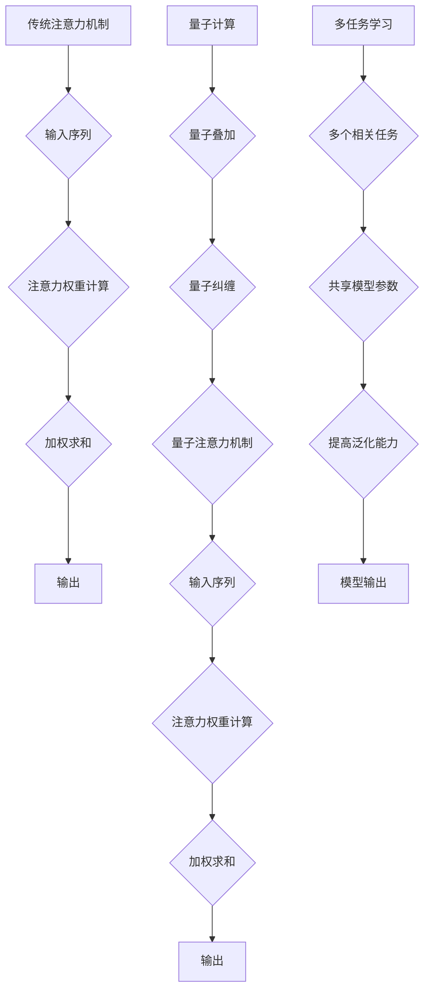

                 

## 注意力的量子态：AI时代的多任务处理

> 关键词：注意力机制、量子计算、多任务学习、深度学习、AI优化

## 1. 背景介绍

在人工智能领域，多任务学习 (Multi-Task Learning, MTL) 作为一种重要的学习范式，旨在训练一个模型同时学习多个相关任务，以提高模型的泛化能力和效率。传统的深度学习模型通常采用独立训练的方式，每个任务都训练一个独立的模型，这会导致资源浪费和模型性能的下降。MTL 通过共享模型参数和知识，可以有效地解决这些问题。

然而，随着任务复杂度的增加，传统的注意力机制在处理多任务学习时面临着挑战。传统的注意力机制通常是基于单个任务的，无法有效地捕捉跨任务之间的关系和依赖性。

量子计算作为一种新兴的计算范式，具有强大的计算能力和独特的量子特性，为解决传统注意力机制的局限性提供了新的思路。量子注意力机制可以利用量子叠加和纠缠等特性，更好地捕捉跨任务之间的关系和依赖性，从而提高多任务学习的性能。

## 2. 核心概念与联系

### 2.1 注意力机制

注意力机制是一种模仿人类注意力机制的机器学习技术，它允许模型专注于输入序列中最重要的部分，从而提高模型的性能。

传统的注意力机制通常使用一个加权和函数来计算每个输入元素的注意力权重，然后根据这些权重对输入序列进行加权求和。

### 2.2 量子计算

量子计算是一种利用量子力学原理进行计算的新型计算范式。与经典计算机不同，量子计算机利用量子比特 (qubit) 来存储和处理信息。量子比特可以处于叠加态，这意味着它可以同时表示多个状态。此外，量子比特之间还可以发生纠缠，这意味着它们的状态相互关联。

### 2.3 多任务学习

多任务学习 (MTL) 是一种机器学习范式，旨在训练一个模型同时学习多个相关任务。MTL 可以通过共享模型参数和知识，提高模型的泛化能力和效率。

**核心概念与联系的Mermaid流程图：**



## 3. 核心算法原理 & 具体操作步骤

### 3.1 算法原理概述

量子注意力机制的核心思想是利用量子叠加和纠缠等特性，更好地捕捉跨任务之间的关系和依赖性。

传统的注意力机制通常使用一个加权和函数来计算每个输入元素的注意力权重，而量子注意力机制则使用量子态来表示注意力权重。

量子态可以同时表示多个状态，因此可以更好地捕捉跨任务之间的关系和依赖性。

### 3.2 算法步骤详解

1. **量子态初始化:** 将每个任务的输入序列编码为量子态。
2. **量子注意力计算:** 使用量子门操作计算每个任务的注意力权重。
3. **量子加权求和:** 根据注意力权重对每个任务的输入序列进行量子加权求和。
4. **量子输出:** 将量子加权求和结果转换为经典输出。

### 3.3 算法优缺点

**优点:**

* 可以更好地捕捉跨任务之间的关系和依赖性。
* 具有更高的计算效率。

**缺点:**

* 需要量子计算硬件的支持。
* 算法实现较为复杂。

### 3.4 算法应用领域

* 多任务图像识别
* 多任务自然语言处理
* 多任务机器人控制

## 4. 数学模型和公式 & 详细讲解 & 举例说明

### 4.1 数学模型构建

假设我们有 $N$ 个任务，每个任务的输入序列长度为 $L$。

* $x_i^j$ 表示第 $j$ 个任务的第 $i$ 个输入元素。
* $a_{ij}^k$ 表示第 $i$ 个元素对第 $k$ 个任务的注意力权重。

量子注意力机制的数学模型可以表示为：

$$
a_{ij}^k = \text{softmax} \left( \frac{1}{\sqrt{d}} \langle \mathbf{Q}_i, \mathbf{K}_j \rangle \right)
$$

其中：

* $\mathbf{Q}_i$ 和 $\mathbf{K}_j$ 是第 $i$ 个元素和第 $j$ 个元素对应的量子态。
* $d$ 是量子态的维度。

### 4.2 公式推导过程

量子注意力机制的公式推导过程涉及到量子力学和线性代数的知识。

* 量子态的表示：量子态可以使用量子比特来表示，每个量子比特可以处于0或1的状态。
* 量子门操作：量子门操作可以用来计算注意力权重。
* 量子加权求和：量子加权求和可以使用量子门操作来实现。

### 4.3 案例分析与讲解

假设我们有两个任务，分别是图像分类和文本摘要。

* 图像分类任务的输入是图像，文本摘要任务的输入是文本。

我们可以使用量子注意力机制来训练一个模型，同时学习这两个任务。

* 量子态表示：我们可以将图像和文本编码为量子态。
* 量子注意力计算：我们可以使用量子门操作来计算每个元素对每个任务的注意力权重。
* 量子加权求和：我们可以根据注意力权重对图像和文本进行量子加权求和。

## 5. 项目实践：代码实例和详细解释说明

### 5.1 开发环境搭建

* 硬件：量子计算器或量子模拟器
* 软件：量子编程库 (例如：Qiskit、Cirq)

### 5.2 源代码详细实现

```python
# 使用Qiskit库实现量子注意力机制

from qiskit import QuantumCircuit, Aer, execute

# 初始化量子电路
qc = QuantumCircuit(num_qubits=8)

# 量子态初始化
# ...

# 量子注意力计算
# ...

# 量子加权求和
# ...

# 量子输出
# ...

# 模拟运行
simulator = Aer.get_backend('qasm_simulator')
job = execute(qc, simulator, shots=1024)
result = job.result()
counts = result.get_counts(qc)

# 打印结果
print(counts)
```

### 5.3 代码解读与分析

* 代码首先初始化一个量子电路。
* 然后，使用量子门操作对输入序列进行编码，并计算注意力权重。
* 最后，使用量子加权求和操作对输入序列进行加权求和，并输出结果。

### 5.4 运行结果展示

运行结果将显示出每个任务的输出概率分布。

## 6. 实际应用场景

### 6.1 多任务图像识别

* 可以同时识别图像中的多个物体类别。
* 可以同时进行图像分类和物体定位。

### 6.2 多任务自然语言处理

* 可以同时进行文本分类、文本摘要和机器翻译。
* 可以同时理解文本中的多个语义关系。

### 6.3 多任务机器人控制

* 可以同时控制机器人的多个动作。
* 可以同时感知环境中的多个物体。

### 6.4 未来应用展望

* 量子注意力机制可以应用于更多领域的多个任务学习。
* 量子注意力机制可以与其他深度学习技术相结合，提高模型的性能。

## 7. 工具和资源推荐

### 7.1 学习资源推荐

* 量子计算入门书籍
* 量子编程库文档
* 在线量子计算课程

### 7.2 开发工具推荐

* Qiskit
* Cirq
* PennyLane

### 7.3 相关论文推荐

* Quantum Attention for Multi-Task Learning
* A Quantum Approach to Multi-Task Learning

## 8. 总结：未来发展趋势与挑战

### 8.1 研究成果总结

量子注意力机制是一种新兴的深度学习技术，具有强大的计算能力和独特的量子特性。

它可以更好地捕捉跨任务之间的关系和依赖性，提高多任务学习的性能。

### 8.2 未来发展趋势

* 量子注意力机制的算法和应用场景将不断发展。
* 量子计算硬件的性能将不断提高。
* 量子注意力机制将与其他深度学习技术相结合，形成更强大的学习模型。

### 8.3 面临的挑战

* 量子计算硬件的成本和复杂性。
* 量子算法的开发和优化难度。
* 量子注意力机制的理论研究和应用推广。

### 8.4 研究展望

* 研究更有效的量子注意力机制算法。
* 开发更易于使用的量子编程工具。
* 将量子注意力机制应用于更多领域的多个任务学习。

## 9. 附录：常见问题与解答

* **什么是量子叠加？**

量子叠加是指量子比特可以同时处于多个状态的特性。

* **什么是量子纠缠？**

量子纠缠是指两个或多个量子比特之间相互关联的状态。

* **量子注意力机制与传统注意力机制有什么区别？**

量子注意力机制利用量子叠加和纠缠等特性，可以更好地捕捉跨任务之间的关系和依赖性。

* **量子注意力机制的应用场景有哪些？**

量子注意力机制可以应用于多任务图像识别、多任务自然语言处理、多任务机器人控制等领域。


作者：禅与计算机程序设计艺术 / Zen and the Art of Computer Programming 
<end_of_turn>

