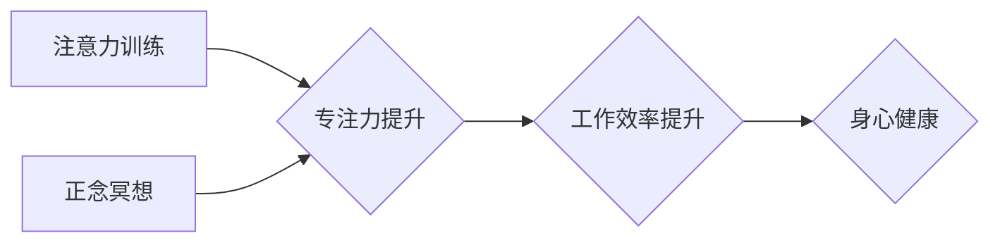

                 

## 1. 背景介绍

在当今信息爆炸的时代，我们面临着前所未有的信息洪流。来自手机、电脑、社交媒体的各种通知和信息不断地冲击着我们的注意力，导致专注力下降、思绪飘忽、难以静心工作和学习。这种注意力碎片化现象不仅影响着我们的工作效率和学习成果，也损害着我们的身心健康。

正念冥想作为一种古老的修行方式，近年来逐渐被现代社会所接受。它通过引导人们专注于当下，观察自己的呼吸、身体和情绪，从而培养专注力、提升情绪调节能力，最终达到身心和谐的目的。

对于程序员和IT从业者来说，注意力是至关重要的资源。他们需要长时间地专注于代码、问题分析和解决方案设计，才能高效地完成工作。然而，工作压力、代码复杂度和项目紧迫性等因素常常导致注意力分散，影响工作质量和效率。

因此，结合正念冥想和注意力训练，可以帮助IT从业者提升专注力、增强抗压能力，从而更好地应对工作挑战，提高工作效率和生活质量。

## 2. 核心概念与联系

### 2.1  注意力训练

注意力训练是指通过一系列的练习和技巧，增强人们对特定目标的关注能力，抑制无关信息的干扰，提高专注力。

### 2.2  正念冥想

正念冥想是一种专注于当下体验的冥想练习。它通过引导人们关注呼吸、身体感觉和情绪变化，培养觉察当下、不评判地观察的能力。

### 2.3  联系

注意力训练和正念冥想在原理上存在着密切的联系。

* **共同目标：** 两种方法都旨在提升人们的专注力，帮助他们更好地集中精力于当下。
* **共同机制：** 两种方法都通过训练大脑的注意力网络，增强对目标信息的关注，抑制对无关信息的干扰。
* **互补作用：** 注意力训练可以帮助人们提高专注力的技能，而正念冥想可以帮助人们培养专注力的基础，即觉察当下、不评判地观察的能力。

**Mermaid 流程图**



## 3. 核心算法原理 & 具体操作步骤

### 3.1  算法原理概述

注意力训练和正念冥想虽然没有明确的算法，但我们可以将其视为一种训练大脑神经网络的过程。通过反复的练习，大脑会逐渐形成新的神经连接，增强对目标信息的关注，抑制对无关信息的干扰。

### 3.2  算法步骤详解

**注意力训练步骤：**

1. **选择目标：** 确定需要训练的注意力类型，例如视觉注意力、听觉注意力、工作记忆等。
2. **选择练习方法：** 根据目标选择合适的注意力训练方法，例如视觉搜索、听觉辨别、工作记忆游戏等。
3. **进行练习：** 坚持每天进行注意力训练，逐渐增加练习时间和难度。
4. **评估效果：** 定期评估注意力训练的效果，根据实际情况调整练习方法和强度。

**正念冥想步骤：**

1. **找到安静的环境：** 选择一个安静、舒适的环境，减少外界干扰。
2. **采取舒适的姿势：** 找到一个舒适的坐姿或躺姿，放松身体。
3. **专注于呼吸：** 将注意力集中在呼吸上，观察呼吸的节奏和感受。
4. **觉察当下体验：** 不评判地观察自己的身体感觉、情绪变化和思绪流转。
5. **回归呼吸：** 当思绪飘忽时，轻轻地将注意力拉回呼吸上。
6. **坚持练习：** 每天坚持冥想一段时间，逐渐增加冥想时间。

### 3.3  算法优缺点

**注意力训练：**

* **优点：** 针对性强，可以针对不同的注意力类型进行训练；效果明显，可以有效提升专注力；操作简单，易于上手。
* **缺点：** 需要坚持练习，效果可能需要一段时间才能显现；训练方法种类有限，可能存在重复性。

**正念冥想：**

* **优点：** 能够提升整体的觉察力和情绪调节能力；对身心健康有益；操作简单，无需特殊设备。
* **缺点：** 效果可能需要较长时间才能显现；需要一定的耐心和毅力；可能难以在日常生活中长期坚持。

### 3.4  算法应用领域

注意力训练和正念冥想在以下领域都有广泛的应用：

* **教育：** 帮助学生提高专注力、学习效率和考试成绩。
* **医疗：** 治疗注意力缺陷多动障碍（ADHD）、焦虑症、抑郁症等心理疾病。
* **企业：** 提升员工的工作效率、创造力和团队合作能力。
* **个人成长：** 帮助人们更好地管理情绪、减轻压力、提升生活质量。

## 4. 数学模型和公式 & 详细讲解 & 举例说明

### 4.1  数学模型构建

注意力机制可以抽象为一个数学模型，其中输入是一个序列数据，例如文本或图像，输出是一个对每个元素的注意力权重。

**注意力权重计算公式：**

$$
\alpha_i = \frac{\exp(e_i)}{\sum_{j=1}^{n} \exp(e_j)}
$$

其中：

* $\alpha_i$ 是第 i 个元素的注意力权重。
* $e_i$ 是第 i 个元素的注意力得分。
* $n$ 是序列长度。

### 4.2  公式推导过程

注意力权重计算公式基于 softmax 函数，其目的是将注意力得分转换为一个概率分布，使得每个元素的注意力权重在 0 到 1 之间，且所有权重之和为 1。

**softmax 函数定义：**

$$
\text{softmax}(x_i) = \frac{e^{x_i}}{\sum_{j=1}^{n} e^{x_j}}
$$

其中：

* $x_i$ 是第 i 个元素的得分。

### 4.3  案例分析与讲解

**举例说明：**

假设我们有一个句子 "我爱学习编程"，要计算每个单词的注意力权重。我们可以使用一个词嵌入模型将每个单词映射到一个向量空间，然后计算每个单词与目标词向量的相似度作为注意力得分。

通过 softmax 函数，我们可以将注意力得分转换为一个概率分布，例如：

* "我" 的注意力权重为 0.1
* "爱" 的注意力权重为 0.2
* "学习" 的注意力权重为 0.3
* "编程" 的注意力权重为 0.4

这表明 "编程" 是句子中最相关的词，其次是 "学习"，然后是 "爱"，最后是 "我"。

## 5. 项目实践：代码实例和详细解释说明

### 5.1  开发环境搭建

* **操作系统：** Linux、macOS 或 Windows
* **编程语言：** Python
* **库依赖：** TensorFlow、Keras、NumPy 等

### 5.2  源代码详细实现

```python
import tensorflow as tf
from tensorflow.keras.models import Sequential
from tensorflow.keras.layers import Embedding, LSTM, Dense

# 数据预处理
# ...

# 模型构建
model = Sequential()
model.add(Embedding(input_dim=vocab_size, output_dim=embedding_dim))
model.add(LSTM(units=128))
model.add(Dense(units=1, activation='sigmoid'))

# 模型编译
model.compile(optimizer='adam', loss='binary_crossentropy', metrics=['accuracy'])

# 模型训练
model.fit(x_train, y_train, epochs=10, batch_size=32)

# 模型评估
loss, accuracy = model.evaluate(x_test, y_test)
print('Loss:', loss)
print('Accuracy:', accuracy)
```

### 5.3  代码解读与分析

* **Embedding 层：** 将单词映射到一个低维向量空间，捕捉单词之间的语义关系。
* **LSTM 层：** 用于处理序列数据，捕捉文本中的长距离依赖关系。
* **Dense 层：** 全连接层，用于输出注意力权重。
* **sigmoid 激活函数：** 将输出值压缩到 0 到 1 之间，表示注意力权重。

### 5.4  运行结果展示

* **训练过程：** 观察训练过程中的损失值和准确率的变化，判断模型的训练效果。
* **测试结果：** 评估模型在测试集上的性能，例如损失值、准确率等指标。

## 6. 实际应用场景

### 6.1  代码阅读与理解

注意力机制可以应用于代码阅读和理解，帮助程序员更好地理解代码结构、功能和逻辑。

### 6.2  代码生成与修复

注意力机制可以用于代码生成和修复，帮助程序员自动生成代码片段或修复代码错误。

### 6.3  软件测试与缺陷检测

注意力机制可以用于软件测试和缺陷检测，帮助程序员识别代码中的潜在缺陷和安全漏洞。

### 6.4  未来应用展望

注意力机制在软件开发领域还有很大的应用潜力，例如：

* **代码推荐：** 根据程序员的编程习惯和需求，推荐相关的代码片段或库。
* **代码文档自动生成：** 利用注意力机制自动生成代码文档，提高代码可读性和维护性。
* **代码风格检查：** 利用注意力机制识别代码风格问题，帮助程序员编写更规范的代码。

## 7. 工具和资源推荐

### 7.1  学习资源推荐

* **书籍：**
    * 《深度学习》
    * 《注意力机制》
* **在线课程：**
    * Coursera 上的深度学习课程
    * Udacity 上的自然语言处理课程

### 7.2  开发工具推荐

* **TensorFlow：** 一个开源的机器学习框架。
* **Keras：** 一个基于 TensorFlow 的高层深度学习 API。
* **PyTorch：** 另一个开源的机器学习框架。

### 7.3  相关论文推荐

* **Attention Is All You Need：** 这篇论文提出了 Transformer 模型，并首次将注意力机制应用于自然语言处理任务。
* **BERT：** 这篇论文提出了 BERT 模型，利用注意力机制和预训练技术，在自然语言理解任务上取得了突破性进展。

## 8. 总结：未来发展趋势与挑战

### 8.1  研究成果总结

注意力机制在计算机视觉、自然语言处理、语音识别等领域取得了显著的成果，并逐渐成为深度学习领域的重要组成部分。

### 8.2  未来发展趋势

* **更强大的注意力机制：** 研究人员将继续探索更强大的注意力机制，例如自注意力、多头注意力、可学习注意力等。
* **注意力机制的应用扩展：** 注意力机制将应用于更多领域，例如推荐系统、机器人控制、药物发现等。
* **注意力机制的理论解释：** 研究人员将继续深入研究注意力机制的理论基础，例如注意力机制的生物学机制、注意力机制的认知心理学基础等。

### 8.3  面临的挑战

* **计算复杂度：** 一些注意力机制的计算复杂度较高，难以在资源有限的设备上运行。
* **可解释性：** 注意力机制的决策过程往往难以解释，这限制了其在一些安全关键应用中的应用。
* **数据依赖性：** 注意力机制的性能依赖于训练数据的质量和数量，缺乏高质量数据的应用场景可能会受到限制。

### 8.4  研究展望

未来，注意力机制的研究将更加注重以下几个方面：

* **高效的注意力机制：** 研究更轻量级、更高效的注意力机制，降低计算复杂度。
* **可解释的注意力机制：** 研究可解释的注意力机制，提高其决策过程的可理解性。
* **泛化能力强的注意力机制：** 研究能够泛化到不同领域的注意力机制，提高其应用范围。

## 9. 附录：常见问题与解答

### 9.1  Q1：注意力机制和深度学习的关系是什么？

**A1：** 注意力机制是一种深度学习中的重要技术，它可以帮助模型更好地关注输入数据中的重要信息，从而提高模型的性能。

### 9.2  Q2：注意力机制有哪些应用场景？

**A2：** 注意力机制在计算机视觉、自然语言处理、语音识别等领域都有广泛的应用，例如图像分类、文本摘要、机器翻译等。

### 9.3  Q3：如何选择合适的注意力机制？

**A3：** 选择合适的注意力机制需要根据具体的应用场景和数据特点进行选择。例如，对于文本数据，可以使用自注意力机制；对于图像数据，可以使用空间注意力机制。

### 9.4  Q4：注意力机制的未来发展趋势是什么？

**A4：** 未来，注意力机制的研究将更加注重高效性、可解释性和泛化能力。


作者：禅与计算机程序设计艺术 / Zen and the Art of Computer Programming 
<end_of_turn>

