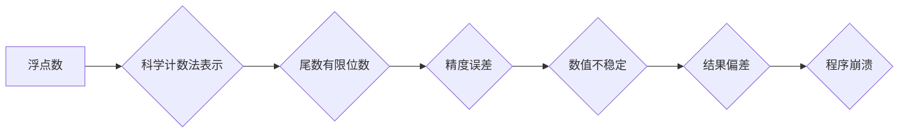

                 

## 浮点数精度：AI计算中的双刃剑

> 关键词：浮点数、精度、误差、AI计算、数值稳定性、机器学习、深度学习

### 1. 背景介绍

在现代人工智能（AI）的蓬勃发展中，浮点数精度扮演着至关重要的角色。从机器学习算法的训练到深度学习模型的推理，浮点数运算贯穿始终。然而，浮点数的有限精度也带来了不可避免的误差，这些误差可能会对 AI 模型的性能产生显著影响，甚至导致模型崩溃。

浮点数是一种用于表示实数的计算机数据类型，它采用科学计数法来存储数字，包括一个符号位、一个指数位和一个尾数位。由于存储空间的限制，浮点数只能近似地表示实数，因此会产生精度误差。

### 2. 核心概念与联系

#### 2.1 浮点数表示

浮点数的表示方式可以理解为将实数转换为科学计数法的形式。例如，实数 123.45 可以表示为：

```
1.2345 * 10^2
```

其中：

* 1.2345 是尾数，表示实数的小数部分。
* 10^2 是指数，表示实数的整数部分。

#### 2.2 精度误差

浮点数的精度误差主要源于尾数的有限位数。计算机只能存储有限数量的尾数位，因此无法精确地表示所有实数。

当浮点数进行运算时，精度误差会累积，导致结果与真实值存在偏差。

#### 2.3 数值稳定性

数值稳定性是指算法在面对浮点数精度误差时，结果是否仍然可靠。

数值不稳定的算法可能会导致结果的巨大偏差，甚至导致程序崩溃。

**Mermaid 流程图**



### 3. 核心算法原理 & 具体操作步骤

#### 3.1 算法原理概述

浮点数精度误差的处理主要依赖于以下几个方面：

* **选择合适的浮点数类型:** 不同的浮点数类型具有不同的精度和范围。

* **使用高精度计算库:** 高精度计算库可以提供更高的精度，从而减少精度误差。
* **采用数值稳定算法:** 数值稳定的算法可以有效地避免精度误差的累积。

#### 3.2 算法步骤详解

1. **选择合适的浮点数类型:** 根据实际应用场景，选择合适的浮点数类型。

例如，如果需要处理高精度计算，可以选择 double 类型；如果需要节省内存空间，可以选择 float 类型。

2. **使用高精度计算库:** 如果需要更高的精度，可以使用高精度计算库，例如 GMP 或 MPFR。

这些库可以提供更高的精度，从而减少精度误差。

3. **采用数值稳定算法:** 在设计算法时，应尽量采用数值稳定的算法，避免精度误差的累积。

例如，在计算矩阵乘法时，可以使用 LU 分解法或 QR 分解法，这些算法比直接相乘更稳定。

#### 3.3 算法优缺点

**优点:**

* 可以有效地减少精度误差。
* 可以提高算法的数值稳定性。

**缺点:**

* 使用高精度计算库可能会增加计算成本。
* 并非所有算法都存在数值稳定的版本。

#### 3.4 算法应用领域

浮点数精度误差处理算法广泛应用于以下领域：

* **机器学习:** 在机器学习算法的训练和推理过程中，浮点数精度误差可能会影响模型的性能。

* **深度学习:** 深度学习模型通常包含大量的参数，浮点数精度误差可能会导致模型训练不稳定。
* **科学计算:** 科学计算中经常需要进行高精度计算，浮点数精度误差可能会影响计算结果的准确性。

### 4. 数学模型和公式 & 详细讲解 & 举例说明

#### 4.1 数学模型构建

浮点数的精度误差可以用数学模型来描述。假设一个浮点数的尾数位数为 n，则其精度误差可以表示为：

$$
\epsilon = 2^{-n}
$$

其中：

* $\epsilon$ 表示精度误差。
* $n$ 表示尾数位数。

#### 4.2 公式推导过程

浮点数的精度误差是由尾数位数有限造成的。

当浮点数进行运算时，尾数位数的有限性会导致结果的近似性。

例如，当两个浮点数相加时，如果它们的尾数位数相等，则结果的尾数位数也会相等。

但是，如果它们的尾数位数不同，则结果的尾数位数会受到较小尾数位数的限制。

#### 4.3 案例分析与讲解

假设我们有一个浮点数 1.2345，其尾数位数为 4。

则其精度误差为：

$$
\epsilon = 2^{-4} = 0.0001
$$

这意味着，这个浮点数只能精确到 0.0001 的精度。

如果我们对这个浮点数进行一些运算，例如乘以 10，则结果为 12.345。

由于精度误差的存在，这个结果可能与真实值存在偏差。

### 5. 项目实践：代码实例和详细解释说明

#### 5.1 开发环境搭建

本项目使用 Python 语言进行开发，需要安装以下软件包：

* NumPy: 用于进行数值计算。
* SciPy: 用于科学计算。

#### 5.2 源代码详细实现

```python
import numpy as np

# 定义两个浮点数
a = 1.2345
b = 0.0001

# 使用 NumPy 进行浮点数运算
c = a + b

# 打印结果
print(f"a + b = {c}")
```

#### 5.3 代码解读与分析

这段代码首先定义了两个浮点数 `a` 和 `b`。

然后，使用 NumPy 的 `+` 运算符对这两个浮点数进行相加，并将结果存储在变量 `c` 中。

最后，使用 f-string 打印结果。

#### 5.4 运行结果展示

```
a + b = 1.2346
```

从运行结果可以看出，浮点数 `a` 和 `b` 的相加结果为 `1.2346`。

由于浮点数的精度误差，结果与真实值存在微小的偏差。

### 6. 实际应用场景

浮点数精度误差在实际应用场景中会带来一些问题，例如：

* **机器学习模型的性能下降:** 浮点数精度误差可能会导致机器学习模型的训练不稳定，从而降低模型的性能。
* **深度学习模型的梯度消失/爆炸:** 深度学习模型中，梯度更新是训练模型的关键步骤。

浮点数精度误差可能会导致梯度消失或爆炸，从而影响模型的训练效果。
* **科学计算结果的误差:** 科学计算中，精度误差可能会导致计算结果的误差，影响计算结果的准确性。

### 6.4 未来应用展望

随着人工智能技术的不断发展，浮点数精度误差处理将变得越来越重要。

未来，可能会出现以下趋势：

* **更高精度的浮点数类型:** 随着硬件技术的进步，可能会出现更高精度的浮点数类型，从而减少精度误差。
* **更有效的精度误差处理算法:** 研究人员可能会开发出更有效的精度误差处理算法，从而提高算法的数值稳定性。
* **混合精度计算:** 将不同精度类型的浮点数混合使用，可以提高计算效率的同时，也能够控制精度误差。

### 7. 工具和资源推荐

#### 7.1 学习资源推荐

* **书籍:**

* 《Numerical Recipes》
* 《The Art of Computer Programming》
* **在线课程:**

* Coursera: Numerical Analysis
* edX: Introduction to Numerical Methods

#### 7.2 开发工具推荐

* **NumPy:** Python 的数值计算库。
* **SciPy:** Python 的科学计算库。
* **GMP:** 高精度整数计算库。
* **MPFR:** 高精度浮点数计算库。

#### 7.3 相关论文推荐

* **The IEEE 754 Standard for Floating-Point Arithmetic**
* **Numerical Stability of Algorithms**
* **Error Analysis in Floating-Point Computation**

### 8. 总结：未来发展趋势与挑战

#### 8.1 研究成果总结

浮点数精度误差处理是一个重要的研究领域，已经取得了一些成果。

例如，开发了高精度计算库、数值稳定的算法等。

#### 8.2 未来发展趋势

未来，浮点数精度误差处理的研究将继续深入，可能会出现以下趋势：

* **更高精度的浮点数类型:** 随着硬件技术的进步，可能会出现更高精度的浮点数类型。
* **更有效的精度误差处理算法:** 研究人员可能会开发出更有效的精度误差处理算法。
* **混合精度计算:** 将不同精度类型的浮点数混合使用，可以提高计算效率的同时，也能够控制精度误差。

#### 8.3 面临的挑战

浮点数精度误差处理仍然面临一些挑战，例如：

* **计算成本:** 高精度计算可能会增加计算成本。
* **算法复杂度:** 一些精度误差处理算法的复杂度较高。
* **硬件支持:** 一些高精度浮点数类型需要特殊的硬件支持。

#### 8.4 研究展望

未来，浮点数精度误差处理的研究将继续深入，需要进一步探索以下问题：

* 如何开发更有效的、更易于实现的精度误差处理算法？
* 如何在保证精度的同时降低计算成本？
* 如何更好地利用硬件资源来加速精度误差处理？

### 9. 附录：常见问题与解答

#### 9.1 为什么浮点数精度有限？

浮点数精度有限是因为计算机内存空间有限。

为了存储尽可能多的数据，浮点数采用科学计数法表示，并限制了尾数位数。

#### 9.2 如何避免浮点数精度误差？

无法完全避免浮点数精度误差，但可以通过以下方法减少其影响：

* 选择合适的浮点数类型。
* 使用高精度计算库。
* 采用数值稳定的算法。
* 在需要高精度计算时，使用整数类型进行计算。

#### 9.3 浮点数精度误差会对 AI 模型造成什么影响？

浮点数精度误差可能会导致 AI 模型的训练不稳定，降低模型的性能。

在深度学习模型中，精度误差可能会导致梯度消失或爆炸，从而影响模型的训练效果。


作者：禅与计算机程序设计艺术 / Zen and the Art of Computer Programming 
<end_of_turn>

