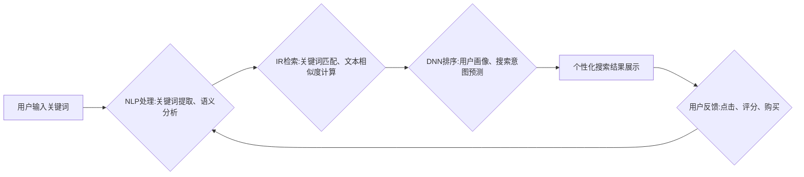

                 

## 深度学习在电商搜索引擎优化中的应用

> 关键词：深度学习、电商搜索引擎、推荐系统、自然语言处理、信息检索、用户行为分析、个性化搜索

## 1. 背景介绍

电子商务的蓬勃发展催生了对高效、精准的搜索引擎的需求。传统的基于关键词匹配的搜索引擎在处理用户复杂的需求时往往表现不足，难以提供个性化、相关的搜索结果。深度学习作为一种强大的机器学习技术，凭借其强大的特征提取和模式识别能力，为电商搜索引擎的优化带来了新的机遇。

深度学习在电商搜索引擎优化中的应用主要体现在以下几个方面：

* **商品理解和分类:** 深度学习可以用于理解商品的语义信息，例如商品名称、描述、属性等，并将其进行自动分类和标签化，提高商品检索的准确性。
* **用户行为分析:** 深度学习可以分析用户的搜索历史、浏览记录、购买行为等数据，构建用户画像，并预测用户的搜索意图，从而提供更精准的个性化推荐。
* **搜索结果排序:** 深度学习可以学习用户偏好和搜索意图，对搜索结果进行排序，提升用户体验。
* **广告推荐:** 深度学习可以分析用户兴趣和行为，推荐更相关的广告，提高广告点击率和转化率。

## 2. 核心概念与联系

电商搜索引擎优化涉及多个深度学习核心概念，包括：

* **自然语言处理 (NLP):** 用于理解和处理人类语言，例如文本分类、关键词提取、语义分析等。
* **信息检索 (IR):** 用于从海量数据中检索相关信息，例如关键词匹配、文本相似度计算等。
* **推荐系统:** 用于根据用户的历史行为和偏好，推荐相关的商品或服务。
* **深度神经网络 (DNN):** 用于学习复杂数据模式，例如卷积神经网络 (CNN)、循环神经网络 (RNN) 等。

这些概念相互关联，共同构建起电商搜索引擎的优化体系。

**核心架构流程图:**



## 3. 核心算法原理 & 具体操作步骤

### 3.1  算法原理概述

深度学习在电商搜索引擎优化中常用的算法包括：

* **卷积神经网络 (CNN):** 用于提取商品图像和文本特征，例如商品类别、品牌、颜色等。
* **循环神经网络 (RNN):** 用于处理用户搜索历史和浏览记录，学习用户的搜索模式和偏好。
* **深度信念网络 (DBN):** 用于降维和特征提取，提高搜索效率。
* **Transformer:** 用于处理长文本序列，例如商品描述和用户评论，提升语义理解能力。

这些算法通过多层神经网络结构，学习数据中的复杂模式和关系，从而实现商品理解、用户行为分析、搜索结果排序等功能。

### 3.2  算法步骤详解

以 CNN 算法为例，其在电商搜索引擎优化中的具体操作步骤如下：

1. **数据预处理:** 将商品图像和文本数据进行预处理，例如图像裁剪、文本分词、词向量化等。
2. **特征提取:** 使用 CNN 提取商品图像和文本特征，例如边缘、纹理、关键词等。
3. **特征融合:** 将提取的图像和文本特征进行融合，形成商品的综合特征向量。
4. **分类和排序:** 使用分类器或排序模型，根据商品的特征向量进行分类或排序，例如商品类别预测、搜索结果排名等。

### 3.3  算法优缺点

**优点:**

* 能够学习复杂数据模式，提高搜索结果的准确性和相关性。
* 可以处理多种数据类型，例如图像、文本、用户行为等。
* 具有良好的泛化能力，可以应用于不同的电商平台和场景。

**缺点:**

* 需要大量的训练数据，训练成本较高。
* 模型训练时间较长，部署和维护成本较高。
* 对数据质量要求较高，数据噪声和偏差会影响模型性能。

### 3.4  算法应用领域

深度学习算法在电商搜索引擎优化中的应用领域广泛，包括：

* 商品搜索
* 商品推荐
* 广告推荐
* 用户画像构建
* 搜索结果个性化

## 4. 数学模型和公式 & 详细讲解 & 举例说明

### 4.1  数学模型构建

深度学习模型通常采用多层神经网络结构，每个神经元接收多个输入信号，并通过激活函数进行处理，输出一个信号。神经网络的训练过程是通过调整神经元的权重和偏差，使得模型输出与真实值之间的误差最小化。

**举例:**

一个简单的 CNN 模型可以由卷积层、池化层和全连接层组成。卷积层用于提取图像特征，池化层用于降维，全连接层用于分类或回归。

### 4.2  公式推导过程

深度学习模型的训练过程通常使用梯度下降算法，其核心公式为：

$$
\theta = \theta - \alpha \nabla L(\theta)
$$

其中：

* $\theta$ 是模型参数，例如神经元的权重和偏差。
* $\alpha$ 是学习率，控制参数更新的步长。
* $L(\theta)$ 是损失函数，衡量模型预测值与真实值之间的误差。
* $\nabla L(\theta)$ 是损失函数的梯度，指明参数更新的方向。

### 4.3  案例分析与讲解

以商品分类为例，假设我们使用 CNN 模型进行商品分类，训练数据包含商品图像和对应的类别标签。

训练过程中，模型会学习图像特征，并将其映射到类别空间。损失函数通常使用交叉熵损失，衡量模型预测类别与真实类别的差异。梯度下降算法会根据损失函数的梯度，调整模型参数，使得模型预测结果与真实类别越来越接近。

## 5. 项目实践：代码实例和详细解释说明

### 5.1  开发环境搭建

* Python 3.x
* TensorFlow 或 PyTorch 深度学习框架
* CUDA 和 cuDNN (可选，用于 GPU 加速)

### 5.2  源代码详细实现

以下是一个简单的 CNN 模型的代码示例，使用 TensorFlow 框架实现商品分类任务：

```python
import tensorflow as tf

# 定义 CNN 模型
model = tf.keras.models.Sequential([
    tf.keras.layers.Conv2D(32, (3, 3), activation='relu', input_shape=(224, 224, 3)),
    tf.keras.layers.MaxPooling2D((2, 2)),
    tf.keras.layers.Conv2D(64, (3, 3), activation='relu'),
    tf.keras.layers.MaxPooling2D((2, 2)),
    tf.keras.layers.Flatten(),
    tf.keras.layers.Dense(10, activation='softmax')
])

# 编译模型
model.compile(optimizer='adam',
              loss='sparse_categorical_crossentropy',
              metrics=['accuracy'])

# 训练模型
model.fit(x_train, y_train, epochs=10)

# 评估模型
loss, accuracy = model.evaluate(x_test, y_test)
print('Test Loss:', loss)
print('Test Accuracy:', accuracy)
```

### 5.3  代码解读与分析

* 模型定义: 使用 `tf.keras.models.Sequential` 创建一个顺序模型，包含卷积层、池化层和全连接层。
* 编译模型: 使用 `adam` 优化器、`sparse_categorical_crossentropy` 损失函数和 `accuracy` 评价指标编译模型。
* 训练模型: 使用 `model.fit` 函数训练模型，输入训练数据 `x_train` 和标签 `y_train`，训练 10 个 epochs。
* 评估模型: 使用 `model.evaluate` 函数评估模型，输入测试数据 `x_test` 和标签 `y_test`，输出测试损失和准确率。

### 5.4  运行结果展示

训练完成后，可以查看模型的测试损失和准确率，评估模型的性能。

## 6. 实际应用场景

深度学习在电商搜索引擎优化中的应用场景广泛，例如：

* **淘宝:** 使用深度学习算法进行商品搜索、推荐和广告投放，提升用户体验和转化率。
* **京东:** 利用深度学习技术分析用户行为，个性化推荐商品和服务。
* **亚马逊:** 使用深度学习模型进行商品分类、图像识别和语音搜索，提供更精准的搜索结果。

### 6.4  未来应用展望

未来，深度学习在电商搜索引擎优化中的应用将更加深入和广泛，例如：

* **多模态搜索:** 将图像、文本、语音等多种数据类型融合，实现更全面的商品搜索。
* **个性化推荐:** 基于用户的兴趣、行为和偏好，提供更精准的商品推荐。
* **智能客服:** 使用深度学习技术构建智能客服系统，自动回答用户问题，提升客户服务效率。

## 7. 工具和资源推荐

### 7.1  学习资源推荐

* **书籍:**
    * 深度学习
    * 自然语言处理
* **在线课程:**
    * Coursera 深度学习课程
    * Udacity 自然语言处理课程

### 7.2  开发工具推荐

* **TensorFlow:** 开源深度学习框架
* **PyTorch:** 开源深度学习框架
* **Keras:** 高级深度学习 API

### 7.3  相关论文推荐

* **Attention Is All You Need:** https://arxiv.org/abs/1706.03762
* **BERT: Pre-training of Deep Bidirectional Transformers for Language Understanding:** https://arxiv.org/abs/1810.04805

## 8. 总结：未来发展趋势与挑战

### 8.1  研究成果总结

深度学习在电商搜索引擎优化领域取得了显著成果，例如提高了搜索结果的准确性和相关性，提升了用户体验和转化率。

### 8.2  未来发展趋势

未来，深度学习在电商搜索引擎优化领域将继续发展，主要趋势包括：

* **多模态搜索:** 将图像、文本、语音等多种数据类型融合，实现更全面的商品搜索。
* **个性化推荐:** 基于用户的兴趣、行为和偏好，提供更精准的商品推荐。
* **智能客服:** 使用深度学习技术构建智能客服系统，自动回答用户问题，提升客户服务效率。

### 8.3  面临的挑战

深度学习在电商搜索引擎优化领域也面临一些挑战，例如：

* **数据质量:** 深度学习模型对数据质量要求较高，数据噪声和偏差会影响模型性能。
* **计算资源:** 训练深度学习模型需要大量的计算资源，成本较高。
* **模型解释性:** 深度学习模型的决策过程难以解释，这可能会导致模型的不可信赖性。

### 8.4  研究展望

未来研究方向包括：

* **开发更鲁棒的深度学习模型:** 提高模型对数据噪声和偏差的鲁棒性。
* **降低深度学习模型的训练成本:** 开发更有效的训练算法和硬件架构。
* **提高深度学习模型的解释性:** 研究可解释的深度学习模型，提高模型的可信赖性。

## 9. 附录：常见问题与解答

**Q1: 深度学习模型的训练需要多少数据？**

A1: 深度学习模型的训练数据量取决于模型复杂度和任务难度。一般来说，需要至少几千到几百万个样本才能训练出一个有效的模型。

**Q2: 深度学习模型的训练时间有多长？**

A2: 深度学习模型的训练时间取决于模型复杂度、数据量和硬件资源。训练一个简单的模型可能只需要几小时，而训练一个复杂的模型可能需要几天甚至几周。

**Q3: 如何评估深度学习模型的性能？**

A3: 深度学习模型的性能通常使用准确率、召回率、F1-score等指标进行评估。

**Q4: 如何部署深度学习模型？**

A4: 深度学习模型可以部署到云服务器、边缘设备或移动设备上。

**Q5: 深度学习模型的维护成本如何？**

A5: 深度学习模型的维护成本包括模型更新、数据更新和硬件维护等。


作者：禅与计算机程序设计艺术 / Zen and the Art of Computer Programming 
<end_of_turn>

