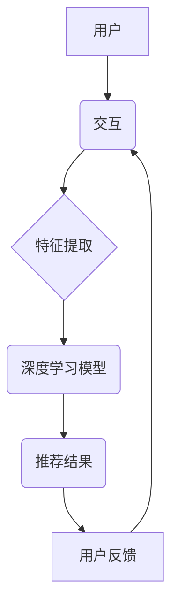

                 

## 深度学习技术在搜索推荐系统的应用：AI 大模型是核心引擎

> 关键词：深度学习、搜索推荐、AI大模型、Transformer、BERT、推荐算法、个性化推荐、自然语言处理

## 1. 背景介绍

在信息爆炸的时代，海量数据和用户需求的个性化日益突出，搜索推荐系统作为连接用户和信息的桥梁，承担着越来越重要的责任。传统的基于规则和特征工程的推荐算法逐渐难以满足用户日益复杂的需求。深度学习技术的兴起为搜索推荐系统带来了新的机遇，其强大的学习能力和泛化能力能够从海量数据中挖掘出更精准、更个性化的推荐结果。

深度学习在搜索推荐系统中的应用主要体现在以下几个方面：

* **个性化推荐:** 深度学习模型能够学习用户的兴趣偏好、行为模式等信息，并根据这些信息为用户提供个性化的推荐结果。
* **内容理解:** 深度学习模型能够理解文本、图像、视频等多种类型的用户数据，从而更好地理解用户的需求和意图。
* **搜索结果排序:** 深度学习模型能够学习用户点击、停留、转化等行为数据，并根据这些数据对搜索结果进行排序，提升用户体验。
* **推荐多样性:** 深度学习模型能够学习用户偏好的多样性，并推荐不同类型的商品或内容，避免推荐结果过于单一。

## 2. 核心概念与联系

搜索推荐系统本质上是一个信息匹配系统，它需要根据用户的查询或行为，从海量商品或内容库中找到最相关的推荐结果。深度学习模型作为核心引擎，通过学习用户和物品之间的关系，实现精准的推荐。

**2.1  核心概念**

* **用户:** 搜索推荐系统的最终目标用户，其行为和偏好是模型学习的对象。
* **物品:** 需要被推荐的对象，例如商品、文章、视频等。
* **交互:** 用户与物品之间的互动行为，例如点击、浏览、购买等。
* **特征:** 描述用户和物品的属性，例如用户年龄、性别、购买历史、物品价格、类别等。
* **模型:** 深度学习模型，用于学习用户和物品之间的关系，并预测用户对物品的兴趣。

**2.2  架构图**



**2.3  联系**

深度学习模型通过学习用户和物品之间的关系，实现精准的推荐。用户行为和物品特征作为模型的输入，模型输出推荐结果，用户反馈则作为模型训练的依据，形成一个闭环。

## 3. 核心算法原理 & 具体操作步骤

### 3.1  算法原理概述

深度学习在搜索推荐系统中的应用主要基于以下几种算法：

* **协同过滤:** 基于用户的历史行为和物品的相似性，预测用户对物品的兴趣。
* **内容过滤:** 基于物品的特征和用户的偏好，推荐用户可能感兴趣的物品。
* **混合推荐:** 结合协同过滤和内容过滤的优点，实现更精准的推荐。
* **深度神经网络:** 利用多层神经网络，学习用户和物品之间的复杂关系，实现更个性化的推荐。

### 3.2  算法步骤详解

以深度神经网络为例，其推荐算法步骤如下：

1. **数据预处理:** 收集用户行为数据和物品特征数据，并进行清洗、转换、编码等预处理操作。
2. **模型构建:** 选择合适的深度神经网络架构，例如多层感知机 (MLP)、卷积神经网络 (CNN) 或循环神经网络 (RNN)。
3. **模型训练:** 使用训练数据训练模型，优化模型参数，使模型能够准确预测用户对物品的兴趣。
4. **模型评估:** 使用测试数据评估模型的性能，例如准确率、召回率、NDCG 等指标。
5. **模型部署:** 将训练好的模型部署到生产环境中，实时为用户提供推荐结果。

### 3.3  算法优缺点

**优点:**

* 能够学习用户和物品之间的复杂关系，实现更精准的推荐。
* 能够处理海量数据，并自动提取特征，降低人工特征工程的成本。
* 能够不断学习和更新，随着用户行为和物品特征的变化，模型的推荐效果也会不断提升。

**缺点:**

* 需要大量的训练数据，否则模型的性能会下降。
* 模型训练时间较长，需要强大的计算资源。
* 模型解释性较差，难以理解模型是如何做出推荐的。

### 3.4  算法应用领域

深度学习算法在搜索推荐系统中的应用非常广泛，例如：

* **电商推荐:** 推荐商品、优惠券、促销活动等。
* **内容推荐:** 推荐文章、视频、音乐、图片等。
* **社交推荐:** 推荐好友、群组、活动等。
* **新闻推荐:** 推荐新闻、博客、论坛等。

## 4. 数学模型和公式 & 详细讲解 & 举例说明

### 4.1  数学模型构建

深度学习模型的数学模型通常基于神经网络，其核心是通过多层神经元进行信息传递和处理，学习用户和物品之间的关系。

**4.1.1  感知机模型:**

感知机模型是最基本的深度学习模型，其数学模型如下：

$$
y = f(w^T x + b)
$$

其中：

* $y$ 是模型输出，表示用户对物品的兴趣评分。
* $x$ 是用户和物品的特征向量。
* $w$ 是模型参数，权重向量。
* $b$ 是模型参数，偏置项。
* $f$ 是激活函数，例如 sigmoid 函数或 ReLU 函数。

**4.1.2  多层感知机 (MLP) 模型:**

MLP 模型是感知机模型的扩展，它包含多层神经元，能够学习更复杂的非线性关系。

**4.1.3  卷积神经网络 (CNN) 模型:**

CNN 模型擅长处理图像数据，其核心是卷积层和池化层，能够提取图像的特征。

**4.1.4  循环神经网络 (RNN) 模型:**

RNN 模型擅长处理序列数据，例如文本数据，其核心是循环连接，能够捕捉序列中的时间依赖关系。

### 4.2  公式推导过程

深度学习模型的训练过程是通过优化模型参数，使模型输出与真实值之间的误差最小化。常用的优化算法包括梯度下降法、Adam 算法等。

**4.2.1  梯度下降法:**

梯度下降法是一种迭代优化算法，其核心思想是沿着梯度的负方向更新模型参数，逐步逼近最优解。

**4.2.2  Adam 算法:**

Adam 算法是一种自适应学习率的优化算法，它结合了梯度下降法和动量法，能够更快地收敛到最优解。

### 4.3  案例分析与讲解

以电影推荐为例，可以使用深度学习模型学习用户和电影之间的关系，并预测用户对电影的兴趣评分。

**4.3.1  数据:**

* 用户数据：用户 ID、年龄、性别、观看历史等。
* 电影数据：电影 ID、类型、导演、演员、评分等。
* 用户-电影交互数据：用户对电影的评分、观看时间等。

**4.3.2  模型:**

可以使用多层感知机 (MLP) 模型或协同过滤模型进行电影推荐。

**4.3.3  训练:**

使用用户-电影交互数据训练模型，优化模型参数，使模型能够准确预测用户对电影的兴趣评分。

**4.3.4  推荐:**

根据用户的特征和历史行为，模型可以预测用户对不同电影的兴趣评分，并推荐用户可能感兴趣的电影。

## 5. 项目实践：代码实例和详细解释说明

### 5.1  开发环境搭建

* Python 3.x
* TensorFlow 或 PyTorch 深度学习框架
* Jupyter Notebook 或 VS Code 代码编辑器

### 5.2  源代码详细实现

```python
import tensorflow as tf

# 定义模型结构
model = tf.keras.Sequential([
    tf.keras.layers.Dense(64, activation='relu', input_shape=(10,)),
    tf.keras.layers.Dense(32, activation='relu'),
    tf.keras.layers.Dense(1)
])

# 编译模型
model.compile(optimizer='adam', loss='mse')

# 训练模型
model.fit(X_train, y_train, epochs=10)

# 预测结果
predictions = model.predict(X_test)
```

### 5.3  代码解读与分析

* **模型结构:** 代码定义了一个简单的多层感知机 (MLP) 模型，包含三个全连接层，第一层输入维度为 10，最后一层输出维度为 1。
* **激活函数:** 使用 ReLU 激活函数，能够提高模型的表达能力。
* **优化器:** 使用 Adam 优化器，能够更快地收敛到最优解。
* **损失函数:** 使用均方误差 (MSE) 损失函数，用于衡量模型预测结果与真实值的误差。
* **训练过程:** 使用训练数据训练模型，迭代 10 次。
* **预测过程:** 使用测试数据预测模型输出，并进行评估。

### 5.4  运行结果展示

运行代码后，可以得到模型的训练曲线和预测结果，并评估模型的性能。

## 6. 实际应用场景

深度学习技术在搜索推荐系统中的应用非常广泛，例如：

* **电商推荐:** 淘宝、京东等电商平台使用深度学习模型推荐商品、优惠券、促销活动等。
* **内容推荐:** 知乎、豆瓣等平台使用深度学习模型推荐文章、视频、音乐、图片等。
* **社交推荐:** Facebook、Twitter 等社交平台使用深度学习模型推荐好友、群组、活动等。
* **新闻推荐:** 新浪、今日头条等新闻平台使用深度学习模型推荐新闻、博客、论坛等。

### 6.4  未来应用展望

随着深度学习技术的不断发展，搜索推荐系统将更加智能化、个性化和精准化。

* **多模态推荐:** 将文本、图像、视频等多种模态数据融合，实现更全面的用户理解和推荐。
* **个性化解释:** 为用户提供推荐结果的解释，帮助用户理解模型是如何做出推荐的。
* **实时推荐:** 基于用户的实时行为，提供更及时、更精准的推荐。
* **联邦学习:** 保护用户隐私，实现分布式训练和推荐。

## 7. 工具和资源推荐

### 7.1  学习资源推荐

* **书籍:**
    * Deep Learning by Ian Goodfellow, Yoshua Bengio, and Aaron Courville
    * Hands-On Machine Learning with Scikit-Learn, Keras & TensorFlow by Aurélien Géron
* **在线课程:**
    * TensorFlow 官方教程
    * PyTorch 官方教程
    * Coursera 深度学习课程

### 7.2  开发工具推荐

* **深度学习框架:** TensorFlow, PyTorch, Keras
* **数据处理工具:** Pandas, NumPy
* **可视化工具:** Matplotlib, Seaborn

### 7.3  相关论文推荐

* Attention Is All You Need (Vaswani et al., 2017)
* BERT: Pre-training of Deep Bidirectional Transformers for Language Understanding (Devlin et al., 2018)
* Deep Learning for Recommender Systems (Rendle et al., 2018)

## 8. 总结：未来发展趋势与挑战

### 8.1  研究成果总结

深度学习技术在搜索推荐系统中的应用取得了显著成果，能够实现更精准、更个性化的推荐，提升用户体验。

### 8.2  未来发展趋势

* **多模态推荐:** 将文本、图像、视频等多种模态数据融合，实现更全面的用户理解和推荐。
* **个性化解释:** 为用户提供推荐结果的解释，帮助用户理解模型是如何做出推荐的。
* **实时推荐:** 基于用户的实时行为，提供更及时、更精准的推荐。
* **联邦学习:** 保护用户隐私，实现分布式训练和推荐。

### 8.3  面临的挑战

* **数据稀疏性:** 部分用户或物品的交互数据较少，难以训练出准确的模型。
* **冷启动问题:** 新用户或新物品难以获得推荐，需要新的算法和策略解决。
* **模型解释性:** 深度学习模型的决策过程难以解释，需要开发新的方法提高模型的透明度。
* **公平性与偏见:** 深度学习模型可能存在公平性问题，需要开发新的方法保证推荐结果的公平性。

### 8.4  研究展望

未来，搜索推荐系统将朝着更智能化、更个性化、更公平的方向发展，深度学习技术将继续发挥核心作用。


## 9. 附录：常见问题与解答

* **Q1: 深度学习模型训练需要多少数据？**

* **A1:** 深度学习模型的训练数据量取决于模型复杂度和任务难度。一般来说，需要至少几千条数据才能训练出较好的模型。

* **Q2: 深度学习模型的训练时间很长吗？**

* **A2:** 深度学习模型的训练时间取决于模型复杂度、数据量和硬件资源。训练大型模型可能需要几天甚至几周的时间。

* **Q3: 如何评估深度学习模型的性能？**

* **A3:** 常用的评估指标包括准确率、召回率、NDCG 等。

* **Q4: 如何解决深度学习模型的冷启动问题？**

* **A4:** 可以使用一些冷启动策略，例如基于内容过滤、基于协同过滤、基于知识图谱等。

* **Q5: 如何保证深度学习模型的公平性？**

* **A5:** 可以使用一些公平性算法和策略，例如对抗训练、正则化等。


作者：禅与计算机程序设计艺术 / Zen and the Art of Computer Programming 
<end_of_turn>

