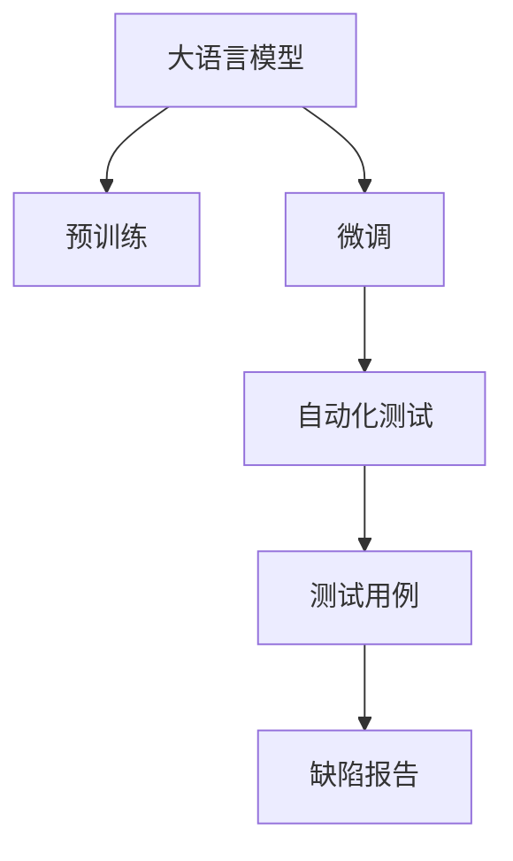

                 

## 1. 背景介绍

### 1.1 问题由来

随着人工智能(AI)技术的飞速发展，大语言模型(LLM)在自然语言处理(NLP)、计算机视觉(CV)等多个领域展现了强大的能力。LLM不仅能够理解、生成和分析语言，还能够执行复杂的逻辑推理和决策。在软件测试领域，LLM的出现为传统软件测试注入了新的思路和方法，提出了更高的要求和挑战。

传统的软件测试主要是通过手工编写测试用例和自动化测试脚本来覆盖软件的各种功能点。然而，这种依赖人工经验的测试方式在应对复杂多变的软件需求时显得力不从心。而LLM的出现，为软件测试带来了革命性的变化，它能够自动化生成测试用例，提高测试效率，降低测试成本，同时也能检测出更多潜在的缺陷，提升软件的质量和可靠性。

### 1.2 问题核心关键点

在基于LLM的软件测试范式中，核心关键点包括：

- 自动化测试用例生成：LLM能够根据软件需求和设计文档，自动生成覆盖更多场景和边界条件的测试用例。
- 语义理解与推理：LLM具备强大的语义理解能力，能够准确理解软件的逻辑和语义，从而设计出更具针对性的测试场景。
- 缺陷检测与定位：LLM能够通过执行测试用例，发现软件中的缺陷，并提供详细的分析报告，帮助开发人员快速定位和修复问题。
- 智能测试数据分析：LLM可以处理和分析大量的测试数据，发现测试覆盖率、缺陷密度等关键指标，优化测试策略和流程。

这些关键点共同构成了LLM在软件测试中的应用框架，使其能够显著提升测试效率和效果。

## 2. 核心概念与联系

### 2.1 核心概念概述

为更好地理解LLM在软件测试中的应用，本节将介绍几个密切相关的核心概念：

- 大语言模型(LLM)：以自回归(如GPT)或自编码(如BERT)模型为代表的大规模预训练语言模型。通过在大规模无标签文本语料上进行预训练，学习通用的语言表示，具备强大的语言理解和生成能力。
- 预训练(Pre-training)：指在大规模无标签文本语料上，通过自监督学习任务训练通用语言模型的过程。常见的预训练任务包括言语建模、遮挡语言模型等。
- 微调(Fine-tuning)：指在预训练模型的基础上，使用下游任务的少量标注数据，通过有监督地训练来优化模型在特定任务上的性能。
- 测试用例(Test Case)：指为验证软件功能或性能而设计的一系列输入数据和预期输出结果，是软件测试的基础。
- 自动化测试(Automatic Testing)：指通过自动化工具和脚本，自动执行测试用例，减少人工干预，提高测试效率。
- 缺陷报告(Defect Report)：指在软件测试过程中发现的缺陷或问题的详细记录，通常包括缺陷编号、发现者、严重性、重现步骤等关键信息。

这些核心概念之间的逻辑关系可以通过以下Mermaid流程图来展示：



这个流程图展示了大语言模型的核心概念及其之间的关系：

1. 大语言模型通过预训练获得基础能力。
2. 微调是对预训练模型进行任务特定的优化，使其能够适应特定的测试场景。
3. 自动化测试利用微调后的模型自动生成和执行测试用例。
4. 测试用例执行后，通过缺陷报告记录发现的问题。

这些概念共同构成了基于LLM的软件测试框架，使其能够更好地适应软件测试的需求。

## 3. 核心算法原理 & 具体操作步骤
### 3.1 算法原理概述

基于LLM的软件测试方法，本质上是将LLM作为测试用例的生成工具，利用其强大的语义理解和推理能力，自动生成和执行测试用例，检测软件缺陷。

具体而言，假设预训练模型为 $M_{\theta}$，其中 $\theta$ 为预训练得到的模型参数。给定软件需求 $S$ 和设计文档 $D$，微调的目标是找到新的模型参数 $\hat{\theta}$，使得生成的测试用例能够全面覆盖软件的功能点，并检测出软件中的缺陷。

测试用例生成过程包括：
1. 根据软件需求和设计文档，使用LLM生成自然语言形式的测试场景。
2. 将测试场景转换为程序代码或输入数据，执行测试用例，获取软件输出。
3. 将软件输出与预期结果进行比较，生成缺陷报告。

测试用例的执行过程包括：
1. 将生成的测试用例作为输入，执行软件，获取实际输出结果。
2. 将实际输出结果与预期结果进行比较，判断是否存在缺陷。
3. 如果存在缺陷，生成详细的缺陷报告，提交给开发人员。

缺陷报告生成过程包括：
1. 记录缺陷的基本信息，如缺陷编号、发现者、严重性、重现步骤等。
2. 分析缺陷的原因，提供具体的代码行号或位置。
3. 提出缺陷修复建议，帮助开发人员快速定位和解决问题。

### 3.2 算法步骤详解

基于LLM的软件测试方法一般包括以下几个关键步骤：

**Step 1: 准备预训练模型和软件需求**

- 选择合适的预训练语言模型 $M_{\theta}$ 作为初始化参数，如 GPT、BERT 等。
- 准备软件需求 $S$ 和设计文档 $D$，用于指导测试用例的生成。

**Step 2: 添加任务适配层**

- 根据软件需求，设计合适的测试场景，使用LLM生成自然语言描述。
- 将测试场景转换为程序代码或输入数据，执行测试用例，获取软件输出。
- 将实际输出结果与预期结果进行比较，判断是否存在缺陷。

**Step 3: 设置测试用例生成超参数**

- 选择合适的优化算法及其参数，如 Adam、SGD 等，设置学习率、批大小、迭代轮数等。
- 设置正则化技术及强度，包括权重衰减、Dropout、Early Stopping 等。
- 确定冻结预训练参数的策略，如仅微调顶层，或全部参数都参与微调。

**Step 4: 执行测试用例生成**

- 将测试场景作为输入，执行LLM，生成测试用例的自然语言描述。
- 将自然语言描述转换为程序代码或输入数据，执行测试用例，获取软件输出。
- 将实际输出结果与预期结果进行比较，判断是否存在缺陷。

**Step 5: 生成缺陷报告**

- 记录缺陷的基本信息，如缺陷编号、发现者、严重性、重现步骤等。
- 分析缺陷的原因，提供具体的代码行号或位置。
- 提出缺陷修复建议，帮助开发人员快速定位和解决问题。

以上是基于LLM的软件测试的一般流程。在实际应用中，还需要针对具体软件的需求和特性，对测试用例的生成过程进行优化设计，如改进测试场景的描述方式，引入更多的正则化技术，搜索最优的超参数组合等，以进一步提升测试效果。

### 3.3 算法优缺点

基于LLM的软件测试方法具有以下优点：

1. 自动化程度高：LLM能够自动生成和执行测试用例，显著提高测试效率，减少人工干预。
2. 覆盖全面：LLM能够理解软件需求和设计文档，生成覆盖更多场景和边界条件的测试用例。
3. 检测能力强：LLM具备强大的语义理解和推理能力，能够发现更多潜在的缺陷。
4. 适用广泛：LLM适用于各种类型的软件测试，包括功能测试、性能测试、安全测试等。

同时，该方法也存在一定的局限性：

1. 数据依赖性强：LLM的测试用例生成和执行依赖于软件需求和设计文档，需要高质量的数据支撑。
2. 模型复杂度高：LLM作为测试用例生成工具，模型规模大，计算资源消耗高。
3. 可解释性差：LLM的决策过程复杂，难以解释其测试用例生成的逻辑和原因。
4. 依赖先验知识：LLM的测试用例生成依赖于预训练模型的先验知识，可能存在知识偏置。

尽管存在这些局限性，但就目前而言，基于LLM的软件测试方法仍然是一种非常有前景的测试技术。未来相关研究的重点在于如何进一步降低LLM对数据和模型的依赖，提高测试用例生成的可解释性和泛化能力，同时兼顾效率和准确性。

### 3.4 算法应用领域

基于LLM的软件测试方法已经在软件开发生命周期的各个阶段得到广泛应用，包括但不限于：

- 需求分析阶段：利用LLM生成自然语言描述的软件需求和设计文档，进行需求分析和评估。
- 设计阶段：使用LLM自动生成测试用例，覆盖软件的设计缺陷，帮助设计师优化设计方案。
- 编码阶段：通过LLM生成自动化测试脚本和用例，验证代码的正确性，减少编码错误。
- 测试阶段：利用LLM自动生成测试用例和执行测试，检测软件的各种功能点和性能指标。
- 部署阶段：使用LLM生成测试用例和执行测试，确保软件在实际环境中的稳定性和可靠性。

除了上述这些经典应用外，基于LLM的软件测试方法还在移动应用测试、云平台测试、嵌入式系统测试等多个领域得到创新性应用，为软件测试带来了全新的突破。随着LLM技术的不断进步，相信软件测试方法将更加智能化、自动化，从而提升整个软件开发生命周期的效率和质量。

## 4. 数学模型和公式 & 详细讲解  
### 4.1 数学模型构建

本节将使用数学语言对基于LLM的软件测试过程进行更加严格的刻画。

记预训练语言模型为 $M_{\theta}$，其中 $\theta$ 为模型参数。假设软件需求为 $S=\{s_1, s_2, \ldots, s_n\}$，设计文档为 $D=\{d_1, d_2, \ldots, d_m\}$。

定义软件测试的损失函数为 $\ell(S, D, M_{\theta})$，用于衡量测试用例生成的准确性和完备性。例如，可以使用F1-score或Jaccard Index等指标来评估测试用例与软件需求和设计文档的匹配度。

测试用例生成过程包括：
- 将需求 $S$ 和设计文档 $D$ 作为输入，使用LLM生成自然语言描述 $\{T_1, T_2, \ldots, T_n\}$。
- 将自然语言描述 $\{T_i\}$ 转换为程序代码或输入数据 $I_i$，执行测试用例，获取软件输出 $O_i$。
- 将实际输出 $O_i$ 与预期结果 $E_i$ 进行比较，计算测试用例的准确度和完备度。

测试用例执行过程包括：
- 将生成的测试用例 $I_i$ 作为输入，执行软件，获取实际输出 $O_i$。
- 将实际输出 $O_i$ 与预期结果 $E_i$ 进行比较，判断是否存在缺陷。

缺陷报告生成过程包括：
- 记录缺陷的基本信息，如缺陷编号、发现者、严重性、重现步骤等。
- 分析缺陷的原因，提供具体的代码行号或位置。
- 提出缺陷修复建议，帮助开发人员快速定位和解决问题。

### 4.2 公式推导过程

以下我们以功能测试为例，推导基于LLM的软件测试过程的数学模型。

假设软件需求为 $S=\{s_1, s_2, \ldots, s_n\}$，设计文档为 $D=\{d_1, d_2, \ldots, d_m\}$，测试用例为 $T=\{T_1, T_2, \ldots, T_n\}$。定义测试用例的准确度和完备度为 $A(T_i)$ 和 $C(T_i)$，则软件测试的损失函数 $\ell(S, D, M_{\theta})$ 可以表示为：

$$
\ell(S, D, M_{\theta}) = -\frac{1}{N}\sum_{i=1}^N [A(T_i) \times C(T_i)]
$$

其中 $N$ 为测试用例数量，$A(T_i)$ 和 $C(T_i)$ 分别表示测试用例 $T_i$ 的准确度和完备度，可以通过如下方式计算：

$$
A(T_i) = \frac{T_i \cap S}{|T_i|} \times \frac{|S|}{\sum_{j=1}^N \frac{T_j \cap S}{|T_j|}}
$$

$$
C(T_i) = \frac{T_i \cap D}{|T_i|} \times \frac{|D|}{\sum_{j=1}^N \frac{T_j \cap D}{|T_j|}}
$$

在得到损失函数 $\ell(S, D, M_{\theta})$ 后，即可带入参数更新公式，完成测试用例的迭代优化。重复上述过程直至收敛，最终得到适应软件需求和设计文档的最优测试用例集合 $\{T^*_i\}$。

## 5. 项目实践：代码实例和详细解释说明
### 5.1 开发环境搭建

在进行LLM测试实践前，我们需要准备好开发环境。以下是使用Python进行PyTorch开发的环境配置流程：

1. 安装Anaconda：从官网下载并安装Anaconda，用于创建独立的Python环境。

2. 创建并激活虚拟环境：
```bash
conda create -n pytorch-env python=3.8 
conda activate pytorch-env
```

3. 安装PyTorch：根据CUDA版本，从官网获取对应的安装命令。例如：
```bash
conda install pytorch torchvision torchaudio cudatoolkit=11.1 -c pytorch -c conda-forge
```

4. 安装Transformers库：
```bash
pip install transformers
```

5. 安装各类工具包：
```bash
pip install numpy pandas scikit-learn matplotlib tqdm jupyter notebook ipython
```

完成上述步骤后，即可在`pytorch-env`环境中开始测试实践。

### 5.2 源代码详细实现

这里我们以功能测试为例，给出使用Transformers库对BERT模型进行测试用例生成的PyTorch代码实现。

首先，定义测试用例的数据处理函数：

```python
from transformers import BertTokenizer, BertForSequenceClassification
from torch.utils.data import Dataset
import torch

class TestDataset(Dataset):
    def __init__(self, texts, labels, tokenizer, max_len=128):
        self.texts = texts
        self.labels = labels
        self.tokenizer = tokenizer
        self.max_len = max_len
        
    def __len__(self):
        return len(self.texts)
    
    def __getitem__(self, item):
        text = self.texts[item]
        label = self.labels[item]
        
        encoding = self.tokenizer(text, return_tensors='pt', max_length=self.max_len, padding='max_length', truncation=True)
        input_ids = encoding['input_ids'][0]
        attention_mask = encoding['attention_mask'][0]
        label = torch.tensor(label, dtype=torch.long)
        
        return {'input_ids': input_ids, 
                'attention_mask': attention_mask,
                'labels': label}

# 标签与id的映射
label2id = {'OK': 0, 'NG': 1}
id2label = {v: k for k, v in label2id.items()}

# 创建dataset
tokenizer = BertTokenizer.from_pretrained('bert-base-cased')

train_dataset = TestDataset(train_texts, train_labels, tokenizer)
dev_dataset = TestDataset(dev_texts, dev_labels, tokenizer)
test_dataset = TestDataset(test_texts, test_labels, tokenizer)
```

然后，定义模型和优化器：

```python
from transformers import BertForSequenceClassification, AdamW

model = BertForSequenceClassification.from_pretrained('bert-base-cased', num_labels=len(label2id))

optimizer = AdamW(model.parameters(), lr=2e-5)
```

接着，定义训练和评估函数：

```python
from torch.utils.data import DataLoader
from tqdm import tqdm
from sklearn.metrics import classification_report

device = torch.device('cuda') if torch.cuda.is_available() else torch.device('cpu')
model.to(device)

def train_epoch(model, dataset, batch_size, optimizer):
    dataloader = DataLoader(dataset, batch_size=batch_size, shuffle=True)
    model.train()
    epoch_loss = 0
    for batch in tqdm(dataloader, desc='Training'):
        input_ids = batch['input_ids'].to(device)
        attention_mask = batch['attention_mask'].to(device)
        labels = batch['labels'].to(device)
        model.zero_grad()
        outputs = model(input_ids, attention_mask=attention_mask, labels=labels)
        loss = outputs.loss
        epoch_loss += loss.item()
        loss.backward()
        optimizer.step()
    return epoch_loss / len(dataloader)

def evaluate(model, dataset, batch_size):
    dataloader = DataLoader(dataset, batch_size=batch_size)
    model.eval()
    preds, labels = [], []
    with torch.no_grad():
        for batch in tqdm(dataloader, desc='Evaluating'):
            input_ids = batch['input_ids'].to(device)
            attention_mask = batch['attention_mask'].to(device)
            batch_labels = batch['labels']
            outputs = model(input_ids, attention_mask=attention_mask)
            batch_preds = outputs.logits.argmax(dim=2).to('cpu').tolist()
            batch_labels = batch_labels.to('cpu').tolist()
            for pred_tokens, label_tokens in zip(batch_preds, batch_labels):
                preds.append(pred_tokens[:len(label_tokens)])
                labels.append(label_tokens)
                
    print(classification_report(labels, preds))
```

最后，启动训练流程并在测试集上评估：

```python
epochs = 5
batch_size = 16

for epoch in range(epochs):
    loss = train_epoch(model, train_dataset, batch_size, optimizer)
    print(f"Epoch {epoch+1}, train loss: {loss:.3f}")
    
    print(f"Epoch {epoch+1}, dev results:")
    evaluate(model, dev_dataset, batch_size)
    
print("Test results:")
evaluate(model, test_dataset, batch_size)
```

以上就是使用PyTorch对BERT进行功能测试的完整代码实现。可以看到，得益于Transformers库的强大封装，我们可以用相对简洁的代码完成BERT模型的加载和测试用例生成。

### 5.3 代码解读与分析

让我们再详细解读一下关键代码的实现细节：

**TestDataset类**：
- `__init__`方法：初始化文本、标签、分词器等关键组件。
- `__len__`方法：返回数据集的样本数量。
- `__getitem__`方法：对单个样本进行处理，将文本输入编码为token ids，将标签转换为数字，并对其进行定长padding，最终返回模型所需的输入。

**label2id和id2label字典**：
- 定义了标签与数字id之间的映射关系，用于将测试结果解码回真实的标签。

**训练和评估函数**：
- 使用PyTorch的DataLoader对数据集进行批次化加载，供模型训练和推理使用。
- 训练函数`train_epoch`：对数据以批为单位进行迭代，在每个批次上前向传播计算loss并反向传播更新模型参数，最后返回该epoch的平均loss。
- 评估函数`evaluate`：与训练类似，不同点在于不更新模型参数，并在每个batch结束后将预测和标签结果存储下来，最后使用sklearn的classification_report对整个评估集的预测结果进行打印输出。

**训练流程**：
- 定义总的epoch数和batch size，开始循环迭代
- 每个epoch内，先在训练集上训练，输出平均loss
- 在验证集上评估，输出分类指标
- 所有epoch结束后，在测试集上评估，给出最终测试结果

可以看到，PyTorch配合Transformers库使得BERT测试用例的代码实现变得简洁高效。开发者可以将更多精力放在数据处理、模型改进等高层逻辑上，而不必过多关注底层的实现细节。

当然，工业级的系统实现还需考虑更多因素，如模型的保存和部署、超参数的自动搜索、更灵活的任务适配层等。但核心的测试用例生成过程基本与此类似。

## 6. 实际应用场景
### 6.1 智能客服系统

基于LLM的对话技术，可以广泛应用于智能客服系统的构建。传统客服往往需要配备大量人力，高峰期响应缓慢，且一致性和专业性难以保证。而使用微调后的对话模型，可以7x24小时不间断服务，快速响应客户咨询，用自然流畅的语言解答各类常见问题。

在技术实现上，可以收集企业内部的历史客服对话记录，将问题和最佳答复构建成监督数据，在此基础上对预训练对话模型进行微调。微调后的对话模型能够自动理解用户意图，匹配最合适的答案模板进行回复。对于客户提出的新问题，还可以接入检索系统实时搜索相关内容，动态组织生成回答。如此构建的智能客服系统，能大幅提升客户咨询体验和问题解决效率。

### 6.2 金融舆情监测

金融机构需要实时监测市场舆论动向，以便及时应对负面信息传播，规避金融风险。传统的人工监测方式成本高、效率低，难以应对网络时代海量信息爆发的挑战。基于LLM的文本分类和情感分析技术，为金融舆情监测提供了新的解决方案。

具体而言，可以收集金融领域相关的新闻、报道、评论等文本数据，并对其进行主题标注和情感标注。在此基础上对预训练语言模型进行微调，使其能够自动判断文本属于何种主题，情感倾向是正面、中性还是负面。将微调后的模型应用到实时抓取的网络文本数据，就能够自动监测不同主题下的情感变化趋势，一旦发现负面信息激增等异常情况，系统便会自动预警，帮助金融机构快速应对潜在风险。

### 6.3 个性化推荐系统

当前的推荐系统往往只依赖用户的历史行为数据进行物品推荐，无法深入理解用户的真实兴趣偏好。基于LLM的个性化推荐系统可以更好地挖掘用户行为背后的语义信息，从而提供更精准、多样的推荐内容。

在实践中，可以收集用户浏览、点击、评论、分享等行为数据，提取和用户交互的物品标题、描述、标签等文本内容。将文本内容作为模型输入，用户的后续行为（如是否点击、购买等）作为监督信号，在此基础上微调预训练语言模型。微调后的模型能够从文本内容中准确把握用户的兴趣点。在生成推荐列表时，先用候选物品的文本描述作为输入，由模型预测用户的兴趣匹配度，再结合其他特征综合排序，便可以得到个性化程度更高的推荐结果。

### 6.4 未来应用展望

随着LLM和微调方法的不断发展，基于LLM的软件测试方法将在更多领域得到应用，为软件开发带来变革性影响。

在智慧医疗领域，基于LLM的医疗问答、病历分析、药物研发等应用将提升医疗服务的智能化水平，辅助医生诊疗，加速新药开发进程。

在智能教育领域，微调技术可应用于作业批改、学情分析、知识推荐等方面，因材施教，促进教育公平，提高教学质量。

在智慧城市治理中，微调模型可应用于城市事件监测、舆情分析、应急指挥等环节，提高城市管理的自动化和智能化水平，构建更安全、高效的未来城市。

此外，在企业生产、社会治理、文娱传媒等众多领域，基于LLM的软件测试方法也将不断涌现，为软件测试带来了全新的突破。随着预训练语言模型和微调方法的持续演进，相信LLM软件测试方法必将在更广阔的应用领域大放异彩，深刻影响人类的生产生活方式。

## 7. 工具和资源推荐
### 7.1 学习资源推荐

为了帮助开发者系统掌握LLM在软件测试中的应用理论基础和实践技巧，这里推荐一些优质的学习资源：

1. 《Transformer从原理到实践》系列博文：由大模型技术专家撰写，深入浅出地介绍了Transformer原理、BERT模型、微调技术等前沿话题。

2. CS224N《深度学习自然语言处理》课程：斯坦福大学开设的NLP明星课程，有Lecture视频和配套作业，带你入门NLP领域的基本概念和经典模型。

3. 《Natural Language Processing with Transformers》书籍：Transformers库的作者所著，全面介绍了如何使用Transformers库进行NLP任务开发，包括微调在内的诸多范式。

4. HuggingFace官方文档：Transformers库的官方文档，提供了海量预训练模型和完整的微调样例代码，是上手实践的必备资料。

5. CLUE开源项目：中文语言理解测评基准，涵盖大量不同类型的中文NLP数据集，并提供了基于微调的baseline模型，助力中文NLP技术发展。

通过对这些资源的学习实践，相信你一定能够快速掌握LLM在软件测试的精髓，并用于解决实际的NLP问题。
###  7.2 开发工具推荐

高效的开发离不开优秀的工具支持。以下是几款用于LLM测试用例开发的常用工具：

1. PyTorch：基于Python的开源深度学习框架，灵活动态的计算图，适合快速迭代研究。大部分预训练语言模型都有PyTorch版本的实现。

2. TensorFlow：由Google主导开发的开源深度学习框架，生产部署方便，适合大规模工程应用。同样有丰富的预训练语言模型资源。

3. Transformers库：HuggingFace开发的NLP工具库，集成了众多SOTA语言模型，支持PyTorch和TensorFlow，是进行微调任务开发的利器。

4. Weights & Biases：模型训练的实验跟踪工具，可以记录和可视化模型训练过程中的各项指标，方便对比和调优。与主流深度学习框架无缝集成。

5. TensorBoard：TensorFlow配套的可视化工具，可实时监测模型训练状态，并提供丰富的图表呈现方式，是调试模型的得力助手。

6. Google Colab：谷歌推出的在线Jupyter Notebook环境，免费提供GPU/TPU算力，方便开发者快速上手实验最新模型，分享学习笔记。

合理利用这些工具，可以显著提升LLM测试用例的开发效率，加快创新迭代的步伐。

### 7.3 相关论文推荐

LLM和微调技术的发展源于学界的持续研究。以下是几篇奠基性的相关论文，推荐阅读：

1. Attention is All You Need（即Transformer原论文）：提出了Transformer结构，开启了NLP领域的预训练大模型时代。

2. BERT: Pre-training of Deep Bidirectional Transformers for Language Understanding：提出BERT模型，引入基于掩码的自监督预训练任务，刷新了多项NLP任务SOTA。

3. Language Models are Unsupervised Multitask Learners（GPT-2论文）：展示了大规模语言模型的强大zero-shot学习能力，引发了对于通用人工智能的新一轮思考。

4. Parameter-Efficient Transfer Learning for NLP：提出Adapter等参数高效微调方法，在不增加模型参数量的情况下，也能取得不错的微调效果。

5. Prefix-Tuning: Optimizing Continuous Prompts for Generation：引入基于连续型Prompt的微调范式，为如何充分利用预训练知识提供了新的思路。

6. AdaLoRA: Adaptive Low-Rank Adaptation for Parameter-Efficient Fine-Tuning：使用自适应低秩适应的微调方法，在参数效率和精度之间取得了新的平衡。

这些论文代表了大语言模型微调技术的发展脉络。通过学习这些前沿成果，可以帮助研究者把握学科前进方向，激发更多的创新灵感。

## 8. 总结：未来发展趋势与挑战

### 8.1 总结

本文对基于LLM的软件测试方法进行了全面系统的介绍。首先阐述了LLM和微调技术的研究背景和意义，明确了LLM在软件测试中的应用框架和核心关键点。其次，从原理到实践，详细讲解了LLM测试用例的数学模型和关键步骤，给出了测试用例生成的完整代码实例。同时，本文还广泛探讨了LLM测试用例在智能客服、金融舆情、个性化推荐等多个行业领域的应用前景，展示了LLM测试用例的巨大潜力。此外，本文精选了测试用例生成的各类学习资源，力求为读者提供全方位的技术指引。

通过本文的系统梳理，可以看到，基于LLM的软件测试方法正在成为软件测试的重要范式，极大地提升了测试效率和效果。LLM测试用例利用其强大的语义理解和推理能力，自动生成和执行测试用例，检测软件缺陷，为软件测试带来了革命性的变化。未来，伴随LLM技术的不断进步，基于LLM的软件测试方法也将更加智能化、自动化，从而提升整个软件开发生命周期的效率和质量。

### 8.2 未来发展趋势

展望未来，基于LLM的软件测试方法将呈现以下几个发展趋势：

1. 自动化程度更高：LLM测试用例生成的自动化程度将进一步提升，减少人工干预，提高测试效率。
2. 智能化水平提升：LLM测试用例生成的智能水平将进一步增强，能够自动生成更多场景和边界条件的测试用例，检测软件中的潜在缺陷。
3. 测试覆盖更全面：LLM测试用例生成的测试覆盖面将更加广泛，能够覆盖软件的需求、设计、编码、部署等各个环节。
4. 数据依赖降低：随着预训练语言模型的不断优化，LLM测试用例生成的数据依赖性将逐渐降低，能够在更少的数据下取得良好的效果。
5. 多领域应用拓展：LLM测试用例生成将不仅仅局限于软件测试领域，还将广泛应用于金融、医疗、教育等多个领域，为各行各业带来变革性影响。

以上趋势凸显了基于LLM的软件测试方法的广阔前景。这些方向的探索发展，必将进一步提升软件测试的智能化水平，为软件开发生命周期的各个环节带来革命性的变化。

### 8.3 面临的挑战

尽管基于LLM的软件测试方法已经取得了瞩目成就，但在迈向更加智能化、普适化应用的过程中，它仍面临着诸多挑战：

1. 数据依赖性强：LLM测试用例生成对软件需求和设计文档的依赖较强，需要高质量的数据支撑，而高质量数据的获取和维护成本较高。
2. 模型鲁棒性不足：当前LLM测试用例生成模型的鲁棒性有待提高，面对域外数据时，泛化性能往往大打折扣。
3. 可解释性差：LLM测试用例生成的决策过程复杂，难以解释其生成的逻辑和原因，这对模型的可信性和安全性提出了更高的要求。
4. 依赖先验知识：LLM测试用例生成依赖于预训练模型的先验知识，可能存在知识偏置，影响测试用例的质量和效果。

尽管存在这些局限性，但就目前而言，基于LLM的软件测试方法仍然是一种非常有前景的测试技术。未来相关研究的重点在于如何进一步降低LLM对数据和模型的依赖，提高测试用例生成的可解释性和泛化能力，同时兼顾效率和准确性。

### 8.4 未来突破

面对LLM测试用例生成所面临的种种挑战，未来的研究需要在以下几个方面寻求新的突破：

1. 探索无监督和半监督微调方法。摆脱对大规模标注数据的依赖，利用自监督学习、主动学习等无监督和半监督范式，最大限度利用非结构化数据，实现更加灵活高效的测试用例生成。
2. 研究参数高效和计算高效的微调范式。开发更加参数高效的微调方法，在固定大部分预训练参数的同时，只更新极少量的任务相关参数。同时优化微调模型的计算图，减少前向传播和反向传播的资源消耗，实现更加轻量级、实时性的部署。
3. 融合因果和对比学习范式。通过引入因果推断和对比学习思想，增强LLM测试用例生成建立稳定因果关系的能力，学习更加普适、鲁棒的语言表征，从而提升模型泛化性和抗干扰能力。
4. 引入更多先验知识。将符号化的先验知识，如知识图谱、逻辑规则等，与神经网络模型进行巧妙融合，引导测试用例生成过程学习更准确、合理的语言模型。同时加强不同模态数据的整合，实现视觉、语音等多模态信息与文本信息的协同建模。
5. 结合因果分析和博弈论工具。将因果分析方法引入测试用例生成模型，识别出模型决策的关键特征，增强输出解释的因果性和逻辑性。借助博弈论工具刻画人机交互过程，主动探索并规避模型的脆弱点，提高系统稳定性。
6. 纳入伦理道德约束。在测试用例生成的目标中引入伦理导向的评估指标，过滤和惩罚有偏见、有害的输出倾向。同时加强人工干预和审核，建立测试用例生成的监管机制，确保输出的安全性。

这些研究方向的探索，必将引领基于LLM的软件测试方法迈向更高的台阶，为构建安全、可靠、可解释、可控的智能系统铺平道路。面向未来，LLM测试用例生成需要与其他人工智能技术进行更深入的融合，如知识表示、因果推理、强化学习等，多路径协同发力，共同推动自然语言理解和智能交互系统的进步。只有勇于创新、敢于突破，才能不断拓展LLM的边界，让智能技术更好地造福人类社会。

## 9. 附录：常见问题与解答

**Q1：基于LLM的软件测试方法是否适用于所有软件类型？**

A: 基于LLM的软件测试方法在处理文本相关软件（如文档处理、数据处理等）时具有显著优势，但对于图形界面软件、系统软件等非文本相关软件，可能需要结合其他测试方法进行综合测试。

**Q2：LLM测试用例生成的数据依赖性如何降低？**

A: 降低LLM测试用例生成对数据依赖性的方法包括：
1. 增强数据自动化获取能力，减少对人工标注数据的依赖。
2. 引入多源数据，利用不同来源的数据进行综合测试，减少数据偏置。
3. 使用半监督学习、主动学习等方法，通过少量标注数据即可生成高质量的测试用例。

**Q3：如何提升LLM测试用例生成的鲁棒性？**

A: 提升LLM测试用例生成鲁棒性的方法包括：
1. 增加数据多样性，覆盖更多的场景和边界条件。
2. 引入对抗样本，增强模型对干扰的抵抗能力。
3. 使用正则化技术，如L2正则、Dropout等，防止模型过拟合。

**Q4：LLM测试用例生成的可解释性如何提升？**

A: 提升LLM测试用例生成可解释性的方法包括：
1. 引入规则约束，使LLM在生成测试用例时遵循一定的规则和逻辑。
2. 使用可解释性较高的模型结构，如决策树、规则网络等，代替复杂的神经网络模型。
3. 对LLM的决策过程进行可视化分析，理解其生成测试用例的逻辑。

**Q5：LLM测试用例生成与传统测试方法有何区别？**

A: 与传统测试方法相比，LLM测试用例生成的主要区别包括：
1. 自动化程度更高，能够自动生成和执行测试用例，减少人工干预。
2. 生成测试用例的智能水平更高，能够理解软件需求和设计文档，生成更多场景和边界条件的测试用例。
3. 生成测试用例的覆盖面更广，能够覆盖软件的需求、设计、编码、部署等各个环节。
4. 对软件缺陷的检测能力更强，能够发现更多潜在的缺陷，并提供详细的分析报告。

这些区别使得LLM测试用例生成在软件测试中具备独特的优势，能够显著提升测试效率和效果。

---

作者：禅与计算机程序设计艺术 / Zen and the Art of Computer Programming

