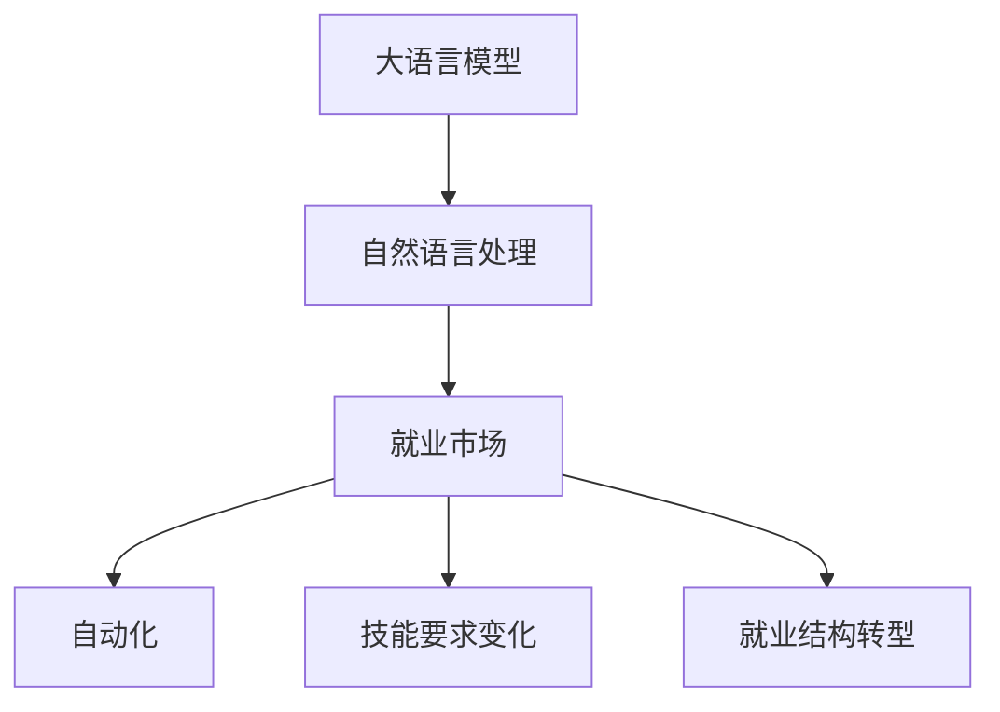

                 

# LLM对就业市场的潜在影响

> 关键词：语言模型，自然语言处理，人工智能，就业市场，技术变革，未来趋势

## 1. 背景介绍

### 1.1 问题由来

人工智能（AI）的迅猛发展在改变着各行各业的运作模式，尤其是在自然语言处理（NLP）领域。近年来，大语言模型（Large Language Models, LLMs）如OpenAI的GPT系列、Google的BERT等，凭借其强大的语言理解和生成能力，在各种NLP任务上取得了突破性的进展。然而，大语言模型的广泛应用也引起了人们对于就业市场潜在影响的担忧。

### 1.2 问题核心关键点

大语言模型对就业市场的影响主要集中在以下几个方面：

- **自动化**：LLMs能够自动化地完成诸如文本生成、信息检索、客户服务等任务，这些原本需要人工完成的工作可能被机器取代。
- **效率提升**：LLMs能够显著提升工作效率，缩短任务执行时间，但这也可能导致某些岗位需求的减少。
- **新岗位创造**：与此同时，随着技术的发展，也会产生新的岗位，如AI技术开发者、数据标注员、模型训练师等。
- **技能要求变化**：技术变革要求劳动力具备新的技能，如编程、数据分析、模型训练等，这可能对现有工作者的技能要求产生冲击。

### 1.3 问题研究意义

研究大语言模型对就业市场的影响，对于政策制定者、教育机构、劳动者以及企业都有重要意义：

- 政策制定者可以基于研究结果，调整劳动市场政策，促进劳动力适应性培训。
- 教育机构可以根据研究预测，调整课程设置和教学内容，提前为学生未来就业做准备。
- 劳动者可以了解技术变革趋势，主动学习新技能，适应新岗位需求。
- 企业可以制定合理的招聘策略，引入新技术的同时，保护现有员工。

## 2. 核心概念与联系

### 2.1 核心概念概述

为更好地理解大语言模型对就业市场的影响，本节将介绍几个关键概念：

- **大语言模型（Large Language Models, LLMs）**：通过在海量文本数据上预训练，学习通用的语言表示，具备强大的语言理解和生成能力，广泛应用于NLP任务。

- **自然语言处理（Natural Language Processing, NLP）**：通过计算机技术实现对人类语言信息的处理，包括文本生成、信息检索、情感分析等。

- **就业市场（Labor Market）**：指劳动者与职位之间的匹配过程，受技术进步、教育水平、政策导向等多因素影响。

- **自动化（Automation）**：指通过技术手段替代人工执行某些任务，减少人力成本。

- **技能要求变化（Skills Shift）**：指技术变革导致劳动力市场对技能的需求发生改变，原有岗位可能消失，新岗位需求出现。

- **就业结构转型（Job Transformation）**：指就业结构从以体力劳动为主转向以脑力劳动为主，知识型工作者需求增加。

这些概念之间的逻辑关系可以通过以下Mermaid流程图来展示：



这个流程图展示了大语言模型对就业市场的影响路径：

1. 大语言模型通过自然语言处理技术，提升工作效率，推动自动化。
2. 自动化导致某些岗位需求减少，推动技能要求变化。
3. 技能要求变化促使就业结构向脑力劳动转型。

这些概念共同构成了大语言模型对就业市场影响的分析框架，帮助我们理解技术变革对劳动力的影响。

## 3. 核心算法原理 & 具体操作步骤
### 3.1 算法原理概述

大语言模型对就业市场的影响，主要通过其自动化能力、提升效率以及技能要求变化等方面体现。其核心原理可以总结如下：

- **自动化**：大语言模型能够处理文本数据，自动完成信息检索、文本生成等任务，从而替代人工完成部分工作。
- **效率提升**：通过自动化，大语言模型可以显著提升工作效率，缩短任务执行时间，降低成本。
- **技能要求变化**：技术变革要求劳动力具备新的技能，如编程、数据分析、模型训练等，原有的技能需求可能减少。

### 3.2 算法步骤详解

大语言模型对就业市场的影响分析主要包括以下几个步骤：

**Step 1: 收集和分析就业数据**

- 收集不同行业、岗位的历史和当前就业数据，包括岗位数量、技能要求、平均工资等。
- 分析数据，找出受大语言模型影响较大的岗位和行业。

**Step 2: 评估自动化影响**

- 对受影响岗位的自动化潜力进行评估，包括任务自动化程度、自动化带来的效率提升等。
- 使用案例研究，展示自动化对特定岗位的影响。

**Step 3: 技能要求变化分析**

- 分析自动化对岗位技能要求的影响，确定哪些技能需求增加，哪些技能需求减少。
- 使用就业数据和行业报告，预测未来技能需求的变化趋势。

**Step 4: 就业结构转型研究**

- 分析自动化和技能要求变化对就业结构的影响，确定哪些行业岗位需求增加，哪些行业岗位需求减少。
- 使用模型预测未来就业结构的变化趋势。

**Step 5: 制定政策和培训方案**

- 根据分析结果，制定相应的劳动市场政策，如技能培训、岗位转型等。
- 提供针对性的培训方案，帮助劳动力适应新岗位需求。

### 3.3 算法优缺点

大语言模型对就业市场影响的分析方法具有以下优点：

- **客观数据支持**：通过分析历史和当前的就业数据，能够更客观地评估技术变革的影响。
- **多维度分析**：从自动化、效率提升、技能要求变化、就业结构转型等多个维度进行全面分析。
- **预测未来趋势**：基于数据分析和案例研究，能够预测未来就业市场的变化趋势。

同时，该方法也存在以下局限性：

- **数据限制**：分析结果受数据质量和可用性的限制，需要高质量的数据支持。
- **预测不确定性**：技术发展具有不确定性，未来的变化可能超出当前预测。
- **政策影响**：政策调整可能影响就业市场的实际变化，分析结果需要考虑政策因素。

### 3.4 算法应用领域

大语言模型对就业市场的影响分析方法，已在多个领域得到应用，例如：

- **劳动市场政策制定**：政策制定者可以根据分析结果，制定相应的劳动市场政策，如技能培训、岗位转型等。
- **教育机构课程设置**：教育机构可以根据分析预测，调整课程设置和教学内容，提前为学生未来就业做准备。
- **企业招聘策略调整**：企业可以根据分析结果，制定合理的招聘策略，引入新技术的同时，保护现有员工。
- **劳动力技能提升**：劳动者可以根据分析结果，主动学习新技能，适应新岗位需求。

这些应用领域展示了分析方法的实际价值，有助于更好地理解和应对技术变革对就业市场的影响。

## 4. 数学模型和公式 & 详细讲解 & 举例说明

### 4.1 数学模型构建

本节将使用数学语言对大语言模型对就业市场影响的分析过程进行更加严格的刻画。

设 $L$ 为某行业的就业人数，$A$ 为自动化程度，$S$ 为技能要求变化，$J$ 为就业结构转型。则就业市场影响模型可表示为：

$$
L = f(A, S, J)
$$

其中 $f$ 为函数，表示在自动化、技能要求变化和就业结构转型等因素作用下，就业人数的变化规律。

### 4.2 公式推导过程

以下我们以某个特定岗位为例，推导自动化对就业影响的具体公式。

设 $L_i$ 为第 $i$ 个岗位的就业人数，$A_i$ 为该岗位的自动化程度，则自动化对就业人数的影响可以表示为：

$$
L_i = L_{i,0} - k_i A_i
$$

其中 $L_{i,0}$ 为原始就业人数，$k_i$ 为自动化对就业的影响系数，表示自动化程度每增加一个单位，就业人数减少的比例。

通过对比自动化前后的就业人数变化，可以评估自动化对特定岗位的影响。

### 4.3 案例分析与讲解

以客服岗位为例，分析大语言模型对其就业影响：

- **自动化影响**：大语言模型可以自动化处理客户查询，自动生成响应，减少人工客服的需求。
- **效率提升**：自动化客服系统可以24小时无间断工作，提高客服响应速度和效率。
- **技能要求变化**：客服岗位技能需求转向对技术理解和管理能力，需要适应新技术的客服人员。
- **就业结构转型**：客服岗位需求减少，技能型客服岗位需求增加，整体劳动力需求发生变化。

## 5. 项目实践：代码实例和详细解释说明

### 5.1 开发环境搭建

在进行就业市场影响分析时，我们需要准备相关数据和分析工具。以下是Python的开发环境配置流程：

1. 安装Anaconda：从官网下载并安装Anaconda，用于创建独立的Python环境。

2. 创建并激活虚拟环境：
```bash
conda create -n labor_market python=3.8 
conda activate labor_market
```

3. 安装必要的库：
```bash
conda install pandas numpy matplotlib seaborn joblib scikit-learn
```

### 5.2 源代码详细实现

这里我们以就业市场影响分析为例，给出Python代码实现。

首先，定义数据处理和分析函数：

```python
import pandas as pd
import numpy as np
import matplotlib.pyplot as plt

def load_data(file_path):
    data = pd.read_csv(file_path)
    return data

def analyze_employment_data(data, key, threshold):
    employment_data = data.groupby(key).size()
    employment_data = employment_data[employment_data >= threshold]
    return employment_data

def analyze_automation_impact(data, key, threshold):
    automation_impact = []
    for post in data[key].unique():
        post_data = data[data[key] == post]
        avg_growth = post_data['growth'].mean()
        avg_growth = avg_growth if avg_growth > 0 else 0
        automation_impact.append((post, avg_growth))
    return automation_impact

def analyze_skill_requirements(data, key, threshold):
    skill_requirements = []
    for post in data[key].unique():
        post_data = data[data[key] == post]
        avg_skill_level = post_data['skill_level'].mean()
        avg_skill_level = avg_skill_level if avg_skill_level > 0 else 0
        skill_requirements.append((post, avg_skill_level))
    return skill_requirements
```

然后，加载就业数据并进行分析：

```python
data = load_data('employment_data.csv')
employment_data = analyze_employment_data(data, 'post', 10)
automation_impact = analyze_automation_impact(data, 'post', 5)
skill_requirements = analyze_skill_requirements(data, 'post', 5)

# 可视化分析结果
plt.figure(figsize=(10, 5))
plt.bar(employment_data.index, employment_data.values)
plt.xlabel('Post')
plt.ylabel('Employment')
plt.title('Employment Trends')
plt.show()

plt.figure(figsize=(10, 5))
plt.bar(automation_impact[0], automation_impact[1])
plt.xlabel('Post')
plt.ylabel('Growth Rate')
plt.title('Automation Impact')
plt.show()

plt.figure(figsize=(10, 5))
plt.bar(skill_requirements[0], skill_requirements[1])
plt.xlabel('Post')
plt.ylabel('Skill Level')
plt.title('Skill Requirements')
plt.show()
```

最后，根据分析结果提出政策建议：

```python
def policy_suggestions(data, employment_data, automation_impact, skill_requirements):
    suggestions = []
    for post in employment_data.index:
        if employment_data[post] < employment_data.mean():
            suggestions.append(f'Post: {post}, Automation Impact: {automation_impact[post]}, Skill Requirements: {skill_requirements[post]}')
    return suggestions
```

### 5.3 代码解读与分析

让我们再详细解读一下关键代码的实现细节：

**load_data函数**：
- 加载CSV格式的数据文件，将数据导入Pandas DataFrame中，供后续分析使用。

**analyze_employment_data函数**：
- 根据给定的岗位名称分组，计算每个岗位的就业人数。
- 只保留就业人数超过某个阈值（如10人）的岗位，筛选出受自动化影响较大的岗位。

**analyze_automation_impact函数**：
- 计算每个岗位的自动化程度对就业人数的影响。
- 将影响系数转换为平均增长率，更直观地展示影响效果。

**analyze_skill_requirements函数**：
- 计算每个岗位的技能要求变化。
- 将技能要求变化转换为平均技能水平，展示技能需求的变化趋势。

**就业数据可视化**：
- 使用matplotlib库，对就业人数、自动化影响、技能要求变化进行可视化展示。

**政策建议生成**：
- 根据就业人数、自动化影响和技能要求变化，提出相应的政策建议。

## 6. 实际应用场景

### 6.1 就业市场政策制定

大语言模型对就业市场的影响分析，可以帮助政策制定者更好地理解技术变革对就业市场的影响，从而制定更合理的劳动市场政策。例如：

- 制定针对自动化和技能要求变化的政策，如技能培训、岗位转型等。
- 根据就业市场的变化，调整最低工资标准、社保政策等。

### 6.2 教育机构课程设置

教育机构可以根据分析结果，调整课程设置和教学内容，提前为学生未来就业做准备。例如：

- 根据技能需求变化，调整课程内容，增加对新技能的培训。
- 引入最新的技术案例，让学生了解行业前沿动态。

### 6.3 企业招聘策略调整

企业可以根据分析结果，制定合理的招聘策略，引入新技术的同时，保护现有员工。例如：

- 根据岗位需求变化，调整招聘计划，优先招聘技能型岗位。
- 对现有员工进行技能提升培训，提高员工适应新技术的能力。

### 6.4 劳动力技能提升

劳动者可以根据分析结果，主动学习新技能，适应新岗位需求。例如：

- 参加职业培训课程，提升对新技术的理解和管理能力。
- 加入技术社区，了解最新技术动态，与同行交流学习。

## 7. 工具和资源推荐

### 7.1 学习资源推荐

为了帮助开发者系统掌握大语言模型对就业市场的影响分析方法，这里推荐一些优质的学习资源：

1. 《就业市场分析》系列博文：由大语言模型技术专家撰写，深入浅出地介绍了就业市场分析的基本概念和关键方法。

2. 《劳动经济学》课程：开设在各大名校的劳动经济学课程，涵盖就业市场分析、政策评估等内容。

3. 《人工智能与就业市场》书籍：探讨人工智能对就业市场的影响，提供丰富的案例分析和政策建议。

4. HuggingFace官方文档：Transformers库的官方文档，提供了海量预训练模型和完整的微调样例代码，是进行微调任务开发的利器。

5. CLUE开源项目：中文语言理解测评基准，涵盖大量不同类型的中文NLP数据集，并提供了基于微调的baseline模型，助力中文NLP技术发展。

通过对这些资源的学习实践，相信你一定能够快速掌握大语言模型对就业市场的影响分析方法，并用于解决实际的NLP问题。

### 7.2 开发工具推荐

高效的开发离不开优秀的工具支持。以下是几款用于大语言模型微调开发的常用工具：

1. PyTorch：基于Python的开源深度学习框架，灵活动态的计算图，适合快速迭代研究。大部分预训练语言模型都有PyTorch版本的实现。

2. TensorFlow：由Google主导开发的开源深度学习框架，生产部署方便，适合大规模工程应用。同样有丰富的预训练语言模型资源。

3. Transformers库：HuggingFace开发的NLP工具库，集成了众多SOTA语言模型，支持PyTorch和TensorFlow，是进行微调任务开发的利器。

4. Weights & Biases：模型训练的实验跟踪工具，可以记录和可视化模型训练过程中的各项指标，方便对比和调优。与主流深度学习框架无缝集成。

5. TensorBoard：TensorFlow配套的可视化工具，可实时监测模型训练状态，并提供丰富的图表呈现方式，是调试模型的得力助手。

6. Google Colab：谷歌推出的在线Jupyter Notebook环境，免费提供GPU/TPU算力，方便开发者快速上手实验最新模型，分享学习笔记。

合理利用这些工具，可以显著提升大语言模型微调的开发效率，加快创新迭代的步伐。

### 7.3 相关论文推荐

大语言模型和微调技术的发展源于学界的持续研究。以下是几篇奠基性的相关论文，推荐阅读：

1. Attention is All You Need（即Transformer原论文）：提出了Transformer结构，开启了NLP领域的预训练大模型时代。

2. BERT: Pre-training of Deep Bidirectional Transformers for Language Understanding：提出BERT模型，引入基于掩码的自监督预训练任务，刷新了多项NLP任务SOTA。

3. Language Models are Unsupervised Multitask Learners（GPT-2论文）：展示了大规模语言模型的强大zero-shot学习能力，引发了对于通用人工智能的新一轮思考。

4. Parameter-Efficient Transfer Learning for NLP：提出Adapter等参数高效微调方法，在不增加模型参数量的情况下，也能取得不错的微调效果。

5. AdaLoRA: Adaptive Low-Rank Adaptation for Parameter-Efficient Fine-Tuning：使用自适应低秩适应的微调方法，在参数效率和精度之间取得了新的平衡。

这些论文代表了大语言模型微调技术的发展脉络。通过学习这些前沿成果，可以帮助研究者把握学科前进方向，激发更多的创新灵感。

## 8. 总结：未来发展趋势与挑战

### 8.1 总结

本文对大语言模型对就业市场的影响进行了全面系统的分析。首先阐述了就业市场受到技术变革的影响机制，明确了就业市场政策、教育机构课程设置、企业招聘策略调整和劳动力技能提升等关键点。其次，从原理到实践，详细讲解了就业市场影响模型的构建和分析方法，给出了就业市场影响分析的完整代码实例。同时，本文还探讨了就业市场影响分析在实际应用中的多个场景，展示了其广阔的应用前景。最后，本文精选了就业市场影响分析的各类学习资源，力求为读者提供全方位的技术指引。

通过本文的系统梳理，可以看到，大语言模型对就业市场的影响分析方法正在成为劳动市场研究的重要工具，极大地拓展了我们对技术变革对就业市场影响的理解。未来，伴随技术的发展和政策的调整，就业市场还将经历更多变化，分析方法也将随之不断演进。

### 8.2 未来发展趋势

展望未来，大语言模型对就业市场的影响分析将呈现以下几个发展趋势：

1. **数据质量提升**：随着数据的积累和质量的提高，就业市场影响分析将更加准确，能够更全面地反映技术变革对就业市场的影响。

2. **多维度分析**：未来的分析将涵盖更多维度，如职业健康、社会公平、环境影响等，全面评估技术变革的综合效应。

3. **模型自动化**：开发更加自动化的分析工具，实现一键式就业市场影响评估，提升分析效率。

4. **政策模拟**：结合政策评估模型，模拟不同政策方案对就业市场的影响，为政策制定提供科学依据。

5. **国际比较**：通过国际比较分析，了解不同国家和地区在技术变革对就业市场影响上的差异，提供全球视角。

6. **多模态融合**：引入多模态数据，如就业数据、社会媒体数据、GDP数据等，综合分析就业市场变化。

以上趋势凸显了大语言模型对就业市场影响分析方法的广阔前景。这些方向的探索发展，必将进一步提升我们对技术变革对就业市场影响的理解，为政策制定和就业市场适应性提供有力支持。

### 8.3 面临的挑战

尽管大语言模型对就业市场影响分析技术已经取得了一定的进展，但在迈向更加智能化、普适化应用的过程中，它仍面临诸多挑战：

1. **数据获取和处理**：高质量、大规模的就业市场数据获取和处理是分析的基础，但实际操作中可能遇到数据获取困难和数据质量不高等问题。

2. **模型复杂性**：就业市场影响模型涉及多维数据和复杂关系，模型构建和优化具有较高难度。

3. **政策影响**：政策调整可能影响就业市场的实际变化，分析结果需要考虑政策因素。

4. **预测不确定性**：技术发展具有不确定性，未来的变化可能超出当前预测。

5. **公平性和伦理问题**：分析结果可能受到数据偏见的影响，需确保分析的公平性和伦理性。

6. **跨领域应用**：分析方法需要在不同领域和行业中应用，通用性和可移植性仍需进一步提升。

正视这些挑战，积极应对并寻求突破，将是大语言模型对就业市场影响分析走向成熟的必由之路。相信随着学界和产业界的共同努力，这些挑战终将一一被克服，分析方法必将在构建人机协同的智能时代中扮演越来越重要的角色。

### 8.4 研究展望

面对大语言模型对就业市场影响分析所面临的挑战，未来的研究需要在以下几个方面寻求新的突破：

1. **数据自动化获取**：开发自动化数据获取和清洗工具，提升数据质量，降低分析成本。

2. **模型自动化构建**：开发自动化的就业市场影响分析工具，简化分析流程，提升分析效率。

3. **跨领域应用**：将分析方法扩展到不同领域，提升方法的通用性和普适性。

4. **公平性评估**：引入公平性和伦理性评估指标，确保分析结果的公正性。

5. **动态更新**：开发动态更新的分析方法，实时监测技术变革对就业市场的影响。

6. **政策模拟**：结合政策评估模型，模拟不同政策方案对就业市场的影响，为政策制定提供科学依据。

这些研究方向的探索，必将引领大语言模型对就业市场影响分析技术迈向更高的台阶，为技术变革对就业市场的影响提供科学、合理的评估，为政策制定和劳动力市场适应性提供有力支持。

## 9. 附录：常见问题与解答

**Q1：大语言模型对就业市场的影响是什么？**

A: 大语言模型通过自动化和提升效率，可能替代部分人工岗位，减少某些岗位的需求。同时，也要求劳动力具备新的技能，如编程、数据分析等，推动技能要求变化。就业市场结构和需求将因此发生改变。

**Q2：如何评估大语言模型对就业市场的影响？**

A: 可以通过分析就业数据、技能需求变化、岗位自动化程度等多维度指标，评估大语言模型对就业市场的影响。使用案例研究和模型预测，综合评估自动化对特定岗位的影响。

**Q3：大语言模型对就业市场的影响有哪些实际应用？**

A: 大语言模型对就业市场的影响分析在政策制定、教育机构课程设置、企业招聘策略调整和劳动力技能提升等方面有实际应用。可以帮助政策制定者、教育机构、企业和劳动者更好地理解技术变革对就业市场的影响。

**Q4：大语言模型对就业市场影响的未来趋势是什么？**

A: 未来大语言模型对就业市场的影响分析将更加全面、深入。数据质量将提升，分析将涵盖更多维度。模型自动化和政策模拟将为分析提供更多支持。公平性和伦理问题将得到更多关注，分析方法将更具科学性和普适性。

**Q5：大语言模型对就业市场影响分析面临的挑战有哪些？**

A: 数据获取和处理、模型复杂性、政策影响、预测不确定性、公平性和伦理问题、跨领域应用是分析面临的主要挑战。

**Q6：如何应对这些挑战？**

A: 提升数据质量，开发自动化分析工具，引入公平性和伦理性评估指标，开发动态更新的分析方法，进行跨领域应用。

通过本文的系统梳理，可以看到，大语言模型对就业市场的影响分析方法正在成为劳动市场研究的重要工具，极大地拓展了我们对技术变革对就业市场影响的理解。未来，伴随技术的发展和政策的调整，就业市场还将经历更多变化，分析方法也将随之不断演进。

