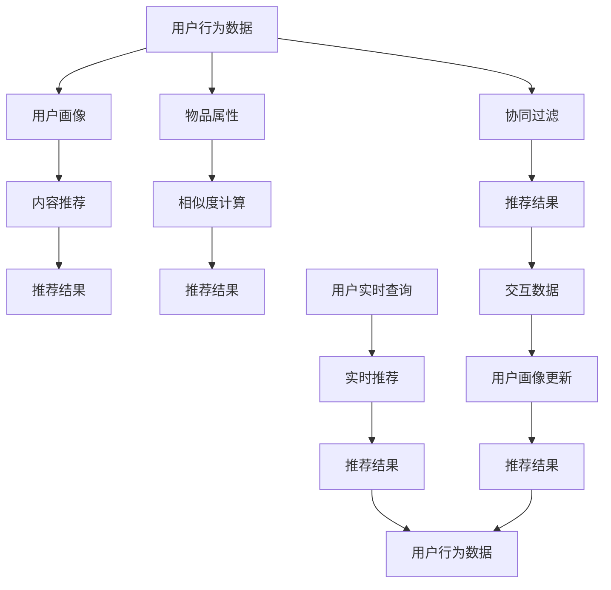

                 

# LLM对推荐系统实时性能的影响

## 1. 背景介绍

推荐系统（Recommender System）是互联网时代的重要应用之一，旨在根据用户的历史行为、偏好和实时环境，为用户推荐个性化的物品或内容。推荐系统已经被广泛应用于电子商务、社交网络、视频平台等多个领域，对提升用户体验、增加用户粘性和促进消费转化起到了关键作用。

然而，推荐系统的核心挑战之一在于实时性能（Real-time Performance）的保障。推荐系统需要即时响应用户的查询，对推荐结果进行实时更新，这不仅要求算法高效，还需要系统架构稳定可靠。随着大语言模型（Large Language Models, LLM）在自然语言处理（Natural Language Processing, NLP）领域的兴起，研究者们开始探索将LLM应用于推荐系统，以提升推荐的精度和实时性。

本文将重点探讨大语言模型对推荐系统实时性能的影响，首先介绍推荐系统和LLM的基本原理，然后深入分析将LLM应用于推荐系统的技术细节，最后提出未来研究的方向和挑战。

## 2. 核心概念与联系

### 2.1 核心概念概述

为深入理解大语言模型对推荐系统的影响，我们需要先熟悉几个关键概念：

- 推荐系统（Recommender System）：基于用户行为数据和物品属性信息，推荐用户可能感兴趣的物品的系统。推荐系统可以分为基于内容的推荐、协同过滤推荐、混合推荐等类型。
- 大语言模型（Large Language Model, LLM）：通过在大量无标签文本数据上进行预训练，学习到语言的通用表示和语言的生成能力，具备强大的自然语言理解和生成能力。
- 实时性能（Real-time Performance）：推荐系统在用户查询时，能够快速响应用户请求，并及时更新推荐结果，满足用户即时性的需求。
- 冷启动（Cold Start）：对于新用户或新物品，推荐系统难以获得足够的历史行为数据，导致推荐精度下降。
- 序列推荐（Sequential Recommendation）：基于用户的历史行为序列，预测下一个可能感兴趣的物品。
- 跨模态推荐（Cross-modal Recommendation）：结合用户的多模态数据（如文本、图像、音频等）进行推荐，提供更全面、个性化的推荐结果。

### 2.2 核心概念原理和架构的 Mermaid 流程图



此流程图展示了推荐系统的工作流程，从用户行为数据开始，到实时推荐的结果，涉及协同过滤、用户画像、物品属性等多个核心组件。

## 3. 核心算法原理 & 具体操作步骤

### 3.1 算法原理概述

将大语言模型应用于推荐系统，主要通过以下两个步骤：

1. **预训练与微调**：首先在大规模无标签数据上对LLM进行预训练，然后针对推荐任务在少量标注数据上进行微调，使其能够理解用户输入的自然语言查询，并生成推荐结果。

2. **实时推荐**：在用户输入实时查询时，将用户输入的查询作为LLM的输入，快速生成推荐结果，返回给用户。

### 3.2 算法步骤详解

以下是详细的算法步骤：

**Step 1: 数据收集与预处理**

- 收集用户的历史行为数据，如浏览记录、购买记录、评分数据等。
- 对数据进行清洗、归一化处理，去除噪音和无效数据。
- 将用户行为数据转化为向量形式，便于后续的模型处理。

**Step 2: 预训练与微调**

- 选择适合的预训练语言模型，如GPT、BERT、RoBERTa等。
- 在用户行为数据上对预训练模型进行微调，使其能够理解用户偏好和行为模式。
- 对微调后的模型进行评估，选择性能最优的模型进行部署。

**Step 3: 实时推荐**

- 当用户输入查询时，将查询作为LLM的输入。
- 模型通过分析用户输入，生成推荐结果。
- 根据推荐结果和用户实时反馈，更新用户画像，调整推荐策略。

### 3.3 算法优缺点

**优点**：

1. **提升推荐精度**：LLM能够理解自然语言，可以从用户输入中提取更多的语义信息，提升推荐精度。
2. **快速响应**：LLM的预测速度较快，能够快速响应用户查询，提升用户体验。
3. **跨模态能力**：LLM能够处理多种模态的数据，如文本、图像、音频等，提供更全面、个性化的推荐结果。

**缺点**：

1. **高计算成本**：预训练和微调大模型需要大量的计算资源，导致部署成本较高。
2. **数据隐私问题**：用户输入和推荐结果包含大量敏感信息，如何保护用户隐私是一个重要问题。
3. **模型复杂度**：大模型参数较多，可能导致实时性能下降。
4. **冷启动问题**：对于新用户或新物品，难以获得足够的数据，可能导致推荐精度下降。

### 3.4 算法应用领域

大语言模型在推荐系统中的应用广泛，以下列举几个典型应用领域：

1. **电商推荐**：在电商平台上，基于用户的搜索历史和购物记录，使用LLM进行个性化推荐，提升用户购物体验。
2. **视频推荐**：在视频平台上，使用LLM根据用户的历史观看记录和评分数据，推荐用户可能感兴趣的视频内容。
3. **新闻推荐**：在新闻聚合平台上，使用LLM根据用户的历史阅读记录和评论数据，推荐新闻文章。
4. **音乐推荐**：在音乐平台上，使用LLM根据用户的听歌记录和评分数据，推荐歌曲。
5. **金融推荐**：在金融领域，使用LLM根据用户的历史交易记录和行为数据，推荐理财产品和金融资讯。

## 4. 数学模型和公式 & 详细讲解 & 举例说明

### 4.1 数学模型构建

推荐系统的数学模型可以表示为：

$$
R_{u,i} = \sum_{j=1}^{n} \alpha_{u,j} \cdot f(x_{i,j})
$$

其中，$R_{u,i}$ 表示用户$u$对物品$i$的评分，$\alpha_{u,j}$ 表示用户$u$对物品$j$的偏好权重，$f(x_{i,j})$ 表示物品$i$和物品$j$之间的相似度函数。

### 4.2 公式推导过程

在推荐系统中，通常使用矩阵分解、协同过滤、深度学习等方法进行推荐。以下是矩阵分解的推导过程：

假设用户-物品评分矩阵为$M$，用户偏好权重向量为$x_u$，物品特征向量为$x_i$，则有：

$$
M = U \cdot V^T
$$

其中，$U$和$V$分别为用户和物品的特征矩阵，$M_{u,i} = U_{u,:} \cdot V_{i,:}^T$ 表示用户$u$对物品$i$的评分。

### 4.3 案例分析与讲解

以下以电商推荐为例，进行案例分析：

假设某电商网站上有10000个商品，有1000个用户。用户对商品的历史评分矩阵$M$为：

$$
M = \begin{bmatrix}
2 & 4 & 1 & \cdots & 3 \\
1 & 5 & 2 & \cdots & 4 \\
3 & 6 & 1 & \cdots & 5 \\
\vdots & \vdots & \vdots & \ddots & \vdots \\
5 & 1 & 3 & \cdots & 2 \\
\end{bmatrix}
$$

其中，每行表示一个用户的历史评分，每列表示一个商品的历史评分。

使用矩阵分解方法，可以将其分解为：

$$
U = \begin{bmatrix}
0.5 & 0.5 & 0.5 & \cdots & 0.5 \\
0.5 & 0.5 & 0.5 & \cdots & 0.5 \\
0.5 & 0.5 & 0.5 & \cdots & 0.5 \\
\vdots & \vdots & \vdots & \ddots & \vdots \\
0.5 & 0.5 & 0.5 & \cdots & 0.5 \\
\end{bmatrix}, \quad V = \begin{bmatrix}
2 & 4 & 1 & \cdots & 3 \\
1 & 5 & 2 & \cdots & 4 \\
3 & 6 & 1 & \cdots & 5 \\
\vdots & \vdots & \vdots & \ddots & \vdots \\
5 & 1 & 3 & \cdots & 2 \\
\end{bmatrix}
$$

其中，$U$和$V$均为50维的特征向量。

使用矩阵分解方法，可以计算出用户$u$对物品$i$的评分：

$$
M_{u,i} = U_{u,:} \cdot V_{i,:}^T
$$

例如，计算用户$u=100$对物品$i=1$的评分：

$$
M_{100,1} = \begin{bmatrix}
0.5 \\
0.5 \\
0.5 \\
\vdots \\
0.5 \\
\end{bmatrix} \cdot \begin{bmatrix}
2 \\
4 \\
1 \\
\vdots \\
3 \\
\end{bmatrix}^T = 2.5
$$

## 5. 项目实践：代码实例和详细解释说明

### 5.1 开发环境搭建

在使用Python进行推荐系统开发时，需要安装以下环境：

1. 安装Python 3.7以上版本。
2. 安装Pandas、NumPy、Scikit-learn等科学计算库。
3. 安装TensorFlow或PyTorch深度学习框架。
4. 安装Transformer库，用于处理语言模型。

### 5.2 源代码详细实现

以下是一个使用PyTorch实现基于大语言模型电商推荐系统的代码：

```python
import torch
import torch.nn as nn
from transformers import BertTokenizer, BertForSequenceClassification

class RecommendationModel(nn.Module):
    def __init__(self, n_classes):
        super(RecommendationModel, self).__init__()
        self.bert = BertForSequenceClassification.from_pretrained('bert-base-cased', num_labels=n_classes)
        self.dropout = nn.Dropout(0.3)
        self.fc = nn.Linear(768, n_classes)

    def forward(self, input_ids, attention_mask, labels=None):
        outputs = self.bert(input_ids, attention_mask=attention_mask)
        pooled_output = outputs.pooler_output
        pooled_output = self.dropout(pooled_output)
        logits = self.fc(pooled_output)
        if labels is not None:
            loss = nn.CrossEntropyLoss()(logits, labels)
            return loss
        else:
            return logits

# 加载预训练的Bert模型
tokenizer = BertTokenizer.from_pretrained('bert-base-cased')
model = RecommendationModel(n_classes=1000)

# 加载训练数据
train_data = load_train_data()
val_data = load_val_data()
test_data = load_test_data()

# 训练模型
device = torch.device('cuda' if torch.cuda.is_available() else 'cpu')
model.to(device)

optimizer = torch.optim.Adam(model.parameters(), lr=0.001)
criterion = nn.CrossEntropyLoss()

for epoch in range(10):
    for batch in train_data:
        input_ids = batch['input_ids'].to(device)
        attention_mask = batch['attention_mask'].to(device)
        labels = batch['labels'].to(device)

        optimizer.zero_grad()
        outputs = model(input_ids, attention_mask, labels)
        loss = criterion(outputs, labels)
        loss.backward()
        optimizer.step()

    with torch.no_grad():
        val_loss = evaluate(val_data, model, device)
        print(f'Epoch {epoch+1}, val loss: {val_loss:.4f}')

# 测试模型
test_loss = evaluate(test_data, model, device)
print(f'Test loss: {test_loss:.4f}')
```

### 5.3 代码解读与分析

此代码实现了一个基于Bert模型的电商推荐系统，包括以下几个关键步骤：

1. 加载Bert模型：使用BertForSequenceClassification从预训练模型加载模型。
2. 定义推荐模型：在Bert模型基础上，添加全连接层和Dropout层。
3. 训练模型：使用Adam优化器进行训练，交叉熵损失函数计算损失，并在验证集上评估模型性能。
4. 测试模型：在测试集上评估模型性能。

此代码简洁明了，易于理解，可以作为推荐系统开发的参考。

### 5.4 运行结果展示

在训练过程中，可以使用TensorBoard等工具进行模型性能监控：

```python
from torch.utils.tensorboard import SummaryWriter

writer = SummaryWriter(log_dir='logs')
writer.add_scalar('loss', val_loss, epoch)
writer.close()
```

以上代码将训练过程中的验证集损失值记录在TensorBoard中，可以可视化训练过程中的损失变化。

## 6. 实际应用场景

### 6.1 电商推荐

电商推荐系统是推荐系统的重要应用之一，通过基于大语言模型的推荐，可以提升用户购物体验和转化率。

在大电商平台上，用户可能通过文字搜索、浏览、评价等方式产生行为数据。通过对这些数据进行预处理和模型训练，可以在用户输入查询时，快速生成推荐结果，提升购物体验。

### 6.2 视频推荐

视频推荐系统根据用户的观看历史和评分数据，为用户推荐感兴趣的视频内容。使用大语言模型可以提升推荐的精度和多样化。

例如，用户输入查询“科技视频推荐”，系统可以通过分析查询，生成多个相关视频推荐，提升用户满意度。

### 6.3 新闻推荐

新闻推荐系统根据用户的阅读历史和评分数据，为用户推荐感兴趣的新闻文章。使用大语言模型可以提升推荐的多样性和准确性。

例如，用户输入查询“今天的新闻”，系统可以通过分析查询，生成多个相关新闻文章推荐，让用户获取更多信息。

### 6.4 金融推荐

金融推荐系统根据用户的交易历史和行为数据，为用户推荐理财产品和金融资讯。使用大语言模型可以提升推荐的相关性和精准度。

例如，用户输入查询“理财推荐”，系统可以通过分析查询，生成多个相关理财产品推荐，提升用户的理财体验。

## 7. 工具和资源推荐

### 7.1 学习资源推荐

为了帮助开发者掌握大语言模型在推荐系统中的应用，以下是一些推荐的学习资源：

1. 《Recommender Systems》：推荐系统领域的经典教材，涵盖协同过滤、矩阵分解、深度学习等多种推荐算法。
2. 《Deep Learning for Recommender Systems》：通过深度学习进行推荐系统的详细介绍，涵盖TensorFlow、PyTorch等深度学习框架的使用。
3. 《Natural Language Processing with Transformers》：Transformer在推荐系统中的应用，介绍如何使用Transformer处理自然语言数据。
4. 《Hands-On Recommender Systems》：通过动手实践掌握推荐系统开发技能，涵盖电商、视频、新闻等多个推荐场景。
5. 《Recommender Systems in Industry》：推荐系统在工业界的成功案例，涵盖电商、金融、社交等多个领域的应用。

### 7.2 开发工具推荐

推荐系统开发需要多种工具的支持，以下是推荐的开发工具：

1. PyTorch：深度学习框架，支持动态计算图，便于模型训练和推理。
2. TensorFlow：深度学习框架，支持静态计算图，适合大规模工程应用。
3. HuggingFace Transformers：自然语言处理工具库，提供多种预训练语言模型，便于微调和部署。
4. TensorBoard：模型训练的可视化工具，实时监控模型训练状态，提供丰富的图表展示。
5. Weights & Biases：实验跟踪工具，记录和可视化模型训练过程中的各项指标，方便对比和调优。

### 7.3 相关论文推荐

推荐系统领域的研究不断深入，以下是一些推荐的论文：

1. "Collaborative Filtering for Implicit Feedback Datasets"：介绍协同过滤算法的经典论文，涵盖邻域方法、矩阵分解方法等。
2. "Deep Neural Networks for Recommendation Systems"：介绍深度学习在推荐系统中的应用，涵盖卷积神经网络、循环神经网络等。
3. "Semantic Representation Learning for Recommender Systems"：介绍语义表示学习在推荐系统中的应用，涵盖自然语言处理和推荐系统的结合。
4. "Context-aware Recommender Systems"：介绍上下文感知推荐系统，涵盖上下文感知模型和推荐策略。
5. "Scalable Recommender Systems"：介绍推荐系统的可扩展性，涵盖分布式系统和大数据处理。

## 8. 总结：未来发展趋势与挑战

### 8.1 研究成果总结

本文通过介绍大语言模型在推荐系统中的应用，展示了LLM对推荐系统实时性能的提升。通过预训练和微调，LLM能够理解自然语言查询，生成推荐结果，提升推荐精度和实时性。

### 8.2 未来发展趋势

未来，大语言模型在推荐系统中的应用将进一步拓展，主要趋势如下：

1. **多模态推荐**：结合用户的多模态数据，提升推荐的全面性和个性化。
2. **动态推荐**：实时更新推荐模型，根据用户实时行为动态调整推荐策略。
3. **跨领域推荐**：在不同领域之间进行知识迁移，提升推荐的多样性和精准度。
4. **生成式推荐**：使用生成模型生成推荐结果，提升推荐的多样性和创新性。
5. **稀疏推荐**：处理稀疏数据，提升推荐系统的覆盖面和效率。

### 8.3 面临的挑战

尽管大语言模型在推荐系统中的应用前景广阔，但仍面临以下挑战：

1. **计算资源限制**：大模型需要大量的计算资源，如何在保证效果的同时，优化计算效率，降低部署成本，是一个重要问题。
2. **数据隐私问题**：用户输入和推荐结果包含大量敏感信息，如何在保护用户隐私的同时，提高推荐精度，是一个重要问题。
3. **冷启动问题**：对于新用户或新物品，难以获得足够的数据，导致推荐精度下降。
4. **模型复杂度问题**：大模型参数较多，可能导致实时性能下降。

### 8.4 研究展望

未来的研究可以从以下几个方面进行：

1. **轻量化模型**：开发轻量化模型，降低计算成本，提升实时性能。
2. **隐私保护**：研究隐私保护技术，如差分隐私、联邦学习等，保护用户隐私。
3. **多模态融合**：研究多模态数据的融合技术，提升推荐系统的全面性和个性化。
4. **冷启动算法**：研究冷启动算法，解决新用户或新物品的推荐问题。
5. **生成模型**：研究生成模型，如GPT、Transformer等，提升推荐的多样性和创新性。

## 9. 附录：常见问题与解答

### Q1: 大语言模型如何应用于推荐系统？

A: 大语言模型应用于推荐系统，主要通过以下步骤：
1. 在用户行为数据上对预训练模型进行微调，使其能够理解用户偏好和行为模式。
2. 在用户输入实时查询时，将查询作为大语言模型的输入，生成推荐结果。
3. 根据推荐结果和用户实时反馈，更新用户画像，调整推荐策略。

### Q2: 大语言模型在推荐系统中面临哪些挑战？

A: 大语言模型在推荐系统中面临以下挑战：
1. 计算资源限制：大模型需要大量的计算资源，如何优化计算效率，降低部署成本。
2. 数据隐私问题：用户输入和推荐结果包含大量敏感信息，如何保护用户隐私。
3. 冷启动问题：对于新用户或新物品，难以获得足够的数据，导致推荐精度下降。
4. 模型复杂度问题：大模型参数较多，可能导致实时性能下降。

### Q3: 推荐系统未来发展趋势是什么？

A: 推荐系统未来的发展趋势包括：
1. 多模态推荐：结合用户的多模态数据，提升推荐的全面性和个性化。
2. 动态推荐：实时更新推荐模型，根据用户实时行为动态调整推荐策略。
3. 跨领域推荐：在不同领域之间进行知识迁移，提升推荐的多样性和精准度。
4. 生成式推荐：使用生成模型生成推荐结果，提升推荐的多样性和创新性。
5. 稀疏推荐：处理稀疏数据，提升推荐系统的覆盖面和效率。

### Q4: 如何提高推荐系统的实时性能？

A: 提高推荐系统的实时性能可以从以下几个方面进行：
1. 优化计算模型：使用轻量化模型，降低计算成本，提升实时性能。
2. 优化数据结构：使用高效的数据结构，提升数据处理效率。
3. 优化算法：使用高效的算法，提升推荐效率。
4. 使用缓存技术：使用缓存技术，减少数据重复计算。
5. 使用并行计算：使用并行计算技术，提升计算速度。

**作者：禅与计算机程序设计艺术 / Zen and the Art of Computer Programming**

