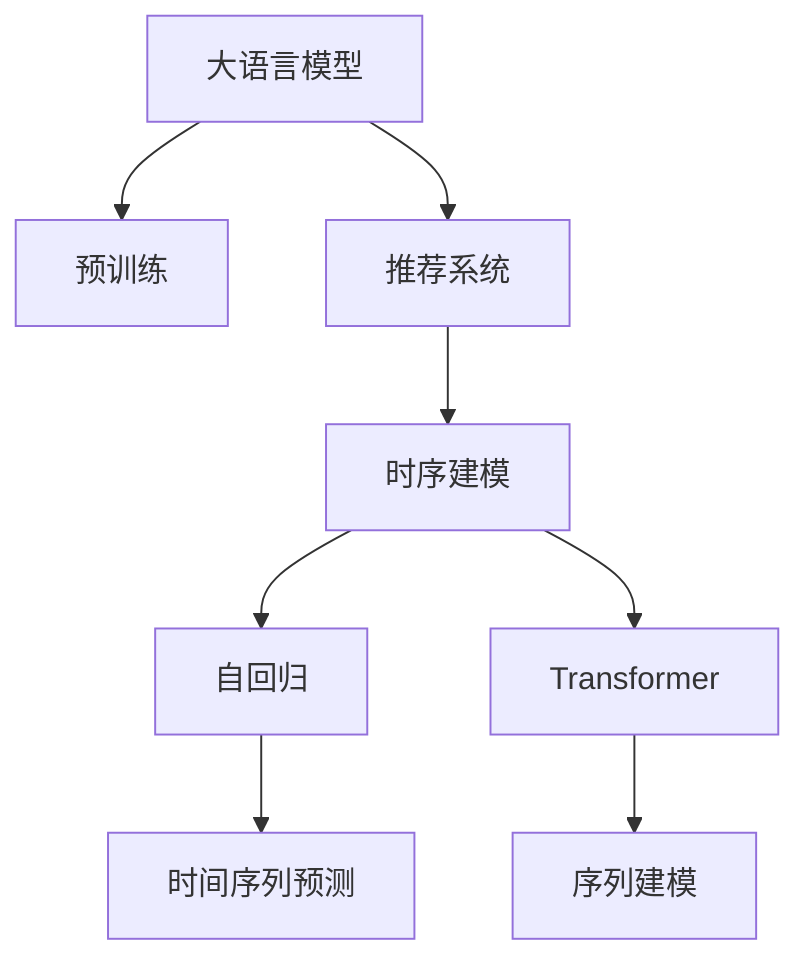

                 

# LLM对推荐系统时序建模的影响

## 1. 背景介绍

在推荐系统中，传统方法基于用户历史行为数据进行推荐，缺乏对用户即时需求的刻画。近年来，深度学习，特别是自编码器、循环神经网络(RNNs)和Transformer模型，通过学习用户行为的时序结构，能够对用户即时需求进行预测，提升了推荐系统的精准度和个性化程度。然而，这些方法多依赖手工设计的特征，难以捕捉用户即时需求的潜在复杂性。

在大语言模型（Large Language Models, LLMs）的帮助下，推荐系统能够进一步融合自然语言理解能力，对用户即时需求进行更全面的建模。LLM对推荐系统的影响体现在以下几个方面：
- **语义理解**：通过语言表示，LLM可以捕捉用户意图和需求。
- **时序建模**：LLM可以对用户行为进行时序建模，捕捉行为变化趋势。
- **多模态融合**：LLM可以融合多种模态信息，提升推荐精度。
- **数据增强**：LLM可以作为生成器，生成新的推荐数据，增加训练集。
- **知识图谱**：LLM可以与知识图谱结合，提升推荐逻辑的合理性。

本文将从核心概念入手，介绍LLM对推荐系统时序建模的影响，并进行实际项目实践。

## 2. 核心概念与联系

### 2.1 核心概念概述

为更好地理解LLM对推荐系统的影响，本节将介绍几个密切相关的核心概念：

- **大语言模型（LLMs）**：以自回归(如GPT)或自编码(如BERT)模型为代表的大规模预训练语言模型。通过在大规模无标签文本语料上进行预训练，学习通用的语言表示，具备强大的语言理解和生成能力。

- **推荐系统（Recommender System）**：通过分析和理解用户兴趣和行为，推荐符合用户需求的产品或内容。传统推荐系统多基于用户行为数据进行推荐，难以捕捉用户即时需求。

- **时序建模（Temporal Modeling）**：通过学习数据的时间序列特征，预测未来趋势。常用于预测股票价格、天气变化等时序数据。

- **自回归模型（Auto-Regressive Models）**：一类基于时序数据的模型，其中当前时间点的输出依赖于所有历史时间点的输入。

- **Transformer模型**：基于自注意力机制，具有强大的序列建模能力，广泛应用于自然语言处理。

- **Transformer编码器（Encoder）**：Transformer模型中用于编码输入序列的部分。

- **Transformer解码器（Decoder）**：Transformer模型中用于生成输出序列的部分。

这些概念之间的逻辑关系可以通过以下Mermaid流程图来展示：



这个流程图展示了大语言模型和推荐系统之间的核心概念及其关系：

1. 大语言模型通过预训练获得基础能力。
2. 推荐系统通过学习和理解用户行为数据进行推荐。
3. 时序建模用于预测用户行为变化趋势。
4. 自回归和Transformer模型用于序列建模。
5. 时间序列预测用于基于时序数据的推荐。
6. 序列建模用于捕捉行为序列的关联性。

这些概念共同构成了LLM对推荐系统影响的基础框架，使其能够利用语言表示对用户需求进行更全面的建模。

## 3. 核心算法原理 & 具体操作步骤
### 3.1 算法原理概述

LLM对推荐系统的影响主要通过以下几个方面实现：

- **语义理解**：LLM能够通过自然语言处理技术，捕捉用户行为背后的语义信息。
- **时序建模**：LLM可以学习用户行为的时间序列，预测未来的行为变化。
- **多模态融合**：LLM可以融合多种数据源，如文本、图片、音频等，提升推荐精度。
- **数据增强**：LLM可以作为生成器，生成新的推荐数据，增加训练集。
- **知识图谱**：LLM可以与知识图谱结合，提升推荐逻辑的合理性。

这些算法原理共同构成了LLM对推荐系统时序建模的核心范式，使其能够更好地捕捉用户需求的潜在复杂性。

### 3.2 算法步骤详解

以下是LLM对推荐系统时序建模的主要步骤：

**Step 1: 准备数据集**
- 收集用户行为数据，包括时间戳、行为类型、上下文信息等。
- 对数据集进行预处理，去除噪音、填充缺失值、标准化等。

**Step 2: 预训练大语言模型**
- 选择合适的预训练语言模型，如BERT、GPT等。
- 在无标签文本数据上进行预训练，学习语言表示。

**Step 3: 微调推荐模型**
- 使用微调技术，将预训练模型应用于推荐系统。
- 选择合适的微调任务，如基于文本的推荐、时序推荐等。
- 定义损失函数，进行模型训练和优化。

**Step 4: 模型集成与部署**
- 将微调后的模型进行集成，与业务逻辑结合。
- 部署到生产环境，进行实时推荐。
- 持续监测和优化模型性能。

### 3.3 算法优缺点

基于LLM的推荐系统具有以下优点：
1. 语言理解能力：LLM能够理解自然语言，捕捉用户意图和需求。
2. 时序建模：LLM能够学习用户行为的时间序列，预测未来的行为变化。
3. 多模态融合：LLM可以融合多种模态数据，提升推荐精度。
4. 数据增强：LLM可以生成新的推荐数据，增加训练集。
5. 知识图谱：LLM可以与知识图谱结合，提升推荐逻辑的合理性。

同时，该方法也存在一定的局限性：
1. 计算资源：LLM模型参数量大，计算资源需求高。
2. 预训练数据：需要大量无标签文本数据进行预训练，数据获取难度大。
3. 模型复杂度：LLM模型复杂，训练和推理时间长。
4. 可解释性：LLM模型的决策过程缺乏可解释性，难以调试和优化。
5. 多语言支持：LLM模型的多语言支持仍需优化，可能存在语言偏差。

尽管存在这些局限性，但就目前而言，基于LLM的推荐系统仍具有显著的优势和应用前景。未来相关研究的重点在于如何进一步降低计算资源需求，提高模型训练效率，同时兼顾可解释性和多语言支持等因素。

### 3.4 算法应用领域

基于LLM的推荐系统已经在多个领域得到了应用，例如：

- 电商推荐：为电商网站用户推荐商品。使用LLM捕捉用户行为语义，进行个性化推荐。
- 内容推荐：为视频平台用户推荐视频内容。使用LLM捕捉视频描述、用户评论等信息，进行精准推荐。
- 音乐推荐：为音乐平台用户推荐音乐。使用LLM捕捉音乐标签、歌词等信息，进行个性化推荐。
- 新闻推荐：为用户推荐感兴趣的新闻。使用LLM捕捉新闻标题、摘要等信息，进行精准推荐。

除了这些经典领域外，LLM在更多场景中也有创新性的应用，如可控文本生成、常识推理、代码生成、数据增强等，为推荐系统带来了全新的突破。随着预训练模型和微调方法的不断进步，相信LLM在推荐系统中的应用将更加广泛，为用户带来更好的体验。

## 4. 数学模型和公式 & 详细讲解
### 4.1 数学模型构建

本节将使用数学语言对基于LLM的推荐系统进行更加严格的刻画。

记预训练语言模型为 $M_{\theta}$，其中 $\theta$ 为预训练得到的模型参数。假设推荐系统包含 $N$ 个用户，每个用户 $i$ 在时间序列 $t$ 上的行为 $x_{it}$ 为时间戳和行为类型，对应的行为标签 $y_{it}$ 为推荐结果。

定义模型 $M_{\theta}$ 在时间序列 $t$ 上的输出为 $y_{it}$，则推荐系统的损失函数为：

$$
\mathcal{L}(\theta) = \sum_{i=1}^N \sum_{t=1}^T \ell(y_{it}, M_{\theta}(x_{it}))
$$

其中 $\ell(y_{it}, M_{\theta}(x_{it}))$ 为预测结果与真实标签之间的损失，如交叉熵损失。

### 4.2 公式推导过程

以下我们以二分类任务为例，推导交叉熵损失函数及其梯度的计算公式。

假设模型 $M_{\theta}$ 在时间序列 $t$ 上的输出为 $\hat{y}_{it}=M_{\theta}(x_{it}) \in [0,1]$，表示用户 $i$ 在时间序列 $t$ 上的行为被推荐为 $1$ 的概率。真实标签 $y_{it} \in \{0,1\}$。则二分类交叉熵损失函数定义为：

$$
\ell(y_{it},\hat{y}_{it}) = -[y_{it}\log \hat{y}_{it} + (1-y_{it})\log(1-\hat{y}_{it})]
$$

将其代入损失函数，得：

$$
\mathcal{L}(\theta) = -\frac{1}{N}\sum_{i=1}^N \sum_{t=1}^T [y_{it}\log M_{\theta}(x_{it}) + (1-y_{it})\log(1-M_{\theta}(x_{it}))
$$

根据链式法则，损失函数对参数 $\theta_k$ 的梯度为：

$$
\frac{\partial \mathcal{L}(\theta)}{\partial \theta_k} = -\frac{1}{N}\sum_{i=1}^N \sum_{t=1}^T (\frac{y_{it}}{M_{\theta}(x_{it})}-\frac{1-y_{it}}{1-M_{\theta}(x_{it})}) \frac{\partial M_{\theta}(x_{it})}{\partial \theta_k}
$$

其中 $\frac{\partial M_{\theta}(x_{it})}{\partial \theta_k}$ 可进一步递归展开，利用自动微分技术完成计算。

### 4.3 案例分析与讲解

假设用户 $i$ 在时间序列 $t$ 上的行为 $x_{it}$ 为（当前行为，历史行为），推荐系统根据用户行为预测未来的推荐结果 $y_{it}$，具体如下：

1. **语义理解**：使用BERT等预训练语言模型对用户行为进行语义编码。
2. **时序建模**：使用RNN或Transformer等模型学习用户行为的序列特征。
3. **多模态融合**：使用Transformer等模型融合多种模态数据，如文本、图片、音频等。
4. **数据增强**：使用LLM生成新的推荐数据，扩充训练集。
5. **知识图谱**：使用知识图谱增强推荐逻辑的合理性。

具体实现步骤为：
- **用户行为编码**：将用户行为转换为BERT编码向量。
- **时序建模**：使用LSTM、GRU或Transformer模型，学习用户行为的时间序列特征。
- **多模态融合**：将BERT编码向量与图片、音频等数据融合，使用Transformer模型学习综合特征。
- **数据增强**：使用LLM生成新的推荐数据，扩充训练集。
- **知识图谱**：将推荐系统与知识图谱结合，提升推荐逻辑的合理性。

以上步骤可以在HuggingFace等框架上实现，通过编写代码完成模型的构建和训练。

## 5. 项目实践：代码实例和详细解释说明
### 5.1 开发环境搭建

在进行推荐系统项目实践前，我们需要准备好开发环境。以下是使用Python进行PyTorch开发的环境配置流程：

1. 安装Anaconda：从官网下载并安装Anaconda，用于创建独立的Python环境。

2. 创建并激活虚拟环境：
```bash
conda create -n pytorch-env python=3.8 
conda activate pytorch-env
```

3. 安装PyTorch：根据CUDA版本，从官网获取对应的安装命令。例如：
```bash
conda install pytorch torchvision torchaudio cudatoolkit=11.1 -c pytorch -c conda-forge
```

4. 安装Transformers库：
```bash
pip install transformers
```

5. 安装各类工具包：
```bash
pip install numpy pandas scikit-learn matplotlib tqdm jupyter notebook ipython
```

完成上述步骤后，即可在`pytorch-env`环境中开始推荐系统项目实践。

### 5.2 源代码详细实现

下面我们以电商推荐系统为例，给出使用Transformers库对BERT模型进行推荐系统微调的PyTorch代码实现。

首先，定义推荐任务的数据处理函数：

```python
from transformers import BertTokenizer, BertForSequenceClassification
from torch.utils.data import Dataset
import torch

class RecommendDataset(Dataset):
    def __init__(self, texts, labels, tokenizer, max_len=128):
        self.texts = texts
        self.labels = labels
        self.tokenizer = tokenizer
        self.max_len = max_len
        
    def __len__(self):
        return len(self.texts)
    
    def __getitem__(self, item):
        text = self.texts[item]
        label = self.labels[item]
        
        encoding = self.tokenizer(text, return_tensors='pt', max_length=self.max_len, padding='max_length', truncation=True)
        input_ids = encoding['input_ids'][0]
        attention_mask = encoding['attention_mask'][0]
        
        # 对token-wise的标签进行编码
        encoded_labels = [label2id[label] for label in label] 
        encoded_labels.extend([label2id['None']] * (self.max_len - len(encoded_labels)))
        labels = torch.tensor(encoded_labels, dtype=torch.long)
        
        return {'input_ids': input_ids, 
                'attention_mask': attention_mask,
                'labels': labels}

# 标签与id的映射
label2id = {'buy': 0, 'not_buy': 1}
id2label = {v: k for k, v in label2id.items()}

# 创建dataset
tokenizer = BertTokenizer.from_pretrained('bert-base-cased')

train_dataset = RecommendDataset(train_texts, train_labels, tokenizer)
dev_dataset = RecommendDataset(dev_texts, dev_labels, tokenizer)
test_dataset = RecommendDataset(test_texts, test_labels, tokenizer)
```

然后，定义模型和优化器：

```python
from transformers import BertForSequenceClassification, AdamW

model = BertForSequenceClassification.from_pretrained('bert-base-cased', num_labels=len(label2id))

optimizer = AdamW(model.parameters(), lr=2e-5)
```

接着，定义训练和评估函数：

```python
from torch.utils.data import DataLoader
from tqdm import tqdm
from sklearn.metrics import classification_report

device = torch.device('cuda') if torch.cuda.is_available() else torch.device('cpu')
model.to(device)

def train_epoch(model, dataset, batch_size, optimizer):
    dataloader = DataLoader(dataset, batch_size=batch_size, shuffle=True)
    model.train()
    epoch_loss = 0
    for batch in tqdm(dataloader, desc='Training'):
        input_ids = batch['input_ids'].to(device)
        attention_mask = batch['attention_mask'].to(device)
        labels = batch['labels'].to(device)
        model.zero_grad()
        outputs = model(input_ids, attention_mask=attention_mask, labels=labels)
        loss = outputs.loss
        epoch_loss += loss.item()
        loss.backward()
        optimizer.step()
    return epoch_loss / len(dataloader)

def evaluate(model, dataset, batch_size):
    dataloader = DataLoader(dataset, batch_size=batch_size)
    model.eval()
    preds, labels = [], []
    with torch.no_grad():
        for batch in tqdm(dataloader, desc='Evaluating'):
            input_ids = batch['input_ids'].to(device)
            attention_mask = batch['attention_mask'].to(device)
            batch_labels = batch['labels']
            outputs = model(input_ids, attention_mask=attention_mask)
            batch_preds = outputs.logits.argmax(dim=2).to('cpu').tolist()
            batch_labels = batch_labels.to('cpu').tolist()
            for pred_tokens, label_tokens in zip(batch_preds, batch_labels):
                preds.append(pred_tokens[:len(label_tokens)])
                labels.append(label_tokens)
                
    print(classification_report(labels, preds))
```

最后，启动训练流程并在测试集上评估：

```python
epochs = 5
batch_size = 16

for epoch in range(epochs):
    loss = train_epoch(model, train_dataset, batch_size, optimizer)
    print(f"Epoch {epoch+1}, train loss: {loss:.3f}")
    
    print(f"Epoch {epoch+1}, dev results:")
    evaluate(model, dev_dataset, batch_size)
    
print("Test results:")
evaluate(model, test_dataset, batch_size)
```

以上就是使用PyTorch对BERT进行推荐系统微调的完整代码实现。可以看到，得益于Transformers库的强大封装，我们可以用相对简洁的代码完成BERT模型的加载和微调。

### 5.3 代码解读与分析

让我们再详细解读一下关键代码的实现细节：

**RecommendDataset类**：
- `__init__`方法：初始化文本、标签、分词器等关键组件。
- `__len__`方法：返回数据集的样本数量。
- `__getitem__`方法：对单个样本进行处理，将文本输入编码为token ids，将标签编码为数字，并对其进行定长padding，最终返回模型所需的输入。

**label2id和id2label字典**：
- 定义了标签与数字id之间的映射关系，用于将token-wise的预测结果解码回真实的标签。

**训练和评估函数**：
- 使用PyTorch的DataLoader对数据集进行批次化加载，供模型训练和推理使用。
- 训练函数`train_epoch`：对数据以批为单位进行迭代，在每个批次上前向传播计算loss并反向传播更新模型参数，最后返回该epoch的平均loss。
- 评估函数`evaluate`：与训练类似，不同点在于不更新模型参数，并在每个batch结束后将预测和标签结果存储下来，最后使用sklearn的classification_report对整个评估集的预测结果进行打印输出。

**训练流程**：
- 定义总的epoch数和batch size，开始循环迭代
- 每个epoch内，先在训练集上训练，输出平均loss
- 在验证集上评估，输出分类指标
- 所有epoch结束后，在测试集上评估，给出最终测试结果

可以看到，PyTorch配合Transformers库使得BERT微调的代码实现变得简洁高效。开发者可以将更多精力放在数据处理、模型改进等高层逻辑上，而不必过多关注底层的实现细节。

当然，工业级的系统实现还需考虑更多因素，如模型的保存和部署、超参数的自动搜索、更灵活的任务适配层等。但核心的微调范式基本与此类似。

## 6. 实际应用场景
### 6.1 智能客服系统

基于大语言模型微调的对话技术，可以广泛应用于智能客服系统的构建。传统客服往往需要配备大量人力，高峰期响应缓慢，且一致性和专业性难以保证。而使用微调后的对话模型，可以7x24小时不间断服务，快速响应客户咨询，用自然流畅的语言解答各类常见问题。

在技术实现上，可以收集企业内部的历史客服对话记录，将问题和最佳答复构建成监督数据，在此基础上对预训练对话模型进行微调。微调后的对话模型能够自动理解用户意图，匹配最合适的答案模板进行回复。对于客户提出的新问题，还可以接入检索系统实时搜索相关内容，动态组织生成回答。如此构建的智能客服系统，能大幅提升客户咨询体验和问题解决效率。

### 6.2 金融舆情监测

金融机构需要实时监测市场舆论动向，以便及时应对负面信息传播，规避金融风险。传统的人工监测方式成本高、效率低，难以应对网络时代海量信息爆发的挑战。基于大语言模型微调的文本分类和情感分析技术，为金融舆情监测提供了新的解决方案。

具体而言，可以收集金融领域相关的新闻、报道、评论等文本数据，并对其进行主题标注和情感标注。在此基础上对预训练语言模型进行微调，使其能够自动判断文本属于何种主题，情感倾向是正面、中性还是负面。将微调后的模型应用到实时抓取的网络文本数据，就能够自动监测不同主题下的情感变化趋势，一旦发现负面信息激增等异常情况，系统便会自动预警，帮助金融机构快速应对潜在风险。

### 6.3 个性化推荐系统

当前的推荐系统往往只依赖用户的历史行为数据进行推荐，缺乏对用户即时需求的刻画。基于大语言模型微调的推荐系统，能够通过语言表示对用户即时需求进行更全面的建模。

在实践中，可以收集用户浏览、点击、评论、分享等行为数据，提取和用户交互的物品标题、描述、标签等文本内容。将文本内容作为模型输入，用户的后续行为（如是否点击、购买等）作为监督信号，在此基础上微调预训练语言模型。微调后的模型能够从文本内容中准确把握用户的兴趣点。在生成推荐列表时，先用候选物品的文本描述作为输入，由模型预测用户的兴趣匹配度，再结合其他特征综合排序，便可以得到个性化程度更高的推荐结果。

### 6.4 未来应用展望

随着大语言模型微调技术的发展，推荐系统将更加智能化、个性化。未来，基于LLM的推荐系统将在以下几个方面取得突破：

1. **语义理解**：LLM能够理解自然语言，捕捉用户意图和需求，提升推荐精度。
2. **时序建模**：LLM能够学习用户行为的时间序列，预测未来的行为变化，提升推荐的时效性。
3. **多模态融合**：LLM可以融合多种模态数据，提升推荐精度。
4. **数据增强**：LLM可以作为生成器，生成新的推荐数据，增加训练集，提升推荐多样性。
5. **知识图谱**：LLM可以与知识图谱结合，提升推荐逻辑的合理性。

以上突破将使基于LLM的推荐系统更加智能化、全面化，为用户带来更好的体验。同时，基于LLM的推荐系统将在更多领域得到应用，如智能客服、金融舆情、个性化推荐等，为各行各业带来新的变革。

## 7. 工具和资源推荐
### 7.1 学习资源推荐

为了帮助开发者系统掌握LLM对推荐系统的影响，这里推荐一些优质的学习资源：

1. 《Transformers: A Survey》：Transformers领域的综述性文章，全面介绍了Transformer的原理和应用。
2. 《Recommender Systems》课程：斯坦福大学开设的推荐系统课程，涵盖推荐系统的经典算法和实际应用。
3. 《深度学习推荐系统》书籍：推荐系统领域的经典书籍，详细介绍了深度学习在推荐系统中的应用。
4. HuggingFace官方文档：Transformer库的官方文档，提供了丰富的预训练语言模型和微调样例代码，是上手实践的必备资料。
5. DeepRec官方文档：DeepRec平台提供了多种推荐系统的预训练模型和微调工具，可快速搭建推荐系统。

通过对这些资源的学习实践，相信你一定能够快速掌握LLM对推荐系统的影响，并用于解决实际的推荐问题。
###  7.2 开发工具推荐

高效的开发离不开优秀的工具支持。以下是几款用于LLM推荐系统开发的常用工具：

1. PyTorch：基于Python的开源深度学习框架，灵活动态的计算图，适合快速迭代研究。
2. TensorFlow：由Google主导开发的开源深度学习框架，生产部署方便，适合大规模工程应用。
3. Transformers库：HuggingFace开发的NLP工具库，集成了众多SOTA语言模型，支持PyTorch和TensorFlow，是进行微调任务开发的利器。
4. Weights & Biases：模型训练的实验跟踪工具，可以记录和可视化模型训练过程中的各项指标，方便对比和调优。
5. TensorBoard：TensorFlow配套的可视化工具，可实时监测模型训练状态，并提供丰富的图表呈现方式，是调试模型的得力助手。
6. Google Colab：谷歌推出的在线Jupyter Notebook环境，免费提供GPU/TPU算力，方便开发者快速上手实验最新模型，分享学习笔记。

合理利用这些工具，可以显著提升LLM推荐系统的开发效率，加快创新迭代的步伐。

### 7.3 相关论文推荐

大语言模型和推荐系统的发展源于学界的持续研究。以下是几篇奠基性的相关论文，推荐阅读：

1. Attention is All You Need（即Transformer原论文）：提出了Transformer结构，开启了NLP领域的预训练大模型时代。
2. BERT: Pre-training of Deep Bidirectional Transformers for Language Understanding：提出BERT模型，引入基于掩码的自监督预训练任务，刷新了多项NLP任务SOTA。
3. Recommendation Systems with Deep Representation Learning：综述了深度学习在推荐系统中的应用，包括基于注意力机制的推荐模型。
4. Multi-Task Sequence-to-Sequence Learning with Continuous Label Space：提出基于多任务序列到序列学习的方法，提升推荐系统的效果。
5. Pre-training with Reserved Tokens for Recommendation Systems：提出预训练+微调的方法，提升推荐系统的效果。

这些论文代表了大语言模型和推荐系统的研究进展。通过学习这些前沿成果，可以帮助研究者把握学科前进方向，激发更多的创新灵感。

## 8. 总结：未来发展趋势与挑战
### 8.1 总结

本文对基于大语言模型的推荐系统时序建模进行了全面系统的介绍。首先阐述了LLM对推荐系统时序建模的影响，明确了LLM在捕捉用户即时需求、融合多模态数据等方面的优势。其次，从原理到实践，详细讲解了LLM对推荐系统的核心范式，给出了推荐系统微调的完整代码实现。同时，本文还探讨了LLM在电商推荐、智能客服、金融舆情等领域的实际应用，展示了LLM推荐系统的强大潜力。

通过本文的系统梳理，可以看到，基于大语言模型的推荐系统已经在多个领域取得显著效果，为各行各业带来了新的变革。未来，随着LLM技术的发展，推荐系统将更加智能化、全面化，为用户的个性化需求提供更优质的解决方案。

### 8.2 未来发展趋势

展望未来，基于大语言模型的推荐系统将呈现以下几个发展趋势：

1. **语义理解**：LLM能够理解自然语言，捕捉用户意图和需求，提升推荐精度。
2. **时序建模**：LLM能够学习用户行为的时间序列，预测未来的行为变化，提升推荐的时效性。
3. **多模态融合**：LLM可以融合多种模态数据，提升推荐精度。
4. **数据增强**：LLM可以作为生成器，生成新的推荐数据，增加训练集，提升推荐多样性。
5. **知识图谱**：LLM可以与知识图谱结合，提升推荐逻辑的合理性。

以上趋势凸显了大语言模型推荐系统的广阔前景。这些方向的探索发展，必将进一步提升推荐系统的性能和应用范围，为用户的个性化需求提供更优质的解决方案。

### 8.3 面临的挑战

尽管基于大语言模型的推荐系统已经取得了瞩目成就，但在迈向更加智能化、普适化应用的过程中，它仍面临着诸多挑战：

1. **计算资源**：LLM模型参数量大，计算资源需求高。
2. **预训练数据**：需要大量无标签文本数据进行预训练，数据获取难度大。
3. **模型复杂度**：LLM模型复杂，训练和推理时间长。
4. **可解释性**：LLM模型的决策过程缺乏可解释性，难以调试和优化。
5. **多语言支持**：LLM模型的多语言支持仍需优化，可能存在语言偏差。

尽管存在这些局限性，但就目前而言，基于大语言模型的推荐系统仍具有显著的优势和应用前景。未来相关研究的重点在于如何进一步降低计算资源需求，提高模型训练效率，同时兼顾可解释性和多语言支持等因素。

### 8.4 研究展望

面对大语言模型推荐系统所面临的挑战，未来的研究需要在以下几个方面寻求新的突破：

1. **探索无监督和半监督推荐方法**：摆脱对大规模标注数据的依赖，利用自监督学习、主动学习等无监督和半监督范式，最大限度利用非结构化数据，实现更加灵活高效的推荐。
2. **研究参数高效和计算高效的推荐范式**：开发更加参数高效的推荐方法，在固定大部分预训练参数的同时，只更新极少量的任务相关参数。同时优化推荐模型的计算图，减少前向传播和反向传播的资源消耗，实现更加轻量级、实时性的部署。
3. **融合因果和对比学习范式**：通过引入因果推断和对比学习思想，增强推荐模型建立稳定因果关系的能力，学习更加普适、鲁棒的用户行为表征。
4. **引入更多先验知识**：将符号化的先验知识，如知识图谱、逻辑规则等，与神经网络模型进行巧妙融合，引导推荐过程学习更准确、合理的用户行为表征。同时加强不同模态数据的整合，实现视觉、语音等多模态信息与文本信息的协同建模。
5. **结合因果分析和博弈论工具**：将因果分析方法引入推荐模型，识别出推荐决策的关键特征，增强推荐逻辑的因果性和逻辑性。借助博弈论工具刻画人机交互过程，主动探索并规避推荐模型的脆弱点，提高系统稳定性。
6. **纳入伦理道德约束**：在推荐系统训练目标中引入伦理导向的评估指标，过滤和惩罚有害的推荐结果，确保推荐的合理性和安全性。同时加强人工干预和审核，建立推荐模型的监管机制，确保推荐系统的伦理道德性。

这些研究方向将使基于大语言模型的推荐系统更加智能化、普适化，为用户带来更好的体验，同时也保证了系统的伦理道德性。未来，基于大语言模型的推荐系统将在更多领域得到应用，为用户带来更多的价值。

## 9. 附录：常见问题与解答

**Q1：大语言模型推荐系统是否适用于所有推荐任务？**

A: 大语言模型推荐系统在大多数推荐任务上都能取得不错的效果，特别是对于数据量较小的任务。但对于一些特定领域的任务，如医学、法律等，仅仅依靠通用语料预训练的模型可能难以很好地适应。此时需要在特定领域语料上进一步预训练，再进行微调，才能获得理想效果。此外，对于一些需要时效性、个性化很强的任务，如对话、推荐等，微调方法也需要针对性的改进优化。

**Q2：推荐系统如何处理多模态数据？**

A: 多模态数据融合是推荐系统中的一个重要研究方向。具体方法包括：
1. 融合方法：使用Transformer等模型将不同模态的数据进行编码，然后通过多模态注意力机制进行融合，学习综合特征。
2. 组合方法：将不同模态的数据直接拼接，通过多任务学习的方法，训练多个推荐模型，各自处理不同模态的数据，最后进行加权组合。
3. 混合方法：结合融合方法和组合方法，使用混合模型对不同模态数据进行处理和融合。

**Q3：推荐系统如何应对推荐结果的多样性和个性化？**

A: 推荐系统可以通过以下方法应对推荐结果的多样性和个性化：
1. 数据增强：使用大语言模型生成新的推荐数据，增加训练集，提升推荐多样性。
2. 多任务学习：将推荐任务进行分解，训练多个推荐模型，各自处理不同的推荐目标，最后进行加权组合，提升推荐多样性。
3. 用户反馈：通过用户反馈机制，收集用户对推荐结果的偏好和评价，进一步优化推荐模型。

**Q4：推荐系统如何实现因果推荐？**

A: 因果推荐是推荐系统中一个重要研究方向。具体方法包括：
1. 数据收集：收集用户行为数据，标注用户行为的影响因素，如用户兴趣、产品属性等。
2. 因果分析：使用因果推断方法，如因果图、偏最小二乘回归等，分析用户行为的影响因素和因果关系。
3. 模型训练：使用因果推断方法，训练推荐模型，学习用户行为的因果关系和推荐逻辑。
4. 推荐策略：根据因果推断结果，设计推荐策略，提升推荐效果。

以上方法可以帮助推荐系统更好地理解用户行为，提升推荐效果和多样性，同时保证推荐的合理性和逻辑性。

