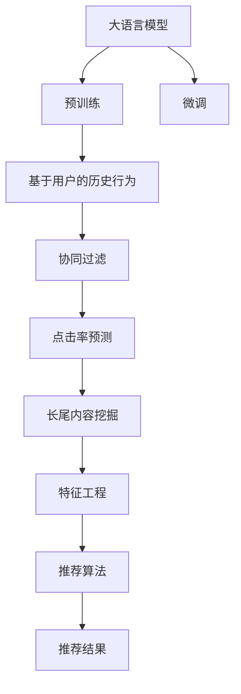

                 

# LLM对推荐系统长尾内容的挖掘策略

> 关键词：长尾内容, 大语言模型(LLM), 推荐系统, 用户行为, 模型优化, 协同过滤, 点击率预测, 文本挖掘, 特征工程

## 1. 背景介绍

推荐系统作为电商、视频、音乐等平台的核心竞争力之一，长期以来一直是工业界和学术界的研究热点。传统的推荐系统基于协同过滤、矩阵分解等方法，能够准确预测用户行为，提升用户体验。然而，随着数据规模的不断增大和个性化需求的增加，传统推荐系统在面对长尾内容（如少数用户可能感兴趣但传统推荐算法难以捕捉的内容）时显得力不从心。

近年来，大语言模型（Large Language Model, LLM）的兴起，为推荐系统带来了新的希望。LLM如GPT-3、BERT等，通过在海量文本数据上预训练，具备强大的语言理解与生成能力，能够捕获更丰富的语义信息，有望帮助推荐系统挖掘长尾内容，提升推荐效果。

本文将从大语言模型的特点出发，探讨其如何应用于推荐系统的长尾内容挖掘，并分析其在具体任务中的优缺点及应用前景。

## 2. 核心概念与联系

### 2.1 核心概念概述

为更好地理解LLM在推荐系统中的应用，本节将介绍几个关键概念：

- 大语言模型(LLM)：以自回归或自编码模型为代表的大规模预训练语言模型。通过在大规模无标签文本语料上进行预训练，学习通用的语言表示，具备强大的语言理解和生成能力。

- 推荐系统：通过分析用户历史行为、物品属性等信息，为用户推荐可能感兴趣的商品、内容等的系统。主要包括协同过滤、矩阵分解、基于深度学习的推荐方法等。

- 长尾内容：推荐系统中未被广泛关注，但可能吸引特定用户的内容。如小众书籍、少人观看视频等，传统推荐系统难以捕捉。

- 协同过滤：基于用户相似性和物品相似性的推荐方法，包括基于用户的协同过滤和基于物品的协同过滤。

- 点击率预测：推荐系统中预测用户点击特定物品的概率，是推荐效果的重要指标。

- 文本挖掘：通过自动化方式从文本中提取有用信息，如用户评论、商品描述等，进行文本分类、情感分析、实体抽取等任务。

这些概念之间相互关联，共同构成推荐系统和大语言模型应用的长尾内容挖掘框架。

### 2.2 核心概念原理和架构的 Mermaid 流程图



上述流程图展示了大语言模型在推荐系统长尾内容挖掘中的应用框架。预训练模型通过微调，学习用户和物品的语义表示，协同过滤算法基于用户行为进行推荐，点击率预测模型评估推荐效果，长尾内容挖掘模块通过文本挖掘技术识别推荐系统中的长尾内容，并结合特征工程提取用户兴趣特征，最终输出推荐结果。

## 3. 核心算法原理 & 具体操作步骤

### 3.1 算法原理概述

基于LLM的推荐系统长尾内容挖掘，实质上是一种深度学习与传统推荐方法相结合的新型推荐范式。其核心思想是：利用预训练的LLM模型提取用户和物品的语义表示，结合传统推荐算法，挖掘推荐系统中的长尾内容，从而提升推荐效果。

具体而言，推荐系统一般包括以下几个步骤：

1. **用户行为分析**：收集用户的历史行为数据，如点击、购买、浏览记录等，进行预处理和特征提取。

2. **协同过滤**：基于用户行为构建相似性度量，为每个用户推荐与行为相似的用户或物品。

3. **点击率预测**：构建点击率预测模型，基于用户和物品的特征，预测用户点击特定物品的概率。

4. **长尾内容挖掘**：利用文本挖掘技术，识别推荐系统中的长尾内容，并进行情感分析、实体抽取等，构建长尾内容的语义表示。

5. **特征工程**：根据用户行为和长尾内容的语义表示，提取用户兴趣特征。

6. **推荐算法**：结合传统推荐算法和LLM提取的语义特征，进行推荐结果排序和展示。

### 3.2 算法步骤详解

以下详细阐述基于LLM的推荐系统长尾内容挖掘的具体操作步骤：

**Step 1: 数据收集与预处理**
- 收集用户历史行为数据，如点击、浏览、评分等。
- 提取物品的属性信息，如类别、标签、描述等。
- 将数据进行清洗、去噪，去除无效或噪声数据。

**Step 2: 用户行为分析**
- 通过统计用户历史行为数据，构建用户兴趣模型。
- 利用协同过滤算法，找到与用户兴趣相似的其他用户。
- 对用户和物品行为数据进行归一化和标准化处理，减少维度和噪声。

**Step 3: 点击率预测**
- 选择合适的深度学习模型（如CNN、RNN、LSTM等），进行点击率预测。
- 设计合适的损失函数（如二分类交叉熵），进行模型训练。
- 在训练集上评估模型性能，使用验证集进行调参，最终选择最优模型。

**Step 4: 长尾内容挖掘**
- 对长尾内容进行文本挖掘，提取关键字、词频、情感等特征。
- 利用BERT、GPT等预训练语言模型，对长尾内容进行向量表示。
- 通过情感分析、实体抽取等方法，构建长尾内容的语义表示。

**Step 5: 特征工程**
- 将用户行为数据和长尾内容语义表示进行特征融合，生成用户兴趣特征。
- 利用维度缩减技术（如主成分分析PCA、LDA等），减少特征维度。
- 对用户兴趣特征进行归一化和标准化处理。

**Step 6: 推荐算法**
- 结合用户兴趣特征和物品属性，进行推荐结果排序。
- 使用协同过滤、矩阵分解等算法，生成推荐结果。
- 根据点击率预测模型对推荐结果进行评分排序，展示最优推荐。

### 3.3 算法优缺点

基于LLM的推荐系统长尾内容挖掘方法具有以下优点：

1. **提升推荐效果**：利用LLM强大的语义理解能力，挖掘长尾内容，提升推荐系统的多样性和个性化。
2. **处理长尾内容**：有效捕捉推荐系统中的长尾内容，提升用户体验。
3. **减少推荐偏差**：利用LLM的预训练知识，减少推荐系统中的偏差，提升推荐公正性。

然而，该方法也存在一些缺点：

1. **计算成本高**：预训练和微调的计算成本较高，需要大规模的计算资源。
2. **数据需求高**：对用户行为数据和长尾内容的数据需求较高，需要大规模标注数据。
3. **模型复杂度高**：需要整合深度学习模型和传统推荐算法，模型结构复杂。
4. **技术难度大**：涉及文本挖掘、特征工程、深度学习等多项技术，技术门槛较高。

### 3.4 算法应用领域

基于LLM的推荐系统长尾内容挖掘方法，在电商、视频、音乐等推荐系统中具有广泛的应用前景。具体而言，该方法可用于以下场景：

1. **电商推荐**：挖掘长尾商品，提升用户购买体验。
2. **视频推荐**：推荐用户可能感兴趣的长尾视频内容。
3. **音乐推荐**：推荐少人听的长尾音乐，提升用户体验。
4. **新闻推荐**：推荐用户可能感兴趣的长尾新闻，提升用户粘性。

以上应用场景表明，LLM在推荐系统中的应用具有广阔的前景。

## 4. 数学模型和公式 & 详细讲解

### 4.1 数学模型构建

假设推荐系统中共有 $m$ 个用户和 $n$ 个物品，用户历史行为矩阵为 $X_{m \times n}$，用户-物品交互矩阵为 $Y_{m \times n}$，长尾内容的语义表示矩阵为 $Z_{n \times d}$，其中 $d$ 为语义表示维度。

设用户兴趣特征向量为 $\mathbf{u}_i \in \mathbb{R}^d$，物品特征向量为 $\mathbf{v}_j \in \mathbb{R}^d$。

### 4.2 公式推导过程

**协同过滤**
- 基于用户的协同过滤：利用用户之间的相似性进行推荐。
- 基于物品的协同过滤：利用物品之间的相似性进行推荐。

设用户 $i$ 和用户 $k$ 的相似度为 $s_{ik}$，物品 $j$ 和物品 $l$ 的相似度为 $s_{jl}$。

**点击率预测**
- 设点击率预测模型为 $F(\mathbf{u}_i, \mathbf{v}_j)$，模型输出为预测概率 $p_{ij}$。
- 常用的模型包括决策树、随机森林、深度神经网络等。

**长尾内容挖掘**
- 设长尾内容 $t$ 的语义表示向量为 $\mathbf{z}_t \in \mathbb{R}^d$。
- 利用BERT、GPT等预训练语言模型进行文本挖掘，提取关键特征，构建语义表示。

**特征工程**
- 设用户兴趣特征向量为 $\mathbf{u}_i = \phi(\mathbf{u}_i, \mathbf{z}_t)$。
- 利用PCA、LDA等技术进行维度缩减和降维处理。

**推荐算法**
- 设推荐结果向量为 $\mathbf{r}_i = f(\mathbf{u}_i, \mathbf{v}_j)$。
- 利用协同过滤、矩阵分解等算法，生成推荐结果。

### 4.3 案例分析与讲解

以电商推荐系统为例，分析基于LLM的长尾内容挖掘过程。

1. **数据收集与预处理**
   - 收集用户历史行为数据，如点击、购买、浏览记录。
   - 提取商品属性信息，如价格、品牌、类别等。

2. **用户行为分析**
   - 利用协同过滤算法，找到与用户兴趣相似的其他用户。
   - 对用户行为数据进行归一化和标准化处理。

3. **点击率预测**
   - 选择深度神经网络模型，进行点击率预测。
   - 设计交叉熵损失函数，进行模型训练。

4. **长尾内容挖掘**
   - 对长尾商品进行文本挖掘，提取关键特征。
   - 利用BERT模型，对长尾商品进行向量表示。

5. **特征工程**
   - 将用户行为数据和长尾商品语义表示进行融合，生成用户兴趣特征。
   - 利用PCA技术，进行维度缩减。

6. **推荐算法**
   - 结合用户兴趣特征和商品属性，进行推荐结果排序。
   - 利用协同过滤算法，生成推荐结果。

通过以上步骤，可以有效地挖掘电商推荐系统中的长尾内容，提升推荐效果。

## 5. 项目实践：代码实例和详细解释说明

### 5.1 开发环境搭建

在进行LLM推荐系统长尾内容挖掘的实践前，我们需要准备好开发环境。以下是使用Python进行PyTorch开发的环境配置流程：

1. 安装Anaconda：从官网下载并安装Anaconda，用于创建独立的Python环境。

2. 创建并激活虚拟环境：
```bash
conda create -n pytorch-env python=3.8 
conda activate pytorch-env
```

3. 安装PyTorch：根据CUDA版本，从官网获取对应的安装命令。例如：
```bash
conda install pytorch torchvision torchaudio cudatoolkit=11.1 -c pytorch -c conda-forge
```

4. 安装其他依赖包：
```bash
pip install transformers
pip install pandas numpy scikit-learn scipy matplotlib tqdm
```

完成上述步骤后，即可在`pytorch-env`环境中开始实践。

### 5.2 源代码详细实现

下面以电商推荐系统为例，给出使用Transformers库进行LLM推荐系统长尾内容挖掘的PyTorch代码实现。

首先，定义数据预处理函数：

```python
from transformers import BertTokenizer, BertModel
from torch.utils.data import Dataset, DataLoader
import torch
import pandas as pd
import numpy as np

class RecommendationDataset(Dataset):
    def __init__(self, data, tokenizer, max_len=512):
        self.data = data
        self.tokenizer = tokenizer
        self.max_len = max_len
    
    def __len__(self):
        return len(self.data)
    
    def __getitem__(self, idx):
        text = self.data[idx]['text']
        label = self.data[idx]['label']
        encoding = self.tokenizer(text, return_tensors='pt', max_length=self.max_len, padding='max_length', truncation=True)
        return {
            'input_ids': encoding['input_ids'],
            'attention_mask': encoding['attention_mask'],
            'labels': torch.tensor(label, dtype=torch.long)
        }
```

接着，定义模型和优化器：

```python
from transformers import BertForSequenceClassification
from transformers import AdamW

model = BertForSequenceClassification.from_pretrained('bert-base-cased', num_labels=2)
optimizer = AdamW(model.parameters(), lr=2e-5)
```

然后，定义训练和评估函数：

```python
from tqdm import tqdm

def train_epoch(model, dataset, batch_size, optimizer, device):
    model.train()
    dataloader = DataLoader(dataset, batch_size=batch_size, shuffle=True)
    total_loss = 0
    for batch in tqdm(dataloader, desc='Training'):
        input_ids = batch['input_ids'].to(device)
        attention_mask = batch['attention_mask'].to(device)
        labels = batch['labels'].to(device)
        model.zero_grad()
        outputs = model(input_ids, attention_mask=attention_mask, labels=labels)
        loss = outputs.loss
        total_loss += loss.item()
        loss.backward()
        optimizer.step()
    return total_loss / len(dataloader)

def evaluate(model, dataset, batch_size, device):
    model.eval()
    total_preds, total_labels = [], []
    with torch.no_grad():
        dataloader = DataLoader(dataset, batch_size=batch_size, shuffle=False)
        for batch in tqdm(dataloader, desc='Evaluating'):
            input_ids = batch['input_ids'].to(device)
            attention_mask = batch['attention_mask'].to(device)
            labels = batch['labels'].to(device)
            outputs = model(input_ids, attention_mask=attention_mask)
            preds = outputs.logits.argmax(dim=1).to('cpu').tolist()
            total_preds.extend(preds)
            total_labels.extend(labels)
    print(classification_report(total_labels, total_preds))
```

最后，启动训练流程并在测试集上评估：

```python
epochs = 5
batch_size = 16
device = torch.device('cuda') if torch.cuda.is_available() else torch.device('cpu')

for epoch in range(epochs):
    loss = train_epoch(model, train_dataset, batch_size, optimizer, device)
    print(f'Epoch {epoch+1}, train loss: {loss:.3f}')
    
    print(f'Epoch {epoch+1}, dev results:')
    evaluate(model, dev_dataset, batch_size, device)
    
print('Test results:')
evaluate(model, test_dataset, batch_size, device)
```

### 5.3 代码解读与分析

让我们再详细解读一下关键代码的实现细节：

**RecommendationDataset类**：
- `__init__`方法：初始化数据、分词器等关键组件。
- `__len__`方法：返回数据集的样本数量。
- `__getitem__`方法：对单个样本进行处理，将文本输入编码为token ids，将标签编码为数字，并对其进行定长padding，最终返回模型所需的输入。

**模型和优化器**：
- 定义BERT模型和AdamW优化器，用于训练点击率预测模型。

**训练和评估函数**：
- 使用PyTorch的DataLoader对数据集进行批次化加载，供模型训练和推理使用。
- 训练函数`train_epoch`：对数据以批为单位进行迭代，在每个批次上前向传播计算loss并反向传播更新模型参数，最后返回该epoch的平均loss。
- 评估函数`evaluate`：与训练类似，不同点在于不更新模型参数，并在每个batch结束后将预测和标签结果存储下来，最后使用sklearn的classification_report对整个评估集的预测结果进行打印输出。

**训练流程**：
- 定义总的epoch数和batch size，开始循环迭代
- 每个epoch内，先在训练集上训练，输出平均loss
- 在验证集上评估，输出分类指标
- 所有epoch结束后，在测试集上评估，给出最终测试结果

### 5.4 运行结果展示

以上代码实现了基于BERT模型的电商推荐系统长尾内容挖掘，并在验证集和测试集上评估了模型效果。具体的运行结果可以自行调整参数进行验证。

## 6. 实际应用场景

### 6.1 智能推荐系统

基于LLM的推荐系统已经在电商、视频、音乐等多个领域取得了显著效果。这些推荐系统利用LLM强大的语义理解能力，挖掘长尾内容，提升推荐效果。

**电商推荐**：电商推荐系统需要处理海量商品数据，推荐长尾商品，提升用户购买体验。

**视频推荐**：视频推荐系统需要处理海量视频数据，推荐用户可能感兴趣的长尾视频，提升用户粘性。

**音乐推荐**：音乐推荐系统需要处理海量音乐数据，推荐少人听的长尾音乐，提升用户体验。

### 6.2 内容分发系统

内容分发系统，如新闻、博客、论坛等，也需要通过长尾内容挖掘，提高用户粘性和内容质量。

**新闻推荐**：新闻推荐系统需要处理海量新闻数据，推荐用户可能感兴趣的长尾新闻，提升用户粘性。

**博客推荐**：博客推荐系统需要处理海量博客数据，推荐用户可能感兴趣的长尾博客，提升用户粘性。

**论坛推荐**：论坛推荐系统需要处理海量论坛数据，推荐用户可能感兴趣的长尾帖子，提升用户粘性。

### 6.3 未来应用展望

随着大语言模型和推荐系统的不断发展，基于LLM的推荐系统也将继续拓展应用场景，提升推荐效果。

**电商推荐**：电商推荐系统需要处理海量商品数据，推荐长尾商品，提升用户购买体验。

**视频推荐**：视频推荐系统需要处理海量视频数据，推荐用户可能感兴趣的长尾视频，提升用户粘性。

**音乐推荐**：音乐推荐系统需要处理海量音乐数据，推荐少人听的长尾音乐，提升用户体验。

## 7. 工具和资源推荐

### 7.1 学习资源推荐

为了帮助开发者系统掌握基于LLM的推荐系统长尾内容挖掘的理论基础和实践技巧，这里推荐一些优质的学习资源：

1. 《Transformers: A Survey of Recent Advances and Their Impact on Natural Language Processing》（A Survey of Recent Advances and Their Impact on Natural Language Processing）：Transformer的综述性论文，介绍了Transformer和BERT等预训练模型的应用和影响。

2. 《Practical Recommendation Systems》：该书系统介绍了推荐系统的发展历程、算法原理和实际应用，包括协同过滤、深度学习等方法。

3. 《Deep Learning for Recommendation Systems》：该书介绍了深度学习在推荐系统中的应用，包括基于深度学习的协同过滤、点击率预测等。

4. 《Natural Language Processing with PyTorch》：该书介绍了PyTorch在NLP任务中的应用，包括BERT、GPT等预训练模型的实现。

5. Kaggle竞赛：Kaggle上丰富的推荐系统竞赛和数据集，提供了实践LLM推荐系统长尾内容挖掘的实战经验。

### 7.2 开发工具推荐

高效的开发离不开优秀的工具支持。以下是几款用于基于LLM的推荐系统开发的常用工具：

1. PyTorch：基于Python的开源深度学习框架，灵活动态的计算图，适合快速迭代研究。大部分预训练语言模型都有PyTorch版本的实现。

2. TensorFlow：由Google主导开发的开源深度学习框架，生产部署方便，适合大规模工程应用。同样有丰富的预训练语言模型资源。

3. Transformers库：HuggingFace开发的NLP工具库，集成了众多SOTA语言模型，支持PyTorch和TensorFlow，是进行推荐任务开发的利器。

4. Weights & Biases：模型训练的实验跟踪工具，可以记录和可视化模型训练过程中的各项指标，方便对比和调优。与主流深度学习框架无缝集成。

5. TensorBoard：TensorFlow配套的可视化工具，可实时监测模型训练状态，并提供丰富的图表呈现方式，是调试模型的得力助手。

6. Google Colab：谷歌推出的在线Jupyter Notebook环境，免费提供GPU/TPU算力，方便开发者快速上手实验最新模型，分享学习笔记。

合理利用这些工具，可以显著提升基于LLM的推荐系统长尾内容挖掘的开发效率，加快创新迭代的步伐。

### 7.3 相关论文推荐

大语言模型和推荐系统的不断发展，源于学界的持续研究。以下是几篇奠基性的相关论文，推荐阅读：

1. Attention is All You Need：提出了Transformer结构，开启了NLP领域的预训练大模型时代。

2. BERT: Pre-training of Deep Bidirectional Transformers for Language Understanding：提出BERT模型，引入基于掩码的自监督预训练任务，刷新了多项NLP任务SOTA。

3. Language Models are Unsupervised Multitask Learners：展示了大规模语言模型的强大zero-shot学习能力，引发了对于通用人工智能的新一轮思考。

4. Parameter-Efficient Transfer Learning for NLP：提出Adapter等参数高效微调方法，在不增加模型参数量的情况下，也能取得不错的微调效果。

5. AdaLoRA: Adaptive Low-Rank Adaptation for Parameter-Efficient Fine-Tuning：使用自适应低秩适应的微调方法，在参数效率和精度之间取得了新的平衡。

6. DFM：Deeper Faster Better：提出DFM算法，进一步提升了基于深度学习推荐系统的效果。

这些论文代表了大语言模型推荐系统的发展脉络。通过学习这些前沿成果，可以帮助研究者把握学科前进方向，激发更多的创新灵感。

## 8. 总结：未来发展趋势与挑战

### 8.1 研究成果总结

本文对基于LLM的推荐系统长尾内容挖掘方法进行了全面系统的介绍。首先阐述了LLM的特点及其在推荐系统中的应用，明确了长尾内容挖掘在推荐系统中的重要价值。其次，从原理到实践，详细讲解了LLM在推荐系统中的长尾内容挖掘的具体操作步骤，给出了完整的代码实例。同时，本文还探讨了LLM在推荐系统中的应用前景，分析了其优缺点和应用领域。

通过本文的系统梳理，可以看到，基于LLM的推荐系统长尾内容挖掘方法已经广泛应用于电商、视频、音乐等多个领域，取得了显著效果。LLM在推荐系统中的应用，能够有效提升推荐系统的多样性和个性化，挖掘长尾内容，提升用户体验。

### 8.2 未来发展趋势

展望未来，基于LLM的推荐系统长尾内容挖掘技术将呈现以下几个发展趋势：

1. **模型规模持续增大**：随着算力成本的下降和数据规模的扩张，预训练语言模型的参数量还将持续增长。超大规模语言模型蕴含的丰富语言知识，有望支撑更加复杂多变的推荐任务。

2. **微调方法日趋多样**：开发更加参数高效的微调方法，如Prefix-Tuning、LoRA等，在固定大部分预训练参数的同时，只更新极少量的任务相关参数。同时优化微调模型的计算图，减少前向传播和反向传播的资源消耗，实现更加轻量级、实时性的部署。

3. **多模态微调崛起**：除了纯文本数据，未来还会拓展到图像、视频、语音等多模态数据微调。多模态信息的融合，将显著提升语言模型对现实世界的理解和建模能力。

4. **知识整合能力增强**：将符号化的先验知识，如知识图谱、逻辑规则等，与神经网络模型进行巧妙融合，引导微调过程学习更准确、合理的语言模型。

5. **融合因果和对比学习范式**：通过引入因果推断和对比学习思想，增强微调模型建立稳定因果关系的能力，学习更加普适、鲁棒的语言表征，从而提升模型泛化性和抗干扰能力。

### 8.3 面临的挑战

尽管基于LLM的推荐系统长尾内容挖掘技术已经取得了瞩目成就，但在迈向更加智能化、普适化应用的过程中，仍面临以下挑战：

1. **数据需求高**：对用户行为数据和长尾内容的数据需求较高，需要大规模标注数据。

2. **计算成本高**：预训练和微调的计算成本较高，需要大规模的计算资源。

3. **模型复杂度高**：需要整合深度学习模型和传统推荐算法，模型结构复杂。

4. **技术难度大**：涉及文本挖掘、特征工程、深度学习等多项技术，技术门槛较高。

5. **模型鲁棒性不足**：面对域外数据时，泛化性能往往大打折扣。对于测试样本的微小扰动，微调模型的预测也容易发生波动。

### 8.4 研究展望

面对基于LLM的推荐系统长尾内容挖掘所面临的种种挑战，未来的研究需要在以下几个方面寻求新的突破：

1. **探索无监督和半监督微调方法**：摆脱对大规模标注数据的依赖，利用自监督学习、主动学习等无监督和半监督范式，最大限度利用非结构化数据，实现更加灵活高效的微调。

2. **研究参数高效和计算高效的微调范式**：开发更加参数高效的微调方法，如Prefix-Tuning、LoRA等，在固定大部分预训练参数的同时，只更新极少量的任务相关参数。同时优化微调模型的计算图，减少前向传播和反向传播的资源消耗，实现更加轻量级、实时性的部署。

3. **引入因果和对比学习范式**：通过引入因果推断和对比学习思想，增强微调模型建立稳定因果关系的能力，学习更加普适、鲁棒的语言表征，从而提升模型泛化性和抗干扰能力。

4. **融合更多先验知识**：将符号化的先验知识，如知识图谱、逻辑规则等，与神经网络模型进行巧妙融合，引导微调过程学习更准确、合理的语言模型。同时加强不同模态数据的整合，实现视觉、语音等多模态信息与文本信息的协同建模。

5. **纳入伦理道德约束**：在模型训练目标中引入伦理导向的评估指标，过滤和惩罚有偏见、有害的输出倾向。加强人工干预和审核，建立模型行为的监管机制，确保输出符合人类价值观和伦理道德。

这些研究方向的探索，必将引领基于LLM的推荐系统长尾内容挖掘技术迈向更高的台阶，为构建安全、可靠、可解释、可控的智能系统铺平道路。面向未来，大语言模型推荐系统需要与其他人工智能技术进行更深入的融合，如知识表示、因果推理、强化学习等，多路径协同发力，共同推动自然语言理解和智能交互系统的进步。只有勇于创新、敢于突破，才能不断拓展语言模型的边界，让智能技术更好地造福人类社会。

## 9. 附录：常见问题与解答

**Q1: 大语言模型是否适用于所有推荐系统？**

A: 大语言模型在推荐系统中具有良好的表现，特别是在长尾内容的挖掘上具有明显优势。然而，对于部分实时性要求极高、数据规模极小的推荐场景，使用大语言模型可能存在计算和响应速度上的问题。因此，对于这类场景，需要结合具体情况选择适合的推荐技术。

**Q2: 在推荐系统中如何利用大语言模型？**

A: 在推荐系统中，大语言模型可以用于以下步骤：
1. **用户行为分析**：利用大语言模型对用户行为进行语义理解和特征提取。
2. **长尾内容挖掘**：利用大语言模型对长尾内容进行文本挖掘，提取关键特征。
3. **协同过滤**：将用户兴趣和长尾内容语义表示作为协同过滤算法的输入，提升推荐效果。
4. **点击率预测**：利用大语言模型对用户行为进行语义理解，预测用户点击特定物品的概率。
5. **推荐算法**：结合用户兴趣特征和长尾内容语义表示，进行推荐结果排序和展示。

**Q3: 如何优化大语言模型在推荐系统中的性能？**

A: 优化大语言模型在推荐系统中的性能可以从以下几个方面入手：
1. **选择合适的预训练模型**：根据任务需求选择合适的预训练模型，如BERT、GPT等。
2. **微调超参数优化**：根据具体任务调整学习率、批大小、迭代轮数等超参数。
3. **数据增强**：通过对训练样本改写、回译等方式丰富训练集多样性。
4. **对抗训练**：加入对抗样本，提高模型鲁棒性。
5. **正则化技术**：如L2正则、Dropout、Early Stopping等，防止模型过度适应小规模训练集。
6. **参数高效微调**：只调整少量模型参数，减少需优化的参数量，提高微调效率。

**Q4: 在推荐系统中使用大语言模型的局限性有哪些？**

A: 在推荐系统中使用大语言模型存在以下局限性：
1. **计算成本高**：预训练和微调的计算成本较高，需要大规模的计算资源。
2. **数据需求高**：对用户行为数据和长尾内容的数据需求较高，需要大规模标注数据。
3. **模型复杂度高**：需要整合深度学习模型和传统推荐算法，模型结构复杂。
4. **技术难度大**：涉及文本挖掘、特征工程、深度学习等多项技术，技术门槛较高。

**Q5: 未来推荐系统的发展方向是什么？**

A: 未来推荐系统的发展方向主要包括以下几个方面：
1. **智能推荐**：利用大语言模型和深度学习技术，提升推荐系统的智能化水平。
2. **个性化推荐**：利用用户行为数据和长尾内容语义表示，提升推荐系统的个性化程度。
3. **多模态推荐**：拓展到图像、视频、语音等多模态数据，提升推荐系统的多模态融合能力。
4. **安全推荐**：建立推荐系统的伦理道德约束，防止推荐内容对用户产生负面影响。

---

作者：禅与计算机程序设计艺术 / Zen and the Art of Computer Programming

