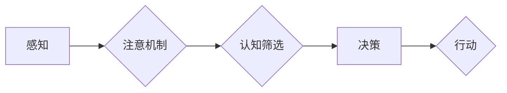

                 

## 理解洞察力的偏差：避免选择性注意

> 关键词：洞察力、选择性注意、认知偏差、偏见、数据分析、机器学习、人工智能

### 1. 背景介绍

在瞬息万变的科技时代，洞察力成为企业和个人取得成功的关键。洞察力是指从纷繁复杂的现象中识别出隐藏的模式、趋势和关系的能力，并以此做出明智的决策。然而，人类的认知并非完美无缺，我们往往会受到各种认知偏差的影响，导致洞察力受到阻碍。其中，选择性注意就是一种常见的认知偏差，它会让我们只关注与我们现有认知相符的信息，而忽略其他重要的信息。

选择性注意是指我们在大脑处理信息时，会优先关注与我们目标、兴趣或预期相符的信息，而忽略其他无关的信息。这种现象在日常生活中随处可见，例如：当你正在寻找丢失的钥匙时，你可能会忽略周围其他物品，只专注于寻找钥匙的可能性。

选择性注意虽然在某些情况下可以帮助我们提高效率，但它也可能导致我们陷入认知陷阱，形成偏见，并做出错误的判断。在数据分析和机器学习领域，选择性注意也会影响模型的训练和预测结果，导致模型产生偏差和错误。

### 2. 核心概念与联系

#### 2.1 选择性注意的原理

选择性注意的原理是基于人类大脑有限的处理能力。为了有效地处理大量信息，大脑会自动筛选和过滤信息，只关注与当前任务或目标相关的关键信息。这种筛选机制被称为“注意力机制”，它可以帮助我们快速识别重要信息，并做出决策。

然而，注意力机制也存在局限性。它会受到我们的认知偏见、情绪、经验和期望的影响，导致我们只关注与现有认知相符的信息，而忽略其他重要的信息。

#### 2.2 选择性注意的架构

选择性注意是一个复杂的过程，涉及多个认知模块的协同工作。



* **感知:** 接收来自外部环境的信息。
* **注意机制:** 选择哪些信息需要进一步处理。
* **认知筛选:** 对选择的信息进行分析和理解。
* **决策:** 根据分析结果做出决策。
* **行动:** 执行决策。

### 3. 核心算法原理 & 具体操作步骤

#### 3.1 算法原理概述

选择性注意算法旨在模拟人类大脑的注意力机制，并将其应用于数据分析和机器学习领域。这些算法通常基于深度学习技术，利用神经网络来学习和识别重要信息。

#### 3.2 算法步骤详解

1. **数据预处理:** 将原始数据进行清洗、转换和特征提取，以便于算法训练。
2. **模型构建:** 选择合适的深度学习模型，例如卷积神经网络 (CNN) 或循环神经网络 (RNN)，并根据任务需求进行调整。
3. **模型训练:** 使用训练数据训练模型，让模型学习识别重要信息。
4. **模型评估:** 使用测试数据评估模型的性能，并根据评估结果进行模型调优。
5. **模型应用:** 将训练好的模型应用于实际场景，例如文本摘要、图像识别、语音识别等。

#### 3.3 算法优缺点

**优点:**

* 可以有效地识别重要信息，提高数据分析和机器学习的效率。
* 可以学习复杂的模式和关系，并进行更精准的预测。

**缺点:**

* 需要大量的训练数据，训练成本较高。
* 模型的解释性较差，难以理解模型是如何做出决策的。
* 可能受到数据偏差的影响，导致模型产生偏见。

#### 3.4 算法应用领域

选择性注意算法在多个领域都有广泛的应用，例如：

* **自然语言处理:** 文本摘要、机器翻译、情感分析、问答系统等。
* **计算机视觉:** 图像识别、目标检测、图像分割等。
* **语音识别:** 语音转文本、语音助手等。
* **医疗诊断:** 病理图像分析、疾病预测等。

### 4. 数学模型和公式 & 详细讲解 & 举例说明

#### 4.1 数学模型构建

选择性注意算法通常使用概率模型来描述注意力机制。一个常见的模型是基于softmax函数的注意力机制，它将输入序列中的每个元素映射到一个概率分布，表示对每个元素的关注程度。

#### 4.2 公式推导过程

假设输入序列为 $x = (x_1, x_2, ..., x_n)$，则注意力权重 $a_i$ 可以通过以下公式计算：

$$a_i = \frac{exp(e_i)}{\sum_{j=1}^{n} exp(e_j)}$$

其中，$e_i$ 是每个元素 $x_i$ 与查询向量 $q$ 的相似度，可以使用点积或其他相似度度量方法计算。

#### 4.3 案例分析与讲解

例如，在机器翻译任务中，输入序列为源语言文本，查询向量为目标语言文本。注意力机制可以帮助模型关注源语言文本中与目标语言文本相关的关键信息，从而提高翻译质量。

### 5. 项目实践：代码实例和详细解释说明

#### 5.1 开发环境搭建

选择性注意算法的实现通常需要使用深度学习框架，例如TensorFlow或PyTorch。

#### 5.2 源代码详细实现

以下是一个使用TensorFlow实现简单选择性注意机制的代码示例：

```python
import tensorflow as tf

# 定义输入序列
input_sequence = tf.keras.Input(shape=(10,))

# 定义查询向量
query_vector = tf.keras.Input(shape=(10,))

# 计算注意力权重
attention_weights = tf.keras.layers.Dense(1, activation='softmax')(tf.keras.layers.Dot(axes=1)([input_sequence, query_vector]))

# 计算加权平均值
output = tf.keras.layers.Multiply()([input_sequence, attention_weights])

# 定义模型
model = tf.keras.Model(inputs=[input_sequence, query_vector], outputs=output)

# 编译模型
model.compile(optimizer='adam', loss='mse')

# 训练模型
model.fit(x=[input_data, query_data], y=target_data, epochs=10)
```

#### 5.3 代码解读与分析

* `tf.keras.Input` 定义输入层。
* `tf.keras.layers.Dense` 定义全连接层。
* `tf.keras.layers.Dot` 计算两个向量的点积。
* `tf.keras.layers.Activation` 应用激活函数。
* `tf.keras.Model` 定义模型。
* `model.compile` 编译模型。
* `model.fit` 训练模型。

#### 5.4 运行结果展示

训练完成后，可以使用测试数据评估模型的性能。

### 6. 实际应用场景

选择性注意算法在多个实际应用场景中发挥着重要作用，例如：

#### 6.1 文本摘要

选择性注意算法可以帮助模型识别文本中最重要的句子，并生成简洁的摘要。

#### 6.2 图像识别

选择性注意算法可以帮助模型关注图像中与目标物体相关的区域，提高识别准确率。

#### 6.3 语音识别

选择性注意算法可以帮助模型关注语音信号中重要的音素，提高识别准确率。

#### 6.4 未来应用展望

随着深度学习技术的不断发展，选择性注意算法的应用场景将更加广泛，例如：

* **个性化推荐:** 根据用户的兴趣和偏好，推荐更相关的商品或服务。
* **医疗诊断辅助:** 帮助医生识别病症和制定治疗方案。
* **自动驾驶:** 帮助车辆识别道路环境和做出决策。

### 7. 工具和资源推荐

#### 7.1 学习资源推荐

* **书籍:**
    * Deep Learning by Ian Goodfellow, Yoshua Bengio, and Aaron Courville
    * Attention Is All You Need by Ashish Vaswani et al.
* **在线课程:**
    * Stanford CS231n: Convolutional Neural Networks for Visual Recognition
    * Deep Learning Specialization by Andrew Ng

#### 7.2 开发工具推荐

* **TensorFlow:** https://www.tensorflow.org/
* **PyTorch:** https://pytorch.org/

#### 7.3 相关论文推荐

* **Attention Is All You Need:** https://arxiv.org/abs/1706.03762
* **BERT: Pre-training of Deep Bidirectional Transformers for Language Understanding:** https://arxiv.org/abs/1810.04805

### 8. 总结：未来发展趋势与挑战

#### 8.1 研究成果总结

选择性注意算法在数据分析和机器学习领域取得了显著的成果，有效地提高了模型的性能。

#### 8.2 未来发展趋势

未来，选择性注意算法将朝着以下方向发展：

* **更强大的模型:** 开发更复杂的注意力机制，能够学习更精细的模式和关系。
* **更广泛的应用:** 将选择性注意算法应用于更多领域，例如自动驾驶、医疗诊断、个性化推荐等。
* **更强的解释性:** 研究如何提高选择性注意算法的解释性，使模型的决策过程更加透明。

#### 8.3 面临的挑战

选择性注意算法也面临一些挑战：

* **数据依赖性:** 选择性注意算法需要大量的训练数据，而获取高质量的训练数据仍然是一个难题。
* **计算成本:** 训练复杂的注意力机制模型需要大量的计算资源，这对于资源有限的机构来说是一个挑战。
* **偏差问题:** 选择性注意算法可能受到数据偏差的影响，导致模型产生偏见。

#### 8.4 研究展望

未来，研究者将继续探索选择性注意算法的潜力，开发更强大、更广泛应用、更可解释的算法，推动人工智能技术的发展。

### 9. 附录：常见问题与解答

#### 9.1 什么是选择性注意？

选择性注意是指人类大脑在处理信息时，会优先关注与当前任务或目标相关的关键信息，而忽略其他无关的信息。

#### 9.2 选择性注意算法有什么优点？

选择性注意算法可以有效地识别重要信息，提高数据分析和机器学习的效率。

#### 9.3 选择性注意算法有什么缺点？

选择性注意算法需要大量的训练数据，训练成本较高。模型的解释性较差，难以理解模型是如何做出决策的。可能受到数据偏差的影响，导致模型产生偏见。

#### 9.4 选择性注意算法有哪些应用场景？

选择性注意算法在多个领域都有广泛的应用，例如：自然语言处理、计算机视觉、语音识别、医疗诊断等。


作者：禅与计算机程序设计艺术 / Zen and the Art of Computer Programming 
<end_of_turn>

