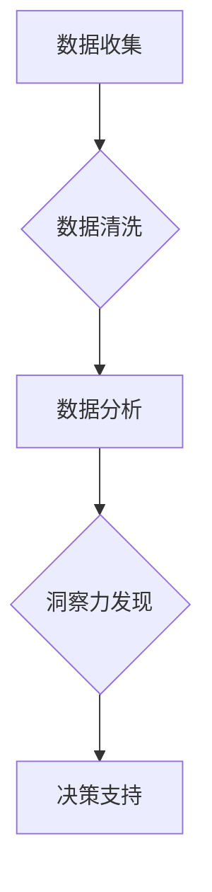

                 

## 理解洞察力：复杂世界中的导航仪

> 关键词：人工智能、洞察力、复杂系统、数据分析、机器学习、模式识别、预测建模、决策支持

### 1. 背景介绍

当今世界，我们身处信息爆炸的时代。海量数据无处不在，从社交媒体的动态到金融市场的波动，从医疗记录的积累到工业设备的运行数据，无不蕴藏着宝贵的洞察力。然而，仅仅拥有数据并不能带来真正的价值，我们需要能够从数据中提取有意义的信息，洞察隐藏的规律和趋势，从而做出更明智的决策。

传统的分析方法往往难以应对复杂系统的挑战。它们依赖于人类的经验和直觉，容易受到主观因素的影响，并且难以处理海量数据。而人工智能技术的兴起为我们提供了新的希望。通过机器学习、深度学习等算法，人工智能可以自动学习数据中的模式，识别隐藏的规律，并生成预测和建议，帮助我们更好地理解复杂世界。

### 2. 核心概念与联系

**2.1 洞察力**

洞察力是指从数据中发现隐藏的模式、趋势和关系的能力，并将其转化为有价值的知识和行动建议。它需要结合数据分析、逻辑推理、创造力以及对特定领域的专业知识。

**2.2 复杂系统**

复杂系统是指由众多相互作用的个体组成的系统，其整体行为难以通过简单的线性关系来描述。复杂系统具有以下特征：

* **非线性性:** 系统的输出与输入之间存在非线性的关系。
* **自组织性:** 系统能够自发地形成结构和模式。
* **反馈机制:** 系统内部存在反馈机制，可以调节系统的行为。
* **异质性:** 系统中的个体具有不同的属性和行为。

**2.3 人工智能**

人工智能是指模拟人类智能的计算机系统。它涵盖了多种技术，包括机器学习、深度学习、自然语言处理、计算机视觉等。

**2.4 数据分析**

数据分析是指从数据中提取有价值信息的过程。它包括数据收集、清洗、整理、分析和可视化等步骤。

**2.5 算法**

算法是指解决特定问题的步骤或规则。机器学习算法可以从数据中学习模式，并生成预测或建议。

**2.6 流程图**



### 3. 核心算法原理 & 具体操作步骤

**3.1 算法原理概述**

机器学习算法的核心原理是通过训练模型来学习数据中的模式。训练模型的过程可以看作是参数调整的过程。通过不断调整模型参数，使模型在预测或分类任务上的性能达到最佳。常见的机器学习算法包括：

* **监督学习:** 利用标记数据训练模型，例如分类和回归问题。
* **无监督学习:** 利用未标记数据训练模型，例如聚类和降维问题。
* **强化学习:** 通过奖励和惩罚机制训练模型，例如游戏和机器人控制问题。

**3.2 算法步骤详解**

1. **数据收集:** 收集与问题相关的原始数据。
2. **数据预处理:** 清洗、转换和格式化数据，使其适合模型训练。
3. **特征工程:** 从原始数据中提取有价值的特征，用于模型训练。
4. **模型选择:** 根据问题类型和数据特点选择合适的机器学习算法。
5. **模型训练:** 利用训练数据训练模型，并调整模型参数。
6. **模型评估:** 利用测试数据评估模型的性能，并进行调优。
7. **模型部署:** 将训练好的模型部署到实际应用场景中。

**3.3 算法优缺点**

不同的机器学习算法具有不同的优缺点，需要根据具体问题选择合适的算法。

* **优点:** 可以自动学习数据中的模式，提高预测精度，并处理海量数据。
* **缺点:** 需要大量训练数据，训练过程可能耗时，模型解释性较差。

**3.4 算法应用领域**

机器学习算法广泛应用于各个领域，例如：

* **医疗保健:** 疾病诊断、药物研发、患者风险评估。
* **金融:** 欺诈检测、信用评分、投资预测。
* **电商:** 商品推荐、用户画像、价格优化。
* **制造业:** 故障预测、质量控制、生产优化。

### 4. 数学模型和公式 & 详细讲解 & 举例说明

**4.1 数学模型构建**

机器学习算法通常基于数学模型进行构建。例如，线性回归模型可以表示为：

$$y = w_0 + w_1x_1 + w_2x_2 + ... + w_nx_n + \epsilon$$

其中：

* $y$ 是预测值
* $w_0, w_1, w_2, ..., w_n$ 是模型参数
* $x_1, x_2, ..., x_n$ 是输入特征
* $\epsilon$ 是误差项

**4.2 公式推导过程**

模型参数的学习过程通常使用梯度下降算法进行优化。梯度下降算法的目标是找到使模型预测误差最小化的参数值。

**4.3 案例分析与讲解**

假设我们想要预测房价，输入特征包括房屋面积、房间数量、地理位置等。我们可以使用线性回归模型进行预测。通过训练模型，我们可以得到每个特征对应的权重值，例如面积的权重值可能为1000，房间数量的权重值可能为500。

### 5. 项目实践：代码实例和详细解释说明

**5.1 开发环境搭建**

需要安装Python编程语言和相关的机器学习库，例如Scikit-learn。

**5.2 源代码详细实现**

```python
from sklearn.linear_model import LinearRegression
from sklearn.model_selection import train_test_split
import pandas as pd

# 加载数据
data = pd.read_csv('house_data.csv')

# 分割数据
X = data[['面积', '房间数量']]
y = data['价格']
X_train, X_test, y_train, y_test = train_test_split(X, y, test_size=0.2)

# 创建模型
model = LinearRegression()

# 训练模型
model.fit(X_train, y_train)

# 预测测试数据
y_pred = model.predict(X_test)

# 评估模型性能
print('模型性能:', model.score(X_test, y_test))
```

**5.3 代码解读与分析**

这段代码首先加载房价数据，然后将数据分割成训练集和测试集。接着创建线性回归模型，并使用训练集训练模型。最后使用测试集预测房价，并评估模型性能。

**5.4 运行结果展示**

运行结果会显示模型在测试集上的预测精度。

### 6. 实际应用场景

**6.1 医疗诊断**

人工智能可以帮助医生分析患者的医疗记录、影像数据等，识别潜在的疾病风险，并提供个性化的治疗方案。

**6.2 金融风险管理**

人工智能可以分析金融数据的异常模式，识别潜在的欺诈行为和金融风险，帮助金融机构进行风险控制。

**6.3 智能客服**

人工智能可以构建智能聊天机器人，为客户提供24小时在线服务，解答常见问题，提高客户体验。

**6.4 未来应用展望**

随着人工智能技术的不断发展，其应用场景将更加广泛，例如：

* **个性化教育:** 根据学生的学习情况，提供个性化的学习方案和辅导。
* **自动驾驶:** 利用人工智能技术，实现自动驾驶汽车的研发和应用。
* **科学研究:** 加速科学研究的进程，例如药物研发、材料科学等。

### 7. 工具和资源推荐

**7.1 学习资源推荐**

* **在线课程:** Coursera、edX、Udacity等平台提供丰富的机器学习课程。
* **书籍:** 《深入理解机器学习》、《Python机器学习实战》等书籍。
* **开源项目:** TensorFlow、PyTorch等开源机器学习框架。

**7.2 开发工具推荐**

* **Python:** 机器学习开发的常用编程语言。
* **Scikit-learn:** Python机器学习库。
* **TensorFlow:** Google开发的开源机器学习框架。
* **PyTorch:** Facebook开发的开源机器学习框架。

**7.3 相关论文推荐**

* **《机器学习》** by Tom Mitchell
* **《深度学习》** by Ian Goodfellow, Yoshua Bengio, and Aaron Courville

### 8. 总结：未来发展趋势与挑战

**8.1 研究成果总结**

人工智能技术取得了显著的进展，在各个领域都展现出巨大的应用潜力。

**8.2 未来发展趋势**

* **模型更加强大:** 模型规模和复杂度将不断提高，能够处理更复杂的任务。
* **算法更加高效:** 算法训练速度和效率将不断提升，降低模型训练成本。
* **应用更加广泛:** 人工智能将应用于更多领域，例如医疗、教育、金融等。

**8.3 面临的挑战**

* **数据安全和隐私:** 人工智能模型的训练需要大量数据，如何保证数据安全和隐私是一个重要挑战。
* **算法可解释性:** 许多人工智能算法的决策过程难以理解，如何提高算法的可解释性是一个关键问题。
* **伦理问题:** 人工智能技术的应用可能带来一些伦理问题，例如算法偏见、工作岗位替代等，需要引起重视。

**8.4 研究展望**

未来人工智能研究将继续探索更强大的模型、更有效的算法和更广泛的应用场景，并积极应对相关挑战，推动人工智能技术朝着更加安全、可解释和可持续的方向发展。

### 9. 附录：常见问题与解答

**9.1 如何选择合适的机器学习算法？**

选择合适的机器学习算法需要根据具体问题类型和数据特点进行考虑。例如，对于分类问题，可以考虑使用决策树、支持向量机等算法；对于回归问题，可以考虑使用线性回归、逻辑回归等算法。

**9.2 如何评估机器学习模型的性能？**

常用的机器学习模型性能评估指标包括准确率、召回率、F1-score、AUC等。

**9.3 如何处理机器学习模型中的过拟合问题？**

过拟合是指模型在训练数据上表现良好，但在测试数据上表现较差。可以采用正则化、交叉验证等方法来解决过拟合问题。


作者：禅与计算机程序设计艺术 / Zen and the Art of Computer Programming 
<end_of_turn>

