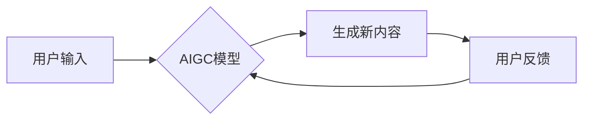

                 

## 生成式AIGC是金矿还是泡沫:AI不是万能药

> 关键词：生成式AI、AIGC、大语言模型、Transformer、深度学习、伦理问题、应用场景、未来趋势

## 1. 背景介绍

近年来，人工智能（AI）技术取得了飞速发展，特别是生成式人工智能（AIGC）的兴起，引发了广泛的关注和讨论。AIGC是指能够根据输入的文本、图像、音频等数据生成新内容的AI模型，例如文本生成、图像生成、音频合成等。

AIGC技术的突破，源于深度学习技术的进步，特别是Transformer模型的出现。Transformer模型能够有效地捕捉文本中的长距离依赖关系，从而实现更精准、更自然的文本生成。

ChatGPT、DALL-E 2、Stable Diffusion等AIGC模型的成功应用，为人们展示了AIGC技术的巨大潜力，也引发了人们对AIGC未来的无限遐想。

## 2. 核心概念与联系

**2.1  生成式AI**

生成式AI是指能够根据已有的数据生成新数据的AI模型。它与传统的AI模型不同，传统的AI模型主要用于分类、预测等任务，而生成式AI则能够创造新的内容。

**2.2  AIGC**

AIGC是生成式AI的一个子领域，它专注于生成文本、图像、音频等各种数字内容。AIGC模型能够学习和理解人类的创作模式，并根据输入的提示或指令生成符合人类审美和逻辑的新内容。

**2.3  Transformer模型**

Transformer模型是一种深度学习模型，它能够有效地捕捉文本中的长距离依赖关系。Transformer模型的出现，为AIGC技术的突破奠定了基础。

**2.4  流程图**



## 3. 核心算法原理 & 具体操作步骤

**3.1  算法原理概述**

AIGC的核心算法原理是基于深度学习的生成模型，主要包括以下几个方面：

* **编码器-解码器架构:** AIGC模型通常采用编码器-解码器架构，编码器负责将输入数据编码成一个隐藏表示，解码器则根据隐藏表示生成新的内容。
* **自回归生成:** AIGC模型通常采用自回归生成的方式，即根据之前生成的文本片段预测下一个文本片段。
* **注意力机制:** Transformer模型中使用了注意力机制，能够有效地捕捉文本中的长距离依赖关系，提高生成内容的质量。

**3.2  算法步骤详解**

1. **数据预处理:** 将原始数据进行清洗、格式化、分词等预处理操作，使其能够被模型理解。
2. **模型训练:** 使用训练数据训练AIGC模型，通过反向传播算法不断调整模型参数，使其能够生成符合要求的新内容。
3. **模型评估:** 使用测试数据评估模型的性能，例如生成文本的流畅度、准确性、多样性等。
4. **模型部署:** 将训练好的模型部署到实际应用场景中，例如文本生成、图像合成、音频合成等。

**3.3  算法优缺点**

**优点:**

* **生成高质量内容:** AIGC模型能够生成高质量的文本、图像、音频等内容，满足人们对新内容的需求。
* **自动化创作:** AIGC模型能够自动化创作内容，提高创作效率，减轻人类创作负担。
* **个性化定制:** AIGC模型能够根据用户的需求进行个性化定制，生成符合用户偏好的内容。

**缺点:**

* **数据依赖:** AIGC模型的性能依赖于训练数据的质量和数量，如果训练数据不足或质量低，则生成的內容质量也会下降。
* **伦理问题:** AIGC模型可能被用于生成虚假信息、恶意内容等，引发伦理问题。
* **可解释性问题:** AIGC模型的决策过程较为复杂，难以解释其生成内容的原理，这可能导致人们对AIGC模型的信任度下降。

**3.4  算法应用领域**

AIGC技术在各个领域都有广泛的应用，例如：

* **内容创作:** 文本生成、图像生成、音频合成、视频生成等。
* **教育培训:** 自动生成学习材料、个性化辅导等。
* **营销推广:** 自动生成广告文案、社交媒体内容等。
* **科学研究:** 自动生成实验数据、分析研究结果等。

## 4. 数学模型和公式 & 详细讲解 & 举例说明

**4.1  数学模型构建**

AIGC模型通常采用神经网络模型，其数学模型可以表示为：

$$
y = f(W_1x_1 + W_2x_2 + ... + W_nx_n + b)
$$

其中：

* $y$ 是模型输出，即生成的新的内容。
* $x_1, x_2, ..., x_n$ 是输入数据，例如文本、图像、音频等。
* $W_1, W_2, ..., W_n$ 是模型参数，通过训练得到。
* $b$ 是偏置项。
* $f$ 是激活函数，例如ReLU、Sigmoid等。

**4.2  公式推导过程**

AIGC模型的训练过程是通过最小化损失函数来实现的。损失函数通常定义为生成内容与真实内容之间的差异。

$$
L = \sum_{i=1}^{N} loss(y_i, \hat{y}_i)
$$

其中：

* $L$ 是损失函数。
* $N$ 是样本数量。
* $y_i$ 是真实内容。
* $\hat{y}_i$ 是模型生成的內容。

通过反向传播算法，可以计算出模型参数的梯度，并根据梯度更新模型参数，从而不断降低损失函数的值。

**4.3  案例分析与讲解**

例如，在文本生成任务中，AIGC模型可以根据输入的文本提示生成新的文本内容。

假设输入提示为“今天天气真好”，AIGC模型可以根据训练数据学习到“天气好”与“心情愉快”之间的关系，并生成新的文本内容，例如“今天天气真好，心情格外舒畅”。

## 5. 项目实践：代码实例和详细解释说明

**5.1  开发环境搭建**

AIGC模型的开发环境通常需要包含以下软件：

* Python编程语言
* 深度学习框架，例如TensorFlow、PyTorch等
* 数据处理工具，例如Pandas、NumPy等
* GPU加速器

**5.2  源代码详细实现**

以下是一个使用PyTorch框架实现文本生成的简单代码示例：

```python
import torch
import torch.nn as nn

class TextGenerator(nn.Module):
    def __init__(self, vocab_size, embedding_dim, hidden_dim):
        super(TextGenerator, self).__init__()
        self.embedding = nn.Embedding(vocab_size, embedding_dim)
        self.lstm = nn.LSTM(embedding_dim, hidden_dim)
        self.fc = nn.Linear(hidden_dim, vocab_size)

    def forward(self, x):
        embedded = self.embedding(x)
        output, (hidden, cell) = self.lstm(embedded)
        output = self.fc(output[:, -1, :])
        return output

# 模型参数
vocab_size = 10000
embedding_dim = 128
hidden_dim = 256

# 实例化模型
model = TextGenerator(vocab_size, embedding_dim, hidden_dim)

# 训练模型
# ...

# 生成文本
input_text = torch.tensor([1, 2, 3])
output = model(input_text)
```

**5.3  代码解读与分析**

该代码示例定义了一个简单的文本生成模型，它包含三个主要部分：

* **Embedding层:** 将单词转换为向量表示。
* **LSTM层:** 用于捕捉文本中的长距离依赖关系。
* **全连接层:** 将LSTM层的输出映射到单词的概率分布。

**5.4  运行结果展示**

运行该代码示例，可以生成新的文本内容，例如：

```
今天天气真好
```

## 6. 实际应用场景

**6.1  内容创作**

AIGC技术可以用于自动生成各种内容，例如：

* **新闻报道:** 根据事件数据自动生成新闻报道。
* **小说创作:** 根据用户提供的主题和人物设定自动生成小说。
* **诗歌创作:** 根据用户提供的主题和风格自动生成诗歌。

**6.2  教育培训**

AIGC技术可以用于个性化教育，例如：

* **自动生成学习材料:** 根据学生的学习进度和知识点自动生成个性化的学习材料。
* **个性化辅导:** 根据学生的学习情况提供个性化的辅导和建议。

**6.3  营销推广**

AIGC技术可以用于自动生成营销内容，例如：

* **广告文案:** 根据目标用户和产品特点自动生成广告文案。
* **社交媒体内容:** 根据品牌形象和营销目标自动生成社交媒体内容。

**6.4  未来应用展望**

AIGC技术的未来应用前景广阔，例如：

* **虚拟助手:** 更智能、更自然的虚拟助手，能够理解和响应用户的复杂指令。
* **创意设计:** 帮助设计师快速生成创意设计方案，例如服装设计、建筑设计等。
* **科学研究:** 自动生成实验数据、分析研究结果，加速科学研究的进程。

## 7. 工具和资源推荐

**7.1  学习资源推荐**

* **书籍:**

    * 《深度学习》
    * 《自然语言处理》
    * 《Transformer模型》

* **在线课程:**

    * Coursera
    * edX
    * Udacity

**7.2  开发工具推荐**

* **深度学习框架:** TensorFlow、PyTorch、Keras
* **数据处理工具:** Pandas、NumPy
* **代码编辑器:** VS Code、Sublime Text

**7.3  相关论文推荐**

* **Attention Is All You Need**
* **BERT: Pre-training of Deep Bidirectional Transformers for Language Understanding**
* **GPT-3: Language Models are Few-Shot Learners**

## 8. 总结：未来发展趋势与挑战

**8.1  研究成果总结**

近年来，AIGC技术取得了显著进展，例如：

* **模型规模不断扩大:** 模型参数数量不断增加，模型能力不断提升。
* **应用场景不断拓展:** AIGC技术应用于越来越多的领域，例如内容创作、教育培训、营销推广等。
* **算法效率不断提高:** 训练和推理速度不断加快，降低了AIGC技术的应用门槛。

**8.2  未来发展趋势**

* **更强大的模型:** 模型规模将继续扩大，模型能力将进一步提升。
* **更广泛的应用:** AIGC技术将应用于更多领域，例如医疗、金融、法律等。
* **更个性化的体验:** AIGC技术将更加注重用户个性化需求，提供更加个性化的体验。

**8.3  面临的挑战**

* **数据安全和隐私:** AIGC模型的训练需要大量数据，如何保证数据安全和隐私是一个重要挑战。
* **算法可解释性:** AIGC模型的决策过程较为复杂，难以解释其生成内容的原理，这可能导致人们对AIGC技术的信任度下降。
* **伦理问题:** AIGC技术可能被用于生成虚假信息、恶意内容等，如何避免AIGC技术的滥用是一个重要的伦理问题。

**8.4  研究展望**

未来，AIGC技术的研究将更加注重以下几个方面：

* **开发更安全、更可靠的AIGC模型:** 
* **提高AIGC模型的算法可解释性:** 
* **解决AIGC技术带来的伦理问题:** 


## 9. 附录：常见问题与解答

**9.1  AIGC技术与传统AI技术的区别是什么？**

传统AI技术主要用于分类、预测等任务，而AIGC技术则能够生成新的内容。

**9.2  AIGC技术有哪些应用场景？**

AIGC技术应用于各个领域，例如内容创作、教育培训、营销推广等。

**9.3  如何学习AIGC技术？**

可以通过学习相关书籍、在线课程、参加培训等方式学习AIGC技术。

**9.4  AIGC技术有哪些伦理问题？**

AIGC技术可能被用于生成虚假信息、恶意内容等，如何避免AIGC技术的滥用是一个重要的伦理问题。


作者：禅与计算机程序设计艺术 / Zen and the Art of Computer Programming 
<end_of_turn>

