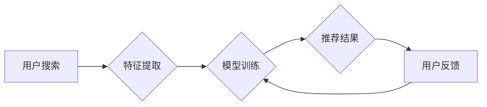

                 

## 电商平台的AI 大模型转型：搜索推荐系统是核心，用户体验优化是关键

> 关键词：电商平台、AI大模型、搜索推荐系统、用户体验、深度学习、Transformer、个性化推荐、模型训练、数据标注

## 1. 背景介绍

随着人工智能技术的飞速发展，电商平台正经历着一场深刻的变革。传统基于规则的搜索推荐系统已难以满足用户日益增长的个性化需求，而基于深度学习的AI大模型则成为推动电商平台转型升级的关键力量。

AI大模型在电商平台的应用场景日益广泛，涵盖搜索推荐、商品分类、客户服务、营销推广等多个领域。其中，搜索推荐系统作为电商平台的核心功能之一，其精准度和用户体验直接影响着平台的商业成功。

## 2. 核心概念与联系

### 2.1  AI大模型

AI大模型是指在海量数据上训练的深度学习模型，拥有强大的泛化能力和学习能力。其核心特点包括：

* **规模庞大:** 参数数量巨大，通常包含数十亿甚至数千亿个参数。
* **多任务学习:** 可以同时学习多个相关任务，例如文本分类、机器翻译、图像识别等。
* **迁移学习:** 可以将预训练模型在特定领域进行微调，快速适应新的任务。

### 2.2  搜索推荐系统

搜索推荐系统旨在根据用户的搜索行为和偏好，推荐相关商品或内容。其核心目标是提高用户满意度和转化率。

传统搜索推荐系统主要依赖于规则引擎和特征工程，而AI大模型则可以学习用户行为和商品特征的复杂关系，提供更精准和个性化的推荐结果。

### 2.3  核心架构

AI大模型在电商平台的搜索推荐系统中扮演着至关重要的角色，其核心架构如下：



**流程说明:**

1. 用户输入搜索关键词。
2. 系统提取用户搜索关键词、历史浏览记录、购买行为等特征。
3. 将提取的特征输入到预训练的AI大模型进行训练。
4. 模型根据训练结果生成推荐结果，并展示给用户。
5. 用户对推荐结果进行反馈，例如点击、购买、收藏等。
6. 用户反馈信息反馈到模型训练环节，不断优化模型性能。

## 3. 核心算法原理 & 具体操作步骤

### 3.1  算法原理概述

在电商平台的搜索推荐系统中，常用的AI大模型算法包括：

* **深度神经网络 (DNN):** 能够学习数据中的复杂非线性关系，是推荐系统的基础算法。
* **卷积神经网络 (CNN):** 擅长处理图像和文本数据，可以提取商品特征和用户行为模式。
* **循环神经网络 (RNN):** 能够处理序列数据，例如用户浏览历史，可以预测用户的下一个行为。
* **Transformer:** 是一种新型的深度学习模型，能够捕捉长距离依赖关系，在自然语言处理和推荐系统中取得了优异的性能。

### 3.2  算法步骤详解

以Transformer模型为例，其训练步骤如下：

1. **数据预处理:** 收集用户行为数据、商品信息数据等，并进行清洗、格式化、编码等预处理操作。
2. **模型构建:** 根据Transformer模型架构，构建模型结构，包括编码器、解码器、注意力机制等模块。
3. **模型训练:** 使用训练数据训练模型，优化模型参数，使其能够准确预测用户点击、购买等行为。
4. **模型评估:** 使用测试数据评估模型性能，例如准确率、召回率、AUC等指标。
5. **模型部署:** 将训练好的模型部署到线上环境，用于实时推荐商品。

### 3.3  算法优缺点

**优点:**

* **高准确率:** Transformer模型能够捕捉数据中的复杂关系，提高推荐系统的准确率。
* **个性化推荐:** 可以根据用户的历史行为和偏好，提供个性化的推荐结果。
* **可扩展性强:** 可以根据数据规模和需求，灵活调整模型参数和架构。

**缺点:**

* **训练成本高:** Transformer模型参数数量巨大，训练成本较高。
* **数据依赖性强:** 模型性能依赖于训练数据的质量和数量。
* **解释性差:** Transformer模型的内部机制较为复杂，难以解释其推荐结果背后的逻辑。

### 3.4  算法应用领域

Transformer模型在电商平台搜索推荐系统之外，还广泛应用于其他领域，例如：

* **自然语言处理:** 机器翻译、文本摘要、问答系统等。
* **计算机视觉:** 图像识别、目标检测、图像生成等。
* **语音识别:** 语音转文本、语音合成等。

## 4. 数学模型和公式 & 详细讲解 & 举例说明

### 4.1  数学模型构建

Transformer模型的核心是注意力机制，其数学模型可以表示为：

$$
Attention(Q, K, V) = softmax(\frac{QK^T}{\sqrt{d_k}})V
$$

其中：

* $Q$：查询矩阵
* $K$：键矩阵
* $V$：值矩阵
* $d_k$：键向量的维度
* $softmax$：softmax函数

### 4.2  公式推导过程

注意力机制的目的是计算查询向量与键向量的相关性，并根据相关性权重加权求和值向量。

1. 计算查询向量与每个键向量的点积，得到一个得分矩阵。
2. 对得分矩阵进行softmax归一化，得到每个键向量的权重。
3. 将权重与值向量进行加权求和，得到最终的输出向量。

### 4.3  案例分析与讲解

假设我们有一个电商平台，用户搜索关键词“手机”。

* $Q$：用户搜索关键词“手机”对应的查询向量。
* $K$：所有商品的关键词对应的键向量。
* $V$：所有商品的商品信息对应的值向量。

通过注意力机制，模型可以计算出用户搜索关键词“手机”与每个商品关键词的相关性，并根据相关性权重加权求和商品信息，最终推荐与用户搜索关键词最相关的商品。

## 5. 项目实践：代码实例和详细解释说明

### 5.1  开发环境搭建

* Python 3.7+
* TensorFlow/PyTorch深度学习框架
* Jupyter Notebook/VS Code开发环境

### 5.2  源代码详细实现

```python
import tensorflow as tf

# 定义Transformer模型
class Transformer(tf.keras.Model):
    def __init__(self, vocab_size, embedding_dim, num_heads, num_layers):
        super(Transformer, self).__init__()
        self.embedding = tf.keras.layers.Embedding(vocab_size, embedding_dim)
        self.transformer_layers = tf.keras.layers.StackedRNNCells([
            tf.keras.layers.MultiHeadAttention(num_heads=num_heads, key_dim=embedding_dim)
            for _ in range(num_layers)
        ])

    def call(self, inputs):
        embeddings = self.embedding(inputs)
        outputs = self.transformer_layers(embeddings)
        return outputs

# 实例化模型
model = Transformer(vocab_size=10000, embedding_dim=128, num_heads=8, num_layers=6)

# 训练模型
model.compile(optimizer='adam', loss='mse')
model.fit(x_train, y_train, epochs=10)

# 预测结果
predictions = model.predict(x_test)
```

### 5.3  代码解读与分析

* **模型定义:** 定义了一个Transformer模型，包含嵌入层、多头注意力层和堆叠的RNN层。
* **模型实例化:** 实例化模型，设置模型参数，例如词汇大小、嵌入维度、注意力头数、层数等。
* **模型训练:** 使用Adam优化器和均方误差损失函数训练模型。
* **模型预测:** 使用训练好的模型预测测试数据。

### 5.4  运行结果展示

训练完成后，可以评估模型性能，例如准确率、召回率、AUC等指标。

## 6. 实际应用场景

### 6.1  商品推荐

AI大模型可以根据用户的浏览历史、购买记录、评分等信息，推荐用户可能感兴趣的商品。

### 6.2  个性化搜索

AI大模型可以理解用户的搜索意图，并根据用户的个性化偏好，提供更精准的搜索结果。

### 6.3  内容推荐

AI大模型可以根据用户的阅读历史、点赞记录等信息，推荐用户可能感兴趣的文章、视频、音频等内容。

### 6.4  未来应用展望

随着AI技术的不断发展，AI大模型在电商平台的应用场景将更加广泛，例如：

* **智能客服:** 使用AI大模型构建智能客服系统，自动回答用户常见问题，提高客户服务效率。
* **营销推广:** 使用AI大模型进行精准营销，根据用户的兴趣爱好和行为特征，推送个性化的广告和促销信息。
* **供应链管理:** 使用AI大模型优化供应链管理，预测商品需求、优化库存管理、提高物流效率。

## 7. 工具和资源推荐

### 7.1  学习资源推荐

* **书籍:**
    * 《深度学习》
    * 《自然语言处理》
    * 《Transformer模型详解》
* **在线课程:**
    * Coursera深度学习课程
    * Udacity自然语言处理课程
    * fast.ai深度学习课程

### 7.2  开发工具推荐

* **TensorFlow:** 开源深度学习框架，支持多种模型类型和硬件平台。
* **PyTorch:** 开源深度学习框架，以其灵活性和易用性而闻名。
* **HuggingFace:** 提供预训练模型和工具，方便用户快速构建和部署AI模型。

### 7.3  相关论文推荐

* 《Attention Is All You Need》
* 《BERT: Pre-training of Deep Bidirectional Transformers for Language Understanding》
* 《GPT-3: Language Models are Few-Shot Learners》

## 8. 总结：未来发展趋势与挑战

### 8.1  研究成果总结

AI大模型在电商平台的搜索推荐系统中取得了显著的成果，提高了推荐系统的准确率和用户体验。

### 8.2  未来发展趋势

* **模型规模更大:** 未来AI大模型将拥有更大的参数规模，能够学习更复杂的知识和关系。
* **多模态融合:** AI大模型将融合文本、图像、音频等多模态数据，提供更全面的用户体验。
* **个性化定制:** AI大模型将更加注重个性化定制，根据用户的具体需求提供更精准的推荐结果。

### 8.3  面临的挑战

* **数据安全和隐私:** AI大模型的训练需要大量用户数据，如何保障数据安全和用户隐私是一个重要挑战。
* **模型解释性和可控性:** AI大模型的内部机制较为复杂，难以解释其推荐结果背后的逻辑，如何提高模型的解释性和可控性也是一个重要挑战。
* **计算资源和成本:** 训练大型AI模型需要大量的计算资源和成本，如何降低训练成本也是一个重要挑战。

### 8.4  研究展望

未来，AI大模型在电商平台的应用将更加广泛和深入，其研究方向包括：

* **开发更有效的训练算法:** 提高模型训练效率和准确率。
* **设计更鲁棒和可解释的模型:** 增强模型的安全性、可靠性和可解释性。
* **探索新的应用场景:** 将AI大模型应用于更多电商平台的业务场景。

## 9. 附录：常见问题与解答

### 9.1  Q: 如何选择合适的AI大模型？

**A:** 选择合适的AI大模型需要根据具体应用场景、数据规模、计算资源等因素进行综合考虑。

### 9.2  Q: 如何评估AI大模型的性能？

**A:** 可以使用准确率、召回率、AUC等指标评估AI大模型的性能。

### 9.3  Q: 如何部署AI大模型？

**A:** 可以使用云平台、容器技术等方式部署AI大模型。


作者：禅与计算机程序设计艺术 / Zen and the Art of Computer Programming 
<end_of_turn>

