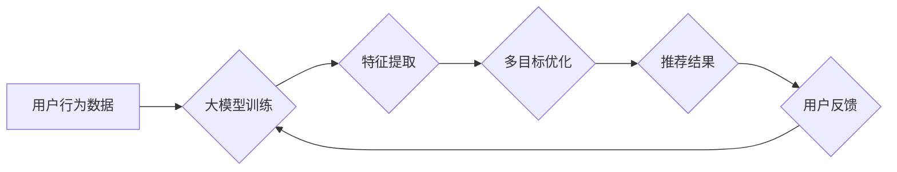

                 

## 关键词：电商推荐、多目标优化、大模型、权衡方案、个性化推荐、协同过滤、深度学习

## 1. 背景介绍

在当今数据爆炸的时代，电商平台面临着日益激烈的竞争。如何精准推荐商品，提升用户体验，并最终促进交易，成为电商平台的核心挑战。传统的电商推荐系统主要依赖于协同过滤和基于内容的过滤算法，但这些方法在面对海量数据和用户个性化需求时，往往表现力不足。

近年来，大模型的兴起为电商推荐带来了新的机遇。大模型凭借其强大的学习能力和泛化能力，能够从海量数据中挖掘更深层的用户偏好和商品特征，从而实现更精准、更个性化的推荐。然而，大模型的训练和部署成本高昂，且容易陷入过拟合和数据孤岛等问题。

因此，如何在充分利用大模型优势的同时，兼顾成本控制和推荐效果，成为电商推荐领域亟待解决的关键问题。

## 2. 核心概念与联系

### 2.1 多目标优化

多目标优化是指同时优化多个目标函数，而这些目标函数之间可能存在冲突。在电商推荐中，常见的多目标优化问题包括：

* **推荐准确率:** 推荐结果与用户真实偏好程度的匹配度。
* **覆盖率:** 推荐结果能够覆盖的用户数量。
* **多样性:** 推荐结果的商品类别和属性的多样性。
* **点击率:** 用户点击推荐结果的概率。
* **转化率:** 用户点击推荐结果后最终完成购买的概率。

### 2.2 大模型

大模型是指参数量巨大、训练数据海量的人工智能模型。大模型通常采用深度学习架构，例如 Transformer，能够学习到更复杂的特征表示，并实现更强大的泛化能力。

### 2.3 权衡方案

权衡方案是指在多目标优化问题中，如何平衡不同目标函数之间的冲突。常见的权衡方案包括：

* **加权求和法:** 为每个目标函数赋予权重，然后将所有目标函数的加权和作为优化目标。
* **Pareto最优解:** 寻找所有目标函数都无法同时改进的解集，即 Pareto 最优解。
* **多目标进化算法:** 使用进化算法，通过迭代搜索，找到最优的权衡方案。

**Mermaid 流程图**



## 3. 核心算法原理 & 具体操作步骤

### 3.1 算法原理概述

在电商推荐中，多目标优化通常采用深度强化学习 (Deep Reinforcement Learning) 算法。

深度强化学习算法的核心思想是，将推荐系统视为一个马尔可夫决策过程 (Markov Decision Process)，其中：

* **状态:** 用户的上下文信息，例如用户历史行为、商品属性等。
* **动作:** 推荐给用户的商品。
* **奖励:** 用户对推荐结果的反馈，例如点击、购买等。

深度强化学习算法通过训练一个代理 (Agent)，让代理在不同的状态下选择最优的动作，从而最大化累积奖励。

### 3.2 算法步骤详解

1. **环境构建:** 建立电商推荐环境，包括用户数据、商品数据、推荐策略等。
2. **代理设计:** 设计深度强化学习代理，例如使用 DQN 或 PPO 算法。
3. **奖励函数设计:** 设计奖励函数，衡量推荐结果的质量，例如点击率、转化率等。
4. **训练过程:** 使用强化学习算法训练代理，让代理在环境中学习最优的推荐策略。
5. **部署与评估:** 将训练好的代理部署到线上环境，并不断收集用户反馈，进行模型评估和优化。

### 3.3 算法优缺点

**优点:**

* 能够学习到更复杂的推荐策略。
* 可以根据用户反馈动态调整推荐策略。
* 能够实现个性化推荐。

**缺点:**

* 训练成本高昂。
* 需要大量的用户反馈数据。
* 算法复杂度高，调试难度大。

### 3.4 算法应用领域

深度强化学习算法在电商推荐领域有着广泛的应用，例如：

* **个性化推荐:** 根据用户的历史行为和偏好，推荐个性化的商品。
* **商品排序:** 对推荐结果进行排序，提升用户体验。
* **广告推荐:** 根据用户的兴趣和行为，推荐相关的广告。

## 4. 数学模型和公式 & 详细讲解 & 举例说明

### 4.1 数学模型构建

在深度强化学习算法中，推荐系统通常被建模为一个马尔可夫决策过程 (MDP)。

MDP 由以下几个要素组成：

* **状态空间 (S):** 所有可能的系统状态的集合。
* **动作空间 (A):** 在每个状态下可以采取的所有动作的集合。
* **转移概率 (P):** 从一个状态到另一个状态的概率。
* **奖励函数 (R):** 在每个状态下采取某个动作得到的奖励。

### 4.2 公式推导过程

深度强化学习算法的目标是找到一个策略 (π)，使得在执行该策略时，累积奖励最大化。

常用的策略梯度算法，例如 PPO，通过以下公式更新策略参数：

$$
\theta_{t+1} = \theta_t + \alpha \nabla_{\theta} \hat{A}(\theta_t)
$$

其中：

* $\theta$ 是策略参数。
* $\alpha$ 是学习率。
* $\hat{A}(\theta)$ 是策略梯度估计值。

### 4.3 案例分析与讲解

假设一个电商平台要推荐商品给用户。

* **状态空间:** 用户的上下文信息，例如用户历史购买记录、浏览记录、性别、年龄等。
* **动作空间:** 推荐给用户的商品。
* **转移概率:** 用户点击某个商品后，跳转到商品详情页的概率。
* **奖励函数:** 用户购买商品的概率。

深度强化学习算法可以训练一个代理，让代理根据用户的上下文信息，选择最有可能导致用户购买的商品。

## 5. 项目实践：代码实例和详细解释说明

### 5.1 开发环境搭建

* Python 3.7+
* TensorFlow 2.0+
* PyTorch 1.0+
* CUDA 10.0+

### 5.2 源代码详细实现

```python
import tensorflow as tf

# 定义神经网络模型
class RecommenderModel(tf.keras.Model):
    def __init__(self, units):
        super(RecommenderModel, self).__init__()
        self.dense1 = tf.keras.layers.Dense(units, activation='relu')
        self.dense2 = tf.keras.layers.Dense(units, activation='relu')
        self.output = tf.keras.layers.Dense(1, activation='sigmoid')

    def call(self, inputs):
        x = self.dense1(inputs)
        x = self.dense2(x)
        return self.output(x)

# 定义强化学习代理
class RecommenderAgent(tf.keras.Model):
    def __init__(self, model, optimizer):
        super(RecommenderAgent, self).__init__()
        self.model = model
        self.optimizer = optimizer

    def act(self, state):
        # 根据状态预测推荐商品的概率
        probs = self.model(state)
        # 选择概率最高的商品
        action = tf.argmax(probs)
        return action

    def train(self, states, actions, rewards):
        # 计算策略梯度
        with tf.GradientTape() as tape:
            # 计算策略梯度估计值
            loss = -tf.reduce_mean(rewards * tf.log(self.model(states)))
        # 更新策略参数
        gradients = tape.gradient(loss, self.model.trainable_variables)
        self.optimizer.apply_gradients(zip(gradients, self.model.trainable_variables))

# 训练强化学习代理
model = RecommenderModel(units=128)
optimizer = tf.keras.optimizers.Adam(learning_rate=0.001)
agent = RecommenderAgent(model, optimizer)

# 使用强化学习算法训练代理
for epoch in range(100):
    # 训练数据
    states = ...
    actions = ...
    rewards = ...
    # 训练代理
    agent.train(states, actions, rewards)

# 部署训练好的代理
# ...
```

### 5.3 代码解读与分析

* **RecommenderModel:** 定义了推荐模型，使用两层全连接神经网络，输出商品推荐概率。
* **RecommenderAgent:** 定义了强化学习代理，包含推荐模型和优化器。
* **act()方法:** 根据用户状态预测推荐商品概率，选择概率最高的商品。
* **train()方法:** 计算策略梯度，更新推荐模型参数。

### 5.4 运行结果展示

训练完成后，可以评估代理的推荐效果，例如点击率、转化率等。

## 6. 实际应用场景

### 6.1 个性化推荐

大模型可以学习到用户的细粒度偏好，实现更精准的个性化推荐。例如，根据用户的浏览历史、购买记录、评论等信息，推荐用户可能感兴趣的商品。

### 6.2 商品排序

大模型可以对推荐结果进行排序，提升用户体验。例如，根据用户的兴趣和行为，将推荐结果排序，优先展示用户更感兴趣的商品。

### 6.3 广告推荐

大模型可以根据用户的兴趣和行为，推荐相关的广告。例如，根据用户的浏览记录和购买历史，推荐用户可能感兴趣的商品广告。

### 6.4 未来应用展望

随着大模型技术的不断发展，电商推荐领域将迎来更多创新应用，例如：

* **多模态推荐:** 结合文本、图像、视频等多模态数据，实现更丰富的推荐体验。
* **实时推荐:** 基于用户的实时行为，动态调整推荐策略，提供更精准的推荐。
* **协同推荐:** 利用用户之间的关联关系，实现更个性化的推荐。

## 7. 工具和资源推荐

### 7.1 学习资源推荐

* **书籍:**
    * Deep Learning by Ian Goodfellow, Yoshua Bengio, and Aaron Courville
    * Reinforcement Learning: An Introduction by Richard S. Sutton and Andrew G. Barto
* **课程:**
    * Deep Learning Specialization by Andrew Ng (Coursera)
    * Reinforcement Learning by David Silver (DeepMind)
* **博客:**
    * OpenAI Blog
    * DeepMind Blog

### 7.2 开发工具推荐

* **TensorFlow:** 开源深度学习框架
* **PyTorch:** 开源深度学习框架
* **Keras:** 高级深度学习API

### 7.3 相关论文推荐

* **Attention Is All You Need:** https://arxiv.org/abs/1706.03762
* **Proximal Policy Optimization Algorithms:** https://arxiv.org/abs/1707.06347
* **Deep Reinforcement Learning with Double Q-learning:** https://arxiv.org/abs/1509.06461

## 8. 总结：未来发展趋势与挑战

### 8.1 研究成果总结

大模型在电商推荐领域取得了显著的成果，能够实现更精准、更个性化的推荐。

### 8.2 未来发展趋势

* **模型规模与能力提升:** 大模型的规模和能力将继续提升，能够学习到更复杂的特征表示。
* **多模态融合:** 大模型将融合文本、图像、视频等多模态数据，实现更丰富的推荐体验。
* **实时推荐:** 大模型将能够基于用户的实时行为，动态调整推荐策略。

### 8.3 面临的挑战

* **训练成本:** 大模型的训练成本高昂，需要大量的计算资源和数据。
* **数据孤岛:** 数据分散、难以整合是电商推荐领域面临的挑战。
* **模型解释性:** 大模型的决策过程难以解释，缺乏透明度。

### 8.4 研究展望

未来研究将重点关注以下几个方面:

* **高效训练方法:** 研究更有效的训练方法，降低大模型的训练成本。
* **数据整合技术:** 研究数据整合技术，解决数据孤岛问题。
* **模型可解释性:** 研究模型可解释性技术，提高大模型的透明度。


## 9. 附录：常见问题与解答

**Q1: 大模型的训练需要多少数据？**

A1: 大模型的训练需要海量数据，通常需要百万甚至数十亿条数据。

**Q2: 如何评估大模型的推荐效果？**

A2: 大模型的推荐效果可以通过点击率、转化率、用户满意度等指标进行评估。

**Q3: 如何解决大模型的过拟合问题？**

A3: 可以使用正则化技术、数据增强、Dropout等方法来解决大模型的过拟合问题。


作者：禅与计算机程序设计艺术 / Zen and the Art of Computer Programming 
<end_of_turn>

