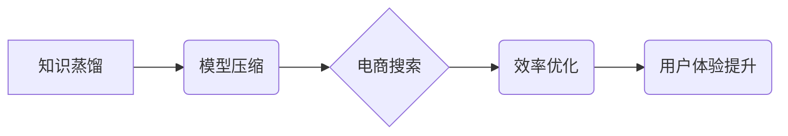

                 

## 电商搜索中的知识蒸馏与模型压缩技术

> 关键词：知识蒸馏、模型压缩、电商搜索、深度学习、效率优化、推荐系统

## 1. 背景介绍

电商搜索是电商平台的核心功能之一，用户通过搜索引擎查找所需商品，最终完成购买。随着电商平台的规模不断扩大，用户搜索需求日益复杂，对搜索引擎的准确性和效率提出了更高的要求。深度学习技术在自然语言处理和信息检索领域取得了显著进展，为电商搜索带来了新的机遇。然而，深度学习模型通常具有参数量大、计算复杂度高、部署成本高等问题，难以满足电商搜索的实时性和低延迟需求。

知识蒸馏和模型压缩是近年来深度学习领域研究的热点技术，旨在通过知识迁移和模型精简，提升模型的效率和性能。知识蒸馏通过将大模型的知识“蒸馏”到小模型中，实现模型压缩和性能提升；模型压缩通过各种技术手段，例如权值量化、剪枝、知识蒸馏等，减少模型参数量，降低模型的计算复杂度。

## 2. 核心概念与联系

### 2.1 知识蒸馏

知识蒸馏是一种机器学习的迁移学习技术，它通过将一个大型模型（教师模型）的知识“蒸馏”到一个小型模型（学生模型）中，从而实现模型压缩和性能提升。

教师模型通常是一个经过充分训练的深度学习模型，拥有丰富的知识和表达能力。学生模型则是一个参数量更小的模型，在部署和推理时更具效率。知识蒸馏通过调整学生模型的训练目标，使其学习教师模型的知识，例如预测输出的概率分布、中间层的激活值等。

### 2.2 模型压缩

模型压缩是指通过各种技术手段，减少深度学习模型的参数量，降低模型的计算复杂度，从而提升模型的效率和部署成本。

常见的模型压缩技术包括：

* **权值量化:** 将模型参数的精度降低，例如将32位浮点数转换为8位整数，从而减少模型参数的存储空间和计算量。
* **剪枝:** 移除模型中不重要的权值，例如将权值小于一定阈值的连接剪除，从而减少模型参数量。
* **知识蒸馏:** 将大型模型的知识“蒸馏”到小型模型中，从而实现模型压缩和性能提升。

### 2.3 电商搜索

电商搜索是指用户在电商平台上输入关键词，搜索平台根据用户需求，从海量商品中筛选出相关商品，并将其以排序列表的形式展示给用户。

电商搜索系统通常包含以下模块：

* **信息获取:** 收集用户搜索词、商品信息、用户行为等数据。
* **数据预处理:** 对数据进行清洗、转换、特征提取等处理。
* **模型训练:** 利用深度学习模型，训练商品分类、排序、推荐等模型。
* **结果展示:** 将搜索结果以排序列表的形式展示给用户。

### 2.4 核心概念关系



## 3. 核心算法原理 & 具体操作步骤

### 3.1 算法原理概述

知识蒸馏的核心原理是通过调整学生模型的训练目标，使其学习教师模型的知识。教师模型通常是一个经过充分训练的深度学习模型，拥有丰富的知识和表达能力。学生模型则是一个参数量更小的模型，在部署和推理时更具效率。

知识蒸馏通过将教师模型的输出作为监督信号，训练学生模型。除了预测最终输出标签外，学生模型还需要预测教师模型的中间层激活值或概率分布。这种多任务学习策略使得学生模型能够学习到教师模型更深层的知识和表示能力。

### 3.2 算法步骤详解

1. **选择教师模型和学生模型:** 选择一个性能优良的深度学习模型作为教师模型，并选择一个参数量更小的模型作为学生模型。
2. **预训练教师模型:** 对教师模型进行充分的预训练，使其拥有丰富的知识和表达能力。
3. **调整学生模型训练目标:** 将教师模型的输出作为监督信号，训练学生模型。除了预测最终输出标签外，学生模型还需要预测教师模型的中间层激活值或概率分布。
4. **训练学生模型:** 使用调整后的训练目标，训练学生模型。
5. **评估学生模型性能:** 使用测试集评估学生模型的性能，并与教师模型进行比较。

### 3.3 算法优缺点

**优点:**

* **模型压缩:** 可以有效地压缩模型参数量，降低模型的计算复杂度。
* **性能提升:** 可以提升学生模型的性能，使其接近或超过教师模型的性能。
* **知识迁移:** 可以将教师模型的知识迁移到学生模型中，提高模型的泛化能力。

**缺点:**

* **训练复杂度:** 知识蒸馏的训练过程比传统的模型训练过程更复杂。
* **教师模型依赖:** 学生模型的性能依赖于教师模型的质量。
* **参数选择:** 需要选择合适的教师模型、学生模型和训练参数。

### 3.4 算法应用领域

知识蒸馏和模型压缩技术在许多领域都有广泛的应用，例如：

* **图像识别:** 将大型图像识别模型压缩到更小的模型，用于移动设备和嵌入式系统。
* **自然语言处理:** 将大型语言模型压缩到更小的模型，用于文本分类、机器翻译等任务。
* **语音识别:** 将大型语音识别模型压缩到更小的模型，用于语音助手和语音搜索等应用。
* **电商搜索:** 将大型电商搜索模型压缩到更小的模型，提高搜索效率和用户体验。

## 4. 数学模型和公式 & 详细讲解 & 举例说明

### 4.1 数学模型构建

知识蒸馏的目标是训练一个学生模型，使其能够模仿教师模型的知识和表达能力。

假设教师模型的输出为 $y_t$，学生模型的输出为 $y_s$。知识蒸馏的目标函数可以定义为：

$$
L = L_{CE}(y_s, y_t) + \lambda L_{KD}(y_s, y_t)
$$

其中：

* $L_{CE}$ 是交叉熵损失函数，用于衡量学生模型预测标签与真实标签之间的差异。
* $L_{KD}$ 是知识蒸馏损失函数，用于衡量学生模型的输出与教师模型的输出之间的差异。
* $\lambda$ 是平衡系数，用于控制知识蒸馏损失和交叉熵损失的权重。

### 4.2 公式推导过程

知识蒸馏损失函数 $L_{KD}$ 的具体形式有多种，常见的形式包括：

* **Soft Target Distillation:**

$$
L_{KD} = -\sum_{i} y_t(i) \log y_s(i)
$$

其中 $y_t(i)$ 是教师模型对第 $i$ 个类别的预测概率， $y_s(i)$ 是学生模型对第 $i$ 个类别的预测概率。

* **Hard Target Distillation:**

$$
L_{KD} = \sum_{i} \left[ y_t(i) \log y_s(i) + (1-y_t(i)) \log (1-y_s(i)) \right]
$$

其中 $y_t(i)$ 是教师模型对第 $i$ 个类别的预测标签， $y_s(i)$ 是学生模型对第 $i$ 个类别的预测标签。

### 4.3 案例分析与讲解

假设我们有一个图像分类任务，使用 ResNet-50 作为教师模型，并训练一个更小的 MobileNet 模型作为学生模型。

在知识蒸馏过程中，我们可以使用 Soft Target Distillation 作为知识蒸馏损失函数。

训练过程中，教师模型的输出作为学生模型的监督信号，学生模型需要预测教师模型的输出概率分布。

通过这种方式，学生模型能够学习到教师模型更深层的知识和表示能力，从而提升其图像分类性能。

## 5. 项目实践：代码实例和详细解释说明

### 5.1 开发环境搭建

* Python 3.7+
* TensorFlow 2.0+
* PyTorch 1.0+
* CUDA Toolkit 10.2+ (可选)

### 5.2 源代码详细实现

```python
# 导入必要的库
import tensorflow as tf

# 定义教师模型和学生模型
teacher_model = tf.keras.applications.ResNet50(weights='imagenet')
student_model = tf.keras.applications.MobileNetV2(weights=None)

# 定义知识蒸馏损失函数
def distillation_loss(y_true, y_pred):
    return tf.keras.losses.CategoricalCrossentropy()(y_true, y_pred)

# 定义模型训练函数
def train_model(epochs=10):
    # 冻结教师模型的权重
    teacher_model.trainable = False

    # 编译学生模型
    student_model.compile(optimizer='adam', loss=distillation_loss)

    # 训练学生模型
    student_model.fit(
        x_train, y_train,
        epochs=epochs,
        validation_data=(x_val, y_val)
    )

# 训练模型
train_model()
```

### 5.3 代码解读与分析

* 代码首先导入必要的库，并定义教师模型和学生模型。
* 然后定义知识蒸馏损失函数，使用交叉熵损失函数衡量学生模型的预测输出与教师模型的输出之间的差异。
* 接着定义模型训练函数，冻结教师模型的权重，编译学生模型，并使用训练数据训练学生模型。
* 最后调用训练函数，开始训练模型。

### 5.4 运行结果展示

训练完成后，可以评估学生模型的性能，例如使用测试集计算准确率、召回率等指标。

## 6. 实际应用场景

### 6.1 电商搜索场景

在电商搜索场景中，知识蒸馏和模型压缩技术可以用于构建高效的商品推荐模型。

例如，可以将一个大型的商品推荐模型压缩到更小的模型，并部署到移动设备或嵌入式系统中，从而提高商品推荐的实时性和用户体验。

### 6.2 个性化推荐场景

知识蒸馏和模型压缩技术还可以用于构建个性化的商品推荐模型。

例如，可以将用户的历史搜索记录、购买记录等数据作为教师模型的输入，训练一个学生模型，从而实现个性化的商品推荐。

### 6.3 未来应用展望

随着深度学习技术的不断发展，知识蒸馏和模型压缩技术将在更多领域得到应用，例如：

* **边缘计算:** 将深度学习模型部署到边缘设备，实现更低延迟和更高效率的计算。
* **物联网:** 将深度学习模型部署到物联网设备，实现智能感知和决策。
* **医疗保健:** 将深度学习模型部署到医疗设备，辅助医生进行诊断和治疗。

## 7. 工具和资源推荐

### 7.1 学习资源推荐

* **书籍:**
    * 《深度学习》 - Ian Goodfellow, Yoshua Bengio, Aaron Courville
    * 《动手学深度学习》 -  李沐
* **在线课程:**
    * Coursera: Deep Learning Specialization
    * Udacity: Deep Learning Nanodegree
* **博客和网站:**
    * TensorFlow Blog: https://blog.tensorflow.org/
    * PyTorch Blog: https://pytorch.org/blog/

### 7.2 开发工具推荐

* **TensorFlow:** https://www.tensorflow.org/
* **PyTorch:** https://pytorch.org/
* **Keras:** https://keras.io/

### 7.3 相关论文推荐

* **Distilling the Knowledge in a Neural Network** - Hinton, V., Vinyals, O., & Dean, J. (2015).
* **MobileNetV2: Inverted Residuals and Linear Bottlenecks** - Sandler, M., Howard, A., Zhu, M., Zhmoginov, A., & Chen, L. C. (2018).
* **EfficientNet: Rethinking Model Scaling for Convolutional Neural Networks** - Tan, M., & Le, Q. V. (2019).

## 8. 总结：未来发展趋势与挑战

### 8.1 研究成果总结

知识蒸馏和模型压缩技术在近年来取得了显著进展，为深度学习模型的部署和应用提供了新的思路和方法。

这些技术能够有效地压缩模型参数量，降低模型的计算复杂度，从而提升模型的效率和部署成本。

### 8.2 未来发展趋势

未来，知识蒸馏和模型压缩技术将朝着以下方向发展：

* **更有效的知识蒸馏方法:** 研究更有效的知识蒸馏方法，例如利用注意力机制、自监督学习等技术，提高知识迁移效率。
* **更广泛的应用场景:** 将知识蒸馏和模型压缩技术应用到更多领域，例如边缘计算、物联网、医疗保健等。
* **模型可解释性:** 研究知识蒸馏和模型压缩技术的可解释性，帮助用户理解模型的决策过程。

### 8.3 面临的挑战

知识蒸馏和模型压缩技术也面临一些挑战：

* **知识蒸馏的效率:** 传统的知识蒸馏方法训练时间较长，需要大量的计算资源。
* **模型性能的保证:** 模型压缩可能会导致模型性能下降，需要找到合适的压缩方法和参数设置，保证模型性能。
* **模型可解释性:** 知识蒸馏后的模型可能更加复杂，难以解释模型的决策过程。

### 8.4 研究展望

未来，我们需要继续研究更有效的知识蒸馏方法，提高知识迁移效率；同时，需要探索新的模型压缩技术，降低模型的计算复杂度，并提高模型的性能和可解释性。


## 9. 附录：常见问题与解答

### 9.1 Q: 知识蒸馏和模型压缩有什么区别？

**A:** 知识蒸馏是一种利用教师模型的知识训练学生模型的技术，而模型压缩则是通过各种技术手段减少模型参数量，降低模型的计算复杂度。

### 9.2 Q: 知识蒸馏的训练过程复杂吗？

**A:** 相比传统的模型训练过程，知识蒸馏的训练过程更加复杂，需要调整训练目标和训练参数。

### 9.3 Q: 模型压缩会影响模型性能吗？

**A:** 模型压缩可能会导致模型性能下降，需要找到合适的压缩方法和参数设置，保证模型性能。

### 9.4 Q: 知识蒸馏和模型压缩技术有哪些应用场景？

**A:** 知识蒸馏和模型压缩技术在电商搜索、个性化推荐、边缘计算、物联网、医疗保健等领域都有广泛的应用。

作者：禅与计算机程序设计艺术 / Zen and the Art of Computer Programming


<end_of_turn>

