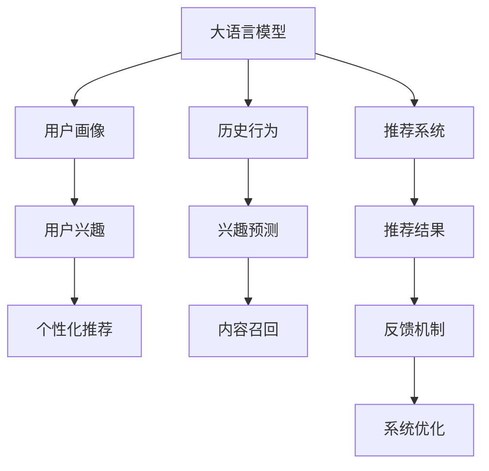

                 

## 1. 背景介绍

推荐系统作为连接用户和内容的桥梁，在移动互联网时代日益成为电商、媒体、金融等领域的重要工具。大语言模型（LLM）作为新兴技术，在推荐系统中的应用亦越发广泛，如使用BERT进行用户兴趣预测、使用GPT-3进行个性化摘要等。然而，由于语言模型可能存在的偏见，推荐系统也面临一定的公平性问题。本文旨在对LLM推荐系统中的偏见与公平性问题进行深入探讨，并提供可能的解决方案。

## 2. 核心概念与联系

### 2.1 核心概念概述

在介绍核心概念前，我们首先梳理下LLM推荐系统中涉及到的几个关键概念：

- 大语言模型（LLM）：基于深度学习技术，通过大规模无监督预训练和微调获得在自然语言处理任务上的强大能力。
- 推荐系统：根据用户历史行为或画像，推荐符合用户兴趣的内容。
- 偏见：推荐系统因为数据、模型、算法等造成的歧视、不平等现象。
- 公平性：推荐系统在不同群体间能否公正地对待每个用户，推荐内容应不偏向任何群体。

这几个概念之间的联系可以通过以下Mermaid流程图来展示：



该流程图展示了LLM在推荐系统中的应用流程：首先通过用户画像和历史行为预测用户兴趣，再利用LLM进行内容召回和个性化推荐，最后根据用户反馈优化推荐效果。整个流程中，LLM模型是否存在偏见、是否公平，将直接影响推荐结果的质量和公平性。

## 3. 核心算法原理 & 具体操作步骤

### 3.1 算法原理概述

LLM推荐系统基于预训练-微调的框架，通过微调获得对特定推荐任务的适应能力。在微调过程中，LLM模型不仅学习了通用语言表示，还对特定任务进行了优化。但模型在微调过程中可能会带入隐含的偏见，如性别、年龄、种族等的歧视。这些偏见将影响模型的推荐公平性。

### 3.2 算法步骤详解

#### 3.2.1 数据集准备

推荐系统数据集通常包含用户画像、历史行为、兴趣标签等多维度信息。由于数据集可能存在偏差，需要对数据进行清洗、去重和预处理，保证数据集的多样性和代表性。

#### 3.2.2 模型微调

选择合适的预训练模型（如BERT、GPT等），并在数据集上进行微调。微调过程中，可以使用正则化技术、对抗训练等方法来避免过拟合和模型偏见。

#### 3.2.3 评估与优化

在微调后，需要对模型进行评估，检测模型是否存在偏见。使用公平性指标（如平等机会、差异性减少等）对模型进行量化分析，必要时调整超参数或优化算法。

#### 3.2.4 反馈与迭代

根据用户反馈调整推荐算法和模型参数，循环迭代提升推荐效果和公平性。

### 3.3 算法优缺点

#### 3.3.1 优点

- 适用性广：LLM模型适用于多种推荐任务，如商品推荐、内容推荐、视频推荐等。
- 性能优异：基于深度学习技术，LLM推荐系统可以高效地处理大量数据，并提升推荐效果。
- 可解释性强：LLM推荐系统通过神经网络结构，具有较好的可解释性，便于分析用户行为和兴趣。

#### 3.3.2 缺点

- 数据依赖：LLM推荐系统依赖于高质量的标注数据和数据集，数据质量直接影响模型效果。
- 模型复杂：LLM模型结构复杂，训练和推理资源需求高。
- 偏见风险：LLM模型可能带有隐含的偏见，需要采取措施避免和缓解偏见影响。

### 3.4 算法应用领域

LLM推荐系统已经在电商、媒体、金融等多个领域得到应用：

- 电商推荐：如Amazon、淘宝等电商平台，使用LLM模型预测用户购买行为，提升推荐准确性和个性化程度。
- 内容推荐：如Netflix、YouTube等平台，使用LLM模型生成个性化视频、音乐推荐。
- 金融推荐：如银行、证券公司，使用LLM模型进行风险评估、投资建议等。

此外，LLM推荐系统还在新闻推荐、社交媒体推荐等领域具有广泛应用前景。

## 4. 数学模型和公式 & 详细讲解 & 举例说明

### 4.1 数学模型构建

假设推荐系统数据集为 $D=\{(x_i,y_i)\}_{i=1}^N$，其中 $x_i$ 表示用户画像、历史行为等信息，$y_i$ 表示用户对内容的偏好标签。使用BERT等预训练模型，对数据集进行微调，得到推荐模型 $M_{\theta}$，其中 $\theta$ 为模型参数。推荐目标为最大化用户满意度，即：

$$
\max_{\theta} \sum_{i=1}^N \log M_{\theta}(x_i)
$$

### 4.2 公式推导过程

对于二分类推荐任务，假设 $y_i \in \{0,1\}$，表示用户对内容是否感兴趣。使用交叉熵损失函数，则推荐损失函数为：

$$
\mathcal{L}(\theta) = -\frac{1}{N} \sum_{i=1}^N [y_i\log M_{\theta}(x_i)+(1-y_i)\log(1-M_{\theta}(x_i))]
$$

在微调过程中，使用随机梯度下降法，最小化损失函数 $\mathcal{L}(\theta)$。假设初始参数为 $\theta_0$，则更新公式为：

$$
\theta \leftarrow \theta - \eta \nabla_{\theta}\mathcal{L}(\theta) - \eta\lambda\theta
$$

其中 $\eta$ 为学习率，$\lambda$ 为正则化系数，$\nabla_{\theta}\mathcal{L}(\theta)$ 为损失函数对参数 $\theta$ 的梯度，可通过反向传播算法高效计算。

### 4.3 案例分析与讲解

#### 4.3.1 数据集偏差

假设数据集存在性别偏见，男性用户比女性用户使用更多。可以设计对抗训练样本，如将男性用户画像标注为女性，训练模型学习到性别无关的特征。假设对抗训练样本为 $(x_i^{\prime},y_i^{\prime})$，则更新公式为：

$$
\theta \leftarrow \theta - \eta \nabla_{\theta}\mathcal{L}(\theta) - \eta\lambda\theta - \eta\nabla_{\theta}\mathcal{L}(\theta|x_i^{\prime},y_i^{\prime})
$$

其中 $\mathcal{L}(\theta|x_i^{\prime},y_i^{\prime})$ 表示对抗样本的损失函数。

#### 4.3.2 模型输出偏差

假设模型输出存在偏见，推荐内容偏向某一性别。可以通过公平性指标检测模型输出，如差异性指标。假设输出向量为 $\vec{v} = M_{\theta}(x_i)$，则差异性指标为：

$$
\text{Divergence} = \frac{1}{N} \sum_{i=1}^N ||\vec{v} - \vec{v}^{\prime}||_2
$$

其中 $\vec{v}^{\prime}$ 表示中性向量，可通过旋转或标准化等方法获得。

## 5. 项目实践：代码实例和详细解释说明

### 5.1 开发环境搭建

在实际开发中，需要搭建Python开发环境，并安装必要的库。以下是主要步骤：

1. 安装Anaconda，并创建虚拟环境。

```bash
conda create -n llm-recommendation python=3.8 
conda activate llm-recommendation
```

2. 安装TensorFlow、PyTorch等深度学习库。

```bash
conda install tensorflow torch
```

3. 安装相关的推荐系统库，如TensorRec、Recommenders等。

```bash
pip install tensorflow-recommenders
```

4. 安装BERT等预训练模型。

```bash
pip install transformers
```

### 5.2 源代码详细实现

假设我们使用BERT模型进行推荐系统开发，代码如下：

```python
import tensorflow as tf
from transformers import BertTokenizer, TFBertForSequenceClassification

# 加载模型和分词器
model = TFBertForSequenceClassification.from_pretrained('bert-base-uncased')
tokenizer = BertTokenizer.from_pretrained('bert-base-uncased')

# 数据集加载与预处理
def load_data():
    # 加载数据集
    train_data = load_train_data()
    valid_data = load_valid_data()
    test_data = load_test_data()
    
    # 数据预处理
    train_dataset = preprocess(train_data, tokenizer)
    valid_dataset = preprocess(valid_data, tokenizer)
    test_dataset = preprocess(test_data, tokenizer)
    
    return train_dataset, valid_dataset, test_dataset

# 模型训练与评估
def train(model, dataset, epochs, batch_size):
    model.compile(optimizer=tf.keras.optimizers.Adam(learning_rate=2e-5),
                  loss=tf.keras.losses.SparseCategoricalCrossentropy(from_logits=True),
                  metrics=[tf.keras.metrics.SparseCategoricalAccuracy()])
    
    model.fit(dataset, epochs=epochs, batch_size=batch_size)
    
    # 模型评估
    evaluation = model.evaluate(valid_dataset)
    print("Validation accuracy: {:.4f}".format(evaluation[1]))
    
    return model

# 模型部署与预测
def deploy(model, test_dataset):
    test_predictions = model.predict(test_dataset)
    
    # 输出预测结果
    print("Test predictions: {}".format(test_predictions))
    
    return test_predictions

# 主函数
if __name__ == '__main__':
    # 加载数据集
    train_dataset, valid_dataset, test_dataset = load_data()
    
    # 模型训练
    model = train(model, train_dataset, epochs=5, batch_size=32)
    
    # 模型评估
    evaluate(model, valid_dataset)
    
    # 模型部署
    deploy(model, test_dataset)
```

### 5.3 代码解读与分析

#### 5.3.1 数据集加载与预处理

在实际推荐系统中，数据集通常包含用户画像、历史行为、内容标签等信息。我们可以使用TensorFlow的`tf.data.Dataset`进行数据预处理和批量加载。

#### 5.3.2 模型训练与评估

在训练模型时，我们使用TensorFlow的Keras API进行模型编译和训练。在模型评估阶段，我们通常使用交叉熵损失函数和准确率等指标来衡量模型性能。

#### 5.3.3 模型部署与预测

在模型训练完成后，我们可以将模型部署到生产环境，并使用`predict`方法进行内容推荐。

## 6. 实际应用场景

### 6.1 电商平台推荐

在电商平台中，推荐系统可以提升用户购物体验，增加销售额。大语言模型可以用于用户画像生成、兴趣预测和个性化推荐等多个环节。例如，使用BERT模型分析用户浏览和点击历史，预测用户购买行为，生成个性化商品推荐。

### 6.2 新闻推荐

新闻推荐系统可以根据用户的历史阅读行为，推荐相关新闻内容。使用LLM模型分析用户阅读习惯，预测用户感兴趣的新闻类型，进行个性化推荐。例如，根据用户对体育、科技、财经等新闻的阅读偏好，推荐相关内容。

### 6.3 视频推荐

视频推荐系统根据用户历史观看记录和评分，推荐感兴趣的视频内容。使用LLM模型分析视频标题、描述、标签等信息，生成个性化视频推荐。例如，根据用户观看历史，推荐相似的视频内容。

## 7. 工具和资源推荐

### 7.1 学习资源推荐

推荐系统涉及深度学习、自然语言处理等多个领域，以下资源有助于快速入门和深入学习：

1. TensorFlow官方文档：提供完整的TensorFlow推荐系统API文档，包括模型训练、评估和部署等。

2. TensorRec项目：开源的推荐系统框架，提供多种推荐算法和模型实现，支持TensorFlow和Keras。

3. TensorBoard：TensorFlow的可视化工具，可用于监控模型训练状态和输出结果。

4. 《推荐系统实战》：详细介绍推荐系统设计、实现和优化，涵盖多种推荐算法和模型。

5. Kaggle竞赛：推荐系统是Kaggle上的热门竞赛主题，参与竞赛可快速积累经验，提升技能。

### 7.2 开发工具推荐

推荐系统开发需要深度学习库和推荐系统库，以下是主要工具推荐：

1. TensorFlow：提供灵活的深度学习模型实现，适用于大规模推荐系统开发。

2. PyTorch：灵活高效的深度学习框架，适用于快速原型开发和实验。

3. TensorRec：开源推荐系统框架，支持多种推荐算法和模型实现。

4. TensorBoard：用于模型训练和结果可视化的强大工具。

5. Keras：提供简洁易用的API接口，便于快速搭建推荐模型。

### 7.3 相关论文推荐

推荐系统领域的研究非常活跃，以下论文对大语言模型在推荐中的应用具有重要参考价值：

1. "Bidirectional Transformers for Recommendation"：提出使用双向Transformer模型进行推荐，提升模型效果和泛化能力。

2. "Language-Driven Recommendation"：提出使用大语言模型进行推荐，分析用户行为，生成个性化推荐。

3. "A Multi-Task Learning Framework for Recommender Systems"：提出多任务学习框架，解决推荐系统中的数据稀疏和模型泛化问题。

4. "Neural Collaborative Filtering"：提出神经网络协同过滤模型，提升推荐系统的准确性和效率。

5. "Attention-Based Recommender Systems"：提出注意力机制的推荐模型，提升模型对复杂用户行为的建模能力。

这些论文代表了推荐系统领域的最新进展，值得深度阅读和学习。

## 8. 总结：未来发展趋势与挑战

### 8.1 总结

本文对大语言模型在推荐系统中的应用进行了深入探讨，分析了模型中的偏见和公平性问题，并提出了可能的解决方案。主要内容包括：

- 大语言模型在推荐系统中的应用流程
- 数据集准备、模型微调、评估与优化、反馈与迭代等关键步骤
- 数据集偏差、模型输出偏差等偏见问题，以及如何缓解和检测这些问题

通过本文的系统梳理，可以看到大语言模型在推荐系统中的巨大潜力和面临的挑战。未来，需要在数据预处理、模型设计、算法优化等多个方面进行深入研究和持续优化，以提升推荐系统的公平性和性能。

### 8.2 未来发展趋势

展望未来，推荐系统的发展趋势如下：

1. 数据质量提升：随着数据采集和标注技术的进步，推荐系统数据集的质量将不断提高，模型效果将进一步提升。

2. 模型多样化：推荐系统将采用更多元化的模型架构，如多任务学习、注意力机制等，提升模型性能和泛化能力。

3. 实时化推荐：基于流数据和实时反馈，推荐系统将实现实时推荐，提升用户体验和系统响应速度。

4. 公平性优化：推荐系统将更加注重公平性，采用多种技术手段缓解偏见，提升推荐系统的公正性和可解释性。

5. 跨模态推荐：将多种数据源（如文本、图片、音频等）进行融合，提升推荐系统的丰富度和准确性。

### 8.3 面临的挑战

尽管大语言模型在推荐系统中具有巨大潜力，但仍面临一些挑战：

1. 数据质量瓶颈：推荐系统依赖高质量数据集，数据集偏差和噪声将影响推荐效果。

2. 模型复杂度：大语言模型结构复杂，训练和推理资源需求高，难以在大规模系统中部署。

3. 公平性问题：推荐系统可能存在偏见，需要对模型进行公平性检测和优化。

4. 实时性要求：推荐系统需要实时响应用户请求，对系统性能和资源管理提出了更高要求。

5. 用户隐私保护：推荐系统涉及用户隐私信息，需要采取措施保护用户隐私。

### 8.4 研究展望

未来，需要在以下几个方面进行深入研究：

1. 数据清洗与增强：提高数据集质量，减少数据偏差和噪声，提升推荐系统性能。

2. 模型优化与公平性：开发更加多样化和高效化的推荐模型，提升模型公平性和泛化能力。

3. 实时化与个性化：实现实时推荐和个性化推荐，提升用户体验和系统效率。

4. 跨模态推荐与融合：将多种数据源进行融合，提升推荐系统的丰富度和准确性。

5. 隐私保护与安全性：保护用户隐私信息，确保推荐系统安全可靠。

总之，大语言模型在推荐系统中的应用前景广阔，但也面临许多挑战。只有不断突破技术瓶颈，提升模型性能和公平性，才能更好地服务用户，推动人工智能技术的发展。

## 9. 附录：常见问题与解答

### Q1: 什么是推荐系统？

A: 推荐系统通过分析用户历史行为和兴趣，推荐符合用户需求的内容或产品。在电商平台、新闻媒体、视频平台等领域，推荐系统发挥着重要的作用。

### Q2: 推荐系统中的数据集是如何准备的？

A: 推荐系统的数据集通常包含用户画像、历史行为、兴趣标签等信息。数据集需要经过清洗、去重和预处理，保证数据集的多样性和代表性。

### Q3: 如何检测推荐系统中的偏见？

A: 推荐系统中的偏见可以通过公平性指标进行检测。例如，差异性指标、平等机会等。检测到偏见后，可以采用对抗训练、正则化等方法缓解偏见影响。

### Q4: 推荐系统中的数据集偏差如何处理？

A: 推荐系统中的数据集偏差通常通过数据增强、对抗训练等方法进行缓解。例如，通过增加对抗样本，训练模型学习到性别、年龄无关的特征。

### Q5: 如何提高推荐系统的实时性？

A: 提高推荐系统的实时性需要优化算法和硬件资源。例如，采用流式模型、GPU/TPU加速等方法，提升推荐系统的响应速度和处理能力。

---

作者：禅与计算机程序设计艺术 / Zen and the Art of Computer Programming

