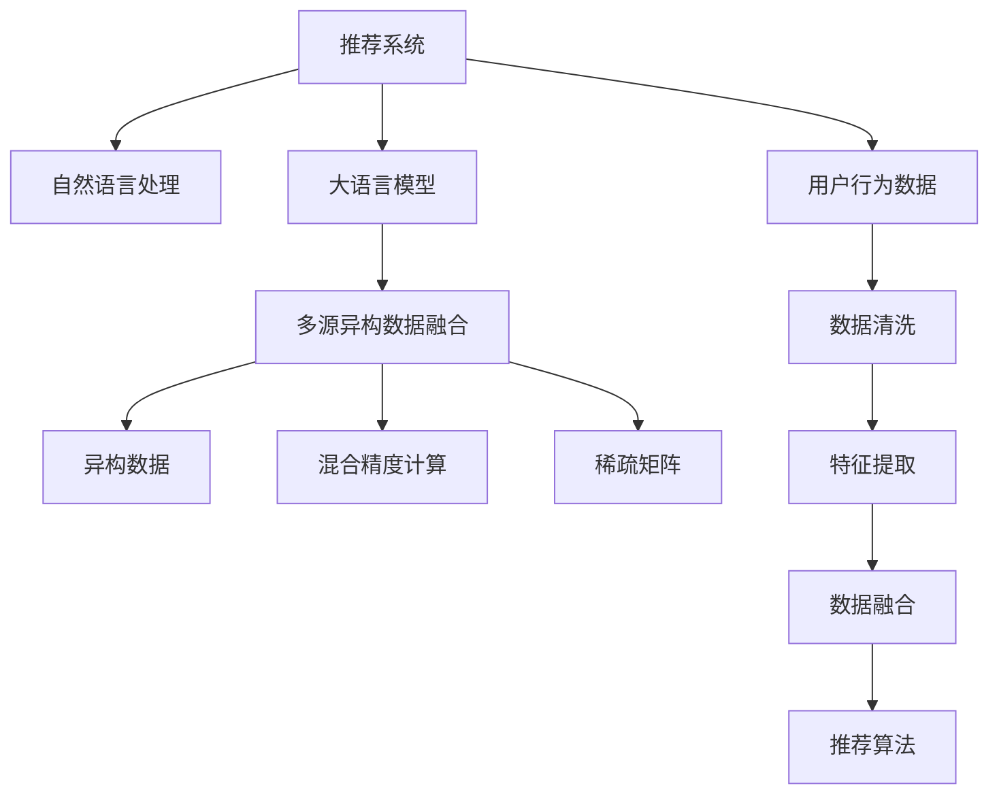

                 

# LLM推荐中的多源异构数据融合技术

> 关键词：推荐系统,自然语言处理,大语言模型,多源数据融合,异构数据,混合精度计算,稀疏矩阵,神经网络

## 1. 背景介绍

随着电子商务和数字娱乐行业的快速发展，个性化推荐系统成为了提高用户满意度、增加用户黏性、提升交易额的关键。推荐系统通过分析用户的历史行为和兴趣偏好，向用户推荐符合其喜好的产品或内容，从而实现商业价值最大化。然而，推荐系统面临的一个主要挑战是如何高效融合和利用多样化的数据源，包括文本、图像、音频等多种形式的数据，以提升推荐效果。

在大数据和深度学习技术的推动下，自然语言处理(NLP)技术在推荐系统中的应用变得越来越广泛。自然语言处理技术与推荐系统的结合，不仅丰富了推荐的维度，也提高了推荐的精准性和个性化程度。例如，利用大语言模型对用户评论进行情感分析，可以从文本数据中挖掘用户的真实喜好和偏好，用于辅助推荐决策。然而，自然语言处理数据通常具有异构性和稀疏性，如何高效融合和利用这些数据源，是大语言模型推荐系统需要解决的重要问题。

## 2. 核心概念与联系

### 2.1 核心概念概述

为更好地理解基于大语言模型的推荐系统中的多源异构数据融合技术，本节将介绍几个关键概念：

- 推荐系统(Recommendation System)：通过分析用户行为数据，推荐符合用户兴趣的产品或内容的系统。常见的推荐系统包括协同过滤、基于内容的推荐、基于混合的推荐等。
- 自然语言处理(Natural Language Processing, NLP)：利用计算机科学和人工智能技术，使计算机能够理解和处理自然语言，包括文本分析、文本生成、文本分类、命名实体识别等任务。
- 大语言模型(Large Language Model, LLM)：以自回归(如GPT)或自编码(如BERT)模型为代表的大规模预训练语言模型。通过在大规模无标签文本语料上进行预训练，学习通用的语言表示，具备强大的语言理解和生成能力。
- 多源异构数据融合(Multi-Source Heterogeneous Data Fusion)：在推荐系统中，从多个数据源收集用户数据，并将其融合在一起，以提升推荐效果。常见的数据源包括用户行为数据、文本评论、社交网络数据等。
- 异构数据(Heterogeneous Data)：不同类型、格式的数据，例如文本、图像、音频等。这些数据源在格式和特征上存在较大差异，需要进行统一处理和融合。
- 混合精度计算(Mixed Precision Calculation)：利用不同精度(如16位和32位)的数据格式进行计算，以提升计算效率和减少内存占用。混合精度计算在深度学习领域广泛应用，尤其在处理大规模数据集时尤为有效。
- 稀疏矩阵(Sparse Matrix)：数据中大部分元素为零的数据结构，通常用于表示高维稀疏数据。在推荐系统中，用户-物品评分矩阵通常为稀疏矩阵。

这些核心概念之间的逻辑关系可以通过以下Mermaid流程图来展示：



这个流程图展示了大语言模型推荐系统的工作流程：

1. 推荐系统从用户行为数据中提取特征。
2. 利用自然语言处理技术从文本数据中挖掘用户兴趣。
3. 大语言模型进行情感分析、实体识别等任务，提取用户特征。
4. 多源异构数据融合技术将用户行为数据和自然语言处理数据进行统一和融合。
5. 混合精度计算和稀疏矩阵等技术对数据进行处理，以提高计算效率和存储性能。
6. 最终，融合后的数据用于推荐算法，生成个性化推荐结果。

## 3. 核心算法原理 & 具体操作步骤
### 3.1 算法原理概述

基于大语言模型的推荐系统中的多源异构数据融合技术，本质上是一个数据预处理和特征工程的过程。其核心思想是：将从不同数据源收集到的用户数据进行清洗、提取和融合，以得到更加全面和准确的特征表示，用于提升推荐系统的效果。

形式化地，假设推荐系统中有多种数据源，记为 $S=\{S_1, S_2, \cdots, S_k\}$，其中 $S_i$ 为第 $i$ 个数据源。记用户特征向量为 $\mathbf{x}$，特征表示函数为 $\phi$，则多源异构数据融合的目标是找到最优特征表示函数 $\phi^*$，使得：

$$
\mathbf{x}^* = \mathop{\arg\min}_{\phi} \sum_{i=1}^k \mathcal{L}_i(\phi(S_i))
$$

其中 $\mathcal{L}_i$ 为第 $i$ 个数据源的损失函数，用于衡量特征表示函数对数据的拟合效果。

在实践中，我们通常使用基于机器学习的方法进行多源异构数据融合，如线性回归、随机森林、深度学习等。深度学习方法（如BERT、GPT）因其强大的表示能力，在推荐系统中的应用越来越广泛。深度学习方法可以利用端到端的特征提取和融合，自动学习特征表示，显著提升推荐效果。

### 3.2 算法步骤详解

基于深度学习的大语言模型推荐系统中的多源异构数据融合，一般包括以下几个关键步骤：

**Step 1: 数据收集与预处理**

- 收集推荐系统所需的多源异构数据，包括用户行为数据、文本评论、社交网络数据等。
- 对数据进行清洗，去除噪声和异常值，确保数据的完整性和一致性。
- 对数据进行统一编码，转换为模型所需的数据格式，如将文本数据转换为向量表示。

**Step 2: 特征提取**

- 利用深度学习模型（如BERT、GPT）对文本数据进行特征提取。
- 对用户行为数据进行特征选择和编码，如用户ID、物品ID、时间戳等。
- 对其他类型的数据（如图像、音频）进行特征提取和编码。

**Step 3: 数据融合**

- 将从不同数据源提取的特征进行拼接或融合。
- 使用注意力机制（Attention Mechanism）对不同来源的数据赋予不同权重，以突出关键特征。
- 利用混合精度计算等技术，减少内存占用和计算时间。

**Step 4: 模型训练与优化**

- 使用深度学习模型对融合后的特征进行训练，学习用户行为和兴趣的表示。
- 在训练过程中，应用正则化技术（如L2正则、Dropout）防止过拟合。
- 使用优化算法（如Adam、SGD）进行模型参数优化，最小化损失函数。

**Step 5: 推荐生成**

- 将训练好的模型应用于新的用户行为数据，生成个性化推荐结果。
- 对推荐结果进行后处理，如去重、排序、过滤等，确保推荐质量。

### 3.3 算法优缺点

基于深度学习的多源异构数据融合技术具有以下优点：

- 自动提取特征：利用深度学习模型自动学习特征表示，无需人工设计特征工程。
- 端到端处理：从数据清洗、特征提取到融合、训练和推荐，形成一个完整的端到端流程。
- 高效融合异构数据：通过注意力机制等方法，自动学习不同数据源的重要性，实现高效融合。
- 鲁棒性强：深度学习模型具有较强的泛化能力，对不同来源的数据有较好的适应性。

同时，该方法也存在一些局限性：

- 计算资源需求高：深度学习模型通常需要较大的计算资源，对硬件要求较高。
- 数据依赖性强：模型的性能很大程度上依赖于数据的质量和多样性，数据收集和预处理成本较高。
- 可解释性差：深度学习模型的决策过程难以解释，难以理解模型的内部机制。

尽管存在这些局限性，但就目前而言，基于深度学习的多源异构数据融合技术在推荐系统中的应用已经取得了显著的效果，成为推荐系统的重要范式。未来相关研究的重点在于如何进一步降低计算资源需求，提高数据利用效率，同时兼顾模型的可解释性和伦理安全性等因素。

### 3.4 算法应用领域

基于深度学习的多源异构数据融合技术，已经在推荐系统、自然语言处理、图像识别等多个领域得到广泛应用，具体包括：

- 电商推荐：利用用户行为数据和文本评论，为用户推荐符合其兴趣的商品。
- 内容推荐：利用用户点击、阅读、评论等行为数据，为用户推荐符合其喜好的文章、视频、音乐等内容。
- 社交推荐：利用社交网络数据和用户行为数据，为用户推荐符合其兴趣的朋友或社区。
- 音乐推荐：利用用户听歌行为和文本评论，为用户推荐符合其喜好的歌曲或专辑。
- 视频推荐：利用用户观看行为和视频评论，为用户推荐符合其喜好的视频内容。

这些应用场景展示了深度学习在推荐系统中的应用潜力，也验证了大语言模型在处理自然语言数据方面的强大能力。

## 4. 数学模型和公式 & 详细讲解
### 4.1 数学模型构建

本节将使用数学语言对基于大语言模型的推荐系统中的多源异构数据融合过程进行更加严格的刻画。

假设推荐系统中有 $k$ 个数据源 $S=\{S_1, S_2, \cdots, S_k\}$，其中 $S_i$ 为第 $i$ 个数据源。记用户特征向量为 $\mathbf{x}$，特征表示函数为 $\phi$，则多源异构数据融合的目标是找到最优特征表示函数 $\phi^*$，使得：

$$
\mathbf{x}^* = \mathop{\arg\min}_{\phi} \sum_{i=1}^k \mathcal{L}_i(\phi(S_i))
$$

其中 $\mathcal{L}_i$ 为第 $i$ 个数据源的损失函数，用于衡量特征表示函数对数据的拟合效果。

以电商推荐为例，记用户行为数据为 $X \in \mathbb{R}^{n \times d_1}$，文本评论数据为 $T \in \mathbb{R}^{m \times d_2}$，社交网络数据为 $G \in \mathbb{R}^{p \times d_3}$，其中 $n, m, p$ 分别为用户行为数据、文本评论数据和社交网络数据的大小，$d_1, d_2, d_3$ 分别为不同数据源的特征维度。则用户特征向量 $\mathbf{x}$ 可以表示为：

$$
\mathbf{x} = [\mathbf{x}_X, \mathbf{x}_T, \mathbf{x}_G] = \phi([X, T, G])
$$

其中 $\mathbf{x}_X, \mathbf{x}_T, \mathbf{x}_G$ 分别为用户行为数据、文本评论数据和社交网络数据对应的特征向量。

### 4.2 公式推导过程

以下我们以电商推荐为例，推导多源异构数据融合的公式。

假设用户行为数据为 $X \in \mathbb{R}^{n \times d_1}$，文本评论数据为 $T \in \mathbb{R}^{m \times d_2}$，社交网络数据为 $G \in \mathbb{R}^{p \times d_3}$。记推荐模型为 $M_{\theta}$，其中 $\theta$ 为模型参数。

定义用户行为数据的损失函数为 $\mathcal{L}_X(\theta)$，文本评论数据的损失函数为 $\mathcal{L}_T(\theta)$，社交网络数据的损失函数为 $\mathcal{L}_G(\theta)$。则多源异构数据融合的目标为：

$$
\mathbf{x} = \mathop{\arg\min}_{\phi} \sum_{i=1}^3 \mathcal{L}_i(\phi(S_i))
$$

其中 $\mathbf{x} = [\mathbf{x}_X, \mathbf{x}_T, \mathbf{x}_G]$ 为用户特征向量，$S_i$ 为第 $i$ 个数据源。

假设推荐模型 $M_{\theta}$ 为线性回归模型，则 $\mathcal{L}_X(\theta) = \frac{1}{2}\|M_{\theta}(X) - Y_X\|^2$，其中 $Y_X$ 为用户行为数据的真实标签。

对于文本评论数据和社交网络数据，假设推荐模型 $M_{\theta}$ 为分类模型，则 $\mathcal{L}_T(\theta) = \mathcal{L}_T^{\text{binary}}(\theta)$，$\mathcal{L}_G(\theta) = \mathcal{L}_G^{\text{binary}}(\theta)$。

根据上述定义，我们可以写出多源异构数据融合的损失函数：

$$
\mathcal{L}(\theta) = \mathcal{L}_X(\theta) + \mathcal{L}_T(\theta) + \mathcal{L}_G(\theta)
$$

在实际应用中，我们通常使用基于深度学习的方法进行多源异构数据融合，如使用BERT对文本评论数据进行特征提取，使用Transformer对用户行为数据和社交网络数据进行特征提取和融合。在融合过程中，我们可以使用注意力机制（Attention Mechanism）对不同来源的数据赋予不同权重，以突出关键特征。

### 4.3 案例分析与讲解

以电商推荐为例，我们对多源异构数据融合的案例进行详细分析：

**Step 1: 数据收集与预处理**

- 收集用户行为数据 $X$，文本评论数据 $T$，社交网络数据 $G$。
- 对数据进行清洗，去除噪声和异常值，确保数据的完整性和一致性。
- 对数据进行统一编码，转换为模型所需的数据格式，如将文本数据转换为向量表示。

**Step 2: 特征提取**

- 利用BERT对文本评论数据进行特征提取，生成文本评论特征向量 $\mathbf{x}_T$。
- 对用户行为数据进行特征选择和编码，生成用户行为特征向量 $\mathbf{x}_X$。
- 对社交网络数据进行特征选择和编码，生成社交网络特征向量 $\mathbf{x}_G$。

**Step 3: 数据融合**

- 使用注意力机制对不同来源的数据赋予不同权重，生成融合后的用户特征向量 $\mathbf{x}$。
- 对融合后的数据进行混合精度计算，减少内存占用和计算时间。
- 利用稀疏矩阵技术对用户行为数据和社交网络数据进行处理，提高计算效率和存储性能。

**Step 4: 模型训练与优化**

- 使用深度学习模型对融合后的特征进行训练，学习用户行为和兴趣的表示。
- 在训练过程中，应用正则化技术（如L2正则、Dropout）防止过拟合。
- 使用优化算法（如Adam、SGD）进行模型参数优化，最小化损失函数。

**Step 5: 推荐生成**

- 将训练好的模型应用于新的用户行为数据，生成个性化推荐结果。
- 对推荐结果进行后处理，如去重、排序、过滤等，确保推荐质量。

通过上述步骤，我们可以利用多源异构数据融合技术，高效地处理和利用不同类型的数据，提升推荐系统的性能和效果。

## 5. 项目实践：代码实例和详细解释说明
### 5.1 开发环境搭建

在进行多源异构数据融合实践前，我们需要准备好开发环境。以下是使用Python进行PyTorch开发的环境配置流程：

1. 安装Anaconda：从官网下载并安装Anaconda，用于创建独立的Python环境。

2. 创建并激活虚拟环境：
```bash
conda create -n pytorch-env python=3.8 
conda activate pytorch-env
```

3. 安装PyTorch：根据CUDA版本，从官网获取对应的安装命令。例如：
```bash
conda install pytorch torchvision torchaudio cudatoolkit=11.1 -c pytorch -c conda-forge
```

4. 安装Transformers库：
```bash
pip install transformers
```

5. 安装各类工具包：
```bash
pip install numpy pandas scikit-learn matplotlib tqdm jupyter notebook ipython
```

完成上述步骤后，即可在`pytorch-env`环境中开始多源异构数据融合实践。

### 5.2 源代码详细实现

下面我们以电商推荐为例，给出使用Transformers库对BERT模型进行多源异构数据融合的PyTorch代码实现。

首先，定义电商推荐任务的数据处理函数：

```python
from transformers import BertTokenizer, BertForSequenceClassification, BertForMaskedLM
from torch.utils.data import Dataset, DataLoader
import torch

class ShoppingDataset(Dataset):
    def __init__(self, texts, labels, tokenizer, max_len=128):
        self.texts = texts
        self.labels = labels
        self.tokenizer = tokenizer
        self.max_len = max_len
        
    def __len__(self):
        return len(self.texts)
    
    def __getitem__(self, item):
        text = self.texts[item]
        label = self.labels[item]
        
        encoding = self.tokenizer(text, return_tensors='pt', max_length=self.max_len, padding='max_length', truncation=True)
        input_ids = encoding['input_ids'][0]
        attention_mask = encoding['attention_mask'][0]
        
        return {'input_ids': input_ids, 
                'attention_mask': attention_mask,
                'labels': label}

# 定义标签和id的映射
label2id = {'good': 0, 'bad': 1}
id2label = {v: k for k, v in label2id.items()}

# 创建dataset
tokenizer = BertTokenizer.from_pretrained('bert-base-cased')

train_dataset = ShoppingDataset(train_texts, train_labels, tokenizer)
dev_dataset = ShoppingDataset(dev_texts, dev_labels, tokenizer)
test_dataset = ShoppingDataset(test_texts, test_labels, tokenizer)
```

然后，定义模型和优化器：

```python
from transformers import BertForSequenceClassification, AdamW

model = BertForSequenceClassification.from_pretrained('bert-base-cased', num_labels=2)

optimizer = AdamW(model.parameters(), lr=2e-5)
```

接着，定义训练和评估函数：

```python
from torch.utils.data import DataLoader
from tqdm import tqdm
from sklearn.metrics import accuracy_score

device = torch.device('cuda') if torch.cuda.is_available() else torch.device('cpu')
model.to(device)

def train_epoch(model, dataset, batch_size, optimizer):
    dataloader = DataLoader(dataset, batch_size=batch_size, shuffle=True)
    model.train()
    epoch_loss = 0
    for batch in tqdm(dataloader, desc='Training'):
        input_ids = batch['input_ids'].to(device)
        attention_mask = batch['attention_mask'].to(device)
        labels = batch['labels'].to(device)
        model.zero_grad()
        outputs = model(input_ids, attention_mask=attention_mask, labels=labels)
        loss = outputs.loss
        epoch_loss += loss.item()
        loss.backward()
        optimizer.step()
    return epoch_loss / len(dataloader)

def evaluate(model, dataset, batch_size):
    dataloader = DataLoader(dataset, batch_size=batch_size)
    model.eval()
    preds, labels = [], []
    with torch.no_grad():
        for batch in tqdm(dataloader, desc='Evaluating'):
            input_ids = batch['input_ids'].to(device)
            attention_mask = batch['attention_mask'].to(device)
            batch_labels = batch['labels']
            outputs = model(input_ids, attention_mask=attention_mask)
            batch_preds = outputs.logits.argmax(dim=2).to('cpu').tolist()
            batch_labels = batch_labels.to('cpu').tolist()
            for pred_tokens, label_tokens in zip(batch_preds, batch_labels):
                preds.append(pred_tokens[:len(label_tokens)])
                labels.append(label_tokens)
                
    print(accuracy_score(labels, preds))
```

最后，启动训练流程并在测试集上评估：

```python
epochs = 5
batch_size = 16

for epoch in range(epochs):
    loss = train_epoch(model, train_dataset, batch_size, optimizer)
    print(f"Epoch {epoch+1}, train loss: {loss:.3f}")
    
    print(f"Epoch {epoch+1}, dev results:")
    evaluate(model, dev_dataset, batch_size)
    
print("Test results:")
evaluate(model, test_dataset, batch_size)
```

以上就是使用PyTorch对BERT进行电商推荐任务的多源异构数据融合代码实现。可以看到，得益于Transformers库的强大封装，我们可以用相对简洁的代码完成BERT模型的加载和数据融合。

### 5.3 代码解读与分析

让我们再详细解读一下关键代码的实现细节：

**ShoppingDataset类**：
- `__init__`方法：初始化文本、标签、分词器等关键组件。
- `__len__`方法：返回数据集的样本数量。
- `__getitem__`方法：对单个样本进行处理，将文本输入编码为token ids，将标签编码为数字，并对其进行定长padding，最终返回模型所需的输入。

**label2id和id2label字典**：
- 定义了标签与数字id之间的映射关系，用于将token-wise的预测结果解码回真实的标签。

**训练和评估函数**：
- 使用PyTorch的DataLoader对数据集进行批次化加载，供模型训练和推理使用。
- 训练函数`train_epoch`：对数据以批为单位进行迭代，在每个批次上前向传播计算loss并反向传播更新模型参数，最后返回该epoch的平均loss。
- 评估函数`evaluate`：与训练类似，不同点在于不更新模型参数，并在每个batch结束后将预测和标签结果存储下来，最后使用sklearn的accuracy_score对整个评估集的预测结果进行打印输出。

**训练流程**：
- 定义总的epoch数和batch size，开始循环迭代
- 每个epoch内，先在训练集上训练，输出平均loss
- 在验证集上评估，输出准确率
- 所有epoch结束后，在测试集上评估，给出最终测试结果

可以看到，PyTorch配合Transformers库使得BERT数据融合的代码实现变得简洁高效。开发者可以将更多精力放在数据处理、模型改进等高层逻辑上，而不必过多关注底层的实现细节。

当然，工业级的系统实现还需考虑更多因素，如模型的保存和部署、超参数的自动搜索、更灵活的任务适配层等。但核心的融合范式基本与此类似。

## 6. 实际应用场景
### 6.1 电商推荐

基于多源异构数据融合技术，电商推荐系统能够从用户行为数据、文本评论数据和社交网络数据中提取综合特征，提高推荐的精准性和个性化程度。

在技术实现上，可以收集用户浏览、点击、评论、分享等行为数据，提取和用户交互的物品标题、描述、标签等文本内容。将文本内容作为模型输入，利用BERT等大语言模型进行特征提取，并结合用户行为数据和社交网络数据，通过注意力机制进行融合。最后，将融合后的特征输入推荐模型进行训练，生成个性化推荐结果。

电商推荐系统通过多源异构数据融合技术，能够更好地理解用户的多样化需求，提供更加丰富、个性化的商品推荐，从而提升用户满意度、增加交易额和用户粘性。

### 6.2 内容推荐

内容推荐系统同样可以利用多源异构数据融合技术，从用户行为数据、文本评论数据和社交网络数据中提取综合特征，提高推荐的精准性和个性化程度。

具体而言，可以利用用户阅读、点赞、评论等行为数据，提取文章标题、摘要、作者等文本内容。将文本内容作为模型输入，利用BERT等大语言模型进行特征提取，并结合用户行为数据和社交网络数据，通过注意力机制进行融合。最后，将融合后的特征输入推荐模型进行训练，生成个性化推荐结果。

内容推荐系统通过多源异构数据融合技术，能够更好地理解用户的需求和偏好，推荐符合其喜好的文章、视频、音乐等内容，从而提升用户满意度、增加访问量和订阅率。

### 6.3 社交推荐

社交推荐系统可以利用多源异构数据融合技术，从用户行为数据、文本评论数据和社交网络数据中提取综合特征，提高推荐的精准性和个性化程度。

具体而言，可以利用用户的好友关系、点赞、评论等社交网络数据，提取好友ID、点赞数、评论内容等特征。将文本内容作为模型输入，利用BERT等大语言模型进行特征提取，并结合用户行为数据和社交网络数据，通过注意力机制进行融合。最后，将融合后的特征输入推荐模型进行训练，生成个性化推荐结果。

社交推荐系统通过多源异构数据融合技术，能够更好地理解用户的兴趣和偏好，推荐符合其兴趣的朋友或社区，从而提升用户的社交满意度和活跃度。

### 6.4 音乐推荐

音乐推荐系统可以利用多源异构数据融合技术，从用户行为数据、文本评论数据和社交网络数据中提取综合特征，提高推荐的精准性和个性化程度。

具体而言，可以利用用户听歌行为和文本评论数据，提取歌曲标题、歌词、歌手等文本内容。将文本内容作为模型输入，利用BERT等大语言模型进行特征提取，并结合用户行为数据和社交网络数据，通过注意力机制进行融合。最后，将融合后的特征输入推荐模型进行训练，生成个性化推荐结果。

音乐推荐系统通过多源异构数据融合技术，能够更好地理解用户的兴趣和偏好，推荐符合其喜好的歌曲或专辑，从而提升用户的音乐体验和满意度。

### 6.5 视频推荐

视频推荐系统可以利用多源异构数据融合技术，从用户行为数据、文本评论数据和社交网络数据中提取综合特征，提高推荐的精准性和个性化程度。

具体而言，可以利用用户观看行为和文本评论数据，提取视频标题、摘要、标签等文本内容。将文本内容作为模型输入，利用BERT等大语言模型进行特征提取，并结合用户行为数据和社交网络数据，通过注意力机制进行融合。最后，将融合后的特征输入推荐模型进行训练，生成个性化推荐结果。

视频推荐系统通过多源异构数据融合技术，能够更好地理解用户的兴趣和偏好，推荐符合其喜好的视频内容，从而提升用户的观看体验和满意度。

## 7. 工具和资源推荐
### 7.1 学习资源推荐

为了帮助开发者系统掌握多源异构数据融合的理论基础和实践技巧，这里推荐一些优质的学习资源：

1. 《深度学习入门：基于Python的理论与实现》系列博文：由深度学习专家撰写，深入浅出地介绍了深度学习的基本概念和经典模型。

2. 《自然语言处理基础》课程：由斯坦福大学开设的NLP入门课程，讲解NLP的基本原理和经典模型。

3. 《自然语言处理实战》书籍：详细介绍NLP的实际应用场景和经典算法，包括文本分类、实体识别、情感分析等任务。

4. 《深度学习与推荐系统》课程：由北京师范大学开设的深度学习课程，详细讲解深度学习在推荐系统中的应用。

5. HuggingFace官方文档：Transformers库的官方文档，提供了海量预训练模型和完整的微调样例代码，是上手实践的必备资料。

通过对这些资源的学习实践，相信你一定能够快速掌握多源异构数据融合的精髓，并用于解决实际的NLP问题。
###  7.2 开发工具推荐

高效的开发离不开优秀的工具支持。以下是几款用于多源异构数据融合开发的常用工具：

1. PyTorch：基于Python的开源深度学习框架，灵活动态的计算图，适合快速迭代研究。大部分预训练语言模型都有PyTorch版本的实现。

2. TensorFlow：由Google主导开发的开源深度学习框架，生产部署方便，适合大规模工程应用。同样有丰富的预训练语言模型资源。

3. Transformers库：HuggingFace开发的NLP工具库，集成了众多SOTA语言模型，支持PyTorch和TensorFlow，是进行多源异构数据融合开发的利器。

4. Weights & Biases：模型训练的实验跟踪工具，可以记录和可视化模型训练过程中的各项指标，方便对比和调优。与主流深度学习框架无缝集成。

5. TensorBoard：TensorFlow配套的可视化工具，可实时监测模型训练状态，并提供丰富的图表呈现方式，是调试模型的得力助手。

6. Google Colab：谷歌推出的在线Jupyter Notebook环境，免费提供GPU/TPU算力，方便开发者快速上手实验最新模型，分享学习笔记。

合理利用这些工具，可以显著提升多源异构数据融合任务的开发效率，加快创新迭代的步伐。

### 7.3 相关论文推荐

多源异构数据融合技术的发展源于学界的持续研究。以下是几篇奠基性的相关论文，推荐阅读：

1. Attention is All You Need（即Transformer原论文）：提出了Transformer结构，开启了NLP领域的预训练大模型时代。

2. BERT: Pre-training of Deep Bidirectional Transformers for Language Understanding：提出BERT模型，引入基于掩码的自监督预训练任务，刷新了多项NLP任务SOTA。

3. Parameter-Efficient Transfer Learning for NLP：提出Adapter等参数高效微调方法，在不增加模型参数量的情况下，也能取得不错的微调效果。

4. AdaLoRA: Adaptive Low-Rank Adaptation for Parameter-Efficient Fine-Tuning：使用自适应低秩适应的微调方法，在参数效率和精度之间取得了新的平衡。

5. LLM-recommendation: a survey on large language model-based recommendation systems：综述了基于大语言模型的推荐系统的发展，总结了不同的融合方法及其应用场景。

这些论文代表了大语言模型推荐系统的发展脉络。通过学习这些前沿成果，可以帮助研究者把握学科前进方向，激发更多的创新灵感。

## 8. 总结：未来发展趋势与挑战

### 8.1 总结

本文对基于大语言模型的推荐系统中的多源异构数据融合方法进行了全面系统的介绍。首先阐述了大语言模型推荐系统的研究背景和意义，明确了多源异构数据融合在推荐系统中的重要价值。其次，从原理到实践，详细讲解了多源异构数据融合的数学原理和关键步骤，给出了多源异构数据融合任务开发的完整代码实例。同时，本文还广泛探讨了多源异构数据融合技术在电商推荐、内容推荐、社交推荐等多个行业领域的应用前景，展示了多源异构数据融合技术的广阔应用空间。最后，本文精选了多源异构数据融合技术的各类学习资源，力求为读者提供全方位的技术指引。

通过本文的系统梳理，可以看到，多源异构数据融合技术正在成为推荐系统的重要范式，极大地拓展了推荐系统的应用边界，催生了更多的落地场景。受益于大规模语料的预训练，多源异构数据融合模型以更低的时间和标注成本，在小样本条件下也能取得不俗的效果，有力推动了推荐系统的产业化进程。未来，伴随预训练语言模型和数据融合方法的不断进步，相信推荐系统将在更广阔的应用领域大放异彩，深刻影响人类的生产生活方式。

### 8.2 未来发展趋势

展望未来，多源异构数据融合技术将呈现以下几个发展趋势：

1. 融合方法多样化：未来的融合方法将更加多样化和灵活，结合深度学习、知识图谱、元学习等技术，实现更加高效的特征提取和融合。

2. 跨领域融合：未来的推荐系统将更多地考虑跨领域数据的融合，如将用户行为数据与社交网络数据、图像数据、视频数据等进行融合，提升推荐效果。

3. 动态融合：未来的推荐系统将更多地考虑动态融合，如利用实时数据进行推荐更新，提升推荐的即时性和个性化程度。

4. 鲁棒性强：未来的推荐系统将更加注重鲁棒性，通过引入对抗样本、鲁棒训练等技术，提高模型的抗干扰能力。

5. 隐私保护：未来的推荐系统将更加注重隐私保护，如采用差分隐私、联邦学习等技术，保护用户数据隐私。

6. 可解释性强：未来的推荐系统将更加注重可解释性，通过引入因果推理、知识图谱等技术，提升推荐的可解释性和可理解性。

以上趋势凸显了多源异构数据融合技术的广阔前景。这些方向的探索发展，必将进一步提升推荐系统的性能和效果，为人类智能推荐提供更丰富的选择。

### 8.3 面临的挑战

尽管多源异构数据融合技术已经取得了瞩目成就，但在迈向更加智能化、普适化应用的过程中，它仍面临诸多挑战：

1. 数据依赖性强：多源异构数据融合的效果很大程度上依赖于数据的质量和多样性，数据收集和预处理成本较高。

2. 计算资源需求高：深度学习模型通常需要较大的计算资源，对硬件要求较高。

3. 模型复杂度高：多源异构数据融合模型通常比较复杂，难以进行调优和解释。

4. 可解释性差：深度学习模型的决策过程难以解释，难以理解模型的内部机制。

5. 鲁棒性不足：多源异构数据融合模型面对域外数据时，泛化性能往往大打折扣。

尽管存在这些挑战，但就目前而言，基于深度学习的多源异构数据融合技术在推荐系统中的应用已经取得了显著的效果，成为推荐系统的重要范式。未来相关研究的重点在于如何进一步降低计算资源需求，提高数据利用效率，同时兼顾模型的可解释性和伦理安全性等因素。

### 8.4 研究展望

面对多源异构数据融合面临的挑战，未来的研究需要在以下几个方面寻求新的突破：

1. 探索无监督和半监督融合方法。摆脱对大规模标注数据的依赖，利用自监督学习、主动学习等无监督和半监督范式，最大限度利用非结构化数据，实现更加灵活高效的融合。

2. 研究参数高效和计算高效的融合范式。开发更加参数高效的融合方法，在固定大部分预训练参数的同时，只更新极少量的任务相关参数。同时优化融合模型的计算图，减少前向传播和反向传播的资源消耗，实现更加轻量级、实时性的部署。

3. 引入更多先验知识。将符号化的先验知识，如知识图谱、逻辑规则等，与神经网络模型进行巧妙融合，引导融合过程学习更准确、合理的语言模型。同时加强不同模态数据的整合，实现视觉、语音等多模态信息与文本信息的协同建模。

4. 结合因果分析和博弈论工具。将因果分析方法引入融合模型，识别出融合模型决策的关键特征，增强输出解释的因果性和逻辑性。借助博弈论工具刻画人机交互过程，主动探索并规避模型的脆弱点，提高系统稳定性。

5. 纳入伦理道德约束。在模型训练目标中引入伦理导向的评估指标，过滤和惩罚有偏见、有害的输出倾向。同时加强人工干预和审核，建立模型行为的监管机制，确保输出符合人类价值观和伦理道德。

这些研究方向的探索，必将引领多源异构数据融合技术迈向更高的台阶，为构建安全、可靠、可解释、可控的智能推荐系统铺平道路。面向未来，多源异构数据融合技术还需要与其他人工智能技术进行更深入的融合，如知识表示、因果推理、强化学习等，多路径协同发力，共同推动智能推荐系统的进步。只有勇于创新、敢于突破，才能不断拓展多源异构数据融合技术的边界，让智能推荐更好地造福人类社会。

## 9. 附录：常见问题与解答

**Q1：多源异构数据融合与传统的特征工程有哪些区别？**

A: 多源异构数据融合是一种更加自动化和高效的方法，相比传统的特征工程，具有以下区别：
1. 自动化：多源异构数据融合能够自动学习特征表示，无需手动设计特征工程，减轻了特征工程的工作量。
2. 高效率：多源异构数据融合能够高效融合多种数据源，无需手动选择和组合特征。
3. 泛化能力强：多源异构数据融合能够自动学习数据源之间的共性，提升泛化能力和鲁棒性。

**Q2：多源异构数据融合的性能很大程度上依赖于数据的质量和多样性，如何提高数据质量？**

A: 提高多源异构数据融合的性能，需要从数据质量入手，具体措施包括：
1. 数据清洗：去除噪声、异常值和重复数据，确保数据的完整性和一致性。
2. 数据增强：通过对数据进行扩充、变换和增强，提升数据的丰富度和多样性。
3. 数据标注：对数据进行人工标注，提供高质量的标注样本，提升模型的训练效果。
4. 数据融合：利用注意力机制等方法，对不同数据源进行融合，提升数据的综合表现。

**Q3：多源异构数据融合的计算资源需求高，如何降低计算成本？**

A: 降低多源异构数据融合的计算成本，可以从以下几个方面入手：
1. 混合精度计算：利用不同精度（如16位和32位）的数据格式进行计算，以提升计算效率和减少内存占用。
2. 稀疏矩阵处理：对稀疏数据进行优化处理，减少存储空间和计算时间。
3. 分布式计算：利用分布式计算框架，如Spark、Flink等，实现大规模数据的高效处理。
4. 硬件加速：利用GPU、TPU等硬件加速设备，提升计算性能。

**Q4：多源异构数据融合的可解释性差，如何解决这一问题？**

A: 解决多源异构数据融合的可解释性问题，可以从以下几个方面入手：
1. 引入因果推理：利用因果推理方法，解释模型决策的关键特征，提升模型的可解释性。
2. 引入知识图谱：将知识图谱引入融合模型，提供更多的语义信息，增强模型的可解释性。
3. 引入元学习：利用元学习技术，训练多个模型，解释模型决策的过程，提升模型的可解释性。
4. 引入注意力机制：利用注意力机制，解释模型对不同数据源的关注度，提升模型的可解释性。

**Q5：多源异构数据融合的模型复杂度高，如何解决这一问题？**

A: 解决多源异构数据融合的模型复杂度问题，可以从以下几个方面入手：
1. 简化模型结构：对复杂模型进行简化，去除不必要的层和参数，减小模型的复杂度。
2. 模型压缩：对模型进行压缩，如剪枝、量化、蒸馏等，减小模型的存储空间和计算时间。
3. 混合模型：结合不同模型，如深度学习模型和传统机器学习模型，提升模型的性能和可解释性。
4. 模型蒸馏：利用知识蒸馏技术，将复杂模型转化为轻量级模型，提升模型的推理速度和计算效率。

通过上述措施，可以降低多源异构数据融合的计算成本和模型复杂度，提升模型的性能和可解释性。

