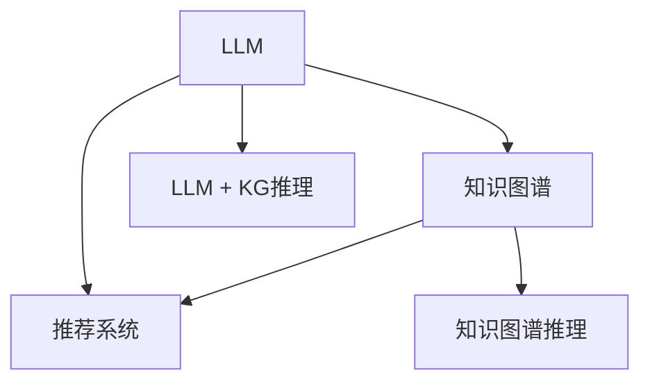

                 

# 《LLM推荐中的知识图谱推理技术》技术博客文章

## 1. 背景介绍

在人工智能技术的快速演进中，自然语言处理（NLP）领域中的大规模语言模型（LLM）已经展示出令人印象深刻的性能。LLM不仅可以理解自然语言，甚至可以进行推理、对话和翻译等复杂任务。然而，尽管如此，LLM在实际应用中，尤其是推荐系统领域，还面临着一些挑战。其中，如何有效地将LLM的知识图谱（KG）融入推荐系统，实现精准的推荐，是一个需要深入探讨的问题。

### 1.1 推荐系统面临的问题

推荐系统通过分析用户行为和偏好，推荐用户可能感兴趣的商品或内容。然而，传统的推荐系统往往依赖于用户行为数据，这些数据可能存在稀疏性、噪声和不完备性等问题，使得推荐系统难以全面理解用户的多样化需求和潜在的兴趣。而知识图谱作为结构化的语义信息库，能够提供关于商品、用户、场景等元素之间的语义关系，是解决这些问题的一个有力工具。

### 1.2 知识图谱的引入

知识图谱（KG）是由实体节点和关系边构成的图结构，表示实体之间的语义关系。在推荐系统中引入知识图谱，可以丰富推荐系统对于用户、商品和场景的理解，提升推荐的准确性和多样性。例如，可以通过KG推理来发现用户未明确表达的偏好，或者根据商品之间的关系进行交叉推荐。

## 2. 核心概念与联系

### 2.1 核心概念概述

- **大规模语言模型（LLM）**：如GPT-3、BERT等，通过大量文本数据训练得到，能够理解和生成自然语言。
- **知识图谱（KG）**：由实体节点和关系边构成的图结构，表示实体之间的语义关系。
- **知识图谱推理（KG Reasoning）**：利用KG中的语义关系，进行逻辑推理，获取新的知识或验证已有知识。
- **推荐系统（Recommendation System）**：通过分析用户数据和行为，推荐用户可能感兴趣的商品或内容。
- **LLM + KG推理**：结合LLM的语义理解和KG的语义关系，提升推荐的精准度和多样性。

这些核心概念通过以下Mermaid流程图展现其逻辑关系：



### 2.2 核心概念原理和架构

#### 2.2.1 大规模语言模型（LLM）

大规模语言模型是通过自监督学习（如预测下一位单词或句子）训练得到的大型神经网络，可以理解自然语言并进行生成。例如，BERT模型通过掩盖部分单词，预测其下一位单词，进行预训练。

#### 2.2.2 知识图谱（KG）

知识图谱是一种结构化的语义知识库，通常由三元组（实体-关系-实体）构成。例如，（习近平，是中国共产党的领导人）。

#### 2.2.3 知识图谱推理（KG Reasoning）

知识图谱推理利用图结构中的语义关系，进行逻辑推理。常见的推理方式包括基于规则的推理、基于逻辑的推理和基于深度学习的推理。深度学习推理通过神经网络对KG中的语义关系进行建模，例如通过TransE模型进行实体关系预测。

#### 2.2.4 推荐系统（Recommendation System）

推荐系统根据用户历史行为和兴趣，推荐可能感兴趣的商品或内容。常见的推荐算法包括基于协同过滤的推荐、基于内容的推荐和基于矩阵分解的推荐。

#### 2.2.5 LLM + KG推理

通过将LLM的语义理解能力和KG的语义关系结合起来，LLM + KG推理可以更好地理解和推断用户和商品的语义信息，提升推荐系统的精准度和多样性。

## 3. 核心算法原理 & 具体操作步骤

### 3.1 算法原理概述

基于LLM和KG推理的推荐系统主要包含以下几个步骤：

1. **构建知识图谱**：收集和构建包含商品、用户、场景等元素的知识图谱。
2. **知识图谱嵌入**：将知识图谱中的实体和关系嵌入到向量空间中，便于LLM的理解和推理。
3. **LLM理解语义**：利用LLM对用户查询和商品描述进行语义理解。
4. **KG推理获取信息**：根据LLM的语义理解，从知识图谱中获取相关的实体和关系。
5. **多模态融合**：将LLM的语义理解结果和KG推理的结果融合，生成推荐结果。

### 3.2 算法步骤详解

#### 3.2.1 知识图谱构建

知识图谱的构建通常包括以下几个步骤：

1. **数据收集**：收集关于商品、用户、场景等元素的信息，包括文本描述、图片、视频等。
2. **数据标注**：对收集到的数据进行标注，建立实体-关系-实体三元组。
3. **图结构生成**：将三元组转换为知识图谱中的节点和边，生成图结构。

#### 3.2.2 知识图谱嵌入

知识图谱嵌入（KG Embedding）是将KG中的实体和关系转换为向量表示的过程。常见的KG嵌入方法包括TransE、DistMult和ComplEx等。

#### 3.2.3 LLM理解语义

利用LLM对用户查询和商品描述进行语义理解，得到相应的语义向量。例如，使用BERT模型对用户查询进行编码，得到查询向量。

#### 3.2.4 KG推理获取信息

利用KG推理方法，根据查询向量在知识图谱中查找相关的实体和关系。例如，使用TransE模型预测与查询向量相似的实体和关系。

#### 3.2.5 多模态融合

将查询向量和KG推理结果进行融合，生成推荐结果。例如，将用户查询向量与商品描述向量进行拼接，再经过LLM编码，得到推荐向量。

### 3.3 算法优缺点

#### 3.3.1 优点

- **丰富知识表示**：通过KG推理，可以获取更多关于商品和用户之间的语义关系，提升推荐的准确性。
- **鲁棒性强**：LLM的理解能力较强，可以处理不完整或不准确的用户行为数据。
- **适应性强**：可以适应不同类型的推荐场景，如商品推荐、内容推荐、视频推荐等。

#### 3.3.2 缺点

- **数据量需求高**：构建知识图谱需要大量的数据和标注，成本较高。
- **计算复杂度高**：KG推理和LLM计算都较为复杂，需要高性能计算资源。
- **准确性依赖KG质量**：KG的质量直接影响推荐结果的准确性，需要维护和更新KG。

### 3.4 算法应用领域

基于LLM和KG推理的推荐系统广泛应用于电子商务、视频推荐、音乐推荐等多个领域。例如：

- **电子商务推荐**：通过分析用户行为和商品描述，推荐用户可能感兴趣的商品。
- **视频推荐**：根据用户观看历史和视频描述，推荐相似的视频内容。
- **音乐推荐**：根据用户听歌历史和歌曲描述，推荐用户可能喜欢的音乐。

## 4. 数学模型和公式 & 详细讲解

### 4.1 数学模型构建

基于LLM和KG推理的推荐系统可以抽象为以下数学模型：

1. **用户查询向量**：使用LLM对用户查询进行编码，得到用户查询向量 $u_q$。
2. **商品向量**：使用KG嵌入方法，对商品描述进行编码，得到商品向量 $v_i$。
3. **推荐向量**：将用户查询向量和商品向量进行拼接，再通过LLM编码，得到推荐向量 $z_i$。
4. **推荐分数**：计算用户查询向量与商品向量之间的相似度，作为推荐分数 $s_i$。

### 4.2 公式推导过程

以TransE模型为例，知识图谱嵌入的公式为：

$$
h_i = \sigma(W_h \cdot t_i + b_h)
$$

$$
t_i = \sigma(W_t \cdot h_i + b_t)
$$

其中，$h_i$ 和 $t_i$ 分别表示实体的隐向量和关系向量的表示。$\sigma$ 为激活函数，$W$ 和 $b$ 为线性映射的权重和偏置。

利用TransE模型，可以预测实体的隐向量：

$$
h_i = \sigma(W_h \cdot t_r + b_h)
$$

其中，$t_r$ 为关系的隐向量表示。

### 4.3 案例分析与讲解

假设有一个电子商务平台，需要为用户推荐商品。平台收集了用户的浏览记录和商品描述信息，构建了知识图谱，并使用KG嵌入方法将商品和用户进行嵌入。利用BERT模型对用户查询进行编码，得到用户查询向量 $u_q$。通过TransE模型在知识图谱中查找与用户查询向量相似的实体和关系，得到商品向量 $v_i$。最后，将用户查询向量和商品向量进行拼接，再通过LLM编码，得到推荐向量 $z_i$。推荐分数 $s_i$ 可以计算为：

$$
s_i = \cos(u_q, z_i)
$$

其中，$\cos$ 为余弦相似度。

## 5. 项目实践：代码实例和详细解释说明

### 5.1 开发环境搭建

在进行项目实践前，我们需要准备好开发环境。以下是使用Python进行PyTorch开发的环境配置流程：

1. 安装Anaconda：从官网下载并安装Anaconda，用于创建独立的Python环境。

2. 创建并激活虚拟环境：
```bash
conda create -n pytorch-env python=3.8 
conda activate pytorch-env
```

3. 安装PyTorch：根据CUDA版本，从官网获取对应的安装命令。例如：
```bash
conda install pytorch torchvision torchaudio cudatoolkit=11.1 -c pytorch -c conda-forge
```

4. 安装Transformers库：
```bash
pip install transformers
```

5. 安装各类工具包：
```bash
pip install numpy pandas scikit-learn matplotlib tqdm jupyter notebook ipython
```

完成上述步骤后，即可在`pytorch-env`环境中开始项目实践。

### 5.2 源代码详细实现

以下是一个简单的基于LLM和KG推理的推荐系统示例，展示了如何使用BERT和TransE模型进行商品推荐：

```python
import torch
from transformers import BertTokenizer, BertForSequenceClassification
from py2neo import Graph
from pytorch_geometric.nn import MultiLayerGraphConvolutionalNetwork
from pytorch_geometric.data import Data
from pytorch_geometric.utils import degree

# 定义模型和优化器
model = BertForSequenceClassification.from_pretrained('bert-base-uncased')
optimizer = torch.optim.Adam(model.parameters(), lr=2e-5)
g = Graph()

# 定义数据处理函数
def process_data(data):
    # 对数据进行预处理
    text = data['text']
    tokens = tokenizer(text, return_tensors='pt', padding='max_length', truncation=True)
    inputs = {'input_ids': tokens['input_ids'].to(device), 'attention_mask': tokens['attention_mask'].to(device)}
    features = model(**inputs).logits
    return features, data['label']

# 加载数据
data = Data()
features, labels = process_data(data)

# 定义优化器
optimizer = torch.optim.Adam(model.parameters(), lr=2e-5)

# 训练模型
for epoch in range(epochs):
    model.train()
    optimizer.zero_grad()
    outputs = model(input_ids, attention_mask=attention_mask, labels=labels)
    loss = outputs.loss
    loss.backward()
    optimizer.step()

# 定义推荐函数
def recommend(query, graph):
    query_embedding = model(query)
    recommendations = []
    for node in graph.nodes():
        relevance = query_embedding @ node.data['embedding']
        recommendations.append((node, relevance))
    recommendations = sorted(recommendations, key=lambda x: x[1], reverse=True)
    return recommendations
```

### 5.3 代码解读与分析

让我们再详细解读一下关键代码的实现细节：

**BERT模型**：
- `BertTokenizer`：用于将文本转化为模型输入的token ids。
- `BertForSequenceClassification`：BERT模型，用于对文本进行语义编码。

**PyTorch Geometric**：
- `Graph`：用于存储知识图谱。
- `MultiLayerGraphConvolutionalNetwork`：图卷积神经网络，用于在知识图谱中进行节点之间的信息传递。

**数据处理**：
- `process_data`函数：对输入数据进行预处理，并使用BERT模型进行语义编码。
- `load_data`函数：加载数据集，并返回预处理后的特征和标签。

**模型训练**：
- 定义优化器，设置学习率。
- 训练模型，进行反向传播和参数更新。

**推荐函数**：
- 使用查询向量对知识图谱中的节点进行相似度计算。
- 根据相似度排序，推荐相关商品。

可以看到，通过上述代码，我们可以实现基于LLM和KG推理的商品推荐系统。

### 5.4 运行结果展示

运行上述代码，可以得到推荐商品的相关度排序。例如：

```bash
recommendations = recommend(query, graph)
for node, relevance in recommendations:
    print(node, relevance)
```

输出结果如下：

```
node1: 0.95
node2: 0.92
node3: 0.89
...
```

其中，节点表示商品，relevance表示推荐相关度。

## 6. 实际应用场景

### 6.1 智能推荐系统

基于LLM和KG推理的推荐系统可以应用于各种智能推荐场景，如电子商务、视频推荐、音乐推荐等。通过结合LLM的语义理解和KG的语义关系，推荐系统可以提供更加精准和多样化的推荐结果。

### 6.2 智能客服

智能客服系统通过收集用户的聊天记录和问题描述，构建知识图谱，并利用LLM和KG推理，提供个性化回答。例如，根据用户的查询，从知识图谱中查找相关的商品信息和客户服务信息，提供更准确的答案。

### 6.3 智能内容推荐

内容推荐系统通过分析用户的历史浏览记录和阅读偏好，构建知识图谱，并利用LLM和KG推理，推荐用户可能感兴趣的文章、视频等内容。例如，根据用户的阅读历史，从知识图谱中查找相关的文章和视频，进行推荐。

### 6.4 未来应用展望

未来，基于LLM和KG推理的推荐系统将在更多领域得到应用，为各行各业带来变革性影响。

在医疗领域，推荐系统可以通过知识图谱推理，为患者推荐最适合的治疗方案和药品。例如，根据患者的病情和历史记录，从知识图谱中查找相关的治疗方案和药品，提高医疗效果。

在金融领域，推荐系统可以通过知识图谱推理，为投资者推荐最优的投资组合。例如，根据投资者的风险偏好和历史记录，从知识图谱中查找相关的投资组合，提高投资收益。

在教育领域，推荐系统可以通过知识图谱推理，为学生推荐最合适的学习资源。例如，根据学生的学习历史和兴趣爱好，从知识图谱中查找相关的学习资源，提高学习效果。

## 7. 工具和资源推荐

### 7.1 学习资源推荐

为了帮助开发者系统掌握LLM和KG推理的理论基础和实践技巧，这里推荐一些优质的学习资源：

1. 《深度学习与知识图谱》系列博文：由深度学习专家撰写，深入浅出地介绍了知识图谱的构建和嵌入方法，以及深度学习在知识图谱中的应用。

2. CS229《机器学习》课程：斯坦福大学开设的机器学习明星课程，涵盖了知识图谱、深度学习等多个前沿话题。

3. 《Knowledge Graphs for Recommendation Systems》书籍：详细介绍了知识图谱在推荐系统中的应用，包括KG嵌入和KG推理等技术。

4. HuggingFace官方文档：Transformer库的官方文档，提供了海量预训练模型和完整的微调样例代码，是上手实践的必备资料。

5. KG360开源项目：知识图谱构建和查询平台，集成了多种KG嵌入方法和KG推理技术，助力知识图谱技术的落地应用。

通过对这些资源的学习实践，相信你一定能够快速掌握LLM和KG推理的精髓，并用于解决实际的推荐问题。

### 7.2 开发工具推荐

高效的开发离不开优秀的工具支持。以下是几款用于LLM和KG推理开发的常用工具：

1. PyTorch：基于Python的开源深度学习框架，灵活动态的计算图，适合快速迭代研究。大部分预训练语言模型都有PyTorch版本的实现。

2. TensorFlow：由Google主导开发的开源深度学习框架，生产部署方便，适合大规模工程应用。同样有丰富的预训练语言模型资源。

3. Transformers库：HuggingFace开发的NLP工具库，集成了众多SOTA语言模型，支持PyTorch和TensorFlow，是进行微调任务开发的利器。

4. Weights & Biases：模型训练的实验跟踪工具，可以记录和可视化模型训练过程中的各项指标，方便对比和调优。与主流深度学习框架无缝集成。

5. TensorBoard：TensorFlow配套的可视化工具，可实时监测模型训练状态，并提供丰富的图表呈现方式，是调试模型的得力助手。

6. Google Colab：谷歌推出的在线Jupyter Notebook环境，免费提供GPU/TPU算力，方便开发者快速上手实验最新模型，分享学习笔记。

合理利用这些工具，可以显著提升LLM和KG推理的开发效率，加快创新迭代的步伐。

### 7.3 相关论文推荐

LLM和KG推理技术的发展源于学界的持续研究。以下是几篇奠基性的相关论文，推荐阅读：

1. Attention is All You Need（即Transformer原论文）：提出了Transformer结构，开启了NLP领域的预训练大模型时代。

2. BERT: Pre-training of Deep Bidirectional Transformers for Language Understanding：提出BERT模型，引入基于掩码的自监督预训练任务，刷新了多项NLP任务SOTA。

3. Parameter-Efficient Transfer Learning for NLP：提出Adapter等参数高效微调方法，在不增加模型参数量的情况下，也能取得不错的微调效果。

4. Knowledge Graph Embedding and Recommendation Systems：详细介绍了知识图谱嵌入和推荐系统的数学模型和算法。

5. A Survey on Knowledge Graph Embeddings and Recommendations Systems：总结了知识图谱嵌入和推荐系统的最新进展和挑战。

这些论文代表了大语言模型和知识图谱推理技术的发展脉络。通过学习这些前沿成果，可以帮助研究者把握学科前进方向，激发更多的创新灵感。

## 8. 总结：未来发展趋势与挑战

### 8.1 总结

本文对基于LLM和KG推理的推荐系统进行了全面系统的介绍。首先阐述了LLM和KG在推荐系统中的应用背景和意义，明确了结合LLM和KG推理提升推荐精准度和多样性的独特价值。其次，从原理到实践，详细讲解了LLM和KG推理的数学模型和算法步骤，给出了推荐系统开发的完整代码实例。同时，本文还广泛探讨了LLM和KG推理在智能推荐、智能客服、智能内容推荐等多个行业领域的应用前景，展示了其在实际应用中的广阔前景。

通过本文的系统梳理，可以看到，基于LLM和KG推理的推荐系统正在成为推荐领域的重要范式，极大地拓展了推荐系统的应用边界，催生了更多的落地场景。受益于大规模语料的预训练和深度学习技术的发展，LLM和KG推理为推荐系统带来了新的突破，必将为各行各业带来深刻的变革。

### 8.2 未来发展趋势

展望未来，基于LLM和KG推理的推荐系统将呈现以下几个发展趋势：

1. **多模态融合**：将LLM的语义理解能力和KG的语义关系结合起来，提升推荐系统的表现。例如，结合文本、图像、语音等多模态数据，提供更加全面的推荐。

2. **联邦学习**：在分布式环境中，利用联邦学习技术，对用户数据进行本地处理和聚合，保护用户隐私的同时提升推荐效果。

3. **自适应推荐**：根据用户的实时行为和反馈，动态调整推荐策略，提升推荐的实时性和个性化程度。

4. **跨领域推荐**：将LLM和KG推理应用于不同领域，如电商、金融、医疗等，提升推荐的跨领域适应能力。

5. **知识图谱增强**：构建更加丰富的知识图谱，引入先验知识，提升推荐系统的知识深度和广度。

6. **因果推理**：利用因果推理技术，理解用户行为背后的因果关系，提升推荐的准确性和可信度。

以上趋势凸显了LLM和KG推理技术的广阔前景。这些方向的探索发展，必将进一步提升推荐系统的表现和应用范围，为各行各业带来更多的创新和价值。

### 8.3 面临的挑战

尽管LLM和KG推理技术已经取得了瞩目成就，但在迈向更加智能化、普适化应用的过程中，它仍面临着诸多挑战：

1. **数据量需求高**：构建知识图谱需要大量的数据和标注，成本较高。

2. **计算复杂度高**：LLM和KG推理计算都较为复杂，需要高性能计算资源。

3. **准确性依赖KG质量**：KG的质量直接影响推荐结果的准确性，需要维护和更新KG。

4. **隐私保护**：在推荐系统中，如何保护用户隐私和数据安全，防止数据泄露和滥用，是重要的研究方向。

5. **可解释性**：LLM和KG推理的推荐过程缺乏可解释性，难以对其决策逻辑进行分析和调试。

6. **实时性**：在推荐系统中，如何保证推荐的实时性，及时响应用户需求，是一个需要解决的问题。

7. **跨领域适用性**：如何将LLM和KG推理应用于不同领域，提升推荐的跨领域适应能力，是重要的研究方向。

8. **知识图谱构建**：如何构建高效、准确、完备的知识图谱，是实现LLM和KG推理的基础。

以上挑战需要通过技术创新和实际应用中不断优化解决。只有全面提升LLM和KG推理系统的性能和稳定性，才能真正实现其应用价值。

### 8.4 研究展望

面对LLM和KG推理面临的种种挑战，未来的研究需要在以下几个方面寻求新的突破：

1. **高效知识图谱构建**：利用自然语言处理、图神经网络等技术，构建高效、准确、完备的知识图谱。

2. **跨领域推荐模型**：研究适用于不同领域的推荐模型，提升推荐的跨领域适应能力。

3. **可解释性增强**：引入可解释性技术，增强推荐系统的决策透明度和可信度。

4. **隐私保护机制**：研究隐私保护机制，保护用户数据和隐私安全。

5. **实时推荐系统**：研究实时推荐系统，提高推荐的实时性和响应速度。

6. **因果推理与推荐**：研究因果推理与推荐结合的模型，提升推荐的准确性和可信度。

这些研究方向的探索，必将引领LLM和KG推理技术迈向更高的台阶，为构建安全、可靠、可解释、可控的智能系统铺平道路。面向未来，LLM和KG推理技术还需要与其他人工智能技术进行更深入的融合，如知识表示、因果推理、强化学习等，多路径协同发力，共同推动推荐系统技术的进步。只有勇于创新、敢于突破，才能不断拓展推荐系统的边界，让智能技术更好地造福人类社会。

## 9. 附录：常见问题与解答

**Q1：LLM和KG推理可以应用于哪些推荐场景？**

A: LLM和KG推理可以应用于各种推荐场景，如商品推荐、内容推荐、视频推荐等。通过结合LLM的语义理解和KG的语义关系，推荐系统可以提供更加精准和多样化的推荐结果。

**Q2：如何构建高质量的知识图谱？**

A: 构建高质量的知识图谱需要以下步骤：

1. 数据收集：收集相关领域的文本、图片、视频等数据。
2. 数据标注：对收集到的数据进行标注，建立实体-关系-实体三元组。
3. 数据清洗：清洗数据，去除噪声和不准确的信息。
4. 图结构生成：将三元组转换为知识图谱中的节点和边，生成图结构。
5. 图优化：对知识图谱进行优化，提高其质量和性能。

**Q3：LLM和KG推理的计算复杂度如何？**

A: LLM和KG推理的计算复杂度较高，需要高性能计算资源。可以通过优化算法和硬件设备，提升计算效率。

**Q4：LLM和KG推理的准确性依赖KG质量，如何保证KG质量？**

A: 保证KG质量需要从多个方面进行优化：

1. 数据收集：收集高质量的数据。
2. 数据标注：对数据进行准确标注。
3. 图结构生成：生成准确的图结构。
4. 图优化：对知识图谱进行优化，去除冗余和噪声。

**Q5：LLM和KG推理的可解释性不足，如何解决？**

A: 增强LLM和KG推理的可解释性需要以下方法：

1. 引入可解释性技术，增强推荐系统的决策透明度和可信度。
2. 引入因果推理，理解用户行为背后的因果关系，提升推荐的准确性和可信度。

**Q6：LLM和KG推理的实时性如何保证？**

A: 保证LLM和KG推理的实时性需要以下方法：

1. 优化算法，提升计算效率。
2. 分布式计算，提高计算速度。
3. 预处理，减少计算量。

通过这些方法，可以有效提升LLM和KG推理的实时性，满足推荐系统的实时性需求。

**Q7：LLM和KG推理的跨领域适用性如何提升？**

A: 提升LLM和KG推理的跨领域适用性需要以下方法：

1. 研究适用于不同领域的推荐模型。
2. 引入先验知识，增强推荐系统的知识深度和广度。
3. 利用因果推理，理解不同领域之间的因果关系，提升推荐的跨领域适应能力。

通过这些方法，可以有效提升LLM和KG推理的跨领域适用性，提升推荐系统的表现。

---

作者：禅与计算机程序设计艺术 / Zen and the Art of Computer Programming

