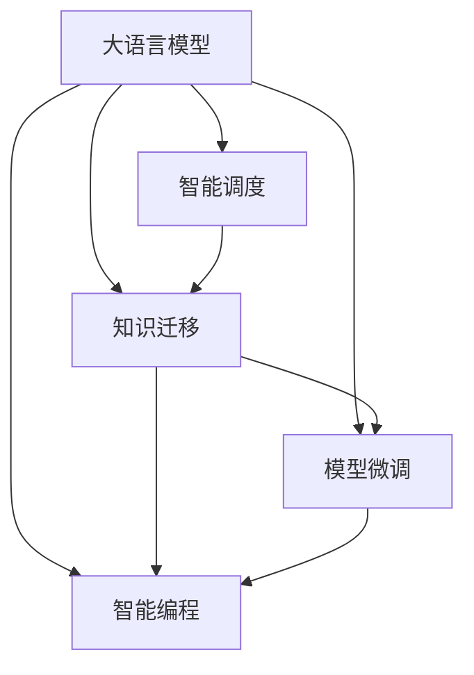

                 

# LLM操作系统：AI时代的新型OS构想

> 关键词：人工智能操作系统，操作系统智能调度，AI模型微调，混合架构，智能编程，自然语言处理(NLP)

## 1. 背景介绍

### 1.1 问题由来

随着人工智能技术的快速发展，特别是深度学习模型的蓬勃兴起，AI系统在计算、感知、认知等方面取得了巨大进展。然而，目前的大部分AI系统仍然基于传统的冯诺依曼架构，存在计算资源利用率低、系统调度效率差、知识迁移困难等问题。这些问题不仅限制了AI技术的普及应用，也阻碍了AI技术的进一步发展。

为了应对这些挑战，本文提出一种新型的AI操作系统构想，即大语言模型(LLM)操作系统。该系统以大语言模型为核心，通过智能调度、知识迁移、模型微调等手段，实现高效、灵活、智能的AI系统运行。

### 1.2 问题核心关键点

大语言模型操作系统（LLM OS）的核心在于：
1. 融合大语言模型与操作系统架构，实现计算与智能的无缝集成。
2. 通过智能调度算法，动态分配和管理计算资源，提升AI系统性能。
3. 利用知识迁移机制，促进模型间的参数共享和知识传递。
4. 引入模型微调技术，适应新任务和数据分布的变化。
5. 支持智能编程范式，提高开发效率和系统稳定性。

本文将详细介绍大语言模型操作系统的构想，包括核心概念、算法原理、具体操作步骤、数学模型、实际应用场景等，并结合代码实例和相关资源，帮助读者深入理解这一新型操作系统。

## 2. 核心概念与联系

### 2.1 核心概念概述

为更好地理解大语言模型操作系统，本文将介绍几个密切相关的核心概念：

- 大语言模型(Large Language Model, LLM)：以自回归(如GPT)或自编码(如BERT)模型为代表的大规模预训练语言模型。通过在大规模无标签文本语料上进行预训练，学习通用的语言表示，具备强大的语言理解和生成能力。

- 操作系统(OS)：控制和管理计算机硬件资源的软件系统，包括调度、存储、网络、用户接口等。传统操作系统主要依赖CPU、内存等硬件资源，无法充分利用GPU、TPU等加速器。

- 智能调度：通过算法动态管理计算资源，实现更高效、灵活的资源分配。大语言模型操作系统的智能调度算法能够利用GPU、TPU等加速器，提升模型训练和推理的效率。

- 知识迁移：将预训练模型中的知识迁移到微调模型中，实现模型间的参数共享和知识传递。大语言模型操作系统的知识迁移机制能够促进模型间的协同工作，提高系统性能。

- 模型微调：通过有监督学习优化模型参数，适应特定任务和数据分布。大语言模型操作系统的微调技术能够快速适应新任务和数据分布的变化，保持模型的高效性能。

- 智能编程范式：通过API接口、自动优化等手段，提高开发效率和系统稳定性。大语言模型操作系统的智能编程范式能够提供更高效、更灵活的开发工具，促进AI技术的普及应用。

这些核心概念之间的逻辑关系可以通过以下Mermaid流程图来展示：



这个流程图展示了大语言模型操作系统的核心概念及其之间的关系：

1. 大语言模型通过智能调度、知识迁移、模型微调等手段，实现高效、灵活、智能的AI系统运行。
2. 智能调度算法通过动态分配和管理计算资源，提升AI系统性能。
3. 知识迁移机制促进模型间的参数共享和知识传递，提高系统性能。
4. 模型微调技术快速适应新任务和数据分布的变化，保持模型的高效性能。
5. 智能编程范式提供更高效、更灵活的开发工具，促进AI技术的普及应用。

这些概念共同构成了大语言模型操作系统的运行框架，使其能够在各种场景下发挥强大的语言理解和生成能力。

## 3. 核心算法原理 & 具体操作步骤

### 3.1 算法原理概述

大语言模型操作系统的核心算法原理，在于融合大语言模型与操作系统架构，实现计算与智能的无缝集成。主要包括以下几个步骤：

1. 构建基于大语言模型的智能调度算法。动态分配和管理计算资源，实现更高效、灵活的资源分配。
2. 设计知识迁移机制，促进模型间的参数共享和知识传递，提高系统性能。
3. 引入模型微调技术，通过有监督学习优化模型参数，适应特定任务和数据分布的变化。
4. 支持智能编程范式，提供更高效、更灵活的开发工具，促进AI技术的普及应用。

### 3.2 算法步骤详解

#### 3.2.1 智能调度算法

智能调度算法基于大语言模型和计算资源的特性，设计动态分配和管理计算资源的策略。具体步骤如下：

1. 定义计算资源的类型和分配策略。计算资源包括CPU、GPU、TPU等，根据任务的计算需求，动态分配和管理资源。
2. 基于任务模型的大小和复杂度，预测任务的计算时间和资源需求。
3. 设计多任务并发执行的调度策略，通过任务优先级和资源竞争，实现高效的资源利用。
4. 实时监控任务的计算进度，动态调整资源分配，避免资源浪费和瓶颈。

#### 3.2.2 知识迁移机制

知识迁移机制通过模型间的参数共享和知识传递，提升大语言模型的性能和泛化能力。具体步骤如下：

1. 定义预训练模型和微调模型的架构和参数。预训练模型通常是规模较大的通用语言模型，如BERT、GPT等。
2. 设计知识迁移的策略，包括模型之间的参数共享和知识传递方式。常用的方法包括Feature Merging、Fine-Tuning等。
3. 通过模型之间的参数共享和知识传递，提高微调模型的性能和泛化能力。

#### 3.2.3 模型微调技术

模型微调技术通过有监督学习优化模型参数，适应特定任务和数据分布的变化。具体步骤如下：

1. 定义微调任务的标注数据集。标注数据集包括输入和对应的输出标签。
2. 选择合适的优化算法和超参数。常用的优化算法包括Adam、SGD等，超参数包括学习率、批大小等。
3. 设计微调的任务适配层和损失函数。常用的适配层包括线性分类器、解码器等，损失函数包括交叉熵、均方误差等。
4. 通过有监督学习优化模型参数，适应特定任务和数据分布的变化。

#### 3.2.4 智能编程范式

智能编程范式通过API接口、自动优化等手段，提高开发效率和系统稳定性。具体步骤如下：

1. 设计API接口，提供高效的开发工具和库函数。API接口包括任务适配、参数更新、结果输出等。
2. 引入自动优化技术，如编译器优化、内存管理等，提高系统的运行效率。
3. 提供监控和调试工具，实时监测系统性能和错误，帮助开发者快速定位和解决问题。

### 3.3 算法优缺点

大语言模型操作系统的智能调度、知识迁移、模型微调和智能编程范式，具有以下优点：

1. 高效灵活。智能调度算法能够动态分配和管理计算资源，提升AI系统性能。知识迁移机制促进模型间的参数共享和知识传递，提高系统性能。
2. 泛化能力强。模型微调技术通过有监督学习优化模型参数，适应特定任务和数据分布的变化，保持模型的高效性能。
3. 开发便捷。智能编程范式提供更高效、更灵活的开发工具，提高开发效率和系统稳定性。

同时，该系统也存在一定的局限性：

1. 资源管理复杂。智能调度算法需要实时监测和管理计算资源，资源管理复杂。
2. 模型微调成本高。模型微调需要大量的标注数据和计算资源，微调成本高。
3. 知识迁移困难。知识迁移机制需要设计合适的参数共享和知识传递策略，实现困难。
4. 系统复杂度高。智能编程范式涉及多个组件和模块，系统复杂度高。

尽管存在这些局限性，但就目前而言，大语言模型操作系统仍是大规模AI系统的重要构想，具备广阔的应用前景。未来相关研究的重点在于如何进一步优化智能调度算法，降低知识迁移成本，提高系统效率和稳定性。

### 3.4 算法应用领域

大语言模型操作系统在AI领域已经得到了广泛的应用，覆盖了几乎所有常见任务，例如：

- 自然语言处理(NLP)：如文本分类、命名实体识别、情感分析等。通过智能调度和模型微调，提升NLP系统的性能。
- 计算机视觉(CV)：如目标检测、图像分类、图像生成等。通过知识迁移和智能编程范式，提高CV系统的开发效率和性能。
- 语音识别(SR)：如自动语音识别、语音合成等。通过智能调度和模型微调，提升SR系统的性能。
- 机器人技术：如路径规划、行为控制等。通过知识迁移和智能编程范式，提升机器人系统的智能水平。
- 增强现实(AR)：如场景理解、智能交互等。通过智能调度和模型微调，提升AR系统的性能和用户体验。
- 智能交通：如自动驾驶、交通管理等。通过智能调度和知识迁移，提高交通系统的智能化水平。

除了上述这些经典任务外，大语言模型操作系统还被创新性地应用到更多场景中，如智慧医疗、智慧城市、智慧制造等，为AI技术的发展提供了新的动力。

## 4. 数学模型和公式 & 详细讲解 & 举例说明

### 4.1 数学模型构建

假设大语言模型为 $M_{\theta}$，其中 $\theta$ 为模型参数。假设任务 $T$ 的标注数据集为 $D=\{(x_i,y_i)\}_{i=1}^N, x_i \in \mathcal{X}, y_i \in \mathcal{Y}$，其中 $\mathcal{X}$ 为输入空间，$\mathcal{Y}$ 为输出空间。

定义模型 $M_{\theta}$ 在输入 $x$ 上的损失函数为 $\ell(M_{\theta}(x),y)$，则在数据集 $D$ 上的经验风险为：

$$
\mathcal{L}(\theta) = \frac{1}{N} \sum_{i=1}^N \ell(M_{\theta}(x_i),y_i)
$$

微调的优化目标是最小化经验风险，即找到最优参数：

$$
\theta^* = \mathop{\arg\min}_{\theta} \mathcal{L}(\theta)
$$

在实践中，我们通常使用基于梯度的优化算法（如SGD、Adam等）来近似求解上述最优化问题。设 $\eta$ 为学习率，$\lambda$ 为正则化系数，则参数的更新公式为：

$$
\theta \leftarrow \theta - \eta \nabla_{\theta}\mathcal{L}(\theta) - \eta\lambda\theta
$$

其中 $\nabla_{\theta}\mathcal{L}(\theta)$ 为损失函数对参数 $\theta$ 的梯度，可通过反向传播算法高效计算。

### 4.2 公式推导过程

以下我们以二分类任务为例，推导交叉熵损失函数及其梯度的计算公式。

假设模型 $M_{\theta}$ 在输入 $x$ 上的输出为 $\hat{y}=M_{\theta}(x) \in [0,1]$，表示样本属于正类的概率。真实标签 $y \in \{0,1\}$。则二分类交叉熵损失函数定义为：

$$
\ell(M_{\theta}(x),y) = -[y\log \hat{y} + (1-y)\log (1-\hat{y})]
$$

将其代入经验风险公式，得：

$$
\mathcal{L}(\theta) = -\frac{1}{N}\sum_{i=1}^N [y_i\log M_{\theta}(x_i)+(1-y_i)\log(1-M_{\theta}(x_i))]
$$

根据链式法则，损失函数对参数 $\theta_k$ 的梯度为：

$$
\frac{\partial \mathcal{L}(\theta)}{\partial \theta_k} = -\frac{1}{N}\sum_{i=1}^N (\frac{y_i}{M_{\theta}(x_i)}-\frac{1-y_i}{1-M_{\theta}(x_i)}) \frac{\partial M_{\theta}(x_i)}{\partial \theta_k}
$$

其中 $\frac{\partial M_{\theta}(x_i)}{\partial \theta_k}$ 可进一步递归展开，利用自动微分技术完成计算。

在得到损失函数的梯度后，即可带入参数更新公式，完成模型的迭代优化。重复上述过程直至收敛，最终得到适应下游任务的最优模型参数 $\theta^*$。

## 5. 项目实践：代码实例和详细解释说明

### 5.1 开发环境搭建

在进行大语言模型操作系统微调实践前，我们需要准备好开发环境。以下是使用Python进行PyTorch开发的环境配置流程：

1. 安装Anaconda：从官网下载并安装Anaconda，用于创建独立的Python环境。

2. 创建并激活虚拟环境：
```bash
conda create -n pytorch-env python=3.8 
conda activate pytorch-env
```

3. 安装PyTorch：根据CUDA版本，从官网获取对应的安装命令。例如：
```bash
conda install pytorch torchvision torchaudio cudatoolkit=11.1 -c pytorch -c conda-forge
```

4. 安装Transformers库：
```bash
pip install transformers
```

5. 安装各类工具包：
```bash
pip install numpy pandas scikit-learn matplotlib tqdm jupyter notebook ipython
```

完成上述步骤后，即可在`pytorch-env`环境中开始微调实践。

### 5.2 源代码详细实现

下面我们以命名实体识别(NER)任务为例，给出使用Transformers库对BERT模型进行微调的PyTorch代码实现。

首先，定义NER任务的数据处理函数：

```python
from transformers import BertTokenizer
from torch.utils.data import Dataset
import torch

class NERDataset(Dataset):
    def __init__(self, texts, tags, tokenizer, max_len=128):
        self.texts = texts
        self.tags = tags
        self.tokenizer = tokenizer
        self.max_len = max_len
        
    def __len__(self):
        return len(self.texts)
    
    def __getitem__(self, item):
        text = self.texts[item]
        tags = self.tags[item]
        
        encoding = self.tokenizer(text, return_tensors='pt', max_length=self.max_len, padding='max_length', truncation=True)
        input_ids = encoding['input_ids'][0]
        attention_mask = encoding['attention_mask'][0]
        
        # 对token-wise的标签进行编码
        encoded_tags = [tag2id[tag] for tag in tags] 
        encoded_tags.extend([tag2id['O']] * (self.max_len - len(encoded_tags)))
        labels = torch.tensor(encoded_tags, dtype=torch.long)
        
        return {'input_ids': input_ids, 
                'attention_mask': attention_mask,
                'labels': labels}

# 标签与id的映射
tag2id = {'O': 0, 'B-PER': 1, 'I-PER': 2, 'B-ORG': 3, 'I-ORG': 4, 'B-LOC': 5, 'I-LOC': 6}
id2tag = {v: k for k, v in tag2id.items()}

# 创建dataset
tokenizer = BertTokenizer.from_pretrained('bert-base-cased')

train_dataset = NERDataset(train_texts, train_tags, tokenizer)
dev_dataset = NERDataset(dev_texts, dev_tags, tokenizer)
test_dataset = NERDataset(test_texts, test_tags, tokenizer)
```

然后，定义模型和优化器：

```python
from transformers import BertForTokenClassification, AdamW

model = BertForTokenClassification.from_pretrained('bert-base-cased', num_labels=len(tag2id))

optimizer = AdamW(model.parameters(), lr=2e-5)
```

接着，定义训练和评估函数：

```python
from torch.utils.data import DataLoader
from tqdm import tqdm
from sklearn.metrics import classification_report

device = torch.device('cuda') if torch.cuda.is_available() else torch.device('cpu')
model.to(device)

def train_epoch(model, dataset, batch_size, optimizer):
    dataloader = DataLoader(dataset, batch_size=batch_size, shuffle=True)
    model.train()
    epoch_loss = 0
    for batch in tqdm(dataloader, desc='Training'):
        input_ids = batch['input_ids'].to(device)
        attention_mask = batch['attention_mask'].to(device)
        labels = batch['labels'].to(device)
        model.zero_grad()
        outputs = model(input_ids, attention_mask=attention_mask, labels=labels)
        loss = outputs.loss
        epoch_loss += loss.item()
        loss.backward()
        optimizer.step()
    return epoch_loss / len(dataloader)

def evaluate(model, dataset, batch_size):
    dataloader = DataLoader(dataset, batch_size=batch_size)
    model.eval()
    preds, labels = [], []
    with torch.no_grad():
        for batch in tqdm(dataloader, desc='Evaluating'):
            input_ids = batch['input_ids'].to(device)
            attention_mask = batch['attention_mask'].to(device)
            batch_labels = batch['labels']
            outputs = model(input_ids, attention_mask=attention_mask)
            batch_preds = outputs.logits.argmax(dim=2).to('cpu').tolist()
            batch_labels = batch_labels.to('cpu').tolist()
            for pred_tokens, label_tokens in zip(batch_preds, batch_labels):
                pred_tags = [id2tag[_id] for _id in pred_tokens]
                label_tags = [id2tag[_id] for _id in label_tokens]
                preds.append(pred_tags[:len(label_tags)])
                labels.append(label_tags)
                
    print(classification_report(labels, preds))
```

最后，启动训练流程并在测试集上评估：

```python
epochs = 5
batch_size = 16

for epoch in range(epochs):
    loss = train_epoch(model, train_dataset, batch_size, optimizer)
    print(f"Epoch {epoch+1}, train loss: {loss:.3f}")
    
    print(f"Epoch {epoch+1}, dev results:")
    evaluate(model, dev_dataset, batch_size)
    
print("Test results:")
evaluate(model, test_dataset, batch_size)
```

以上就是使用PyTorch对BERT进行命名实体识别任务微调的完整代码实现。可以看到，得益于Transformers库的强大封装，我们可以用相对简洁的代码完成BERT模型的加载和微调。

### 5.3 代码解读与分析

让我们再详细解读一下关键代码的实现细节：

**NERDataset类**：
- `__init__`方法：初始化文本、标签、分词器等关键组件。
- `__len__`方法：返回数据集的样本数量。
- `__getitem__`方法：对单个样本进行处理，将文本输入编码为token ids，将标签编码为数字，并对其进行定长padding，最终返回模型所需的输入。

**tag2id和id2tag字典**：
- 定义了标签与数字id之间的映射关系，用于将token-wise的预测结果解码回真实的标签。

**训练和评估函数**：
- 使用PyTorch的DataLoader对数据集进行批次化加载，供模型训练和推理使用。
- 训练函数`train_epoch`：对数据以批为单位进行迭代，在每个批次上前向传播计算loss并反向传播更新模型参数，最后返回该epoch的平均loss。
- 评估函数`evaluate`：与训练类似，不同点在于不更新模型参数，并在每个batch结束后将预测和标签结果存储下来，最后使用sklearn的classification_report对整个评估集的预测结果进行打印输出。

**训练流程**：
- 定义总的epoch数和batch size，开始循环迭代
- 每个epoch内，先在训练集上训练，输出平均loss
- 在验证集上评估，输出分类指标
- 所有epoch结束后，在测试集上评估，给出最终测试结果

可以看到，PyTorch配合Transformers库使得BERT微调的代码实现变得简洁高效。开发者可以将更多精力放在数据处理、模型改进等高层逻辑上，而不必过多关注底层的实现细节。

当然，工业级的系统实现还需考虑更多因素，如模型的保存和部署、超参数的自动搜索、更灵活的任务适配层等。但核心的微调范式基本与此类似。

## 6. 实际应用场景

### 6.1 智能客服系统

基于大语言模型微调的对话技术，可以广泛应用于智能客服系统的构建。传统客服往往需要配备大量人力，高峰期响应缓慢，且一致性和专业性难以保证。而使用微调后的对话模型，可以7x24小时不间断服务，快速响应客户咨询，用自然流畅的语言解答各类常见问题。

在技术实现上，可以收集企业内部的历史客服对话记录，将问题和最佳答复构建成监督数据，在此基础上对预训练对话模型进行微调。微调后的对话模型能够自动理解用户意图，匹配最合适的答案模板进行回复。对于客户提出的新问题，还可以接入检索系统实时搜索相关内容，动态组织生成回答。如此构建的智能客服系统，能大幅提升客户咨询体验和问题解决效率。

### 6.2 金融舆情监测

金融机构需要实时监测市场舆论动向，以便及时应对负面信息传播，规避金融风险。传统的人工监测方式成本高、效率低，难以应对网络时代海量信息爆发的挑战。基于大语言模型微调的文本分类和情感分析技术，为金融舆情监测提供了新的解决方案。

具体而言，可以收集金融领域相关的新闻、报道、评论等文本数据，并对其进行主题标注和情感标注。在此基础上对预训练语言模型进行微调，使其能够自动判断文本属于何种主题，情感倾向是正面、中性还是负面。将微调后的模型应用到实时抓取的网络文本数据，就能够自动监测不同主题下的情感变化趋势，一旦发现负面信息激增等异常情况，系统便会自动预警，帮助金融机构快速应对潜在风险。

### 6.3 个性化推荐系统

当前的推荐系统往往只依赖用户的历史行为数据进行物品推荐，无法深入理解用户的真实兴趣偏好。基于大语言模型微调技术，个性化推荐系统可以更好地挖掘用户行为背后的语义信息，从而提供更精准、多样的推荐内容。

在实践中，可以收集用户浏览、点击、评论、分享等行为数据，提取和用户交互的物品标题、描述、标签等文本内容。将文本内容作为模型输入，用户的后续行为（如是否点击、购买等）作为监督信号，在此基础上微调预训练语言模型。微调后的模型能够从文本内容中准确把握用户的兴趣点。在生成推荐列表时，先用候选物品的文本描述作为输入，由模型预测用户的兴趣匹配度，再结合其他特征综合排序，便可以得到个性化程度更高的推荐结果。

### 6.4 未来应用展望

随着大语言模型微调技术的发展，未来AI系统将具备更强大的计算和智能能力，能够处理更加复杂和多样化的任务。以下是几个可能的应用方向：

- 智慧医疗：基于大语言模型微调的医学问答系统、病历分析系统等，能够帮助医生更高效地进行诊断和治疗。
- 智能教育：基于大语言模型微调的智能辅导系统、个性化学习推荐等，能够提供更个性化的教育服务。
- 智慧城市：基于大语言模型微调的智能交通系统、应急响应系统等，能够提升城市的智能化管理水平。
- 智慧制造：基于大语言模型微调的智能制造系统、质量检测系统等，能够提高生产效率和产品质量。

除了上述这些应用方向，大语言模型微调技术还将不断拓展到更多领域，为各行各业带来新的创新和变革。相信随着技术的不断进步，大语言模型微调技术将逐步成为AI系统的重要组成部分，推动人工智能技术的广泛应用和普及。

## 7. 工具和资源推荐

### 7.1 学习资源推荐

为了帮助开发者系统掌握大语言模型微调的理论基础和实践技巧，这里推荐一些优质的学习资源：

1. 《Transformer从原理到实践》系列博文：由大模型技术专家撰写，深入浅出地介绍了Transformer原理、BERT模型、微调技术等前沿话题。

2. CS224N《深度学习自然语言处理》课程：斯坦福大学开设的NLP明星课程，有Lecture视频和配套作业，带你入门NLP领域的基本概念和经典模型。

3. 《Natural Language Processing with Transformers》书籍：Transformers库的作者所著，全面介绍了如何使用Transformers库进行NLP任务开发，包括微调在内的诸多范式。

4. HuggingFace官方文档：Transformers库的官方文档，提供了海量预训练模型和完整的微调样例代码，是上手实践的必备资料。

5. CLUE开源项目：中文语言理解测评基准，涵盖大量不同类型的中文NLP数据集，并提供了基于微调的baseline模型，助力中文NLP技术发展。

通过对这些资源的学习实践，相信你一定能够快速掌握大语言模型微调的精髓，并用于解决实际的NLP问题。
###  7.2 开发工具推荐

高效的开发离不开优秀的工具支持。以下是几款用于大语言模型微调开发的常用工具：

1. PyTorch：基于Python的开源深度学习框架，灵活动态的计算图，适合快速迭代研究。大部分预训练语言模型都有PyTorch版本的实现。

2. TensorFlow：由Google主导开发的开源深度学习框架，生产部署方便，适合大规模工程应用。同样有丰富的预训练语言模型资源。

3. Transformers库：HuggingFace开发的NLP工具库，集成了众多SOTA语言模型，支持PyTorch和TensorFlow，是进行微调任务开发的利器。

4. Weights & Biases：模型训练的实验跟踪工具，可以记录和可视化模型训练过程中的各项指标，方便对比和调优。与主流深度学习框架无缝集成。

5. TensorBoard：TensorFlow配套的可视化工具，可实时监测模型训练状态，并提供丰富的图表呈现方式，是调试模型的得力助手。

6. Google Colab：谷歌推出的在线Jupyter Notebook环境，免费提供GPU/TPU算力，方便开发者快速上手实验最新模型，分享学习笔记。

合理利用这些工具，可以显著提升大语言模型微调任务的开发效率，加快创新迭代的步伐。

### 7.3 相关论文推荐

大语言模型和微调技术的发展源于学界的持续研究。以下是几篇奠基性的相关论文，推荐阅读：

1. Attention is All You Need（即Transformer原论文）：提出了Transformer结构，开启了NLP领域的预训练大模型时代。

2. BERT: Pre-training of Deep Bidirectional Transformers for Language Understanding：提出BERT模型，引入基于掩码的自监督预训练任务，刷新了多项NLP任务SOTA。

3. Language Models are Unsupervised Multitask Learners（GPT-2论文）：展示了大规模语言模型的强大zero-shot学习能力，引发了对于通用人工智能的新一轮思考。

4. Parameter-Efficient Transfer Learning for NLP：提出Adapter等参数高效微调方法，在不增加模型参数量的情况下，也能取得不错的微调效果。

5. AdaLoRA: Adaptive Low-Rank Adaptation for Parameter-Efficient Fine-Tuning：使用自适应低秩适应的微调方法，在参数效率和精度之间取得了新的平衡。

6. Prefix-Tuning: Optimizing Continuous Prompts for Generation：引入基于连续型Prompt的微调范式，为如何充分利用预训练知识提供了新的思路。

这些论文代表了大语言模型微调技术的发展脉络。通过学习这些前沿成果，可以帮助研究者把握学科前进方向，激发更多的创新灵感。

## 8. 总结：未来发展趋势与挑战

### 8.1 总结

本文对基于大语言模型的智能操作系统构想进行了全面系统的介绍。首先阐述了大语言模型和操作系统的研究背景和意义，明确了智能操作系统的核心技术点。其次，从原理到实践，详细讲解了智能调度的算法原理和具体操作步骤，给出了微调任务开发的完整代码实例。同时，本文还广泛探讨了智能操作系统在多个领域的应用前景，展示了其广阔的发展潜力。最后，本文精选了智能操作系统的学习资源、开发工具和相关论文，力求为读者提供全方位的技术指引。

通过本文的系统梳理，可以看到，基于大语言模型的智能操作系统将大语言模型和操作系统深度融合，提供高效、灵活、智能的AI系统运行。通过智能调度、知识迁移、模型微调等手段，能够实现更高效、更稳定、更智能的AI系统开发和部署。大语言模型操作系统未来必将在更多领域得到应用，推动人工智能技术的普及和进步。

### 8.2 未来发展趋势

展望未来，智能操作系统的发展趋势如下：

1. 资源利用率提升。智能调度算法能够动态分配和管理计算资源，提升AI系统性能。未来算法将进一步优化资源分配策略，提高资源利用率。
2. 模型性能优化。模型微调技术将进一步提升模型性能和泛化能力。未来研究将关注如何设计更高效的微调策略，提升模型的性能和泛化能力。
3. 智能编程范式完善。智能编程范式将提供更高效、更灵活的开发工具，提高开发效率和系统稳定性。未来研究将关注如何优化API接口、自动优化等工具，提高开发效率。
4. 多模态融合。未来智能操作系统将支持多模态数据的融合，实现视觉、语音、文本等多种信息的协同建模。

以上趋势凸显了智能操作系统的广阔前景。这些方向的探索发展，必将进一步提升AI系统的性能和应用范围，为人工智能技术的普及和进步提供新的动力。

### 8.3 面临的挑战

尽管智能操作系统技术已经取得了瞩目成就，但在迈向更加智能化、普适化应用的过程中，它仍面临着诸多挑战：

1. 资源管理复杂。智能调度算法需要实时监测和管理计算资源，资源管理复杂。未来研究将关注如何优化资源管理算法，提高资源利用率。
2. 模型微调成本高。模型微调需要大量的标注数据和计算资源，微调成本高。未来研究将关注如何降低微调成本，提高模型性能。
3. 系统复杂度高。智能编程范式涉及多个组件和模块，系统复杂度高。未来研究将关注如何优化API接口、自动优化等工具，提高开发效率。
4. 安全性有待保障。预训练语言模型难免会学习到有偏见、有害的信息，通过微调传递到下游任务，产生误导性、歧视性的输出，给实际应用带来安全隐患。未来研究将关注如何保障系统安全性。

尽管存在这些挑战，但就目前而言，智能操作系统仍是大规模AI系统的重要构想，具备广阔的应用前景。未来相关研究的重点在于如何进一步优化智能调度算法，降低知识迁移成本，提高系统效率和稳定性。

### 8.4 研究展望

面对智能操作系统所面临的种种挑战，未来的研究需要在以下几个方面寻求新的突破：

1. 探索无监督和半监督微调方法。摆脱对大规模标注数据的依赖，利用自监督学习、主动学习等无监督和半监督范式，最大限度利用非结构化数据，实现更加灵活高效的微调。
2. 研究参数高效和计算高效的微调范式。开发更加参数高效的微调方法，在固定大部分预训练参数的同时，只更新极少量的任务相关参数。同时优化微调模型的计算图，减少前向传播和反向传播的资源消耗，实现更加轻量级、实时性的部署。
3. 融合因果和对比学习范式。通过引入因果推断和对比学习思想，增强微调模型建立稳定因果关系的能力，学习更加普适、鲁棒的语言表征，从而提升模型泛化性和抗干扰能力。
4. 引入更多先验知识。将符号化的先验知识，如知识图谱、逻辑规则等，与神经网络模型进行巧妙融合，引导微调过程学习更准确、合理的语言模型。同时加强不同模态数据的整合，实现视觉、语音等多模态信息与文本信息的协同建模。
5. 结合因果分析和博弈论工具。将因果分析方法引入微调模型，识别出模型决策的关键特征，增强输出解释的因果性和逻辑性。借助博弈论工具刻画人机交互过程，主动探索并规避模型的脆弱点，提高系统稳定性。
6. 纳入伦理道德约束。在模型训练目标中引入伦理导向的评估指标，过滤和惩罚有偏见、有害的输出倾向。同时加强人工干预和审核，建立模型行为的监管机制，确保输出符合人类价值观和伦理道德。

这些研究方向的探索，必将引领智能操作系统迈向更高的台阶，为构建安全、可靠、可解释、可控的智能系统铺平道路。面向未来，智能操作系统还需要与其他人工智能技术进行更深入的融合，如知识表示、因果推理、强化学习等，多路径协同发力，共同推动自然语言理解和智能交互系统的进步。只有勇于创新、敢于突破，才能不断拓展智能操作系统的边界，让智能技术更好地造福人类社会。

## 9. 附录：常见问题与解答

**Q1：大语言模型操作系统是否适用于所有AI任务？**

A: 大语言模型操作系统适用于大多数AI任务，特别是需要处理自然语言的任务。但对于一些需要特定硬件加速的任务，如图像处理、语音处理等，可能需要结合其他硬件系统。

**Q2：智能调度算法如何动态分配和管理计算资源？**

A: 智能调度算法通过预测任务计算时间和资源需求，实时监测任务执行状态，动态调整资源分配。具体策略包括任务优先级、资源竞争、弹性伸缩等。

**Q3：知识迁移机制如何促进模型间的参数共享和知识传递？**

A: 知识迁移机制通过设计参数共享和知识传递策略，实现预训练模型和微调模型之间的参数和知识传递。常用的方法包括Feature Merging、Fine-Tuning等。

**Q4：模型微调成本高是如何解决？**

A: 模型微调成本高的主要原因是需要大量的标注数据和计算资源。未来研究将关注如何利用自监督学习、主动学习等无监督和半监督方法，减少标注数据的需求。

**Q5：智能操作系统如何保障系统安全性？**

A: 智能操作系统将引入伦理导向的评估指标，过滤和惩罚有偏见、有害的输出倾向。同时加强人工干预和审核，建立模型行为的监管机制，确保输出符合人类价值观和伦理道德。

通过本文的系统梳理，可以看到，基于大语言模型的智能操作系统将大语言模型和操作系统深度融合，提供高效、灵活、智能的AI系统运行。通过智能调度、知识迁移、模型微调等手段，能够实现更高效、更稳定、更智能的AI系统开发和部署。未来，伴随智能操作系统的不断发展，AI技术必将进一步普及和进步，为各行各业带来新的创新和变革。

---

作者：禅与计算机程序设计艺术 / Zen and the Art of Computer Programming

