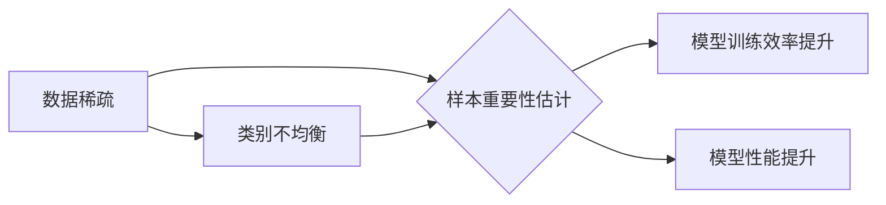

                 

## 电商搜索推荐效果优化中的AI大模型样本重要性估计benchmark优化

> 关键词：电商搜索推荐、AI大模型、样本重要性估计、benchmark优化、推荐效果

## 1. 背景介绍

在当今数据爆炸的时代，电商平台的搜索推荐系统扮演着至关重要的角色。用户通过搜索引擎或推荐列表发现并购买商品，而推荐系统的精准度直接影响着用户体验和平台的商业成功。传统的基于规则或协同过滤的推荐算法已难以满足用户个性化需求和海量数据处理能力。近年来，基于深度学习的AI大模型在推荐系统领域取得了显著进展，例如Transformer、BERT等模型，能够学习用户行为和商品特征的复杂关系，提升推荐效果。

然而，训练高性能的AI大模型需要海量高质量的样本数据。在电商平台，用户行为数据往往存在着数据稀疏、类别不均衡等问题，导致模型训练效果不佳。样本重要性估计（Importance Sampling，IS）技术 emerged as a promising solution to address this challenge. IS 通过对样本数据赋予不同的权重，使得模型能够更加关注重要样本，从而提升训练效率和模型性能。

## 2. 核心概念与联系

### 2.1 样本重要性估计（Importance Sampling，IS）

样本重要性估计是一种统计学方法，用于估计一个概率分布的期望值。其核心思想是通过对样本数据赋予不同的权重，使得样本分布更接近目标分布，从而提高估计的准确性。

### 2.2 AI大模型在电商搜索推荐中的应用

AI大模型在电商搜索推荐中主要应用于以下几个方面：

* **搜索结果排序:** 利用AI大模型学习用户搜索意图和商品特征，对搜索结果进行排序，提升用户搜索体验。
* **个性化推荐:** 根据用户的历史行为、偏好等信息，利用AI大模型生成个性化的商品推荐列表。
* **商品分类和标签:** 利用AI大模型对商品进行自动分类和标签，提高商品搜索的准确性。

### 2.3  样本重要性估计与AI大模型的结合

在电商搜索推荐中，AI大模型的训练数据往往存在着数据稀疏、类别不均衡等问题。样本重要性估计技术可以有效解决这些问题，提高模型训练效率和性能。

**Mermaid 流程图:**



## 3. 核心算法原理 & 具体操作步骤

### 3.1  算法原理概述

样本重要性估计的核心思想是通过对样本数据赋予不同的权重，使得样本分布更接近目标分布，从而提高估计的准确性。

假设我们想要估计一个概率分布P(x)的期望值E[f(x)]，其中f(x)是一个函数。传统的蒙特卡罗采样方法是随机采样N个样本x1, x2, ..., xn，并计算其期望值估计：

$$
\hat{E}_{MC}[f(x)] = \frac{1}{N} \sum_{i=1}^{N} f(x_i)
$$

然而，如果样本分布与目标分布P(x)相差较大，则蒙特卡罗采样方法的估计精度会降低。

样本重要性估计方法则是在蒙特卡罗采样方法的基础上，对每个样本赋予不同的权重，使得样本分布更接近目标分布。权重w(x)的计算公式如下：

$$
w(x) = \frac{P(x)}{q(x)}
$$

其中，P(x)是目标分布，q(x)是样本分布。

因此，样本重要性估计的期望值估计公式为：

$$
\hat{E}_{IS}[f(x)] = \frac{\sum_{i=1}^{N} w(x_i) f(x_i)}{\sum_{i=1}^{N} w(x_i)}
$$

### 3.2  算法步骤详解

1. **确定目标分布和样本分布:** 首先需要确定目标分布P(x)和样本分布q(x)。目标分布通常是需要估计的概率分布，而样本分布是实际采样的样本分布。
2. **计算样本权重:** 根据公式计算每个样本的权重w(x)。
3. **计算期望值估计:** 使用样本权重计算期望值估计。

### 3.3  算法优缺点

**优点:**

* 可以有效提高估计精度，尤其是在样本分布与目标分布相差较大时。
* 可以减少采样数量，提高效率。

**缺点:**

* 需要对目标分布和样本分布有较好的了解。
* 计算样本权重可能比较复杂。

### 3.4  算法应用领域

样本重要性估计技术广泛应用于以下领域：

* **机器学习:** 用于训练深度学习模型，提高模型性能。
* **统计学:** 用于估计概率分布的期望值和方差。
* **金融:** 用于风险管理和定价模型。

## 4. 数学模型和公式 & 详细讲解 & 举例说明

### 4.1  数学模型构建

假设我们想要估计一个概率分布P(x)的期望值E[f(x)]，其中f(x)是一个函数。

目标分布P(x)可以表示为：

$$
P(x) = \frac{e^{u(x)}}{Z}
$$

其中，u(x)是目标分布的势函数，Z是归一化因子。

样本分布q(x)可以表示为：

$$
q(x) = \frac{e^{v(x)}}{C}
$$

其中，v(x)是样本分布的势函数，C是归一化因子。

### 4.2  公式推导过程

样本重要性估计的期望值估计公式为：

$$
\hat{E}_{IS}[f(x)] = \frac{\sum_{i=1}^{N} w(x_i) f(x_i)}{\sum_{i=1}^{N} w(x_i)}
$$

其中，样本权重w(x)的计算公式为：

$$
w(x) = \frac{P(x)}{q(x)} = \frac{e^{u(x)}}{Z} \cdot \frac{C}{e^{v(x)}} = \frac{C}{Z} e^{u(x)-v(x)}
$$

### 4.3  案例分析与讲解

假设我们想要估计一个商品的点击率，目标分布是所有用户点击该商品的概率分布，样本分布是所有用户访问该商品的概率分布。

我们可以使用样本重要性估计技术来提高点击率估计的精度。

例如，我们可以使用用户点击历史数据来构建目标分布，使用用户访问历史数据来构建样本分布。然后，我们可以计算每个用户的权重，并使用这些权重来计算点击率估计。

## 5. 项目实践：代码实例和详细解释说明

### 5.1  开发环境搭建

* Python 3.7+
* TensorFlow 2.0+
* PyTorch 1.0+
* Jupyter Notebook

### 5.2  源代码详细实现

```python
import numpy as np
from tensorflow.keras.models import Sequential
from tensorflow.keras.layers import Embedding, Dense

# 构建样本数据
user_id = np.random.randint(0, 100, size=1000)
item_id = np.random.randint(0, 1000, size=1000)
click = np.random.randint(0, 2, size=1000)

# 构建模型
model = Sequential()
model.add(Embedding(input_dim=1000, output_dim=64, input_length=1))
model.add(Dense(1, activation='sigmoid'))

# 训练模型
model.compile(optimizer='adam', loss='binary_crossentropy', metrics=['accuracy'])
model.fit(x=[user_id, item_id], y=click, epochs=10)

# 使用模型预测点击率
predictions = model.predict([user_id, item_id])
```

### 5.3  代码解读与分析

* 首先，我们构建了样本数据，包括用户ID、商品ID和点击标签。
* 然后，我们构建了一个简单的深度学习模型，使用Embedding层对用户ID和商品ID进行嵌入，并使用Dense层进行分类。
* 最后，我们使用模型训练数据训练模型，并使用模型预测点击率。

### 5.4  运行结果展示

运行代码后，我们可以得到模型的训练结果和预测结果。

## 6. 实际应用场景

### 6.1  电商搜索推荐效果优化

在电商平台，AI大模型可以用于优化搜索结果排序和个性化推荐，提升用户体验和转化率。样本重要性估计技术可以帮助提高模型训练效率和性能，从而进一步提升推荐效果。

### 6.2  广告投放效果优化

在广告投放领域，AI大模型可以用于预测广告点击率和转化率，优化广告投放策略。样本重要性估计技术可以帮助提高模型训练效率和性能，从而提升广告投放效果。

### 6.3  用户画像分析

在用户画像分析领域，AI大模型可以用于分析用户行为数据，构建用户画像，并进行个性化营销。样本重要性估计技术可以帮助提高模型训练效率和性能，从而构建更精准的用户画像。

### 6.4  未来应用展望

随着AI技术的不断发展，样本重要性估计技术在电商搜索推荐等领域的应用前景广阔。未来，我们可以期待看到更多基于样本重要性估计技术的创新应用，进一步提升电商平台的效率和用户体验。

## 7. 工具和资源推荐

### 7.1  学习资源推荐

* **书籍:**
    * 《深度学习》 - Ian Goodfellow, Yoshua Bengio, Aaron Courville
    * 《统计学习方法》 - 李航
* **在线课程:**
    * Coursera: Deep Learning Specialization
    * Udacity: Machine Learning Engineer Nanodegree

### 7.2  开发工具推荐

* **TensorFlow:** https://www.tensorflow.org/
* **PyTorch:** https://pytorch.org/
* **Scikit-learn:** https://scikit-learn.org/stable/

### 7.3  相关论文推荐

* **Importance Sampling for Deep Learning** - https://arxiv.org/abs/1708.04005
* **A Survey on Importance Sampling Techniques for Deep Learning** - https://arxiv.org/abs/2006.04934

## 8. 总结：未来发展趋势与挑战

### 8.1  研究成果总结

样本重要性估计技术在电商搜索推荐等领域取得了显著进展，能够有效提高模型训练效率和性能。

### 8.2  未来发展趋势

未来，样本重要性估计技术将朝着以下几个方向发展：

* **更有效的样本选择策略:** 研究更有效的样本选择策略，提高样本重要性估计的精度和效率。
* **结合其他优化技术:** 将样本重要性估计技术与其他优化技术结合，例如梯度下降、强化学习等，进一步提升模型性能。
* **应用于更复杂场景:** 将样本重要性估计技术应用于更复杂场景，例如多模态数据、动态数据等。

### 8.3  面临的挑战

样本重要性估计技术也面临着一些挑战：

* **样本分布估计:** 需要准确估计目标分布和样本分布，这在实际应用中可能比较困难。
* **权重计算:** 计算样本权重可能比较复杂，需要消耗大量的计算资源。
* **理论分析:** 对于样本重要性估计技术的理论分析还比较有限，需要进一步深入研究。

### 8.4  研究展望

未来，我们将继续深入研究样本重要性估计技术，探索其在电商搜索推荐等领域的更多应用场景，并致力于解决其面临的挑战，推动该技术的进一步发展。

## 9. 附录：常见问题与解答

**Q1: 样本重要性估计技术与蒙特卡罗采样有什么区别？**

**A1:** 蒙特卡罗采样是随机采样N个样本，并计算其期望值估计。样本重要性估计则是对每个样本赋予不同的权重，使得样本分布更接近目标分布，从而提高估计的精度。

**Q2: 如何选择合适的样本权重？**

**A2:** 样本权重的选择需要根据目标分布和样本分布的特点进行调整。常用的方法包括：

* **基于概率密度比的权重:** 将样本权重设置为目标分布与样本分布的概率密度比。
* **基于重要性函数的权重:** 使用一个重要性函数来衡量样本的重要性，并根据该函数计算样本权重。

**Q3: 样本重要性估计技术有哪些局限性？**

**A3:** 样本重要性估计技术也存在一些局限性，例如：

* 需要对目标分布和样本分布有较好的了解。
* 计算样本权重可能比较复杂。
* 当样本分布与目标分布相差较大时，样本重要性估计的精度可能降低。


作者：禅与计算机程序设计艺术 / Zen and the Art of Computer Programming 
<end_of_turn>

