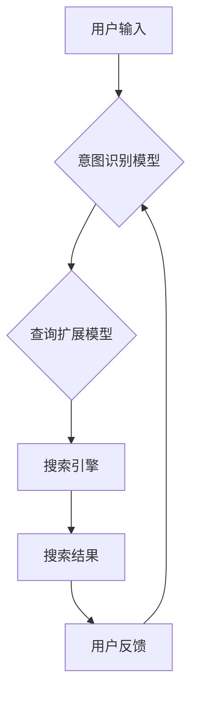

                 

## 电商搜索的意图识别与查询扩展：AI大模型的新突破

> 关键词：电商搜索、意图识别、查询扩展、AI大模型、自然语言处理、推荐系统

## 1. 背景介绍

电商搜索是电商平台的核心功能之一，用户通过输入关键词来查找所需商品。然而，用户输入的关键词往往不够精确，难以准确表达其真实需求。这导致搜索结果不精准，用户体验下降，最终影响转化率。

传统电商搜索主要依赖关键词匹配和规则引擎，存在以下问题：

* **语义理解能力不足:** 无法理解用户搜索背后的真实意图，例如“男装”可能代表“男士服装”或“男性时尚”。
* **缺乏个性化:** 搜索结果缺乏针对用户个人偏好和历史行为的个性化推荐。
* **难以应对长尾关键词:** 长尾关键词难以通过规则匹配进行准确检索。

近年来，随着人工智能技术的快速发展，特别是深度学习的兴起，AI大模型在电商搜索领域展现出巨大的潜力。

## 2. 核心概念与联系

**2.1 意图识别**

意图识别是指理解用户搜索背后的真实需求，将其转化为机器可理解的意图标签。例如，“男装”的意图标签可能是“服装购买”、“风格咨询”或“品牌推荐”。

**2.2 查询扩展**

查询扩展是指根据用户搜索意图，自动生成相关补充关键词，丰富用户搜索请求，提高搜索结果的精准度。例如，“男装”的查询扩展可能包括“衬衫”、“裤子”、“西装”等。

**2.3 AI大模型**

AI大模型是指训练规模庞大、参数数量众多、具备强大泛化能力的深度学习模型。例如，BERT、GPT-3等模型在自然语言理解和生成方面表现出色。

**2.4 架构图**



## 3. 核心算法原理 & 具体操作步骤

**3.1 算法原理概述**

AI大模型在电商搜索的意图识别和查询扩展中发挥着重要作用。

* **意图识别:** 基于Transformer架构的语言模型，例如BERT，可以学习用户搜索词语之间的语义关系，并通过分类算法识别用户的搜索意图。
* **查询扩展:** 基于生成式语言模型，例如GPT-3，可以根据用户搜索意图，生成相关补充关键词，丰富用户搜索请求。

**3.2 算法步骤详解**

**3.2.1 意图识别**

1. **数据预处理:** 将用户搜索词语进行清洗、分词、词向量化等预处理操作。
2. **模型训练:** 使用BERT等预训练语言模型，在电商搜索数据集上进行微调，训练意图识别模型。
3. **意图预测:** 将用户输入的搜索词语作为模型输入，预测其对应的意图标签。

**3.2.2 查询扩展**

1. **意图分类:** 根据用户搜索意图，将搜索词语分类到不同的类别。
2. **关键词生成:** 使用GPT-3等生成式语言模型，根据用户搜索意图和类别，生成相关补充关键词。
3. **关键词筛选:** 对生成的关键词进行筛选，去除重复、无关或低质量的关键词。
4. **查询构建:** 将用户原始搜索词语和筛选后的补充关键词组合成新的查询请求。

**3.3 算法优缺点**

**优点:**

* **语义理解能力强:** AI大模型可以理解用户搜索背后的真实意图，提高搜索结果的精准度。
* **个性化推荐:** 可以根据用户个人偏好和历史行为进行个性化推荐。
* **应对长尾关键词:** 可以有效应对长尾关键词的搜索需求。

**缺点:**

* **模型训练成本高:** AI大模型的训练需要大量的计算资源和数据。
* **模型解释性差:** AI大模型的决策过程难以解释，难以进行调试和优化。

**3.4 算法应用领域**

* 电商搜索
* 智能客服
* 内容推荐
* 语音识别
* 机器翻译

## 4. 数学模型和公式 & 详细讲解 & 举例说明

**4.1 数学模型构建**

意图识别模型可以构建为一个分类模型，例如逻辑回归或支持向量机。

**4.1.1 逻辑回归模型**

逻辑回归模型将用户搜索词语的特征向量作为输入，输出用户搜索意图的概率分布。

$$
P(y=i|x) = \frac{e^{w_i^T x + b_i}}{ \sum_{j=1}^{K} e^{w_j^T x + b_j}}
$$

其中：

* $P(y=i|x)$ 是用户搜索意图为 $i$ 的概率。
* $x$ 是用户搜索词语的特征向量。
* $w_i$ 是第 $i$ 个意图对应的权重向量。
* $b_i$ 是第 $i$ 个意图对应的偏置项。
* $K$ 是总共有 $K$ 个意图类别。

**4.2 公式推导过程**

逻辑回归模型的权重向量和偏置项可以通过最大似然估计方法进行训练。

**4.3 案例分析与讲解**

假设我们有一个电商搜索数据集，包含用户搜索词语和对应的意图标签。我们可以使用逻辑回归模型训练一个意图识别模型，并将其应用于新的用户搜索请求。

## 5. 项目实践：代码实例和详细解释说明

**5.1 开发环境搭建**

* Python 3.7+
* TensorFlow 2.0+
* PyTorch 1.0+
* NLTK
* SpaCy

**5.2 源代码详细实现**

```python
# 导入必要的库
import tensorflow as tf
from tensorflow.keras.layers import Embedding, LSTM, Dense
from tensorflow.keras.models import Sequential

# 定义意图识别模型
model = Sequential()
model.add(Embedding(input_dim=vocab_size, output_dim=embedding_dim))
model.add(LSTM(units=128))
model.add(Dense(units=num_classes, activation='softmax'))

# 编译模型
model.compile(optimizer='adam', loss='sparse_categorical_crossentropy', metrics=['accuracy'])

# 训练模型
model.fit(x_train, y_train, epochs=10, batch_size=32)

# 预测意图
predictions = model.predict(x_test)
```

**5.3 代码解读与分析**

* 嵌入层将用户搜索词语转换为词向量。
* LSTM层学习用户搜索词语之间的语义关系。
* 全连接层输出用户搜索意图的概率分布。

**5.4 运行结果展示**

训练完成后，可以评估模型的性能，例如准确率、召回率等。

## 6. 实际应用场景

AI大模型在电商搜索的意图识别和查询扩展方面具有广泛的应用场景。

* **个性化推荐:** 根据用户的搜索意图，推荐个性化的商品和服务。
* **智能客服:** 使用AI大模型构建智能客服系统，自动回答用户的常见问题。
* **内容推荐:** 根据用户的搜索历史和偏好，推荐相关的商品信息、文章内容等。

**6.4 未来应用展望**

* **多模态搜索:** 将文本、图像、视频等多模态信息融合到搜索系统中，提高搜索结果的丰富度和准确度。
* **跨语言搜索:** 支持多语言搜索，满足全球用户的需求。
* **实时搜索:** 实现实时搜索，及时更新搜索结果，满足用户对最新信息的获取需求。

## 7. 工具和资源推荐

**7.1 学习资源推荐**

* **书籍:**
    * 《深度学习》
    * 《自然语言处理》
* **在线课程:**
    * Coursera: 自然语言处理
    * edX: 深度学习
* **博客:**
    * TensorFlow Blog
    * PyTorch Blog

**7.2 开发工具推荐**

* **TensorFlow:** 开源深度学习框架
* **PyTorch:** 开源深度学习框架
* **Hugging Face:** 提供预训练语言模型和工具

**7.3 相关论文推荐**

* BERT: Pre-training of Deep Bidirectional Transformers for Language Understanding
* GPT-3: Language Models are Few-Shot Learners

## 8. 总结：未来发展趋势与挑战

**8.1 研究成果总结**

AI大模型在电商搜索的意图识别和查询扩展方面取得了显著的成果，提高了搜索结果的精准度和用户体验。

**8.2 未来发展趋势**

* **模型规模和能力的提升:** 训练更大规模、更强大的AI大模型，提升其语义理解和生成能力。
* **多模态搜索的融合:** 将文本、图像、视频等多模态信息融合到搜索系统中，提供更丰富的搜索体验。
* **个性化和场景化的搜索:** 根据用户的个人偏好和搜索场景，提供更个性化和精准的搜索结果。

**8.3 面临的挑战**

* **模型训练成本高:** 训练大型AI模型需要大量的计算资源和数据。
* **模型解释性差:** AI大模型的决策过程难以解释，难以进行调试和优化。
* **数据安全和隐私问题:** 使用用户数据训练AI模型需要考虑数据安全和隐私问题。

**8.4 研究展望**

未来研究将继续探索更有效的AI大模型训练方法，提升模型的性能和效率。同时，也将关注模型的解释性和可控性，确保AI技术的安全和可持续发展。


## 9. 附录：常见问题与解答

**9.1 如何选择合适的AI大模型？**

选择合适的AI大模型需要根据具体的应用场景和需求进行考虑。例如，对于电商搜索的意图识别任务，可以选择BERT等预训练语言模型。

**9.2 如何训练自己的AI大模型？**

训练自己的AI大模型需要准备大量的训练数据和计算资源。可以使用开源深度学习框架，例如TensorFlow或PyTorch，进行模型训练。

**9.3 如何评估AI大模型的性能？**

可以使用准确率、召回率、F1-score等指标评估AI大模型的性能。

作者：禅与计算机程序设计艺术 / Zen and the Art of Computer Programming 


<end_of_turn>

