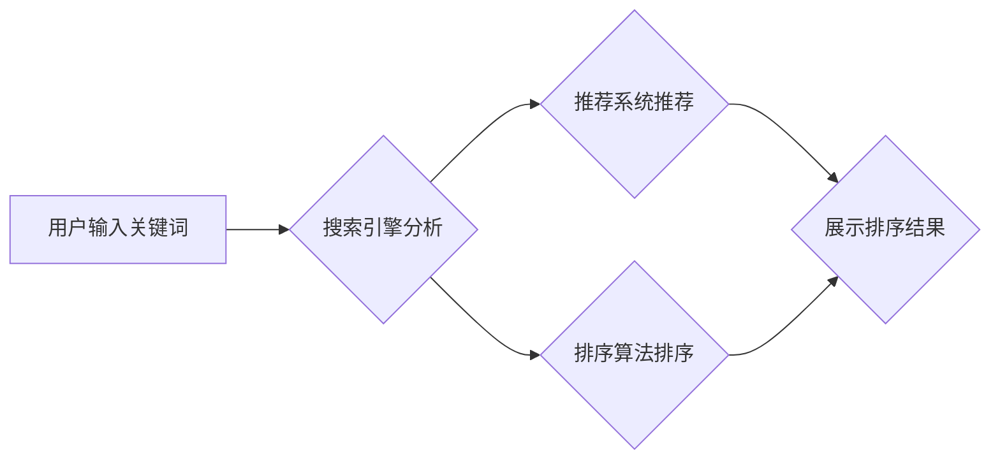

                 

## 电商搜索结果页的AI智能布局

> 关键词：电商搜索、AI智能推荐、搜索结果排序、用户行为分析、深度学习、自然语言处理、推荐系统

## 1. 背景介绍

在当今数字经济时代，电商平台已成为人们购物的首选方式。搜索是电商平台的核心功能之一，用户通过搜索框输入关键词，期望快速找到心仪商品。然而，随着商品数量的激增和用户需求的多样化，传统的基于关键词匹配的搜索算法已难以满足用户体验的不断提升。

为了提升用户搜索体验，电商平台纷纷探索AI智能技术，将AI融入搜索结果页的布局，打造更智能、更精准的搜索体验。AI智能布局能够根据用户的搜索历史、浏览记录、购买行为等多方面数据，精准推荐用户感兴趣的商品，并根据商品的属性、用户偏好等因素，对搜索结果进行排序，呈现更符合用户需求的搜索结果。

## 2. 核心概念与联系

### 2.1  搜索结果排序

搜索结果排序是指根据一定的规则和算法，对搜索结果进行排列，呈现给用户的过程。传统的搜索结果排序主要基于关键词匹配的算法，但这种算法难以捕捉用户搜索意图的复杂性。AI智能布局则通过深度学习、自然语言处理等技术，分析用户的搜索行为、商品属性、用户偏好等多方面数据，构建更精准的排序模型，提升搜索结果的准确性和相关性。

### 2.2  推荐系统

推荐系统是指根据用户的历史行为、偏好等信息，预测用户可能感兴趣的商品或内容，并将其推荐给用户的系统。AI智能布局将推荐系统与搜索结果页相结合，通过分析用户的搜索历史、浏览记录、购买行为等数据，推荐与用户搜索意图相关的商品，提升用户搜索效率和购物体验。

### 2.3  用户行为分析

用户行为分析是指通过收集和分析用户的行为数据，例如点击、浏览、购买等行为，以了解用户的兴趣、偏好、需求等信息。AI智能布局将用户行为分析与搜索结果排序和推荐系统相结合，通过分析用户的行为数据，更精准地理解用户的搜索意图，并提供更个性化的搜索结果和推荐。

**Mermaid 流程图**



## 3. 核心算法原理 & 具体操作步骤

### 3.1  算法原理概述

AI智能布局的核心算法原理主要基于深度学习和自然语言处理技术。深度学习算法能够从海量数据中学习用户行为模式和商品特征，构建更精准的搜索结果排序和推荐模型。自然语言处理技术能够理解用户的搜索意图，并将其转化为机器可理解的语义信息，提升搜索结果的准确性和相关性。

### 3.2  算法步骤详解

1. **数据收集与预处理:** 收集用户搜索历史、浏览记录、购买行为等数据，并进行清洗、转换、特征提取等预处理操作。

2. **模型构建:** 利用深度学习算法，例如深度神经网络、卷积神经网络等，构建搜索结果排序和推荐模型。

3. **模型训练:** 使用预处理后的数据对模型进行训练，调整模型参数，使其能够准确预测用户搜索意图和商品相关性。

4. **模型评估:** 使用测试数据对模型进行评估，评估模型的准确率、召回率、F1-score等指标。

5. **模型部署:** 将训练好的模型部署到电商平台的搜索结果页，实时对搜索结果进行排序和推荐。

6. **模型优化:** 持续收集用户反馈和数据，对模型进行优化和迭代，提升模型的性能和准确性。

### 3.3  算法优缺点

**优点:**

* 能够精准理解用户的搜索意图，提供更相关和个性化的搜索结果。
* 能够根据用户的行为数据，推荐用户可能感兴趣的商品，提升用户购物体验。
* 能够不断学习和优化，提升搜索结果的准确性和相关性。

**缺点:**

* 需要海量数据进行训练，训练成本较高。
* 模型训练和部署需要专业技术人员。
* 模型的解释性较差，难以理解模型的决策过程。

### 3.4  算法应用领域

AI智能布局的算法应用领域广泛，包括：

* 电商搜索结果页
* 内容推荐系统
* 个性化广告推荐
* 用户画像分析
* 搜索引擎优化

## 4. 数学模型和公式 & 详细讲解 & 举例说明

### 4.1  数学模型构建

AI智能布局的数学模型通常基于机器学习算法，例如深度神经网络。深度神经网络由多个层组成，每一层都包含多个神经元。神经元之间通过权重连接，传递信息。通过训练，模型能够学习到用户搜索意图和商品特征之间的关系，并预测用户可能感兴趣的商品。

### 4.2  公式推导过程

深度神经网络的训练过程基于梯度下降算法。梯度下降算法的目标是找到模型参数，使得模型的预测结果与实际结果之间的误差最小化。

**损失函数:**

$$L = \sum_{i=1}^{N} (y_i - \hat{y}_i)^2$$

其中：

* $L$ 是损失函数
* $N$ 是样本数量
* $y_i$ 是实际结果
* $\hat{y}_i$ 是模型预测结果

**梯度:**

$$\frac{\partial L}{\partial w} = \sum_{i=1}^{N} 2(y_i - \hat{y}_i) \frac{\partial \hat{y}_i}{\partial w}$$

其中：

* $w$ 是模型参数
* $\frac{\partial \hat{y}_i}{\partial w}$ 是模型预测结果对参数 $w$ 的偏导数

**参数更新:**

$$w = w - \alpha \frac{\partial L}{\partial w}$$

其中：

* $\alpha$ 是学习率

### 4.3  案例分析与讲解

假设我们有一个电商平台，用户搜索关键词“手机”。AI智能布局的模型需要预测用户可能感兴趣的手机商品。

模型会根据用户的搜索历史、浏览记录、购买行为等数据，分析用户的偏好，例如品牌、型号、价格等。同时，模型也会分析手机商品的属性，例如品牌、型号、价格、配置等。

通过训练，模型能够学习到用户搜索意图和商品特征之间的关系，并预测用户可能感兴趣的手机商品。例如，如果用户之前购买过苹果手机，并且经常浏览高价手机，那么模型可能会推荐用户购买最新的iPhone手机。

## 5. 项目实践：代码实例和详细解释说明

### 5.1  开发环境搭建

* Python 3.x
* TensorFlow 或 PyTorch 深度学习框架
* Scikit-learn 机器学习库
* Numpy 数值计算库
* Pandas 数据处理库

### 5.2  源代码详细实现

```python
# 导入必要的库
import tensorflow as tf
from sklearn.model_selection import train_test_split
from sklearn.metrics import accuracy_score

# 定义模型结构
model = tf.keras.models.Sequential([
    tf.keras.layers.Dense(64, activation='relu', input_shape=(10,)),
    tf.keras.layers.Dense(32, activation='relu'),
    tf.keras.layers.Dense(1, activation='sigmoid')
])

# 编译模型
model.compile(optimizer='adam', loss='binary_crossentropy', metrics=['accuracy'])

# 加载数据
# ...

# 将数据分成训练集和测试集
X_train, X_test, y_train, y_test = train_test_split(X, y, test_size=0.2)

# 训练模型
model.fit(X_train, y_train, epochs=10)

# 评估模型
loss, accuracy = model.evaluate(X_test, y_test)
print('Loss:', loss)
print('Accuracy:', accuracy)

# 使用模型进行预测
predictions = model.predict(X_new)
```

### 5.3  代码解读与分析

* 代码首先导入必要的库。
* 然后定义一个简单的深度神经网络模型，包含三个全连接层。
* 模型使用Adam优化器，损失函数为二分类交叉熵，评估指标为准确率。
* 加载数据后，将数据分成训练集和测试集。
* 使用训练集训练模型，并设置训练轮数为10。
* 训练完成后，使用测试集评估模型的性能。
* 最后，使用训练好的模型对新的数据进行预测。

### 5.4  运行结果展示

运行结果会显示模型在测试集上的损失值和准确率。

## 6. 实际应用场景

### 6.1  电商搜索结果页

AI智能布局可以应用于电商平台的搜索结果页，根据用户的搜索历史、浏览记录、购买行为等数据，精准推荐用户感兴趣的商品，并根据商品的属性、用户偏好等因素，对搜索结果进行排序，呈现更符合用户需求的搜索结果。

### 6.2  个性化推荐

AI智能布局可以用于个性化推荐，根据用户的兴趣爱好、购买历史等数据，推荐用户可能感兴趣的商品、内容、服务等。

### 6.3  广告投放

AI智能布局可以用于广告投放，根据用户的兴趣爱好、行为数据等信息，精准投放广告，提升广告效果。

### 6.4  未来应用展望

随着人工智能技术的不断发展，AI智能布局的应用场景将会更加广泛，例如：

* 智能客服：AI智能布局可以用于构建智能客服系统，根据用户的咨询内容，精准推荐相关信息和解决方案。
* 智能教育：AI智能布局可以用于构建智能教育系统，根据学生的学习进度和兴趣爱好，个性化推荐学习内容和资源。
* 智能医疗：AI智能布局可以用于构建智能医疗系统，根据患者的症状和病史，精准推荐相关诊断和治疗方案。

## 7. 工具和资源推荐

### 7.1  学习资源推荐

* **书籍:**
    * 深度学习
    * 自然语言处理
    * 机器学习实战
* **在线课程:**
    * Coursera
    * edX
    * Udacity

### 7.2  开发工具推荐

* **深度学习框架:** TensorFlow, PyTorch
* **机器学习库:** Scikit-learn
* **数据处理库:** Numpy, Pandas

### 7.3  相关论文推荐

* Attention Is All You Need
* BERT: Pre-training of Deep Bidirectional Transformers for Language Understanding
* Deep Learning for Recommender Systems

## 8. 总结：未来发展趋势与挑战

### 8.1  研究成果总结

AI智能布局在电商搜索、个性化推荐、广告投放等领域取得了显著成果，能够提升用户体验、提高商业效益。

### 8.2  未来发展趋势

* **模型更加精准:** 未来AI智能布局的模型将更加精准，能够更准确地理解用户的搜索意图和商品特征，提供更个性化的推荐结果。
* **多模态融合:** 未来AI智能布局将融合多模态数据，例如文本、图像、视频等，提供更丰富的用户体验。
* **解释性更强:** 未来AI智能布局的模型将更加解释性强，能够解释模型的决策过程，提升用户信任度。

### 8.3  面临的挑战

* **数据隐私:** AI智能布局需要收集和分析用户的个人数据，如何保护用户隐私是一个重要的挑战。
* **算法公平性:** AI智能布局的算法可能会存在偏见，导致推荐结果不公平，如何保证算法的公平性是一个重要的挑战。
* **模型可解释性:** AI智能布局的模型往往是复杂的，难以理解模型的决策过程，如何提升模型的可解释性是一个重要的挑战。

### 8.4  研究展望

未来，AI智能布局的研究将继续深入，探索更精准、更智能、更公平的推荐算法，为用户提供更个性化、更丰富的体验。

## 9. 附录：常见问题与解答

**Q1: AI智能布局的训练数据需要多么庞大？**

A1: AI智能布局的训练数据量取决于模型的复杂度和任务的难度。一般来说，需要收集大量的用户行为数据、商品信息等数据进行训练。

**Q2: AI智能布局的模型是否容易受到攻击？**

A2: AI智能布局的模型可能会受到攻击，例如数据 poisoning、模型攻击等。如何防御这些攻击是一个重要的研究方向。

**Q3: AI智能布局的应用场景有哪些？**

A3: AI智能布局的应用场景非常广泛，例如电商搜索、个性化推荐、广告投放、智能客服、智能教育、智能医疗等。


作者：禅与计算机程序设计艺术 / Zen and the Art of Computer Programming 
<end_of_turn>

