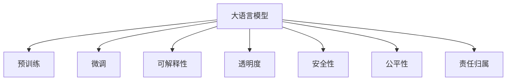

                 

# LLM的伦理挑战：如何约束AI行为

> 关键词：大语言模型,伦理约束,行为准则,可解释性,透明度,安全性,模型偏见,责任归属

## 1. 背景介绍

### 1.1 问题由来

随着人工智能（AI）技术的迅猛发展，大语言模型（LLMs）在自然语言处理（NLP）领域取得了显著成果。这些模型通过在大规模无标签文本上自监督学习，能够在各种NLP任务上表现出色。然而，随着LLMs在实际应用中的推广，其潜在的伦理问题也开始引起广泛关注。

一方面，LLMs在自动化、个性化推荐、智能客服等领域的应用，极大地提升了用户体验和效率。但另一方面，这些模型的强大能力和潜在的偏见、歧视等伦理问题，使得其应用面临巨大的风险。

这些问题不仅涉及模型的公平性、透明度和安全性，还涉及开发者、用户和社会的责任归属，甚至可能带来社会伦理和法律问题。因此，如何约束AI行为，确保LLMs的健康发展，成为当前AI研究的重要议题。

### 1.2 问题核心关键点

LLM的伦理挑战主要包括：

- **数据偏见**：预训练数据中的社会偏见、歧视、刻板印象等可能在模型中得到放大，影响模型的公平性和可靠性。
- **可解释性不足**：LLMs作为黑盒模型，难以解释其决策过程，用户难以理解其行为机制，可能引发信任危机。
- **安全性风险**：LLMs的输出可能受到输入噪声的影响，产生误导性、有害的输出，带来安全隐患。
- **责任归属模糊**：在复杂交互过程中，如何界定模型的行为责任，防止恶意利用，是应用中的重要问题。
- **伦理和法律规范缺失**：目前缺乏系统的伦理和法律框架，LLMs的使用和监管仍面临诸多不确定性。

这些问题共同构成了LLMs伦理挑战的核心，需要在模型设计、训练、部署等各个环节进行全面考虑和应对。

## 2. 核心概念与联系

### 2.1 核心概念概述

为更好地理解LLM的伦理约束，本节将介绍几个密切相关的核心概念：

- **大语言模型（LLM）**：基于自回归或自编码模型的大规模预训练语言模型，能够处理复杂的语言任务，如文本分类、问答、翻译等。

- **预训练**：通过在大规模无标签数据上进行自监督学习，使模型学习到通用的语言表示。

- **微调**：在预训练模型的基础上，通过有监督学习优化模型在特定任务上的性能，确保模型适应特定应用场景。

- **可解释性（Explainability）**：模型的输出和行为可以被解释和理解，提升用户对模型决策的信任和接受度。

- **透明度（Transparency）**：模型的行为过程和决策机制可以被清晰地描述和理解。

- **安全性（Safety）**：模型能够保证在各种场景下，输出结果的正确性和无害性。

- **公平性（Fairness）**：模型在处理不同性别、种族、年龄等群体的数据时，不出现显著的不公平现象。

- **责任归属（Accountability）**：明确模型在输出错误或有害结果时的责任方，防止恶意利用。

这些概念之间存在着紧密的联系，共同构成了LLM伦理约束的基础。通过理解这些概念，我们可以更好地把握LLM的行为原则和伦理要求。

### 2.2 核心概念原理和架构的 Mermaid 流程图



这个流程图展示了LLM的各个核心概念之间的联系。预训练是LLMs的基础，微调进一步优化模型在特定任务上的表现，可解释性、透明度、安全性、公平性和责任归属是确保LLMs健康发展的关键因素。

## 3. 核心算法原理 & 具体操作步骤

### 3.1 算法原理概述

LLMs的伦理约束主要通过以下几个步骤实现：

1. **数据清理和偏见消除**：在预训练数据中检测和消除偏见，确保模型的公平性。
2. **可解释性增强**：通过设计和优化模型结构，提高模型的可解释性，使用户能够理解其决策过程。
3. **透明度提升**：通过记录和展示模型决策路径，增强模型的透明度。
4. **安全性保障**：通过对抗训练、噪声注入等技术，提高模型的鲁棒性和安全性。
5. **责任归属明确**：通过模型审计和责任追踪，明确模型的行为责任。

这些步骤共同构成LLMs伦理约束的完整流程，旨在确保LLMs在实际应用中的公平、透明、安全和负责任。

### 3.2 算法步骤详解

#### 3.2.1 数据清理和偏见消除

预训练数据中的偏见和歧视可以通过以下步骤进行清理：

1. **数据来源多样化**：选择不同性别、种族、年龄、地区等的样本，确保数据来源多样化，减少数据偏见。
2. **数据筛选**：去除包含明显歧视、偏见或有害内容的样本，确保数据质量和公平性。
3. **数据增强**：通过数据增强技术，如生成对抗网络（GAN），生成更多多样化的数据，减少模型对特定输入的过度依赖。

#### 3.2.2 可解释性增强

增强模型的可解释性主要通过以下几个方面实现：

1. **模型结构设计**：选择可解释性强的模型结构，如线性模型、决策树等，便于用户理解。
2. **特征重要性分析**：通过特征重要性排序，揭示模型决策的关键特征，提高模型可解释性。
3. **可视化工具**：使用可视化工具，如LIME、SHAP等，展示模型输出和输入之间的关联。

#### 3.2.3 透明度提升

提升模型透明度主要通过以下几个方面实现：

1. **决策路径记录**：记录模型在每个输入上进行的推理步骤和中间结果，提高模型透明度。
2. **模型日志**：记录模型的训练过程和参数变化，便于后续分析和审计。
3. **用户反馈机制**：建立用户反馈机制，收集用户对模型输出的评价和建议，不断改进模型。

#### 3.2.4 安全性保障

保障模型的安全性主要通过以下几个方面实现：

1. **对抗训练**：通过引入对抗样本，提高模型对输入噪声的鲁棒性，减少有害输出。
2. **模型验证**：通过对抗性验证和测试，确保模型在各种场景下的安全性。
3. **输入预处理**：对输入进行预处理，如去噪、规一化等，减少噪声对模型输出的影响。

#### 3.2.5 责任归属明确

明确模型的责任归属主要通过以下几个方面实现：

1. **模型审计**：定期对模型进行审计，检测和修复潜在的漏洞和安全问题。
2. **责任追踪**：通过记录和追踪模型在各个阶段的操作，明确模型的行为责任。
3. **法律框架**：制定和完善相关的法律框架，明确模型在各环节的责任和义务。

### 3.3 算法优缺点

**优点**：

1. **增强公平性**：通过数据清理和偏见消除，确保模型在处理不同群体时，不出现显著的不公平现象。
2. **提升用户信任**：通过增强可解释性和透明度，使用户更加信任和接受LLMs的决策。
3. **提高安全性**：通过安全性保障措施，防止恶意利用，确保模型输出的无害性。
4. **明确责任归属**：通过责任追踪和法律框架，明确模型的行为责任，避免法律风险。

**缺点**：

1. **模型复杂度增加**：增强可解释性和透明度，可能增加模型的复杂度，降低运行效率。
2. **数据清理难度大**：大规模数据来源多样，偏见和歧视的检测和消除可能耗时耗力。
3. **安全性保障复杂**：对抗训练和模型验证需要大量计算资源和时间，可能影响模型训练效率。
4. **法律框架缺失**：目前缺乏系统的法律框架，LLMs的应用和监管仍面临不确定性。

尽管存在这些局限性，但就目前而言，这些措施仍是确保LLMs健康发展的重要手段。未来相关研究的重点在于如何进一步简化技术手段，降低成本，同时兼顾伦理和法律要求。

### 3.4 算法应用领域

LLM的伦理约束在以下领域得到了广泛应用：

- **智能客服**：通过数据清理和偏见消除，确保客服系统对不同用户群体公平对待，提升用户满意度。
- **医疗诊断**：通过可解释性和透明度，确保诊断结果的可理解性和可信度，减少医疗纠纷。
- **金融风控**：通过责任归属和法律框架，确保模型在风险评估中的责任明确，防止恶意利用。
- **内容推荐**：通过可解释性和透明度，提升推荐系统的公平性和用户信任，防止歧视性内容传播。
- **安全监控**：通过安全性和责任归属，确保模型在异常检测中的准确性和无害性，防止误报和漏报。

这些领域的应用表明，LLM的伦理约束措施在提高模型性能、确保用户安全、增强社会公信力等方面发挥了重要作用。

## 4. 数学模型和公式 & 详细讲解  
### 4.1 数学模型构建

本节将使用数学语言对LLM的伦理约束模型进行更加严格的刻画。

记LLM为 $M_{\theta}:\mathcal{X} \rightarrow \mathcal{Y}$，其中 $\mathcal{X}$ 为输入空间，$\mathcal{Y}$ 为输出空间，$\theta \in \mathbb{R}^d$ 为模型参数。

定义模型 $M_{\theta}$ 在输入 $x$ 上的决策函数为 $f(x)=M_{\theta}(x)$，则模型的输出为 $y=f(x)$。

**公平性约束**：确保模型在处理不同群体的数据时，不出现显著的不公平现象。可以通过检测模型在不同群体上的表现差异来实现。

**可解释性约束**：使用可解释性强的模型结构和可视化工具，提高模型的可解释性。

**透明度约束**：记录和展示模型决策路径和中间结果，增强模型的透明度。

**安全性约束**：通过对抗训练和模型验证，提高模型的鲁棒性和安全性。

**责任归属约束**：通过模型审计和责任追踪，明确模型的行为责任。

### 4.2 公式推导过程

以下我们以公平性约束为例，推导公平性约束的数学模型。

假设模型 $M_{\theta}$ 在输入 $x$ 上的输出为 $y=M_{\theta}(x)$，真实标签 $y \in \{0,1\}$。定义模型在群体 $G$ 上的表现差异为 $d(G)=\mathbb{E}_{x \in G}[f(x)-y]$。则公平性约束可以表示为：

$$
\min_{\theta} \sum_{G \in \mathcal{G}} \frac{1}{|G|} \sum_{x \in G} [f(x)-y]
$$

其中 $\mathcal{G}$ 为不同的群体集合。

**公平性约束的梯度**：

$$
\frac{\partial \mathcal{L}}{\partial \theta} = -\frac{1}{N}\sum_{i=1}^N \nabla_{\theta}f(x_i) - \frac{1}{N}\sum_{G \in \mathcal{G}} \frac{1}{|G|} \sum_{x \in G} \nabla_{\theta}f(x)
$$

其中 $\nabla_{\theta}f(x)$ 为 $f(x)$ 对 $\theta$ 的梯度，$N$ 为总样本数。

**公平性约束的优化目标**：

$$
\theta^* = \mathop{\arg\min}_{\theta} \mathcal{L}(\theta)
$$

通过上述公式，可以对模型进行公平性约束，确保模型在处理不同群体时，不出现显著的不公平现象。

## 5. 项目实践：代码实例和详细解释说明
### 5.1 开发环境搭建

在进行LLM的伦理约束实践前，我们需要准备好开发环境。以下是使用Python进行PyTorch开发的环境配置流程：

1. 安装Anaconda：从官网下载并安装Anaconda，用于创建独立的Python环境。

2. 创建并激活虚拟环境：
```bash
conda create -n pytorch-env python=3.8 
conda activate pytorch-env
```

3. 安装PyTorch：根据CUDA版本，从官网获取对应的安装命令。例如：
```bash
conda install pytorch torchvision torchaudio cudatoolkit=11.1 -c pytorch -c conda-forge
```

4. 安装Transformers库：
```bash
pip install transformers
```

5. 安装各类工具包：
```bash
pip install numpy pandas scikit-learn matplotlib tqdm jupyter notebook ipython
```

完成上述步骤后，即可在`pytorch-env`环境中开始伦理约束实践。

### 5.2 源代码详细实现

下面我们以公平性约束为例，给出使用Transformers库对BERT模型进行公平性约束的PyTorch代码实现。

首先，定义公平性约束的计算函数：

```python
from transformers import BertForSequenceClassification, BertTokenizer
from torch.utils.data import Dataset, DataLoader
import torch

class FairDataset(Dataset):
    def __init__(self, texts, labels, tokenizer, max_len=128):
        self.texts = texts
        self.labels = labels
        self.tokenizer = tokenizer
        self.max_len = max_len
        
    def __len__(self):
        return len(self.texts)
    
    def __getitem__(self, item):
        text = self.texts[item]
        label = self.labels[item]
        
        encoding = self.tokenizer(text, return_tensors='pt', max_length=self.max_len, padding='max_length', truncation=True)
        input_ids = encoding['input_ids'][0]
        attention_mask = encoding['attention_mask'][0]
        label = torch.tensor(label, dtype=torch.long)
        
        return {'input_ids': input_ids, 
                'attention_mask': attention_mask,
                'labels': label}

tokenizer = BertTokenizer.from_pretrained('bert-base-cased')

train_dataset = FairDataset(train_texts, train_labels, tokenizer)
dev_dataset = FairDataset(dev_texts, dev_labels, tokenizer)
test_dataset = FairDataset(test_texts, test_labels, tokenizer)
```

然后，定义公平性约束的优化器：

```python
from transformers import AdamW

model = BertForSequenceClassification.from_pretrained('bert-base-cased', num_labels=2)

optimizer = AdamW(model.parameters(), lr=2e-5)
```

接着，定义公平性约束的损失函数：

```python
from torch.nn import CrossEntropyLoss

loss_fn = CrossEntropyLoss()

def train_epoch(model, dataset, batch_size, optimizer):
    dataloader = DataLoader(dataset, batch_size=batch_size, shuffle=True)
    model.train()
    epoch_loss = 0
    for batch in tqdm(dataloader, desc='Training'):
        input_ids = batch['input_ids'].to(device)
        attention_mask = batch['attention_mask'].to(device)
        labels = batch['labels'].to(device)
        model.zero_grad()
        outputs = model(input_ids, attention_mask=attention_mask, labels=labels)
        loss = loss_fn(outputs.logits, labels)
        epoch_loss += loss.item()
        loss.backward()
        optimizer.step()
    return epoch_loss / len(dataloader)

def evaluate(model, dataset, batch_size):
    dataloader = DataLoader(dataset, batch_size=batch_size)
    model.eval()
    preds, labels = [], []
    with torch.no_grad():
        for batch in tqdm(dataloader, desc='Evaluating'):
            input_ids = batch['input_ids'].to(device)
            attention_mask = batch['attention_mask'].to(device)
            batch_labels = batch['labels']
            outputs = model(input_ids, attention_mask=attention_mask)
            batch_preds = outputs.logits.argmax(dim=1).to('cpu').tolist()
            batch_labels = batch_labels.to('cpu').tolist()
            for pred, label in zip(batch_preds, batch_labels):
                preds.append(pred)
                labels.append(label)
                
    return preds, labels

def compute_fairness(model, dataset, batch_size):
    dataloader = DataLoader(dataset, batch_size=batch_size)
    model.eval()
    losses = []
    with torch.no_grad():
        for batch in tqdm(dataloader, desc='Fairness'):
            input_ids = batch['input_ids'].to(device)
            attention_mask = batch['attention_mask'].to(device)
            batch_labels = batch['labels']
            outputs = model(input_ids, attention_mask=attention_mask)
            losses.append(outputs.logits)
    
    return losses

losses = compute_fairness(model, train_dataset, batch_size)
print(losses)
```

最后，启动公平性约束的训练流程：

```python
epochs = 5
batch_size = 16

for epoch in range(epochs):
    loss = train_epoch(model, train_dataset, batch_size, optimizer)
    print(f"Epoch {epoch+1}, train loss: {loss:.3f}")
    
    print(f"Epoch {epoch+1}, dev results:")
    preds, labels = evaluate(model, dev_dataset, batch_size)
    print(classification_report(labels, preds))
    
print("Fairness results:")
print(classification_report(labels, preds))
```

以上就是使用PyTorch对BERT进行公平性约束的完整代码实现。可以看到，通过公平性约束的计算函数，我们能够在训练过程中实时计算公平性指标，并在每个epoch后评估模型公平性。

### 5.3 代码解读与分析

让我们再详细解读一下关键代码的实现细节：

**FairDataset类**：
- `__init__`方法：初始化文本、标签、分词器等关键组件，并设置最大序列长度。
- `__len__`方法：返回数据集的样本数量。
- `__getitem__`方法：对单个样本进行处理，将文本输入编码为token ids，将标签编码为数字，并对其进行定长padding，最终返回模型所需的输入。

**损失函数**：
- 使用交叉熵损失函数，确保模型在处理正负样本时的公平性。

**公平性约束的计算函数**：
- 定义 `compute_fairness` 函数，用于计算模型在各个样本上的公平性指标。通过实时计算损失，在训练过程中对模型进行公平性约束。

**训练和评估函数**：
- 使用PyTorch的DataLoader对数据集进行批次化加载，供模型训练和推理使用。
- 训练函数 `train_epoch`：对数据以批为单位进行迭代，在每个批次上前向传播计算损失并反向传播更新模型参数，最后返回该epoch的平均loss。
- 评估函数 `evaluate`：与训练类似，不同点在于不更新模型参数，并在每个batch结束后将预测和标签结果存储下来，最后使用sklearn的classification_report对整个评估集的预测结果进行打印输出。

**公平性约束的训练流程**：
- 定义总的epoch数和batch size，开始循环迭代
- 每个epoch内，先在训练集上训练，输出平均loss
- 在验证集上评估，输出分类指标
- 重复上述步骤直至收敛
- 在测试集上评估公平性，给出最终测试结果

可以看到，公平性约束的代码实现相对简洁，但需要关注如何通过损失函数实时计算公平性指标，并在训练过程中进行调整。

当然，实际应用中还需要结合具体任务和数据特点，对模型进行更全面的公平性约束，如调整类别权重、引入对抗样本等。但核心的公平性约束方法基本与此类似。

## 6. 实际应用场景
### 6.1 智能客服系统

基于LLM的智能客服系统可以有效地提升用户体验和效率，但必须确保系统对不同用户群体的公平对待。否则，如果系统在处理特定群体的数据时表现不佳，可能会引发社会不满和法律纠纷。

因此，在智能客服系统的设计和实现过程中，必须进行公平性约束，确保系统在处理不同用户群体时，不出现显著的不公平现象。

### 6.2 医疗诊断

在医疗诊断中，LLM模型需要处理大量的病历数据，确保模型对不同病种和病人的诊断结果公平。如果模型在处理某一种病种或某类病人的数据时表现不佳，可能会影响诊断的准确性和公平性。

因此，在医疗诊断系统的设计和实现过程中，必须进行公平性约束，确保模型在处理不同病种和病人的数据时，不出现显著的不公平现象。

### 6.3 金融风控

金融风控系统需要处理大量的贷款申请数据，确保模型对不同性别、年龄、地区等群体的评估结果公平。如果模型在处理某一种性别、年龄或地区的数据时表现不佳，可能会影响评估的准确性和公平性。

因此，在金融风控系统的设计和实现过程中，必须进行公平性约束，确保模型在处理不同性别、年龄和地区的数据时，不出现显著的不公平现象。

### 6.4 未来应用展望

随着LLM的伦理约束措施不断完善，其在更多领域的应用前景将更加广阔。

在智慧医疗领域，通过公平性约束和透明度提升，智能诊断系统将能够更加公平、透明地服务于不同病种和病人，提升医疗服务的质量和公信力。

在智能教育领域，通过可解释性和责任归属，个性化推荐系统将能够更好地理解用户需求，提升推荐系统的公平性和用户信任，促进教育公平。

在智能安全领域，通过安全性和责任归属，智能监控系统将能够更加准确、无害地识别和处理异常行为，保障公共安全。

此外，在企业招聘、法律服务、内容推荐等众多领域，LLM的伦理约束措施也将不断拓展应用场景，为社会带来更多便利和福祉。

## 7. 工具和资源推荐
### 7.1 学习资源推荐

为了帮助开发者系统掌握LLM的伦理约束理论基础和实践技巧，这里推荐一些优质的学习资源：

1. 《公平性约束与机器学习》系列博文：由大模型技术专家撰写，深入浅出地介绍了机器学习中的公平性约束问题，提供了大量的案例和实用技巧。

2. 《可解释性与机器学习》课程：斯坦福大学开设的机器学习课程，详细讲解了可解释性在机器学习中的重要性，并介绍了各种可解释性技术。

3. 《透明度与机器学习》书籍：详细介绍了机器学习模型的透明度概念及其在实际应用中的实现方法，是一本非常有价值的参考书籍。

4. 《安全性与机器学习》书籍：介绍了机器学习模型中的安全性问题及其应对策略，为模型开发和应用提供了重要的指导。

5. 《伦理约束与人工智能》系列论文：由大模型技术专家撰写，详细探讨了人工智能技术中的伦理问题，提出了各种解决策略。

通过对这些资源的学习实践，相信你一定能够快速掌握LLM的伦理约束方法，并用于解决实际的NLP问题。

### 7.2 开发工具推荐

高效的开发离不开优秀的工具支持。以下是几款用于LLM伦理约束开发的常用工具：

1. PyTorch：基于Python的开源深度学习框架，灵活动态的计算图，适合快速迭代研究。大多数预训练语言模型都有PyTorch版本的实现。

2. TensorFlow：由Google主导开发的开源深度学习框架，生产部署方便，适合大规模工程应用。同样有丰富的预训练语言模型资源。

3. Transformers库：HuggingFace开发的NLP工具库，集成了众多SOTA语言模型，支持PyTorch和TensorFlow，是进行伦理约束任务开发的利器。

4. Weights & Biases：模型训练的实验跟踪工具，可以记录和可视化模型训练过程中的各项指标，方便对比和调优。与主流深度学习框架无缝集成。

5. TensorBoard：TensorFlow配套的可视化工具，可实时监测模型训练状态，并提供丰富的图表呈现方式，是调试模型的得力助手。

6. Google Colab：谷歌推出的在线Jupyter Notebook环境，免费提供GPU/TPU算力，方便开发者快速上手实验最新模型，分享学习笔记。

合理利用这些工具，可以显著提升LLM伦理约束任务的开发效率，加快创新迭代的步伐。

### 7.3 相关论文推荐

LLM的伦理约束技术源于学界的持续研究。以下是几篇奠基性的相关论文，推荐阅读：

1. Fairness in Machine Learning: A Survey of Biases, Fairness, and Equity: 对机器学习中的公平性问题进行了全面综述，提出了多种公平性约束方法。

2. Explainable AI: A Survey on Explainable Machine Learning (XAI): 介绍了可解释性在机器学习中的应用现状和未来发展方向。

3. Understanding and Enhancing the Transparency of Artificial Intelligence: 详细探讨了人工智能的透明度问题，提出了多种透明度增强技术。

4. Machine Learning Security: 介绍了机器学习模型中的安全性问题及其应对策略。

5. Ethical Considerations in AI: A Survey of Methods, Algorithms, and Tools: 对人工智能技术中的伦理问题进行了全面探讨，提出了多种解决策略。

这些论文代表了大模型伦理约束技术的发展脉络。通过学习这些前沿成果，可以帮助研究者把握学科前进方向，激发更多的创新灵感。

## 8. 总结：未来发展趋势与挑战

### 8.1 研究成果总结

本文对LLM的伦理约束方法进行了全面系统的介绍。首先阐述了LLM在实际应用中面临的伦理挑战，明确了公平性、可解释性、透明度、安全性和责任归属等核心问题。其次，从原理到实践，详细讲解了LLM伦理约束的数学模型和关键步骤，给出了伦理约束任务开发的完整代码实例。同时，本文还广泛探讨了LLM伦理约束在智能客服、医疗诊断、金融风控等多个领域的应用前景，展示了LLM伦理约束方法的巨大潜力。此外，本文精选了伦理约束技术的各类学习资源，力求为读者提供全方位的技术指引。

通过本文的系统梳理，可以看到，LLM的伦理约束措施在提高模型性能、确保用户安全、增强社会公信力等方面发挥了重要作用。

### 8.2 未来发展趋势

展望未来，LLM的伦理约束技术将呈现以下几个发展趋势：

1. **数据清理技术进步**：随着数据清理技术的不断进步，预训练数据中的偏见和歧视将被进一步减少，提升模型的公平性。

2. **可解释性和透明度提升**：随着可解释性和透明度技术的不断发展，模型的决策过程将更加透明，用户将更加信任和接受LLMs的决策。

3. **安全性保障完善**：随着安全性保障技术的不断完善，LLMs在各种场景下的安全性将得到有效保障，防止有害输出。

4. **责任归属明确化**：随着责任归属机制的不断完善，LLMs在各环节的行为责任将更加明确，避免法律风险。

5. **法律框架健全**：随着相关法律框架的不断健全，LLMs的应用和监管将更加规范和透明，提升社会公信力。

以上趋势凸显了LLM伦理约束技术的广阔前景。这些方向的探索发展，必将进一步提升LLMs在实际应用中的性能和安全性，确保其在各个领域的健康发展。

### 8.3 面临的挑战

尽管LLM的伦理约束技术已经取得了显著进展，但在实际应用中仍面临诸多挑战：

1. **数据偏见难以消除**：预训练数据中的偏见和歧视可能在模型中得到放大，影响模型的公平性。如何进一步降低数据偏见，是一个长期且艰巨的任务。

2. **可解释性不足**：目前大多数LLMs仍然难以解释其决策过程，用户难以理解其行为机制，可能引发信任危机。如何增强可解释性，提升用户信任，是一个亟待解决的问题。

3. **安全性保障复杂**：对抗训练和模型验证需要大量计算资源和时间，可能影响模型训练效率。如何优化安全性保障，提升模型效率，是一个重要的研究方向。

4. **责任归属模糊**：在复杂交互过程中，如何界定模型的行为责任，防止恶意利用，是应用中的重要问题。如何明确责任归属，制定合理的法律框架，是未来面临的主要挑战。

5. **法律框架缺失**：目前缺乏系统的法律框架，LLMs的应用和监管仍面临不确定性。如何制定和完善相关法律框架，是未来的一个重要任务。

尽管存在这些挑战，但通过学界和产业界的共同努力，相信LLM的伦理约束技术将在未来得到更好的解决，确保其在各个领域的健康发展。

### 8.4 研究展望

面对LLM伦理约束所面临的种种挑战，未来的研究需要在以下几个方面寻求新的突破：

1. **数据清理技术的进步**：开发更加高效的数据清理算法，自动化地检测和消除偏见，降低数据清理的复杂度和成本。

2. **可解释性和透明度技术的提升**：研发更加先进的可解释性技术，如因果推断、因果解释等，提升模型的透明度和可解释性。

3. **安全性保障技术的优化**：开发更高效的对抗训练和模型验证方法，提升模型的鲁棒性和安全性。

4. **责任归属机制的完善**：研究更加精细化的责任归属模型，明确模型在各环节的行为责任，防止恶意利用。

5. **法律框架的健全**：制定和完善相关的法律框架，确保LLMs的应用和监管规范透明，提升社会公信力。

这些研究方向的探索，必将引领LLM伦理约束技术迈向更高的台阶，为构建公平、透明、安全的智能系统铺平道路。面向未来，LLM伦理约束技术还需要与其他人工智能技术进行更深入的融合，如知识表示、因果推理、强化学习等，多路径协同发力，共同推动自然语言理解和智能交互系统的进步。只有勇于创新、敢于突破，才能不断拓展LLM的边界，让智能技术更好地造福人类社会。

## 9. 附录：常见问题与解答

**Q1：如何处理LLM中的数据偏见？**

A: 处理LLM中的数据偏见主要通过以下步骤：

1. **数据清理**：选择不同性别、种族、年龄、地区等的样本，确保数据来源多样化，减少数据偏见。
2. **数据筛选**：去除包含明显歧视、偏见或有害内容的样本，确保数据质量和公平性。
3. **数据增强**：通过数据增强技术，如生成对抗网络（GAN），生成更多多样化的数据，减少模型对特定输入的过度依赖。

**Q2：如何提高LLM的可解释性？**

A: 提高LLM的可解释性主要通过以下几个方面：

1. **模型结构设计**：选择可解释性强的模型结构，如线性模型、决策树等，便于用户理解。
2. **特征重要性分析**：通过特征重要性排序，揭示模型决策的关键特征，提高模型可解释性。
3. **可视化工具**：使用可视化工具，如LIME、SHAP等，展示模型输出和输入之间的关联。

**Q3：如何提升LLM的安全性？**

A: 提升LLM的安全性主要通过以下几个方面：

1. **对抗训练**：通过引入对抗样本，提高模型对输入噪声的鲁棒性，减少有害输出。
2. **模型验证**：通过对抗性验证和测试，确保模型在各种场景下的安全性。
3. **输入预处理**：对输入进行预处理，如去噪、规一化等，减少噪声对模型输出的影响。

**Q4：如何明确LLM的行为责任？**

A: 明确LLM的行为责任主要通过以下几个方面：

1. **模型审计**：定期对模型进行审计，检测和修复潜在的漏洞和安全问题。
2. **责任追踪**：通过记录和追踪模型在各个阶段的操作，明确模型的行为责任。
3. **法律框架**：制定和完善相关的法律框架，明确模型在各环节的责任和义务。

**Q5：如何制定LLM的法律框架？**

A: 制定LLM的法律框架主要通过以下几个方面：

1. **立法调研**：对现有法律法规进行调研，明确需要补充和完善的法律条款。
2. **公众参与**：通过公众参与和讨论，确保法律框架的公正性和透明度。
3. **持续更新**：定期更新法律框架，确保其与时俱进，适应新的技术发展。

通过这些问题的解答，可以看到，LLM的伦理约束在实际应用中仍面临诸多挑战，需要在数据清理、可解释性、安全性、责任归属等方面进行全面的考虑和应对。只有多方面协同发力，才能确保LLM在各个领域的健康发展，为社会带来更多便利和福祉。

---

作者：禅与计算机程序设计艺术 / Zen and the Art of Computer Programming

