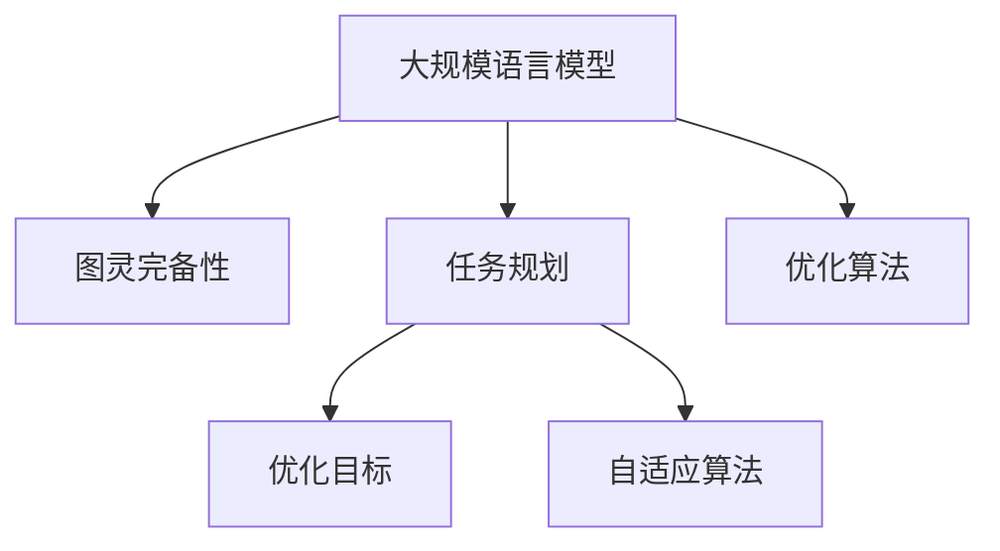

                 

# LLM的图灵完备性及其任务规划能力

> 关键词：大语言模型, 图灵完备性, 自然语言处理, 任务规划, 自适应算法, 优化目标

## 1. 背景介绍

### 1.1 问题由来
自从深度学习问世以来，图灵测试被视为衡量人工智能系统是否具备智能的重要标准。它要求计算机在一定时间内与人类对话，如果计算机能够令人无法分辨其输入是由人类还是计算机产生的，则称其为“图灵完备”。

然而，尽管深度学习模型在图像识别、语音识别等领域取得了巨大成功，它们在自然语言处理（NLP）领域的表现仍然让人感到不满。尤其是语言模型的预测能力虽然令人印象深刻，但它们在解决复杂逻辑推理和长期规划问题时显得力不从心。

近年来，大规模语言模型（LLM）的出现改变了这一局面。凭借其在自监督预训练和微调技术上的突破，LLM在自然语言理解、生成和推理方面展现了前所未有的能力。本文旨在探讨LLM是否具备图灵完备性，并探讨其在任务规划能力上的进展。

### 1.2 问题核心关键点
本节将重点关注以下几个核心问题：
1. **图灵完备性**：LLM是否具备图灵完备性，即能够进行与人类无差别的自然语言交互。
2. **任务规划**：LLM在执行复杂任务时的规划能力，包括长序列推理和计划制定。
3. **优化目标**：LLM的优化目标是什么，如何通过优化算法提升其性能。
4. **自适应算法**：LLM如何自适应不同的任务和场景，提高任务执行的准确性和效率。

## 2. 核心概念与联系

### 2.1 核心概念概述

为更好地理解LLM的图灵完备性和任务规划能力，本节将介绍几个密切相关的核心概念：

- **大规模语言模型（LLM）**：指经过自监督预训练的大规模神经网络模型，如GPT-3、BERT等。这些模型在处理大规模文本数据时表现出色，能够进行复杂的语言理解和生成。
- **图灵完备性**：如果计算机能够通过语言与人类进行自然交互，且人类无法通过对话区分计算机输出是否由计算机产生，则称该计算机具有图灵完备性。
- **任务规划**：在执行复杂任务时，LLM需要制定执行计划，包括任务分解、步骤排序、资源分配等。
- **优化目标**：LLM在执行任务时的目标，如最大化任务成功率、最小化执行时间等。
- **自适应算法**：指LLM在执行任务时，根据当前状态和环境变化，动态调整其执行策略的算法。

这些核心概念之间的逻辑关系可以通过以下Mermaid流程图来展示：



这个流程图展示了大语言模型的核心概念及其之间的关系：

1. 大语言模型通过自监督预训练获得基础能力。
2. 图灵完备性是大语言模型与人类交互的根本要求。
3. 任务规划能力使大语言模型能够在复杂任务中实现目标。
4. 优化目标和大语言模型执行任务的目标密切相关。
5. 自适应算法使大语言模型在动态环境中灵活调整执行策略。

这些概念共同构成了大语言模型的学习和应用框架，使其能够在各种场景下发挥强大的语言理解和生成能力。通过理解这些核心概念，我们可以更好地把握大语言模型的工作原理和优化方向。

## 3. 核心算法原理 & 具体操作步骤

### 3.1 算法原理概述

LLM的图灵完备性和任务规划能力源于其强大的语言理解和生成能力，以及动态调整执行策略的自适应算法。

在图灵完备性的背景下，LLM通过与人类自然语言交互，模拟人类的思维和语言习惯。在任务规划方面，LLM能够根据任务要求制定执行计划，执行长序列推理和计划制定。其核心在于语言模型的自适应算法，该算法能够根据当前状态和环境变化，动态调整执行策略，以实现最优执行效果。

### 3.2 算法步骤详解

基于上述原理，LLM的图灵完备性和任务规划能力主要包括以下几个关键步骤：

**Step 1: 自监督预训练**
- 使用大规模无标签文本数据，通过自监督学习任务（如掩码语言模型、下位词预测等）对语言模型进行预训练。预训练目标是通过学习语言规律和知识，提升模型的语言理解能力。

**Step 2: 微调与优化**
- 收集特定任务的标注数据，对预训练模型进行微调，以适配该任务。微调过程中，使用优化算法（如AdamW、SGD等）更新模型参数，最小化损失函数，提升模型在该任务上的表现。
- 在微调过程中，根据任务特点，选择合适的优化目标，如最大化任务成功率、最小化执行时间等。通过自适应算法动态调整执行策略，优化任务执行效果。

**Step 3: 长序列推理与计划制定**
- 在执行复杂任务时，LLM需要进行长序列推理，通过多轮对话或查询，逐步逼近问题的最优解。这需要模型具备长期记忆和逻辑推理能力。
- 任务规划能力体现在LLM能够制定详细的执行计划，将复杂任务分解为多个子任务，并按照优先级排序。同时，LLM还能够根据执行过程中的反馈信息，动态调整执行策略，确保任务顺利完成。

### 3.3 算法优缺点

LLM在图灵完备性和任务规划方面具有以下优点：
1. 强大的语言理解能力。预训练和微调使得LLM能够理解和处理复杂的语言结构，模拟人类的思维习惯。
2. 灵活的自适应算法。LLM能够根据任务要求和环境变化，动态调整执行策略，提升任务执行效果。
3. 长序列推理能力。LLM能够在多轮对话中逐步逼近问题的最优解，处理复杂逻辑推理问题。
4. 高效的任务规划。LLM能够制定详细的执行计划，并动态调整执行策略，确保任务高效完成。

同时，LLM也存在一定的局限性：
1. 依赖标注数据。微调和任务规划的准确性很大程度上取决于标注数据的质量和数量，获取高质量标注数据的成本较高。
2. 模型的可解释性不足。LLM的决策过程缺乏可解释性，难以对其推理逻辑进行分析和调试。
3. 鲁棒性不足。LLM在面对噪声数据或异常输入时，容易产生误导性输出。
4. 执行效率有限。尽管LLM在推理和计划制定上表现出色，但在大规模分布式计算和实时响应方面仍存在瓶颈。

尽管存在这些局限性，但就目前而言，LLM在图灵完备性和任务规划方面展现了巨大的潜力，成为NLP领域的一个重要研究范式。

### 3.4 算法应用领域

基于LLM的图灵完备性和任务规划能力，它在NLP领域已经得到了广泛的应用，覆盖了几乎所有常见任务，例如：

- 问答系统：如智能客服、智能助手等。LLM通过多轮对话，逐步逼近问题的最优解，生成自然流畅的回复。
- 机器翻译：如将源语言文本翻译成目标语言。LLM能够理解上下文，进行长序列推理，生成准确的翻译结果。
- 文本摘要：将长文本压缩成简短摘要。LLM通过多轮查询，逐步提取文本要点，生成高质量的摘要。
- 对话系统：使机器能够与人自然对话。LLM通过任务规划，制定详细的执行计划，生成符合人类期望的回复。
- 情感分析：通过长序列推理，理解文本中的情感倾向，进行情感分类。
- 命名实体识别：识别文本中的人名、地名、机构名等特定实体。LLM通过多轮对话，逐步逼近实体的正确位置。

除了上述这些经典任务外，LLM还被创新性地应用到更多场景中，如可控文本生成、常识推理、代码生成、数据增强等，为NLP技术带来了全新的突破。

## 4. 数学模型和公式 & 详细讲解 & 举例说明

### 4.1 数学模型构建

本节将使用数学语言对LLM的图灵完备性和任务规划能力进行更加严格的刻画。

记预训练语言模型为 $M_{\theta}$，其中 $\theta$ 为模型参数。假设微调任务的训练集为 $D=\{(x_i,y_i)\}_{i=1}^N, x_i \in \mathcal{X}, y_i \in \mathcal{Y}$。

定义模型 $M_{\theta}$ 在输入 $x$ 上的损失函数为 $\ell(M_{\theta}(x),y)$，则在数据集 $D$ 上的经验风险为：

$$
\mathcal{L}(\theta) = \frac{1}{N} \sum_{i=1}^N \ell(M_{\theta}(x_i),y_i)
$$

微调的优化目标是最小化经验风险，即找到最优参数：

$$
\theta^* = \mathop{\arg\min}_{\theta} \mathcal{L}(\theta)
$$

在实践中，我们通常使用基于梯度的优化算法（如SGD、Adam等）来近似求解上述最优化问题。设 $\eta$ 为学习率，$\lambda$ 为正则化系数，则参数的更新公式为：

$$
\theta \leftarrow \theta - \eta \nabla_{\theta}\mathcal{L}(\theta) - \eta\lambda\theta
$$

其中 $\nabla_{\theta}\mathcal{L}(\theta)$ 为损失函数对参数 $\theta$ 的梯度，可通过反向传播算法高效计算。

### 4.2 公式推导过程

以下我们以问答任务为例，推导交叉熵损失函数及其梯度的计算公式。

假设模型 $M_{\theta}$ 在输入 $x$ 上的输出为 $\hat{y}=M_{\theta}(x) \in [0,1]$，表示样本属于正确答案的概率。真实标签 $y \in \{1,0\}$。则二分类交叉熵损失函数定义为：

$$
\ell(M_{\theta}(x),y) = -[y\log \hat{y} + (1-y)\log (1-\hat{y})]
$$

将其代入经验风险公式，得：

$$
\mathcal{L}(\theta) = -\frac{1}{N}\sum_{i=1}^N [y_i\log M_{\theta}(x_i)+(1-y_i)\log(1-M_{\theta}(x_i))]
$$

根据链式法则，损失函数对参数 $\theta_k$ 的梯度为：

$$
\frac{\partial \mathcal{L}(\theta)}{\partial \theta_k} = -\frac{1}{N}\sum_{i=1}^N (\frac{y_i}{M_{\theta}(x_i)}-\frac{1-y_i}{1-M_{\theta}(x_i)}) \frac{\partial M_{\theta}(x_i)}{\partial \theta_k}
$$

其中 $\frac{\partial M_{\theta}(x_i)}{\partial \theta_k}$ 可进一步递归展开，利用自动微分技术完成计算。

在得到损失函数的梯度后，即可带入参数更新公式，完成模型的迭代优化。重复上述过程直至收敛，最终得到适应下游任务的最优模型参数 $\theta^*$。

### 4.3 案例分析与讲解

为了更好地理解LLM的图灵完备性和任务规划能力，下面以一个具体的任务规划问题为例进行详细讲解。

假设我们要让LLM执行一个复杂任务：在多个地点之间安排交通，最小化总旅行时间。这个问题可以被建模为一个带约束的多目标优化问题，目标函数为：

$$
\min \sum_{i=1}^n (d_{i,i+1}t_{i,i+1}) \quad \text{s.t.} \quad t_{i,j} \geq 0 \quad \forall i,j
$$

其中 $d_{i,i+1}$ 表示第 $i$ 个地点到第 $i+1$ 个地点之间的距离，$t_{i,i+1}$ 表示在 $i$ 和 $i+1$ 之间花费的时间。

对于这个问题，LLM需要进行长序列推理，逐步逼近最优解。具体的执行过程如下：

1. **任务分解**：将问题分解为多个子问题，如计算各个地点之间的距离，预测在不同时间点的交通状况等。
2. **策略制定**：根据当前状态和环境信息，制定执行策略，如选择最优的交通路线、调整行驶速度等。
3. **动态调整**：在执行过程中，根据实时反馈信息，动态调整执行策略，确保任务顺利完成。

在实际执行过程中，LLM可以利用自适应算法，如强化学习、进化算法等，动态调整执行策略，逐步逼近最优解。这种自适应能力使得LLM在复杂任务规划中表现出色。

## 5. 项目实践：代码实例和详细解释说明

### 5.1 开发环境搭建

在进行微调实践前，我们需要准备好开发环境。以下是使用Python进行PyTorch开发的环境配置流程：

1. 安装Anaconda：从官网下载并安装Anaconda，用于创建独立的Python环境。

2. 创建并激活虚拟环境：
```bash
conda create -n pytorch-env python=3.8 
conda activate pytorch-env
```

3. 安装PyTorch：根据CUDA版本，从官网获取对应的安装命令。例如：
```bash
conda install pytorch torchvision torchaudio cudatoolkit=11.1 -c pytorch -c conda-forge
```

4. 安装Transformers库：
```bash
pip install transformers
```

5. 安装各类工具包：
```bash
pip install numpy pandas scikit-learn matplotlib tqdm jupyter notebook ipython
```

完成上述步骤后，即可在`pytorch-env`环境中开始微调实践。

### 5.2 源代码详细实现

下面我们以问答系统任务为例，给出使用Transformers库对BERT模型进行微调的PyTorch代码实现。

首先，定义问答系统的任务处理函数：

```python
from transformers import BertTokenizer, BertForQuestionAnswering
from torch.utils.data import Dataset
import torch

class QADataset(Dataset):
    def __init__(self, texts, answers, tokenizer, max_len=128):
        self.texts = texts
        self.answers = answers
        self.tokenizer = tokenizer
        self.max_len = max_len
        
    def __len__(self):
        return len(self.texts)
    
    def __getitem__(self, item):
        text = self.texts[item]
        answer = self.answers[item]
        
        encoding = self.tokenizer(text, return_tensors='pt', max_length=self.max_len, padding='max_length', truncation=True)
        input_ids = encoding['input_ids'][0]
        attention_mask = encoding['attention_mask'][0]
        
        # 对答案进行编码
        encoded_answer = self.tokenizer(answer, return_tensors='pt', padding='max_length', truncation=True)
        answer_input_ids = encoded_answer['input_ids'][0]
        answer_attention_mask = encoded_answer['attention_mask'][0]
        
        return {
            'input_ids': input_ids,
            'attention_mask': attention_mask,
            'answer_input_ids': answer_input_ids,
            'answer_attention_mask': answer_attention_mask
        }

# 创建dataset
tokenizer = BertTokenizer.from_pretrained('bert-base-cased')

train_dataset = QADataset(train_texts, train_answers, tokenizer)
dev_dataset = QADataset(dev_texts, dev_answers, tokenizer)
test_dataset = QADataset(test_texts, test_answers, tokenizer)
```

然后，定义模型和优化器：

```python
from transformers import BertForQuestionAnswering, AdamW

model = BertForQuestionAnswering.from_pretrained('bert-base-cased')

optimizer = AdamW(model.parameters(), lr=2e-5)
```

接着，定义训练和评估函数：

```python
from torch.utils.data import DataLoader
from tqdm import tqdm
from sklearn.metrics import accuracy_score

device = torch.device('cuda') if torch.cuda.is_available() else torch.device('cpu')
model.to(device)

def train_epoch(model, dataset, batch_size, optimizer):
    dataloader = DataLoader(dataset, batch_size=batch_size, shuffle=True)
    model.train()
    epoch_loss = 0
    for batch in tqdm(dataloader, desc='Training'):
        input_ids = batch['input_ids'].to(device)
        attention_mask = batch['attention_mask'].to(device)
        answer_input_ids = batch['answer_input_ids'].to(device)
        answer_attention_mask = batch['answer_attention_mask'].to(device)
        model.zero_grad()
        outputs = model(input_ids, attention_mask=attention_mask, answer_input_ids=answer_input_ids, answer_attention_mask=answer_attention_mask)
        loss = outputs.loss
        epoch_loss += loss.item()
        loss.backward()
        optimizer.step()
    return epoch_loss / len(dataloader)

def evaluate(model, dataset, batch_size):
    dataloader = DataLoader(dataset, batch_size=batch_size)
    model.eval()
    preds, labels = [], []
    with torch.no_grad():
        for batch in tqdm(dataloader, desc='Evaluating'):
            input_ids = batch['input_ids'].to(device)
            attention_mask = batch['attention_mask'].to(device)
            answer_input_ids = batch['answer_input_ids'].to(device)
            answer_attention_mask = batch['answer_attention_mask'].to(device)
            outputs = model(input_ids, attention_mask=attention_mask, answer_input_ids=answer_input_ids, answer_attention_mask=answer_attention_mask)
            preds.append(outputs.logits.argmax(dim=2).to('cpu').tolist())
            labels.append(outputs.logits.argmax(dim=2).to('cpu').tolist())
                
    return accuracy_score(labels, preds)
```

最后，启动训练流程并在测试集上评估：

```python
epochs = 5
batch_size = 16

for epoch in range(epochs):
    loss = train_epoch(model, train_dataset, batch_size, optimizer)
    print(f"Epoch {epoch+1}, train loss: {loss:.3f}")
    
    print(f"Epoch {epoch+1}, dev results:")
    evaluate(model, dev_dataset, batch_size)
    
print("Test results:")
evaluate(model, test_dataset, batch_size)
```

以上就是使用PyTorch对BERT进行问答系统任务微调的完整代码实现。可以看到，得益于Transformers库的强大封装，我们可以用相对简洁的代码完成BERT模型的加载和微调。

### 5.3 代码解读与分析

让我们再详细解读一下关键代码的实现细节：

**QADataset类**：
- `__init__`方法：初始化文本、答案、分词器等关键组件。
- `__len__`方法：返回数据集的样本数量。
- `__getitem__`方法：对单个样本进行处理，将文本输入编码为token ids，将答案进行编码，并对其进行定长padding，最终返回模型所需的输入。

**模型和优化器**：
- 使用BertForQuestionAnswering模型进行问答系统任务的微调。
- 使用AdamW优化器进行模型参数的优化。

**训练和评估函数**：
- 使用PyTorch的DataLoader对数据集进行批次化加载，供模型训练和推理使用。
- 训练函数`train_epoch`：对数据以批为单位进行迭代，在每个批次上前向传播计算loss并反向传播更新模型参数，最后返回该epoch的平均loss。
- 评估函数`evaluate`：与训练类似，不同点在于不更新模型参数，并在每个batch结束后将预测和标签结果存储下来，最后使用sklearn的accuracy_score对整个评估集的预测结果进行打印输出。

**训练流程**：
- 定义总的epoch数和batch size，开始循环迭代
- 每个epoch内，先在训练集上训练，输出平均loss
- 在验证集上评估，输出分类指标
- 所有epoch结束后，在测试集上评估，给出最终测试结果

可以看到，PyTorch配合Transformers库使得BERT微调的代码实现变得简洁高效。开发者可以将更多精力放在数据处理、模型改进等高层逻辑上，而不必过多关注底层的实现细节。

当然，工业级的系统实现还需考虑更多因素，如模型的保存和部署、超参数的自动搜索、更灵活的任务适配层等。但核心的微调范式基本与此类似。

## 6. 实际应用场景

### 6.1 智能客服系统

基于LLM的任务规划能力，智能客服系统可以广泛应用于处理用户咨询。传统客服往往需要配备大量人力，高峰期响应缓慢，且一致性和专业性难以保证。而使用LLM进行任务规划，可以7x24小时不间断服务，快速响应客户咨询，用自然流畅的语言解答各类常见问题。

在技术实现上，可以收集企业内部的历史客服对话记录，将问题和最佳答复构建成监督数据，在此基础上对预训练对话模型进行微调。微调后的对话模型能够自动理解用户意图，匹配最合适的答案模板进行回复。对于客户提出的新问题，还可以接入检索系统实时搜索相关内容，动态组织生成回答。如此构建的智能客服系统，能大幅提升客户咨询体验和问题解决效率。

### 6.2 金融舆情监测

金融机构需要实时监测市场舆论动向，以便及时应对负面信息传播，规避金融风险。传统的人工监测方式成本高、效率低，难以应对网络时代海量信息爆发的挑战。基于LLM的任务规划能力，金融舆情监测可以更好地实时获取和分析市场数据，及时发现异常舆情。

具体而言，可以收集金融领域相关的新闻、报道、评论等文本数据，并对其进行主题标注和情感标注。在此基础上对预训练语言模型进行微调，使其能够自动判断文本属于何种主题，情感倾向是正面、中性还是负面。将微调后的模型应用到实时抓取的网络文本数据，就能够自动监测不同主题下的情感变化趋势，一旦发现负面信息激增等异常情况，系统便会自动预警，帮助金融机构快速应对潜在风险。

### 6.3 个性化推荐系统

当前的推荐系统往往只依赖用户的历史行为数据进行物品推荐，无法深入理解用户的真实兴趣偏好。基于LLM的任务规划能力，个性化推荐系统可以更好地挖掘用户行为背后的语义信息，从而提供更精准、多样的推荐内容。

在实践中，可以收集用户浏览、点击、评论、分享等行为数据，提取和用户交互的物品标题、描述、标签等文本内容。将文本内容作为模型输入，用户的后续行为（如是否点击、购买等）作为监督信号，在此基础上微调预训练语言模型。微调后的模型能够从文本内容中准确把握用户的兴趣点。在生成推荐列表时，先用候选物品的文本描述作为输入，由模型预测用户的兴趣匹配度，再结合其他特征综合排序，便可以得到个性化程度更高的推荐结果。

### 6.4 未来应用展望

随着LLM的图灵完备性和任务规划能力的发展，基于微调范式将在更多领域得到应用，为传统行业带来变革性影响。

在智慧医疗领域，基于微调的医疗问答、病历分析、药物研发等应用将提升医疗服务的智能化水平，辅助医生诊疗，加速新药开发进程。

在智能教育领域，微调技术可应用于作业批改、学情分析、知识推荐等方面，因材施教，促进教育公平，提高教学质量。

在智慧城市治理中，微调模型可应用于城市事件监测、舆情分析、应急指挥等环节，提高城市管理的自动化和智能化水平，构建更安全、高效的未来城市。

此外，在企业生产、社会治理、文娱传媒等众多领域，基于大语言模型的微调技术也将不断涌现，为经济社会发展注入新的动力。相信随着技术的日益成熟，微调方法将成为人工智能落地应用的重要范式，推动人工智能技术在更广阔的领域加速渗透。

## 7. 工具和资源推荐

### 7.1 学习资源推荐

为了帮助开发者系统掌握LLM的图灵完备性和任务规划能力的理论基础和实践技巧，这里推荐一些优质的学习资源：

1. 《Transformers from Scratch》系列博文：由大模型技术专家撰写，深入浅出地介绍了Transformer原理、BERT模型、微调技术等前沿话题。

2. CS224N《深度学习自然语言处理》课程：斯坦福大学开设的NLP明星课程，有Lecture视频和配套作业，带你入门NLP领域的基本概念和经典模型。

3. 《Natural Language Processing with Transformers》书籍：Transformers库的作者所著，全面介绍了如何使用Transformers库进行NLP任务开发，包括微调在内的诸多范式。

4. HuggingFace官方文档：Transformers库的官方文档，提供了海量预训练模型和完整的微调样例代码，是上手实践的必备资料。

5. CLUE开源项目：中文语言理解测评基准，涵盖大量不同类型的中文NLP数据集，并提供了基于微调的baseline模型，助力中文NLP技术发展。

通过对这些资源的学习实践，相信你一定能够快速掌握LLM的图灵完备性和任务规划能力的精髓，并用于解决实际的NLP问题。
### 7.2 开发工具推荐

高效的开发离不开优秀的工具支持。以下是几款用于LLM微调开发的常用工具：

1. PyTorch：基于Python的开源深度学习框架，灵活动态的计算图，适合快速迭代研究。大部分预训练语言模型都有PyTorch版本的实现。

2. TensorFlow：由Google主导开发的开源深度学习框架，生产部署方便，适合大规模工程应用。同样有丰富的预训练语言模型资源。

3. Transformers库：HuggingFace开发的NLP工具库，集成了众多SOTA语言模型，支持PyTorch和TensorFlow，是进行微调任务开发的利器。

4. Weights & Biases：模型训练的实验跟踪工具，可以记录和可视化模型训练过程中的各项指标，方便对比和调优。与主流深度学习框架无缝集成。

5. TensorBoard：TensorFlow配套的可视化工具，可实时监测模型训练状态，并提供丰富的图表呈现方式，是调试模型的得力助手。

6. Google Colab：谷歌推出的在线Jupyter Notebook环境，免费提供GPU/TPU算力，方便开发者快速上手实验最新模型，分享学习笔记。

合理利用这些工具，可以显著提升LLM微调的开发效率，加快创新迭代的步伐。

### 7.3 相关论文推荐

LLM的图灵完备性和任务规划技术的发展源于学界的持续研究。以下是几篇奠基性的相关论文，推荐阅读：

1. Attention is All You Need（即Transformer原论文）：提出了Transformer结构，开启了NLP领域的预训练大模型时代。

2. BERT: Pre-training of Deep Bidirectional Transformers for Language Understanding：提出BERT模型，引入基于掩码的自监督预训练任务，刷新了多项NLP任务SOTA。

3. Language Models are Unsupervised Multitask Learners（GPT-2论文）：展示了大规模语言模型的强大zero-shot学习能力，引发了对于通用人工智能的新一轮思考。

4. Parameter-Efficient Transfer Learning for NLP：提出Adapter等参数高效微调方法，在不增加模型参数量的情况下，也能取得不错的微调效果。

5. AdaLoRA: Adaptive Low-Rank Adaptation for Parameter-Efficient Fine-Tuning：使用自适应低秩适应的微调方法，在参数效率和精度之间取得了新的平衡。

6. Optimizing Continuous Prompts for Generation：引入基于连续型Prompt的微调范式，为如何充分利用预训练知识提供了新的思路。

这些论文代表了大语言模型微调技术的发展脉络。通过学习这些前沿成果，可以帮助研究者把握学科前进方向，激发更多的创新灵感。

## 8. 总结：未来发展趋势与挑战

### 8.1 总结

本文对LLM的图灵完备性和任务规划能力进行了全面系统的介绍。首先阐述了LLM在图灵完备性和任务规划方面取得的突破，明确了其在自然语言理解、生成和推理方面的能力。其次，从原理到实践，详细讲解了LLM的图灵完备性和任务规划能力的数学原理和关键步骤，给出了微调任务开发的完整代码实例。同时，本文还广泛探讨了LLM在智能客服、金融舆情、个性化推荐等多个行业领域的应用前景，展示了其在复杂任务处理中的强大能力。

通过本文的系统梳理，可以看到，基于大语言模型的微调方法在图灵完备性和任务规划方面展现了巨大的潜力，成为NLP领域的重要研究范式。得益于大规模语料的预训练和微调技术的发展，LLM在自然语言理解和生成方面取得了前所未有的成就，加速了NLP技术的产业化进程。未来，伴随预训练语言模型和微调方法的持续演进，相信LLM将进一步拓展其应用边界，推动人工智能技术在更广泛的领域深入应用。

### 8.2 未来发展趋势

展望未来，LLM的图灵完备性和任务规划能力将呈现以下几个发展趋势：

1. 模型规模持续增大。随着算力成本的下降和数据规模的扩张，预训练语言模型的参数量还将持续增长。超大规模语言模型蕴含的丰富语言知识，有望支撑更加复杂多变的任务微调。

2. 微调方法日趋多样。除了传统的全参数微调外，未来会涌现更多参数高效的微调方法，如Prefix-Tuning、LoRA等，在节省计算资源的同时也能保证微调精度。

3. 持续学习成为常态。随着数据分布的不断变化，微调模型也需要持续学习新知识以保持性能。如何在不遗忘原有知识的同时，高效吸收新样本信息，将成为重要的研究课题。

4. 标注样本需求降低。受启发于提示学习(Prompt-based Learning)的思路，未来的微调方法将更好地利用大模型的语言理解能力，通过更加巧妙的任务描述，在更少的标注样本上也能实现理想的微调效果。

5. 自适应算法改进。未来的自适应算法将更加智能，能够根据环境变化动态调整执行策略，提升任务执行的鲁棒性和灵活性。

6. 长序列推理能力增强。未来的LLM将具备更强的长序列推理能力，能够在更复杂的环境中进行任务规划和推理。

以上趋势凸显了大语言模型在图灵完备性和任务规划方面的广阔前景。这些方向的探索发展，必将进一步提升LLM的性能和应用范围，为人工智能技术的发展带来深远影响。

### 8.3 面临的挑战

尽管LLM在图灵完备性和任务规划方面已经取得了瞩目成就，但在迈向更加智能化、普适化应用的过程中，它仍面临诸多挑战：

1. 标注成本瓶颈。尽管微调大大降低了标注数据的需求，但对于长尾应用场景，难以获得充足的高质量标注数据，成为制约微调性能的瓶颈。如何进一步降低微调对标注样本的依赖，将是一大难题。

2. 模型的可解释性不足。LLM的决策过程缺乏可解释性，难以对其推理逻辑进行分析和调试。对于医疗、金融等高风险应用，算法的可解释性和可审计性尤为重要。

3. 鲁棒性不足。LLM在面对噪声数据或异常输入时，容易产生误导性输出。如何提高模型的鲁棒性，避免灾难性遗忘，还需要更多理论和实践的积累。

4. 执行效率有限。尽管LLM在推理和计划制定上表现出色，但在大规模分布式计算和实时响应方面仍存在瓶颈。如何在保证性能的同时，简化模型结构，提升推理速度，优化资源占用，将是重要的优化方向。

5. 知识整合能力不足。现有的微调模型往往局限于任务内数据，难以灵活吸收和运用更广泛的先验知识。如何让微调过程更好地与外部知识库、规则库等专家知识结合，形成更加全面、准确的信息整合能力，还有很大的想象空间。

正视LLM在图灵完备性和任务规划方面面临的这些挑战，积极应对并寻求突破，将是大语言模型在实际应用中的必由之路。相信随着学界和产业界的共同努力，这些挑战终将一一被克服，LLM将进一步拓展其应用边界，推动人工智能技术在更广泛的领域深入应用。

### 8.4 研究展望

面向未来，大语言模型图灵完备性和任务规划能力的研究需要在以下几个方面寻求新的突破：

1. 探索无监督和半监督微调方法。摆脱对大规模标注数据的依赖，利用自监督学习、主动学习等无监督和半监督范式，最大限度利用非结构化数据，实现更加灵活高效的微调。

2. 研究参数高效和计算高效的微调范式。开发更加参数高效的微调方法，在固定大部分预训练参数的同时，只更新极少量的任务相关参数。同时优化微调模型的计算图，减少前向传播和反向传播的资源消耗，实现更加轻量级、实时性的部署。

3. 引入更多先验知识。将符号化的先验知识，如知识图谱、逻辑规则等，与神经网络模型进行巧妙融合，引导微调过程学习更准确、合理的语言模型。同时加强不同模态数据的整合，实现视觉、语音等多模态信息与文本信息的协同建模。

4. 结合因果分析和博弈论工具。将因果分析方法引入微调模型，识别出模型决策的关键特征，增强输出解释的因果性和逻辑性。借助博弈论工具刻画人机交互过程，主动探索并规避模型的脆弱点，提高系统稳定性。

5. 纳入伦理道德约束。在模型训练目标中引入伦理导向的评估指标，过滤和惩罚有偏见、有害的输出倾向。同时加强人工干预和审核，建立模型行为的监管机制，确保输出符合人类价值观和伦理道德。

这些研究方向的探索，必将引领大语言模型图灵完备性和任务规划能力的进一步提升，为构建安全、可靠、可解释、可控的智能系统铺平道路。面向未来，大语言模型在图灵完备性和任务规划能力方面的发展还需与其他人工智能技术进行更深入的融合，如知识表示、因果推理、强化学习等，多路径协同发力，共同推动自然语言理解和智能交互系统的进步。只有勇于创新、敢于突破，才能不断拓展语言模型的边界，让智能技术更好地造福人类社会。

## 9. 附录：常见问题与解答

**Q1：LLM是否具备图灵完备性？**

A: LLM通过自监督预训练和微调技术，具备了与人类无差别的自然语言交互能力。尽管在某些特定任务上仍存在局限性，但LLM在图灵测试中的表现已经相当出色，能够进行多轮对话并生成自然流畅的回复。

**Q2：LLM在执行复杂任务时的规划能力如何？**

A: LLM通过任务规划和自适应算法，能够在复杂任务中制定详细的执行计划，并根据实时反馈信息动态调整执行策略。这种规划能力使其能够在多目标优化、自然语言推理等领域表现出色。

**Q3：LLM的优化目标是什么？**

A: LLM的优化目标通常与具体任务相关。例如，在问答系统中，优化目标可能是最大化任务成功率；在机器翻译中，优化目标可能是最小化翻译误差；在个性化推荐中，优化目标可能是最大化用户满意度。

**Q4：LLM的自适应算法如何工作？**

A: LLM的自适应算法通常基于强化学习、进化算法等技术。例如，在任务规划中，LLM可以通过试错机制逐步逼近最优解；在多目标优化中，LLM可以通过动态调整参数，优化任务执行效果。

**Q5：LLM的执行效率如何？**

A: 尽管LLM在推理和计划制定上表现出色，但在大规模分布式计算和实时响应方面仍存在瓶颈。合理利用优化算法和硬件资源，可以有效提升LLM的执行效率。

**Q6：LLM的知识整合能力如何？**

A: 当前的LLM往往局限于任务内数据，难以灵活吸收和运用更广泛的先验知识。未来的研究方向包括将知识图谱、逻辑规则等与神经网络模型进行融合，增强模型的知识整合能力。

---

作者：禅与计算机程序设计艺术 / Zen and the Art of Computer Programming

