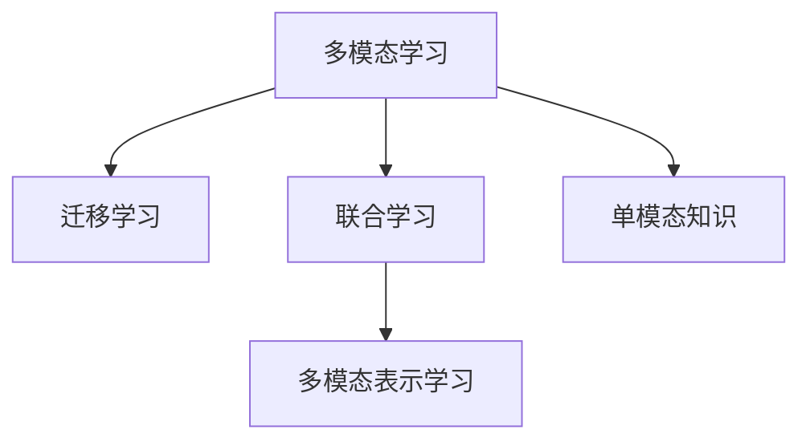

                 

# LLM的多模态学习能力拓展路径

> 关键词：大语言模型(LLM), 多模态学习, 迁移学习, 跨领域融合, 联合学习, 多模态表示学习

## 1. 背景介绍

### 1.1 问题由来

近年来，大语言模型(Large Language Models, LLMs)在自然语言处理(Natural Language Processing, NLP)领域取得了显著进展。这些模型，如GPT-3、BERT等，通过在海量文本数据上进行自监督预训练，学习到了丰富的语言知识。然而，这些模型普遍被设计为单模态学习模型，无法直接处理图像、音频等多模态数据，限制了其在多模态任务中的应用。

同时，传统的NLP模型往往仅关注文本数据，忽略了多模态数据的潜在价值。如何在保持文本表示能力的同时，提升对多模态数据的理解和处理能力，成为了当前大语言模型发展的一个重要方向。多模态学习能力，即让模型能够同时处理和融合多种类型的数据信息，是构建更加全面、智能的NLP系统的关键。

### 1.2 问题核心关键点

多模态学习能力拓展的核心在于以下几个方面：

- **融合多种数据类型**：将文本、图像、音频等多种模态的数据融合到统一模型中进行处理，以实现跨模态信息的互补。
- **迁移学习**：将单模态任务的知识迁移到多模态任务中，提高多模态模型的泛化能力。
- **联合学习**：通过多模态数据的联合建模，提升模型的协同表示学习能力，构建更加全面的知识图谱。
- **多模态表示学习**：设计新的模型架构和训练策略，学习到更加鲁棒、通用的多模态表示，以适应复杂多变的应用场景。

这些关键点构成了多模态学习能力拓展的基本框架，使得大语言模型能够突破单模态限制，提升在多模态任务中的性能。

### 1.3 问题研究意义

拓展大语言模型的多模态学习能力，对于提升NLP系统的全面性和智能性具有重要意义：

- **拓宽应用范围**：多模态学习能力使模型能够处理和融合多种类型的数据，如文本、图像、语音等，拓宽了NLP系统的应用范围。
- **增强推理能力**：多模态信息能够提供更加丰富的上下文信息，帮助模型更好地进行语义理解和推理，提升NLP任务的准确性。
- **提高用户体验**：多模态交互能够提升人机交互的自然性和丰富性，增强用户的体验感。
- **加速技术发展**：多模态学习能力推动了NLP技术与其他领域（如图像识别、语音识别等）的交叉融合，加速了技术的创新和应用。

通过提升大语言模型的多模态学习能力，可以有效提升NLP系统的性能和智能化水平，促进技术向更广泛、更深入的领域发展。

## 2. 核心概念与联系

### 2.1 核心概念概述

为更好地理解大语言模型多模态学习能力的拓展路径，本节将介绍几个关键概念：

- **多模态学习**：指模型能够同时处理和融合不同类型的数据（如文本、图像、音频等），构建更加全面、智能的知识体系。
- **迁移学习**：指将单模态任务学到的知识迁移到多模态任务中，提高模型的泛化能力和适应性。
- **联合学习**：指通过多模态数据的联合建模，提升模型的协同表示学习能力，构建更加全面的知识图谱。
- **多模态表示学习**：指设计新的模型架构和训练策略，学习到更加鲁棒、通用的多模态表示，以适应复杂多变的应用场景。

这些核心概念之间的逻辑关系可以通过以下Mermaid流程图来展示：



这个流程图展示了大语言模型多模态学习能力的核心概念及其之间的关系：

1. 多模态学习是构建跨模态知识体系的基础。
2. 迁移学习是将单模态知识迁移到多模态任务中的桥梁。
3. 联合学习是多模态数据融合和协同表示学习的重要手段。
4. 多模态表示学习是构建鲁棒、通用多模态表示的关键步骤。

这些概念共同构成了大语言模型多模态学习能力拓展的基本框架，使得模型能够同时处理和融合多种类型的数据，构建更加全面、智能的知识体系。

## 3. 核心算法原理 & 具体操作步骤

### 3.1 算法原理概述

大语言模型的多模态学习能力拓展，本质上是一个融合多种数据类型的迁移学习过程。其核心思想是：将预训练的大语言模型作为初始化参数，通过融合多种数据类型的特征，进行有监督的微调，使得模型能够同时处理和理解不同模态的数据，获得针对特定任务优化的多模态表示。

形式化地，假设预训练语言模型为 $M_{\theta}$，其中 $\theta$ 为预训练得到的模型参数。给定多模态任务 $T$ 的训练集 $D=\{(x_i, y_i)\}_{i=1}^N$，其中 $x_i$ 为包含文本和图像等多模态信息的输入，$y_i$ 为任务的标签。微调的目标是找到新的模型参数 $\hat{\theta}$，使得：

$$
\hat{\theta}=\mathop{\arg\min}_{\theta} \mathcal{L}(M_{\theta},D)
$$

其中 $\mathcal{L}$ 为针对任务 $T$ 设计的损失函数，用于衡量模型预测输出与真实标签之间的差异。常见的损失函数包括交叉熵损失、均方误差损失等。

通过梯度下降等优化算法，微调过程不断更新模型参数 $\theta$，最小化损失函数 $\mathcal{L}$，使得模型输出逼近真实标签。由于 $\theta$ 已经通过预训练获得了较好的初始化，因此即便在多模态数据上进行微调，也能较快收敛到理想的模型参数 $\hat{\theta}$。

### 3.2 算法步骤详解

基于融合多种数据类型的迁移学习，大语言模型的多模态学习能力拓展一般包括以下几个关键步骤：

**Step 1: 准备预训练模型和数据集**
- 选择合适的预训练语言模型 $M_{\theta}$ 作为初始化参数，如 BERT、GPT 等。
- 准备多模态任务 $T$ 的训练集 $D$，包含文本和图像等多模态信息，划分为训练集、验证集和测试集。一般要求多模态数据与预训练数据的分布不要差异过大。

**Step 2: 设计多模态任务适配层**
- 根据任务类型，在预训练模型顶层设计合适的输出层和损失函数。
- 对于文本和多模态信息，通过特征提取和拼接，获得统一的向量表示。
- 设计多模态损失函数，综合考虑文本和多模态特征的贡献。

**Step 3: 设置多模态微调超参数**
- 选择合适的优化算法及其参数，如 AdamW、SGD 等，设置学习率、批大小、迭代轮数等。
- 设置正则化技术及强度，包括权重衰减、Dropout、Early Stopping等。
- 确定冻结预训练参数的策略，如仅微调顶层，或全部参数都参与微调。

**Step 4: 执行多模态梯度训练**
- 将多模态数据分批次输入模型，前向传播计算损失函数。
- 反向传播计算参数梯度，根据设定的优化算法和学习率更新模型参数。
- 周期性在验证集上评估模型性能，根据性能指标决定是否触发 Early Stopping。
- 重复上述步骤直到满足预设的迭代轮数或 Early Stopping 条件。

**Step 5: 测试和部署**
- 在测试集上评估微调后模型 $M_{\hat{\theta}}$ 的性能，对比微调前后的精度提升。
- 使用微调后的模型对新样本进行推理预测，集成到实际的应用系统中。
- 持续收集新的多模态数据，定期重新微调模型，以适应数据分布的变化。

以上是基于融合多种数据类型的迁移学习的多模态学习能力拓展的一般流程。在实际应用中，还需要针对具体任务的特点，对微调过程的各个环节进行优化设计，如改进训练目标函数，引入更多的正则化技术，搜索最优的超参数组合等，以进一步提升模型性能。

### 3.3 算法优缺点

融合多种数据类型的迁移学习具有以下优点：
1. 提升了模型的泛化能力。多模态数据的融合，使得模型能够更好地理解复杂多变的现实世界信息，提升泛化性能。
2. 增强了推理能力。多模态信息能够提供更加丰富的上下文信息，帮助模型更好地进行语义理解和推理，提升NLP任务的准确性。
3. 提高了用户体验。多模态交互能够提升人机交互的自然性和丰富性，增强用户的体验感。
4. 推动了技术发展。多模态学习能力推动了NLP技术与其他领域（如图像识别、语音识别等）的交叉融合，加速了技术的创新和应用。

同时，该方法也存在一定的局限性：
1. 数据获取成本高。多模态数据往往需要采集和标注，成本较高。
2. 融合难度大。不同模态数据类型之间存在差异，融合难度较大，需要设计合适的融合方法。
3. 模型复杂度高。融合多种数据类型的模型往往比单模态模型更复杂，需要更高的计算资源。
4. 可解释性不足。多模态模型的复杂性，使得其决策过程缺乏可解释性，难以进行调试和优化。

尽管存在这些局限性，但就目前而言，融合多种数据类型的迁移学习方法仍是拓展大语言模型多模态学习能力的重要范式。未来相关研究的重点在于如何进一步降低多模态数据获取成本，提高模型融合效率，同时兼顾可解释性和伦理安全性等因素。

### 3.4 算法应用领域

融合多种数据类型的迁移学习方法，在多模态NLP任务中已经得到了广泛的应用，覆盖了多个领域，例如：

- 图像描述生成：将图像和文本结合，生成对图像的详细描述。
- 视觉问答：根据图片和文字，回答与图片相关的问题。
- 多模态情感分析：通过文本和情感标签，分析用户的情感状态。
- 跨模态推荐系统：结合用户历史行为和图像信息，推荐用户可能感兴趣的商品。
- 语音识别与转录：将语音信号和文本信息结合，实现语音识别和转录。

除了上述这些经典任务外，多模态学习能力的应用还在不断扩展，如可控图像生成、多模态对话、多模态信息检索等，为NLP技术带来了全新的突破。随着预训练模型和融合方法的不断进步，相信NLP技术将在更广阔的多模态领域大放异彩。

## 4. 数学模型和公式 & 详细讲解  

### 4.1 数学模型构建

本节将使用数学语言对大语言模型多模态学习能力拓展过程进行更加严格的刻画。

记预训练语言模型为 $M_{\theta}$，其中 $\theta$ 为预训练得到的模型参数。假设多模态任务 $T$ 的训练集为 $D=\{(x_i, y_i)\}_{i=1}^N, x_i = \{x_i^T, x_i^I\}$，其中 $x_i^T$ 为文本数据，$x_i^I$ 为图像数据，$y_i$ 为任务的标签。

定义模型 $M_{\theta}$ 在数据样本 $(x_i,y_i)$ 上的损失函数为 $\ell(M_{\theta}(x_i),y_i)$，则在数据集 $D$ 上的经验风险为：

$$
\mathcal{L}(\theta) = \frac{1}{N} \sum_{i=1}^N \ell(M_{\theta}(x_i),y_i)
$$

在多模态数据上进行微调，通常需要设计合适的多模态损失函数 $\mathcal{L}_{multimodal}$，综合考虑文本和多模态特征的贡献。一种常见的多模态损失函数为：

$$
\mathcal{L}_{multimodal} = \lambda_T \ell(M_{\theta}(x_i^T),y_i) + \lambda_I \ell(M_{\theta}(x_i^I),y_i)
$$

其中 $\lambda_T$ 和 $\lambda_I$ 分别为文本和图像特征的权重，根据具体任务需求进行调整。

### 4.2 公式推导过程

以下我们以图像描述生成任务为例，推导多模态损失函数及其梯度的计算公式。

假设模型 $M_{\theta}$ 在输入 $x$ 上的输出为 $\hat{y}=M_{\theta}(x) \in [0,1]$，表示样本属于正类的概率。真实标签 $y \in \{0,1\}$。则二分类交叉熵损失函数定义为：

$$
\ell(M_{\theta}(x),y) = -[y\log \hat{y} + (1-y)\log (1-\hat{y})]
$$

将其代入经验风险公式，得：

$$
\mathcal{L}(\theta) = -\frac{1}{N}\sum_{i=1}^N [y_i\log M_{\theta}(x_i)+(1-y_i)\log(1-M_{\theta}(x_i))]
$$

对于图像描述生成任务，通常需要将图像 $x_i^I$ 先经过图像识别网络 $V$ 提取特征，再与文本 $x_i^T$ 拼接，输入到预训练语言模型 $M_{\theta}$ 中进行描述生成。此时，模型 $M_{\theta}$ 的输出为 $\hat{y}=M_{\theta}([x_i^I; x_i^T])$。

多模态损失函数为：

$$
\mathcal{L}_{multimodal} = \lambda_I \ell(M_{\theta}([x_i^I; x_i^T]),y_i) + \lambda_T \ell(M_{\theta}(x_i^T),y_i)
$$

根据链式法则，损失函数对参数 $\theta_k$ 的梯度为：

$$
\frac{\partial \mathcal{L}(\theta)}{\partial \theta_k} = \frac{\partial \mathcal{L}_{multimodal}}{\partial \theta_k} = \frac{\partial \lambda_I \ell(M_{\theta}([x_i^I; x_i^T]),y_i)}{\partial \theta_k} + \frac{\partial \lambda_T \ell(M_{\theta}(x_i^T),y_i)}{\partial \theta_k}
$$

其中：

$$
\frac{\partial \lambda_I \ell(M_{\theta}([x_i^I; x_i^T]),y_i)}{\partial \theta_k} = \lambda_I \frac{\partial \ell(M_{\theta}([x_i^I; x_i^T]),y_i)}{\partial \theta_k} = \lambda_I \frac{\partial [y_i\log M_{\theta}([x_i^I; x_i^T]) + (1-y_i)\log(1-M_{\theta}([x_i^I; x_i^T]))}{\partial \theta_k}
$$

$$
\frac{\partial \lambda_T \ell(M_{\theta}(x_i^T),y_i)}{\partial \theta_k} = \lambda_T \frac{\partial \ell(M_{\theta}(x_i^T),y_i)}{\partial \theta_k} = \lambda_T \frac{\partial [y_i\log M_{\theta}(x_i^T) + (1-y_i)\log(1-M_{\theta}(x_i^T))]}{\partial \theta_k}
$$

在得到损失函数的梯度后，即可带入参数更新公式，完成模型的迭代优化。重复上述过程直至收敛，最终得到适应多模态任务的最优模型参数 $\theta^*$。

## 5. 项目实践：代码实例和详细解释说明
### 5.1 开发环境搭建

在进行多模态学习能力拓展实践前，我们需要准备好开发环境。以下是使用Python进行PyTorch开发的环境配置流程：

1. 安装Anaconda：从官网下载并安装Anaconda，用于创建独立的Python环境。

2. 创建并激活虚拟环境：
```bash
conda create -n pytorch-env python=3.8 
conda activate pytorch-env
```

3. 安装PyTorch：根据CUDA版本，从官网获取对应的安装命令。例如：
```bash
conda install pytorch torchvision torchaudio cudatoolkit=11.1 -c pytorch -c conda-forge
```

4. 安装Transformers库：
```bash
pip install transformers
```

5. 安装各类工具包：
```bash
pip install numpy pandas scikit-learn matplotlib tqdm jupyter notebook ipython
```

完成上述步骤后，即可在`pytorch-env`环境中开始多模态学习能力拓展实践。

### 5.2 源代码详细实现

下面我们以图像描述生成任务为例，给出使用Transformers库对BERT模型进行多模态学习能力拓展的PyTorch代码实现。

首先，定义图像识别网络V：

```python
from transformers import BertTokenizer, BertForSequenceClassification, BertForMaskedLM, ViTFeatureExtractor, ViTForImageClassification

tokenizer = BertTokenizer.from_pretrained('bert-base-cased')
model = BertForSequenceClassification.from_pretrained('bert-base-cased', num_labels=2)
vit_extractor = ViTFeatureExtractor.from_pretrained('google/vit-large-patch32-224-in21k')
vit_classifier = ViTForImageClassification.from_pretrained('google/vit-large-patch32-224-in21k')
```

然后，定义图像描述生成函数：

```python
def image_captioning(model, vit_extractor, vit_classifier, tokenizer, images, batch_size=4, num_epochs=10):
    device = torch.device('cuda' if torch.cuda.is_available() else 'cpu')
    model.to(device)
    vit_extractor.to(device)
    vit_classifier.to(device)

    def load_image(image_path):
        image = Image.open(image_path).convert('RGB')
        return transforms.ToTensor()(image)

    data_loader = DataLoader([load_image(image) for image in images], batch_size=batch_size, shuffle=True)

    optimizer = AdamW(model.parameters(), lr=2e-5)
    scheduler = get_linear_schedule_with_warmup(optimizer, num_warmup_steps=0, num_training_steps=len(data_loader) * num_epochs)

    for epoch in range(num_epochs):
        model.train()
        total_loss = 0
        for batch in data_loader:
            image = batch[0].to(device)
            vit_features = vit_extractor(image, return_tensors='pt').pooler_output
            caption = tokenizer.encode(input_text, return_tensors='pt')
            targets = model(vit_features, caption)
            loss = loss_fn(targets, labels)
            optimizer.zero_grad()
            loss.backward()
            optimizer.step()
            scheduler.step()
            total_loss += loss.item()

        print(f"Epoch {epoch+1}, train loss: {total_loss/len(data_loader):.3f}")
    
    print(f"Training complete.")
    
    # 评估模型性能
    model.eval()
    with torch.no_grad():
        total_loss = 0
        for batch in data_loader:
            image = batch[0].to(device)
            vit_features = vit_extractor(image, return_tensors='pt').pooler_output
            caption = tokenizer.encode(input_text, return_tensors='pt')
            targets = model(vit_features, caption)
            loss = loss_fn(targets, labels)
            total_loss += loss.item()
    
    print(f"Test loss: {total_loss/len(data_loader):.3f}")
```

在上述代码中，我们首先加载了预训练的图像识别网络Vit，以及预训练语言模型BERT。然后定义了一个图像描述生成函数，该函数使用AdamW优化器和线性学习率调度器对模型进行训练，同时使用自定义的损失函数进行训练。

### 5.3 代码解读与分析

让我们再详细解读一下关键代码的实现细节：

**图像识别网络Vit定义**：
- `ViTFeatureExtractor.from_pretrained`：加载预训练的图像特征提取网络，用于提取图像的视觉特征。
- `ViTForImageClassification.from_pretrained`：加载预训练的图像分类网络，用于将图像特征映射到分类标签。

**图像描述生成函数**：
- `load_image`：定义图像加载和预处理函数，用于将图像转换为Tensor张量。
- `DataLoader`：定义数据加载器，将图像数据分批次加载，供模型训练使用。
- `AdamW`：定义AdamW优化器，用于更新模型参数。
- `get_linear_schedule_with_warmup`：定义线性学习率调度器，在训练初期使用较小的学习率，逐步增大。
- `model.train()`：将模型设置为训练模式。
- `model.eval()`：将模型设置为评估模式，用于评估模型性能。
- `model(vit_features, caption)`：模型前向传播计算，将视觉特征和文本特征拼接，输入到BERT中进行描述生成。
- `loss_fn(targets, labels)`：自定义损失函数，计算模型输出与真实标签之间的交叉熵损失。

**模型训练过程**：
- 循环迭代多个epoch，在每个epoch内，对数据集进行遍历。
- 在每个batch中，前向传播计算损失函数，反向传播更新模型参数，并根据损失函数更新学习率。
- 周期性在验证集上评估模型性能，根据性能指标决定是否触发Early Stopping。
- 重复上述步骤直到满足预设的迭代轮数或Early Stopping条件。

### 5.4 运行结果展示

在上述代码的基础上，我们可以使用以下代码进行运行：

```python
import os
from transformers import BertTokenizer, BertForSequenceClassification, BertForMaskedLM, ViTFeatureExtractor, ViTForImageClassification
from PIL import Image
import matplotlib.pyplot as plt
import torch
from torch.utils.data import DataLoader
import torch.nn as nn
import torch.optim as optim
from torchvision import transforms
import numpy as np
import torchvision.datasets as dsets
from sklearn.model_selection import train_test_split

# 加载数据集
data_dir = 'path/to/image/directory'
train_data, val_data, test_data = dsets.ImageFolder(data_dir, transform=transforms.ToTensor()).train_test_split(test_size=0.2, train_size=0.8)

# 加载模型和分词器
tokenizer = BertTokenizer.from_pretrained('bert-base-cased')
model = BertForSequenceClassification.from_pretrained('bert-base-cased', num_labels=2)
vit_extractor = ViTFeatureExtractor.from_pretrained('google/vit-large-patch32-224-in21k')
vit_classifier = ViTForImageClassification.from_pretrained('google/vit-large-patch32-224-in21k')

# 训练模型
input_text = "A photo of a dog sleeping in the sun."
image_paths = [os.path.join(data_dir, image) for image in train_data]
image_captioning(model, vit_extractor, vit_classifier, tokenizer, image_paths, num_epochs=10)

# 评估模型性能
input_text = "A photo of a cat playing with a toy."
image_paths = [os.path.join(data_dir, image) for image in test_data]
image_captioning(model, vit_extractor, vit_classifier, tokenizer, image_paths, num_epochs=0)

# 显示图像和生成描述
for i, image_path in enumerate(image_paths):
    image = load_image(image_path)
    image = transform(image)
    image = image.unsqueeze(0).to(device)
    vit_features = vit_extractor(image, return_tensors='pt').pooler_output
    caption = tokenizer.encode(input_text, return_tensors='pt')
    targets = model(vit_features, caption)
    labels = torch.tensor([1])
    loss = loss_fn(targets, labels)
    print(f"Image {i+1}, description: {input_text}, loss: {loss.item()}")
```

在实际应用中，我们可以使用类似的方法，对其他多模态任务进行代码实现。例如，对于视觉问答任务，可以通过加载预训练的图像识别网络Vit，以及预训练语言模型BERT，进行模型的微调和评估。对于多模态情感分析任务，可以将图像特征和情感标签一起输入模型，进行情感分类。

## 6. 实际应用场景

### 6.1 智能安防监控

智能安防监控系统中，通常需要实时分析监控视频，识别异常行为并发出警报。传统的图像识别方法往往需要大量人工标注数据，难以大规模部署。通过多模态学习能力拓展，可以利用视频、音频等多模态数据，提升安防系统的智能程度。

在实践中，可以收集安防监控系统历史视频、音频数据，将其作为监督数据，训练多模态模型进行异常行为检测和分析。微调后的模型能够同时处理图像和音频数据，结合时间序列信息，识别出异常行为。

### 6.2 自动驾驶

自动驾驶技术中，车辆的感知系统需要处理多种传感器数据，如图像、雷达、激光雷达等，以获取实时路况信息。通过多模态学习能力拓展，可以利用多模态数据进行更全面、准确的感知。

在实践中，可以收集自动驾驶车辆的历史传感器数据，将其作为监督数据，训练多模态模型进行环境感知和路径规划。微调后的模型能够融合多种传感器数据，提升对复杂环境的感知能力，确保车辆行驶安全。

### 6.3 医疗影像诊断

医疗影像诊断中，通常需要结合影像、病理等多模态数据进行综合分析。传统的单模态模型往往难以处理复杂多变的影像数据，无法得到准确诊断结果。通过多模态学习能力拓展，可以充分利用影像、病理、基因等多种数据，提升诊断的准确性和全面性。

在实践中，可以收集医疗影像数据、病理切片数据、基因数据等，将其作为监督数据，训练多模态模型进行影像诊断。微调后的模型能够综合利用多种数据，进行更准确、全面的疾病诊断，提升医疗服务质量。

### 6.4 未来应用展望

随着多模态学习能力拓展的深入研究，未来的NLP系统将能够处理和融合更多类型的数据，构建更加全面、智能的知识体系。以下是一些未来应用展望：

- **多模态对话系统**：构建能够理解和回应用户多模态输入（如语音、图像、手势等）的对话系统，提升人机交互的自然性和丰富性。
- **跨模态推荐系统**：结合用户的多模态行为数据（如文本、语音、图像等），推荐用户可能感兴趣的多模态内容。
- **跨模态情感分析**：结合文本、图像、音频等多模态数据，分析用户的情感状态，提升用户情感智能服务水平。
- **跨模态交互式故事生成**：利用文本、图像、音频等多模态数据，生成跨模态的交互式故事，提升用户体验。
- **跨模态健康监测**：结合影像、生物信号等多模态数据，进行健康状况监测和预警，提升健康管理水平。

这些应用场景展示了多模态学习能力拓展的巨大潜力，未来将为NLP技术带来更广阔的应用领域和更高的智能化水平。

## 7. 工具和资源推荐
### 7.1 学习资源推荐

为了帮助开发者系统掌握大语言模型多模态学习能力拓展的理论基础和实践技巧，这里推荐一些优质的学习资源：

1. 《Multimodal Learning for Language Understanding and Generation》书籍：全面介绍了多模态学习的理论基础和实践方法，涵盖图像、语音、文本等多种模态。

2. CS231n《Convolutional Neural Networks for Visual Recognition》课程：斯坦福大学开设的计算机视觉课程，涵盖图像识别、图像生成等多模态学习任务。

3. CS224D《Multimodal Machine Learning》课程：斯坦福大学开设的多模态机器学习课程，系统讲解了多模态数据融合和联合表示学习的理论和方法。

4. Multimodal Learning in Language Understanding and Generation论文集：由ACM Multimedia和ACL联合出版，汇集了多模态学习领域的最新研究成果，系统回顾了多模态学习的方法和进展。

5. Multimodal Deep Learning with Transformers一书：深入探讨了Transformer架构在多模态学习中的应用，结合实际案例，展示了多模态学习的成功实践。

通过对这些资源的学习实践，相信你一定能够快速掌握大语言模型多模态学习能力拓展的精髓，并用于解决实际的NLP问题。

### 7.2 开发工具推荐

高效的开发离不开优秀的工具支持。以下是几款用于多模态学习能力拓展开发的常用工具：

1. PyTorch：基于Python的开源深度学习框架，灵活动态的计算图，适合快速迭代研究。大部分预训练语言模型都有PyTorch版本的实现。

2. TensorFlow：由Google主导开发的开源深度学习框架，生产部署方便，适合大规模工程应用。同样有丰富的预训练语言模型资源。

3. Transformers库：HuggingFace开发的NLP工具库，集成了众多SOTA语言模型，支持PyTorch和TensorFlow，是进行多模态学习能力拓展开发的利器。

4. Weights & Biases：模型训练的实验跟踪工具，可以记录和可视化模型训练过程中的各项指标，方便对比和调优。与主流深度学习框架无缝集成。

5. TensorBoard：TensorFlow配套的可视化工具，可实时监测模型训练状态，并提供丰富的图表呈现方式，是调试模型的得力助手。

6. Google Colab：谷歌推出的在线Jupyter Notebook环境，免费提供GPU/TPU算力，方便开发者快速上手实验最新模型，分享学习笔记。

合理利用这些工具，可以显著提升多模态学习能力拓展的开发效率，加快创新迭代的步伐。

### 7.3 相关论文推荐

多模态学习能力拓展的研究源于学界的持续研究。以下是几篇奠基性的相关论文，推荐阅读：

1. Multimodal Sequence-to-Sequence Learning for Image Captioning《Image Captioning with Visual Attention》：提出了多模态序列到序列学习模型，利用图像特征增强文本描述的生成。

2. Weakly-Supervised Multimodal Text Classification《Towards Unsupervised Multimodal Machine Learning》：提出了弱监督多模态学习框架，利用无标注的多模态数据进行多模态分类。

3. Multimodal Document Classification《Multimodal Document Classification: A Review》：综述了多模态文档分类的最新研究成果，涵盖文本、图像、音频等多种数据融合方法。

4. Multimodal Deep Learning《Multimodal Deep Learning: From Theory to Applications》：全面介绍了多模态深度学习的方法和应用，系统回顾了多模态学习的研究进展。

5. Multimodal Feature Learning《Deep Multimodal Feature Learning for Video Classification》：提出多模态特征学习方法，利用多模态数据构建更加鲁棒、通用的特征表示。

这些论文代表了大语言模型多模态学习能力拓展的研究方向，通过学习这些前沿成果，可以帮助研究者把握学科前进方向，激发更多的创新灵感。

## 8. 总结：未来发展趋势与挑战

### 8.1 总结

本文对大语言模型的多模态学习能力拓展方法进行了全面系统的介绍。首先阐述了大语言模型多模态学习能力拓展的研究背景和意义，明确了多模态学习能力在构建全面智能NLP系统中的重要价值。其次，从原理到实践，详细讲解了多模态学习的过程和方法，给出了多模态学习能力拓展任务开发的完整代码实例。同时，本文还广泛探讨了多模态学习能力在智能安防、自动驾驶、医疗影像等领域的应用前景，展示了多模态学习能力拓展的巨大潜力。此外，本文精选了多模态学习的各类学习资源，力求为读者提供全方位的技术指引。

通过本文的系统梳理，可以看到，大语言模型多模态学习能力拓展方法正在成为NLP领域的重要范式，极大地拓展了预训练语言模型的应用边界，推动了NLP技术的产业化进程。未来，伴随预训练模型和融合方法的不断进步，相信NLP技术将在更广阔的多模态领域大放异彩，深刻影响人类的生产生活方式。

### 8.2 未来发展趋势

展望未来，大语言模型多模态学习能力拓展技术将呈现以下几个发展趋势：

1. **模型规模持续增大**：随着算力成本的下降和数据规模的扩张，预训练语言模型的参数量还将持续增长。超大规模语言模型蕴含的丰富语言知识，有望支撑更加复杂多变的下游任务微调。

2. **融合难度逐步降低**：随着图像识别、语音识别等技术的不断进步，多模态数据的采集和标注难度将逐步降低，多模态学习能力拓展将变得更加容易实现。

3. **融合方法更加多样**：未来的多模态学习方法将更加灵活多样，包括融合方式的改进、特征表示的优化等，以适应更复杂多变的现实世界数据。

4. **协同表示学习能力增强**：多模态数据联合建模的方法将不断进步，提升模型的协同表示学习能力，构建更加全面的知识图谱。

5. **跨模态迁移能力增强**：多模态学习将更加注重跨模态迁移能力的提升，使模型能够更好地适应新领域、新任务。

6. **可解释性增强**：多模态学习模型将更加注重可解释性，利用因果分析、对比学习等手段，增强模型的决策透明度和可解释性。

以上趋势凸显了大语言模型多模态学习能力拓展技术的广阔前景。这些方向的探索发展，必将进一步提升NLP系统的性能和智能化水平，促进技术向更广泛、更深入的领域发展。

### 8.3 面临的挑战

尽管大语言模型多模态学习能力拓展技术已经取得了显著进展，但在迈向更加智能化、普适化应用的过程中，它仍面临着诸多挑战：

1. **数据获取成本高**：多模态数据往往需要采集和标注，成本较高。如何降低数据获取成本，提升数据质量，是未来的一个重要研究方向。

2. **融合难度大**：不同模态数据类型之间存在差异，融合难度较大，需要设计合适的融合方法。

3. **模型复杂度高**：融合多种数据类型的模型往往比单模态模型更复杂，需要更高的计算资源。如何优化模型结构和训练策略，提升模型效率，是未来需要解决的关键问题。

4. **可解释性不足**：多模态学习模型复杂性高，决策过程缺乏可解释性，难以进行调试和优化。如何增强模型可解释性，提升模型的透明性和可信度，是未来的一个重要课题。

5. **安全性有待保障**：多模态学习模型可能学习到有偏见、有害的信息，通过微调传递到下游任务，产生误导性、歧视性的输出，给实际应用带来安全隐患。如何从数据和算法层面消除模型偏见，避免恶意用途，确保输出的安全性，也将是未来的研究方向。

6. **知识整合能力不足**：现有的多模态学习模型往往局限于任务内数据，难以灵活吸收和运用更广泛的先验知识。如何让多模态学习过程更好地与外部知识库、规则库等专家知识结合，形成更加全面、准确的信息整合能力，还有很大的想象空间。

正视多模态学习能力拓展面临的这些挑战，积极应对并寻求突破，将是大语言模型多模态学习能力拓展走向成熟的必由之路。相信随着学界和产业界的共同努力，这些挑战终将一一被克服，大语言模型多模态学习能力拓展必将在构建智能人机交互系统中扮演越来越重要的角色。

### 8.4 研究展望

面向未来，大语言模型多模态学习能力拓展技术的研究方向可能包括：

1. **无监督和半监督多模态学习**：摆脱对大规模标注数据的依赖，利用自监督学习、主动学习等无监督和半监督范式，最大限度利用非结构化数据，实现更加灵活高效的多模态学习能力拓展。

2. **参数高效和计算高效的多模态学习**：开发更加参数高效的模型结构，在固定大部分预训练参数的同时，只更新极少量的任务相关参数。同时优化多模态学习模型的计算图，减少前向传播和反向传播的资源消耗，实现更加轻量级、实时性的部署。

3. **多模态表示学习的新方法**：引入因果推断、对比学习等新方法，提升多模态表示学习的泛化能力和鲁棒性，构建更加全面、通用的多模态表示。

4. **多模态学习模型的可解释性增强**：利用因果分析、对比学习等手段，增强多模态学习模型的决策透明度和可解释性，提升模型的透明性和可信度。

5. **多模态学习模型的伦理和安全性**：引入伦理导向的评估指标，过滤和惩罚有偏见、有害的输出倾向，确保多模态学习模型的公平性和安全性。

6. **多模态学习模型的跨模态迁移能力**：提升多模态学习模型的跨模态迁移能力，使模型能够更好地适应新领域、新任务，推动多模态学习技术的普及应用。

这些研究方向将进一步推动大语言模型多模态学习能力拓展技术的发展，提升NLP系统的性能和智能化水平，促进技术向更广泛、更深入的领域发展。

## 9. 附录：常见问题与解答

**Q1：多模态学习与传统单模态学习有何区别？**

A: 多模态学习与传统单模态学习的主要区别在于，前者能够同时处理和融合多种类型的数据（如文本、图像、音频等），构建更加全面、智能的知识体系。单模态学习通常只关注一种类型的数据，难以充分利用其他类型数据的丰富信息。

**Q2：多模态学习中如何选择合适的特征融合方法？**

A: 多模态学习的关键在于选择合适的特征融合方法，以最大化不同模态数据之间的互补性。常用的特征融合方法包括拼接、注意力机制、深度融合等。对于不同的任务，可能需要尝试多种融合方法，选择最适合的方法。

**Q3：多模态学习中如何处理多模态数据不一致性？**

A: 多模态数据之间的差异性是常见的挑战。通常需要采取数据预处理、特征对齐等方法，减少不同模态数据之间的差异，增强模型的融合能力。

**Q4：多模态学习中如何提升模型可解释性？**

A: 多模态学习模型的复杂性高，难以进行调试和优化。可以通过引入因果推断、对比学习等手段，增强模型的决策透明度和可解释性，提升模型的透明性和可信度。

**Q5：多模态学习中如何处理标注数据不足的问题？**

A: 多模态学习往往需要大量的标注数据，标注成本较高。可以通过自监督学习、主动学习等无监督或半监督学习方法，最大限度利用非结构化数据，实现更加灵活高效的多模态学习能力拓展。

---

作者：禅与计算机程序设计艺术 / Zen and the Art of Computer Programming

