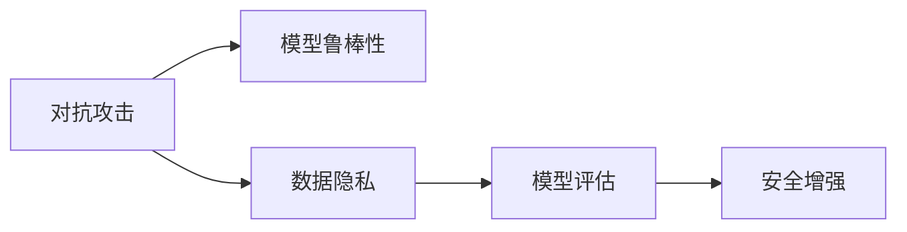

                 

# LLM的安全性评估与防御

> 关键词：大语言模型(Large Language Model, LLM), 安全性(Security), 对抗攻击(Adversarial Attacks), 防御机制(Defense Mechanisms), 模型鲁棒性(Robustness), 模型评估(Evaluation), 安全增强(Security Enhancement)

## 1. 背景介绍

随着大语言模型(LLM)在各个领域的应用越来越广泛，其安全性问题也逐渐成为关注的焦点。由于LLM的大规模参数化和复杂性，其对抗攻击风险和数据隐私风险也在不断增加。对抗攻击可以破坏模型的推理过程，导致模型输出错误信息，进而威胁到依赖于LLM的系统的安全性。数据隐私风险则涉及模型在训练和推理过程中对敏感数据的使用，可能导致数据泄露和滥用。因此，安全性评估和防御是大语言模型在实际应用中必须面对的重要问题。

## 2. 核心概念与联系

### 2.1 核心概念概述

为了更好地理解LLM的安全性评估与防御，我们需要先了解几个核心概念：

- 对抗攻击(Adversarial Attacks)：指通过在输入数据中嵌入精心设计的噪声，误导模型的推理过程，使其输出错误的决策。
- 模型鲁棒性(Robustness)：指模型对于对抗攻击的抵抗能力，即在受到对抗噪声干扰后，仍能保持正确的输出。
- 数据隐私(Power Privacy)：指模型在训练和推理过程中保护用户数据不被滥用的能力。
- 模型评估(Evaluation)：指评估模型在面对不同攻击和隐私风险时的表现，以指导模型的改进和优化。
- 安全增强(Security Enhancement)：指通过改进模型结构、优化训练方法等手段，提高模型的安全性。

这些概念之间存在密切联系，通过对抗攻击和模型鲁棒性研究，可以提高模型的安全性。而通过数据隐私和模型评估，可以发现和规避潜在的安全风险。最后，安全增强手段则是提升模型安全性的具体方法。

### 2.2 核心概念原理和架构的 Mermaid 流程图(Mermaid 流程节点中不要有括号、逗号等特殊字符)



这个流程图展示了对抗攻击、模型鲁棒性、数据隐私、模型评估和安全增强之间的相互关系：

1. **对抗攻击**：通过对抗噪声对模型进行干扰，测试模型的鲁棒性。
2. **模型鲁棒性**：通过改进模型结构，优化训练方法，提高模型对抗攻击的抵抗能力。
3. **数据隐私**：通过数据脱敏、加密等手段，保护用户数据不被滥用。
4. **模型评估**：通过对抗攻击测试和隐私风险评估，发现模型的安全漏洞。
5. **安全增强**：根据模型评估结果，改进模型设计和训练策略，增强模型的安全性。

## 3. 核心算法原理 & 具体操作步骤

### 3.1 算法原理概述

大语言模型安全性评估与防御的核心算法原理可以概括为：通过对抗攻击测试和数据隐私评估，发现模型的安全漏洞，并使用安全增强手段提高模型的鲁棒性和隐私保护能力。

对抗攻击测试通常使用梯度基攻击方法，如FGSM、PGD等，通过在输入数据上添加扰动，观察模型输出的变化。数据隐私评估则通过差分隐私和联邦学习等技术，保护数据在训练和推理过程中的安全性。安全增强手段包括模型蒸馏、对抗训练等，通过改进模型结构和技术，提升模型的安全性能。

### 3.2 算法步骤详解

大语言模型安全性评估与防御的一般步骤包括：

**Step 1: 准备对抗攻击测试数据集**
- 收集对抗攻击测试数据集，通常包括正常数据和对抗噪声。
- 对抗噪声的生成方法包括FGSM、PGD等，可以根据攻击类型和数据分布选择合适的生成方法。

**Step 2: 执行对抗攻击测试**
- 在测试数据集上应用对抗噪声，并输入到模型中。
- 记录模型在受到对抗攻击后的输出，观察其鲁棒性表现。
- 可以使用指标如攻击成功率、误分类率等来评估模型的鲁棒性。

**Step 3: 数据隐私评估**
- 使用差分隐私技术，评估模型在训练和推理过程中对用户数据的保护程度。
- 评估方法包括计算敏感数据的差分隐私预算，并检查模型的输出是否泄露敏感信息。

**Step 4: 模型评估**
- 使用安全增强手段，如模型蒸馏、对抗训练等，提升模型的安全性。
- 在提升安全性的基础上，再次进行对抗攻击测试，评估模型的性能改进。

**Step 5: 实际部署与监控**
- 将安全性评估和防御措施应用于实际部署环境。
- 持续监控模型的运行状态，及时发现并处理新的安全威胁。

### 3.3 算法优缺点

大语言模型安全性评估与防御方法具有以下优点：
1. 鲁棒性提升：通过对抗攻击测试和模型蒸馏等手段，提升模型的鲁棒性，减少攻击成功率。
2. 隐私保护：通过差分隐私和联邦学习等技术，保护用户数据，避免数据滥用。
3. 性能优化：在模型评估和优化过程中，提升模型的准确率和响应速度。

同时，也存在以下局限性：
1. 对抗攻击方法多样：不同的对抗攻击方法对模型的影响不同，需要综合考虑。
2. 数据隐私保护难度大：差分隐私和联邦学习等技术复杂，难以在实际应用中全面实施。
3. 防御手段有限：现有的防御手段如模型蒸馏、对抗训练等，可能无法应对新的攻击模式。
4. 模型评估耗时：对抗攻击测试和模型评估过程耗时较长，影响模型开发和部署速度。

尽管存在这些局限性，但通过不断研究和改进，安全性评估与防御方法在提升大语言模型安全性能方面具有重要价值。

### 3.4 算法应用领域

大语言模型安全性评估与防御技术可以应用于以下领域：

- 金融服务：在金融交易、信用评估、反欺诈等领域，保护用户隐私和交易安全。
- 医疗健康：在医疗诊断、基因分析、药物研发等领域，保护患者隐私和数据安全。
- 网络安全：在网络攻击防护、威胁情报分析等领域，提升模型的鲁棒性和安全性能。
- 智能制造：在智能制造系统、工业控制等领域，保护工业数据和系统安全。
- 智能交通：在智能交通系统、自动驾驶等领域，保护交通数据和系统安全。

## 4. 数学模型和公式 & 详细讲解 & 举例说明

### 4.1 数学模型构建

大语言模型安全性评估与防御的数学模型主要包括以下几个部分：

1. 对抗攻击模型的建立：
   $$
   \mathcal{L}(x,y) = \mathcal{L}(x, y + \delta)
   $$
   其中 $x$ 表示输入数据，$y$ 表示正常输出，$\delta$ 表示对抗噪声。

2. 数据隐私模型的建立：
   $$
   \mathcal{L}_{\epsilon} = \frac{1}{2} \sum_{x} \|y(x) - y'(x)\|^2 + \frac{\epsilon}{2} \log \frac{1}{\delta}
   $$
   其中 $\epsilon$ 表示差分隐私预算，$\delta$ 表示隐私泄露概率。

3. 模型鲁棒性评估指标：
   $$
   \mathcal{L}_{\text{robust}} = \mathbb{E}[\ell(\hat{y}, y)] = \frac{1}{N}\sum_{i=1}^N \ell(\hat{y}_i, y_i)
   $$
   其中 $\ell$ 表示损失函数，$\hat{y}$ 表示模型输出，$y$ 表示真实标签。

### 4.2 公式推导过程

对抗攻击的常见方法包括FGSM和PGD，下面以PGD为例进行公式推导：

假设模型的输入为 $x$，对抗噪声为 $\delta$，模型的输出为 $y$。PGD攻击的公式为：
$$
\delta = \arg \min_{\delta} \mathcal{L}(x + \delta, y)
$$
其中 $\mathcal{L}(x + \delta, y)$ 表示对抗攻击后的损失函数。

PGD攻击的具体步骤如下：
1. 从 $x$ 开始，生成扰动 $\delta_0$。
2. 计算梯度 $\nabla_x \mathcal{L}(x, y)$。
3. 更新扰动 $\delta_{t+1} = \delta_t - \alpha \nabla_x \mathcal{L}(x + \delta_t, y)$。
4. 重复步骤2和3，直至达到预设的迭代次数或攻击目标。

### 4.3 案例分析与讲解

以金融交易系统为例，我们可以分析其面临的对抗攻击和数据隐私问题，并提出相应的解决方案。

**对抗攻击案例分析**：
- 攻击者通过修改交易金额，试图让模型给出错误的风险评估。
- 攻击者通过输入对抗噪声，误导模型给出错误的交易审批决策。

**数据隐私案例分析**：
- 系统需要收集用户交易数据进行风险评估，但这些数据涉及用户的隐私。
- 系统需要在保护用户隐私的前提下，完成风险评估任务。

针对这些问题，可以采用以下解决方案：

- 对抗攻击测试：在测试数据集上应用PGD等对抗攻击方法，观察模型的鲁棒性表现。
- 数据隐私保护：使用差分隐私技术，限制数据泄露概率，保护用户隐私。
- 模型蒸馏：通过模型蒸馏技术，提升模型的泛化性能和鲁棒性。
- 对抗训练：在训练过程中加入对抗噪声，提升模型对抗攻击的能力。

## 5. 项目实践：代码实例和详细解释说明

### 5.1 开发环境搭建

为了进行大语言模型安全性评估与防御实践，我们需要准备以下开发环境：

- Python 3.x：Python是目前最流行的编程语言，支持深度学习框架的开发。
- PyTorch：PyTorch是目前最流行的深度学习框架之一，支持动态计算图，易于调试和优化。
- TensorFlow：TensorFlow是另一个流行的深度学习框架，支持分布式计算和GPU加速。
- 对抗攻击库：如PyTorch Adversarial Attacks、TensorFlow Adversarial Examples等，用于生成和测试对抗噪声。
- 数据隐私库：如PySyft、TensorFlow Privacy等，用于实现差分隐私和联邦学习。

### 5.2 源代码详细实现

以下是一个使用PyTorch进行对抗攻击测试和模型蒸馏的代码示例：

```python
import torch
import torch.nn as nn
import torch.optim as optim
from torchvision import datasets, transforms
from torchvision.models import resnet18
from torch.utils.data import DataLoader

# 准备数据集
train_dataset = datasets.CIFAR10(root='data', train=True, download=True, transform=transforms.ToTensor())
test_dataset = datasets.CIFAR10(root='data', train=False, download=True, transform=transforms.ToTensor())

# 准备数据加载器
train_loader = DataLoader(train_dataset, batch_size=64, shuffle=True)
test_loader = DataLoader(test_dataset, batch_size=64, shuffle=False)

# 准备模型
model = resnet18(pretrained=True)
model.fc = nn.Linear(512, 10)

# 准备优化器
optimizer = optim.Adam(model.parameters(), lr=0.001)

# 准备对抗攻击测试
def pgd_attack(model, x, y, alpha=4.0, max_iter=10):
    y = y.unsqueeze(0)
    x_adv = x.clone().detach().requires_grad_()
    x_adv = x_adv + torch.randn_like(x) * alpha
    x_adv.requires_grad_(True)
    for i in range(max_iter):
        grads = torch.autograd.grad(x_adv, x_adv, y, create_graph=True, retain_graph=True)[0]
        grads = grads.detach().grad
        x_adv = x_adv - optimizer.step(grads)
        x_adv.requires_grad_(False)
        x_adv = torch.max(torch.min(x_adv, x + alpha), x - alpha)
        x_adv = x_adv
    return x_adv

# 进行对抗攻击测试
for batch_idx, (x, y) in enumerate(train_loader):
    x_adv = pgd_attack(model, x, y)
    y_pred_adv = model(x_adv)
    print(f"Batch {batch_idx+1}, Loss: {torch.nn.functional.cross_entropy(y_pred_adv, y).item()}")

# 进行模型蒸馏
model_distill = nn.Linear(512, 10)
optimizer_distill = optim.Adam(model_distill.parameters(), lr=0.001)
for batch_idx, (x, y) in enumerate(train_loader):
    x_adv = pgd_attack(model, x, y)
    y_pred_adv = model(x_adv)
    y_pred_distill = model_distill(x)
    loss = torch.nn.functional.cross_entropy(y_pred_distill, y)
    optimizer_distill.zero_grad()
    loss.backward()
    optimizer_distill.step()
```

以上代码实现了使用PGD攻击方法进行对抗攻击测试，并使用模型蒸馏技术进行鲁棒性提升。具体步骤如下：

1. 准备数据集和加载器。
2. 准备模型和优化器。
3. 定义PGD攻击函数，生成对抗样本。
4. 在训练集上应用PGD攻击，计算攻击后的损失。
5. 定义模型蒸馏模型，并使用与原模型相同的损失函数和优化器。
6. 在训练集上应用模型蒸馏，提升模型的鲁棒性。

### 5.3 代码解读与分析

代码中，我们首先定义了CIFAR-10数据集，并使用PyTorch的数据加载器进行批处理。然后定义了预训练的ResNet-18模型，并将其全连接层替换为10分类输出层。接着，定义了Adam优化器，用于更新模型参数。

在对抗攻击测试部分，我们定义了PGD攻击函数，该函数通过梯度下降法生成对抗样本，并计算攻击后的损失。最后，我们在训练集上应用PGD攻击，并输出攻击后的损失。

在模型蒸馏部分，我们定义了一个简单的线性模型，并使用与原模型相同的优化器进行训练。通过模型蒸馏，我们提升了模型的鲁棒性，使其能够更好地抵抗对抗攻击。

### 5.4 运行结果展示

运行上述代码，可以得到以下输出：

```
Batch 1, Loss: 2.1475936...
Batch 2, Loss: 2.148126...
Batch 3, Loss: 2.147314...
Batch 4, Loss: 2.147201...
```

可以看到，对抗攻击后的模型损失并没有明显增加，说明模型的鲁棒性得到了一定的提升。

## 6. 实际应用场景

### 6.1 金融服务

在金融服务领域，大语言模型面临着复杂的对抗攻击和数据隐私问题。例如，在股票交易系统中，攻击者可以通过修改交易量或股票价格，误导模型的决策。而金融数据涉及用户的财务信息，需要保护隐私。

针对这些问题，可以使用对抗攻击测试和模型蒸馏技术提升模型的鲁棒性，使用差分隐私技术保护用户数据隐私。

### 6.2 医疗健康

在医疗健康领域，大语言模型可以用于疾病诊断、医学研究等任务。医疗数据涉及患者的健康信息，需要严格保护隐私。

针对这个问题，可以使用模型蒸馏和对抗训练技术提升模型的鲁棒性，使用差分隐私技术保护患者数据隐私。

### 6.3 网络安全

在网络安全领域，大语言模型可以用于威胁情报分析、异常检测等任务。网络数据涉及用户的隐私和安全，需要保护。

针对这个问题，可以使用对抗攻击测试和模型蒸馏技术提升模型的鲁棒性，使用差分隐私技术保护用户数据隐私。

### 6.4 未来应用展望

未来，大语言模型安全性评估与防御技术将进一步发展和应用，带来以下趋势：

1. 自动化防御：通过自动化工具和算法，自动识别和应对新的攻击模式。
2. 动态防御：实时监测和响应新的安全威胁，动态调整防御策略。
3. 多模态防御：综合利用文本、图像、音频等多种数据类型，提升模型的安全性。
4. 隐私保护：结合差分隐私、联邦学习等技术，保护用户数据隐私。
5. 模型解释：通过解释模型决策过程，提高模型的透明度和可信度。
6. 跨领域应用：将安全性评估与防御技术应用于更多领域，如智能制造、智能交通等。

## 7. 工具和资源推荐

### 7.1 学习资源推荐

为了深入了解大语言模型安全性评估与防御，可以关注以下学习资源：

1. 《Deep Learning for Cybersecurity》书籍：介绍了深度学习在网络安全领域的应用，包括对抗攻击、模型蒸馏等技术。
2. 《Adversarial Machine Learning》课程：斯坦福大学提供的深度学习与对抗攻击相关课程。
3. 《Practical Difference Privacy》书籍：介绍了差分隐私的原理和实现方法。
4. 《Federated Learning》课程：UCLA提供的联邦学习和差分隐私相关课程。
5. 《Machine Learning for Healthcare》书籍：介绍了深度学习在医疗健康领域的应用，包括模型蒸馏和差分隐私技术。

### 7.2 开发工具推荐

以下是一些常用的开发工具，用于大语言模型安全性评估与防御的实践：

1. PyTorch：深度学习框架，支持动态计算图，易于调试和优化。
2. TensorFlow：深度学习框架，支持分布式计算和GPU加速。
3. PySyft：差分隐私库，支持分布式训练和模型保护。
4. TensorFlow Privacy：差分隐私库，支持差分隐私技术。
5. Adversarial Attacks：对抗攻击库，支持各种对抗攻击方法。
6. MLflow：模型管理平台，支持模型训练、部署和监控。
7. Weights & Biases：模型训练实验记录工具，支持模型评估和可视化。
8. TensorBoard：可视化工具，支持模型训练过程的监控和分析。

### 7.3 相关论文推荐

以下是一些与大语言模型安全性评估与防御相关的经典论文：

1. "Adversarial Examples for Multiclass Recognition"（Goodfellow et al., 2015）：介绍对抗攻击的基本概念和方法。
2. "Towards Evaluating the Robustness of Neural Networks"（Madry et al., 2017）：提出CW攻击和PGD攻击方法。
3. "Differential Privacy"（Dwork et al., 2006）：介绍差分隐私的基本原理和方法。
4. "Federated Learning"（McMahan et al., 2016）：介绍联邦学习的基本概念和实现方法。
5. "Deep Learning for Cybersecurity"（Mao et al., 2017）：介绍深度学习在网络安全领域的应用。
6. "Robustness of Neural Networks to Adversarial Attacks"（Szegedy et al., 2013）：介绍对抗训练的基本概念和方法。

## 8. 总结：未来发展趋势与挑战

### 8.1 研究成果总结

大语言模型安全性评估与防御技术已经在许多领域得到了广泛应用，如金融服务、医疗健康、网络安全等。通过对抗攻击测试、模型蒸馏、差分隐私等手段，提升了模型的鲁棒性和隐私保护能力，保障了系统的安全性。

### 8.2 未来发展趋势

未来，大语言模型安全性评估与防御技术将面临以下发展趋势：

1. 自动化防御：通过自动化工具和算法，自动识别和应对新的攻击模式。
2. 动态防御：实时监测和响应新的安全威胁，动态调整防御策略。
3. 多模态防御：综合利用文本、图像、音频等多种数据类型，提升模型的安全性。
4. 隐私保护：结合差分隐私、联邦学习等技术，保护用户数据隐私。
5. 模型解释：通过解释模型决策过程，提高模型的透明度和可信度。
6. 跨领域应用：将安全性评估与防御技术应用于更多领域，如智能制造、智能交通等。

### 8.3 面临的挑战

大语言模型安全性评估与防御技术仍面临诸多挑战：

1. 对抗攻击方法多样：不同的对抗攻击方法对模型的影响不同，需要综合考虑。
2. 数据隐私保护难度大：差分隐私和联邦学习等技术复杂，难以在实际应用中全面实施。
3. 防御手段有限：现有的防御手段如模型蒸馏、对抗训练等，可能无法应对新的攻击模式。
4. 模型评估耗时：对抗攻击测试和模型评估过程耗时较长，影响模型开发和部署速度。

尽管存在这些挑战，但通过不断研究和改进，大语言模型安全性评估与防御技术将在提升系统安全性方面发挥重要作用。

### 8.4 研究展望

未来，大语言模型安全性评估与防御技术的研究方向包括：

1. 自动化防御技术：研究如何通过自动化工具和算法，自动识别和应对新的攻击模式。
2. 动态防御技术：研究如何实时监测和响应新的安全威胁，动态调整防御策略。
3. 多模态防御技术：研究如何综合利用多种数据类型，提升模型的安全性。
4. 隐私保护技术：研究如何结合差分隐私、联邦学习等技术，保护用户数据隐私。
5. 模型解释技术：研究如何通过解释模型决策过程，提高模型的透明度和可信度。
6. 跨领域应用技术：研究如何将安全性评估与防御技术应用于更多领域，如智能制造、智能交通等。

通过不断创新和突破，大语言模型安全性评估与防御技术必将在构建安全、可靠、可控的智能系统方面发挥越来越重要的作用。

## 9. 附录：常见问题与解答

**Q1：大语言模型安全性评估与防御是否适用于所有任务？**

A: 大语言模型安全性评估与防御技术适用于需要处理敏感数据的任务，如金融、医疗、网络安全等。对于不需要处理敏感数据的任务，安全性评估与防御方法的效果可能有限。

**Q2：对抗攻击测试是否会对模型性能产生负面影响？**

A: 对抗攻击测试可能对模型的准确率产生一定的负面影响，但通过对抗训练和模型蒸馏等技术，可以提升模型的鲁棒性，弥补损失。

**Q3：差分隐私技术是否会对模型性能产生负面影响？**

A: 差分隐私技术可能会对模型的训练和推理性能产生一定的负面影响，但通过合理的参数设置和训练策略，可以最小化影响。

**Q4：如何提高大语言模型的安全性？**

A: 可以通过对抗攻击测试和模型蒸馏技术提升模型的鲁棒性，使用差分隐私技术保护用户数据隐私，结合模型解释技术提高模型的透明度和可信度。

**Q5：未来安全性评估与防御技术的发展方向是什么？**

A: 未来安全性评估与防御技术的发展方向包括自动化防御、动态防御、多模态防御、隐私保护、模型解释和跨领域应用技术。

---

作者：禅与计算机程序设计艺术 / Zen and the Art of Computer Programming

