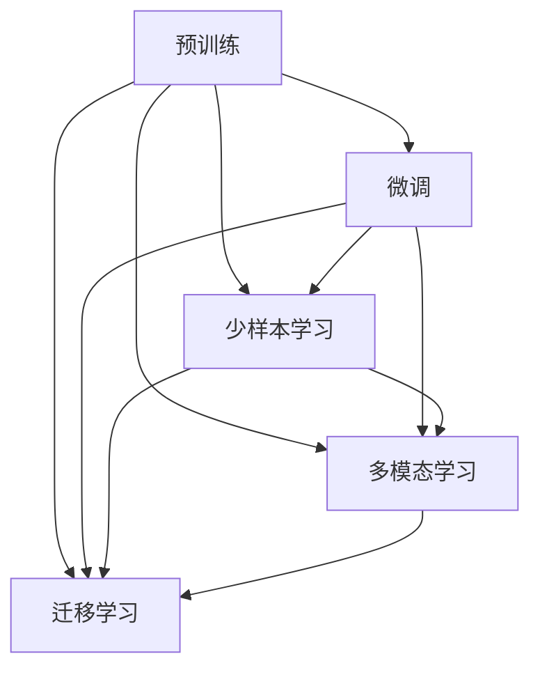

                 

# LLM的语言理解技术发展脉络

> 关键词：语言理解,大语言模型,自然语言处理,NLP,深度学习,预训练,微调,Fine-Tuning

## 1. 背景介绍

### 1.1 问题由来

随着人工智能技术的迅猛发展，自然语言处理(Natural Language Processing, NLP)领域正迎来革命性突破。大语言模型(Large Language Model, LLM)作为NLP技术的最新里程碑，以其强大的语言理解能力和广泛的应用前景，吸引了全球研究者和企业的关注。然而，大语言模型所蕴含的语言知识复杂多样，理解其背后的技术原理和发展脉络，对于深入学习和应用大模型具有重要意义。

### 1.2 问题核心关键点

本节将从几个关键点出发，简要概述大语言模型语言理解技术的发展脉络：

- **大语言模型**：指通过大规模无标签文本预训练，学习通用语言表示的模型，如BERT、GPT系列模型等。
- **预训练**：在大规模无标签文本上自监督学习通用语言表示的过程。
- **微调**：在预训练模型的基础上，通过有标签样本进行特定任务适配的过程。
- **少样本学习**：在大模型基础上，通过设计精巧的输入模板，实现零样本或少样本下的任务推理。
- **多模态学习**：结合图像、音频等多种模态数据，拓展语言模型的理解范围和能力。

这些关键技术，构成了大语言模型理解自然语言的基础。通过理解这些核心技术的发展脉络，我们可以更好地把握大语言模型的演进历程，探索其未来的发展方向。

## 2. 核心概念与联系

### 2.1 核心概念概述

为更好地理解大语言模型的语言理解技术，本节将介绍几个核心概念及其之间的关系：

- **预训练**：指在大规模无标签文本数据上，通过自监督学习任务训练通用语言模型的过程。常见的预训练任务包括掩码语言模型、语言建模等。预训练使得模型学习到语言的通用表示。

- **微调**：指在预训练模型的基础上，使用下游任务的少量标注数据，通过有监督地训练来优化模型在特定任务上的性能。通常只需要调整顶层分类器或解码器，并以较小的学习率更新全部或部分的模型参数。

- **少样本学习**：指在只有少量标注样本的情况下，模型能够快速适应新任务的学习方法。在大语言模型中，通常通过在输入中提供少量示例来实现，无需更新模型参数。

- **多模态学习**：指结合图像、音频、视频等多种模态数据，扩展语言模型的理解和推理能力。多模态学习在自然语言理解、机器翻译、语音识别等领域有着广泛的应用。

- **迁移学习**：指将一个领域学习到的知识，迁移应用到另一个不同但相关的领域的学习范式。大模型的预训练-微调过程即是一种典型的迁移学习方式。

这些核心概念之间的逻辑关系可以通过以下Mermaid流程图来展示：



这个流程图展示了预训练、微调、少样本学习、多模态学习以及迁移学习之间的逻辑关系：

1. 预训练是整个语言模型的基础，学习到通用的语言表示。
2. 微调通过有监督地训练，使得模型能够适应特定任务。
3. 少样本学习利用大模型的预训练知识，在少量标注数据下也能进行任务推理。
4. 多模态学习拓展了语言模型的理解范围，使其能够处理更多类型的数据。
5. 迁移学习将预训练模型在不同领域中进行迁移应用，提升模型泛化能力。

这些核心概念共同构成了大语言模型的语言理解技术框架，使其能够更广泛、更深入地理解和处理自然语言。

## 3. 核心算法原理 & 具体操作步骤
### 3.1 算法原理概述

大语言模型的语言理解技术，主要基于深度学习和预训练-微调框架。其核心思想是：通过大规模预训练学习到通用的语言表示，再通过微调针对特定任务进行优化，使得模型能够准确理解并生成自然语言。

形式化地，假设预训练模型为 $M_{\theta}$，其中 $\theta$ 为预训练得到的模型参数。给定下游任务 $T$ 的标注数据集 $D=\{(x_i, y_i)\}_{i=1}^N$，微调的目标是找到新的模型参数 $\hat{\theta}$，使得：

$$
\hat{\theta}=\mathop{\arg\min}_{\theta} \mathcal{L}(M_{\theta},D)
$$

其中 $\mathcal{L}$ 为针对任务 $T$ 设计的损失函数，用于衡量模型预测输出与真实标签之间的差异。常见的损失函数包括交叉熵损失、均方误差损失等。

通过梯度下降等优化算法，微调过程不断更新模型参数 $\theta$，最小化损失函数 $\mathcal{L}$，使得模型输出逼近真实标签。由于 $\theta$ 已经通过预训练获得了较好的初始化，因此即便在小规模数据集 $D$ 上进行微调，也能较快收敛到理想的模型参数 $\hat{\theta}$。

### 3.2 算法步骤详解

基于深度学习的语言理解模型，通常包含预训练和微调两个主要步骤。以下详细说明这两个步骤的具体操作方法：

#### 3.2.1 预训练步骤

预训练阶段主要在大规模无标签文本数据上，通过自监督学习任务训练通用语言模型。以BERT为例，预训练主要包含以下步骤：

1. **数据准备**：选择大规模无标签文本数据，如维基百科、新闻、小说等。
2. **分词和标记**：对文本进行分词和标记，生成输入序列。
3. **掩码语言模型**：将部分输入序列的词用掩码 [MASK] 替换，模型需预测这些词的正确内容。
4. **语言建模**：模型需预测整个输入序列的概率分布。
5. **模型训练**：使用神经网络架构（如Transformer），在大量数据上进行端到端的训练，最小化损失函数。

通过预训练，模型学习到丰富的语言知识，形成通用的语言表示。这一过程通常需要耗费大量的计算资源和时间，但预训练后的模型具有很强的泛化能力，能够适应多种下游任务。

#### 3.2.2 微调步骤

微调阶段在预训练模型的基础上，使用下游任务的少量标注数据，通过有监督学习优化模型在该任务上的性能。以BERT为例，微调主要包含以下步骤：

1. **任务适配**：根据下游任务类型，设计合适的输出层和损失函数。如分类任务，通常在顶层添加线性分类器和交叉熵损失函数。
2. **设置超参数**：选择合适的优化算法及其参数，如AdamW、SGD等，设置学习率、批大小、迭代轮数等。
3. **执行梯度训练**：将训练集数据分批次输入模型，前向传播计算损失函数。反向传播计算参数梯度，根据设定的优化算法和学习率更新模型参数。
4. **验证集评估**：周期性在验证集上评估模型性能，根据性能指标决定是否触发Early Stopping。
5. **测试集测试**：在测试集上评估微调后模型的性能，对比微调前后的精度提升。

通过微调，模型能够适应特定任务，提升模型在该任务上的性能。由于预训练模型已经学习到丰富的语言知识，微调过程通常需要较小的学习率，以避免破坏预训练权重。同时，通过任务适配层的设计，可以灵活应对不同类型和规模的下游任务。

### 3.3 算法优缺点

基于深度学习的语言理解模型具有以下优点：

1. **语言通用性**：预训练模型学习到通用的语言表示，能够处理多种自然语言任务。
2. **高效微调**：微调过程需要较少的标注数据，计算资源需求相对较小。
3. **性能提升**：通过微调，模型能够在特定任务上获得显著的性能提升。
4. **参数高效性**：可以通过参数高效微调方法，在不增加模型参数量的情况下，实现微调。

同时，该方法也存在以下局限性：

1. **数据依赖**：微调效果很大程度上取决于标注数据的质量和数量，获取高质量标注数据的成本较高。
2. **迁移能力有限**：当目标任务与预训练数据的分布差异较大时，微调的性能提升有限。
3. **可解释性不足**：微调模型通常缺乏可解释性，难以对其推理逻辑进行分析和调试。

尽管存在这些局限性，但就目前而言，基于深度学习的微调方法仍是大语言模型语言理解技术的主流范式。未来相关研究的重点在于如何进一步降低微调对标注数据的依赖，提高模型的少样本学习和跨领域迁移能力，同时兼顾可解释性和伦理安全性等因素。

### 3.4 算法应用领域

基于大语言模型语言理解技术，已经在NLP领域得到了广泛的应用，覆盖了几乎所有常见任务，例如：

- **文本分类**：如情感分析、主题分类、意图识别等。通过微调使模型学习文本-标签映射。
- **命名实体识别**：识别文本中的人名、地名、机构名等特定实体。通过微调使模型掌握实体边界和类型。
- **关系抽取**：从文本中抽取实体之间的语义关系。通过微调使模型学习实体-关系三元组。
- **问答系统**：对自然语言问题给出答案。将问题-答案对作为微调数据，训练模型学习匹配答案。
- **机器翻译**：将源语言文本翻译成目标语言。通过微调使模型学习语言-语言映射。
- **文本摘要**：将长文本压缩成简短摘要。将文章-摘要对作为微调数据，使模型学习抓取要点。
- **对话系统**：使机器能够与人自然对话。将多轮对话历史作为上下文，微调模型进行回复生成。

除了上述这些经典任务外，大语言模型语言理解技术也被创新性地应用到更多场景中，如可控文本生成、常识推理、代码生成、数据增强等，为NLP技术带来了全新的突破。

## 4. 数学模型和公式 & 详细讲解
### 4.1 数学模型构建

在深度学习框架下，语言理解模型的训练和优化通常可以通过损失函数和优化算法来实现。

以BERT为例，其预训练和微调的目标函数分别为：

- **预训练目标函数**：
$$
\mathcal{L}_{pre} = \mathcal{L}_{masked\_lang} + \mathcal{L}_{next\_word} + \mathcal{L}_{sentence\_reconstruction}
$$

其中，$\mathcal{L}_{masked\_lang}$ 为掩码语言模型损失，$\mathcal{L}_{next\_word}$ 为下一个词预测损失，$\mathcal{L}_{sentence\_reconstruction}$ 为句子重构损失。

- **微调目标函数**：
$$
\mathcal{L}_{fine} = \mathcal{L}_{classification} = -\frac{1}{N} \sum_{i=1}^N [y_i \log \hat{y_i} + (1-y_i) \log (1-\hat{y_i})]
$$

其中，$y_i$ 为真实标签，$\hat{y_i}$ 为模型预测的概率分布。

通过最小化上述目标函数，预训练模型可以学习到通用的语言表示，微调模型可以适应特定任务。

### 4.2 公式推导过程

以BERT为例，其掩码语言模型损失的推导如下：

假设有序列 $x=[x_1,x_2,...,x_n]$，模型需预测 [MASK] 对应的词 $x_i$。

假设掩码位置为 $j$，则预测结果为 $\hat{y_j} = softmax(W^H [x_1,...,x_j,...,x_n]^T)$，其中 $W^H$ 为预测头 $W$ 的转置矩阵。

掩码语言模型损失函数定义为：

$$
\mathcal{L}_{masked\_lang} = -\frac{1}{N} \sum_{i=1}^N \log \hat{y_j}
$$

其中 $N$ 为序列长度。

### 4.3 案例分析与讲解

假设模型需预测下一个词 $x_{j+1}$，模型需预测概率分布 $\hat{y}_{j+1} = softmax(W^H [x_1,...,x_j,x_{j+1},...,x_n]^T)$。

下一个词预测损失函数定义为：

$$
\mathcal{L}_{next\_word} = -\frac{1}{N} \sum_{i=1}^N \log \hat{y}_{j+1}
$$

其中 $N$ 为序列长度。

通过以上公式，我们可以更清晰地理解语言理解模型的训练和优化过程。在预训练阶段，模型需预测掩码位置和下一个词，通过最大化预测概率，学习到语言的知识和规律。在微调阶段，模型需预测分类标签，通过最小化分类误差，适应特定任务。

## 5. 项目实践：代码实例和详细解释说明
### 5.1 开发环境搭建

在进行语言理解模型的开发和测试前，需要先准备好开发环境。以下是使用Python进行TensorFlow开发的环境配置流程：

1. 安装Anaconda：从官网下载并安装Anaconda，用于创建独立的Python环境。

2. 创建并激活虚拟环境：
```bash
conda create -n tensorflow-env python=3.8 
conda activate tensorflow-env
```

3. 安装TensorFlow：根据CUDA版本，从官网获取对应的安装命令。例如：
```bash
conda install tensorflow tensorflow-gpu=cuda11.1 -c tf-nightly -c conda-forge
```

4. 安装必要工具包：
```bash
pip install numpy pandas scikit-learn matplotlib tqdm jupyter notebook ipython
```

完成上述步骤后，即可在`tensorflow-env`环境中开始开发和测试。

### 5.2 源代码详细实现

下面我们以BERT模型进行文本分类任务为例，给出使用TensorFlow进行微调的Python代码实现。

首先，定义文本分类的任务适配层：

```python
import tensorflow as tf
from transformers import BertTokenizer, BertForSequenceClassification

tokenizer = BertTokenizer.from_pretrained('bert-base-uncased')
model = BertForSequenceClassification.from_pretrained('bert-base-uncased', num_labels=2)

inputs = tokenizer(text, return_tensors='tf')
with tf.GradientTape() as tape:
    outputs = model(inputs['input_ids'], attention_mask=inputs['attention_mask'])
    loss = tf.keras.losses.sparse_categorical_crossentropy(labels=labels, logits=outputs.logits)
```

然后，定义优化器和训练过程：

```python
optimizer = tf.keras.optimizers.Adam(learning_rate=2e-5)
for epoch in range(epochs):
    with tf.GradientTape() as tape:
        loss = loss
    gradients = tape.gradient(loss, model.trainable_variables)
    optimizer.apply_gradients(zip(gradients, model.trainable_variables))
```

最后，启动训练流程：

```python
epochs = 3
batch_size = 32

for epoch in range(epochs):
    for batch in data:
        input_ids = batch['input_ids']
        attention_mask = batch['attention_mask']
        labels = batch['labels']
        with tf.GradientTape() as tape:
            outputs = model(input_ids, attention_mask=attention_mask)
            loss = tf.keras.losses.sparse_categorical_crossentropy(labels=labels, logits=outputs.logits)
        gradients = tape.gradient(loss, model.trainable_variables)
        optimizer.apply_gradients(zip(gradients, model.trainable_variables))
```

以上就是使用TensorFlow对BERT进行文本分类任务微调的完整代码实现。可以看到，得益于TensorFlow的强大功能，我们可以用相对简洁的代码完成BERT模型的加载和微调。

### 5.3 代码解读与分析

让我们再详细解读一下关键代码的实现细节：

**BertTokenizer和BertForSequenceClassification类**：
- 定义分词器和任务适配层，将文本输入转换为模型所需的格式，并输出分类结果。

**损失函数**：
- 使用Sparse Categorical Cross Entropy损失函数计算模型预测结果与真实标签之间的误差。

**优化器**：
- 使用Adam优化器，设置较小的学习率，更新模型参数。

**训练循环**：
- 循环遍历数据集，在每个批次上计算损失，反向传播更新模型参数。
- 定期在验证集上评估模型性能，防止过拟合。

可以看出，TensorFlow的编程接口非常丰富，可以方便地实现模型的构建、训练和评估。同时，TensorFlow的分布式训练和自动微分功能，也使得模型训练和优化更加高效。

当然，工业级的系统实现还需考虑更多因素，如模型的保存和部署、超参数的自动搜索、更灵活的任务适配层等。但核心的微调范式基本与此类似。

## 6. 实际应用场景
### 6.1 智能客服系统

基于大语言模型的语言理解技术，可以广泛应用于智能客服系统的构建。传统客服往往需要配备大量人力，高峰期响应缓慢，且一致性和专业性难以保证。而使用语言理解模型，可以7x24小时不间断服务，快速响应客户咨询，用自然流畅的语言解答各类常见问题。

在技术实现上，可以收集企业内部的历史客服对话记录，将问题和最佳答复构建成监督数据，在此基础上对预训练语言理解模型进行微调。微调后的语言理解模型能够自动理解用户意图，匹配最合适的答案模板进行回复。对于客户提出的新问题，还可以接入检索系统实时搜索相关内容，动态组织生成回答。如此构建的智能客服系统，能大幅提升客户咨询体验和问题解决效率。

### 6.2 金融舆情监测

金融机构需要实时监测市场舆论动向，以便及时应对负面信息传播，规避金融风险。传统的人工监测方式成本高、效率低，难以应对网络时代海量信息爆发的挑战。基于大语言模型的文本分类和情感分析技术，为金融舆情监测提供了新的解决方案。

具体而言，可以收集金融领域相关的新闻、报道、评论等文本数据，并对其进行主题标注和情感标注。在此基础上对预训练语言理解模型进行微调，使其能够自动判断文本属于何种主题，情感倾向是正面、中性还是负面。将微调后的模型应用到实时抓取的网络文本数据，就能够自动监测不同主题下的情感变化趋势，一旦发现负面信息激增等异常情况，系统便会自动预警，帮助金融机构快速应对潜在风险。

### 6.3 个性化推荐系统

当前的推荐系统往往只依赖用户的历史行为数据进行物品推荐，无法深入理解用户的真实兴趣偏好。基于大语言模型语言理解技术，个性化推荐系统可以更好地挖掘用户行为背后的语义信息，从而提供更精准、多样的推荐内容。

在实践中，可以收集用户浏览、点击、评论、分享等行为数据，提取和用户交互的物品标题、描述、标签等文本内容。将文本内容作为模型输入，用户的后续行为（如是否点击、购买等）作为监督信号，在此基础上微调预训练语言理解模型。微调后的模型能够从文本内容中准确把握用户的兴趣点。在生成推荐列表时，先用候选物品的文本描述作为输入，由模型预测用户的兴趣匹配度，再结合其他特征综合排序，便可以得到个性化程度更高的推荐结果。

### 6.4 未来应用展望

随着大语言模型语言理解技术的发展，其在更多领域的应用前景将更加广阔：

- **智慧医疗**：基于语言理解模型，可以构建智能问诊、病历分析、药物研发等医疗应用，提高诊疗效率和精准度。
- **智能教育**：在教育领域，语言理解模型可以用于作业批改、学情分析、知识推荐等方面，因材施教，促进教育公平，提高教学质量。
- **智慧城市**：在智慧城市治理中，语言理解模型可应用于城市事件监测、舆情分析、应急指挥等环节，提高城市管理的自动化和智能化水平，构建更安全、高效的未来城市。
- **企业生产**：在企业生产中，语言理解模型可以用于智能客服、客户分析、产品推荐等场景，提升企业运营效率和服务质量。

## 7. 工具和资源推荐
### 7.1 学习资源推荐

为了帮助开发者系统掌握大语言模型语言理解技术的发展脉络，这里推荐一些优质的学习资源：

1. 《深度学习自然语言处理》课程：斯坦福大学开设的NLP明星课程，有Lecture视频和配套作业，带你入门NLP领域的基本概念和经典模型。
2. CS224N《自然语言处理与深度学习》：斯坦福大学开设的NLP高级课程，涵盖更多深度学习方法和实践，适合进阶学习。
3. 《Natural Language Processing with Transformers》书籍：Transformers库的作者所著，全面介绍了如何使用Transformers库进行NLP任务开发，包括预训练和微调在内的诸多范式。
4. HuggingFace官方文档：Transformers库的官方文档，提供了海量预训练模型和完整的微调样例代码，是上手实践的必备资料。
5. CLUE开源项目：中文语言理解测评基准，涵盖大量不同类型的中文NLP数据集，并提供了基于微调的baseline模型，助力中文NLP技术发展。

通过对这些资源的学习实践，相信你一定能够全面掌握大语言模型语言理解技术的发展脉络，并用于解决实际的NLP问题。

### 7.2 开发工具推荐

高效的开发离不开优秀的工具支持。以下是几款用于大语言模型语言理解技术开发的常用工具：

1. TensorFlow：基于Python的开源深度学习框架，生产部署方便，适合大规模工程应用。支持多种模型构建和优化方法。
2. PyTorch：基于Python的开源深度学习框架，灵活动态的计算图，适合快速迭代研究。支持多种模型构建和优化方法。
3. Weights & Biases：模型训练的实验跟踪工具，可以记录和可视化模型训练过程中的各项指标，方便对比和调优。
4. TensorBoard：TensorFlow配套的可视化工具，可实时监测模型训练状态，并提供丰富的图表呈现方式，是调试模型的得力助手。
5. HuggingFace Transformers库：提供丰富的预训练语言模型和微调接口，支持多种模型构建和优化方法。

合理利用这些工具，可以显著提升大语言模型语言理解技术的开发效率，加快创新迭代的步伐。

### 7.3 相关论文推荐

大语言模型语言理解技术的发展源于学界的持续研究。以下是几篇奠基性的相关论文，推荐阅读：

1. Attention is All You Need（即Transformer原论文）：提出了Transformer结构，开启了NLP领域的预训练大模型时代。
2. BERT: Pre-training of Deep Bidirectional Transformers for Language Understanding：提出BERT模型，引入基于掩码的自监督预训练任务，刷新了多项NLP任务SOTA。
3. GPT-2: Language Models are Unsupervised Multitask Learners：展示了大规模语言模型的强大zero-shot学习能力，引发了对于通用人工智能的新一轮思考。
4. TextBERT: Pre-training and Fine-tuning Transformers for Multi-task Language Processing：提出TextBERT模型，结合Transformer和BERT的优势，提升了多任务语言处理的能力。
5. T5: Exploring the Limits of Transfer Learning with a Unified Text-to-Text Transformer：提出T5模型，通过统一的文本-文本转化架构，实现了多种NLP任务的零样本和少样本学习。

这些论文代表了大语言模型语言理解技术的发展脉络。通过学习这些前沿成果，可以帮助研究者把握学科前进方向，激发更多的创新灵感。

## 8. 总结：未来发展趋势与挑战

### 8.1 总结

本文对大语言模型语言理解技术的发展脉络进行了全面系统的介绍。首先从预训练和微调两个关键步骤，详细讲解了深度学习语言理解模型的训练和优化过程。其次，通过具体的代码实例和案例分析，展示了语言理解模型在NLP领域的应用场景。最后，从学习资源、开发工具、相关论文等多个角度，推荐了进一步深入学习的资源和工具。

通过本文的系统梳理，可以看到，大语言模型语言理解技术在自然语言处理领域已经取得了重要进展，并且在多个实际应用中得到了广泛应用。未来，随着技术的不断发展和优化，语言理解模型将有望进一步提升其在多模态学习、迁移学习、零样本学习等方面的能力，推动NLP技术向更加智能化、普适化方向迈进。

### 8.2 未来发展趋势

展望未来，大语言模型语言理解技术将呈现以下几个发展趋势：

1. **模型规模增大**：随着算力成本的下降和数据规模的扩张，预训练语言模型的参数量将持续增长。超大规模语言模型蕴含的丰富语言知识，有望支撑更加复杂多变的下游任务微调。
2. **多模态学习兴起**：结合图像、音频、视频等多种模态数据，拓展语言模型的理解和推理能力，提升模型的泛化性和应用范围。
3. **迁移学习深入**：通过在多个领域进行微调，提升模型在不同领域中的迁移能力，促进跨领域的知识共享。
4. **少样本学习突破**：通过设计精巧的输入模板，利用大模型的预训练知识，在更少的标注数据下实现任务推理。
5. **鲁棒性提升**：提升模型对不同领域、不同分布数据的泛化能力，增强模型的鲁棒性和鲁棒性。
6. **可解释性增强**：通过因果分析、博弈论等方法，提升模型输出的可解释性和可理解性，增强用户信任和满意度。

以上趋势凸显了大语言模型语言理解技术的广阔前景。这些方向的探索发展，必将进一步提升模型的性能和应用范围，为NLP技术带来更多的创新和突破。

### 8.3 面临的挑战

尽管大语言模型语言理解技术已经取得了瞩目成就，但在迈向更加智能化、普适化应用的过程中，它仍面临着诸多挑战：

1. **标注数据成本高**：大规模标注数据的获取成本高，且标注数据质量对模型性能影响显著。如何在更少的标注数据下实现良好的微调效果，是一个重要问题。
2. **过拟合问题**：微调过程中，模型容易在少量标注数据下过拟合，导致泛化性能下降。如何平衡模型性能和泛化能力，是一个重要问题。
3. **鲁棒性不足**：模型在不同领域、不同分布数据的泛化能力不足，难以应对复杂的现实场景。如何提升模型的鲁棒性，是一个重要问题。
4. **可解释性差**：模型输出的可解释性不足，难以理解其内部的决策逻辑。如何提升模型的可解释性，是一个重要问题。
5. **伦理和安全性**：模型可能学习到有害信息，产生误导性、歧视性的输出，对社会带来负面影响。如何保证模型的伦理和安全性，是一个重要问题。

### 8.4 研究展望

面对大语言模型语言理解技术所面临的挑战，未来的研究需要在以下几个方面寻求新的突破：

1. **少样本学习和零样本学习**：通过设计精巧的输入模板，利用大模型的预训练知识，在更少的标注数据下实现任务推理。
2. **多模态学习**：结合图像、音频、视频等多种模态数据，拓展语言模型的理解和推理能力，提升模型的泛化性和应用范围。
3. **迁移学习**：通过在多个领域进行微调，提升模型在不同领域中的迁移能力，促进跨领域的知识共享。
4. **鲁棒性提升**：提升模型对不同领域、不同分布数据的泛化能力，增强模型的鲁棒性。
5. **可解释性增强**：通过因果分析、博弈论等方法，提升模型输出的可解释性和可理解性，增强用户信任和满意度。
6. **伦理和安全性**：通过设计合理的训练目标和优化算法，保证模型的伦理和安全性。

这些研究方向的探索，必将引领大语言模型语言理解技术迈向更高的台阶，为构建安全、可靠、可解释、可控的智能系统铺平道路。

## 9. 附录：常见问题与解答

**Q1：大语言模型语言理解技术是否适用于所有NLP任务？**

A: 大语言模型语言理解技术在大多数NLP任务上都能取得不错的效果，特别是对于数据量较小的任务。但对于一些特定领域的任务，如医学、法律等，仅仅依靠通用语料预训练的模型可能难以很好地适应。此时需要在特定领域语料上进一步预训练，再进行微调，才能获得理想效果。此外，对于一些需要时效性、个性化很强的任务，如对话、推荐等，微调方法也需要针对性的改进优化。

**Q2：如何缓解微调过程中的过拟合问题？**

A: 过拟合是微调面临的主要挑战，尤其是在标注数据不足的情况下。常见的缓解策略包括：

1. **数据增强**：通过回译、近义替换等方式扩充训练集。
2. **正则化**：使用L2正则、Dropout、Early Stopping等避免过拟合。
3. **对抗训练**：引入对抗样本，提高模型鲁棒性。
4. **参数高效微调**：只调整少量参数(如Adapter、Prefix等)，减小过拟合风险。
5. **多模型集成**：训练多个微调模型，取平均输出，抑制过拟合。

这些策略往往需要根据具体任务和数据特点进行灵活组合。只有在数据、模型、训练、推理等各环节进行全面优化，才能最大限度地发挥大语言模型语言理解技术的威力。

**Q3：大语言模型语言理解技术在落地部署时需要注意哪些问题？**

A: 将语言理解模型转化为实际应用，还需要考虑以下因素：

1. **模型裁剪**：去除不必要的层和参数，减小模型尺寸，加快推理速度。
2. **量化加速**：将浮点模型转为定点模型，压缩存储空间，提高计算效率。
3. **服务化封装**：将模型封装为标准化服务接口，便于集成调用。
4. **弹性伸缩**：根据请求流量动态调整资源配置，平衡服务质量和成本。
5. **监控告警**：实时采集系统指标，设置异常告警阈值，确保服务稳定性。
6. **安全防护**：采用访问鉴权、数据脱敏等措施，保障数据和模型安全。

大语言模型语言理解技术的应用场景非常广泛，但如何将强大的性能转化为稳定、高效、安全的业务价值，还需要工程实践的不断打磨。只有从数据、算法、工程、业务等多个维度协同发力，才能真正实现人工智能技术在垂直行业的规模化落地。

**Q4：什么是少样本学习和零样本学习？**

A: 少样本学习指在只有少量标注样本的情况下，模型能够快速适应新任务的学习方法。在实际应用中，通常通过在输入中提供少量示例来实现，无需更新模型参数。零样本学习指模型在没有见过任何特定任务的训练样本的情况下，仅凭任务描述就能够执行新任务的能力。大语言模型通过预训练获得的广泛知识，使其能够理解任务指令并生成相应输出。

**Q5：如何提升大语言模型语言理解技术的可解释性？**

A: 提升模型输出的可解释性，可以通过以下几个方法：

1. **因果分析**：通过因果分析方法，识别出模型决策的关键特征，增强输出解释的因果性和逻辑性。
2. **博弈论工具**：借助博弈论工具刻画人机交互过程，主动探索并规避模型的脆弱点，提高系统稳定性。
3. **符号化知识融合**：将符号化的先验知识，如知识图谱、逻辑规则等，与神经网络模型进行巧妙融合，引导微调过程学习更准确、合理的语言模型。

这些方法可以增强模型的可解释性和可理解性，提升用户信任和满意度。

---

作者：禅与计算机程序设计艺术 / Zen and the Art of Computer Programming

