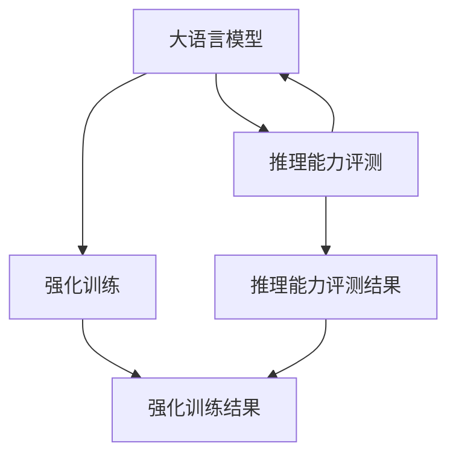

                 

# LLM的逻辑推理能力评测与强化

> 关键词：大语言模型,逻辑推理,推理能力,评测,强化训练,应用场景,数学模型,算法实现

## 1. 背景介绍

### 1.1 问题由来

近年来，随着大语言模型（Large Language Models, LLMs）的发展，其在自然语言处理（Natural Language Processing, NLP）领域的应用取得了显著进展。LLMs能够理解并生成自然语言，在机器翻译、文本生成、问答系统、智能客服等多个领域表现出色。然而，尽管LLMs在诸多任务上已经取得了优异的表现，但在逻辑推理能力上仍存在一定局限，特别是在面对复杂、多步骤推理任务时，容易产生错误或不合理的推断。这不仅影响了其应用效果，也限制了其在解决复杂实际问题上的潜力。

### 1.2 问题核心关键点

逻辑推理能力是指模型能够理解文本中的逻辑关系，并基于这些关系进行正确推理的能力。逻辑推理能力的强弱直接影响模型的表现和适用性。LLMs在推理能力上的不足主要表现在以下几个方面：

1. **事实核查能力不足**：模型往往依赖于预训练数据中的事实信息，对于未知或未见过的信息，无法进行有效的核查和推理。
2. **推理连贯性差**：模型在处理复杂推理任务时，容易出现逻辑跳跃，前后推理不连贯。
3. **多步推理困难**：模型在处理多步推理任务时，往往无法正确识别推理步骤，导致最终推理结果错误。
4. **推理可解释性差**：模型推理过程缺乏可解释性，难以理解其决策依据，增加了应用难度。

### 1.3 问题研究意义

提升大语言模型的逻辑推理能力，对于拓展其在更多领域的应用具有重要意义。逻辑推理能力强的模型能够在复杂的现实问题中提供可靠的决策支持，帮助解决需要深度思考和分析的问题。例如，在医疗领域，逻辑推理能力强的模型可以辅助医生进行病情诊断和治疗方案的选择；在法律领域，可以辅助律师进行案件分析和判决依据的查找。因此，研究如何评测和强化LLMs的逻辑推理能力，对于推动其在实际问题中的应用具有重要价值。

## 2. 核心概念与联系

### 2.1 核心概念概述

为更好地理解LLMs的逻辑推理能力评测与强化，本节将介绍几个密切相关的核心概念：

- **大语言模型**：以自回归（如GPT）或自编码（如BERT）模型为代表的大规模预训练语言模型，通过在大规模无标签文本语料上进行预训练，学习通用的语言表示，具备强大的语言理解和生成能力。
- **逻辑推理**：模型能够理解文本中的逻辑关系，并基于这些关系进行正确推理的能力。
- **推理能力评测**：通过特定的任务和数据集，对模型的推理能力进行量化评估。
- **强化训练**：通过设计有针对性的训练任务和算法，提升模型的推理能力。
- **应用场景**：LLMs在各种实际应用中的推理能力表现。
- **数学模型**：用于推理能力评测和强化训练的数学框架。
- **算法实现**：推理能力评测和强化训练的具体实现方法。

这些核心概念之间的逻辑关系可以通过以下Mermaid流程图来展示：



这个流程图展示了大语言模型的核心概念及其之间的关系：

1. 大语言模型通过预训练获得基础能力。
2. 推理能力评测对模型的推理能力进行量化评估。
3. 强化训练提升模型的推理能力。
4. 应用场景展示模型在实际任务中的推理能力表现。
5. 数学模型和算法实现支撑推理能力评测和强化训练。

这些概念共同构成了LLMs的推理能力评测与强化框架，使其能够在各种复杂任务中发挥强大的逻辑推理能力。通过理解这些核心概念，我们可以更好地把握LLMs的工作原理和优化方向。

## 3. 核心算法原理 & 具体操作步骤
### 3.1 算法原理概述

LLMs的逻辑推理能力评测与强化，本质上是利用有监督或无监督的数据集，对模型的推理能力进行量化评估，并通过特定算法提升模型的推理性能。其核心思想是：通过构建特定的推理任务，使模型在这些任务上表现优异，从而提升其整体推理能力。

形式化地，假设大语言模型为 $M_{\theta}$，其中 $\theta$ 为模型参数。给定推理任务 $T$ 的数据集 $D=\{(x_i, y_i)\}_{i=1}^N$，其中 $x_i$ 为输入文本，$y_i$ 为推理结果。推理能力评测和强化训练的目标是找到最优参数 $\hat{\theta}$，使得模型在推理任务 $T$ 上表现最优：

$$
\hat{\theta}=\mathop{\arg\min}_{\theta} \mathcal{L}(M_{\theta},D)
$$

其中 $\mathcal{L}$ 为推理任务 $T$ 的损失函数，用于衡量模型输出与真实标签之间的差异。常见的损失函数包括交叉熵损失、均方误差损失等。

通过梯度下降等优化算法，推理能力评测和强化训练过程不断更新模型参数 $\theta$，最小化损失函数 $\mathcal{L}$，使得模型输出逼近真实标签。由于 $\theta$ 已经通过预训练获得了较好的初始化，因此即便在推理能力评测和强化训练过程中，也能较快收敛到理想的模型参数 $\hat{\theta}$。

### 3.2 算法步骤详解

基于有监督或无监督的推理能力评测与强化训练一般包括以下几个关键步骤：

**Step 1: 准备推理任务和数据集**
- 选择合适的推理任务 $T$，设计相应的推理任务数据集 $D$，如数学推理题、逻辑游戏、知识推理等。
- 数据集应包含正负样本，用于评测模型的推理能力。

**Step 2: 设计推理能力评测指标**
- 根据任务类型，选择适合的推理能力评测指标，如准确率、召回率、F1分数等。
- 对于多步推理任务，还可以设计推理链条正确率和推理连贯性指标。

**Step 3: 设置强化训练超参数**
- 选择合适的优化算法及其参数，如 AdamW、SGD 等，设置学习率、批大小、迭代轮数等。
- 设置正则化技术及强度，包括权重衰减、Dropout、Early Stopping 等。
- 确定冻结预训练参数的策略，如仅微调顶层，或全部参数都参与微调。

**Step 4: 执行推理能力评测**
- 将推理任务数据集 $D$ 分批次输入模型，前向传播计算推理结果。
- 计算推理结果与真实标签之间的差异，计算推理能力评测指标。
- 周期性在验证集上评估模型推理能力，根据评测结果决定是否触发 Early Stopping。

**Step 5: 执行强化训练**
- 选择推理任务 $T$ 进行强化训练，如选择数学推理题、逻辑游戏、知识推理等。
- 设计有针对性的推理任务数据集 $D_{train}$，如逻辑逆向推理、条件推理、多步推理等。
- 在强化训练数据集上执行梯度训练，更新模型参数。
- 重复上述步骤直至满足预设的迭代轮数或 Early Stopping 条件。

**Step 6: 测试和部署**
- 在测试集上评估强化训练后模型 $M_{\hat{\theta}}$ 的推理能力，对比强化训练前后的推理能力提升。
- 使用强化训练后的模型对新样本进行推理预测，集成到实际的应用系统中。
- 持续收集新的推理任务数据，定期重新微调模型，以适应推理任务的变化。

以上是基于有监督或无监督的推理能力评测与强化训练的一般流程。在实际应用中，还需要针对具体任务的特点，对推理能力评测和强化训练过程的各个环节进行优化设计，如改进推理任务设计，引入更多的正则化技术，搜索最优的超参数组合等，以进一步提升模型推理能力。

### 3.3 算法优缺点

基于推理能力评测与强化训练的方法具有以下优点：
1. 针对性强。通过特定任务和数据集，有针对性地提升模型的推理能力，避免过拟合。
2. 效果显著。在学术界和工业界的诸多任务上，基于推理能力评测与强化训练的方法已经刷新了多项推理性能指标。
3. 可解释性强。强化训练过程直观明确，有助于理解模型的推理逻辑和决策依据。

同时，该方法也存在一定的局限性：
1. 依赖推理任务数据。推理能力评测与强化训练的效果很大程度上取决于推理任务数据的数量和质量。
2. 模型泛化能力有限。当推理任务与预训练数据的分布差异较大时，推理能力评测与强化训练的性能提升有限。
3. 训练成本较高。推理任务数据集的构建和标注需要大量的人力物力，增加了训练成本。

尽管存在这些局限性，但就目前而言，基于推理能力评测与强化训练的方法仍是大语言模型推理能力提升的主流范式。未来相关研究的重点在于如何进一步降低推理能力评测与强化训练对标注数据的依赖，提高模型的少样本学习和跨领域迁移能力，同时兼顾推理能力评测的可解释性和伦理安全性等因素。

### 3.4 算法应用领域

基于大语言模型推理能力评测与强化训练的方法，在推理能力评测与强化训练的应用领域已经得到了广泛的应用，覆盖了诸多任务，例如：

- 数学推理题求解：通过设计数学推理任务，训练模型理解数学逻辑关系，并求解数学问题。
- 逻辑游戏推理：设计逻辑游戏任务，训练模型识别游戏规则和推理链条，进行正确推理。
- 知识推理：利用已知知识库，设计推理任务，训练模型识别推理链条，进行知识推理。
- 医疗诊断：通过设计医学推理任务，训练模型理解医学知识，进行疾病诊断和治疗方案推荐。
- 法律案件分析：设计法律推理任务，训练模型理解法律条款和推理链条，辅助律师进行案件分析和判决依据查找。

除了上述这些经典任务外，大语言模型推理能力评测与强化训练方法还被创新性地应用到更多场景中，如智能客服、金融风险评估、机器人决策等，为推理能力评测与强化训练技术带来了全新的突破。随着推理能力评测与强化训练方法的不断进步，相信推理能力评测与强化训练技术将在更广阔的应用领域大放异彩。

## 4. 数学模型和公式 & 详细讲解
### 4.1 数学模型构建

本节将使用数学语言对基于推理能力评测与强化训练的过程进行更加严格的刻画。

记大语言模型为 $M_{\theta}$，其中 $\theta$ 为模型参数。给定推理任务 $T$ 的推理任务数据集 $D=\{(x_i, y_i)\}_{i=1}^N$，其中 $x_i$ 为输入文本，$y_i$ 为推理结果。假设模型在推理任务 $T$ 上的推理能力评测指标为 $\text{Metric}(T, M_{\theta}, D)$。推理能力评测和强化训练的目标是找到最优参数 $\hat{\theta}$，使得模型在推理任务 $T$ 上表现最优：

$$
\hat{\theta}=\mathop{\arg\min}_{\theta} \mathcal{L}(\text{Metric}(T, M_{\theta}, D))
$$

在实践中，我们通常使用基于梯度的优化算法（如SGD、Adam等）来近似求解上述最优化问题。设 $\eta$ 为学习率，$\lambda$ 为正则化系数，则参数的更新公式为：

$$
\theta \leftarrow \theta - \eta \nabla_{\theta}\mathcal{L}(\text{Metric}(T, M_{\theta}, D)) - \eta\lambda\theta
$$

其中 $\nabla_{\theta}\mathcal{L}(\text{Metric}(T, M_{\theta}, D))$ 为推理能力评测指标对参数 $\theta$ 的梯度，可通过反向传播算法高效计算。

### 4.2 公式推导过程

以下我们以数学推理题求解任务为例，推导推理能力评测指标的梯度计算公式。

假设模型 $M_{\theta}$ 在输入 $x$ 上的推理结果为 $\hat{y}=M_{\theta}(x) \in [0,1]$，表示样本属于推理结果为真的概率。真实标签 $y \in \{0,1\}$。则推理能力评测指标（如准确率）定义为：

$$
\text{Metric}(T, M_{\theta}, D) = \frac{1}{N}\sum_{i=1}^N \text{I}(y_i \neq \hat{y_i})
$$

其中 $\text{I}$ 为指示函数。将其代入推理能力评测目标公式，得：

$$
\hat{\theta}=\mathop{\arg\min}_{\theta} \frac{1}{N}\sum_{i=1}^N \text{I}(y_i \neq \hat{y_i})
$$

根据链式法则，推理能力评测指标对参数 $\theta_k$ 的梯度为：

$$
\frac{\partial \text{Metric}(T, M_{\theta}, D)}{\partial \theta_k} = -\frac{1}{N}\sum_{i=1}^N \frac{\partial \text{I}(y_i \neq \hat{y_i})}{\partial \hat{y_i}} \frac{\partial \hat{y_i}}{\partial \theta_k}
$$

其中 $\frac{\partial \hat{y_i}}{\partial \theta_k}$ 可进一步递归展开，利用自动微分技术完成计算。

在得到推理能力评测指标的梯度后，即可带入参数更新公式，完成模型的迭代优化。重复上述过程直至收敛，最终得到适应推理任务 $T$ 的最优模型参数 $\hat{\theta}$。

## 5. 项目实践：代码实例和详细解释说明
### 5.1 开发环境搭建

在进行推理能力评测与强化训练实践前，我们需要准备好开发环境。以下是使用Python进行PyTorch开发的环境配置流程：

1. 安装Anaconda：从官网下载并安装Anaconda，用于创建独立的Python环境。

2. 创建并激活虚拟环境：
```bash
conda create -n pytorch-env python=3.8 
conda activate pytorch-env
```

3. 安装PyTorch：根据CUDA版本，从官网获取对应的安装命令。例如：
```bash
conda install pytorch torchvision torchaudio cudatoolkit=11.1 -c pytorch -c conda-forge
```

4. 安装TensorFlow：
```bash
conda install tensorflow
```

5. 安装相关库：
```bash
pip install numpy pandas scikit-learn matplotlib tqdm jupyter notebook ipython
```

完成上述步骤后，即可在`pytorch-env`环境中开始推理能力评测与强化训练实践。

### 5.2 源代码详细实现

下面我们以数学推理题求解任务为例，给出使用PyTorch进行推理能力评测与强化训练的代码实现。

首先，定义数学推理任务的数据处理函数：

```python
from transformers import BertTokenizer
from torch.utils.data import Dataset
import torch

class MathTaskDataset(Dataset):
    def __init__(self, texts, labels, tokenizer, max_len=128):
        self.texts = texts
        self.labels = labels
        self.tokenizer = tokenizer
        self.max_len = max_len
        
    def __len__(self):
        return len(self.texts)
    
    def __getitem__(self, item):
        text = self.texts[item]
        label = self.labels[item]
        
        encoding = self.tokenizer(text, return_tensors='pt', max_length=self.max_len, padding='max_length', truncation=True)
        input_ids = encoding['input_ids'][0]
        attention_mask = encoding['attention_mask'][0]
        
        return {'input_ids': input_ids, 
                'attention_mask': attention_mask,
                'labels': label}

# 定义推理任务标签和id的映射
label2id = {0: 'false', 1: 'true'}
id2label = {v: k for k, v in label2id.items()}

# 创建dataset
tokenizer = BertTokenizer.from_pretrained('bert-base-cased')

train_dataset = MathTaskDataset(train_texts, train_labels, tokenizer)
dev_dataset = MathTaskDataset(dev_texts, dev_labels, tokenizer)
test_dataset = MathTaskDataset(test_texts, test_labels, tokenizer)
```

然后，定义模型和优化器：

```python
from transformers import BertForTokenClassification, AdamW

model = BertForTokenClassification.from_pretrained('bert-base-cased', num_labels=2)

optimizer = AdamW(model.parameters(), lr=2e-5)
```

接着，定义训练和评估函数：

```python
from torch.utils.data import DataLoader
from tqdm import tqdm
from sklearn.metrics import classification_report

device = torch.device('cuda') if torch.cuda.is_available() else torch.device('cpu')
model.to(device)

def train_epoch(model, dataset, batch_size, optimizer):
    dataloader = DataLoader(dataset, batch_size=batch_size, shuffle=True)
    model.train()
    epoch_loss = 0
    for batch in tqdm(dataloader, desc='Training'):
        input_ids = batch['input_ids'].to(device)
        attention_mask = batch['attention_mask'].to(device)
        labels = batch['labels'].to(device)
        model.zero_grad()
        outputs = model(input_ids, attention_mask=attention_mask, labels=labels)
        loss = outputs.loss
        epoch_loss += loss.item()
        loss.backward()
        optimizer.step()
    return epoch_loss / len(dataloader)

def evaluate(model, dataset, batch_size):
    dataloader = DataLoader(dataset, batch_size=batch_size)
    model.eval()
    preds, labels = [], []
    with torch.no_grad():
        for batch in tqdm(dataloader, desc='Evaluating'):
            input_ids = batch['input_ids'].to(device)
            attention_mask = batch['attention_mask'].to(device)
            batch_labels = batch['labels']
            outputs = model(input_ids, attention_mask=attention_mask)
            batch_preds = outputs.logits.argmax(dim=2).to('cpu').tolist()
            batch_labels = batch_labels.to('cpu').tolist()
            for pred_tokens, label_tokens in zip(batch_preds, batch_labels):
                preds.append(pred_tokens)
                labels.append(label_tokens)
                
    print(classification_report(labels, preds))
```

最后，启动训练流程并在测试集上评估：

```python
epochs = 5
batch_size = 16

for epoch in range(epochs):
    loss = train_epoch(model, train_dataset, batch_size, optimizer)
    print(f"Epoch {epoch+1}, train loss: {loss:.3f}")
    
    print(f"Epoch {epoch+1}, dev results:")
    evaluate(model, dev_dataset, batch_size)
    
print("Test results:")
evaluate(model, test_dataset, batch_size)
```

以上就是使用PyTorch对BERT模型进行数学推理题求解任务推理能力评测与强化训练的完整代码实现。可以看到，得益于Transformer库的强大封装，我们可以用相对简洁的代码完成BERT模型的加载和推理能力评测与强化训练。

### 5.3 代码解读与分析

让我们再详细解读一下关键代码的实现细节：

**MathTaskDataset类**：
- `__init__`方法：初始化文本、标签、分词器等关键组件。
- `__len__`方法：返回数据集的样本数量。
- `__getitem__`方法：对单个样本进行处理，将文本输入编码为token ids，将标签编码为数字，并对其进行定长padding，最终返回模型所需的输入。

**label2id和id2label字典**：
- 定义了标签与数字id之间的映射关系，用于将推理结果解码回真实的标签。

**训练和评估函数**：
- 使用PyTorch的DataLoader对数据集进行批次化加载，供模型训练和推理使用。
- 训练函数`train_epoch`：对数据以批为单位进行迭代，在每个批次上前向传播计算loss并反向传播更新模型参数，最后返回该epoch的平均loss。
- 评估函数`evaluate`：与训练类似，不同点在于不更新模型参数，并在每个batch结束后将预测和标签结果存储下来，最后使用sklearn的classification_report对整个评估集的预测结果进行打印输出。

**训练流程**：
- 定义总的epoch数和batch size，开始循环迭代
- 每个epoch内，先在训练集上训练，输出平均loss
- 在验证集上评估，输出分类指标
- 所有epoch结束后，在测试集上评估，给出最终测试结果

可以看到，PyTorch配合Transformer库使得BERT微调的代码实现变得简洁高效。开发者可以将更多精力放在数据处理、模型改进等高层逻辑上，而不必过多关注底层的实现细节。

当然，工业级的系统实现还需考虑更多因素，如模型的保存和部署、超参数的自动搜索、更灵活的任务适配层等。但核心的推理能力评测与强化训练范式基本与此类似。

## 6. 实际应用场景
### 6.1 医疗诊断

基于大语言模型的推理能力评测与强化训练，可以实现对医疗诊断任务的辅助。传统医疗诊断往往依赖于医生的专业知识和经验，耗时长且误诊率高。通过构建医学推理任务数据集，并对BERT模型进行推理能力评测与强化训练，可以辅助医生进行疾病诊断和治疗方案推荐。

具体而言，可以收集大量医学病例和相关症状数据，标注出每种症状对应的疾病类型。将数据输入模型，进行推理能力评测与强化训练，使得模型能够从症状到疾病之间建立稳定因果关系，并生成合理的诊断结果。在实际应用中，医生可以输入病人的症状描述，模型自动推荐可能的疾病类型，并给出详细的诊断建议。

### 6.2 法律案件分析

在法律领域，推理能力评测与强化训练同样具有重要应用。法律案件分析需要律师根据法律条文和判例进行推理，找出对案件判决有关键影响的要素。通过构建法律推理任务数据集，并对BERT模型进行推理能力评测与强化训练，可以辅助律师进行案件分析和判决依据查找。

具体而言，可以收集大量法律条文和判例数据，标注出对案件判决有影响的要素。将数据输入模型，进行推理能力评测与强化训练，使得模型能够从法律条文到案件判决之间建立稳定因果关系，并生成合理的判决建议。在实际应用中，律师可以根据案件细节输入模型，模型自动推荐判决依据，并提供详细的法律分析报告。

### 6.3 金融风险评估

金融风险评估需要金融机构实时监测市场舆情，评估不同金融产品的风险水平。传统的金融风险评估依赖于复杂的数学模型和人工分析，成本高且效率低。通过构建金融风险推理任务数据集，并对BERT模型进行推理能力评测与强化训练，可以辅助金融机构进行风险评估。

具体而言，可以收集大量金融市场数据和相关新闻，标注出每种金融产品对应的风险水平。将数据输入模型，进行推理能力评测与强化训练，使得模型能够从市场舆情到金融产品风险之间建立稳定因果关系，并生成合理的风险评估报告。在实际应用中，金融机构可以实时输入市场舆情和金融产品数据，模型自动生成风险评估报告，帮助决策者规避潜在风险。

### 6.4 未来应用展望

随着大语言模型推理能力评测与强化训练方法的发展，其在更多领域的应用将更加广泛。

在智慧医疗领域，推理能力评测与强化训练的模型可以辅助医生进行复杂疾病的诊断和治疗方案推荐，提升医疗服务的智能化水平。

在智能教育领域，推理能力评测与强化训练的模型可以用于个性化教学和智能题库设计，因材施教，提高教学质量。

在智慧城市治理中，推理能力评测与强化训练的模型可以用于城市事件监测、舆情分析、应急指挥等环节，提高城市管理的自动化和智能化水平，构建更安全、高效的未来城市。

此外，在企业生产、社会治理、文娱传媒等众多领域，推理能力评测与强化训练的模型将不断涌现，为各行业带来新的智能化解决方案。相信随着推理能力评测与强化训练方法的不断进步，其应用将更加深入和广泛。

## 7. 工具和资源推荐
### 7.1 学习资源推荐

为了帮助开发者系统掌握大语言模型推理能力评测与强化训练的理论基础和实践技巧，这里推荐一些优质的学习资源：

1. 《Transformer从原理到实践》系列博文：由大模型技术专家撰写，深入浅出地介绍了Transformer原理、BERT模型、推理能力评测与强化训练等前沿话题。

2. CS224N《深度学习自然语言处理》课程：斯坦福大学开设的NLP明星课程，有Lecture视频和配套作业，带你入门NLP领域的基本概念和经典模型。

3. 《Natural Language Processing with Transformers》书籍：Transformers库的作者所著，全面介绍了如何使用Transformers库进行NLP任务开发，包括推理能力评测与强化训练在内的诸多范式。

4. HuggingFace官方文档：Transformers库的官方文档，提供了海量预训练模型和完整的推理能力评测与强化训练样例代码，是上手实践的必备资料。

5. CLUE开源项目：中文语言理解测评基准，涵盖大量不同类型的中文NLP数据集，并提供了基于推理能力评测与强化训练的baseline模型，助力中文NLP技术发展。

通过对这些资源的学习实践，相信你一定能够快速掌握大语言模型推理能力评测与强化训练的精髓，并用于解决实际的NLP问题。
###  7.2 开发工具推荐

高效的开发离不开优秀的工具支持。以下是几款用于大语言模型推理能力评测与强化训练开发的常用工具：

1. PyTorch：基于Python的开源深度学习框架，灵活动态的计算图，适合快速迭代研究。大部分预训练语言模型都有PyTorch版本的实现。

2. TensorFlow：由Google主导开发的开源深度学习框架，生产部署方便，适合大规模工程应用。同样有丰富的预训练语言模型资源。

3. Transformers库：HuggingFace开发的NLP工具库，集成了众多SOTA语言模型，支持PyTorch和TensorFlow，是进行推理能力评测与强化训练开发的利器。

4. Weights & Biases：模型训练的实验跟踪工具，可以记录和可视化模型训练过程中的各项指标，方便对比和调优。与主流深度学习框架无缝集成。

5. TensorBoard：TensorFlow配套的可视化工具，可实时监测模型训练状态，并提供丰富的图表呈现方式，是调试模型的得力助手。

6. Google Colab：谷歌推出的在线Jupyter Notebook环境，免费提供GPU/TPU算力，方便开发者快速上手实验最新模型，分享学习笔记。

合理利用这些工具，可以显著提升大语言模型推理能力评测与强化训练任务的开发效率，加快创新迭代的步伐。

### 7.3 相关论文推荐

大语言模型推理能力评测与强化训练的发展源于学界的持续研究。以下是几篇奠基性的相关论文，推荐阅读：

1. Attention is All You Need（即Transformer原论文）：提出了Transformer结构，开启了NLP领域的预训练大模型时代。

2. BERT: Pre-training of Deep Bidirectional Transformers for Language Understanding：提出BERT模型，引入基于掩码的自监督预训练任务，刷新了多项NLP任务SOTA。

3. Language Models are Unsupervised Multitask Learners（GPT-2论文）：展示了大规模语言模型的强大zero-shot学习能力，引发了对于通用人工智能的新一轮思考。

4. Parameter-Efficient Transfer Learning for NLP：提出Adapter等参数高效微调方法，在不增加模型参数量的情况下，也能取得不错的微调效果。

5. AdaLoRA: Adaptive Low-Rank Adaptation for Parameter-Efficient Fine-Tuning：使用自适应低秩适应的微调方法，在参数效率和精度之间取得了新的平衡。

6. Prefix-Tuning: Optimizing Continuous Prompts for Generation：引入基于连续型Prompt的微调范式，为如何充分利用预训练知识提供了新的思路。

这些论文代表了大语言模型推理能力评测与强化训练的发展脉络。通过学习这些前沿成果，可以帮助研究者把握学科前进方向，激发更多的创新灵感。

## 8. 总结：未来发展趋势与挑战
### 8.1 总结

本文对基于推理能力评测与强化训练的大语言模型推理能力提升方法进行了全面系统的介绍。首先阐述了大语言模型和推理能力评测与强化训练的研究背景和意义，明确了推理能力评测与强化训练在提升预训练模型性能、拓展预训练模型应用方面的独特价值。其次，从原理到实践，详细讲解了推理能力评测与强化训练的数学原理和关键步骤，给出了推理能力评测与强化训练任务开发的完整代码实例。同时，本文还广泛探讨了推理能力评测与强化训练方法在多个实际应用场景中的应用前景，展示了推理能力评测与强化训练范式的巨大潜力。

通过本文的系统梳理，可以看到，基于推理能力评测与强化训练的方法正在成为大语言模型推理能力提升的重要范式，极大地拓展了预训练语言模型的应用边界，催生了更多的落地场景。受益于大规模语料的预训练，推理能力评测与强化训练的模型以更低的时间和标注成本，在小样本条件下也能取得理想的推理效果，有力推动了NLP技术的产业化进程。未来，伴随推理能力评测与强化训练方法的不断进步，相信大语言模型推理能力将在更广阔的应用领域大放异彩，深刻影响人类的生产生活方式。

### 8.2 未来发展趋势

展望未来，大语言模型推理能力评测与强化训练技术将呈现以下几个发展趋势：

1. 模型规模持续增大。随着算力成本的下降和数据规模的扩张，预训练语言模型的参数量还将持续增长。超大规模语言模型蕴含的丰富语言知识，有望支撑更加复杂多变的推理任务。

2. 推理能力评测与强化训练方法日趋多样。除了传统的全参数微调外，未来会涌现更多参数高效的推理能力评测与强化训练方法，如Prefix-Tuning、LoRA等，在节省计算资源的同时也能保证推理性能。

3. 持续学习成为常态。随着数据分布的不断变化，推理能力评测与强化训练模型也需要持续学习新知识以保持性能。如何在不遗忘原有知识的同时，高效吸收新样本信息，将成为重要的研究课题。

4. 标注样本需求降低。受启发于提示学习(Prompt-based Learning)的思路，未来的推理能力评测与强化训练方法将更好地利用大模型的语言理解能力，通过更加巧妙的任务描述，在更少的标注样本上也能实现理想的推理能力提升。

5. 推理能力评测的可解释性增强。推理能力评测与强化训练过程直观明确，有助于理解模型的推理逻辑和决策依据。未来将有更多研究致力于提高推理能力评测的可解释性和可理解性。

6. 推理能力评测与强化训练的跨领域迁移能力提升。推理能力评测与强化训练模型将不再局限于特定领域的推理任务，通过知识迁移，能够在多个领域内进行高效推理。

以上趋势凸显了大语言模型推理能力评测与强化训练技术的广阔前景。这些方向的探索发展，必将进一步提升推理能力评测与强化训练模型的推理能力，为构建人机协同的智能系统提供更强的推理支持。

### 8.3 面临的挑战

尽管大语言模型推理能力评测与强化训练方法已经取得了瞩目成就，但在迈向更加智能化、普适化应用的过程中，它仍面临着诸多挑战：

1. 推理任务数据依赖。推理能力评测与强化训练的效果很大程度上取决于推理任务数据的数量和质量。高质量推理任务数据的获取和标注成本较高。

2. 推理能力评测的可解释性不足。推理能力评测与强化训练的模型推理过程缺乏可解释性，难以理解其决策依据，增加了应用难度。

3. 推理能力评测与强化训练的跨领域迁移能力有限。当推理任务与预训练数据的分布差异较大时，推理能力评测与强化训练的性能提升有限。

4. 推理能力评测与强化训练的泛化能力不足。推理能力评测与强化训练的模型在推理能力评测数据集以外的推理任务上，泛化能力较弱。

尽管存在这些挑战，但就目前而言，基于推理能力评测与强化训练的方法仍是大语言模型推理能力提升的主流范式。未来相关研究的重点在于如何进一步降低推理能力评测与强化训练对标注数据的依赖，提高模型的少样本学习和跨领域迁移能力，同时兼顾推理能力评测的可解释性和伦理安全性等因素。

### 8.4 研究展望

面对大语言模型推理能力评测与强化训练所面临的种种挑战，未来的研究需要在以下几个方面寻求新的突破：

1. 探索无监督和半监督推理能力评测与强化训练方法。摆脱对大规模标注数据的依赖，利用自监督学习、主动学习等无监督和半监督范式，最大限度利用非结构化数据，实现更加灵活高效的推理能力评测与强化训练。

2. 研究参数高效和计算高效的推理能力评测与强化训练范式。开发更加参数高效的推理能力评测与强化训练方法，在固定大部分预训练参数的同时，只更新极少量的任务相关参数。同时优化推理能力评测与强化训练模型的计算图，减少前向传播和反向传播的资源消耗，实现更加轻量级、实时性的部署。

3. 引入更多先验知识。将符号化的先验知识，如知识图谱、逻辑规则等，与神经网络模型进行巧妙融合，引导推理能力评测与强化训练过程学习更准确、合理的语言模型。同时加强不同模态数据的整合，实现视觉、语音等多模态信息与文本信息的协同建模。

4. 结合因果分析和博弈论工具。将因果分析方法引入推理能力评测与强化训练模型，识别出模型决策的关键特征，增强输出解释的因果性和逻辑性。借助博弈论工具刻画人机交互过程，主动探索并规避模型的脆弱点，提高系统稳定性。

5. 纳入伦理道德约束。在推理能力评测与强化训练目标中引入伦理导向的评估指标，过滤和惩罚有偏见、有害的输出倾向。同时加强人工干预和审核，建立模型行为的监管机制，确保输出符合人类价值观和伦理道德。

这些研究方向的探索，必将引领大语言模型推理能力评测与强化训练技术迈向更高的台阶，为构建安全、可靠、可解释、可控的智能系统铺平道路。面向未来，大语言模型推理能力评测与强化训练技术还需要与其他人工智能技术进行更深入的融合，如知识表示、因果推理、强化学习等，多路径协同发力，共同推动自然语言理解和智能交互系统的进步。只有勇于创新、敢于突破，才能不断拓展语言模型的边界，让智能技术更好地造福人类社会。

## 9. 附录：常见问题与解答

**Q1：大语言模型推理能力不足的原因是什么？**

A: 大语言模型推理能力不足的主要原因包括：
1. 事实核查能力不足：模型依赖于预训练数据中的事实信息，对于未知或未见过的信息，无法进行有效的核查和推理。
2. 推理连贯性差：模型在处理复杂推理任务时，容易出现逻辑跳跃，前后推理不连贯。
3. 多步推理困难：模型在处理多步推理任务时，往往无法正确识别推理步骤，导致最终推理结果错误。
4. 推理可解释性差：模型推理过程缺乏可解释性，难以理解其决策依据。

**Q2：如何提升大语言模型的推理能力？**

A: 提升大语言模型的推理能力需要从多个方面入手：
1. 数据增强：通过回译、近义替换等方式扩充训练集，提高模型对未知信息的核查能力。
2. 正则化技术：使用L2正则、Dropout、Early Stopping等防止过拟合，提高模型泛化能力。
3. 多步推理模型：引入多步推理模型，如Seq2Seq、Seq2Seq+Attention等，增强模型的多步推理能力。
4. 推理链条优化：设计推理链条优化算法，如StructOpt、CRLF等，提高模型的推理连贯性。
5. 可解释性增强：引入可解释性增强方法，如LIME、SHAP等，提高模型的可解释性和透明度。

**Q3：推理能力评测与强化训练需要哪些资源？**

A: 推理能力评测与强化训练需要以下资源：
1. 推理任务数据集：包含大量推理任务的正负样本，用于评测和训练。
2. 推理任务标签和id映射表：用于将推理结果解码为标签。
3. 计算资源：如GPU/TPU等高性能设备，用于模型训练和推理。
4. 工具库：如TensorFlow、PyTorch等深度学习框架，用于模型实现和优化。
5. 实验跟踪工具：如Weights & Biases、TensorBoard等，用于模型训练过程的跟踪和调试。

**Q4：推理能力评测与强化训练在实际应用中有哪些挑战？**

A: 推理能力评测与强化训练在实际应用中面临以下挑战：
1. 推理任务数据依赖：高质量推理任务数据的获取和标注成本较高，依赖推理任务数据。
2. 推理能力评测的可解释性不足：推理能力评测与强化训练的模型推理过程缺乏可解释性，难以理解其决策依据。
3. 推理能力评测与强化训练的跨领域迁移能力有限：当推理任务与预训练数据的分布差异较大时，推理能力评测与强化训练的性能提升有限。
4. 推理能力评测与强化训练的泛化能力不足：推理能力评测与强化训练的模型在推理能力评测数据集以外的推理任务上，泛化能力较弱。

尽管存在这些挑战，但就目前而言，基于推理能力评测与强化训练的方法仍是大语言模型推理能力提升的主流范式。未来相关研究的重点在于如何进一步降低推理能力评测与强化训练对标注数据的依赖，提高模型的少样本学习和跨领域迁移能力，同时兼顾推理能力评测的可解释性和伦理安全性等因素。

---

作者：禅与计算机程序设计艺术 / Zen and the Art of Computer Programming

