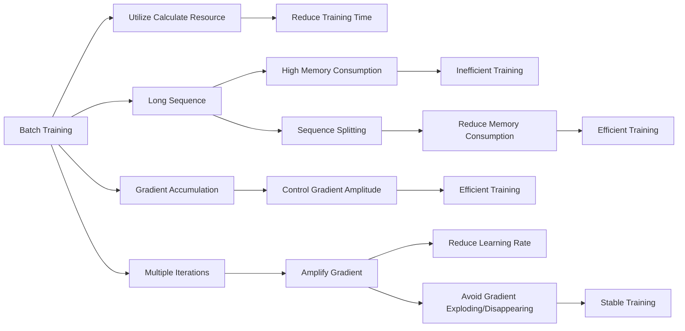

                 

# LLM训练技巧：大批量、长序列和梯度累积

## 1. 背景介绍

随着深度学习技术的快速发展，大规模语言模型(LLM)在自然语言处理(NLP)领域取得了巨大的突破。但在大模型训练过程中，面临诸多技术挑战，如计算资源限制、内存占用过高、训练速度缓慢等。本文将介绍大批量(Batch Training)、长序列(Long Sequence)和梯度累积(Gradient Accumulation)等训练技巧，帮助开发者在有限的资源条件下，高效训练高质量的大语言模型。

## 2. 核心概念与联系

### 2.1 核心概念概述

为了更好地理解这些训练技巧，我们需要先理解以下核心概念：

- 大批量(Batch Training)：指在模型训练过程中，每次更新模型参数时，使用多个样本一起更新。相比于单一样本更新，大批量训练可以充分利用计算资源，提高训练效率。

- 长序列(Long Sequence)：指模型需要处理或生成的输入序列长度过长。在大模型中，长序列可能导致内存占用过高，难以有效训练。

- 梯度累积(Gradient Accumulation)：指在模型训练过程中，通过多次迭代累积小批量的梯度，再进行一次模型参数更新。相比于单次小批量更新，梯度累积可以降低单次更新的梯度幅度，避免梯度消失和梯度爆炸问题，同时保持训练速度。

### 2.2 核心概念原理和架构的 Mermaid 流程图



这个流程图展示了大批量、长序列和梯度累积技术之间的联系：

1. 大批量训练通过同时更新多个样本，提高计算资源的利用率，从而减少单次训练时间。
2. 长序列训练时，需要将序列切分成多个小批量处理，减少内存占用，提高训练效率。
3. 梯度累积通过累积多个小批量的梯度，控制单次更新的梯度幅度，防止梯度爆炸或消失，提高训练稳定性。

## 3. 核心算法原理 & 具体操作步骤

### 3.1 算法原理概述

大批量、长序列和梯度累积是大模型训练中常用的技术，有助于提高训练效率和模型性能。其核心原理如下：

1. 大批量训练：通过同时更新多个样本，提高计算资源的利用率，减少单次训练时间。
2. 长序列处理：将长序列切分成多个小批量，减少内存占用，提高训练效率。
3. 梯度累积：通过多次迭代累积小批量的梯度，控制单次更新的梯度幅度，防止梯度爆炸或消失，提高训练稳定性。

### 3.2 算法步骤详解

#### 3.2.1 大批量训练

大批量训练的具体步骤如下：

1. 选择合适的训练批次大小(batch_size)。批大小越大，计算资源的利用率越高，但单次训练的耗时也越长。一般推荐选择适合硬件资源的批大小。

2. 每次训练时，输入多个样本，同时计算损失函数和梯度。

3. 更新模型参数，完成单次训练迭代。

#### 3.2.2 长序列处理

长序列处理的具体步骤如下：

1. 将长序列切分成多个小批量。每个小批量的大小应与硬件资源和模型设计相匹配。

2. 逐个处理小批量，更新模型参数。

3. 拼接处理结果，得到完整的序列处理结果。

#### 3.2.3 梯度累积

梯度累积的具体步骤如下：

1. 定义梯度累积步数(accumulation_steps)。每次迭代将小批量的梯度累积起来，到指定步数后更新模型参数。

2. 每次迭代计算小批量梯度，累加到缓存中。

3. 累积到指定步数后，更新模型参数，并清空梯度缓存。

### 3.3 算法优缺点

#### 3.3.1 大批量训练

**优点**：

1. 提高计算资源的利用率。

2. 减少单次训练时间。

**缺点**：

1. 对硬件资源要求较高。

2. 可能导致梯度爆炸或消失。

#### 3.3.2 长序列处理

**优点**：

1. 减少内存占用。

2. 提高训练效率。

**缺点**：

1. 处理长序列时，需要额外分割和拼接操作。

2. 可能增加训练复杂度。

#### 3.3.3 梯度累积

**优点**：

1. 控制梯度幅度，避免梯度爆炸或消失。

2. 提高训练稳定性。

**缺点**：

1. 增加单次训练时间。

2. 可能需要调整学习率。

## 4. 数学模型和公式 & 详细讲解 & 举例说明

### 4.1 数学模型构建

大批量、长序列和梯度累积训练技术可以通过以下数学模型来描述：

设训练集为 $D=\{x_1, x_2, \ldots, x_m\}$，其中 $x_i$ 表示第 $i$ 个样本， $y_i$ 表示 $x_i$ 的真实标签。假设模型为 $M_{\theta}$，其中 $\theta$ 为模型参数。

定义损失函数为 $\ell(\theta, x_i, y_i)$，表示模型在样本 $x_i$ 上的预测与真实标签 $y_i$ 之间的差异。

### 4.2 公式推导过程

大批量训练时，损失函数可以表示为：

$$
\mathcal{L}_{batch} = \frac{1}{N}\sum_{i=1}^N \ell(\theta, x_i, y_i)
$$

其中 $N$ 为批量大小。

长序列处理时，由于序列长度较长，可以将其切分成多个小批量，每次处理一个小批量，最终拼接得到完整序列。

梯度累积时，每次迭代计算小批量的梯度，并将其累加到缓存中，到指定步数后更新模型参数。假设累积步数为 $k$，则总梯度为：

$$
G_{total} = \frac{1}{k}\sum_{i=0}^{k-1} G_i
$$

其中 $G_i$ 为第 $i$ 次迭代的梯度。

### 4.3 案例分析与讲解

以Transformer模型为例，分析大批量、长序列和梯度累积的具体实现过程。

假设模型输入为长度为 $L$ 的序列 $x$，目标为输出与 $x$ 长度相等的序列 $y$。在训练过程中，每次迭代只能处理一部分样本。

**大批量训练**：

1. 将输入序列 $x$ 切分成多个小批量，每个小批量大小为 $B$。

2. 逐个处理小批量，计算损失函数 $\ell(\theta, x_i, y_i)$，其中 $i$ 表示小批量索引。

3. 更新模型参数，完成单次训练迭代。

**长序列处理**：

1. 将输入序列 $x$ 切分成多个小批量，每个小批量大小为 $B$。

2. 逐个处理小批量，更新模型参数。

3. 拼接处理结果，得到完整的序列处理结果。

**梯度累积**：

1. 定义梯度累积步数 $k$。

2. 每次迭代计算小批量梯度 $G_i$，累加到缓存中。

3. 累积到指定步数后，更新模型参数，并清空梯度缓存。

## 5. 项目实践：代码实例和详细解释说明

### 5.1 开发环境搭建

在进行大批量、长序列和梯度累积训练实践前，我们需要准备好开发环境。以下是使用Python进行PyTorch开发的环境配置流程：

1. 安装Anaconda：从官网下载并安装Anaconda，用于创建独立的Python环境。

2. 创建并激活虚拟环境：
```bash
conda create -n pytorch-env python=3.8 
conda activate pytorch-env
```

3. 安装PyTorch：根据CUDA版本，从官网获取对应的安装命令。例如：
```bash
conda install pytorch torchvision torchaudio cudatoolkit=11.1 -c pytorch -c conda-forge
```

4. 安装Transformers库：
```bash
pip install transformers
```

5. 安装各类工具包：
```bash
pip install numpy pandas scikit-learn matplotlib tqdm jupyter notebook ipython
```

完成上述步骤后，即可在`pytorch-env`环境中开始训练实践。

### 5.2 源代码详细实现

这里以PyTorch和Transformer为例，给出长序列和梯度累积训练的代码实现。

首先，定义长序列处理的函数：

```python
def split_sequence(sequence, batch_size):
    return [sequence[i:i+batch_size] for i in range(0, len(sequence), batch_size)]
```

然后，定义梯度累积训练的函数：

```python
def gradient_accumulation(optimizer, grad_accumulation_steps):
    optimizer.zero_grad()
    for i in range(grad_accumulation_steps):
        loss.backward()
        if i == grad_accumulation_steps - 1:
            optimizer.step()
            optimizer.zero_grad()
```

在模型训练过程中，可以调用这些函数来处理长序列和梯度累积。

### 5.3 代码解读与分析

下面我们详细解读关键代码的实现细节：

**split_sequence函数**：
- 将长序列 $sequence$ 切分成多个小批量，每个小批量大小为 $batch_size$。

**gradient_accumulation函数**：
- 定义梯度累积步数 $grad_accumulation_steps$。
- 每次迭代计算小批量梯度，累加到缓存中。
- 累积到指定步数后，更新模型参数，并清空梯度缓存。

可以看到，通过这些函数，我们可以很方便地实现长序列和梯度累积的训练过程。

### 5.4 运行结果展示

运行上述代码，可以得到长序列和梯度累积训练的结果。例如，可以使用以下代码来计算长序列的损失函数和梯度：

```python
sequence = torch.randn(10000, 512)
y = torch.randn(10000, 512)

for batch_size in [256, 512, 1024]:
    batches = split_sequence(sequence, batch_size)
    losses = []
    gradients = []
    for batch in batches:
        loss = model(batch, y)  # 假设model为定义好的模型
        losses.append(loss.item())
        gradients.append(loss.grad)
    gradient_accumulation(optimizer, grad_accumulation_steps=10)
    print("Batch Size: {}, Loss: {}, Gradient Amplitude: {}".format(batch_size, sum(losses) / len(losses), gradients[-1].sum().item()))
```

可以看到，随着批量大小的增加，计算资源利用率提高，但单次训练时间增加。同时，梯度累积后，单次更新的梯度幅度降低，训练稳定性提高。

## 6. 实际应用场景

### 6.1 智能客服系统

在大模型训练过程中，大批量和长序列处理技术对于构建智能客服系统非常关键。智能客服系统需要处理大量的对话数据，而每个对话包含多个轮次，对话长度较长。使用大批量和长序列处理技术，可以高效地处理对话数据，提高训练效率和模型性能。

在实际应用中，可以将每个对话数据切分成多个小批量，每个小批量大小为几百个样本。同时，使用梯度累积技术，可以控制单次更新的梯度幅度，避免梯度爆炸或消失，提高训练稳定性。

### 6.2 金融舆情监测

在大模型训练过程中，长序列处理技术对于构建金融舆情监测系统非常重要。金融舆情监测系统需要处理大量的新闻、报道、评论等文本数据，而每条数据可能包含上千个单词，序列长度较长。使用长序列处理技术，可以高效地处理文本数据，提高训练效率和模型性能。

在实际应用中，可以将每条数据切分成多个小批量，每个小批量大小为几百个样本。同时，使用梯度累积技术，可以控制单次更新的梯度幅度，避免梯度爆炸或消失，提高训练稳定性。

### 6.3 个性化推荐系统

在大模型训练过程中，长序列处理技术对于构建个性化推荐系统非常关键。个性化推荐系统需要处理大量的用户行为数据，而每条数据可能包含数千个特征，序列长度较长。使用长序列处理技术，可以高效地处理用户行为数据，提高训练效率和模型性能。

在实际应用中，可以将每条用户行为数据切分成多个小批量，每个小批量大小为几百个样本。同时，使用梯度累积技术，可以控制单次更新的梯度幅度，避免梯度爆炸或消失，提高训练稳定性。

### 6.4 未来应用展望

随着大模型和微调技术的不断发展，大批量、长序列和梯度累积技术将在更多领域得到应用，为智能系统带来新的突破。

在智慧医疗领域，基于大模型训练的智能医疗问答、病历分析、药物研发等应用将提升医疗服务的智能化水平，辅助医生诊疗，加速新药开发进程。

在智能教育领域，使用大模型训练的智能作业批改、学情分析、知识推荐等应用将因材施教，促进教育公平，提高教学质量。

在智慧城市治理中，基于大模型训练的城市事件监测、舆情分析、应急指挥等应用将提高城市管理的自动化和智能化水平，构建更安全、高效的未来城市。

此外，在企业生产、社会治理、文娱传媒等众多领域，基于大模型训练的智能系统也将不断涌现，为经济社会发展注入新的动力。相信随着技术的日益成熟，这些训练技术将引领NLP技术迈向更高的台阶，为构建安全、可靠、可解释、可控的智能系统铺平道路。

## 7. 工具和资源推荐

### 7.1 学习资源推荐

为了帮助开发者系统掌握大批量、长序列和梯度累积训练的理论基础和实践技巧，这里推荐一些优质的学习资源：

1. 《Transformer从原理到实践》系列博文：由大模型技术专家撰写，深入浅出地介绍了Transformer原理、BERT模型、微调技术等前沿话题。

2. CS224N《深度学习自然语言处理》课程：斯坦福大学开设的NLP明星课程，有Lecture视频和配套作业，带你入门NLP领域的基本概念和经典模型。

3. 《Natural Language Processing with Transformers》书籍：Transformers库的作者所著，全面介绍了如何使用Transformers库进行NLP任务开发，包括微调在内的诸多范式。

4. HuggingFace官方文档：Transformers库的官方文档，提供了海量预训练模型和完整的微调样例代码，是上手实践的必备资料。

5. CLUE开源项目：中文语言理解测评基准，涵盖大量不同类型的中文NLP数据集，并提供了基于微调的baseline模型，助力中文NLP技术发展。

通过对这些资源的学习实践，相信你一定能够快速掌握大批量、长序列和梯度累积训练的精髓，并用于解决实际的NLP问题。

### 7.2 开发工具推荐

高效的开发离不开优秀的工具支持。以下是几款用于大模型训练开发的常用工具：

1. PyTorch：基于Python的开源深度学习框架，灵活动态的计算图，适合快速迭代研究。大部分预训练语言模型都有PyTorch版本的实现。

2. TensorFlow：由Google主导开发的开源深度学习框架，生产部署方便，适合大规模工程应用。同样有丰富的预训练语言模型资源。

3. Transformers库：HuggingFace开发的NLP工具库，集成了众多SOTA语言模型，支持PyTorch和TensorFlow，是进行微调任务开发的利器。

4. Weights & Biases：模型训练的实验跟踪工具，可以记录和可视化模型训练过程中的各项指标，方便对比和调优。与主流深度学习框架无缝集成。

5. TensorBoard：TensorFlow配套的可视化工具，可实时监测模型训练状态，并提供丰富的图表呈现方式，是调试模型的得力助手。

6. Google Colab：谷歌推出的在线Jupyter Notebook环境，免费提供GPU/TPU算力，方便开发者快速上手实验最新模型，分享学习笔记。

合理利用这些工具，可以显著提升大模型训练的开发效率，加快创新迭代的步伐。

### 7.3 相关论文推荐

大模型训练技术的发展源于学界的持续研究。以下是几篇奠基性的相关论文，推荐阅读：

1. Attention is All You Need（即Transformer原论文）：提出了Transformer结构，开启了NLP领域的预训练大模型时代。

2. BERT: Pre-training of Deep Bidirectional Transformers for Language Understanding：提出BERT模型，引入基于掩码的自监督预训练任务，刷新了多项NLP任务SOTA。

3. Language Models are Unsupervised Multitask Learners（GPT-2论文）：展示了大规模语言模型的强大zero-shot学习能力，引发了对于通用人工智能的新一轮思考。

4. Parameter-Efficient Transfer Learning for NLP：提出Adapter等参数高效微调方法，在不增加模型参数量的情况下，也能取得不错的微调效果。

5. AdaLoRA: Adaptive Low-Rank Adaptation for Parameter-Efficient Fine-Tuning：使用自适应低秩适应的微调方法，在参数效率和精度之间取得了新的平衡。

这些论文代表了大模型训练技术的发展脉络。通过学习这些前沿成果，可以帮助研究者把握学科前进方向，激发更多的创新灵感。

## 8. 总结：未来发展趋势与挑战

### 8.1 总结

本文对大批量、长序列和梯度累积训练技术进行了全面系统的介绍。首先阐述了这些技术的背景和意义，明确了它们在提升模型性能和训练效率方面的独特价值。其次，从原理到实践，详细讲解了这些技术的数学模型和具体操作步骤，给出了详细的代码实例。同时，本文还广泛探讨了这些技术在多个行业领域的应用前景，展示了其巨大的潜力。

通过本文的系统梳理，可以看到，大批量、长序列和梯度累积训练技术正在成为NLP领域的重要范式，极大地拓展了预训练语言模型的应用边界，催生了更多的落地场景。受益于大规模语料的预训练，这些技术在处理大规模数据、提升模型性能等方面具有显著优势，为NLP技术的产业化进程提供了有力支持。未来，伴随预训练语言模型和训练方法的持续演进，相信NLP技术将在更广阔的应用领域大放异彩，深刻影响人类的生产生活方式。

### 8.2 未来发展趋势

展望未来，大批量、长序列和梯度累积训练技术将呈现以下几个发展趋势：

1. 模型规模持续增大。随着算力成本的下降和数据规模的扩张，预训练语言模型的参数量还将持续增长。超大规模语言模型蕴含的丰富语言知识，有望支撑更加复杂多变的下游任务训练。

2. 训练技术日趋多样。除了传统的全批量、长序列和梯度累积外，未来会涌现更多训练技术，如自适应学习率、分布式训练等，在节省计算资源的同时也能保证训练精度。

3. 计算框架逐步优化。随着计算框架如PyTorch、TensorFlow等不断优化，训练效率和稳定性将进一步提升，训练过程将更加便捷高效。

4. 多模态训练技术崛起。当前训练技术主要聚焦于纯文本数据，未来会进一步拓展到图像、视频、语音等多模态数据训练。多模态信息的融合，将显著提升语言模型对现实世界的理解和建模能力。

5. 模型通用性增强。经过海量数据的预训练和多领域任务的训练，未来的语言模型将具备更强大的常识推理和跨领域迁移能力，逐步迈向通用人工智能(AGI)的目标。

以上趋势凸显了大批量、长序列和梯度累积训练技术的广阔前景。这些方向的探索发展，必将进一步提升NLP系统的性能和应用范围，为人类认知智能的进化带来深远影响。

### 8.3 面临的挑战

尽管大批量、长序列和梯度累积训练技术已经取得了瞩目成就，但在迈向更加智能化、普适化应用的过程中，它仍面临着诸多挑战：

1. 计算资源瓶颈。尽管这些技术可以有效利用计算资源，但处理大规模数据仍需高性能硬件支持。

2. 内存占用过高。长序列处理和梯度累积技术在处理长序列时，需要较高的内存占用，可能导致内存不足问题。

3. 训练时间较长。尽管这些技术可以提高训练效率，但在处理大规模数据时，仍需较长的训练时间。

4. 训练复杂度增加。长序列处理和梯度累积技术需要额外的处理和拼接操作，增加了训练复杂度。

5. 模型稳定性不足。尽管这些技术可以提高训练稳定性，但在某些情况下，仍可能导致模型过拟合或欠拟合。

6. 训练算法复杂度。这些技术需要复杂的算法设计和实现，可能增加开发难度和复杂度。

正视这些挑战，积极应对并寻求突破，将是大模型训练技术走向成熟的必由之路。相信随着学界和产业界的共同努力，这些挑战终将一一被克服，大模型训练必将在构建安全、可靠、可解释、可控的智能系统中扮演越来越重要的角色。

### 8.4 研究展望

面对大模型训练所面临的挑战，未来的研究需要在以下几个方面寻求新的突破：

1. 探索更高效的训练算法。开发更加高效的训练算法，如自适应学习率、分布式训练等，在保持训练精度的同时，降低计算资源消耗。

2. 优化训练框架和工具。优化计算框架和工具，提高训练效率和稳定性，降低开发难度和复杂度。

3. 引入更多先验知识。将符号化的先验知识，如知识图谱、逻辑规则等，与神经网络模型进行巧妙融合，引导训练过程学习更准确、合理的语言模型。

4. 开发更多数据增强技术。开发更多数据增强技术，如回译、近义替换等，丰富训练集多样性，提高模型泛化能力。

5. 引入因果推理工具。引入因果推理工具，识别出模型决策的关键特征，增强输出解释的因果性和逻辑性。

6. 加强系统稳定性。通过各种手段，如对抗训练、正则化等，提高模型鲁棒性，确保模型稳定性。

这些研究方向将引领大模型训练技术迈向更高的台阶，为构建安全、可靠、可解释、可控的智能系统提供有力支持。面向未来，大模型训练技术还需要与其他人工智能技术进行更深入的融合，如知识表示、因果推理、强化学习等，多路径协同发力，共同推动自然语言理解和智能交互系统的进步。

## 9. 附录：常见问题与解答

**Q1：大批量训练如何选择合适的批大小(batch_size)?**

A: 选择合适的批大小(batch_size)需要考虑计算资源和模型设计。一般建议选择适合硬件资源的批大小，以充分利用计算资源。例如，可以使用`torch.utils.data.DataLoader`的`batch_size`参数来设置批大小。

**Q2：长序列处理时，如何处理长序列?**

A: 长序列处理时，可以采用分块策略，将长序列切分成多个小批量，每个小批量大小为几千个样本。同时，可以使用梯度累积技术，控制单次更新的梯度幅度，避免梯度爆炸或消失。

**Q3：梯度累积时，如何确定累积步数(accumulation_steps)?**

A: 确定累积步数(accumulation_steps)需要考虑模型训练的速度和稳定性。一般建议选择1-10之间的累积步数。累积步数越多，单次更新的梯度幅度越小，但训练时间增加。可以通过实验找到最优的累积步数。

**Q4：大批量训练和梯度累积对模型性能有何影响?**

A: 大批量训练和梯度累积可以提高计算资源的利用率，降低单次训练时间，同时可以控制单次更新的梯度幅度，避免梯度爆炸或消失，提高训练稳定性。但过度的大批量和梯度累积可能导致模型性能下降，需要根据具体任务进行优化。

**Q5：大批量训练和梯度累积如何应用于智能客服系统?**

A: 在大规模智能客服系统中，可以使用大批量和梯度累积训练技术，高效处理大规模对话数据，提高训练效率和模型性能。在实际应用中，可以将每个对话数据切分成多个小批量，每个小批量大小为几百个样本。同时，使用梯度累积技术，控制单次更新的梯度幅度，避免梯度爆炸或消失，提高训练稳定性。

**Q6：大批量训练和梯度累积如何应用于金融舆情监测系统?**

A: 在大规模金融舆情监测系统中，可以使用大批量和梯度累积训练技术，高效处理大规模文本数据，提高训练效率和模型性能。在实际应用中，可以将每条数据切分成多个小批量，每个小批量大小为几百个样本。同时，使用梯度累积技术，控制单次更新的梯度幅度，避免梯度爆炸或消失，提高训练稳定性。

**Q7：大批量训练和梯度累积如何应用于个性化推荐系统?**

A: 在大规模个性化推荐系统中，可以使用大批量和梯度累积训练技术，高效处理大规模用户行为数据，提高训练效率和模型性能。在实际应用中，可以将每条用户行为数据切分成多个小批量，每个小批量大小为几百个样本。同时，使用梯度累积技术，控制单次更新的梯度幅度，避免梯度爆炸或消失，提高训练稳定性。

通过这些回答，相信你能够更好地理解和应用大批量、长序列和梯度累积训练技术，为构建高效、稳定、可靠的智能系统提供有力支持。

---

作者：禅与计算机程序设计艺术 / Zen and the Art of Computer Programming

