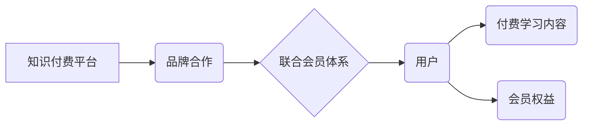

                 

## 知识付费赚钱的品牌跨界合作与联合会员体系构建

> 关键词：知识付费、品牌跨界合作、联合会员体系、会员运营、商业模式创新、数据驱动

## 1. 背景介绍

知识付费行业近年来发展迅速，成为互联网经济的重要组成部分。随着用户对优质内容的需求不断增长，知识付费平台也面临着新的挑战：如何提升用户粘性，拓展收入来源，实现可持续发展。品牌跨界合作与联合会员体系构建成为知识付费平台发展的新趋势，为平台带来新的增长点。

**1.1 知识付费行业现状**

知识付费行业涵盖了在线课程、付费咨询、电子书、会员社区等多种形式。近年来，随着移动互联网的普及和用户对学习的需求不断增长，知识付费市场规模持续扩大。

**1.2 品牌跨界合作的优势**

品牌跨界合作可以帮助知识付费平台：

* **拓展用户群体**: 通过合作品牌的用户资源，可以快速触达新的目标用户，扩大平台影响力。
* **提升品牌价值**: 与知名品牌合作，可以提升平台的品牌形象和用户信任度。
* **丰富内容生态**: 通过合作品牌的内容资源，可以丰富平台的内容生态，满足用户多样化的需求。

**1.3 联合会员体系的价值**

联合会员体系可以帮助知识付费平台：

* **提升用户粘性**: 通过提供多平台、多内容的会员权益，可以增强用户粘性，提高用户复购率。
* **增加收入来源**: 通过联合会员体系，可以实现多方资源共享，增加平台的收入来源。
* **打造用户社区**: 联合会员体系可以帮助平台打造用户社区，促进用户互动和交流。

## 2. 核心概念与联系

**2.1 知识付费平台**

知识付费平台是指提供付费学习内容和服务的在线平台。

**2.2 品牌**

品牌是指企业或产品在消费者心目中形成的独特形象和认知。

**2.3 联合会员体系**

联合会员体系是指多个平台或品牌合作，共同推出会员服务，用户可以通过一次性付费享受多个平台或品牌的会员权益。

**2.4 架构图**



## 3. 核心算法原理 & 具体操作步骤

**3.1 算法原理概述**

联合会员体系的构建需要考虑用户需求、平台资源、品牌合作等多方面因素。核心算法原理是基于用户画像、内容推荐、会员权益设计等技术，实现用户精准匹配、内容个性化推荐和会员价值最大化。

**3.2 算法步骤详解**

1. **用户画像构建**: 收集用户行为数据、兴趣偏好、消费习惯等信息，构建用户画像。
2. **内容推荐**: 基于用户画像，推荐符合用户兴趣和需求的付费学习内容。
3. **会员权益设计**: 设计多平台、多内容的会员权益，满足用户多样化需求。
4. **合作平台匹配**: 根据平台资源、用户群体、品牌定位等因素，匹配合作平台。
5. **联合会员体系运营**: 推广联合会员体系，引导用户加入，并提供优质的会员服务。

**3.3 算法优缺点**

* **优点**: 提升用户粘性、拓展收入来源、丰富内容生态。
* **缺点**: 需要投入大量资源进行数据分析和算法开发，需要与多个品牌进行合作，协调难度较大。

**3.4 算法应用领域**

* 知识付费平台
* 在线教育平台
* 内容平台
* 社交平台

## 4. 数学模型和公式 & 详细讲解 & 举例说明

**4.1 数学模型构建**

联合会员体系的构建可以采用用户价值模型进行分析。用户价值模型可以表示为：

$$
U = f(C, E, S)
$$

其中：

* $U$ 表示用户价值
* $C$ 表示用户获得的付费学习内容价值
* $E$ 表示用户获得的会员权益价值
* $S$ 表示用户参与平台的社交互动价值

**4.2 公式推导过程**

用户价值模型可以进一步细化，例如：

* $C = \alpha \cdot Q + \beta \cdot P$

其中：

* $Q$ 表示用户获得的付费学习内容数量
* $P$ 表示用户获得的付费学习内容质量
* $\alpha$ 和 $\beta$ 为权重系数

* $E = \gamma \cdot R + \delta \cdot D$

其中：

* $R$ 表示用户获得的会员权益数量
* $D$ 表示用户获得的会员权益折扣
* $\gamma$ 和 $\delta$ 为权重系数

**4.3 案例分析与讲解**

假设一个知识付费平台与一个在线教育平台合作，推出联合会员体系。用户可以通过一次性付费，享受两个平台的会员权益，例如：

* 在知识付费平台上，用户可以获得免费观看部分付费课程、参与线上讨论等权益。
* 在在线教育平台上，用户可以获得免费参加部分线下课程、享受课程折扣等权益。

通过联合会员体系，平台可以吸引更多用户，提升用户粘性，增加收入来源。

## 5. 项目实践：代码实例和详细解释说明

**5.1 开发环境搭建**

* 操作系统：Linux/macOS/Windows
* 编程语言：Python
* 框架：Django/Flask
* 数据库：MySQL/PostgreSQL

**5.2 源代码详细实现**

```python
# 用户模型
class User(models.Model):
    username = models.CharField(max_length=255)
    password = models.CharField(max_length=255)
    # 其他用户属性

# 会员模型
class Membership(models.Model):
    user = models.ForeignKey(User, on_delete=models.CASCADE)
    platform = models.CharField(max_length=255)
    # 其他会员属性

# 课程模型
class Course(models.Model):
    title = models.CharField(max_length=255)
    # 其他课程属性

# 联合会员体系视图
def joint_membership(request):
    # 获取用户登录信息
    user = request.user
    # 获取用户已加入的会员信息
    memberships = Membership.objects.filter(user=user)
    # 获取用户可加入的联合会员信息
    available_memberships = # ...
    # 渲染模板
    return render(request, 'joint_membership.html', {'memberships': memberships, 'available_memberships': available_memberships})
```

**5.3 代码解读与分析**

* 用户模型存储用户基本信息。
* 会员模型存储用户加入的会员信息，包括平台和会员属性。
* 课程模型存储付费学习课程信息。
* 联合会员体系视图获取用户登录信息、已加入的会员信息和可加入的联合会员信息，并渲染模板。

**5.4 运行结果展示**

运行代码后，用户可以访问联合会员体系页面，查看已加入的会员信息和可加入的联合会员信息。

## 6. 实际应用场景

**6.1 在线教育平台与知识付费平台合作**

在线教育平台可以与知识付费平台合作，推出联合会员体系，用户可以享受在线课程和付费学习内容的双重权益。

**6.2 内容平台与品牌合作**

内容平台可以与品牌合作，推出联合会员体系，用户可以享受内容平台的内容和品牌提供的商品或服务。

**6.3 社交平台与会员服务合作**

社交平台可以与会员服务平台合作，推出联合会员体系，用户可以享受社交平台的社交功能和会员服务平台提供的会员权益。

**6.4 未来应用展望**

随着人工智能、大数据等技术的不断发展，联合会员体系将更加智能化、个性化。未来，联合会员体系将应用于更多领域，例如医疗、金融、旅游等。

## 7. 工具和资源推荐

**7.1 学习资源推荐**

* **书籍**: 《会员经济》、《数据驱动会员运营》
* **课程**: 网易云课堂、慕课网
* **博客**:  

**7.2 开发工具推荐**

* **框架**: Django、Flask
* **数据库**: MySQL、PostgreSQL
* **云平台**: AWS、阿里云、腾讯云

**7.3 相关论文推荐**

* 《基于用户画像的知识付费平台会员运营策略研究》
* 《联合会员体系构建与运营模式创新》

## 8. 总结：未来发展趋势与挑战

**8.1 研究成果总结**

本文介绍了知识付费平台品牌跨界合作与联合会员体系构建的背景、核心概念、算法原理、项目实践、应用场景等方面。

**8.2 未来发展趋势**

* **智能化**: 利用人工智能技术，实现用户画像精准化、内容推荐个性化、会员权益定制化。
* **个性化**: 根据用户需求和行为，提供个性化的会员权益和服务。
* **生态化**: 建立多方合作的生态系统，提供更丰富的会员权益和服务。

**8.3 面临的挑战**

* **数据安全**: 保护用户隐私数据安全。
* **合作模式**: 探索更有效的品牌合作模式。
* **运营成本**: 控制运营成本，实现可持续发展。

**8.4 研究展望**

未来，将继续研究联合会员体系的智能化、个性化、生态化发展趋势，探索更有效的品牌合作模式和运营策略，为知识付费平台的持续发展提供理论支持和实践指导。

## 9. 附录：常见问题与解答

**9.1 如何加入联合会员体系？**

用户可以通过平台官网或APP注册账号，选择加入联合会员体系，并支付相应的会员费用。

**9.2 联合会员体系的权益有哪些？**

联合会员体系的权益包括但不限于：

* 免费观看部分付费课程
* 参与线上讨论
* 参加线下课程
* 享受课程折扣
* 获取品牌商品或服务优惠

**9.3 联合会员体系的费用是多少？**

联合会员体系的费用根据平台和品牌合作方案而定，具体费用请咨询平台客服。


作者：禅与计算机程序设计艺术 / Zen and the Art of Computer Programming 
<end_of_turn>

