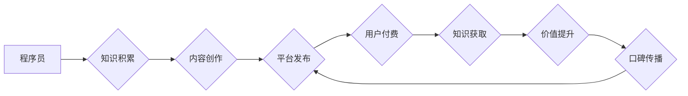

                 

## 知识付费：程序员实现财富自由的新途径

> 关键词：知识付费、程序员、财富自由、在线教育、技术分享、内容创作、个人品牌

### 1. 背景介绍

在当今数字化时代，技术人才需求量持续增长，程序员作为科技发展的重要驱动力，备受瞩目。然而，程序员的职业发展道路并非一帆风顺，面对激烈的市场竞争和不断更新的技术迭代，程序员需要不断学习和提升自身技能，才能保持竞争力。

传统的工作模式和薪资体系难以满足程序员对自我价值实现和财富积累的渴望。越来越多的程序员开始寻求新的职业发展路径，知识付费成为其中一种备受关注的模式。

知识付费是指通过线上平台或线下活动，将个人知识、技能和经验以付费的形式提供给有需求的用户。对于程序员而言，知识付费不仅可以帮助他们分享自己的技术积累，获得经济回报，更重要的是可以建立个人品牌，提升专业影响力，并获得更大的职业发展空间。

### 2. 核心概念与联系

**2.1 知识付费的本质**

知识付费的核心在于价值交换。程序员拥有丰富的技术知识和实践经验，而用户需要学习和掌握这些知识，提升自身技能。通过知识付费，程序员将自己的知识和经验转化为有价值的产品或服务，与用户进行价值交换，实现双赢。

**2.2 知识付费的模式**

知识付费的模式多种多样，包括：

* **在线课程:**  录制视频课程，提供课件和练习题，用户通过付费订阅或购买课程内容进行学习。
* **直播教学:**  通过线上直播平台，实时讲解技术知识，与用户互动答疑，提供更即时的学习体验。
* **付费咨询:**  提供一对一技术咨询服务，帮助用户解决特定技术问题，提供个性化的指导。
* **技术文档和工具:**  创作技术文档、开发工具或插件，通过付费下载或订阅的方式提供给用户。

**2.3 知识付费的流程图**



### 3. 核心算法原理 & 具体操作步骤

**3.1 算法原理概述**

知识付费的核心算法原理在于内容推荐和用户匹配。通过分析用户的学习兴趣、技术水平和需求，推荐合适的知识付费产品，并帮助用户找到合适的学习路径。

**3.2 算法步骤详解**

1. **用户画像构建:** 收集用户的学习行为数据，包括学习记录、评价反馈、关注领域等，构建用户的学习画像。
2. **内容分类与标签化:** 对知识付费内容进行分类和标签化，例如编程语言、框架、工具等，方便用户搜索和筛选。
3. **推荐算法:** 基于用户的学习画像和内容标签，采用协同过滤、内容过滤或混合推荐算法，推荐符合用户需求的知识付费产品。
4. **个性化学习路径:** 根据用户的学习进度和反馈，动态调整学习路径，提供个性化的学习体验。

**3.3 算法优缺点**

* **优点:** 能够精准推荐用户感兴趣的内容，提高用户学习效率和满意度。
* **缺点:** 需要大量的数据进行训练和维护，算法的准确性依赖于数据质量。

**3.4 算法应用领域**

* 在线教育平台
* 技术社区
* 个人博客和网站

### 4. 数学模型和公式 & 详细讲解 & 举例说明

**4.1 数学模型构建**

知识推荐算法通常采用基于用户的协同过滤模型，该模型基于用户的历史行为数据，预测用户对特定内容的兴趣。

**4.2 公式推导过程**

设用户u对物品i的评分为r(u,i)，用户u对物品j的评分为r(u,j)，物品i和物品j的相似度为sim(i,j)。则用户u对物品k的评分预测值可以表示为：

$$
\hat{r}(u,k) = \frac{\sum_{j \in N(u)} r(u,j) \cdot sim(i,j)}{\sum_{j \in N(u)} sim(i,j)}
$$

其中，N(u)表示用户u评分过的物品集合。

**4.3 案例分析与讲解**

假设用户A对编程语言Python和Java的评分分别为4和5，用户B对Python和C++的评分分别为3和4。如果Python和C++的相似度为0.8，则可以预测用户A对C++的评分为：

$$
\hat{r}(A,C++) = \frac{4 \cdot 0.8}{0.8} = 4
$$

### 5. 项目实践：代码实例和详细解释说明

**5.1 开发环境搭建**

* Python 3.x
* Flask 或 Django 框架
* 数据库 (例如 MySQL 或 PostgreSQL)

**5.2 源代码详细实现**

```python
from flask import Flask, render_template

app = Flask(__name__)

@app.route('/')
def index():
    return render_template('index.html')

if __name__ == '__main__':
    app.run(debug=True)
```

**5.3 代码解读与分析**

这段代码是一个简单的Flask web应用，用于展示知识付费平台的首页。

* `Flask` 是一个轻量级的Python web框架。
* `render_template` 函数用于渲染HTML模板。
* `index.html` 是首页的HTML模板文件。

**5.4 运行结果展示**

运行代码后，访问 `http://127.0.0.1:5000/`，即可看到知识付费平台的首页。

### 6. 实际应用场景

**6.1 在线课程平台**

知识付费平台可以提供各种在线课程，涵盖编程语言、框架、工具等多个领域。用户可以通过付费订阅或购买课程内容进行学习。

**6.2 技术社区**

技术社区可以利用知识付费模式，提供付费咨询服务，帮助用户解决特定技术问题。

**6.3 个人博客和网站**

程序员可以利用个人博客或网站，创作技术文档、开发工具或插件，通过付费下载或订阅的方式提供给用户。

**6.4 未来应用展望**

随着人工智能、大数据等技术的不断发展，知识付费平台将更加智能化、个性化。未来，知识付费平台将能够更加精准地推荐用户感兴趣的内容，提供更丰富的学习资源和服务，并与其他教育平台和工具进行深度整合，构建完整的学习生态系统。

### 7. 工具和资源推荐

**7.1 学习资源推荐**

* **在线学习平台:** Coursera, Udemy, edX
* **技术社区:** Stack Overflow, GitHub, SegmentFault
* **博客和网站:** Hacker News, Medium, Dev.to

**7.2 开发工具推荐**

* **Python web框架:** Flask, Django
* **数据库:** MySQL, PostgreSQL
* **版本控制系统:** Git

**7.3 相关论文推荐**

* **Collaborative Filtering for Recommender Systems**
* **Content-Based Recommendation Systems**
* **Hybrid Recommender Systems**

### 8. 总结：未来发展趋势与挑战

**8.1 研究成果总结**

知识付费模式为程序员提供了新的职业发展路径，并推动了技术知识的传播和共享。通过算法推荐和个性化学习路径，知识付费平台能够提高用户学习效率和满意度。

**8.2 未来发展趋势**

未来，知识付费平台将更加智能化、个性化，并与其他教育平台和工具进行深度整合，构建完整的学习生态系统。

**8.3 面临的挑战**

* **内容质量控制:** 确保知识付费内容的质量和权威性。
* **用户信任和安全:** 保护用户隐私和数据安全。
* **商业模式创新:** 探索新的商业模式，实现可持续发展。

**8.4 研究展望**

未来研究方向包括：

* **更精准的推荐算法:** 基于用户行为、学习风格和知识图谱等多方面因素，开发更精准的推荐算法。
* **个性化学习路径:** 基于用户的学习进度和反馈，动态调整学习路径，提供更个性化的学习体验。
* **知识付费生态系统:** 与其他教育平台和工具进行深度整合，构建完整的知识付费生态系统。

### 9. 附录：常见问题与解答

**9.1 如何选择合适的知识付费产品？**

* 确定自己的学习目标和需求。
* 阅读产品介绍和用户评价。
* 尝试免费试听或课程片段。

**9.2 如何保证知识付费内容的质量？**

* 选择信誉良好的平台和机构。
* 阅读产品介绍和用户评价。
* 关注作者的专业背景和经验。

**9.3 如何保护个人隐私和数据安全？**

* 选择平台和机构拥有良好的隐私保护政策。
* 谨慎填写个人信息。
* 使用强密码保护账户安全。


作者：禅与计算机程序设计艺术 / Zen and the Art of Computer Programming 
<end_of_turn>

