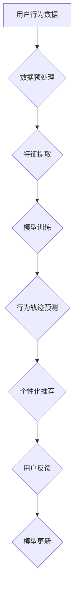

                 

## 知识发现引擎的用户行为轨迹分析

> 关键词：知识发现引擎、用户行为轨迹、数据挖掘、机器学习、推荐系统、个性化体验、数据可视化

## 1. 背景介绍

在当今数据爆炸的时代，用户行为数据已成为企业获取洞察、提升用户体验和驱动业务增长的宝贵资源。知识发现引擎 (KDE) 作为一种智能数据分析工具，能够从海量用户行为数据中挖掘出隐藏的模式、趋势和关联，为企业提供数据驱动的决策支持。

用户行为轨迹分析是KDE的核心应用之一，它通过追踪用户的交互行为，例如点击、浏览、购买等，构建用户的行为路径，并分析这些路径的特征和规律。通过对用户行为轨迹的深入理解，企业可以：

* **个性化推荐：** 根据用户的行为轨迹，推荐更符合其兴趣和需求的产品或服务，提升用户满意度和转化率。
* **用户画像构建：**  将用户行为轨迹与其他用户数据结合，构建用户画像，深入了解用户的需求、偏好和行为模式。
* **营销策略优化：** 分析用户行为轨迹，识别用户群体的差异化特征，制定更精准的营销策略，提高营销效果。
* **产品优化改进：**  通过分析用户行为轨迹中的痛点和问题，改进产品设计和功能，提升用户体验。

## 2. 核心概念与联系

**2.1 用户行为轨迹**

用户行为轨迹是指用户在使用系统或产品过程中所执行的一系列交互行为，例如：

* **页面浏览：** 用户访问的页面URL和停留时间。
* **点击行为：** 用户点击的链接、按钮或其他元素。
* **搜索行为：** 用户在搜索引擎或系统内输入的关键词。
* **购买行为：** 用户购买的商品或服务。
* **评论行为：** 用户对商品或服务的评价和反馈。

**2.2 数据挖掘与机器学习**

数据挖掘和机器学习是KDE的核心技术，它们用于从用户行为轨迹数据中提取有价值的知识。

* **数据挖掘**是指从大规模、复杂的数据中发现隐藏的模式、趋势和关联。常用的数据挖掘技术包括关联规则挖掘、分类、聚类和预测。
* **机器学习**是指通过算法训练模型，使模型能够从数据中学习，并对新的数据进行预测或分类。常用的机器学习算法包括决策树、支持向量机、神经网络等。

**2.3 推荐系统**

推荐系统是基于用户行为轨迹分析的一种应用，它通过分析用户的兴趣和偏好，推荐用户可能感兴趣的产品或服务。推荐系统通常采用协同过滤、内容过滤或混合方法。

**2.4 数据可视化**

数据可视化是将复杂的数据转化为易于理解的图形和图表，以便用户直观地了解数据背后的信息。数据可视化技术可以帮助用户更好地理解用户行为轨迹，发现隐藏的模式和趋势。

**2.5 Mermaid 流程图**



## 3. 核心算法原理 & 具体操作步骤

### 3.1 算法原理概述

用户行为轨迹分析的核心算法通常基于以下原理：

* **序列模型:** 将用户行为序列视为时间序列数据，利用循环神经网络 (RNN) 或长短期记忆网络 (LSTM) 等模型学习用户行为的时序依赖关系。
* **图模型:** 将用户和物品视为图中的节点，用户行为视为图中的边，利用图神经网络 (GNN) 等模型学习用户行为之间的关系和模式。
* **聚类算法:** 将用户行为轨迹进行聚类，将具有相似行为模式的用户归为同一类，以便进行更精准的个性化推荐和用户画像构建。

### 3.2 算法步骤详解

**步骤 1：数据收集和预处理**

收集用户行为数据，并进行清洗、格式化和转换等预处理操作，例如：

* 去除重复数据和无效数据。
* 将数据转换为统一的格式。
* 对数据进行归一化和标准化。

**步骤 2：特征提取**

从用户行为数据中提取特征，例如：

* 用户ID、商品ID、时间戳、浏览时长、点击次数等。
* 用户行为序列的长度、频率、多样性等。
* 用户行为轨迹与商品属性、用户画像等特征的关联性。

**步骤 3：模型训练**

选择合适的算法模型，并利用训练数据进行模型训练，例如：

* 使用RNN或LSTM模型学习用户行为的时序依赖关系。
* 使用GNN模型学习用户行为之间的关系和模式。
* 使用聚类算法将用户行为轨迹进行聚类。

**步骤 4：行为轨迹预测**

利用训练好的模型，对用户的未来行为进行预测，例如：

* 预测用户可能点击的链接或购买的商品。
* 预测用户可能感兴趣的主题或内容。

**步骤 5：个性化推荐**

根据行为轨迹预测结果，为用户提供个性化的推荐，例如：

* 推荐用户可能感兴趣的商品或服务。
* 推荐用户可能喜欢的文章或视频。

### 3.3 算法优缺点

**优点:**

* 能够从海量用户行为数据中挖掘出隐藏的模式和趋势。
* 可以为用户提供个性化的推荐和体验。
* 可以帮助企业优化营销策略和产品设计。

**缺点:**

* 需要大量的训练数据和计算资源。
* 模型的准确性取决于数据的质量和特征的提取。
* 算法的复杂性可能导致模型难以解释和理解。

### 3.4 算法应用领域

用户行为轨迹分析算法广泛应用于以下领域：

* **电商推荐:** 为用户推荐个性化的商品和服务。
* **内容推荐:** 为用户推荐个性化的文章、视频和音乐。
* **社交媒体:** 分析用户的社交行为，推荐新的朋友和内容。
* **金融服务:** 分析用户的交易行为，识别潜在的风险和欺诈行为。
* **医疗保健:** 分析用户的健康数据，预测疾病风险和提供个性化的医疗建议。

## 4. 数学模型和公式 & 详细讲解 & 举例说明

### 4.1 数学模型构建

用户行为轨迹分析通常采用以下数学模型：

* **马尔可夫模型:** 假设用户在每个时间点选择下一个行为的概率只依赖于当前状态，不依赖于过去的行为。

* **隐马尔可夫模型 (HMM):**  扩展了马尔可夫模型，引入了隐藏状态，用于表示用户行为背后的潜在意图或状态。

* **深度学习模型:**  例如RNN、LSTM和GNN等，能够学习更复杂的非线性关系和用户行为的时序依赖性。

### 4.2 公式推导过程

**马尔可夫模型:**

假设用户行为状态空间为S，行为序列为T = {s1, s2, ..., sn}, 其中si表示用户在第i个时间点的行为状态。马尔可夫模型的概率转移矩阵为P，其中P(sj|si)表示用户从状态si转移到状态sj的概率。

用户行为序列T的概率可以表示为：

$$P(T) = P(s1) \prod_{i=2}^{n} P(si|si-1)$$

**隐马尔可夫模型:**

HMM模型引入了隐藏状态空间Q，每个隐藏状态qi表示用户在第i个时间点的潜在意图或状态。HMM模型的概率转移矩阵为A，其中A(qi|qj)表示用户从隐藏状态qj转移到隐藏状态qi的概率。观测状态概率矩阵为B，其中B(si|qi)表示用户在隐藏状态qi下执行行为si的概率。

用户行为序列T和隐藏状态序列H的联合概率可以表示为：

$$P(T, H) = P(h1) \prod_{i=2}^{n} A(hi|hi-1) \prod_{i=1}^{n} B(si|hi)$$

### 4.3 案例分析与讲解

**案例:** 假设一个电商平台想要分析用户的商品浏览行为，并预测用户可能购买的商品。

**模型选择:** 可以使用RNN或LSTM模型，将用户的商品浏览历史作为输入序列，预测用户下一个可能点击的商品。

**数据准备:** 收集用户的商品浏览历史数据，例如用户ID、商品ID、浏览时间等。

**模型训练:** 使用训练数据训练RNN或LSTM模型，并评估模型的准确性。

**预测应用:** 利用训练好的模型，对用户的商品浏览行为进行预测，并推荐用户可能感兴趣的商品。

## 5. 项目实践：代码实例和详细解释说明

### 5.1 开发环境搭建

* **操作系统:** Linux或macOS
* **编程语言:** Python
* **深度学习框架:** TensorFlow或PyTorch
* **数据处理库:** Pandas
* **可视化库:** Matplotlib或Seaborn

### 5.2 源代码详细实现

```python
import tensorflow as tf

# 定义RNN模型
model = tf.keras.Sequential([
    tf.keras.layers.Embedding(input_dim=vocab_size, output_dim=embedding_dim),
    tf.keras.layers.LSTM(units=128),
    tf.keras.layers.Dense(units=num_classes, activation='softmax')
])

# 编译模型
model.compile(optimizer='adam', loss='sparse_categorical_crossentropy', metrics=['accuracy'])

# 训练模型
model.fit(x_train, y_train, epochs=10, batch_size=32)

# 预测
predictions = model.predict(x_test)
```

### 5.3 代码解读与分析

* **Embedding层:** 将用户行为序列中的每个商品ID转换为稠密的向量表示。
* **LSTM层:** 学习用户行为序列的时序依赖关系。
* **Dense层:** 将LSTM层的输出映射到商品类别概率分布。
* **编译模型:** 选择优化器、损失函数和评价指标。
* **训练模型:** 使用训练数据训练模型，并评估模型的性能。
* **预测:** 利用训练好的模型对新的用户行为序列进行预测。

### 5.4 运行结果展示

* **准确率:** 模型在测试集上的准确率。
* **混淆矩阵:** 显示模型预测结果的正确率和错误率。
* **ROC曲线:** 显示模型在不同阈值下的真阳性率和假阳性率。

## 6. 实际应用场景

### 6.1 电商推荐系统

* **商品推荐:** 根据用户的浏览历史、购买记录和评分等数据，推荐用户可能感兴趣的商品。
* **个性化促销:** 为不同用户群体提供个性化的促销活动和优惠券。
* **购物车优化:** 根据用户的浏览和添加商品的行为，推荐用户可能需要的商品，并引导用户完成购买。

### 6.2 内容推荐系统

* **文章推荐:** 根据用户的阅读历史、点赞记录和评论等数据，推荐用户可能感兴趣的文章。
* **视频推荐:** 根据用户的观看历史、点赞记录和分享等数据，推荐用户可能感兴趣的视频。
* **音乐推荐:** 根据用户的播放历史、收藏记录和评论等数据，推荐用户可能喜欢的音乐。

### 6.3 社交媒体平台

* **好友推荐:** 根据用户的兴趣爱好、社交关系和行为模式，推荐用户可能认识的朋友。
* **内容推荐:** 根据用户的关注话题、点赞记录和评论等数据，推荐用户可能感兴趣的内容。
* **广告推荐:** 根据用户的兴趣爱好、行为模式和社交关系，推荐用户可能感兴趣的广告。

### 6.4 未来应用展望

* **更精准的个性化推荐:** 利用更先进的机器学习算法和数据分析技术，为用户提供更精准的个性化推荐。
* **跨平台用户行为分析:** 将不同平台的用户行为数据进行整合分析，构建更全面的用户画像。
* **预测用户需求:** 利用用户行为轨迹分析，预测用户的未来需求，并提前提供相应的服务和产品。
* **增强用户体验:** 通过分析用户行为轨迹，优化产品设计和用户界面，提升用户体验。

## 7. 工具和资源推荐

### 7.1 学习资源推荐

* **书籍:**
    * 《深度学习》 by Ian Goodfellow, Yoshua Bengio, and Aaron Courville
    * 《机器学习》 by Tom Mitchell
* **在线课程:**
    * Coursera: Machine Learning by Andrew Ng
    * Udacity: Deep Learning Nanodegree
* **博客和网站:**
    * Towards Data Science
    * Machine Learning Mastery

### 7.2 开发工具推荐

* **Python:** 
    * TensorFlow
    * PyTorch
    * Keras
* **数据处理库:** Pandas
* **可视化库:** Matplotlib, Seaborn
* **云平台:** AWS, Azure, GCP

### 7.3 相关论文推荐

* **Recurrent Neural Network for Sequence Modeling** by Sepp Hochreiter and Jürgen Schmidhuber
* **Long Short-Term Memory** by Sepp Hochreiter and Jürgen Schmidhuber
* **Graph Convolutional Networks** by Thomas N. Kipf and Max Welling

## 8. 总结：未来发展趋势与挑战

### 8.1 研究成果总结

用户行为轨迹分析已经取得了显著的成果，在电商推荐、内容推荐、社交媒体等领域得到了广泛应用。

### 8.2 未来发展趋势

* **更精准的个性化推荐:** 利用更先进的机器学习算法和数据分析技术，为用户提供更精准的个性化推荐。
* **跨平台用户行为分析:** 将不同平台的用户行为数据进行整合分析，构建更全面的用户画像。
* **预测用户需求:** 利用用户行为轨迹分析，预测用户的未来需求，并提前提供相应的服务和产品。
* **增强用户体验:** 通过分析用户行为轨迹，优化产品设计和用户界面，提升用户体验。

### 8.3 面临的挑战

* **数据隐私保护:** 用户行为数据包含敏感信息，需要采取有效的措施保护用户隐私。
* **模型解释性:** 深度学习模型的决策过程难以解释，需要开发更可解释的模型。
* **数据质量:** 用户行为数据质量参差不齐，需要开发更有效的清洗和预处理方法。
* **算法效率:** 训练和预测用户行为轨迹模型需要大量的计算资源，需要开发更有效的算法和优化方法。

### 8.4 研究展望

未来，用户行为轨迹分析将继续朝着更精准、更智能、更可解释的方向发展。

## 9. 附录：常见问题与解答

**Q1: 如何处理用户行为数据中的缺失值？**

**A1:** 可以使用多种方法处理缺失值，例如：

* **删除缺失值:** 如果缺失值较少，可以删除包含缺失值的样本。
* **用均值或中位数填充缺失值:** 如果缺失值较多，可以将缺失值填充为该特征的均值或中位数。
* **使用机器学习算法进行预测:** 可以使用机器学习算法预测缺失值。

**Q2: 如何评估用户行为轨迹分析模型的性能？**

**A2:** 可以使用以下指标评估模型的性能：

* **准确率:** 模型预测正确的比例。
* **召回率:** 模型预测出所有正例的比例。
* **F1-score:** 准确率和召回率的调和平均值。
* **AUC:**ROC曲线下面积，表示模型的区分能力。

**Q3: 如何防止模型过拟合？**

**A3:** 可以使用以下方法防止模型过拟合：

* **使用正则化技术:** 例如L1正则化和L2正则化。
* **使用交叉验证:** 将数据划分为训练集、验证集和测试集，并在验证集上监控模型的性能。
* **使用Dropout:** 在训练过程中随机丢弃一部分神经元，防止模型过拟合。


作者：禅与计算机程序设计艺术 / Zen and the Art of Computer Programming<end_of_turn>

