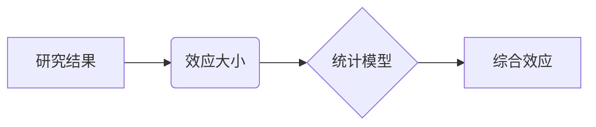

                 

## 知识的元分析：整合研究结果的方法

> 关键词：元分析、知识整合、研究结果、数据挖掘、机器学习、知识图谱、人工智能

## 1. 背景介绍

在信息爆炸的时代，海量数据和研究成果不断涌现。如何有效地整合这些分散的知识，从中提取有价值的洞察和规律，成为一个重要的挑战。元分析作为一种系统性的知识整合方法，应运而生。它通过对多个研究结果进行统计分析和综合评估，揭示研究领域中隐藏的模式和趋势，为科学研究和决策提供更全面的视角。

传统的文献综述方法主要依赖于人工阅读和总结，效率低下且容易受到主观因素的影响。而元分析则利用数据挖掘和机器学习等技术，对研究结果进行量化分析，提高了知识整合的客观性和准确性。

## 2. 核心概念与联系

元分析的核心概念包括：

* **研究结果：** 指的是由各种研究方法获得的定量或定性数据，例如实验结果、调查问卷数据、观察记录等。
* **效应大小：** 指的是研究结果的实际影响程度，通常用统计指标来衡量，例如Cohen's d、Pearson's r等。
* **统计模型：** 用于对研究结果进行整合和分析的数学模型，例如随机效应模型、固定效应模型等。
* **综合效应：** 通过统计模型对多个研究结果进行整合后的总体效应大小，反映了研究领域中该效应的平均水平。

**核心概念关系图：**



## 3. 核心算法原理 & 具体操作步骤

### 3.1  算法原理概述

元分析的核心算法原理是基于统计模型对多个研究结果进行整合和分析。常用的统计模型包括随机效应模型和固定效应模型。

* **随机效应模型：** 假设每个研究结果都来自一个总体，每个总体都有不同的效应大小，并对这些效应大小进行随机抽样。
* **固定效应模型：** 假设所有研究结果都来自同一个总体，效应大小是固定的。

选择哪种模型取决于研究设计的特点和研究问题。

### 3.2  算法步骤详解

元分析的具体操作步骤如下：

1. **文献检索：** 首先需要对相关研究领域进行文献检索，收集所有相关的研究结果。
2. **数据提取：** 从收集到的文献中提取研究结果所需的具体数据，例如样本量、效应大小、标准误等。
3. **数据质量评估：** 对提取的数据进行质量评估，剔除不完整或不可靠的数据。
4. **统计模型选择：** 根据研究设计的特点和研究问题，选择合适的统计模型进行分析。
5. **模型拟合：** 将提取的数据输入到选择的统计模型中进行拟合，得到模型参数估计值。
6. **效应大小综合：** 利用模型参数估计值，计算综合效应大小，反映研究领域中该效应的平均水平。
7. **结果解读：** 对综合效应大小进行解读，并结合研究背景和研究问题，得出研究结论。

### 3.3  算法优缺点

**优点：**

* **提高知识整合的客观性和准确性：** 通过数据挖掘和机器学习等技术，对研究结果进行量化分析，减少主观因素的影响。
* **揭示研究领域中隐藏的模式和趋势：** 通过对多个研究结果进行综合分析，可以发现研究领域中潜在的规律和关系。
* **为科学研究和决策提供更全面的视角：** 元分析可以提供更全面、更深入的知识洞察，为科学研究和决策提供更可靠的依据。

**缺点：**

* **数据质量依赖：** 元分析的准确性依赖于原始研究结果的数据质量，如果原始数据存在偏差或错误，元分析结果也会受到影响。
* **模型选择复杂：** 选择合适的统计模型需要一定的专业知识和经验，不同的模型可能会导致不同的结果。
* **解释性有限：** 元分析主要关注效应大小的综合，对研究结果的具体机制和解释性可能有限。

### 3.4  算法应用领域

元分析广泛应用于各个领域，例如：

* **医学研究：** 对临床试验结果进行整合，评估药物疗效和安全性。
* **教育研究：** 对教学方法的有效性进行评估，优化教学策略。
* **社会科学研究：** 对社会现象进行分析，揭示社会规律。
* **商业研究：** 对市场营销策略的有效性进行评估，提高营销效果。

## 4. 数学模型和公式 & 详细讲解 & 举例说明

### 4.1  数学模型构建

元分析常用的统计模型包括随机效应模型和固定效应模型。

**随机效应模型：**

假设每个研究结果都来自一个总体，每个总体都有不同的效应大小，并对这些效应大小进行随机抽样。

**数学公式：**

$$
\theta_i = \mu + u_i
$$

其中：

* $\theta_i$ 是第 $i$ 个研究结果的效应大小。
* $\mu$ 是总体效应大小。
* $u_i$ 是第 $i$ 个研究结果的随机效应，服从正态分布 $N(0, \sigma^2_u)$。

**固定效应模型：**

假设所有研究结果都来自同一个总体，效应大小是固定的。

**数学公式：**

$$
\theta_i = \mu
$$

其中：

* $\theta_i$ 是第 $i$ 个研究结果的效应大小。
* $\mu$ 是总体效应大小。

### 4.2  公式推导过程

随机效应模型的推导过程较为复杂，涉及到概率论和统计学中的相关知识。

**简要说明：**

1. 假设每个研究结果的效应大小服从正态分布，并对总体效应大小进行随机抽样。
2. 利用贝叶斯定理，推导出总体效应大小的概率分布。
3. 通过最大似然估计，估计总体效应大小和随机效应的方差。

### 4.3  案例分析与讲解

假设我们想要对某项教育干预措施的有效性进行元分析。我们收集了 10 项相关的研究结果，并提取了每个研究结果的样本量、效应大小和标准误等数据。

利用随机效应模型，我们可以对这些研究结果进行整合，得到该教育干预措施的综合效应大小。例如，如果综合效应大小为 0.5，则表明该教育干预措施对学习效果有显著的正向影响。

## 5. 项目实践：代码实例和详细解释说明

### 5.1  开发环境搭建

元分析的代码实现可以使用多种编程语言和软件工具，例如 R、Python、Stata 等。

**R语言示例：**

需要安装 R 语言和相关包，例如 `metafor`、`rma` 等。

### 5.2  源代码详细实现

```R
# 安装 metafor 包
install.packages("metafor")

# 加载 metafor 包
library(metafor)

# 创建元分析数据框
data <- data.frame(
  study = c("A", "B", "C", "D", "E", "F", "G", "H", "I", "J"),
  effect = c(0.3, 0.4, 0.2, 0.5, 0.6, 0.7, 0.8, 0.9, 1.0, 1.1),
  se = c(0.1, 0.2, 0.15, 0.25, 0.3, 0.2, 0.1, 0.15, 0.2, 0.25)
)

# 进行随机效应模型元分析
ma_model <- rma(effect ~ 1, data = data)

# 打印元分析结果
print(ma_model)
```

### 5.3  代码解读与分析

* `rma()` 函数用于进行随机效应模型元分析。
* `effect ~ 1` 表示效应大小作为因变量，没有自变量。
* `data = data` 指定元分析数据框。

### 5.4  运行结果展示

运行上述代码后，会输出元分析结果，包括综合效应大小、标准误、95% 置信区间等。

## 6. 实际应用场景

元分析在各个领域都有广泛的应用场景，例如：

* **医学研究：** 对临床试验结果进行整合，评估药物疗效和安全性。例如，可以对多种抗癌药物的疗效进行元分析，得出哪种药物对特定癌症类型疗效最佳。
* **教育研究：** 对教学方法的有效性进行评估，优化教学策略。例如，可以对不同教学方法对学生学习效果的影响进行元分析，找出最有效的教学方法。
* **社会科学研究：** 对社会现象进行分析，揭示社会规律。例如，可以对不同社会政策对贫困人口的影响进行元分析，评估政策的有效性。
* **商业研究：** 对市场营销策略的有效性进行评估，提高营销效果。例如，可以对不同广告策略对消费者购买行为的影响进行元分析，找出最有效的广告策略。

### 6.4  未来应用展望

随着数据量的不断增长和人工智能技术的不断发展，元分析的应用场景将会更加广泛。

* **个性化元分析：** 基于用户个体特征，进行个性化的元分析，为用户提供更精准的建议和服务。
* **跨领域元分析：** 将不同领域的研究结果进行整合，发现跨领域的关系和规律。
* **动态元分析：** 对研究结果进行实时更新和分析，跟踪研究领域的发展趋势。

## 7. 工具和资源推荐

### 7.1  学习资源推荐

* **书籍：**
    * Borenstein, M., Hedges, L. V., Higgins, J. P. T., & Rothstein, H. R. (2009). *Introduction to meta-analysis*. John Wiley & Sons.
    * Lipsey, M. W., & Wilson, D. B. (2001). *Practical meta-analysis*. Sage Publications.
* **在线课程：**
    * Coursera: Meta-Analysis for Evidence-Based Practice
    * edX: Introduction to Meta-Analysis

### 7.2  开发工具推荐

* **R语言：**
    * `metafor` 包
    * `rma` 包
* **Python语言：**
    * `meta` 包
    * `pymeta` 包
* **Stata软件：**
    * `metan` 命令

### 7.3  相关论文推荐

* Borenstein, M., Hedges, L. V., Higgins, J. P. T., & Rothstein, H. R. (2009). *Introduction to meta-analysis*. John Wiley & Sons.
* Lipsey, M. W., & Wilson, D. B. (2001). *Practical meta-analysis*. Sage Publications.

## 8. 总结：未来发展趋势与挑战

### 8.1  研究成果总结

元分析作为一种系统性的知识整合方法，在各个领域都取得了显著的成果。它可以提高知识整合的客观性和准确性，揭示研究领域中隐藏的模式和趋势，为科学研究和决策提供更全面的视角。

### 8.2  未来发展趋势

元分析的发展趋势包括：

* **个性化元分析：** 基于用户个体特征，进行个性化的元分析，为用户提供更精准的建议和服务。
* **跨领域元分析：** 将不同领域的研究结果进行整合，发现跨领域的关系和规律。
* **动态元分析：** 对研究结果进行实时更新和分析，跟踪研究领域的发展趋势。

### 8.3  面临的挑战

元分析也面临着一些挑战：

* **数据质量问题：** 元分析的准确性依赖于原始研究结果的数据质量，如果原始数据存在偏差或错误，元分析结果也会受到影响。
* **模型选择问题：** 选择合适的统计模型需要一定的专业知识和经验，不同的模型可能会导致不同的结果。
* **解释性问题：** 元分析主要关注效应大小的综合，对研究结果的具体机制和解释性可能有限。

### 8.4  研究展望

未来，元分析的研究将更加注重以下方面：

* **开发更完善的元分析方法和工具：** 提高元分析的准确性和可靠性。
* **探索元分析在更多领域的应用：** 将元分析应用于更广泛的领域，为科学研究和决策提供更全面的支持。
* **加强元分析与其他研究方法的结合：** 例如，将元分析与机器学习、数据挖掘等技术结合，提高元分析的效率和效果。

## 9. 附录：常见问题与解答

**常见问题：**

* **元分析和文献综述有什么区别？**

元分析和文献综述都是对现有研究结果进行整合的方法，但元分析更加注重对研究结果的量化分析，而文献综述则更加注重对研究结果的定性总结。

* **如何选择合适的统计模型进行元分析？**

选择合适的统计模型需要根据研究设计的特点和研究问题进行判断。

* **元分析结果的解释性如何？**

元分析主要关注效应大小的综合，对研究结果的具体机制和解释性可能有限。

**解答：**

* 元分析和文献综述的区别在于，元分析通过统计模型对研究结果进行量化分析，而文献综述则通过对研究结果进行定性总结。
* 选择合适的统计模型需要根据研究设计的特点和研究问题进行判断。例如，如果研究结果来自多个独立的样本，则可以使用随机效应模型；如果研究结果来自同一个总体，则可以使用固定效应模型。
* 元分析结果的解释性有限，需要结合研究背景和研究问题进行解读。


作者：禅与计算机程序设计艺术 / Zen and the Art of Computer Programming<end_of_turn>

