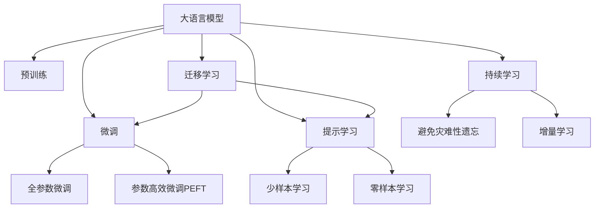

                 

## 1. 背景介绍

科学研究是人类进步的基石，其核心在于发现新的知识、理论和技术。然而，传统的科研方法往往耗时耗力、成本高昂。近年来，人工智能(AI)特别是大语言模型(Large Language Model, LLM)的出现，为科学研究带来了革命性的变革。本文旨在探讨LLM在科研中的应用，并深入分析其原理、步骤及优缺点，旨在为科研工作者提供一种快速、高效、便捷的工具，加速科学发现的进程。

## 2. 核心概念与联系

### 2.1 核心概念概述

为更好地理解LLM在科研中的应用，本节将介绍几个核心概念：

- **大语言模型(Large Language Model, LLM)**：以自回归(如GPT)或自编码(如BERT)模型为代表的大规模预训练语言模型。通过在海量无标签文本语料上进行预训练，学习通用的语言表示，具备强大的语言理解和生成能力。

- **预训练(Pre-training)**：指在大规模无标签文本语料上，通过自监督学习任务训练通用语言模型的过程。常见的预训练任务包括言语建模、遮挡语言模型等。预训练使得模型学习到语言的通用表示。

- **微调(Fine-tuning)**：指在预训练模型的基础上，使用下游任务的少量标注数据，通过有监督学习优化模型在该任务上的性能。通常只需要调整顶层分类器或解码器，并以较小的学习率更新全部或部分的模型参数。

- **迁移学习(Transfer Learning)**：指将一个领域学习到的知识，迁移应用到另一个不同但相关的领域的学习范式。大模型的预训练-微调过程即是一种典型的迁移学习方式。

- **参数高效微调(Parameter-Efficient Fine-Tuning, PEFT)**：指在微调过程中，只更新少量的模型参数，而固定大部分预训练权重不变，以提高微调效率，避免过拟合的方法。

- **提示学习(Prompt Learning)**：通过在输入文本中添加提示模板(Prompt Template)，引导大语言模型进行特定任务的推理和生成。可以在不更新模型参数的情况下，实现零样本或少样本学习。

- **少样本学习(Few-shot Learning)**：指在只有少量标注样本的情况下，模型能够快速适应新任务的学习方法。在大语言模型中，通常通过在输入中提供少量示例来实现，无需更新模型参数。

- **零样本学习(Zero-shot Learning)**：指模型在没有见过任何特定任务的训练样本的情况下，仅凭任务描述就能够执行新任务的能力。大语言模型通过预训练获得的广泛知识，使其能够理解任务指令并生成相应输出。

- **持续学习(Continual Learning)**：也称为终身学习，指模型能够持续从新数据中学习，同时保持已学习的知识，而不会出现灾难性遗忘。这对于保持大语言模型的时效性和适应性至关重要。

这些核心概念之间的逻辑关系可以通过以下Mermaid流程图来展示：



这个流程图展示了大语言模型的核心概念及其之间的关系：

1. 大语言模型通过预训练获得基础能力。
2. 微调是对预训练模型进行任务特定的优化，可以分为全参数微调和参数高效微调（PEFT）。
3. 提示学习是一种不更新模型参数的方法，可以实现少样本学习和零样本学习。
4. 迁移学习是连接预训练模型与下游任务的桥梁，可以通过微调或提示学习来实现。
5. 持续学习旨在使模型能够不断学习新知识，同时避免遗忘旧知识。

## 3. 核心算法原理 & 具体操作步骤
### 3.1 算法原理概述

基于LLM的科研辅助，本质上是一种有监督的细粒度迁移学习过程。其核心思想是：将预训练的LLM作为强大的"特征提取器"，通过科研任务的少量标注数据，利用有监督学习优化模型在该任务上的性能。

形式化地，假设预训练模型为 $M_{\theta}$，其中 $\theta$ 为预训练得到的模型参数。给定科研任务 $T$ 的标注数据集 $D=\{(x_i, y_i)\}_{i=1}^N, x_i \in \mathcal{X}, y_i \in \mathcal{Y}$。微调的目标是找到新的模型参数 $\hat{\theta}$，使得：

$$
\hat{\theta}=\mathop{\arg\min}_{\theta} \mathcal{L}(M_{\theta},D)
$$

其中 $\mathcal{L}$ 为针对任务 $T$ 设计的损失函数，用于衡量模型预测输出与真实标签之间的差异。常见的损失函数包括交叉熵损失、均方误差损失等。

通过梯度下降等优化算法，微调过程不断更新模型参数 $\theta$，最小化损失函数 $\mathcal{L}$，使得模型输出逼近真实标签。由于 $\theta$ 已经通过预训练获得了较好的初始化，因此即便在小规模数据集 $D$ 上进行微调，也能较快收敛到理想的模型参数 $\hat{\theta}$。

### 3.2 算法步骤详解

基于LLM的科研辅助一般包括以下几个关键步骤：

**Step 1: 准备预训练模型和数据集**
- 选择合适的预训练语言模型 $M_{\theta}$ 作为初始化参数，如 BERT、GPT 等。
- 准备科研任务 $T$ 的标注数据集 $D$，划分为训练集、验证集和测试集。一般要求标注数据与预训练数据的分布不要差异过大。

**Step 2: 添加任务适配层**
- 根据科研任务类型，在预训练模型顶层设计合适的输出层和损失函数。
- 对于分类任务，通常在顶层添加线性分类器和交叉熵损失函数。
- 对于生成任务，通常使用语言模型的解码器输出概率分布，并以负对数似然为损失函数。

**Step 3: 设置微调超参数**
- 选择合适的优化算法及其参数，如 AdamW、SGD 等，设置学习率、批大小、迭代轮数等。
- 设置正则化技术及强度，包括权重衰减、Dropout、Early Stopping等。
- 确定冻结预训练参数的策略，如仅微调顶层，或全部参数都参与微调。

**Step 4: 执行梯度训练**
- 将训练集数据分批次输入模型，前向传播计算损失函数。
- 反向传播计算参数梯度，根据设定的优化算法和学习率更新模型参数。
- 周期性在验证集上评估模型性能，根据性能指标决定是否触发 Early Stopping。
- 重复上述步骤直到满足预设的迭代轮数或 Early Stopping 条件。

**Step 5: 测试和部署**
- 在测试集上评估微调后模型 $M_{\hat{\theta}}$ 的性能，对比微调前后的精度提升。
- 使用微调后的模型对新样本进行推理预测，集成到实际的应用系统中。
- 持续收集新的数据，定期重新微调模型，以适应数据分布的变化。

以上是基于LLM的科研辅助的一般流程。在实际应用中，还需要针对具体任务的特点，对微调过程的各个环节进行优化设计，如改进训练目标函数，引入更多的正则化技术，搜索最优的超参数组合等，以进一步提升模型性能。

### 3.3 算法优缺点

基于LLM的科研辅助方法具有以下优点：
1. 简单高效。只需准备少量标注数据，即可对预训练模型进行快速适配，获得较大的性能提升。
2. 通用适用。适用于各种科研任务，包括分类、匹配、生成等，设计简单的任务适配层即可实现微调。
3. 参数高效。利用参数高效微调技术，在固定大部分预训练权重不变的情况下，仍可取得不错的提升。
4. 效果显著。在学术界和工业界的诸多任务上，基于微调的方法已经刷新了最先进的性能指标。

同时，该方法也存在一定的局限性：
1. 依赖标注数据。微调的效果很大程度上取决于标注数据的质量和数量，获取高质量标注数据的成本较高。
2. 迁移能力有限。当目标任务与预训练数据的分布差异较大时，微调的性能提升有限。
3. 负面效果传递。预训练模型的固有偏见、有害信息等，可能通过微调传递到下游任务，造成负面影响。
4. 可解释性不足。微调模型的决策过程通常缺乏可解释性，难以对其推理逻辑进行分析和调试。

尽管存在这些局限性，但就目前而言，基于LLM的科研辅助方法仍是大模型应用的最主流范式。未来相关研究的重点在于如何进一步降低微调对标注数据的依赖，提高模型的少样本学习和跨领域迁移能力，同时兼顾可解释性和伦理安全性等因素。

### 3.4 算法应用领域

基于LLM的科研辅助方法在科学研究领域已经得到了广泛的应用，覆盖了几乎所有常见任务，例如：

- **文本分类**：如科研文献主题分类、专利主题分类等。通过微调使模型学习文本-主题映射。
- **命名实体识别**：识别科研文本中的人名、地名、机构名等特定实体。通过微调使模型掌握实体边界和类型。
- **关系抽取**：从科研文本中抽取实体之间的语义关系。通过微调使模型学习实体-关系三元组。
- **问答系统**：对科研问题给出答案。将问题-答案对作为微调数据，训练模型学习匹配答案。
- **机器翻译**：将科研文献翻译成其他语言。通过微调使模型学习语言-语言映射。
- **文本摘要**：将长科研文本压缩成简短摘要。将文章-摘要对作为微调数据，使模型学习抓取要点。
- **对话系统**：使科研助手能够与人自然对话。将多轮对话历史作为上下文，微调模型进行回复生成。

除了上述这些经典任务外，LLM在科研中的创新性应用还在不断拓展，如可控文本生成、常识推理、代码生成、数据增强等，为科研技术落地应用提供了新的思路。随着预训练模型和微调方法的不断进步，相信LLM在科研中的应用将会更加广泛，为科学研究带来新的突破。

## 4. 数学模型和公式 & 详细讲解  
### 4.1 数学模型构建

本节将使用数学语言对基于LLM的科研辅助过程进行更加严格的刻画。

记预训练语言模型为 $M_{\theta}$，其中 $\theta$ 为预训练得到的模型参数。假设科研任务 $T$ 的训练集为 $D=\{(x_i,y_i)\}_{i=1}^N, x_i \in \mathcal{X}, y_i \in \mathcal{Y}$。

定义模型 $M_{\theta}$ 在数据样本 $(x,y)$ 上的损失函数为 $\ell(M_{\theta}(x),y)$，则在数据集 $D$ 上的经验风险为：

$$
\mathcal{L}(\theta) = \frac{1}{N} \sum_{i=1}^N \ell(M_{\theta}(x_i),y_i)
$$

微调的优化目标是最小化经验风险，即找到最优参数：

$$
\theta^* = \mathop{\arg\min}_{\theta} \mathcal{L}(\theta)
$$

在实践中，我们通常使用基于梯度的优化算法（如SGD、Adam等）来近似求解上述最优化问题。设 $\eta$ 为学习率，$\lambda$ 为正则化系数，则参数的更新公式为：

$$
\theta \leftarrow \theta - \eta \nabla_{\theta}\mathcal{L}(\theta) - \eta\lambda\theta
$$

其中 $\nabla_{\theta}\mathcal{L}(\theta)$ 为损失函数对参数 $\theta$ 的梯度，可通过反向传播算法高效计算。

### 4.2 公式推导过程

以下我们以二分类任务为例，推导交叉熵损失函数及其梯度的计算公式。

假设模型 $M_{\theta}$ 在输入 $x$ 上的输出为 $\hat{y}=M_{\theta}(x) \in [0,1]$，表示样本属于正类的概率。真实标签 $y \in \{0,1\}$。则二分类交叉熵损失函数定义为：

$$
\ell(M_{\theta}(x),y) = -[y\log \hat{y} + (1-y)\log (1-\hat{y})]
$$

将其代入经验风险公式，得：

$$
\mathcal{L}(\theta) = -\frac{1}{N}\sum_{i=1}^N [y_i\log M_{\theta}(x_i)+(1-y_i)\log(1-M_{\theta}(x_i))]
$$

根据链式法则，损失函数对参数 $\theta_k$ 的梯度为：

$$
\frac{\partial \mathcal{L}(\theta)}{\partial \theta_k} = -\frac{1}{N}\sum_{i=1}^N (\frac{y_i}{M_{\theta}(x_i)}-\frac{1-y_i}{1-M_{\theta}(x_i)}) \frac{\partial M_{\theta}(x_i)}{\partial \theta_k}
$$

其中 $\frac{\partial M_{\theta}(x_i)}{\partial \theta_k}$ 可进一步递归展开，利用自动微分技术完成计算。

在得到损失函数的梯度后，即可带入参数更新公式，完成模型的迭代优化。重复上述过程直至收敛，最终得到适应科研任务的最优模型参数 $\theta^*$。

## 5. 项目实践：代码实例和详细解释说明
### 5.1 开发环境搭建

在进行科研辅助实践前，我们需要准备好开发环境。以下是使用Python进行PyTorch开发的环境配置流程：

1. 安装Anaconda：从官网下载并安装Anaconda，用于创建独立的Python环境。

2. 创建并激活虚拟环境：
```bash
conda create -n pytorch-env python=3.8 
conda activate pytorch-env
```

3. 安装PyTorch：根据CUDA版本，从官网获取对应的安装命令。例如：
```bash
conda install pytorch torchvision torchaudio cudatoolkit=11.1 -c pytorch -c conda-forge
```

4. 安装Transformers库：
```bash
pip install transformers
```

5. 安装各类工具包：
```bash
pip install numpy pandas scikit-learn matplotlib tqdm jupyter notebook ipython
```

完成上述步骤后，即可在`pytorch-env`环境中开始科研辅助实践。

### 5.2 源代码详细实现

这里我们以文本分类任务为例，给出使用Transformers库对BERT模型进行科研辅助的PyTorch代码实现。

首先，定义文本分类任务的数据处理函数：

```python
from transformers import BertTokenizer
from torch.utils.data import Dataset
import torch

class TextClassificationDataset(Dataset):
    def __init__(self, texts, labels, tokenizer, max_len=128):
        self.texts = texts
        self.labels = labels
        self.tokenizer = tokenizer
        self.max_len = max_len
        
    def __len__(self):
        return len(self.texts)
    
    def __getitem__(self, item):
        text = self.texts[item]
        label = self.labels[item]
        
        encoding = self.tokenizer(text, return_tensors='pt', max_length=self.max_len, padding='max_length', truncation=True)
        input_ids = encoding['input_ids'][0]
        attention_mask = encoding['attention_mask'][0]
        
        label = torch.tensor(label, dtype=torch.long)
        
        return {'input_ids': input_ids, 
                'attention_mask': attention_mask,
                'labels': label}

# 标签与id的映射
label2id = {'negative': 0, 'positive': 1}
id2label = {v: k for k, v in label2id.items()}

# 创建dataset
tokenizer = BertTokenizer.from_pretrained('bert-base-cased')

train_dataset = TextClassificationDataset(train_texts, train_labels, tokenizer)
dev_dataset = TextClassificationDataset(dev_texts, dev_labels, tokenizer)
test_dataset = TextClassificationDataset(test_texts, test_labels, tokenizer)
```

然后，定义模型和优化器：

```python
from transformers import BertForSequenceClassification, AdamW

model = BertForSequenceClassification.from_pretrained('bert-base-cased', num_labels=len(label2id))

optimizer = AdamW(model.parameters(), lr=2e-5)
```

接着，定义训练和评估函数：

```python
from torch.utils.data import DataLoader
from tqdm import tqdm
from sklearn.metrics import classification_report

device = torch.device('cuda') if torch.cuda.is_available() else torch.device('cpu')
model.to(device)

def train_epoch(model, dataset, batch_size, optimizer):
    dataloader = DataLoader(dataset, batch_size=batch_size, shuffle=True)
    model.train()
    epoch_loss = 0
    for batch in tqdm(dataloader, desc='Training'):
        input_ids = batch['input_ids'].to(device)
        attention_mask = batch['attention_mask'].to(device)
        labels = batch['labels'].to(device)
        model.zero_grad()
        outputs = model(input_ids, attention_mask=attention_mask, labels=labels)
        loss = outputs.loss
        epoch_loss += loss.item()
        loss.backward()
        optimizer.step()
    return epoch_loss / len(dataloader)

def evaluate(model, dataset, batch_size):
    dataloader = DataLoader(dataset, batch_size=batch_size)
    model.eval()
    preds, labels = [], []
    with torch.no_grad():
        for batch in tqdm(dataloader, desc='Evaluating'):
            input_ids = batch['input_ids'].to(device)
            attention_mask = batch['attention_mask'].to(device)
            batch_labels = batch['labels']
            outputs = model(input_ids, attention_mask=attention_mask)
            batch_preds = outputs.logits.argmax(dim=1).to('cpu').tolist()
            batch_labels = batch_labels.to('cpu').tolist()
            for pred, label in zip(batch_preds, batch_labels):
                preds.append(pred)
                labels.append(label)
                
    print(classification_report(labels, preds))
```

最后，启动训练流程并在测试集上评估：

```python
epochs = 5
batch_size = 16

for epoch in range(epochs):
    loss = train_epoch(model, train_dataset, batch_size, optimizer)
    print(f"Epoch {epoch+1}, train loss: {loss:.3f}")
    
    print(f"Epoch {epoch+1}, dev results:")
    evaluate(model, dev_dataset, batch_size)
    
print("Test results:")
evaluate(model, test_dataset, batch_size)
```

以上就是使用PyTorch对BERT进行文本分类任务科研辅助的完整代码实现。可以看到，得益于Transformers库的强大封装，我们可以用相对简洁的代码完成BERT模型的加载和科研辅助。

### 5.3 代码解读与分析

让我们再详细解读一下关键代码的实现细节：

**TextClassificationDataset类**：
- `__init__`方法：初始化文本、标签、分词器等关键组件。
- `__len__`方法：返回数据集的样本数量。
- `__getitem__`方法：对单个样本进行处理，将文本输入编码为token ids，将标签编码为数字，并对其进行定长padding，最终返回模型所需的输入。

**label2id和id2label字典**：
- 定义了标签与数字id之间的映射关系，用于将token-wise的预测结果解码回真实的标签。

**训练和评估函数**：
- 使用PyTorch的DataLoader对数据集进行批次化加载，供模型训练和推理使用。
- 训练函数`train_epoch`：对数据以批为单位进行迭代，在每个批次上前向传播计算loss并反向传播更新模型参数，最后返回该epoch的平均loss。
- 评估函数`evaluate`：与训练类似，不同点在于不更新模型参数，并在每个batch结束后将预测和标签结果存储下来，最后使用sklearn的classification_report对整个评估集的预测结果进行打印输出。

**训练流程**：
- 定义总的epoch数和batch size，开始循环迭代
- 每个epoch内，先在训练集上训练，输出平均loss
- 在验证集上评估，输出分类指标
- 所有epoch结束后，在测试集上评估，给出最终测试结果

可以看到，PyTorch配合Transformers库使得BERT科研辅助的代码实现变得简洁高效。开发者可以将更多精力放在数据处理、模型改进等高层逻辑上，而不必过多关注底层的实现细节。

当然，工业级的系统实现还需考虑更多因素，如模型的保存和部署、超参数的自动搜索、更灵活的任务适配层等。但核心的科研辅助范式基本与此类似。

## 6. 实际应用场景
### 6.1 智能实验设计

科学研究往往需要设计复杂的实验方案，并通过大量的数据分析来验证假设。传统的人工实验设计既耗时又容易出错，而基于LLM的科研辅助系统能够快速高效地生成实验设计方案。

具体而言，可以输入科研领域的关键问题、已知的实验数据、研究目的等，利用预训练的LLM模型进行知识检索和逻辑推理，自动生成实验设计方案和数据收集计划。科研人员可以根据生成的方案进一步优化实验设计，降低科研成本，提高实验效率。

### 6.2 数据集构建与标注

科研工作中经常需要构建新的数据集，或对现有数据集进行标注。传统的数据标注工作耗时耗力，且标注质量难以保证。基于LLM的数据集构建和标注技术，可以通过自然语言描述自动生成数据集，或利用标注模板引导模型生成标准标注，显著降低标注工作量和提高标注质量。

例如，对于图像数据集，可以通过对图像进行描述，生成包含图像内容、标签信息的自然语言文本。对于文本数据集，可以利用LLM自动生成标注信息，提升数据集的构建效率。

### 6.3 科学文献阅读与理解

科研工作者每天需要阅读大量的科研论文，快速理解其核心内容对于科学研究至关重要。传统的文献阅读往往需要耗费大量时间和精力，效率较低。利用LLM辅助，可以自动提取文献摘要、核心观点等信息，并进行文本分类、情感分析等处理，帮助科研人员快速筛选相关文献，理解文献内容，节省阅读时间，提升研究效率。

### 6.4 未来应用展望

随着LLM和科研辅助技术的不断发展，科研工作的自动化程度将不断提高。未来，基于LLM的科研系统可以涵盖更广泛的科研领域，提供更全面、精准的辅助服务，从而推动科学研究的跨越式发展。

在智慧医疗领域，科研辅助系统可以帮助医生快速查阅最新的医学研究，发现潜在的疾病治疗方案，加速新药研发进程。

在智能教育领域，LLM可以用于生成科学实验设计、自动评分作业等，帮助教师更高效地教学，帮助学生更深入地理解知识。

在智慧城市治理中，LLM可以用于智能城市规划、交通预测、环境监测等领域，提供科学决策支持，优化城市治理方案。

此外，在企业研发、政策制定、社会管理等众多领域，基于LLM的科研辅助系统也将不断涌现，为科学研究提供新的工具和方法。相信随着技术的日益成熟，LLM在科研中的应用将会更加广泛，为科学研究带来新的突破。

## 7. 工具和资源推荐
### 7.1 学习资源推荐

为了帮助开发者系统掌握LLM在科研中的应用，这里推荐一些优质的学习资源：

1. 《Transformer从原理到实践》系列博文：由大模型技术专家撰写，深入浅出地介绍了Transformer原理、BERT模型、科研辅助技术等前沿话题。

2. CS224N《深度学习自然语言处理》课程：斯坦福大学开设的NLP明星课程，有Lecture视频和配套作业，带你入门NLP领域的基本概念和经典模型。

3. 《Natural Language Processing with Transformers》书籍：Transformers库的作者所著，全面介绍了如何使用Transformers库进行NLP任务开发，包括科研辅助在内的诸多范式。

4. HuggingFace官方文档：Transformers库的官方文档，提供了海量预训练模型和完整的科研辅助样例代码，是上手实践的必备资料。

5. CLUE开源项目：中文语言理解测评基准，涵盖大量不同类型的中文NLP数据集，并提供了基于科研辅助的baseline模型，助力中文NLP技术发展。

通过对这些资源的学习实践，相信你一定能够快速掌握LLM在科研中的应用方法，并用于解决实际的科研问题。
###  7.2 开发工具推荐

高效的开发离不开优秀的工具支持。以下是几款用于LLM科研辅助开发的常用工具：

1. PyTorch：基于Python的开源深度学习框架，灵活动态的计算图，适合快速迭代研究。大部分预训练语言模型都有PyTorch版本的实现。

2. TensorFlow：由Google主导开发的开源深度学习框架，生产部署方便，适合大规模工程应用。同样有丰富的预训练语言模型资源。

3. Transformers库：HuggingFace开发的NLP工具库，集成了众多SOTA语言模型，支持PyTorch和TensorFlow，是进行科研辅助任务的开发的利器。

4. Weights & Biases：模型训练的实验跟踪工具，可以记录和可视化模型训练过程中的各项指标，方便对比和调优。与主流深度学习框架无缝集成。

5. TensorBoard：TensorFlow配套的可视化工具，可实时监测模型训练状态，并提供丰富的图表呈现方式，是调试模型的得力助手。

6. Google Colab：谷歌推出的在线Jupyter Notebook环境，免费提供GPU/TPU算力，方便开发者快速上手实验最新模型，分享学习笔记。

合理利用这些工具，可以显著提升LLM科研辅助任务的开发效率，加快创新迭代的步伐。

### 7.3 相关论文推荐

LLM在科研领域的应用源于学界的持续研究。以下是几篇奠基性的相关论文，推荐阅读：

1. Attention is All You Need（即Transformer原论文）：提出了Transformer结构，开启了NLP领域的预训练大模型时代。

2. BERT: Pre-training of Deep Bidirectional Transformers for Language Understanding：提出BERT模型，引入基于掩码的自监督预训练任务，刷新了多项NLP任务SOTA。

3. Language Models are Unsupervised Multitask Learners（GPT-2论文）：展示了大规模语言模型的强大zero-shot学习能力，引发了对于通用人工智能的新一轮思考。

4. Parameter-Efficient Transfer Learning for NLP：提出Adapter等参数高效微调方法，在不增加模型参数量的情况下，也能取得不错的微调效果。

5. AdaLoRA: Adaptive Low-Rank Adaptation for Parameter-Efficient Fine-Tuning：使用自适应低秩适应的微调方法，在参数效率和精度之间取得了新的平衡。

6. Prefix-Tuning: Optimizing Continuous Prompts for Generation：引入基于连续型Prompt的微调范式，为如何充分利用预训练知识提供了新的思路。

这些论文代表了大语言模型在科研领域的应用发展脉络。通过学习这些前沿成果，可以帮助研究者把握学科前进方向，激发更多的创新灵感。

## 8. 总结：未来发展趋势与挑战
### 8.1 总结

本文对基于LLM的科研辅助方法进行了全面系统的介绍。首先阐述了LLM和微调技术的研究背景和意义，明确了科研辅助在提升科研效率、加速科学发现方面的独特价值。其次，从原理到实践，详细讲解了科研辅助的数学原理和关键步骤，给出了科研辅助任务开发的完整代码实例。同时，本文还广泛探讨了科研辅助方法在智能实验设计、数据集构建与标注、文献阅读与理解等多个科研领域的应用前景，展示了LLM的巨大潜力。

通过本文的系统梳理，可以看到，基于LLM的科研辅助方法正在成为科研领域的重要范式，极大地提升了科研工作的自动化和效率，为科学研究带来了新的思路和方法。未来，伴随预训练语言模型和科研辅助方法的不断进步，相信LLM在科研中的应用将会更加广泛，为科学研究带来新的突破。

### 8.2 未来发展趋势

展望未来，基于LLM的科研辅助技术将呈现以下几个发展趋势：

1. 模型规模持续增大。随着算力成本的下降和数据规模的扩张，预训练语言模型的参数量还将持续增长。超大规模语言模型蕴含的丰富语言知识，有望支撑更加复杂多变的科研任务微调。

2. 科研辅助方法日趋多样。除了传统的全参数微调外，未来会涌现更多参数高效的科研辅助方法，如Prefix-Tuning、LoRA等，在节省计算资源的同时也能保证科研辅助精度。

3. 持续学习成为常态。随着科研数据分布的不断变化，科研辅助模型也需要持续学习新知识以保持性能。如何在不遗忘原有知识的同时，高效吸收新样本信息，将成为重要的研究课题。

4. 标注样本需求降低。受启发于提示学习(Prompt-based Learning)的思路，未来的科研辅助方法将更好地利用大模型的语言理解能力，通过更加巧妙的任务描述，在更少的标注样本上也能实现理想的科研辅助效果。

5. 多模态科研辅助崛起。当前的科研辅助主要聚焦于纯文本数据，未来会进一步拓展到图像、视频、语音等多模态数据科研辅助。多模态信息的融合，将显著提升科研辅助系统对现实世界的理解和建模能力。

6. 模型通用性增强。经过海量数据的预训练和多领域任务的科研辅助，未来的语言模型将具备更强大的常识推理和跨领域迁移能力，逐步迈向通用人工智能(AGI)的目标。

以上趋势凸显了基于LLM的科研辅助技术的广阔前景。这些方向的探索发展，必将进一步提升科研系统的性能和应用范围，为科学研究带来新的突破。

### 8.3 面临的挑战

尽管基于LLM的科研辅助技术已经取得了瞩目成就，但在迈向更加智能化、普适化应用的过程中，它仍面临着诸多挑战：

1. 标注成本瓶颈。虽然科研辅助方法大大降低了标注数据的需求，但对于长尾应用场景，难以获得充足的高质量标注数据，成为制约科研辅助性能的瓶颈。如何进一步降低科研辅助对标注样本的依赖，将是一大难题。

2. 模型鲁棒性不足。当前科研辅助模型面对域外数据时，泛化性能往往大打折扣。对于测试样本的微小扰动，科研辅助模型的预测也容易发生波动。如何提高科研辅助模型的鲁棒性，避免灾难性遗忘，还需要更多理论和实践的积累。

3. 推理效率有待提高。大规模语言模型虽然精度高，但在实际部署时往往面临推理速度慢、内存占用大等效率问题。如何在保证性能的同时，简化模型结构，提升推理速度，优化资源占用，将是重要的优化方向。

4. 可解释性亟需加强。当前科研辅助模型更像是"黑盒"系统，难以解释其内部工作机制和决策逻辑。对于医疗、金融等高风险应用，算法的可解释性和可审计性尤为重要。如何赋予科研辅助模型更强的可解释性，将是亟待攻克的难题。

5. 安全性有待保障。预训练语言模型难免会学习到有偏见、有害的信息，通过科研辅助传递到科研任务中，产生误导性、歧视性的输出，给实际应用带来安全隐患。如何从数据和算法层面消除模型偏见，避免恶意用途，确保输出的安全性，也将是重要的研究课题。

6. 知识整合能力不足。现有的科研辅助模型往往局限于任务内数据，难以灵活吸收和运用更广泛的先验知识。如何让科研辅助过程更好地与外部知识库、规则库等专家知识结合，形成更加全面、准确的信息整合能力，还有很大的想象空间。

正视科研辅助面临的这些挑战，积极应对并寻求突破，将是大语言模型科研辅助技术走向成熟的必由之路。相信随着学界和产业界的共同努力，这些挑战终将一一被克服，大语言模型在科研中的应用必将在构建人机协同的智能时代中扮演越来越重要的角色。

### 8.4 未来突破

面对基于LLM的科研辅助所面临的种种挑战，未来的研究需要在以下几个方面寻求新的突破：

1. 探索无监督和半监督科研辅助方法。摆脱对大规模标注数据的依赖，利用自监督学习、主动学习等无监督和半监督范式，最大限度利用非结构化数据，实现更加灵活高效的科研辅助。

2. 研究参数高效和计算高效的科研辅助范式。开发更加参数高效的科研辅助方法，在固定大部分预训练参数的同时，只更新极少量的任务相关参数。同时优化科研辅助模型的计算图，减少前向传播和反向传播的资源消耗，实现更加轻量级、实时性的部署。

3. 融合因果和对比学习范式。通过引入因果推断和对比学习思想，增强科研辅助模型建立稳定因果关系的能力，学习更加普适、鲁棒的语言表征，从而提升模型泛化性和抗干扰能力。

4. 引入更多先验知识。将符号化的先验知识，如知识图谱、逻辑规则等，与神经网络模型进行巧妙融合，引导科研辅助过程学习更准确、合理的语言模型。同时加强不同模态数据的整合，实现视觉、语音等多模态信息与文本信息的协同建模。

5. 结合因果分析和博弈论工具。将因果分析方法引入科研辅助模型，识别出模型决策的关键特征，增强输出解释的因果性和逻辑性。借助博弈论工具刻画人机交互过程，主动探索并规避模型的脆弱点，提高系统稳定性。

6. 纳入伦理道德约束。在模型训练目标中引入伦理导向的评估指标，过滤和惩罚有偏见、有害的输出倾向。同时加强人工干预和审核，建立模型行为的监管机制，确保输出符合人类价值观和伦理道德。

这些研究方向的探索，必将引领基于LLM的科研辅助技术迈向更高的台阶，为构建安全、可靠、可解释、可控的智能系统铺平道路。面向未来，基于LLM的科研辅助技术还需要与其他人工智能技术进行更深入的融合，如知识表示、因果推理、强化学习等，多路径协同发力，共同推动自然语言理解和智能交互系统的进步。只有勇于创新、敢于突破，才能不断拓展语言模型的边界，让智能技术更好地造福人类社会。

## 9. 附录：常见问题与解答
**Q1：大语言模型在科研中的应用是否只限于文本处理？**

A: 虽然本文主要讨论了文本分类等典型的文本处理任务，但大语言模型在科研中的应用不仅限于文本处理。例如，在图像领域，可以训练图像标注模型，自动为图片生成描述性文本；在音频领域，可以训练音频生成模型，自动为音频生成文本描述。未来，随着多模态技术的不断发展，大语言模型在科研中的应用将更加广泛。

**Q2：科研辅助中的标注数据如何获取？**

A: 科研辅助中的标注数据获取主要有两种方式：一种是手动标注，科研人员通过阅读文献、实验记录等，手工标注样本标签；另一种是自动标注，利用大语言模型自动生成标签，或利用现有标注数据进行迁移学习。手工标注数据质量高但耗时耗力，自动标注则能快速获取大量标注数据，但数据质量难以保证。科研人员可以根据任务需求和数据特点，选择适合的标注方法。

**Q3：科研辅助系统如何处理多模态数据？**

A: 处理多模态数据需要结合多模态神经网络模型，将不同模态的数据转化为统一的语义表示，然后进行特征融合。例如，对于文本和图像数据，可以使用双模态Transformer模型，同时处理文本和图像信息，输出统一的语义表示。对于文本和语音数据，可以使用Multimodal RNN模型，将文本和语音信息结合进行推理。未来，随着多模态技术的不断发展，科研辅助系统将能够更好地处理多模态数据，提供更全面、准确的信息整合能力。

**Q4：科研辅助系统如何提升模型的可解释性？**

A: 提升模型的可解释性可以从多个方面入手，包括：
1. 使用可解释性更强的模型结构，如LIME、SHAP等，生成模型决策的局部解释。
2. 引入知识图谱、规则库等先验知识，引导模型学习更易解释的语言表示。
3. 采用因果分析方法，识别模型决策的关键特征，增强输出解释的因果性和逻辑性。
4. 借助博弈论工具，刻画人机交互过程，主动探索并规避模型的脆弱点，提高系统稳定性。
5. 提供可视化界面，展示模型决策过程和推理路径，帮助科研人员理解和调试模型。

这些方法可以结合使用，根据具体任务和应用场景，选择合适的可解释性提升方案。

**Q5：科研辅助系统如何提高模型的鲁棒性？**

A: 提高模型的鲁棒性可以从以下几个方面入手：
1. 使用对抗训练方法，引入对抗样本，提高模型对数据扰动的鲁棒性。
2. 引入数据增强技术，通过旋转、缩放等方式扩充训练集，增强模型的泛化能力。
3. 应用正则化技术，如L2正则、Dropout等，避免模型过拟合。
4. 使用参数高效微调方法，如Adapter等，只调整模型的小部分参数，减小过拟合风险。
5. 结合因果分析和博弈论工具，识别模型决策的关键特征，增强输出解释的因果性和逻辑性，避免因数据扰动导致的误判。

这些方法可以结合使用，根据具体任务和数据特点，选择合适的鲁棒性提升方案。

---

作者：禅与计算机程序设计艺术 / Zen and the Art of Computer Programming

