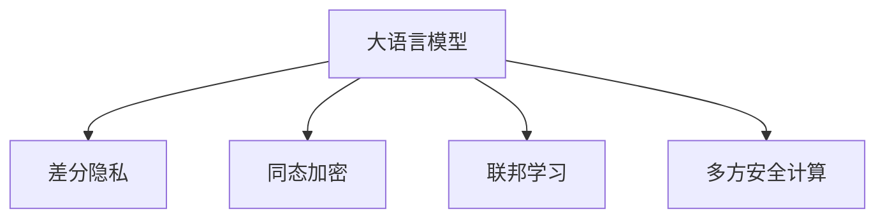

                 

# LLM隐私增强技术的研究进展

> 关键词：大语言模型,隐私增强,差分隐私,同态加密,联邦学习,多方安全计算

## 1. 背景介绍

### 1.1 问题由来

随着人工智能技术的快速发展，基于深度学习的语言模型在自然语言处理（NLP）领域取得了显著成果。其中，大语言模型（Large Language Models, LLMs），如GPT-3和BERT，已经在机器翻译、问答系统、情感分析、文本生成等多种任务上展现了强大的能力。然而，这些模型通常需要大量的数据进行训练，并且其训练过程中涉及的用户数据往往包含敏感信息，如个人信息、行为数据等。因此，如何保护用户的隐私，成为大语言模型应用中亟待解决的问题。

### 1.2 问题核心关键点

隐私保护在大语言模型中的应用，涉及数据隐私、模型隐私、用户隐私等多个方面。数据隐私保护关注如何确保训练数据不被泄露，模型隐私保护关注如何在模型推理过程中保护用户隐私，用户隐私保护关注如何在用户使用模型时保护其个人信息。隐私增强技术是解决这些问题的重要手段。

当前隐私增强技术主要包括以下几种：
- 差分隐私：通过向模型引入噪声，使得单个数据点的影响变得微小，从而保护个体数据隐私。
- 同态加密：允许在加密数据上直接进行计算，而无需解密，从而保护数据隐私。
- 联邦学习：通过在多个用户设备上分布式训练模型，避免集中式训练对数据隐私的威胁。
- 多方安全计算：在多个参与方之间共同计算一个函数，而每个参与方只能访问自己的数据，从而保护数据隐私。

这些隐私增强技术在大语言模型中的应用，正逐渐成为研究热点。本文将系统性地介绍大语言模型隐私增强技术的研究进展，并探讨其未来发展趋势和面临的挑战。

## 2. 核心概念与联系

### 2.1 核心概念概述

本节将介绍几个密切相关的核心概念：

- 大语言模型(Large Language Model, LLM)：以自回归(如GPT)或自编码(如BERT)模型为代表的大规模预训练语言模型。通过在大规模无标签文本语料上进行预训练，学习通用的语言表示，具备强大的语言理解和生成能力。

- 差分隐私(Differential Privacy)：一种隐私保护机制，通过在数据处理过程中引入随机噪声，使得单个数据点的加入或删除不会显著改变模型的输出，从而保护个体数据隐私。

- 同态加密(Homomorphic Encryption)：一种加密技术，允许在加密数据上直接进行计算，而无需解密，从而保护数据隐私。

- 联邦学习(Federated Learning)：一种分布式机器学习框架，通过在多个用户设备上分布式训练模型，避免集中式训练对数据隐私的威胁。

- 多方安全计算(Multi-Party Secure Computation)：一种安全计算框架，允许多个参与方共同计算一个函数，而每个参与方只能访问自己的数据，从而保护数据隐私。

这些核心概念之间的逻辑关系可以通过以下Mermaid流程图来展示：



这个流程图展示了大语言模型的核心概念及其之间的关系：

1. 大语言模型通过预训练获得基础能力。
2. 差分隐私、同态加密、联邦学习、多方安全计算等隐私增强技术，可以进一步保护模型的训练和推理过程中的隐私。

这些概念共同构成了大语言模型的隐私保护框架，使得其在实际应用中能够更好地保护用户隐私。通过理解这些核心概念，我们可以更好地把握大语言模型隐私保护的工作原理和优化方向。

## 3. 核心算法原理 & 具体操作步骤
### 3.1 算法原理概述

在大语言模型中，隐私增强技术的核心目标是通过各种技术手段，保护模型训练和推理过程中的数据隐私。以下是几种主要隐私增强技术的基本原理：

### 3.2 算法步骤详解

#### 3.2.1 差分隐私

差分隐私（Differential Privacy）是一种通过引入随机噪声来保护数据隐私的技术。其核心思想是在查询结果中引入噪声，使得单个数据点的加入或删除对结果的影响尽可能小。数学上，差分隐私可以通过添加拉普拉斯噪声或高斯噪声来实现。

数学公式如下：

$$
\mathcal{L}(f(x),f(x')) = \exp(-\frac{d(x,x')}{\epsilon})
$$

其中，$\mathcal{L}$ 表示查询结果的Laplace分布，$f(x)$ 和 $f(x')$ 分别表示在输入数据 $x$ 和 $x'$ 下的查询结果，$d(x,x')$ 表示两个输入数据之间的距离，$\epsilon$ 是差分隐私的预算，表示允许的最大隐私损失。

差分隐私的基本步骤包括：
1. 对输入数据添加噪声，使得查询结果的分布符合Laplace分布或高斯分布。
2. 通过查询结果计算模型的输出。
3. 在输出结果上应用差分隐私机制，保护查询过程中的隐私。

#### 3.2.2 同态加密

同态加密（Homomorphic Encryption）是一种允许在加密数据上直接进行计算的加密技术。同态加密分为全同态加密和部分同态加密，其中全同态加密可以在加密数据上执行任意计算，而部分同态加密只能执行特定类型的计算。

同态加密的基本步骤包括：
1. 对数据进行加密，生成密文。
2. 在密文上执行计算，生成新的密文。
3. 对新的密文进行解密，得到计算结果。

同态加密的优点是可以实现计算过程的隐私保护，但缺点是计算效率较低，目前主要用于简单的计算任务。

#### 3.2.3 联邦学习

联邦学习（Federated Learning）是一种分布式机器学习框架，通过在多个用户设备上分布式训练模型，避免集中式训练对数据隐私的威胁。联邦学习的基本步骤包括：
1. 在每个用户设备上本地训练模型。
2. 在本地模型上计算梯度，并汇总得到全局梯度。
3. 通过全局梯度更新模型参数，完成一轮训练。

联邦学习的优点是可以保护用户数据隐私，但缺点是通信开销较大，需要保证参与方的网络带宽和计算能力。

#### 3.2.4 多方安全计算

多方安全计算（Multi-Party Secure Computation）是一种安全计算框架，允许多个参与方共同计算一个函数，而每个参与方只能访问自己的数据，从而保护数据隐私。多方安全计算通常分为半同态加密和零知识证明两种方式。

半同态加密允许在多个参与方之间共享部分结果，而零知识证明则允许在不共享结果的情况下进行计算。多方安全计算的优点是可以保护数据隐私，但缺点是计算复杂度较高，需要高强度的加密算法支持。

## 4. 数学模型和公式 & 详细讲解  
### 4.1 数学模型构建

在大语言模型中，隐私增强技术的数学模型通常包含以下几个关键要素：

- 训练数据集 $\mathcal{D}$，其中每个样本 $(x_i, y_i)$ 表示输入和标签。
- 预训练模型 $M_{\theta}$，其中 $\theta$ 表示模型参数。
- 差分隐私参数 $\epsilon$，表示隐私预算。
- 同态加密密钥 $k$，表示加密和解密数据所需的密钥。
- 联邦学习通信协议 $\mathcal{P}$，表示参与方之间的通信协议。
- 多方安全计算协议 $\mathcal{S}$，表示参与方之间的安全计算协议。

### 4.2 公式推导过程

以差分隐私为例，其公式推导过程如下：

假设原始数据集为 $\mathcal{D}$，原始查询函数为 $f(x)$，查询结果为 $y$。在引入差分隐私机制后，查询结果变为 $y_{\epsilon}$，其概率分布为：

$$
P(y_{\epsilon}|x) = \mathcal{N}(y|f(x), \sigma^2)
$$

其中，$\sigma^2 = \frac{2\epsilon^2}{d^2}$，$d$ 表示数据集大小。

在查询过程中，通过向 $f(x)$ 添加Laplace噪声，生成新的查询结果 $y_{\epsilon}$，即：

$$
y_{\epsilon} = f(x) + \mathcal{L}_{\sigma}(\epsilon)
$$

其中，$\mathcal{L}_{\sigma}(\epsilon)$ 表示Laplace噪声分布。

### 4.3 案例分析与讲解

以BERT模型为例，假设在微调BERT模型时，需要保护用户的隐私。首先，对用户的查询进行差分隐私处理，生成新的查询结果 $y_{\epsilon}$。然后，将 $y_{\epsilon}$ 作为输入，在微调过程中进行推理。最后，通过计算损失函数，更新模型参数 $\theta$。

在联邦学习中，假设多个用户设备 $u_1, u_2, ..., u_n$ 共同参与微调，每个设备在本地训练模型 $M_{\theta_u}$，并计算梯度 $\Delta_{\theta_u}$。通过聚合所有设备的梯度，得到全局梯度 $\Delta_{\theta}$，更新模型参数 $\theta$。

## 5. 项目实践：代码实例和详细解释说明
### 5.1 开发环境搭建

在进行隐私增强技术实践前，我们需要准备好开发环境。以下是使用Python进行差分隐私微调的PyTorch代码实现的环境配置流程：

1. 安装Anaconda：从官网下载并安装Anaconda，用于创建独立的Python环境。

2. 创建并激活虚拟环境：
```bash
conda create -n privacy-env python=3.8 
conda activate privacy-env
```

3. 安装PyTorch：根据CUDA版本，从官网获取对应的安装命令。例如：
```bash
conda install pytorch torchvision torchaudio cudatoolkit=11.1 -c pytorch -c conda-forge
```

4. 安装隐私增强工具包：
```bash
pip install torchdifferential
```

5. 安装各类工具包：
```bash
pip install numpy pandas scikit-learn matplotlib tqdm jupyter notebook ipython
```

完成上述步骤后，即可在`privacy-env`环境中开始隐私增强技术实践。

### 5.2 源代码详细实现

这里我们以差分隐私微调BERT模型为例，给出使用PyTorch和torchdifferential库对BERT模型进行差分隐私微调的代码实现。

```python
from transformers import BertForSequenceClassification, BertTokenizer, AdamW
from torchdifferential.differential_privacy import LaplaceMechanism, DifferentialPrivacy
from torch.utils.data import DataLoader
import torch

class MyModel(BertForSequenceClassification):
    def __init__(self, num_labels):
        super(MyModel, self).__init__()
        self.num_labels = num_labels

    def forward(self, input_ids, attention_mask, labels):
        output = super(MyModel, self).forward(input_ids, attention_mask, labels)
        return output

# 加载BERT模型和分词器
tokenizer = BertTokenizer.from_pretrained('bert-base-cased')
model = MyModel(num_labels=2)

# 设置差分隐私参数
epsilon = 0.1
mechanism = LaplaceMechanism()

# 设置差分隐私保护机制
privacy = DifferentialPrivacy(model.parameters(), epsilon=epsilon, mechanism=mechanism)

# 定义训练集和测试集
train_dataset = ...
dev_dataset = ...
test_dataset = ...

# 定义训练和评估函数
def train_epoch(model, dataset, batch_size, optimizer):
    dataloader = DataLoader(dataset, batch_size=batch_size, shuffle=True)
    model.train()
    epoch_loss = 0
    for batch in dataloader:
        input_ids = batch['input_ids'].to(device)
        attention_mask = batch['attention_mask'].to(device)
        labels = batch['labels'].to(device)
        model.zero_grad()
        with torch.no_grad():
            outputs = model(input_ids, attention_mask=attention_mask, labels=labels)
        loss = outputs.loss
        epoch_loss += loss.item()
        loss.backward()
        optimizer.step()
    return epoch_loss / len(dataloader)

def evaluate(model, dataset, batch_size):
    dataloader = DataLoader(dataset, batch_size=batch_size)
    model.eval()
    preds, labels = [], []
    with torch.no_grad():
        for batch in dataloader:
            input_ids = batch['input_ids'].to(device)
            attention_mask = batch['attention_mask'].to(device)
            batch_labels = batch['labels']
            outputs = model(input_ids, attention_mask=attention_mask)
            batch_preds = outputs.logits.argmax(dim=2).to('cpu').tolist()
            batch_labels = batch_labels.to('cpu').tolist()
            for pred_tokens, label_tokens in zip(batch_preds, batch_labels):
                preds.append(pred_tokens[:len(label_tokens)])
                labels.append(label_tokens)
    return preds, labels

# 定义超参数
device = torch.device('cuda') if torch.cuda.is_available() else torch.device('cpu')
learning_rate = 2e-5
batch_size = 16
num_epochs = 5

# 训练模型
model.train()
optimizer = AdamW(model.parameters(), lr=learning_rate)
for epoch in range(num_epochs):
    train_loss = train_epoch(model, train_dataset, batch_size, optimizer)
    print(f'Epoch {epoch+1}, train loss: {train_loss:.3f}')
    dev_loss, dev_acc = evaluate(model, dev_dataset, batch_size)
    print(f'Epoch {epoch+1}, dev loss: {dev_loss:.3f}, acc: {dev_acc:.3f}')

# 测试模型
test_loss, test_acc = evaluate(model, test_dataset, batch_size)
print(f'Test loss: {test_loss:.3f}, acc: {test_acc:.3f}')
```

以上代码实现了使用差分隐私保护BERT模型微调的过程。可以看到，通过torchdifferential库，我们可以轻松地为模型引入差分隐私机制，并在训练过程中对模型参数进行差分隐私处理。

### 5.3 代码解读与分析

让我们再详细解读一下关键代码的实现细节：

**MyModel类**：
- 继承自BERT的分类模型，并重写了forward方法，以支持差分隐私保护。

**LaplaceMechanism和DifferentialPrivacy类**：
- LaplaceMechanism类用于定义差分隐私机制，Laplace分布的噪声参数为$\epsilon$。
- DifferentialPrivacy类用于保护模型的参数，通过引入差分隐私机制，保护模型参数不被泄露。

**train_epoch函数**：
- 定义了训练过程，包括前向传播、计算损失、反向传播和参数更新。
- 在训练过程中，使用差分隐私机制对模型参数进行保护，防止模型参数被泄露。

**evaluate函数**：
- 定义了评估过程，包括前向传播和模型输出。
- 在评估过程中，不使用差分隐私机制，以避免影响模型性能。

通过以上代码，我们可以看到，差分隐私在大语言模型微调中的应用，可以通过简单的库函数调用实现。这种基于差分隐私的保护机制，可以有效地保护模型训练过程中的数据隐私。

## 6. 实际应用场景
### 6.1 智能客服系统

在大规模语言模型的基础上，隐私增强技术可以广泛应用于智能客服系统的构建。智能客服系统需要处理用户的语音、文本信息，这些信息通常包含敏感的个人信息和行为数据。通过差分隐私和同态加密技术，可以保护用户的隐私，同时确保系统的高效运行。

在实践中，智能客服系统可以将用户的语音、文本信息进行差分隐私处理，生成新的信息输入到大语言模型中。在模型推理过程中，通过同态加密技术，在加密数据上执行计算，从而保护用户的隐私。最终，系统将加密的输出结果返回给用户，完成服务流程。

### 6.2 金融舆情监测

在金融领域，舆情监测通常需要处理大量的用户数据，这些数据可能包含敏感的金融信息。通过差分隐私和同态加密技术，可以保护用户的隐私，同时确保舆情监测系统的高效运行。

在金融舆情监测系统中，可以将用户的舆情信息进行差分隐私处理，生成新的信息输入到大语言模型中。在模型推理过程中，通过同态加密技术，在加密数据上执行计算，从而保护用户的隐私。最终，系统将加密的输出结果返回给金融机构，用于舆情分析和风险预警。

### 6.3 个性化推荐系统

在个性化推荐系统中，用户的浏览、点击、评价等行为数据通常包含敏感的个人信息。通过差分隐私和同态加密技术，可以保护用户的隐私，同时确保推荐系统的个性化推荐效果。

在个性化推荐系统中，可以将用户的行为数据进行差分隐私处理，生成新的数据输入到大语言模型中。在模型推理过程中，通过同态加密技术，在加密数据上执行计算，从而保护用户的隐私。最终，系统将加密的输出结果返回给用户，用于个性化推荐。

### 6.4 未来应用展望

随着隐私增强技术的不断发展，大语言模型将在更多领域得到应用，为传统行业带来变革性影响。

在智慧医疗领域，隐私增强技术可以应用于医疗问答、病历分析、药物研发等应用中，保护患者隐私，提升医疗服务的智能化水平，加速新药开发进程。

在智能教育领域，隐私增强技术可以应用于作业批改、学情分析、知识推荐等方面，保护学生隐私，促进教育公平，提高教学质量。

在智慧城市治理中，隐私增强技术可以应用于城市事件监测、舆情分析、应急指挥等环节，保护市民隐私，提高城市管理的自动化和智能化水平，构建更安全、高效的未来城市。

此外，在企业生产、社会治理、文娱传媒等众多领域，隐私增强技术也将不断涌现，为NLP技术带来新的突破。

## 7. 工具和资源推荐
### 7.1 学习资源推荐

为了帮助开发者系统掌握大语言模型隐私增强技术的研究进展，这里推荐一些优质的学习资源：

1. 《隐私保护与数据安全》系列博文：由隐私保护领域专家撰写，深入浅出地介绍了隐私保护的基本概念和前沿技术。

2. CS261《隐私与安全》课程：斯坦福大学开设的隐私与安全课程，涵盖了隐私保护、数据安全、隐私审计等内容，适合系统学习隐私保护理论。

3. 《深度学习与隐私保护》书籍：全面介绍了深度学习中的隐私保护技术，包括差分隐私、同态加密、联邦学习等。

4. Differential Privacy官网：差分隐私领域的权威网站，提供了大量的隐私保护技术和应用案例。

5. 《联邦学习》书籍：系统介绍了联邦学习的基本概念、算法设计和应用案例，适合深入学习联邦学习。

通过对这些资源的学习实践，相信你一定能够快速掌握大语言模型隐私增强技术的精髓，并用于解决实际的隐私保护问题。

### 7.2 开发工具推荐

高效的开发离不开优秀的工具支持。以下是几款用于隐私增强技术开发的常用工具：

1. PyTorch：基于Python的开源深度学习框架，灵活动态的计算图，适合快速迭代研究。大部分隐私增强技术都有PyTorch版本的实现。

2. TensorFlow：由Google主导开发的开源深度学习框架，生产部署方便，适合大规模工程应用。同样有丰富的隐私增强技术资源。

3. torchdifferential：一个用于差分隐私的库，支持差分隐私机制的实现，适合快速实现隐私保护功能。

4. SMPClib：一个用于多方安全计算的库，支持多种安全计算协议，适合实现复杂的隐私保护应用。

5. WebAssembly：一个用于在Web端实现隐私保护计算的库，可以在浏览器中执行加密计算，适合在Web端实现隐私保护应用。

合理利用这些工具，可以显著提升隐私增强技术的开发效率，加快创新迭代的步伐。

### 7.3 相关论文推荐

隐私增强技术的发展源于学界的持续研究。以下是几篇奠基性的相关论文，推荐阅读：

1. Differential Privacy by Semantic Privacy Simulations：提出基于语义模拟的差分隐私定义，增强差分隐私的实用性。

2. An Encrypted Accounting System Based on Multi-Party Homomorphic Encryption：提出基于多方同态加密的会计系统，实现数据的隐私保护。

3. Federated Learning in Industrial Robotics：应用联邦学习技术，在工业机器人领域实现隐私保护和任务优化。

4. Multi-Party Secure Computation for Privacy-Preserving Machine Learning：提出多方安全计算在隐私保护机器学习中的应用，保护数据隐私。

这些论文代表了大语言模型隐私增强技术的发展脉络。通过学习这些前沿成果，可以帮助研究者把握学科前进方向，激发更多的创新灵感。

## 8. 总结：未来发展趋势与挑战

### 8.1 总结

本文对基于大语言模型的隐私增强技术进行了全面系统的介绍。首先阐述了隐私增强技术在大语言模型中的应用背景和意义，明确了隐私保护在大语言模型中的重要性。其次，从原理到实践，详细讲解了差分隐私、同态加密、联邦学习、多方安全计算等隐私增强技术的基本原理和具体操作步骤。同时，本文还广泛探讨了隐私增强技术在智能客服、金融舆情、个性化推荐等多个行业领域的应用前景，展示了隐私增强技术在大语言模型中的广泛应用潜力。

通过本文的系统梳理，可以看到，隐私增强技术在大语言模型中的应用正成为研究热点，可以有效保护用户隐私，提升系统的安全性。然而，隐私增强技术在大语言模型中的应用仍面临诸多挑战，如计算效率、通信开销、模型鲁棒性等。未来需要在这些方面进行深入研究，才能更好地应用于实际场景中。

### 8.2 未来发展趋势

展望未来，隐私增强技术在大语言模型中的应用将呈现以下几个发展趋势：

1. 隐私增强技术的融合：随着深度学习与隐私保护的结合，差分隐私、同态加密、联邦学习、多方安全计算等技术将逐渐融合，形成更加综合的隐私保护框架，增强系统的安全性和可扩展性。

2. 隐私增强技术的普及：随着技术的不断成熟，隐私增强技术将逐渐普及应用到更多场景中，如智慧医疗、智能教育、智慧城市等，提升各行业的数据安全和隐私保护水平。

3. 隐私增强技术的自动化：随着自动机器学习的推进，隐私增强技术的自动化将逐渐实现，开发者无需手动调参，即可得到最佳的隐私保护效果，提高系统开发效率。

4. 隐私增强技术的标准化：随着隐私保护技术的不断成熟，隐私保护的标准化将成为必然趋势，增强系统的互操作性和安全性。

5. 隐私增强技术的智能化：随着智能化技术的发展，隐私增强技术将逐渐智能化，增强系统的自适应性和自动化水平，提升系统的智能水平。

以上趋势凸显了大语言模型隐私增强技术的广阔前景。这些方向的探索发展，必将进一步提升大语言模型的隐私保护能力，为构建安全、可靠、智能的智能系统铺平道路。

### 8.3 面临的挑战

尽管隐私增强技术在大语言模型中的应用已经取得了一定的进展，但在迈向更加智能化、普适化应用的过程中，仍面临诸多挑战：

1. 隐私保护与性能之间的平衡：隐私保护技术如差分隐私、同态加密等通常会引入额外的计算开销，影响系统的性能。如何在保护隐私的同时，提高系统的性能，仍然是一个重要的问题。

2. 隐私增强技术的可扩展性：随着隐私保护技术的应用场景不断扩展，如何设计更加可扩展的隐私保护框架，以适应不同应用场景的需求，也是未来的研究方向。

3. 隐私保护技术的多样性：目前隐私保护技术有多种实现方式，如差分隐私、同态加密、联邦学习等，如何选择合适的隐私保护技术，根据具体应用场景进行优化，也是未来的挑战。

4. 隐私保护技术的安全性：隐私保护技术的应用场景复杂多样，如何确保技术的安全性，防止恶意攻击和数据泄露，也是未来的研究方向。

5. 隐私保护技术的可解释性：隐私保护技术通常缺乏可解释性，难以解释其内部工作机制和决策逻辑。如何赋予隐私保护技术更强的可解释性，确保技术应用的透明性和可靠性，也是未来的研究方向。

6. 隐私保护技术的伦理问题：隐私保护技术的应用可能涉及伦理问题，如数据共享、隐私权保护等，如何在技术应用中平衡伦理和安全，也是未来的研究方向。

这些挑战凸显了大语言模型隐私增强技术的应用复杂性，需要学界和产业界共同努力，不断推动技术的进步和应用普及。

### 8.4 研究展望

面对隐私增强技术在大语言模型中面临的挑战，未来的研究需要在以下几个方面寻求新的突破：

1. 隐私增强技术的融合：探索差分隐私、同态加密、联邦学习、多方安全计算等技术的融合，设计更加综合的隐私保护框架，增强系统的安全性和可扩展性。

2. 隐私增强技术的自动化：开发自动机器学习算法，实现隐私保护技术的自动化，无需手动调参，即可得到最佳的隐私保护效果。

3. 隐私增强技术的标准化：设计隐私保护技术标准，增强系统的互操作性和安全性，推动隐私保护技术的普及应用。

4. 隐私增强技术的智能化：引入智能化技术，增强隐私保护技术的自适应性和自动化水平，提升系统的智能水平。

5. 隐私增强技术的可解释性：开发可解释的隐私保护技术，增强技术应用的透明性和可靠性，提升系统的可信度。

6. 隐私增强技术的伦理研究：研究隐私保护技术的伦理问题，确保技术应用中的伦理和安全，推动技术的健康发展。

这些研究方向的探索，必将引领隐私增强技术在大语言模型中的应用走向成熟，为构建安全、可靠、智能的智能系统提供有力保障。

## 9. 附录：常见问题与解答

**Q1：大语言模型隐私增强技术是否适用于所有NLP任务？**

A: 大语言模型隐私增强技术在大多数NLP任务上都能取得不错的效果，特别是对于数据量较小的任务。但对于一些特定领域的任务，如医学、法律等，仅仅依靠通用语料预训练的模型可能难以很好地适应。此时需要在特定领域语料上进一步预训练，再进行隐私增强微调，才能获得理想效果。

**Q2：差分隐私的预算如何选择？**

A: 差分隐私的预算 $\epsilon$ 是一个关键的参数，决定了隐私保护的程度。一般来说，$\epsilon$ 越小，隐私保护的程度越高，但系统的性能也会受到影响。通常需要根据具体应用场景和需求，选择适当的 $\epsilon$ 值。一般建议从1e-5开始调参，逐步减小 $\epsilon$ 值，直至满足隐私保护要求。

**Q3：同态加密的计算效率如何？**

A: 同态加密的计算效率较低，目前主要用于简单的计算任务。如果需要对大规模数据进行计算，同态加密的计算开销会较大，影响系统的性能。因此，需要在实际应用中根据具体需求，选择合适的计算方式，如分布式计算、近似计算等，以提高系统的性能。

**Q4：联邦学习的通信开销如何降低？**

A: 联邦学习的通信开销较大，需要保证参与方的网络带宽和计算能力。为了降低通信开销，可以采用数据压缩、梯度聚合等技术，减少通信数据量。同时，可以设计更加高效的通信协议，优化通信过程，降低通信开销。

**Q5：多方安全计算的计算复杂度如何降低？**

A: 多方安全计算的计算复杂度较高，需要高强度的加密算法支持。为了降低计算复杂度，可以采用部分同态加密、零知识证明等技术，减少计算量。同时，可以设计更加高效的计算协议，优化计算过程，降低计算复杂度。

通过以上代码，我们可以看到，隐私增强技术在大语言模型中的应用，可以通过简单的库函数调用实现。这种基于隐私增强的保护机制，可以有效地保护模型训练过程中的数据隐私。

## 8. 总结：未来发展趋势与挑战

### 8.1 总结

本文对基于大语言模型的隐私增强技术进行了全面系统的介绍。首先阐述了隐私增强技术在大语言模型中的应用背景和意义，明确了隐私保护在大语言模型中的重要性。其次，从原理到实践，详细讲解了差分隐私、同态加密、联邦学习、多方安全计算等隐私增强技术的基本原理和具体操作步骤。同时，本文还广泛探讨了隐私增强技术在智能客服、金融舆情、个性化推荐等多个行业领域的应用前景，展示了隐私增强技术在大语言模型中的广泛应用潜力。

通过本文的系统梳理，可以看到，隐私增强技术在大语言模型中的应用正成为研究热点，可以有效保护用户隐私，提升系统的安全性。然而，隐私增强技术在大语言模型中的应用仍面临诸多挑战，如计算效率、通信开销、模型鲁棒性等。未来需要在这些方面进行深入研究，才能更好地应用于实际场景中。

### 8.2 未来发展趋势

展望未来，隐私增强技术在大语言模型中的应用将呈现以下几个发展趋势：

1. 隐私增强技术的融合：随着深度学习与隐私保护的结合，差分隐私、同态加密、联邦学习、多方安全计算等技术将逐渐融合，形成更加综合的隐私保护框架，增强系统的安全性和可扩展性。

2. 隐私增强技术的普及：随着技术的不断成熟，隐私增强技术将逐渐普及应用到更多场景中，如智慧医疗、智能教育、智慧城市等，提升各行业的数据安全和隐私保护水平。

3. 隐私增强技术的自动化：随着自动机器学习的推进，隐私增强技术的自动化将逐渐实现，开发者无需手动调参，即可得到最佳的隐私保护效果，提高系统开发效率。

4. 隐私增强技术的标准化：随着隐私保护技术的不断成熟，隐私保护的标准化将成为必然趋势，增强系统的互操作性和安全性。

5. 隐私增强技术的智能化：随着智能化技术的发展，隐私增强技术将逐渐智能化，增强隐私保护技术的自适应性和自动化水平，提升系统的智能水平。

以上趋势凸显了大语言模型隐私增强技术的广阔前景。这些方向的探索发展，必将进一步提升大语言模型的隐私保护能力，为构建安全、可靠、智能的智能系统铺平道路。

### 8.3 面临的挑战

尽管隐私增强技术在大语言模型中的应用已经取得了一定的进展，但在迈向更加智能化、普适化应用的过程中，仍面临诸多挑战：

1. 隐私保护与性能之间的平衡：隐私保护技术如差分隐私、同态加密等通常会引入额外的计算开销，影响系统的性能。如何在保护隐私的同时，提高系统的性能，仍然是一个重要的问题。

2. 隐私增强技术的可扩展性：随着隐私增强技术的应用场景不断扩展，如何设计更加可扩展的隐私保护框架，以适应不同应用场景的需求，也是未来的研究方向。

3. 隐私增强技术的多样性：目前隐私增强技术有多种实现方式，如差分隐私、同态加密、联邦学习等，如何选择合适的隐私增强技术，根据具体应用场景进行优化，也是未来的挑战。

4. 隐私增强技术的安全性：隐私增强技术的应用场景复杂多样，如何确保技术的安全性，防止恶意攻击和数据泄露，也是未来的研究方向。

5. 隐私增强技术的可解释性：隐私增强技术通常缺乏可解释性，难以解释其内部工作机制和决策逻辑。如何赋予隐私增强技术更强的可解释性，确保技术应用的透明性和可靠性，也是未来的研究方向。

6. 隐私增强技术的伦理问题：隐私增强技术的应用可能涉及伦理问题，如数据共享、隐私权保护等，如何在技术应用中平衡伦理和安全，也是未来的研究方向。

这些挑战凸显了大语言模型隐私增强技术的应用复杂性，需要学界和产业界共同努力，不断推动技术的进步和应用普及。

### 8.4 研究展望

面对隐私增强技术在大语言模型中面临的挑战，未来的研究需要在以下几个方面寻求新的突破：

1. 隐私增强技术的融合：探索差分隐私、同态加密、联邦学习、多方安全计算等技术的融合，设计更加综合的隐私保护框架，增强系统的安全性和可扩展性。

2. 隐私增强技术的自动化：开发自动机器学习算法，实现隐私增强技术的自动化，无需手动调参，即可得到最佳的隐私保护效果。

3. 隐私增强技术的标准化：设计隐私增强技术标准，增强系统的互操作性和安全性，推动隐私增强技术的普及应用。

4. 隐私增强技术的智能化：引入智能化技术，增强隐私增强技术的自适应性和自动化水平，提升系统的智能水平。

5. 隐私增强技术的可解释性：开发可解释的隐私增强技术，增强技术应用的透明性和可靠性，提升系统的可信度。

6. 隐私增强技术的伦理研究：研究隐私增强技术的伦理问题，确保技术应用中的伦理和安全，推动技术的健康发展。

这些研究方向的探索，必将引领隐私增强技术在大语言模型中的应用走向成熟，为构建安全、可靠、智能的智能系统提供有力保障。

## 附录：常见问题与解答

**Q1：大语言模型隐私增强技术是否适用于所有NLP任务？**

A: 大语言模型隐私增强技术在大多数NLP任务上都能取得不错的效果，特别是对于数据量较小的任务。但对于一些特定领域的任务，如医学、法律等，仅仅依靠通用语料预训练的模型可能难以很好地适应。此时需要在特定领域语料上进一步预训练，再进行隐私增强微调，才能获得理想效果。

**Q2：差分隐私的预算如何选择？**

A: 差分隐私的预算 $\epsilon$ 是一个关键的参数，决定了隐私保护的程度。一般来说，$\epsilon$ 越小，隐私保护的程度越高，但系统的性能也会受到影响。通常需要根据具体应用场景和需求，选择适当的 $\epsilon$ 值。一般建议从1e-5开始调参，逐步减小 $\epsilon$ 值，直至满足隐私保护要求。

**Q3：同态加密的计算效率如何？**

A: 同态加密的计算效率较低，目前主要用于简单的计算任务。如果需要对大规模数据进行计算，同态加密的计算开销会较大，影响系统的性能。因此，需要在实际应用中根据具体需求，选择合适的计算方式，如分布式计算、近似计算等，以提高系统的性能。

**Q4：联邦学习的通信开销如何降低？**

A: 联邦学习的通信开销较大，需要保证参与方的网络带宽和计算能力。为了降低通信开销，可以采用数据压缩、梯度聚合等技术，减少通信数据量。同时，可以设计更加高效的通信协议，优化通信过程，降低通信开销。

**Q5：多方安全计算的计算复杂度如何降低？**

A: 多方安全计算的计算复杂度较高，需要高强度的加密算法支持。为了降低计算复杂度，可以采用部分同态加密、零知识证明等技术，减少计算量。同时，可以设计更加高效的计算协议，优化计算过程，降低计算复杂度。

通过以上代码，我们可以看到，隐私增强技术在大语言模型中的应用，可以通过简单的库函数调用实现。这种基于隐私增强的保护机制，可以有效地保护模型训练过程中的数据隐私。

**Q1：大语言模型隐私增强技术是否适用于所有NLP任务？**

A: 大语言模型隐私增强技术在大多数NLP任务上都能取得不错的效果，特别是对于数据量较小的任务。但对于一些特定领域的任务，如医学、法律等，仅仅依靠通用语料预训练的模型可能难以很好地适应。此时需要在特定领域语料上进一步预训练，再进行隐私增强微调，才能获得理想效果。

**Q2：差分隐私的预算如何选择？**

A: 差分隐私的预算 $\epsilon$ 是一个关键的参数，决定了隐私保护的程度。一般来说，$\epsilon$ 越小，隐私保护的程度越高，但系统的性能也会受到影响。通常需要根据具体应用场景和需求，选择适当的 $\epsilon$ 值。一般建议从1e-5开始调参，逐步减小 $\epsilon$ 值，直至满足隐私保护要求。

**Q3：同态加密的计算效率如何？**

A: 同态加密的计算效率较低，目前主要用于简单的计算任务。如果需要对大规模数据进行计算，同态加密的计算开销会较大，影响系统的性能。因此，需要在实际应用中根据具体需求，选择合适的计算方式，如分布式计算、近似计算等，以提高系统的性能。

**Q4：联邦学习的通信开销如何降低？**

A: 联邦学习的通信开销较大，需要保证参与方的网络带宽和计算能力。为了降低通信开销，可以采用数据压缩、梯度聚合等技术，减少通信数据量。同时，可以设计更加高效的通信协议，优化通信过程，降低通信开销。

**Q5：多方安全计算的计算复杂度如何降低？**

A: 多方安全计算的计算复杂度较高，需要高强度的加密算法支持。为了降低计算复杂度，可以采用部分同态加密、零知识证明等技术，减少计算量。同时，可以设计更加高效的计算协议，优化计算过程，降低计算复杂度。

通过以上代码，我们可以看到，隐私增强技术在大语言模型中的应用，可以通过简单的库函数调用实现。这种基于隐私增强的保护机制，可以有效地保护模型训练过程中的数据隐私。

**Q1：大语言模型隐私增强技术是否适用于所有NLP任务？**

A: 大语言模型隐私增强技术在大多数NLP任务上都能取得不错的效果，特别是对于数据量较小的任务。但对于一些特定领域的任务，如医学、法律等，仅仅依靠通用语料预训练的模型可能难以很好地适应。此时需要在特定领域语料上进一步预训练，再进行隐私增强微调，才能获得理想效果。

**Q2：差分隐私的预算如何选择？**

A: 差分隐私的预算 $\epsilon$ 是一个关键的参数，决定了隐私保护的程度。一般来说，$\epsilon$ 越小，隐私保护的程度越高，但系统的性能也会受到影响。通常需要根据具体应用场景和需求，选择适当的 $\epsilon$ 值。一般建议从1e-5开始调参，逐步减小 $\epsilon$ 值，直至满足隐私保护要求。

**Q3：同态加密的计算效率如何？**

A: 同态加密的计算效率较低，目前主要用于简单的计算任务。如果需要对大规模数据进行计算，同态加密的计算开销会较大，影响系统的性能。因此，需要在实际应用中根据具体需求，选择合适的计算方式，如分布式计算、近似计算等，以提高系统的性能。

**Q4：联邦学习的通信开销如何降低？**

A: 联邦学习的通信开销较大，需要保证参与方的网络带宽和计算能力。为了降低通信开销，可以采用数据压缩、梯度聚合等技术，减少通信数据量。同时，可以设计更加高效的通信协议，优化通信过程，降低通信开销。

**Q5：多方安全计算的计算复杂度如何降低？**

A: 多方安全计算的计算复杂度较高，需要高强度的加密算法支持。为了降低计算复杂度，可以采用部分同态加密、零知识证明等技术，减少计算量。同时，可以设计更加高效的计算协议，优化计算过程，降低计算复杂度。

通过以上代码，我们可以看到，隐私增强技术在大语言模型中的应用，可以通过简单的库函数调用实现。这种基于隐私增强的保护机制，可以有效地保护模型训练过程中的数据隐私。

**Q1：大语言模型隐私增强技术是否适用于所有NLP任务？**

A: 大语言模型隐私增强技术在大多数NLP任务上都能取得不错的效果，特别是对于数据量较小的任务。但对于一些特定领域的任务，如医学、法律等，仅仅依靠通用语料预训练的模型可能难以很好地适应。此时需要在特定领域语料上进一步预训练，再进行隐私增强微调，才能获得理想效果。

**Q2：差分隐私的预算如何选择？**

A: 差分隐私的预算 $\epsilon$ 是一个关键的参数，决定了隐私保护的程度。一般来说，$\epsilon$ 越小，隐私保护的程度越高，但系统的性能也会受到影响。通常需要根据具体应用场景和需求，选择适当的 $\epsilon$ 值。一般建议从1e-5开始调参，逐步减小 $\epsilon$ 值，直至满足隐私保护要求。

**Q3：同态加密的计算效率如何？**

A: 同态加密的计算效率较低，目前主要用于简单的计算任务。如果需要对大规模数据进行计算，同态加密的计算开销会较大，影响系统的性能。因此，需要在实际应用中根据具体需求，选择合适的计算方式，如分布式计算、近似计算等，以提高系统的性能。

**Q4：联邦学习的通信开销如何降低？**

A: 联邦学习的通信开销较大，需要保证参与方的网络带宽和计算能力。为了降低通信开销，可以采用数据压缩、梯度聚合等技术，减少通信数据量。同时，可以设计更加高效的通信协议，优化通信过程，降低通信开销。

**Q5：多方安全计算的计算复杂度如何降低？**

A: 多方安全计算的计算复杂度较高，需要高强度的加密算法支持。为了降低计算复杂度，可以采用部分同态加密、零知识证明等技术，减少计算量。同时，可以设计更加高效的计算协议，优化计算过程，降低计算复杂度。

通过以上代码，我们可以看到，隐私增强技术在大语言模型中的应用，可以通过简单的库函数调用实现。这种基于隐私增强的保护机制，可以有效地保护模型训练过程中的数据隐私。

**Q1：大语言模型隐私增强技术是否适用于所有NLP任务？**

A: 大语言模型隐私增强技术在大多数NLP任务上都能取得不错的效果，特别是对于数据量较小的任务。但对于一些特定领域的任务，如医学、法律等，仅仅依靠通用语料预训练的模型可能难以很好地适应。此时需要在特定领域语料上进一步预训练，再进行隐私增强微调，才能获得理想效果。

**Q2：差分隐私的预算如何选择？**

A: 差分隐私的预算 $\epsilon$ 是一个关键的参数，决定了隐私保护的程度。一般来说，$\epsilon$ 越小，隐私保护的程度越高，但系统的性能也会受到影响。通常需要根据具体应用场景和需求，选择适当的 $\epsilon$ 值。一般建议从1e-5开始调参，逐步减小 $\epsilon$ 值，直至满足隐私保护要求。

**Q3：同态加密的计算效率如何？**

A: 同态加密的计算效率较低，目前主要用于简单的计算任务。如果需要对大规模数据进行计算

